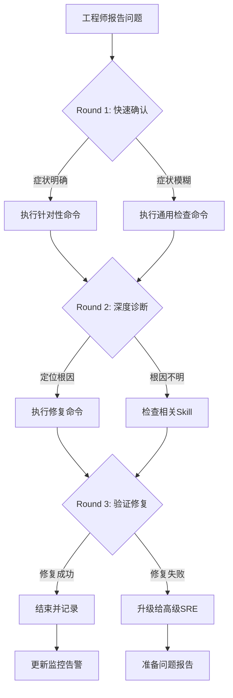

# K8s RBAC & Quota Failure 诊断与修复

RBAC 和 ResourceQuota 问题是 [[Kubernetes|Kubernetes]] 中导致 Pod 创建失败、应用功能异常的常见根因。权限配置错误可能在 CI/CD 发布、新服务部署、集群升级后暴露。

本 [[SKILL|Skill]] 覆盖 RBAC 权限不足、ResourceQuota 超限、ServiceAccount 缺失等全部常见根因的诊断和修复。

## 何时使用此 Skill

| 症状 | 检测方法 | 置信度 |
|------|---------|--------|
| Pod 事件显示 `forbidden` | `kubectl describe pod <pod>` Events | 0.95 |
| API 调用返回 403 | 应用日志或 kubectl 输出 | 0.95 |
| `ResourceQuota exceeded` 事件 | `kubectl get events --field-selector reason=FailedCreate` | 0.90 |
| ServiceAccount 不存在 | `kubectl get sa -n <ns>` | 0.95 |
| ClusterRoleBinding 缺失 | `kubectl get clusterrolebinding` | 0.85 |

**排除条件**: 网络不通 → SKILL-NET-001; 节点问题 → SKILL-NODE-001

## 快速分级（2 分钟内完成）

```
影响范围
├── 核心服务无法创建 Pod ──────→ P0（15min 内修复）
├── CI/CD 流水线失败 ──────────→ P1（30min 内修复）
├── 新服务首次部署失败 ────────→ P2（2h 内修复）
└── 测试环境权限问题 ──────────→ P3（4h 内处理）
```

**立即升级条件**:
- 核心服务 ServiceAccount 被误删除
- ClusterRole 被误修改导致多个服务受影响
- 安全事件怀疑权限提升攻击

## 执行流程

```
工单/告警触发
    │
    ▼
┌──────────────┐    脚本: scripts/diagnose-quick.sh
│ Phase 1      │    内容: kubectl 快速检查（只读）
│ 快速检查      │    Step: D1.1-D1.5
└──────┬───────┘
       │ 确认根因
       ▼
┌──────────────┐    参考: reference/remediation-playbook.md
│ 修复操作      │    风险: LOW → MEDIUM → HIGH
│ REM-001~006  │
└──────┬───────┘
       │
       ▼
┌──────────────┐    脚本: scripts/verify-rbac.sh
│ 验证确认      │    检查: 权限/配额/事件
└──────────────┘
```

## 可用脚本

| 脚本 | 用途 | 参数 | 风险 |
|------|------|------|------|
| `scripts/diagnose-quick.sh` | kubectl 快速诊断 | `NAMESPACE` `RESOURCE_TYPE` `RESOURCE_NAME` | 只读 |
| `scripts/verify-rbac.sh` | 修复后验证 | `NAMESPACE` `SERVICE_ACCOUNT` | 只读 |

## 根因概览 (6 种)

| RC ID | 根因 | 概率 | 首选修复 | 风险 |
|-------|------|------|---------|------|
| RC-001 | Role/ClusterRole 权限不足 | 高 | REM-001 更新 Role | LOW |
| RC-002 | ResourceQuota 超限 | 高 | REM-002 调整配额 | LOW |
| RC-003 | ServiceAccount 不存在 | 中 | REM-003 创建 SA | LOW |
| RC-004 | RoleBinding/ClusterRoleBinding 缺失 | 中 | REM-004 创建 Binding | LOW |
| RC-005 | [[NetworkPolicy|NetworkPolicy]] 阻止 API 访问 | 低 | REM-005 调整策略 | MEDIUM |
| RC-006 | PodSecurityPolicy/Admission 拒绝 | 中 | REM-006 调整策略 | HIGH |

## 关联资源

| 资源 | 路径 |
|------|------|
| 修复操作手册 | [reference/remediation-playbook.md](./reference/remediation-playbook.md) |
| 单文件完整版 | [../09-rbac-quota-failure.md](../09-rbac-quota-failure.md) |

## Related

- KuDig Doctor — 身份标识 & Access 知识图谱索引


## 远程顾问信息收集

> 作为远程顾问，我**无法直接连接你的集群**。请帮我收集以下信息，我会根据你提供的内容给出准确的诊断建议。

### 第一步：快速确认（30 秒内回答）

1. **影响范围**：这个问题影响多少个节点 / Pod / 命名空间？
2. **紧急程度**：业务是否已中断？是否有用户投诉？
3. **发生时间**：问题是突然发生还是逐渐恶化？最近是否有变更？

### 第二步：关键信息（请提供你能获取的）

4. **kubectl 版本**：`kubectl version --short` 的输出
5. **K8s 集群版本**：`kubectl get nodes -o wide` 中的 VERSION 列
6. **节点状态**：控制平面节点是否正常？工作节点是否正常？

### 第三步：诊断信息（按需补充）

> 如果以下命令你无法执行，请直接告诉我「无法执行」，我会提供替代方案。

7. **相关组件日志**：`kubectl logs -n <namespace> <pod>` 的最后 30 行
8. **节点资源**：`kubectl top nodes` 或 `kubectl describe node <node>` 的 Capacity/Allocated resources
9. **近期变更**：最近 24 小时是否有部署、扩缩容、配置变更？

### 如果信息不足

如果你目前只能提供部分信息，**请从第一步开始**。我会根据已有信息先给出初步判断，并告诉你还需要收集什么。

> **替代沟通方式**：如果你不方便执行命令，也可以直接描述你看到的页面/告警内容，我会帮你解读。


## 命令替代方案

> 如果你无法执行以下命令，请参考对应的替代方案。

### 通用替代方案

| 原命令 | 无法执行的原因 | 替代方案 A | 替代方案 B |
|:---|:---|:---|:---|
| `kubectl get pods` | 无 kubectl 权限 | 通过集群管理控制台查看 Pod 列表 | 请有权限的同事执行并截图 |
| `kubectl logs <pod>` | 无日志权限 | 查看应用自身的日志文件（/var/log/） | 使用日志聚合系统（如 ELK/Loki）查询 |
| `kubectl describe node <node>` | 无节点查看权限 | 查看监控系统的节点仪表盘 | 使用 `kubectl get node -o yaml`（如权限允许） |
| `ssh <node>` | 无法 SSH 到节点 | 使用 `kubectl debug node/<node> -it --image=busybox` | 通过跳板机访问：`ssh -J bastion <node>` |
| `systemctl status kubelet` | 无法进入节点 | 查看节点上的 kubelet 日志：`kubectl logs -n kube-system <kubelet-pod>` | 查看容器运行时日志 |
| `docker/crictl` | 无容器运行时权限 | 使用 `kubectl exec` 进入容器检查 | 查看容器运行时的事件 |

### 如果以上都无法执行

如果你因为安全策略、网络隔离或权限限制无法执行任何诊断命令：

1. **请收集你能访问的任何信息**：
   - 监控系统的截图
   - 告警通知的内容
   - 应用自身的错误页面/日志
   - 最近是否有变更（部署、扩缩容、配置更新）

2. **如果信息严重不足**：
   - 我会根据你描述的症状给出最可能的根因和修复建议
   - 但请注意：**信息不足时建议的置信度会降低**
   - 如果问题影响严重，建议立即升级给有权限的高级 SRE

3. **紧急情况下**：
   - 如果业务已中断且你无法执行任何操作
   - 请立即联系有集群管理员权限的同事
   - 同时可以准备以下信息以便快速交接：
     - 问题发生时间
     - 影响范围
     - 已尝试的操作
     - 当前的任何异常观察

## 异常反馈处理

以下场景工程师可能给出异常反馈，需准备应对：

- **RoleBinding正确但权限仍不足** → 检查是否为ClusterRole与Role混淆

- **ResourceQuota调整后新Pod仍无法创建** → 检查LimitRange约束

- **ServiceAccount Token挂载失败** → 检查TokenRequest配置或手动创建Secret

- **用户权限正常但自动化工具失败** → 检查工具使用的kubeconfig上下文


## 相关Skill交叉引用

本Skill诊断过程中可能涉及的其他Skill：

- [[skills/best-practices/scenarios/security-incident.md|security incident]]

- k8s-namespace-quota


当本Skill的诊断步骤无法定位根因时，建议按上述顺序排查相关Skill。

## 预防性措施

### 权限治理
1. **最小权限原则**：每个角色仅授予必要的verbs和resources
2. **定期审计**：每月执行RBAC审计，清理未使用的角色
3. **临时权限**：所有临时权限设置过期时间
4. **命名空间隔离**：按团队/项目严格隔离Namespace

### 配额规划
```yaml
# 命名空间默认配额
apiVersion: v1
kind: ResourceQuota
metadata:
  name: default-quota
spec:
  hard:
    requests.cpu: "10"
    requests.memory: 20Gi
    limits.cpu: "20"
    limits.memory: 40Gi
    pods: "50"
```

## 诊断决策流程



## 工具速查表

| 工具 | 用途 | 典型命令 |
|:---|:---|:---|
| kubectl | Kubernetes CLI | `kubectl get/describe/logs/exec` |
| jq | JSON处理 | `kubectl get ... -o json \| jq ...` |
| openssl | 证书检查 | `openssl x509 -in <cert> -noout -dates` |
| tcpdump | 网络抓包 | `tcpdump -i any port <port> -n` |
| strace | 系统调用追踪 | `strace -p <pid> -f` |
| iostat/vmstat | IO/内存监控 | `iostat -x 1` |
| journalctl | 系统日志 | `journalctl -u <service> -f` |
| crictl | 容器运行时 | `crictl ps/logs/inspect` |

## 远程顾问执行清单

- [ ] 确认工程师身份和环境访问权限
- [ ] 收集集群版本、发行版、网络拓扑
- [ ] 确认问题影响范围和紧急程度
- [ ] 指导执行Round 1命令并收集输出
- [ ] 分析输出，选择Round 2分支
- [ ] 指导执行Round 2命令并收集输出
- [ ] 定位根因，提供修复方案
- [ ] 指导执行修复命令并验证
- [ ] 确认修复成功，更新相关文档
- [ ] 评估是否需要升级或事后复盘

## 典型生产案例

### 案例一：CI/CD 流水线因 ServiceAccount Token 过期导致全量部署失败
**场景**：某电商公司使用 GitLab CI 部署到 EKS 集群，凌晨所有流水线同时失败，报错 `Unauthorized`。
**症状**：
- GitLab Runner Pod 日志显示 `error: You must be logged in to the server (Unauthorized)`
- kubectl 命令返回 `error: unable to authenticate`
- 影响所有命名空间的部署流水线
**诊断步骤**：
1. 检查 ServiceAccount Secret：`kubectl get secret -n gitlab-runner | grep token`
2. 确认 Token 有效期：`kubectl get secret <token-secret> -o yaml | grep expiration`
3. 检查 ServiceAccount：`kubectl get sa gitlab-runner -n gitlab-runner -o yaml`
4. 查看 API Server 审计日志：`grep "gitlab-runner" /var/log/kubernetes/audit.log | tail -20`
**根因分析**：
- Kubernetes 1.24+ 默认不再自动为 ServiceAccount 创建长期 Token Secret
- 集群从 1.23 升级到 1.28 后，原有的 `gitlab-runner-token-xxx` Secret 已过期
- GitLab Runner 的 kubeconfig 仍引用旧的 Token Secret
**修复方案**：
1. 创建新的长期 Token Secret：
   ```yaml
   apiVersion: v1
   kind: Secret
   metadata:
     name: gitlab-runner-token
     namespace: gitlab-runner
     annotations:
       kubernetes.io/service-account.name: gitlab-runner
   type: kubernetes.io/service-account-token

   ```
2. 更新 GitLab Runner 的 kubeconfig 引用新 Token
3. 验证流水线：`kubectl auth can-i create deployments -n <ns> --as system:serviceaccount:gitlab-runner:gitlab-runner`
**预防措施**：
- 建立 ServiceAccount Token 过期监控告警
- 升级前检查所有自动化工具使用的 ServiceAccount Token 有效期
- 优先使用 `kubectl create token` 临时 Token 或 OIDC 认证替代长期 Token

### 案例二：多租户集群中 Namespace ResourceQuota 配置错误导致业务雪崩
**场景**：某 SaaS 平台为每个租户分配独立 Namespace，某租户大量创建 Job 后触发全集群级联问题。
**症状**：
- 多个租户 Namespace 同时出现 `FailedCreate` 事件
- `kubectl describe resourcequota -n tenant-a` 显示 `pods: 50/50`
- 新 Pod 创建失败，报错 `exceeded quota: pods`
- 部分正在运行的 Pod 因依赖服务无法创建新实例而功能异常
**诊断步骤**：
1. 检查各 Namespace ResourceQuota：`kubectl get resourcequota --all-namespaces`
2. 查看实际资源使用：`kubectl describe resourcequota -n <ns>`
3. 检查 LimitRange：`kubectl get limitrange -n <ns>`
4. 分析 Pod 创建来源：`kubectl get jobs -n <ns>` 和 `kubectl get cronjobs -n <ns>`
**根因分析**：
- 租户 A 的 CronJob 配置错误，每分钟创建大量 Job，Job 完成后 Pod 残留
- ResourceQuota 的 `pods` 配额未区分 running/completed Pod
- 集群未配置 `ttlSecondsAfterFinished` 自动清理已完成 Job
- 连锁反应：租户 A 占满配额后，其他租户不受影响，但平台监控误报
**修复方案**：
1. 紧急清理已完成 Pod：

> ⚠️ **🟡 中危变更** — 变更集群资源状态，建议先 --dry-run 或 diff 确认
> - `kubectl delete`：删除资源（可由声明式清单重建）

   ```bash
   kubectl delete pods -n tenant-a --field-selector=status.phase=Succeeded
   kubectl delete pods -n tenant-a --field-selector=status.phase=Failed

   ```
2. 为 CronJob 添加 `ttlSecondsAfterFinished: 3600`
3. 调整 ResourceQuota 策略，区分 `pods` 和 `services` 等配额
4. 平台级：为所有 CronJob 添加默认 `ttlSecondsAfterFinished`
**预防措施**：
- 所有 CronJob/Job 必须配置 `ttlSecondsAfterFinished`
- ResourceQuota 按业务类型分层设置（核心服务/普通服务/批处理）
- 监控 completed Pod 数量，设置告警阈值

### 案例三：集群升级后 PodSecurity 准入策略阻止已有应用部署
**场景**：某公司将集群从 1.24 升级到 1.28，升级后部分应用无法更新 Deployment。
**症状**：
- `kubectl apply` 返回 `Error from server (Forbidden): pods "xxx" is forbidden: violates PodSecurity "restricted:latest"`
- 仅影响使用 `runAsUser: 0` 或 `privileged: true` 的应用
- 其他无特权应用正常部署
**诊断步骤**：
1. 检查 Namespace 标签：`kubectl get ns <ns> --show-labels`
2. 查看 PodSecurity 策略级别：`kubectl label --list ns <ns>`
3. 检查违规 Pod 的安全配置：`kubectl get pod <pod> -o yaml | grep -A5 securityContext`
4. 查看 Admission 事件：`kubectl get events -n <ns> --field-selector reason=FailedCreate`
**根因分析**：
- Kubernetes 1.25 废弃 PodSecurityPolicy，1.28 默认启用 PodSecurity Admission
- 升级后 Namespace 未配置 `pod-security.kubernetes.io/enforce` 标签，默认继承集群级策略
- 集群级策略设置为 `restricted`，阻止了特权容器
- 部分遗留应用使用 root 用户运行，违反 restricted 策略
**修复方案**：
1. 短期方案：为受影响的 Namespace 设置 `baseline` 级别

> ⚠️ **🟡 中危变更** — 变更集群资源状态，建议先 --dry-run 或 diff 确认
> - `kubectl label/annotate`：改元数据可能影响选择器/控制器

   ```bash
   kubectl label ns <ns> pod-security.kubernetes.io/enforce=baseline --overwrite
   ```
2. 中期方案：修改应用以非 root 用户运行，更新镜像
3. 长期方案：建立 PodSecurity 策略矩阵，按应用类型分配不同安全级别
**预防措施**：
- 升级前执行 PodSecurity 兼容性扫描
- 所有新应用必须通过 restricted 级别准入检查
- 建立特权容器白名单审批流程
- 升级后在测试环境验证所有应用的部署兼容性

## 高级排查技巧

### 1. 审计日志分析
当标准 RBAC 排查无法定位问题时，分析 API Server 审计日志：

```bash
# 查找特定用户的拒绝记录
grep '"verb":"create"' /var/log/kubernetes/audit.log | \
  grep '"user":{"username":"<user>"' | \
  grep '"responseStatus":{"code":403'

# 统计某段时间内的拒绝次数
jq 'select(.responseStatus.code == 403) | .user.username' /var/log/kubernetes/audit.log | \
  sort | uniq -c | sort -rn | head -20

# 分析特定资源的访问模式
jq 'select(.requestURI | contains("/deployments")) | {user: .user.username, verb: .verb, decision: .responseStatus.code}' audit.log
```

### 2. 权限模拟测试
使用 `kubectl auth can-i` 和 impersonation 进行精细化权限测试：

```bash
# 测试特定用户是否有权限
kubectl auth can-i create pods -n <ns> --as <user>

# 测试 ServiceAccount 权限
kubectl auth can-i delete deployments -n <ns> \
  --as system:serviceaccount:<ns>:<sa>

# 模拟特定 Group 权限
kubectl auth can-i get secrets -n <ns> \
  --as <user> --as-group <group>

# 列出某用户的所有权限
kubectl auth can-i --list -n <ns> --as <user>
```

### 3. RBAC 关系图谱分析
使用工具分析复杂的 RBAC 绑定关系：

```bash
# 使用 rbac-tool 分析
kubectl rbac-tool lookup <user>

# 查看谁绑定了某个 ClusterRole
kubectl get clusterrolebinding -o json | \
  jq '.items[] | select(.roleRef.name == "<clusterrole>") | {name: .metadata.name, subjects: .subjects}'

# 查找具有 cluster-admin 权限的所有主体
kubectl get clusterrolebinding -o json | \
  jq '.items[] | select(.roleRef.name == "cluster-admin") | {binding: .metadata.name, subjects: .subjects}'
```

### 4. Admission Webhook 拦截诊断
当 Pod 创建失败但 RBAC 看似正常时：

> ⚠️ **🟡 中危变更** — 变更集群资源状态，建议先 --dry-run 或 diff 确认
> - `kubectl delete`：删除资源（可由声明式清单重建）

```bash
# 检查活跃的 MutatingWebhookConfiguration
kubectl get mutatingwebhookconfiguration

# 检查 ValidatingWebhookConfiguration
kubectl get validatingwebhookconfiguration

# 查看 webhook 是否响应超时
kubectl get events -n <ns> | grep -i webhook

# 临时排除 webhook 影响（仅测试环境）
kubectl delete validatingwebhookconfiguration <name>
```

### 5. Quota 使用趋势分析
预防配额耗尽需要趋势分析：

```bash
# 监控配额使用率变化
watch -n 30 'kubectl describe resourcequota -n <ns>'

# 分析 Pod 创建频率
kubectl get events -n <ns> --field-selector reason=Created | wc -l

# 查找资源消耗大户
kubectl top pods -n <ns> --sort-by=cpu
kubectl top pods -n <ns> --sort-by=memory
```

## 预防性措施（补充）

### RBAC 治理框架

| 治理项 | 频率 | 负责人 | 工具/方法 |
|:---|:---|:---|:---|
| RBAC 审计 | 每月 | 安全团队 | rbac-tool / kube-bench |
| 权限回收 | 每季度 | SRE 团队 | 清理离职员工绑定 |
| 最小权限审查 | 每次发布 | 开发团队 | PR 中 review RBAC 变更 |
| ServiceAccount 轮换 | 每 90 天 | SRE 团队 | 自动 Token 刷新 |
| 特权容器扫描 | 每周 | 安全团队 | OPA Gatekeeper / Kyverno |
| ResourceQuota 评审 | 每月 | 平台团队 | 使用率报告 |

### 自动化防护策略

```yaml
# Kyverno 策略：限制特权容器
apiVersion: kyverno.io/v1
kind: ClusterPolicy
metadata:
  name: disallow-privileged
spec:
  validationFailureAction: enforce
  rules:
  - name: check-privileged
    match:
      any:
      - resources:
          kinds:
          - Pod
    validate:
      message: "Privileged containers are not allowed"
      pattern:
        spec:
          containers:
          - securityContext:
              =(privileged): "false"

# OPA Gatekeeper 策略：限制 ResourceQuota 设置范围
apiVersion: constraints.gatekeeper.sh/v1beta1
kind: K8sResourceQuota
metadata:
  name: limit-resource-quota
spec:
  match:
    kinds:
    - apiGroups: [""]
      kinds: ["ResourceQuota"]
  parameters:
    limits:
    - cpu: "100"
      memory: "200Gi"
```

### Quota 规划最佳实践

1. **分层配额模型**
   - 集群级：总资源上限
   - Namespace 级：团队资源分配
   - Pod 级：LimitRange 默认限制
   - 容器级：应用自身资源声明

2. **预留缓冲策略**
   - ResourceQuota 设置为预期峰值的 120%
   - LimitRange 默认 limit 设置为 request 的 2 倍
   - 关键 Namespace 保留 20% 的 "紧急配额"

3. **动态配额调整**
   - 使用 HPA 配合 ResourceQuota
   - 为批处理任务设置独立的 "burst" Namespace
   - 建立配额申请和审批流程

### 安全基线检查清单

- [ ] 默认 ServiceAccount 已禁用自动挂载 Token (`automountServiceAccountToken: false`)
- [ ] 所有应用使用专用 ServiceAccount，不使用 default
- [ ] ClusterRoleBinding 定期审计，清理未使用绑定
- [ ] 长期 Token 已替换为临时 Token 或外部认证（OIDC）
- [ ] PodSecurity Admission 已配置且与业务兼容
- [ ] 所有特权容器已在安全团队登记
- [ ] ResourceQuota 已覆盖所有生产 Namespace
- [ ] LimitRange 已配置合理的默认值
- [ ] 已建立权限申请和审批流程
- [ ] 已配置 RBAC 变更的告警通知


## 相关概念

- [[concepts/rbac-authorization.md|RBAC 授权]] — Kubernetes 基于角色的访问控制与权限模型

```