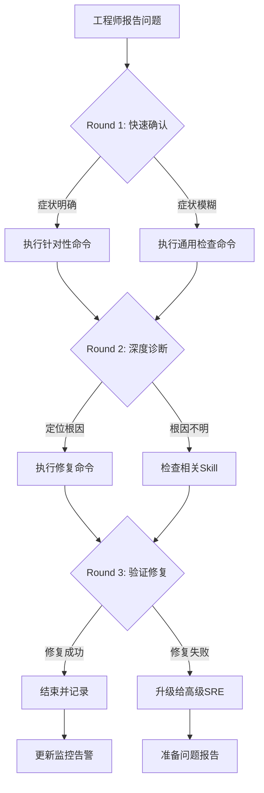

# K8s Security Incident Response 诊断与响应

[[Kubernetes|Kubernetes]] 安全事件可能涉及容器逃逸、权限提升、恶意镜像、未授权访问等。正确的响应流程对于控制影响范围、保留证据、满足合规要求至关重要。

本 Skill 提供安全事件的识别、遏制、根除、恢复和总结的全流程指导。

## 何时使用此 Skill

| 症状 | 检测方法 | 置信度 |
|------|---------|--------|
| 异常容器进程 | [[Falco|Falco]]/运行时检测 | 0.90 |
| 未授权 API 访问 | Audit Logs | 0.95 |
| 特权容器创建 | Admission Logs | 0.95 |
| 可疑网络连接 | Network Flow Logs | 0.85 |
| 已知 CVE 被利用 | Vulnerability Scanner | 0.90 |
| 异常镜像拉取 | Registry Audit | 0.85 |

## 快速分级（2 分钟内完成）

```
严重性
├── 确认的数据泄露 ──────────────→ P0-CRITICAL（立即响应）
├── 确认的容器逃逸 ──────────────→ P0-CRITICAL（立即响应）
├── 可疑的权限提升尝试 ──────────→ P1（30min 内响应）
├── 异常网络行为 ────────────────→ P1（30min 内响应）
└── 漏洞扫描告警（未确认利用） ──→ P2（2h 内处理）
```

**立即升级条件**:
- 任何确认的安全入侵
- 数据泄露疑似发生
- 核心基础设施被攻破

## 执行流程

```
安全告警触发
    │
    ▼
┌──────────────┐    脚本: scripts/diagnose-quick.sh
│ Phase 1      │    内容: 只读审计检查（只读，零风险）
│ 识别确认      │    Step: D1.1-D1.5
└──────┬───────┘
       │ 确认安全事件
       ▼
┌──────────────┐    参考: reference/remediation-playbook.md
│ 遏制          │    风险: HIGH → CRITICAL
│ 人工执行      │    所有操作需安全团队审批
└──────┬───────┘
       │
       ▼
┌──────────────┐    脚本: scripts/verify-security.sh
│ 恢复验证      │    检查: 审计/权限/网络
└──────────────┘
```

## 可用脚本

| 脚本 | 用途 | 参数 | 风险 |
|------|------|------|------|
| `scripts/diagnose-quick.sh` | 安全事件快速审计 | `NAMESPACE` (optional) | 只读 |
| `scripts/verify-security.sh` | 修复后验证 | `NAMESPACE` (optional) | 只读 |

> **注意**: 所有脚本仅执行只读操作，不会修改任何资源。

## 根因概览 (5 种)

| RC ID | 根因 | 概率 | 首选响应 | 风险 |
|-------|------|------|---------|------|
| RC-001 | 容器逃逸 | 中 | 隔离节点 + 取证 | CRITICAL |
| RC-002 | 权限提升（RBAC 滥用） | 中 | 撤销权限 + 审计 | HIGH |
| RC-003 | 恶意镜像/供应链攻击 | 中 | 阻断镜像 + 扫描 | HIGH |
| RC-004 | 未授权 API 访问 | 高 | 吊销凭证 + 审计 | HIGH |
| RC-005 | 内部威胁/配置漂移 | 低 | 回滚配置 + 审查 | HIGH |

## 关联资源

| 资源 | 路径 |
|------|------|
| 修复操作手册 | [reference/remediation-playbook.md](./reference/remediation-playbook.md) |
| 单文件完整版 | [../18-security-incident-response.md](../18-security-incident-response.md) |

## Related

- Incident Response 知识图谱索引


## 远程顾问信息收集

> 作为远程顾问，我**无法直接连接你的集群**。请帮我收集以下信息，我会根据你提供的内容给出准确的诊断建议。

### 第一步：快速确认（30 秒内回答）

1. **影响范围**：这个问题影响多少个节点 / Pod / 命名空间？
2. **紧急程度**：业务是否已中断？是否有用户投诉？
3. **发生时间**：问题是突然发生还是逐渐恶化？最近是否有变更？

### 第二步：关键信息（请提供你能获取的）

4. **kubectl 版本**：`kubectl version --short` 的输出
5. **K8s 集群版本**：`kubectl get nodes -o wide` 中的 VERSION 列
6. **节点状态**：控制平面节点是否正常？工作节点是否正常？

### 第三步：诊断信息（按需补充）

> 如果以下命令你无法执行，请直接告诉我「无法执行」，我会提供替代方案。

7. **相关组件日志**：`kubectl logs -n <namespace> <pod>` 的最后 30 行
8. **节点资源**：`kubectl top nodes` 或 `kubectl describe node <node>` 的 Capacity/Allocated resources
9. **近期变更**：最近 24 小时是否有部署、扩缩容、配置变更？

### 如果信息不足

如果你目前只能提供部分信息，**请从第一步开始**。我会根据已有信息先给出初步判断，并告诉你还需要收集什么。

> **替代沟通方式**：如果你不方便执行命令，也可以直接描述你看到的页面/告警内容，我会帮你解读。


## 命令替代方案

> 如果你无法执行以下命令，请参考对应的替代方案。

### 通用替代方案

| 原命令 | 无法执行的原因 | 替代方案 A | 替代方案 B |
|:---|:---|:---|:---|
| `kubectl get pods` | 无 kubectl 权限 | 通过集群管理控制台查看 Pod 列表 | 请有权限的同事执行并截图 |
| `kubectl logs <pod>` | 无日志权限 | 查看应用自身的日志文件（/var/log/） | 使用日志聚合系统（如 ELK/Loki）查询 |
| `kubectl describe node <node>` | 无节点查看权限 | 查看监控系统的节点仪表盘 | 使用 `kubectl get node -o yaml`（如权限允许） |
| `ssh <node>` | 无法 SSH 到节点 | 使用 `kubectl debug node/<node> -it --image=busybox` | 通过跳板机访问：`ssh -J bastion <node>` |
| `systemctl status kubelet` | 无法进入节点 | 查看节点上的 kubelet 日志：`kubectl logs -n kube-system <kubelet-pod>` | 查看容器运行时日志 |
| `docker/crictl` | 无容器运行时权限 | 使用 `kubectl exec` 进入容器检查 | 查看容器运行时的事件 |

### 如果以上都无法执行

如果你因为安全策略、网络隔离或权限限制无法执行任何诊断命令：

1. **请收集你能访问的任何信息**：
   - 监控系统的截图
   - 告警通知的内容
   - 应用自身的错误页面/日志
   - 最近是否有变更（部署、扩缩容、配置更新）

2. **如果信息严重不足**：
   - 我会根据你描述的症状给出最可能的根因和修复建议
   - 但请注意：**信息不足时建议的置信度会降低**
   - 如果问题影响严重，建议立即升级给有权限的高级 SRE

3. **紧急情况下**：
   - 如果业务已中断且你无法执行任何操作
   - 请立即联系有集群管理员权限的同事
   - 同时可以准备以下信息以便快速交接：
     - 问题发生时间
     - 影响范围
     - 已尝试的操作
     - 当前的任何异常观察

## 异常反馈处理

以下场景工程师可能给出异常反馈，需准备应对：

- **可疑进程已消失** → 检查audit日志和进程历史

- **RBAC异常但无法定位** → 启用审计日志并分析API调用

- **镜像漏洞扫描无结果** → 确认扫描器覆盖的CVE数据库版本

- **攻击来源IP频繁变化** → 结合云WAF和网络流日志分析


## 相关Skill交叉引用

本Skill诊断过程中可能涉及的其他Skill：

- k8s-rbac-quota

- [[skills/ts-control-plane.md|ts control plane]]

- k8s-ingress-gateway


当本Skill的诊断步骤无法定位根因时，建议按上述顺序排查相关Skill。


## 远程顾问特别提示

> 作为部署在客户环境之外的远程顾问，以下场景需要特别注意：

### 信息收集优先级
1. **集群版本和发行版** — 不同发行版（EKS/GKE/ACK/OpenShift）的诊断路径差异很大
2. **网络拓扑** — 是否需要VPN/堡垒机？是否有专门的运维跳板机？
3. **变更时间线** — 近24小时内的所有变更（部署、配置更新、节点操作）
4. **监控数据** — 能否提供Prometheus/Grafana截图或导出数据？

### 受限场景处理
| 限制 | 应对策略 |
|:---|:---|
| 工程师无kubectl权限 | 指导使用Dashboard或提供只读kubeconfig |
| 无法SSH节点 | 依赖kubectl debug/node-shell或云平台控制台 |
| 无法访问日志 | 要求导出关键日志片段或使用日志系统查询 |
| 网络隔离无法下载工具 | 使用容器镜像内置工具或busybox |
| 安全策略禁止执行命令 | 转为配置审查和文档指导 |

### 沟通模板
- **开场**："我是远程SRE顾问，无法直接连接您的集群。请按步骤执行命令并反馈结果。"
- **确认**："请执行上述命令，将输出贴回给我。如有任何异常请立即说明。"
- **升级**："当前情况需要升级处理。请同时联系贵司高级SRE，我会准备详细报告。"
- **结束**："问题已定位，请按上述步骤修复。修复后请验证并反馈结果。如有反复随时联系。"

## 预防性措施

### 安全基线
1. **镜像扫描**：CI/CD中集成Trivy/Clair镜像扫描
2. **运行时安全**：部署Falco监控异常系统调用
3. **网络隔离**：默认拒绝策略，最小化开放端口
4. **审计日志**：启用Kubernetes审计日志，保留90天

### 响应准备
- 建立安全事件响应团队（CSIRT）
- 制定事件分类和升级流程
- 准备取证工具和环境
- 定期进行红蓝对抗演练

## 诊断决策流程



## 工具速查表

| 工具 | 用途 | 典型命令 |
|:---|:---|:---|
| kubectl | Kubernetes CLI | `kubectl get/describe/logs/exec` |
| jq | JSON处理 | `kubectl get ... -o json \| jq ...` |
| openssl | 证书检查 | `openssl x509 -in <cert> -noout -dates` |
| tcpdump | 网络抓包 | `tcpdump -i any port <port> -n` |
| strace | 系统调用追踪 | `strace -p <pid> -f` |
| iostat/vmstat | IO/内存监控 | `iostat -x 1` |
| journalctl | 系统日志 | `journalctl -u <service> -f` |
| crictl | 容器运行时 | `crictl ps/logs/inspect` |

## 远程顾问执行清单

- [ ] 确认工程师身份和环境访问权限
- [ ] 收集集群版本、发行版、网络拓扑
- [ ] 确认问题影响范围和紧急程度
- [ ] 指导执行Round 1命令并收集输出
- [ ] 分析输出，选择Round 2分支
- [ ] 指导执行Round 2命令并收集输出
- [ ] 定位根因，提供修复方案
- [ ] 指导执行修复命令并验证
- [ ] 确认修复成功，更新相关文档
- [ ] 评估是否需要升级或事后复盘


## 相关概念

- [[concepts/supply-chain-security.md|供应链安全]] — Kubernetes 镜像供应链安全与漏洞防护
