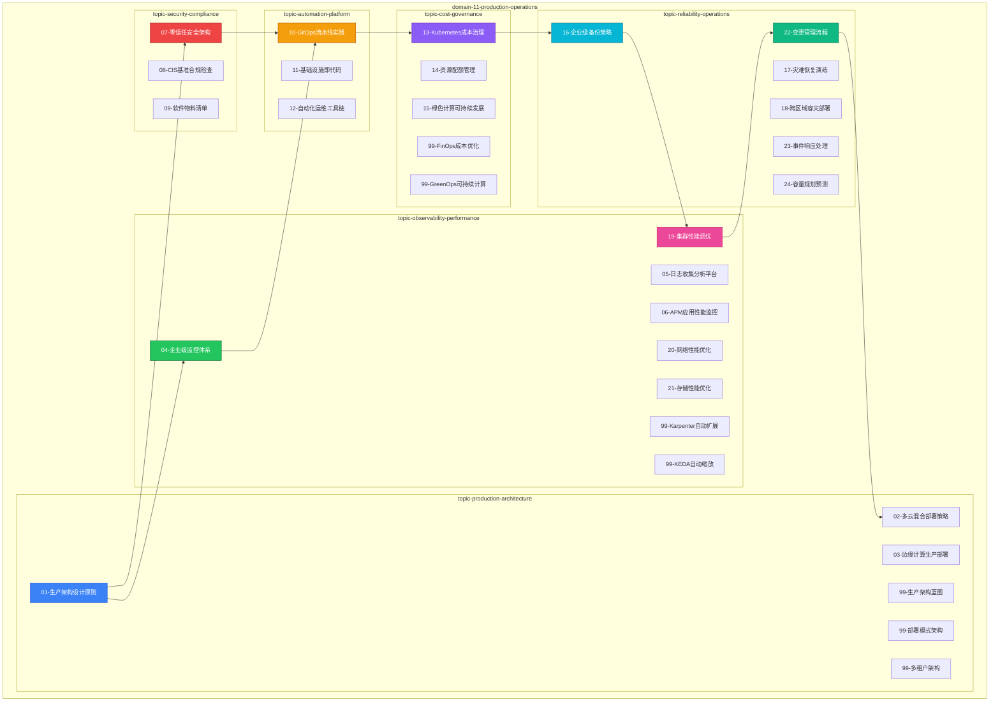

# domain-11-production-operations MOC

> **MOC 版本**: 2.1
> **知识域**: domain-11-production-operations
> **文档数量**: 32 篇
> **Topic 数量**: 6 个
> **最后更新**: 2026-05-21
> **用途**: 本知识域的导航入口，汇总所有相关文档、关联领域、和场景入口

---

## 领域概述

生产运维 — 生产最佳实践、容量规划、变更管理。按 **6 个 Topic 子目录** 模块化组织，与 `domain-12-troubleshooting` 的 topic 模式保持一致。

### 知识域定位

| 维度 | 说明 |
|---|---|
| **知识域** | domain-11-production-operations |
| **文档数量** | 32 篇 |
| **Topic 数量** | 6 个 |
| **难度分布** | 入门 0 / 进阶 0 / 高级 0 / 专家 0 |

---

## 📁 Topic 目录

### 🏗️ topic-production-architecture — 架构与设计（6 篇）

生产环境架构设计原则、多云混合部署、边缘计算部署，以及生产架构蓝图。

| # | 文档 | 难度 | 标签 | 估计阅读时间 |
|---|---|---|---|---|

---

### 🔍 topic-observability-performance — 可观测性与性能（8 篇）

企业级监控体系、日志收集分析平台、APM 应用性能监控，以及集群/网络/存储性能调优和自动扩展指南。

| # | 文档 | 难度 | 标签 | 估计阅读时间 |
|---|---|---|---|---|

> **关联领域**：domain-06-observability 企业级监控与告警（工具实现层）、domain-06-observability 日志管理与分析（工具实现层）

---

### 🛡️ topic-security-compliance — 安全与合规（3 篇）

零信任安全架构、CIS 基准合规检查、SBOM 软件物料清单。

| # | 文档 | 难度 | 标签 | 估计阅读时间 |
|---|---|---|---|---|

> **关联领域**：domain-05-security-compliance 云原生安全（工具实现层）

---

### 🔄 topic-automation-platform — 运维自动化（3 篇）

GitOps 流水线实践、基础设施即代码、自动化运维工具链。

| # | 文档 | 难度 | 标签 | 估计阅读时间 |
|---|---|---|---|---|

> **关联领域**：domain-08-release-change-management GitOps CI-CD、domain-08-release-change-management 基础设施即代码（工具实现层）

---

### 💰 topic-cost-governance — 成本与治理（5 篇）

Kubernetes 成本治理、资源配额管理、绿色计算，以及 FinOps/GreenOps 深度指南。

| # | 文档 | 难度 | 标签 | 估计阅读时间 |
|---|---|---|---|---|

---

### 📦 topic-reliability-operations — 可靠性与运营（6 篇）

企业级备份策略、灾难恢复演练、跨区域容灾部署，以及变更管理流程、事件响应处理、容量规划与预测。

| # | 文档 | 难度 | 标签 | 估计阅读时间 |
|---|---|---|---|---|

> **关联领域**：domain-09-reliability-engineering 灾备与业务连续性（工具实现层）、topic-skills 运维技能卡片（横向操作切片）

---

## 开源项目索引

| # | 文档 | 难度 | 标签 | 估计阅读时间 |
|---|---|---|---|---|

---

## 知识图谱

---

## 关联入口

| 入口 | 说明 |
|---|---|

---

## 统计信息

| 指标 | 数值 |
|---|---|
| 文档总数 | 32 |
| Topic 数量 | 6 |
| 覆盖 K8s 版本 | v1.25 - v1.32 |

---

*本文档由重组计划触发更新，最后更新 2026-05-21。*
