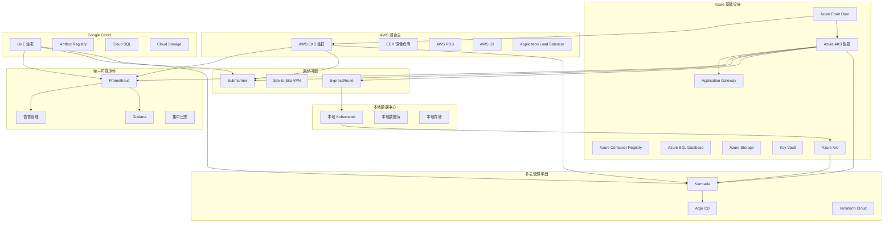

# Azure AKS 企业级多云管理平台

<!-- chunk: 概述 -->## 概述

Azure Kubernetes Service (AKS)] [[Service|Service]] (AKS) 是微软 Azure 提供的托管 Kubernetes 服务，提供企业级的安全性、可扩展性和管理功能。AKS 在全球 60 多个 Azure 区域可用，深度集成 Azure Active Directory、Key Vault、Monitor 等企业服务，是金融、政府、制造等行业上云的首选 Kubernetes 平台。

在多云架构中，AKS 通常作为合规性要求较高的工作负载承载平台，与 AWS EKS、Google GKE 协同构建跨云高可用架构。通过 Azure Arc、ExpressRoute、Azure Front Door 等服务，AKS 可以实现与本地数据中心和其他云平台的无缝连接。本文档从生产环境运维专家角度，深入探讨 AKS 的企业级部署架构、多云集成策略和运维管理最佳实践。

#<!-- chunk: AKS 核心特性 -->## AKS 核心特性

- **免费控制平面**: AKS 的 Kubernetes 控制平面不收取费用，仅需支付工作节点费用
- **Azure AD 原生集成**: 基于 Microsoft Entra ID 的统一身份认证和 RBAC
- **多区域集群**: 支持可用区部署和 Azure 可用性集
- **容器注册表**: Azure Container Registry (ACR) 厚度集成，支持镜像扫描和地理复制
- **网络模型**: 支持 Azure CNI 和 Kubenet 两种网络插件
- **混合云连接**: ExpressRoute 专线、VPN Gateway、Azure Arc 多云管理

<!-- chunk: 架构设计 -->## 架构设计

#<!-- chunk: 企业级 AKS 集群架构 -->## 企业级 AKS 集群架构

```hcl
resource "azurerm_kubernetes_cluster" "enterprise_aks" {
  name                = "enterprise-aks-cluster"
  location            = var.azure_region
  resource_group_name = azurerm_resource_group.main.name
  dns_prefix          = "enterprise-aks"
  kubernetes_version  = "1.30"

  default_node_pool {
    name                = "systempool"
    node_count          = 3
    vm_size             = "Standard_D4s_v3"
    os_disk_size_gb     = 128
    os_disk_type        = "Ephemeral"
    type                = "VirtualMachineScaleSets"
    availability_zones  = ["1", "2", "3"]
    max_pods            = 110
    vnet_subnet_id      = azurerm_subnet.aks_nodes.id
    enable_auto_scaling = true
    min_count           = 3
    max_count           = 20
    node_labels = {
      "nodepool-type" = "system"
      "environment"   = "production"
    }
    tags = {
      "Environment" = "Production"
      "Team"        = "Platform"
    }
  }

  identity {
    type = "SystemAssigned"
  }

  oidc_issuer_enabled       = true
  workload_identity_enabled = true

  azure_policy_enabled             = true
  http_application_routing_enabled = false
  open_service_mesh_enabled        = true

  network_profile {
    network_plugin     = "azure"
    network_plugin_mode = "overlay"
    network_policy     = "calico"
    pod_cidr           = "10.244.0.0/16"
    service_cidr       = "10.2.0.0/16"
    dns_service_ip     = "10.2.0.10"
    load_balancer_sku  = "standard"
    outbound_type      = "loadBalancer"
  }

  role_based_access_control_enabled = true

  azure_active_directory_role_based_access_control {
    managed                = true
    admin_group_object_ids = [var.aks_admin_group_id]
    azure_rbac_enabled     = true
  }

  microsoft_defender {
    log_analytics_workspace_id = azurerm_log_analytics_workspace.main.id
  }

  monitor_metrics {
    annotations_allowed = true
    labels_allowed      = true
  }

  oms_agent {
    log_analytics_workspace_id = azurerm_log_analytics_workspace.main.id
  }

  storage_profile {
    blob_driver_enabled         = true
    disk_driver_enabled         = true
    file_driver_enabled         = true
    snapshot_controller_enabled = true
  }

  tags = {
    Environment = "Production"
    Department  = "Engineering"
    CostCenter  = "Kubernetes"
  }
}

resource "azurerm_kubernetes_cluster_node_pool" "app_pool" {
  name                  = "apppool"
  kubernetes_cluster_id = azurerm_kubernetes_cluster.enterprise_aks.id
  vm_size               = "Standard_D8s_v3"
  node_count            = 5
  max_pods              = 110
  vnet_subnet_id        = azurerm_subnet.aks_nodes.id
  os_disk_type          = "Ephemeral"
  enable_auto_scaling   = true
  min_count             = 3
  max_count             = 30
  availability_zones    = ["1", "2", "3"]
  node_labels = {
    "nodepool-type" = "application"
  }
  tags = {
    "Environment" = "Production"
    "Workload"    = "Application"
  }
}

resource "azurerm_kubernetes_cluster_node_pool" "memory_pool" {
  name                  = "mempool"
  kubernetes_cluster_id = azurerm_kubernetes_cluster.enterprise_aks.id
  vm_size               = "Standard_E8s_v3"
  node_count            = 3
  max_pods              = 110
  vnet_subnet_id        = azurerm_subnet.aks_nodes.id
  os_disk_type          = "Ephemeral"
  enable_auto_scaling   = true
  min_count             = 2
  max_count             = 15
  node_labels = {
    "nodepool-type"    = "memory-intensive"
    "workload"         = "database"
  }
  node_taints = [
    "workload=memory:NoSchedule"
  ]
}

resource "azurerm_kubernetes_cluster_node_pool" "gpu_pool" {
  name                  = "gpupool"
  kubernetes_cluster_id = azurerm_kubernetes_cluster.enterprise_aks.id
  vm_size               = "Standard_NC6s_v3"
  node_count            = 2
  max_pods              = 30
  vnet_subnet_id        = azurerm_subnet.aks_nodes.id
  enable_auto_scaling   = true
  min_count             = 0
  max_count             = 10
  node_labels = {
    "nodepool-type" = "gpu"
    "accelerator"   = "nvidia"
  }
  node_taints = [
    "sku=gpu:NoSchedule"
  ]
}
```

#<!-- chunk: 多云架构集成 -->## 多云架构集成



<!-- chunk: 核心组件配置 -->## 核心组件配置

#<!-- chunk: 网络安全配置 -->## 网络安全配置

```hcl
resource "azurerm_network_security_group" "aks_nsg" {
  name                = "aks-nsg"
  location            = var.azure_region
  resource_group_name = azurerm_resource_group.main.name

  security_rule {
    name                       = "allow-https"
    priority                   = 100
    direction                  = "Inbound"
    access                     = "Allow"
    protocol                   = "Tcp"
    source_port_range          = "*"
    destination_port_range     = "443"
    source_address_prefix      = "Internet"
    destination_address_prefix = "*"
  }

  security_rule {
    name                       = "allow-kube-api"
    priority                   = 101
    direction                  = "Inbound"
    access                     = "Allow"
    protocol                   = "Tcp"
    source_port_range          = "*"
    destination_port_range     = "6443"
    source_address_prefix      = "AzureCloud"
    destination_address_prefix = "*"
  }

  security_rule {
    name                       = "allow-internal"
    priority                   = 200
    direction                  = "Inbound"
    access                     = "Allow"
    protocol                   = "*"
    source_port_range          = "*"
    destination_port_range     = "*"
    source_address_prefix      = "10.0.0.0/8"
    destination_address_prefix = "10.0.0.0/8"
  }

  security_rule {
    name                       = "deny-all-other"
    priority                   = 4096
    direction                  = "Inbound"
    access                     = "Deny"
    protocol                   = "*"
    source_port_range          = "*"
    destination_port_range     = "*"
    source_address_prefix      = "*"
    destination_address_prefix = "*"
  }
}

resource "azurerm_virtual_network" "aks_vnet" {
  name                = "aks-vnet"
  location            = var.azure_region
  resource_group_name = azurerm_resource_group.main.name
  address_space       = ["10.0.0.0/16"]

  tags = {
    Environment = "Production"
  }
}

resource "azurerm_subnet" "aks_nodes" {
  name                 = "aks-nodes-subnet"
  resource_group_name  = azurerm_resource_group.main.name
  virtual_network_name = azurerm_virtual_network.aks_vnet.name
  address_prefixes     = ["10.0.0.0/20"]
}

resource "azurerm_subnet" "aks_ingress" {
  name                 = "aks-ingress-subnet"
  resource_group_name  = azurerm_resource_group.main.name
  virtual_network_name = azurerm_virtual_network.aks_vnet.name
  address_prefixes     = ["10.0.16.0/24"]
}

resource "kubernetes_network_policy" "default_deny" {
  metadata {
    name      = "default-deny-all"
    namespace = "production"
  }

  spec {
    pod_selector {}
    policy_types = ["Ingress", "Egress"]
  }
}

resource "kubernetes_network_policy" "allow_backend_to_db" {
  metadata {
    name      = "allow-backend-to-database"
    namespace = "production"
  }

  spec {
    pod_selector {
      match_labels = {
        app = "database"
      }
    }

    ingress {
      from {
        pod_selector {
          match_labels = {
            app = "backend"
          }
        }
      }
      ports {
        protocol = "TCP"
        port     = 5432
      }
    }

    policy_types = ["Ingress"]
  }
}
```

#<!-- chunk: 存储类配置 -->## 存储类配置

```yaml
apiVersion: storage.k8s.io/v1
kind: StorageClass
metadata:
  name: azure-disk-premium-ssd
  annotations:
    storageclass.kubernetes.io/is-default-class: "true"
provisioner: disk.csi.azure.com
volumeBindingMode: WaitForFirstConsumer
allowVolumeExpansion: true
reclaimPolicy: Retain
parameters:
  skuName: Premium_LRS
  kind: Managed
  cachingMode: ReadOnly
  fsType: ext4
  encrypted: "true"
---
apiVersion: storage.k8s.io/v1
kind: StorageClass
metadata:
  name: azure-disk-ultra
provisioner: disk.csi.azure.com
volumeBindingMode: WaitForFirstConsumer
allowVolumeExpansion: true
reclaimPolicy: Retain
parameters:
  skuName: UltraSSD_LRS
  kind: Managed
  cachingMode: None
  fsType: ext4
  DiskIOPSReadWrite: "2000"
  DiskMBpsReadWrite: "320"
---
apiVersion: storage.k8s.io/v1
kind: StorageClass
metadata:
  name: azure-file-premium
provisioner: file.csi.azure.com
volumeBindingMode: WaitForFirstConsumer
allowVolumeExpansion: true
parameters:
  skuName: Premium_LRS
  shareName: k8s-shares
  mountOptions:
  - dir_mode=0777
  - file_mode=0777
  - uid=0
  - gid=0
  - mfsymlinks
  - cache=strict
  - actimeo=30
---
apiVersion: storage.k8s.io/v1
kind: StorageClass
metadata:
  name: azure-blob-nfs
provisioner: blob.csi.azure.com
volumeBindingMode: Immediate
parameters:
  skuName: Premium_LRS
  protocol: nfs
```

#<!-- chunk: Application Gateway Ingress Controller -->## Application Gateway Ingress Controller

```yaml
apiVersion: networking.k8s.io/v1
kind: Ingress
metadata:
  name: application-ingress
  namespace: production
  annotations:
    appgw.ingress.kubernetes.io/ssl-redirect: "true"
    appgw.ingress.kubernetes.io/backend-protocol: "http"
    appgw.ingress.kubernetes.io/cookie-based-affinity: "true"
    appgw.ingress.kubernetes.io/connection-draining: "true"
    appgw.ingress.kubernetes.io/connection-draining-timeout: "30"
    appgw.ingress.kubernetes.io/request-timeout: "30"
    appgw.ingress.kubernetes.io/use-private-ip: "false"
    appgw.ingress.kubernetes.io/waf-policy-for-path: "/subscriptions/xxx/resourceGroups/xxx/providers/Microsoft.Network/ApplicationGatewayWebApplicationFirewallPolicies/prod-waf"
    cert-manager.io/issuer: letsencrypt-prod
    cert-manager.io/acme-challenge-type: http01
spec:
  ingressClassName: azure-application-gateway
  tls:
  - hosts:
    - api.example.com
    secretName: api-tls-secret
  rules:
  - host: api.example.com
    http:
      paths:
      - path: /
        pathType: Prefix
        backend:
          service:
            name: application-service
            port:
              number: 80
```

<!-- chunk: 安全配置 -->## 安全配置

#<!-- chunk: Azure AD 集成与 Workload Identity -->## Azure AD 集成与 Workload Identity

```yaml
apiVersion: v1
kind: ServiceAccount
metadata:
  name: workload-identity-sa
  namespace: production
  annotations:
    azure.workload.identity/client-id: "xxxxxxxx-xxxx-xxxx-xxxx-xxxxxxxxxxxx"
    azure.workload.identity/tenant-id: "xxxxxxxx-xxxx-xxxx-xxxx-xxxxxxxxxxxx"
  labels:
    azure.workload.identity/use: "true"
---
apiVersion: apps/v1
kind: Deployment
metadata:
  name: azure-service-app
  namespace: production
spec:
  replicas: 3
  selector:
    matchLabels:
      app: azure-service-app
  template:
    metadata:
      labels:
        app: azure-service-app
        azure.workload.identity/use: "true"
    spec:
      serviceAccountName: workload-identity-sa
      containers:
      - name: app
        image: myacr.azurecr.io/app:latest
        env:
        - name: AZURE_CLIENT_ID
          valueFrom:
            fieldRef:
              fieldPath: spec.serviceAccountName
        - name: AZURE_TENANT_ID
          value: "xxxxxxxx-xxxx-xxxx-xxxx-xxxxxxxxxxxx"
        - name: AZURE_FEDERATED_TOKEN_FILE
          value: "/var/run/secrets/azure/tokens/azure-identity-token"
        volumeMounts:
        - name: azure-identity-token
          mountPath: "/var/run/secrets/azure/tokens"
          readOnly: true
      volumes:
      - name: azure-identity-token
        projected:
          sources:
          - serviceAccountToken:
              audience: "api://AzureADTokenExchange"
              expirationSeconds: 3600
              path: azure-identity-token
```

#<!-- chunk: Azure Key Vault CSI Driver -->## Azure Key Vault CSI Driver

```yaml
apiVersion: secrets-store.csi.x-k8s.io/v1
kind: SecretProviderClass
metadata:
  name: azure-kv-secrets
  namespace: production
spec:
  provider: azure
  parameters:
    usePodIdentity: "false"
    useVMManagedIdentity: "false"
    clientid: "xxxxxxxx-xxxx-xxxx-xxxx-xxxxxxxxxxxx"
    keyvaultName: "enterprise-keyvault"
    cloudName: "AzurePublicCloud"
    objects: |
      array:
        - |
          objectName: database-connection-string
          objectType: secret
          objectAlias: DB_CONNECTION_STRING
        - |
          objectName: api-secret-key
          objectType: secret
          objectAlias: API_SECRET_KEY
        - |
          objectName: storage-account-key
          objectType: secret
          objectAlias: STORAGE_ACCOUNT_KEY
    tenantId: "xxxxxxxx-xxxx-xxxx-xxxx-xxxxxxxxxxxx"
  secretObjects:
  - secretName: application-secrets
    type: Opaque
    data:
    - objectName: DB_CONNECTION_STRING
      key: db-connection-string
    - objectName: API_SECRET_KEY
      key: api-secret-key
---
apiVersion: apps/v1
kind: Deployment
metadata:
  name: app-with-keyvault
  namespace: production
spec:
  replicas: 3
  selector:
    matchLabels:
      app: app-with-keyvault
  template:
    metadata:
      labels:
        app: app-with-keyvault
        azure.workload.identity/use: "true"
    spec:
      serviceAccountName: workload-identity-sa
      containers:
      - name: app
        image: myacr.azurecr.io/app:latest
        volumeMounts:
        - name: secrets-store-inline
          mountPath: "/mnt/secrets-store"
          readOnly: true
        env:
        - name: DB_CONNECTION
          valueFrom:
            secretKeyRef:
              name: application-secrets
              key: db-connection-string
      volumes:
      - name: secrets-store-inline
        csi:
          driver: secrets-store.csi.k8s.io
          readOnly: true
          volumeAttributes:
            secretProviderClass: azure-kv-secrets
```

#<!-- chunk: Azure Policy 合规配置 -->## Azure Policy 合规配置

```yaml
apiVersion: constraints.gatekeeper.sh/v1beta1
kind: AzurePolicyConstraint
metadata:
  name: require-resource-limits
spec:
  match:
    kinds:
    - apiGroups: [""]
      kinds: ["Pod"]
    namespaces: ["production"]
  parameters:
    message: "所有容器必须设置 CPU 和内存 requests 和 limits"
---
apiVersion: templates.gatekeeper.sh/v1
kind: ConstraintTemplate
metadata:
  name: k8srequiredresources
spec:
  crd:
    spec:
      names:
        kind: K8sRequiredResources
      validation:
        openAPIV3Schema:
          type: object
          properties:
            message:
              type: string
  targets:
  - target: admission.k8s.gatekeeper.sh
    rego: |
      package k8srequiredresources
      violation[{"msg": msg}] {
        container := input.review.object.spec.containers[_]
        not container.resources.requests
        msg := sprintf("容器 <%v> 未设置资源 requests", [container.name])
      }
      violation[{"msg": msg}] {
        container := input.review.object.spec.containers[_]
        not container.resources.limits
        msg := sprintf("容器 <%v> 未设置资源 limits", [container.name])
      }
```

<!-- chunk: 监控告警 -->## 监控告警

#<!-- chunk: Azure Monitor 与 Container Insights -->## Azure Monitor 与 Container Insights

```hcl
resource "azurerm_log_analytics_workspace" "main" {
  name                = "enterprise-aks-logs"
  location            = var.azure_region
  resource_group_name = azurerm_resource_group.main.name
  sku                 = "PerGB2018"
  retention_in_days   = 90
  daily_quota_gb      = 50
}

resource "azurerm_monitor_diagnostic_setting" "aks_diagnostics" {
  name                       = "aks-diagnostics"
  target_resource_id         = azurerm_kubernetes_cluster.enterprise_aks.id
  log_analytics_workspace_id = azurerm_log_analytics_workspace.main.id

  enabled_log {
    category = "kube-apiserver"
  }
  enabled_log {
    category = "kube-controller-manager"
  }
  enabled_log {
    category = "kube-scheduler"
  }
  enabled_log {
    category = "kube-audit"
  }
  enabled_log {
    category = "kube-audit-admin"
  }
  enabled_log {
    category = "guard"
  }

  metric {
    category = "AllMetrics"
    enabled  = true
  }
}

resource "azurerm_monitor_metric_alert" "high_cpu" {
  name                = "aks-high-cpu-alert"
  resource_group_name = azurerm_resource_group.main.name
  scopes              = [azurerm_kubernetes_cluster.enterprise_aks.id]
  description         = "AKS 节点 CPU 使用率超过 85%"
  severity            = 2
  frequency           = "PT1M"
  window_size         = "PT5M"

  criteria {
    metric_namespace = "Microsoft.ContainerService/managedClusters"
    metric_name      = "node_cpu_usage_percentage"
    aggregation      = "Average"
    operator         = "GreaterThan"
    threshold        = 85
  }

  action {
    action_group_id = azurerm_monitor_action_group.ops.id
  }
}

resource "azurerm_monitor_metric_alert" "pod_restart" {
  name                = "aks-pod-restart-alert"
  resource_group_name = azurerm_resource_group.main.name
  scopes              = [azurerm_kubernetes_cluster.enterprise_aks.id]
  description         = "Pod 重启次数异常"
  severity            = 3
  frequency           = "PT5M"
  window_size         = "PT15M"

  criteria {
    metric_namespace = "Microsoft.ContainerService/managedClusters"
    metric_name      = "kube_pod_status_container_status_restarts_total"
    aggregation      = "Total"
    operator         = "GreaterThan"
    threshold        = 5
  }

  action {
    action_group_id = azurerm_monitor_action_group.ops.id
  }
}
```

#<!-- chunk: Prometheus 监控配置 -->## Prometheus 监控配置

```yaml
apiVersion: monitoring.coreos.com/v1
kind: ServiceMonitor
metadata:
  name: aks-cluster-monitoring
  namespace: monitoring
  labels:
    app: prometheus-operator
    release: prometheus
spec:
  selector:
    matchLabels:
      app: aks-monitoring
  namespaceSelector:
    matchNames:
    - kube-system
    - monitoring
    - production
  endpoints:
  - port: metrics
    interval: 30s
    path: /metrics
    relabelings:
    - sourceLabels: [__meta_kubernetes_pod_name]
      targetLabel: pod
    - sourceLabels: [__meta_kubernetes_namespace]
      targetLabel: namespace
    - sourceLabels: [__meta_kubernetes_node_name]
      targetLabel: node
---
apiVersion: monitoring.coreos.com/v1
kind: PrometheusRule
metadata:
  name: aks-alert-rules
  namespace: monitoring
spec:
  groups:
  - name: aks.infra.rules
    rules:
    - alert: AKSNodeNotReady
      expr: kube_node_status_condition{condition="Ready",status="false"} == 1
      for: 5m
      labels:
        severity: critical
      annotations:
        summary: "AKS 节点不可用"
        description: "节点 {{ $labels.node }} 在 AKS 集群中已持续 NotReady 5 分钟"

    - alert: AKSHighMemoryPressure
      expr: kube_node_status_condition{condition="MemoryPressure",status="true"} == 1
      for: 5m
      labels:
        severity: warning
      annotations:
        summary: "节点内存压力"
        description: "节点 {{ $labels.node }} 存在内存压力"

    - alert: AKSPodCrashLooping
      expr: rate(kube_pod_container_status_restarts_total[15m]) * 60 * 5 > 0
      for: 5m
      labels:
        severity: warning
      annotations:
        summary: "Pod 持续崩溃重启"
        description: "Pod {{ $labels.namespace }}/{{ $labels.pod }} 在过去 15 分钟内持续重启"

    - alert: AKSHPAMaxedOut
      expr: kube_hpa_status_current_replicas == kube_hpa_spec_max_replicas
      for: 15m
      labels:
        severity: warning
      annotations:
        summary: "HPA 已达最大副本数"
        description: "HPA {{ $labels.namespace }}/{{ $labels.hpa }} 达到最大副本数限制"

    - alert: AKSDiskPressure
      expr: kube_node_status_condition{condition="DiskPressure",status="true"} == 1
      for: 5m
      labels:
        severity: critical
      annotations:
        summary: "节点磁盘压力告警"
        description: "节点 {{ $labels.node }} 磁盘空间不足，触发 DiskPressure"
```

<!-- chunk: 运维管理 -->## 运维管理

#<!-- chunk: 故障排查脚本 -->## 故障排查脚本

```bash
#!/bin/bash
set -euo pipefail

RESOURCE_GROUP="${1:-}"
CLUSTER_NAME="${2:-}"

if -z "$RESOURCE_GROUP"; then
    echo "Usage: $0 <resource-group> <cluster-name>"
    exit 1
fi

check_cluster_health() {
    echo "=== AKS 集群健康检查 ==="
    echo "时间: $(date '+%Y-%m-%d %H:%M:%S')"

    echo -e "\n--- 集群状态 ---"
    az aks show --resource-group $RESOURCE_GROUP --name $CLUSTER_NAME \
      --query '{Status:provisioningState,Version:kubernetesVersion,FQDN:fqdn}' -o table

    echo -e "\n--- 节点池状态 ---"
    az aks nodepool list --resource-group $RESOURCE_GROUP --cluster-name $CLUSTER_NAME \
      -o table

    echo -e "\n--- Kubernetes 节点 ---"
    kubectl get nodes -o wide

    echo -e "\n--- 异常 Pod ---"
    kubectl get pods -A --field-selector=status.phase!=Running,status.phase!=Succeeded

    echo -e "\n--- 核心组件 ---"
    kubectl get pods -n kube-system -o wide

    echo -e "\n--- 最近事件 ---"
    kubectl get events -A --sort-by='.lastTimestamp' | tail -30
}

network_diagnostics() {
    echo "=== 网络诊断 ==="

    echo -e "\n--- 网络策略 ---"
    kubectl get networkpolicies -A

    echo -e "\n--- Service Endpoints ---"
    kubectl get endpoints -A | grep -v "<none>"

    echo -e "\n--- Azure CNI Pod IP 分配 ---"
    kubectl get pods -A -o json | jq -r '.items[] | select(.status.podIP != null) | "\(.metadata.namespace)/\(.metadata.name) \(.status.podIP)"' | head -20

    echo -e "\n--- Ingress 状态 ---"
    kubectl get ingress -A

    echo -e "\n--- Service LoadBalancer IP ---"
    kubectl get svc -A -o json | jq -r '.items[] | select(.spec.type=="LoadBalancer") | "\(.metadata.namespace)/\(.metadata.name) \(.status.loadBalancer.ingress[0].ip // "pending")"'
}

performance_analysis() {
    echo "=== 性能分析 ==="

    echo -e "\n--- 节点资源使用 ---"
    kubectl top nodes

    echo -e "\n--- 命名空间资源使用 ---"
    kubectl top pods -A --sort-by=cpu | head -20

    echo -e "\n--- PVC 使用 ---"
    kubectl get pvc -A

    echo -e "\n--- HPA 状态 ---"
    kubectl get hpa -A

    echo -e "\n--- Azure 监控指标 ---"
    CLUSTER_ID=$(az aks show --resource-group $RESOURCE_GROUP --name $CLUSTER_NAME --query id -o tsv)
    az monitor metrics list --resource $CLUSTER_ID \
      --metric-names "node_cpu_usage_percentage" \
      --start-time $(date -u -d '1 hour ago' '+%Y-%m-%dT%H:%M:%SZ') \
      -o table
}

case "${3:-all}" in
    health) check_cluster_health ;;
    network) network_diagnostics ;;
    performance) performance_analysis ;;
    all)
        check_cluster_health
        network_diagnostics
        performance_analysis
        ;;
    *) echo "Usage: $0 <rg> <cluster> {health|network|performance|all}" ;;
esac
```

#<!-- chunk: 集群升级脚本 -->## 集群升级脚本

```bash
#!/bin/bash
set -euo pipefail

RESOURCE_GROUP="production-rg"
CLUSTER_NAME="enterprise-aks-cluster"
TARGET_VERSION="1.30"

echo "=== AKS 集群升级流程 ==="

CURRENT_VERSION=$(az aks show --resource-group $RESOURCE_GROUP --name $CLUSTER_NAME \
  --query kubernetesVersion -o tsv)
echo "当前版本: $CURRENT_VERSION -> 目标版本: $TARGET_VERSION"

echo -e "\n[1/5] 升级前检查..."
az aks get-versions --location eastus --query "orchestrators[?orchestratorVersion=='$TARGET_VERSION']" -o table

echo -e "\n[2/5] 升级控制平面..."
az aks upgrade --resource-group $RESOURCE_GROUP --name $CLUSTER_NAME \
  --kubernetes-version $TARGET_VERSION --yes --no-wait

echo "等待控制平面升级..."
while true; do
    STATUS=$(az aks show --resource-group $RESOURCE_GROUP --name $CLUSTER_NAME \
      --query provisioningState -o tsv)
    if "$STATUS" == "Succeeded"; then
        echo "控制平面升级完成"
        break
    fi
    echo "状态: $STATUS, 等待中..."
    sleep 30
done

echo -e "\n[3/5] 升级节点池..."
for pool in $(az aks nodepool list --resource-group $RESOURCE_GROUP --cluster-name $CLUSTER_NAME --query '[].name' -o tsv); do
    echo "升级节点池: $pool"
    az aks nodepool upgrade --resource-group $RESOURCE_GROUP --cluster-name $CLUSTER_NAME \
      --name $pool --kubernetes-version $TARGET_VERSION --no-wait
done

echo -e "\n[4/5] 验证集群..."
kubectl get nodes -o wide
kubectl version -o yaml

echo -e "\n[5/5] 升级完成。"
```

<!-- chunk: 最佳实践 -->## 最佳实践

#<!-- chunk: 部署最佳实践 -->## 部署最佳实践

1. **使用 Azure CNI Overlay**: 支持更大规模的 Pod 密度，避免 VPC IP 耗尽
2. **临时 OS 磁盘**: 使用 Ephemeral OS Disk 提升节点创建速度和降低成本
3. **可用区部署**: 跨 3 个可用区部署节点池，确保高可用
4. **自动扩缩容**: 启用节点池自动扩缩容，设置合理的 min/max 范围
5. **Azure Front Door**: 使用 Front Door 作为全局流量入口，实现跨区域流量路由

#<!-- chunk: 安全最佳实践 -->## 安全最佳实践

1. **Workload Identity**: 使用 Azure Workload Identity 替代 Pod Identity，更安全
2. **Key Vault 集成**: 通过 CSI Driver 挂载 Key Vault 中的密钥
3. **Azure Policy**: 启用 Azure Policy for AKS，强制执行合规策略
4. **Microsoft Defender**: 启用 Defender for Containers，获得安全告警和漏洞扫描
5. **网络隔离**: 使用 Private Link 实现 AKS 到 Azure 服务的私有网络访问

#<!-- chunk: 成本优化最佳实践 -->## 成本优化最佳实践

1. **Spot VM 节点池**: 对可中断工作负载使用 Spot VM 实例
2. **预留实例**: 对长期稳定工作负载购买 Azure Reserved VM Instances
3. **自动缩放到零**: 非工作时段自动缩放开发/测试集群节点
4. **Azure Hybrid Benefit**: 利用现有 Windows/SQL 许可证降低成本

```yaml
apiVersion: apps/v1
kind: Deployment
metadata:
  name: spot-workload
  namespace: production
spec:
  replicas: 5
  selector:
    matchLabels:
      app: spot-workload
  template:
    metadata:
      labels:
        app: spot-workload
    spec:
      nodeSelector:
        kubernetes.azure.com/scalesetpriority: spot
      tolerations:
      - key: "kubernetes.azure.com/scalesetpriority"
        operator: "Equal"
        value: "spot"
        effect: "NoSchedule"
      containers:
      - name: app
        image: myacr.azurecr.io/app:latest
        resources:
          requests:
            cpu: "100m"
            memory: "128Mi"
          limits:
            cpu: "500m"
            memory: "512Mi"
      topologySpreadConstraints:
      - maxSkew: 1
        topologyKey: topology.kubernetes.io/zone
        whenUnsatisfiable: DoNotSchedule
        labelSelector:
          matchLabels:
            app: spot-workload
```

<!-- chunk: 故障排查 -->## 故障排查

#<!-- chunk: 常见问题与解决方案 -->## 常见问题与解决方案

| 问题 | 可能原因 | 排查步骤 |
|:---|:---|:---|
| Pod 一直 Pending | 资源不足、节点选择器不匹配 | `kubectl describe pod` 查看事件 |
| 节点 NotReady | kubelet 异常、内存/磁盘压力 | 检查节点事件、`az aks check-acr` |
| ACR 拉取镜像失败 | ACR 权限未配置 | 检查 AcrPull 角色分配 |
| LB External-IP Pending | 子网 IP 不足 | 检查子网 IP 地址范围 |
| Key Vault 挂载失败 | Managed Identity 配置错误 | 检查 Workload Identity 和 Key Vault 访问策略 |
| 节点池扩容失败 | 配额不足 | `az vm list-usage` 检查配额 |

#<!-- chunk: 紧急恢复流程 -->## 紧急恢复流程

```bash
#!/bin/bash
RG="production-rg"
CLUSTER="enterprise-aks-cluster"

echo "=== AKS 紧急恢复 ==="

echo "[1] 获取集群凭据"
az aks get-credentials --resource-group $RG --name $CLUSTER --overwrite-existing

echo "[2] 检查 API Server"
if ! kubectl cluster-info 2>/dev/null; then
    echo "API Server 不可达，检查 Azure 状态"
    az aks show --resource-group $RG --name $CLUSTER --query provisioningState
    az resource health check --resource-group $RG --resource-name $CLUSTER \
      --resource-type Microsoft.ContainerService/managedClusters
fi

echo "[3] 检查节点"
kubectl get nodes -o json | jq -r '.items[] | select(.status.conditions[] | select(.type=="Ready" and .status=="False")) | .metadata.name'

echo "[4] 重建异常节点"
for node in $(kubectl get nodes -o json | jq -r '.items[] | select(.status.conditions[] | select(.type=="Ready" and .status=="False")) | .metadata.name'); do
    echo "重建节点: $node"
    az aks nodepool delete-machine --resource-group $RG --cluster-name $CLUSTER \
      --nodepool-name $(echo $node | cut -d'-' -f3-4) --machine-name $node
done

echo "[5] 验证恢复"
kubectl get nodes -o wide
```

<!-- chunk: 参考资源 -->## 参考资源

- [Azure AKS 官方文档](https://learn.microsoft.com/en-us/azure/aks/)
- [AKS 最佳实践](https://learn.microsoft.com/en-us/azure/aks/best-practices)
- [Azure Workload Identity](https://azure.github.io/azure-workload-identity/)
- [AKS 安全基线](https://learn.microsoft.com/en-us/azure/aks/security-baseline)
- [Azure Key Vault Provider for CSI Driver](https://azure.github.io/secrets-store-csi-driver-provider-azure/)

---

**文档版本**: v2.0
**最后更新**: 2026年5月17日
**适用版本**: AKS 1.28+

---

<!-- chunk: Obsidian 相关文档 -->## Obsidian 相关文档

- domain-27-multi-cloud-hybrid MOC
- [[domain-12-cloud-providers/README|Domain 27: 多云与混合云架构管理]]
- Domain-27 多云与混合云 — 开源项目索引
- AWS EKS 企业级多云管理平台
- 企业级多云治理与成本优化深度实践
- Google GKE 企业级多云管理深度实践
- IBM Cloud Kubernetes Service (IKS) 企业级深度实践
- Alibaba Cloud ACK 企业级混合云深度实践
- 华为云 CCE 企业级容器平台深度实践
- Karmada 多集群联邦深度实践
- 多云网络互联深度实践
- 多云灾备深度实践

## See Also

- 10-multicloud-disaster-recovery
- 01-aws-eks-enterprise-multicloud
- 03-enterprise-multicloud-governance
- 04-google-gke-enterprise-multicloud
