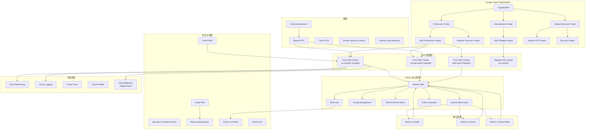

title: Google GKE 企业级多云管理深度实践
description: '# Google GKE 企业级多云管理深度实践'
category: multi-cloud-hybrid
tags:
- k8s
- multi-cloud
- hybrid-cloud
- etcd
- kubelet
- prometheus
- istio
- calico
- containerd
- redis
last_updated: 2026-05
difficulty: advanced
reading_level: advanced
audience:
- 云架构师
- SRE
- 平台工程师
estimated_read_time: 5min
intent_queries:
- Google GKE 企业级多云管理深度实践 是什么
- 如何 Google GKE 企业级多云管理深度实践
- Kubernetes 27 multi cloud hybrid 最佳实践
trigger_keywords:
- Google
- GKE
- 企业级多云管理深度实践
- multi
- cloud
- hybrid
authors:
- name: KUDIG Team
  role: contributor
k8s_versions:
- '1.28'
- '1.29'
- '1.30'
- '1.31'
- '1.32'
---

# Google GKE 企业级多云管理深度实践

<!-- chunk: 概述 -->## 概述

Google Kubernetes Engine (GKE) 是 Google Cloud 提供的托管 Kubernetes 服务，以其卓越的自动化能力、全球网络基础设施和 Anthos 多云管理平台闻名。GKE Autopilot 模式提供完全无服务器化的 Kubernetes 体验，使企业无需关心节点管理，按 Pod 资源消耗计费，SLA 直接覆盖 Pod 可用性而非仅覆盖节点。

在多云架构场景下，GKE 通过 Anthos 平台实现跨 Google Cloud、AWS、Azure 的统一集群管理，提供一致的服务网格（Anthos Service Mesh）、配置管理（Config Management）和安全策略（Policy Controller）。Google 的全球骨干网络为多云互联提供了低延迟、高带宽的连接基础，Cloud Interconnect 和 Partner Interconnect 提供了可靠的专线连接方案。

本文档从生产环境运维专家角度，深入探讨 GKE 的企业级部署架构、Anthos 多云管理实践、Binary Authorization 安全供应链和混合云集成策略。内容涵盖完整的 Terraform 基础设施即代码、详细的 YAML 配置、监控告警规则和运维自动化脚本，为企业在 Google Cloud 上构建生产级 Kubernetes 平台提供全面参考。

#<!-- chunk: GKE 核心特性 -->## GKE 核心特性

| 特性 | 说明 | 适用场景 |
|:---|:---|:---|
| Autopilot 模式 | Google 管理所有节点，按 Pod 资源使用计费，SLA 覆盖 Pod | 通用工作负载、无运维需求 |
| Standard 模式 | 用户管理节点池，完全控制节点配置 | GPU 工作负载、特殊硬件需求 |
| Anthos 多云 | 统一管理 GKE、EKS、AKS 和本地 Kubernetes 集群 | 多云统一管理 |
| Global VPC | Google 全球 VPC 网络，跨区域低延迟互联 | 全球化业务 |
| Binary Authorization | 镜像签名验证，确保仅受信镜像部署 | 安全敏感行业 |
| Confidential Computing | 机密计算节点，数据使用中加密 | 金融、医疗 |
| Cloud Operations | 集成 Cloud Monitoring、Cloud Logging、Cloud Trace | 统一可观测性 |
| Workload Identity | GCP IAM 与 K8s ServiceAccount 联邦 | 安全访问 GCP 资源 |

<!-- chunk: 架构设计 -->## 架构设计

#<!-- chunk: GKE 企业架构总览 -->## GKE 企业架构总览



#<!-- chunk: Terraform 基础设施部署 -->## Terraform 基础设施部署

```hcl
terraform {
  required_version = ">= 1.5"
  required_providers {
    google = {
      source  = "hashicorp/google"
      version = "~> 5.40"
    }
  }

  backend "gcs" {
    bucket = "terraform-state-production"
    prefix = "gke-infrastructure"
  }
}

variable "project_id" {
  description = "GCP Project ID"
  type        = string
  default     = "gke-production"
}

variable "region" {
  description = "Primary region"
  type        = string
  default     = "us-central1"
}

variable "network_name" {
  description = "VPC network name"
  type        = string
  default     = "production-vpc"
}

resource "google_compute_network" "production_vpc" {
  name                    = var.network_name
  project                 = var.project_id
  auto_create_subnetworks = false
  routing_mode            = "GLOBAL"

  delete_default_routes_on_create = true
}

resource "google_compute_subnetwork" "primary_subnet" {
  name          = "gke-primary-subnet"
  project       = var.project_id
  region        = var.region
  network       = google_compute_network.production_vpc.id
  ip_cidr_range = "10.0.0.0/20"

  secondary_ip_range {
    range_name    = "pods-range"
    ip_cidr_range = "10.4.0.0/14"
  }

  secondary_ip_range {
    range_name    = "services-range"
    ip_cidr_range = "10.8.0.0/20"
  }

  private_ip_google_access = true

  log_config {
    aggregation_interval = "INTERVAL_5_SEC"
    flow_sampling        = 0.5
    metadata             = "INCLUDE_ALL_METADATA"
  }
}

resource "google_compute_subnetwork" "eu_subnet" {
  name          = "gke-eu-subnet"
  project       = var.project_id
  region        = "europe-west1"
  network       = google_compute_network.production_vpc.id
  ip_cidr_range = "10.1.0.0/20"

  secondary_ip_range {
    range_name    = "eu-pods-range"
    ip_cidr_range = "10.16.0.0/14"
  }

  secondary_ip_range {
    range_name    = "eu-services-range"
    ip_cidr_range = "10.20.0.0/20"
  }

  private_ip_google_access = true
}

resource "google_compute_firewall" "allow_internal" {
  name          = "allow-internal"
  project       = var.project_id
  network       = google_compute_network.production_vpc.name
  source_ranges = ["10.0.0.0/8"]

  allow {
    protocol = "tcp"
    ports    = ["0-65535"]
  }

  allow {
    protocol = "udp"
    ports    = ["0-65535"]
  }

  allow {
    protocol = "icmp"
  }
}

resource "google_compute_firewall" "allow_health_checks" {
  name          = "allow-health-checks"
  project       = var.project_id
  network       = google_compute_network.production_vpc.name
  source_ranges = ["130.211.0.0/22", "35.191.0.0/16"]

  allow {
    protocol = "tcp"
  }
}

resource "google_compute_router" "production_router" {
  name    = "production-router"
  project = var.project_id
  region  = var.region
  network = google_compute_network.production_vpc.id
}

resource "google_compute_router_nat" "production_nat" {
  name                               = "production-nat"
  project                            = var.project_id
  region                             = var.region
  router                             = google_compute_router.production_router.name
  nat_ip_allocate_option             = "AUTO_ONLY"
  source_subnetwork_ip_ranges_to_nat = "ALL_SUBNETWORKS_ALL_IP_RANGES"

  min_ports_per_vm                 = 1024
  tcp_transient_idle_timeout_sec   = 30
  tcp_established_idle_timeout_sec = 1200
  udp_idle_timeout_sec             = 30
  icmp_idle_timeout_sec            = 30
}

resource "google_kms_key_ring" "gke_keyring" {
  name     = "gke-keyring"
  project  = var.project_id
  location = var.region
}

resource "google_kms_crypto_key" "gke_etcd_key" {
  name     = "gke-etcd-key"
  key_ring = google_kms_key_ring.gke_keyring.id
  purpose  = "ENCRYPT_DECRYPT"

  version_template {
    algorithm        = "GOOGLE_SYMMETRIC_ENCRYPTION"
    protection_level = "HSM"
  }

  rotation_period = "7776000s"

  lifecycle {
    prevent_destroy = true
  }
}

resource "google_kms_crypto_key" "gke_disk_key" {
  name     = "gke-disk-key"
  key_ring = google_kms_key_ring.gke_keyring.id
  purpose  = "ENCRYPT_DECRYPT"

  version_template {
    algorithm        = "GOOGLE_SYMMETRIC_ENCRYPTION"
    protection_level = "HSM"
  }

  rotation_period = "7776000s"
}

resource "google_container_cluster" "production" {
  name     = "prod-gke-cluster"
  project  = var.project_id
  location = var.region

  release_channel {
    channel = "REGULAR"
  }

  network    = google_compute_network.production_vpc.id
  subnetwork = google_compute_subnetwork.primary_subnet.id

  ip_allocation_policy {
    cluster_secondary_range_name  = "pods-range"
    services_secondary_range_name = "services-range"
  }

  private_cluster_config {
    enable_private_endpoint = false
    enable_private_nodes    = true
    master_ipv4_cidr_block  = "172.16.0.0/28"
  }

  master_authorized_networks_config {
    cidr_blocks {
      cidr_block   = "10.0.0.0/8"
      display_name = "Corporate Network"
    }
    cidr_blocks {
      cidr_block   = "172.16.0.0/12"
      display_name = "VPN Network"
    }
  }

  binary_authorization {
    evaluation_mode = "PROJECT_SINGLETON_POLICY_ENFORCE"
  }

  database_encryption {
    state    = "ENCRYPTED"
    key_name = google_kms_crypto_key.gke_etcd_key.id
  }

  default_snat_status {
    disabled = true
  }

  enable_intranode_visibility = true
  enable_shielded_nodes       = true
  enable_binary_authorization = true
  enable_l4_ilb_subsetting    = true

  network_policy {
    enabled  = true
    provider = "CALICO"
  }

  logging_config {
    enable_components = ["SYSTEM_COMPONENTS", "WORKLOADS"]
  }

  monitoring_config {
    enable_components = ["SYSTEM_COMPONENTS", "WORKLOADS"]
    managed_prometheus {
      enabled = true
    }
  }

  notification_config {
    pubsub {
      enabled = true
      topic   = "projects/${var.project_id}/topics/gke-notifications"
    }
  }

  resource_usage_export_config {
    bigquery_destination {
      dataset_id = "gke_usage_dataset"
    }
    enable_network_egress_metering       = true
    enable_resource_consumption_metering = true
  }

  vertical_pod_autoscaling {
    enabled = true
  }

  addons_config {
    http_load_balancing {
      disabled = false
    }
    horizontal_pod_autoscaling {
      disabled = false
    }
    network_policy_config {
      disabled = false
    }
    gce_persistent_disk_csi_driver_config {
      enabled = true
    }
    gcp_filestore_csi_driver_config {
      enabled = true
    }
    cloudrun_config {
      disabled = true
    }
    dns_cache_config {
      enabled = true
    }
    gateway_api_config {
      enabled = true
    }
    gke_backup_agent_config {
      enabled = true
    }
  }

  workload_identity_config {
    workload_pool = "${var.project_id}.svc.id.goog"
  }

  mesh_certificates {
    enable_certificates = true
  }

  cost_management_config {
    enabled = true
  }

  node_pool {
    name               = "system-pool"
    initial_node_count = 3

    management {
      auto_repair  = true
      auto_upgrade = true
    }

    node_config {
      machine_type = "e2-medium"
      disk_size_gb = 100
      disk_type    = "pd-balanced"
      image_type   = "COS_CONTAINERD"

      shielded_instance_config {
        enable_secure_boot          = true
        enable_integrity_monitoring = true
      }

      workload_metadata_config {
        mode = "GKE_METADATA"
      }

      labels = {
        environment = "production"
        nodepool    = "system"
      }

      taint {
        key    = "CriticalAddonsOnly"
        value  = "true"
        effect = "NO_SCHEDULE"
      }
    }
  }

  lifecycle {
    ignore_changes = [
      node_pool,
    ]
  }

  timeouts {
    create = "60m"
    update = "60m"
    delete = "60m"
  }
}

resource "google_container_node_pool" "compute_pool" {
  name       = "compute-pool"
  project    = var.project_id
  location   = var.region
  cluster    = google_container_cluster.production.name
  node_count = 3

  management {
    auto_repair  = true
    auto_upgrade = true
  }

  autoscaling {
    min_node_count = 3
    max_node_count = 30
  }

  upgrade_settings {
    max_surge       = 3
    max_unavailable = 1
    strategy        = "SURGE"
  }

  node_config {
    machine_type = "n2-standard-8"
    disk_size_gb = 200
    disk_type    = "pd-ssd"
    image_type   = "COS_CONTAINERD"

    shielded_instance_config {
      enable_secure_boot          = true
      enable_integrity_monitoring = true
    }

    workload_metadata_config {
      mode = "GKE_METADATA"
    }

    labels = {
      environment = "production"
      nodepool    = "compute"
    }
  }
}

resource "google_container_node_pool" "high_memory_pool" {
  name       = "high-memory-pool"
  project    = var.project_id
  location   = var.region
  cluster    = google_container_cluster.production.name
  node_count = 2

  management {
    auto_repair  = true
    auto_upgrade = true
  }

  autoscaling {
    min_node_count = 2
    max_node_count = 15
  }

  node_config {
    machine_type = "n2-highmem-16"
    disk_size_gb = 500
    disk_type    = "pd-ssd"
    image_type   = "COS_CONTAINERD"

    labels = {
      environment       = "production"
      nodepool          = "memory-intensive"
      workload-type     = "memory"
    }

    taint {
      key    = "workload"
      value  = "memory"
      effect = "NO_SCHEDULE"
    }
  }
}

resource "google_container_node_pool" "gpu_pool" {
  name       = "gpu-pool"
  project    = var.project_id
  location   = var.region
  cluster    = google_container_cluster.production.name
  node_count = 0

  management {
    auto_repair  = true
    auto_upgrade = true
  }

  autoscaling {
    min_node_count = 0
    max_node_count = 10
  }

  node_config {
    machine_type = "n1-standard-4"
    disk_size_gb = 200
    disk_type    = "pd-ssd"
    image_type   = "COS_CONTAINERD"

    guest_accelerator {
      type  = "nvidia-tesla-t4"
      count = 1
    }

    labels = {
      environment = "production"
      nodepool    = "gpu"
      accelerator = "nvidia"
    }

    taint {
      key    = "nvidia.com/gpu"
      value  = "true"
      effect = "NO_SCHEDULE"
    }
  }
}

output "cluster_name" {
  value = google_container_cluster.production.name
}

output "cluster_endpoint" {
  value = google_container_cluster.production.endpoint
}

output "cluster_ca_certificate" {
  value     = google_container_cluster.production.master_auth[0].cluster_ca_certificate
  sensitive = true
}
```

<!-- chunk: 核心组件配置 -->## 核心组件配置

#<!-- chunk: 存储类配置 -->## 存储类配置

```yaml
apiVersion: storage.k8s.io/v1
kind: StorageClass
metadata:
  name: gce-ssd
  annotations:
    storageclass.kubernetes.io/is-default-class: "true"
provisioner: pd.csi.storage.gke.io
volumeBindingMode: WaitForFirstConsumer
allowVolumeExpansion: true
reclaimPolicy: Retain
parameters:
  type: pd-ssd
  replication-type: regional-pd
  disk-encryption-kms-key: projects/gke-production/locations/us-central1/keyRings/gke-keyring/cryptoKeys/gke-disk-key
---
apiVersion: storage.k8s.io/v1
kind: StorageClass
metadata:
  name: gce-balanced
provisioner: pd.csi.storage.gke.io
volumeBindingMode: WaitForFirstConsumer
allowVolumeExpansion: true
parameters:
  type: pd-balanced
  replication-type: regional-pd
---
apiVersion: storage.k8s.io/v1
kind: StorageClass
metadata:
  name: gce-filestore
provisioner: filestore.csi.storage.gke.io
volumeBindingMode: WaitForFirstConsumer
parameters:
  tier: STANDARD
  network: projects/gke-production/global/networks/production-vpc
---
apiVersion: storage.k8s.io/v1
kind: StorageClass
metadata:
  name: gce-filestore-premium
provisioner: filestore.csi.storage.gke.io
volumeBindingMode: WaitForFirstConsumer
parameters:
  tier: PREMIUM
  network: projects/gke-production/global/networks/production-vpc
  nfsExportOptions:
  - accessMode: READ_WRITE
    squashMode: NO_ROOT_SQUASH
    uid: 0
    gid: 0
```

#<!-- chunk: 多集群 Ingress 配置 -->## 多集群 Ingress 配置

```yaml
apiVersion: networking.gke.io/v1
kind: MultiClusterService
metadata:
  name: global-service
  namespace: production
spec:
  template:
    spec:
      selector:
        app: global-app
      ports:
      - name: http
        protocol: TCP
        port: 80
        targetPort: 8080
      - name: grpc
        protocol: TCP
        port: 9090
        targetPort: 9090
---
apiVersion: networking.gke.io/v1
kind: MultiClusterIngress
metadata:
  name: global-ingress
  namespace: production
  annotations:
    networking.gke.io/frontend-config: "global-frontend-config"
    networking.gke.io/backend-config: "global-backend-config"
spec:
  template:
    spec:
      backend:
        serviceName: global-service
        servicePort: 80
      rules:
      - host: app.example.com
        http:
          paths:
          - path: /api
            pathType: Prefix
            backend:
              serviceName: global-service
              servicePort: 80
          - path: /grpc
            pathType: Prefix
            backend:
              serviceName: global-service
              servicePort: 9090
  clusters:
  - link: "projects/gke-production/locations/us-central1/clusters/prod-cluster"
  - link: "projects/gke-production/locations/europe-west1/clusters/eu-cluster"
  - link: "projects/gke-production/locations/asia-east1/clusters/apac-cluster"
---
apiVersion: networking.gke.io/v1beta1
kind: FrontendConfig
metadata:
  name: global-frontend-config
  namespace: production
spec:
  redirectToHttps:
    enabled: true
    responseCodeName: MOVED_PERMANENTLY_DEFAULT
  sslPolicy: gke-production-ssl-policy
---
apiVersion: networking.gke.io/v1beta1
kind: BackendConfig
metadata:
  name: global-backend-config
  namespace: production
spec:
  healthCheck:
    checkIntervalSec: 10
    timeoutSec: 5
    healthyThreshold: 2
    unhealthyThreshold: 3
    type: HTTP
    requestPath: /healthz
    port: 8080
  connectionDraining:
    drainingTimeoutSec: 60
  sessionAffinity:
    affinityType: GENERATED_COOKIE
    affinityCookieTtlSec: 3600
  cdn:
    enabled: true
    cachePolicy:
      includeHostHeader: true
      includeProtocol: true
      includeQueryString: false
```

#<!-- chunk: Workload Identity 配置 -->## Workload Identity 配置

```yaml
apiVersion: v1
kind: ServiceAccount
metadata:
  name: gcp-workload-sa
  namespace: production
  annotations:
    iam.gke.io/gcp-service-account: production-sa@gke-production.iam.gserviceaccount.com
---
apiVersion: apps/v1
kind: Deployment
metadata:
  name: workload-identity-app
  namespace: production
spec:
  replicas: 3
  selector:
    matchLabels:
      app: wi-app
  template:
    metadata:
      labels:
        app: wi-app
    spec:
      serviceAccountName: gcp-workload-sa
      containers:
      - name: app
        image: gcr.io/gke-production/app:latest
        resources:
          requests:
            cpu: "100m"
            memory: "128Mi"
          limits:
            cpu: "500m"
            memory: "512Mi"
        env:
        - name: GOOGLE_CLOUD_PROJECT
          value: "gke-production"
        - name: SPANNER_INSTANCE
          value: "production-instance"
        ports:
        - containerPort: 8080
        livenessProbe:
          httpGet:
            path: /healthz
            port: 8080
          initialDelaySeconds: 15
          periodSeconds: 10
        readinessProbe:
          httpGet:
            path: /readyz
            port: 8080
          initialDelaySeconds: 5
          periodSeconds: 5
---
apiVersion: v1
kind: Service
metadata:
  name: wi-app-service
  namespace: production
spec:
  selector:
    app: wi-app
  ports:
  - protocol: TCP
    port: 80
    targetPort: 8080
  type: ClusterIP
```

<!-- chunk: 安全配置 -->## 安全配置

#<!-- chunk: Binary Authorization 策略 -->## Binary Authorization 策略

```yaml
apiVersion: binaryauthorization.cnrm.cloud.google.com/v1beta1
kind: BinaryAuthorizationPolicy
metadata:
  name: production-binauthz-policy
spec:
  admissionWhitelistPatterns:
  - namePattern: "gcr.io/gke-production/*"
  - namePattern: "gcr.io/google-containers/*"
  - namePattern: "gcr.io/stackdriver-agents/*"
  - namePattern: "gke.gcr.io/*"
  defaultAdmissionRule:
    evaluationMode: REQUIRE_ATTESTATION
    enforcementMode: ENFORCED_BLOCK_AND_AUDIT_LOG
    requireAttestationsBy:
    - projects/gke-production/attestors/build-attestor
    - projects/gke-production/attestors/security-attestor
  clusterAdmissionRules:
    us-central1.production-gke-cluster:
      evaluationMode: REQUIRE_ATTESTATION
      enforcementMode: ENFORCED_BLOCK_AND_AUDIT_LOG
      requireAttestationsBy:
      - projects/gke-production/attestors/build-attestor
      - projects/gke-production/attestors/security-attestor
---
apiVersion: binaryauthorization.cnrm.cloud.google.com/v1beta1
kind: BinaryAuthorizationAttestor
metadata:
  name: build-attestor
spec:
  description: "CI/CD Pipeline Build Attestor"
  attestationAuthorityNote:
    noteReference: "projects/gke-production/notes/build-attestor-note"
    publicKeys:
    - asciiArmoredPgpPublicKey: |
        -----BEGIN PGP PUBLIC KEY BLOCK-----
        mQINBGV...build attestor key...
        -----END PGP PUBLIC KEY BLOCK-----
      id: "build-attestor-key-2026"
---
apiVersion: binaryauthorization.cnrm.cloud.google.com/v1beta1
kind: BinaryAuthorizationAttestor
metadata:
  name: security-attestor
spec:
  description: "Security Scan Attestor"
  attestationAuthorityNote:
    noteReference: "projects/gke-production/notes/security-attestor-note"
    publicKeys:
    - asciiArmoredPgpPublicKey: |
        -----BEGIN PGP PUBLIC KEY BLOCK-----
        mQINBGV...security attestor key...
        -----END PGP PUBLIC KEY BLOCK-----
      id: "security-attestor-key-2026"
```

#<!-- chunk: Anthos Policy Controller 配置 -->## Anthos Policy Controller 配置

```yaml
apiVersion: configmanagement.gke.io/v1
kind: Repo
metadata:
  name: policy-repo
spec:
  version: "1.16.0"
---
apiVersion: configmanagement.gke.io/v1
kind: ConfigManagement
metadata:
  name: config-management
spec:
  policyController:
    enabled: true
    templateLibrary:
      installed: true
    referentialRulesEnabled: true
    audit:
      dryRunMode: true
      interval: 120s
    exemptableNamespaces:
    - kube-system
    - config-management-system
    - istio-system
  configSync:
    enabled: true
    sourceFormat: unstructured
    syncRepo: "https://gitlab.com/company/config-sync"
    syncBranch: main
    syncRev: HEAD
    policyDir: "config"
    secretType: ssh
```

#<!-- chunk: 网络策略配置 -->## 网络策略配置

```yaml
apiVersion: networking.k8s.io/v1
kind: NetworkPolicy
metadata:
  name: default-deny-all
  namespace: production
spec:
  podSelector: {}
  policyTypes:
  - Ingress
  - Egress
---
apiVersion: networking.k8s.io/v1
kind: NetworkPolicy
metadata:
  name: allow-dns-egress
  namespace: production
spec:
  podSelector: {}
  policyTypes:
  - Egress
  egress:
  - to:
    - namespaceSelector:
        matchLabels:
          name: kube-system
    ports:
    - protocol: UDP
      port: 53
    - protocol: TCP
      port: 53
---
apiVersion: networking.k8s.io/v1
kind: NetworkPolicy
metadata:
  name: allow-frontend-to-backend
  namespace: production
spec:
  podSelector:
    matchLabels:
      app: backend
  policyTypes:
  - Ingress
  ingress:
  - from:
    - podSelector:
        matchLabels:
          app: frontend
    ports:
    - protocol: TCP
      port: 8080
---
apiVersion: networking.k8s.io/v1
kind: NetworkPolicy
metadata:
  name: allow-backend-to-cache
  namespace: production
spec:
  podSelector:
    matchLabels:
      app: redis
  policyTypes:
  - Ingress
  ingress:
  - from:
    - podSelector:
        matchLabels:
          app: backend
    ports:
    - protocol: TCP
      port: 6379
---
apiVersion: networking.k8s.io/v1
kind: NetworkPolicy
metadata:
  name: allow-backend-to-database
  namespace: production
spec:
  podSelector:
    matchLabels:
      app: cloud-sql-proxy
  policyTypes:
  - Ingress
  ingress:
  - from:
    - podSelector:
        matchLabels:
          app: backend
    ports:
    - protocol: TCP
      port: 5432
---
apiVersion: networking.k8s.io/v1
kind: NetworkPolicy
metadata:
  name: allow-egress-to-gcp-api
  namespace: production
spec:
  podSelector:
    matchLabels:
      app: backend
  policyTypes:
  - Egress
  egress:
  - to:
    - ipBlock:
        cidr: 0.0.0.0/0
    ports:
    - protocol: TCP
      port: 443
---
apiVersion: v1
kind: Namespace
metadata:
  name: production
  labels:
    pod-security.kubernetes.io/enforce: restricted
    pod-security.kubernetes.io/enforce-version: v1.30
    pod-security.kubernetes.io/audit: restricted
    pod-security.kubernetes.io/warn: restricted
    geo: us-central1
    environment: production
```

<!-- chunk: 监控告警 -->## 监控告警

#<!-- chunk: Prometheus 告警规则 -->## Prometheus 告警规则

```yaml
apiVersion: monitoring.coreos.com/v1
kind: PrometheusRule
metadata:
  name: gke-alert-rules
  namespace: monitoring
spec:
  groups:
  - name: gke.infra.rules
    rules:
    - alert: GKENodeNotReady
      expr: kube_node_status_condition{condition="Ready",status="false"} == 1
      for: 5m
      labels:
        severity: critical
        team: infrastructure
      annotations:
        summary: "GKE 节点不可用"
        description: "节点 {{ $labels.node }} 在 GKE 集群中 NotReady 已超过 5 分钟"
        runbook_url: "https://wiki.company.com/runbooks/gke-node-not-ready"

    - alert: GKEPreemptibleNodeTerminating
      expr: kube_node_status_condition{condition="Ready",status="unknown"} == 1
      for: 2m
      labels:
        severity: warning
        team: infrastructure
      annotations:
        summary: "Preemptible 节点可能正在终止"
        description: "节点 {{ $labels.node }} 状态未知，可能是 Preemptible 节点被回收"

    - alert: GKEHighPodRestarts
      expr: rate(kube_pod_container_status_restarts_total[15m]) * 60 * 5 > 0
      for: 5m
      labels:
        severity: warning
        team: application
      annotations:
        summary: "Pod 高重启率"
        description: "Pod {{ $labels.namespace }}/{{ $labels.pod }} 在 15 分钟内持续重启"

    - alert: GKEPVCUsageHigh
      expr: (kubelet_volume_stats_used_bytes / kubelet_volume_stats_capacity_bytes) * 100 > 85
      for: 10m
      labels:
        severity: warning
        team: infrastructure
      annotations:
        summary: "PVC 使用率过高"
        description: "PVC {{ $labels.namespace }}/{{ $labels.persistentvolumeclaim }} 使用率超过 85%"

    - alert: GKEPVCUsageCritical
      expr: (kubelet_volume_stats_used_bytes / kubelet_volume_stats_capacity_bytes) * 100 > 95
      for: 5m
      labels:
        severity: critical
        team: infrastructure
      annotations:
        summary: "PVC 使用率严重"
        description: "PVC {{ $labels.namespace }}/{{ $labels.persistentvolumeclaim }} 使用率超过 95%，即将写满"

    - alert: GKEHPAMaxReplicas
      expr: kube_hpa_status_current_replicas == kube_hpa_spec_max_replicas
      for: 15m
      labels:
        severity: warning
        team: application
      annotations:
        summary: "HPA 达到最大副本数"
        description: "HPA {{ $labels.namespace }}/{{ $labels.hpa }} 已达上限 {{ $value }}"

    - alert: GKEClusterAutoscalerScaleUp
      expr: increase(cluster_autoscaler_scale_up_total[1h]) > 5
      for: 5m
      labels:
        severity: info
        team: infrastructure
      annotations:
        summary: "集群频繁扩容"
        description: "集群在过去 1 小时内扩容超过 5 次，建议检查资源规划"

    - alert: GKEHighErrorRate
      expr: |
        sum(rate(http_requests_total{status=~"5..",namespace="production"}[5m]))
        /
        sum(rate(http_requests_total{namespace="production"}[5m]))
        > 0.05
      for: 5m
      labels:
        severity: critical
        team: application
      annotations:
        summary: "生产环境错误率过高"
        description: "生产环境 5xx 错误率超过 5%，当前值 {{ $value | humanizePercentage }}"

    - alert: GKEHighLatency
      expr: |
        histogram_quantile(0.95,
          sum(rate(http_request_duration_seconds_bucket{namespace="production"}[5m]))
          by (le, job)
        ) > 2
      for: 10m
      labels:
        severity: warning
        team: application
      annotations:
        summary: "生产环境延迟过高"
        description: "P95 延迟超过 2 秒，当前值 {{ $value }}s"

    - alert: GKEMemoryPressure
      expr: kube_node_status_condition{condition="MemoryPressure",status="true"} == 1
      for: 5m
      labels:
        severity: warning
        team: infrastructure
      annotations:
        summary: "节点内存压力"
        description: "节点 {{ $labels.node }} 内存压力持续 5 分钟"

    - alert: GKEDiskPressure
      expr: kube_node_status_condition{condition="DiskPressure",status="true"} == 1
      for: 5m
      labels:
        severity: warning
        team: infrastructure
      annotations:
        summary: "节点磁盘压力"
        description: "节点 {{ $labels.node }} 磁盘压力持续 5 分钟"

    - alert: GKEPodDisruptionBudgetViolation
      expr: |
        kube_poddisruptionbudget_status_current_healthy
        < kube_poddisruptionbudget_status_desired_healthy
      for: 15m
      labels:
        severity: warning
        team: application
      annotations:
        summary: "PDB 违规"
        description: "PDB {{ $labels.namespace }}/{{ $labels.poddisruptionbudget }} 健康副本数低于期望值"
```

#<!-- chunk: 自动扩缩容配置 -->## 自动扩缩容配置

```yaml
apiVersion: autoscaling/v2
kind: HorizontalPodAutoscaler
metadata:
  name: application-hpa
  namespace: production
spec:
  scaleTargetRef:
    apiVersion: apps/v1
    kind: Deployment
    name: application-deployment
  minReplicas: 3
  maxReplicas: 50
  metrics:
  - type: Resource
    resource:
      name: cpu
      target:
        type: Utilization
        averageUtilization: 70
  - type: Resource
    resource:
      name: memory
      target:
        type: Utilization
        averageUtilization: 80
  - type: External
    external:
      metric:
        name: custom.googleapis.com|queue_depth
      target:
        type: AverageValue
        averageValue: "100"
  - type: Pods
    pods:
      metric:
        name: http_requests_per_second
      target:
        type: AverageValue
        averageValue: "1000"
  behavior:
    scaleDown:
      stabilizationWindowSeconds: 300
      policies:
      - type: Percent
        value: 10
        periodSeconds: 60
      - type: Pods
        value: 2
        periodSeconds: 60
      selectPolicy: Min
    scaleUp:
      stabilizationWindowSeconds: 60
      policies:
      - type: Percent
        value: 100
        periodSeconds: 60
      - type: Pods
        value: 5
        periodSeconds: 60
      selectPolicy: Max
---
apiVersion: autoscaling.k8s.io/v1
kind: VerticalPodAutoscaler
metadata:
  name: application-vpa
  namespace: production
spec:
  targetRef:
    apiVersion: "apps/v1"
    kind: Deployment
    name: application-deployment
  updatePolicy:
    updateMode: "Auto"
  resourcePolicy:
    containerPolicies:
    - containerName: "application"
      minAllowed:
        cpu: "100m"
        memory: "256Mi"
      maxAllowed:
        cpu: "2000m"
        memory: "4Gi"
      controlledResources: ["cpu", "memory"]
```

<!-- chunk: 运维管理 -->## 运维管理

#<!-- chunk: 备份与恢复 -->## 备份与恢复

```bash
#!/bin/bash
set -euo pipefail

PROJECT_ID="gke-production"
CLUSTER_NAME="prod-gke-cluster"
LOCATION="us-central1"

echo "=== GKE 备份管理 ==="
echo "时间: $(date '+%Y-%m-%d %H:%M:%S')"

echo "[1] 启用 Backup for GKE API"
gcloud services enable gkebackup.googleapis.com --project=$PROJECT_ID

echo "[2] 创建备份计划 - 每日全量备份"
gcloud container backup-restore backup-plans create daily-full-backup \
    --project=$PROJECT_ID \
    --location=$LOCATION \
    --cluster=$CLUSTER_NAME \
    --all-namespaces \
    --include-volume-data \
    --retention-period=30d \
    --cron-schedule="0 2 * * *" \
    --description="每日凌晨2点全量备份，保留30天"

echo "[3] 创建备份计划 - 每小时增量备份（仅 production 命名空间）"
gcloud container backup-restore backup-plans create hourly-incremental \
    --project=$PROJECT_ID \
    --location=$LOCATION \
    --cluster=$CLUSTER_NAME \
    --selected-namespaces="production" \
    --include-volume-data \
    --retention-period=7d \
    --cron-schedule="0 * * * *" \
    --description="每小时增量备份 production 命名空间"

echo "[4] 创建按需备份"
BACKUP_NAME="manual-backup-$(date +%Y%m%d-%H%M%S)"
gcloud container backup-restore backups create $BACKUP_NAME \
    --project=$PROJECT_ID \
    --location=$LOCATION \
    --backup-plan=daily-full-backup \
    --wait-for-completion

echo "[5] 列出所有备份"
gcloud container backup-restore backups list \
    --project=$PROJECT_ID \
    --location=$LOCATION \
    --backup-plan=daily-full-backup \
    --format="table(name,cluster,status.state,createTime)"

echo "[6] 创建恢复（跨集群恢复）"
restore_cluster() {
    local backup_name=$1
    local target_cluster=$2
    local target_project=$3
    echo "恢复 $backup_name 到 $target_cluster..."
    gcloud container backup-restore restores create restore-$(date +%Y%m%d-%H%M%S) \
        --project=$target_project \
        --location=$LOCATION \
        --backup-plan=daily-full-backup \
        --backup=$backup_name \
        --cluster=$target_cluster \
        --namespaces="production,staging" \
        --volume-data-restore-policy=RESTORE_VOLUME_DATA_FROM_BACKUP \
        --wait-for-completion
    echo "恢复完成: $backup_name -> $target_cluster"
}

echo "=== 备份管理完成 ==="
```

#<!-- chunk: 集群升级脚本 -->## 集群升级脚本

```bash
#!/bin/bash
set -euo pipefail

PROJECT_ID="gke-production"
CLUSTER_NAME="prod-gke-cluster"
LOCATION="us-central1"

echo "=== GKE 集群滚动升级 ==="
echo "时间: $(date '+%Y-%m-%d %H:%M:%S')"

CURRENT_VERSION=$(gcloud container clusters describe $CLUSTER_NAME \
  --project=$PROJECT_ID --region=$LOCATION \
  --format="value(currentMasterVersion)")
echo "当前版本: $CURRENT_VERSION"

LATEST_VERSION=$(gcloud container get-server-config \
  --project=$PROJECT_ID --region=$LOCATION \
  --format="value(validMasterVersions[0])")
echo "最新版本: $LATEST_VERSION"

if [[ "$CURRENT_VERSION" == "$LATEST_VERSION" ]]; then
    echo "集群已是最新版本，无需升级"
    exit 0
fi

echo "[1] 创建升级前备份"
gcloud container backup-restore backups create pre-upgrade-backup-$(date +%Y%m%d) \
    --project=$PROJECT_ID \
    --location=$LOCATION \
    --backup-plan=daily-full-backup

echo "[2] 升级控制平面（先升级 Master）"
gcloud container clusters upgrade $CLUSTER_NAME \
    --project=$PROJECT_ID --region=$LOCATION \
    --master --cluster-version=$LATEST_VERSION

echo "[3] 等待控制平面稳定"
sleep 120

echo "[4] 逐个升级节点池"
for pool in $(gcloud container node-pools list --cluster=$CLUSTER_NAME \
  --project=$PROJECT_ID --region=$LOCATION --format="value(name)"); do
    echo "升级节点池: $pool"
    gcloud container clusters upgrade $CLUSTER_NAME \
        --project=$PROJECT_ID --region=$LOCATION \
        --node-pool=$pool \
        --cluster-version=$LATEST_VERSION \
        --max-surge-upgrade=3 \
        --max-unavailable-upgrade=1
    
    echo "等待节点池 $pool 就绪..."
    sleep 60
    
    echo "验证节点池 $pool 状态:"
    kubectl get nodes -l cloud.google.com/gke-nodepool=$pool -o wide
done

echo "[5] 验证集群版本"
gcloud container clusters describe $CLUSTER_NAME \
    --project=$PROJECT_ID --region=$LOCATION \
    --format="table(name,currentMasterVersion,currentNodeVersion,nodeCount)"

echo "[6] 验证所有节点"
kubectl get nodes -o wide
kubectl get pods -A --field-selector=status.phase!=Running,status.phase!=Succeeded

echo "[7] 验证核心组件"
kubectl get pods -n kube-system -o wide
kubectl get pods -n istio-system -o wide
kubectl get pods -n monitoring -o wide

echo "=== 升级完成 ==="
```

#<!-- chunk: 日常运维检查脚本 -->## 日常运维检查脚本

```bash
#!/bin/bash
set -euo pipefail

PROJECT_ID="gke-production"
CLUSTER_NAME="prod-gke-cluster"
LOCATION="us-central1"

echo "=== GKE 集群日常运维检查 ==="
echo "时间: $(date '+%Y-%m-%d %H:%M:%S')"

echo -e "\n[1] 集群基本信息"
gcloud container clusters describe $CLUSTER_NAME \
    --project=$PROJECT_ID --region=$LOCATION \
    --format="table(name,status,currentMasterVersion,currentNodeVersion,nodeCount,location)"

echo -e "\n[2] 节点池状态"
gcloud container node-pools list --cluster=$CLUSTER_NAME \
    --project=$PROJECT_ID --region=$LOCATION \
    --format="table(name,status,version,machineType,initialNodeCount,autoscaling.enabled)"

echo -e "\n[3] Kubernetes 节点状态"
kubectl get nodes -o wide

echo -e "\n[4] 节点资源使用"
kubectl top nodes 2>/dev/null || echo "Metrics Server 未就绪"

echo -e "\n[5] 异常 Pod 检查"
kubectl get pods -A --field-selector=status.phase!=Running,status.phase!=Succeeded

echo -e "\n[6] 高重启率 Pod"
kubectl get pods -A --sort-by='.status.containerStatuses[0].restartCount' | tail -10

echo -e "\n[7] 资源使用 Top 20 Pod"
kubectl top pods -A --sort-by=cpu 2>/dev/null | head -20 || echo "Metrics Server 未就绪"

echo -e "\n[8] PVC 使用状态"
kubectl get pvc -A -o wide

echo -e "\n[9] 最近事件"
kubectl get events -A --sort-by='.lastTimestamp' | tail -30

echo -e "\n[10] Ingress 状态"
kubectl get ingress -A -o wide

echo -e "\n[11] 备份状态"
gcloud container backup-restore backups list \
    --project=$PROJECT_ID --location=$LOCATION \
    --backup-plan=daily-full-backup \
    --format="table(name,status.state,createTime)" \
    --limit=5

echo -e "\n[12] 安全扫描结果"
gcloud container binauthz attestations list \
    --project=$PROJECT_ID \
    --attestor=build-attestor \
    --format="table(name,createTime)" \
    --limit=5 2>/dev/null || echo "Binary Authorization 未配置"

echo "=== 运维检查完成 ==="
```

<!-- chunk: 最佳实践 -->## 最佳实践

| 类别 | 最佳实践 | 说明 |
|:---|:---|:---|
| 集群 | 使用 Autopilot 模式 | 对大多数工作负载使用 Autopilot，简化运维 |
| 集群 | Regional 集群 | 使用 Regional 集群替代 Zonal，确保控制平面高可用 |
| 集群 | Release Channel | 使用 REGULAR Release Channel，平衡稳定性和新功能 |
| 安全 | Binary Authorization | 启用镜像签名验证，确保供应链安全 |
| 安全 | Workload Identity | 使用 Workload Identity 替代服务账户密钥 |
| 安全 | Shielded Nodes | 启用安全启动和完整性监控 |
| 安全 | KMS 加密 | 使用 Cloud KMS HSM 密钥加密 etcd 和磁盘 |
| 网络 | Private Cluster | 使用私有集群，仅通过授权网络访问 API Server |
| 网络 | Network Policy | 启用 Calico Network Policy，配置默认拒绝策略 |
| 存储 | Regional PD | 使用 Regional Persistent Disk，跨区域数据冗余 |
| 存储 | CSI Driver | 启用 GCE PD CSI 和 Filestore CSI Driver |
| 可观测性 | Managed Prometheus | 启用 GKE Managed Prometheus，无需自建 |
| 可观测性 | Usage Export | 启用 BigQuery 使用量导出，支持 FinOps 分析 |
| 成本 | Spot VM | 对可中断工作负载使用 Spot VM 节点池 |
| 成本 | Committed Use | 对稳定工作负载购买承诺使用折扣 |
| 运维 | Anthos Config Management | 使用 ACM 统一管理多集群配置 |
| 运维 | Backup for GKE | 启用 GKE 备份，定期验证恢复 |

<!-- chunk: 故障排查 -->## 故障排查

#<!-- chunk: 常见问题 -->## 常见问题

| 问题 | 原因 | 解决方案 | 诊断命令 |
|:---|:---|:---|:---|
| Pod Pending | 资源不足、配额限制 | 检查节点资源、项目配额 | `kubectl describe pod <name>` |
| ImagePullBackOff | GCR 权限 | 检查 Workload Identity 配置 | `kubectl describe pod <name>` |
| PVC 挂载失败 | CSI Driver 未启用 | 启用相应 CSI Driver addon | `kubectl get csidriver` |
| 节点自动修复 | 健康检查失败 | 检查节点状态 | `gcloud compute instances get-serial-port-output` |
| 网络策略不生效 | Network Policy 未启用 | 集群创建时启用 Network Policy | `kubectl get networkpolicy -A` |
| HPA 无法扩容 | VPA 冲突 | 不要在同一 Deployment 同时启用 HPA 和 VPA Auto | `kubectl get hpa,vpa` |
| Binary Auth 拒绝 | 镜像未签名 | 确认镜像已通过 CI/CD 签名 | `gcloud container binauthz attestations list` |
| Workload Identity 失败 | IAM 绑定缺失 | 检查 ServiceAccount 注解和 IAM 绑定 | `gcloud iam service-accounts get-iam-policy` |
| 节点 NotReady | 磁盘满/OOM | 检查磁盘和内存 | `kubectl describe node <name>` |
| Ingress 502 | 后端 Pod 不健康 | 检查 Pod 健康检查和 readinessProbe | `kubectl describe ingress <name>` |

#<!-- chunk: 诊断脚本 -->## 诊断脚本

```bash
#!/bin/bash
set -euo pipefail

PROJECT_ID="${1:-gke-production}"
CLUSTER_NAME="${2:-prod-gke-cluster}"
LOCATION="${3:-us-central1}"

echo "=== GKE 深度诊断 ==="
echo "集群: $CLUSTER_NAME | 区域: $LOCATION"
echo "时间: $(date '+%Y-%m-%d %H:%M:%S')"

echo -e "\n[1] 集群健康状态"
gcloud container clusters describe $CLUSTER_NAME \
    --project=$PROJECT_ID --region=$LOCATION \
    --format="table(name,status,currentMasterVersion,nodeCount)"

echo -e "\n[2] 节点详细状态"
for node in $(kubectl get nodes -o name); do
    echo "--- $node ---"
    kubectl get $node -o jsonpath='{.status.conditions[?(@.type=="Ready")].status}' 
    echo " (Ready)"
    kubectl get $node -o jsonpath='{.status.capacity.cpu}' 
    echo " CPU"
    kubectl get $node -o jsonpath='{.status.capacity.memory}'
    echo " Memory"
done

echo -e "\n[3] Pod 异常详情"
kubectl get pods -A --field-selector=status.phase!=Running,status.phase!=Succeeded -o wide 2>/dev/null || echo "所有 Pod 运行正常"

echo -e "\n[4] 资源压力检查"
kubectl top nodes 2>/dev/null
echo ""
kubectl top pods -A --sort-by=memory 2>/dev/null | head -15

echo -e "\n[5] 事件分析"
kubectl get events -A --sort-by='.lastTimestamp' -o json | \
    jq -r '.items[] | select(.type=="Warning") | "\(.lastTimestamp) \(.namespace)/\(.involvedObject.name) \(.message)"' | tail -20

echo -e "\n[6] PVC 使用率"
kubectl get pvc -A -o json | \
    jq -r '.items[] | "\(.metadata.namespace)/\(.metadata.name) \(.status.capacity.storage // "N/A") \(.status.accessModes[0])"'

echo "=== 诊断完成 ==="
```

<!-- chunk: 参考资源 -->## 参考资源

- [GKE 官方文档](https://cloud.google.com/kubernetes-engine/docs)
- [Anthos 文档](https://cloud.google.com/anthos/docs)
- [GKE 最佳实践](https://cloud.google.com/kubernetes-engine/docs/best-practices)
- [Binary Authorization](https://cloud.google.com/binary-authorization/docs)
- [Backup for GKE](https://cloud.google.com/kubernetes-engine/docs/concepts/backup-for-gke)
- [Workload Identity](https://cloud.google.com/kubernetes-engine/docs/concepts/workload-identity)
- [GKE Autopilot](https://cloud.google.com/kubernetes-engine/docs/concepts/autopilot-overview)

---

**文档版本**: v2.0
**最后更新**: 2026年5月17日

---

<!-- chunk: Obsidian 相关文档 -->## Obsidian 相关文档

- [[domain-12-cloud-providers/MOC.md|domain-27-multi-cloud-hybrid MOC]]
- [[domain-12-cloud-providers/README.md|Domain 27: 多云与混合云架构管理]]
- [[domain-12-cloud-providers/00-open-source-projects-index.md|Domain-27 多云与混合云 — 开源项目索引]]
- [[domain-12-cloud-providers/01-aws-eks-enterprise-multicloud.md|AWS EKS 企业级多云管理平台]]
- [[domain-12-cloud-providers/02-azure-aks-enterprise-multicloud.md|Azure AKS 企业级多云管理平台]]
- [[domain-12-cloud-providers/03-enterprise-multicloud-governance.md|企业级多云治理与成本优化深度实践]]
- [[domain-12-cloud-providers/05-ibm-cloud-kubernetes-service-enterprise.md|IBM Cloud Kubernetes Service (IKS) 企业级深度实践]]
- [[domain-12-cloud-providers/06-alibaba-ack-enterprise-hybrid.md|Alibaba Cloud ACK 企业级混合云深度实践]]
- [[domain-12-cloud-providers/07-huawei-cce-enterprise.md|华为云 CCE 企业级容器平台深度实践]]
- [[domain-12-cloud-providers/08-multicloud-federation-karmada.md|Karmada 多集群联邦深度实践]]
- [[domain-12-cloud-providers/09-multicloud-network-interconnect.md|多云网络互联深度实践]]
- [[domain-12-cloud-providers/10-multicloud-disaster-recovery.md|多云灾备深度实践]]

## See Also

- [[domain-12-cloud-providers/02-azure-aks-enterprise-multicloud.md|02-azure-aks-enterprise-multicloud]]
- [[domain-12-cloud-providers/03-enterprise-multicloud-governance.md|03-enterprise-multicloud-governance]]
- [[domain-12-cloud-providers/05-ibm-cloud-kubernetes-service-enterprise.md|05-ibm-cloud-kubernetes-service-enterprise]]
- [[domain-12-cloud-providers/06-alibaba-ack-enterprise-hybrid.md|06-alibaba-ack-enterprise-hybrid]]
