# Alibaba Cloud ACK 企业级混合云深度实践

<!-- chunk: 概述 -->## 概述

阿里云容器服务 [[Kubernetes|Kubernetes]] 版（Alibaba Container [[Service|Service]] for Kubernetes，ACK）是阿里云提供的托管 Kubernetes 服务，在中国市场占有领先地位。ACK Pro 版提供企业级 SLA 保障、Terway 高性能网络、云原生 AI 基础设施、以及与本地数据中心的深度混合云集成能力。阿里云是中国最大的云服务商，在金融、政务、电商、制造等行业拥有大量企业客户。

在多云混合云架构中，ACK 通常作为中国区域工作负载的核心承载平台，通过云企业网（CEN）、SAG 智能接入网关和 VPN 网关与本地数据中心及其他云平台互联。ACK 的 Terway 网络插件基于 eBPF 技术，提供接近原生性能的网络吞吐，支持 IPVlan 和 ENI 弹性网卡两种模式。云原生 AI 套件（Arena、Arena Deployment）为 GPU 密集型工作负载提供极致调度能力，支持 GPU 共享、显存隔离和拓扑感知调度。ECI 弹性容器实例提供 Serverless Pod 能力，按秒计费，无需管理节点。

本文档深入探讨 ACK Pro 企业级部署架构、Terway 网络优化、云原生 AI 实践和混合云集成方案。内容涵盖完整的 Terraform 基础设施即代码、详细的 YAML 配置、监控告警规则和运维自动化脚本。

#<!-- chunk: ACK 核心特性 -->## ACK 核心特性

| 特性 | 说明 | 适用场景 |
|:---|:---|:---|
| ACK Pro | 企业级托管集群，99.95% SLA，托管节点池 | 生产环境 |
| Terway 网络 | 基于 eBPF 的高性能 CNI，支持 [[NetworkPolicy|NetworkPolicy]] 和 IPVlan | 高性能网络 |
| 托管节点池 | 阿里云管理节点生命周期（修复、升级、替换） | 减少运维负担 |
| ECI 弹性容器实例 | Serverless Pod，按秒计费，无需管理节点 | 突发流量、CI/CD |
| 云原生 AI 套件 | Arena 训练/推理框架、GPU 共享与隔离 | AI 训练、推理 |
| 注册集群 | 注册外部集群到 ACK 管理平面 | 混合云统一运维 |
| 边缘集群 ACK Edge | 轻量级边缘计算容器管理 | IoT、边缘智能 |
| ACR 企业版 | 企业级容器镜像服务，全球同步、安全扫描 | 镜像管理 |

```mermaid
graph TB
    subgraph "阿里云基础设施"
        ACCOUNT[阿里云账号] --> RG[资源组]
        RG --> VPC[专有网络 VPC<br/>10.0.0.0/8]
        VPC --> VSWITCH_A[交换机 Zone A<br/>10.0.1.0/24]
        VPC --> VSWITCH_B[交换机 Zone B<br/>10.0.2.0/24]
        VPC --> VSWITCH_C[交换机 Zone C<br/>10.0.3.0/24]
        VPC --> VSWITCH_ENI_A[ENI 交换机 Zone A<br/>10.0.10.0/24]
        VPC --> VSWITCH_ENI_B[ENI 交换机 Zone B<br/>10.0.11.0/24]
    end

    subgraph "ACK Pro 集群"
        MASTER[托管 Master<br/>三副本高可用<br/>99.95% SLA]
        MASTER --> TERWAY[Terway CNI<br/>eBPF + ERI 弹性网卡]
        MASTER --> NODEPOOL_SYS[系统节点池<br/>托管节点池 g7.xlarge]
        MASTER --> NODEPOOL_APP[应用节点池<br/>弹性伸缩 g7.2xlarge]
        MASTER --> NODEPOOL_GPU[GPU 节点池<br/>GN7i A10]
        MASTER --> NODEPOOL_GPU8[8卡 GPU 节点池<br/>GN8V100]
        MASTER --> ECI_POOL[ECI 虚拟节点池<br/>Serverless Pod]
    end

    subgraph "云服务集成"
        OSS[对象存储 OSS]
        NAS[文件存储 NAS<br/>极速型/性能型]
        SLB[负载均衡 SLB/ALB]
        RDS[云数据库 RDS<br/>MySQL/PG/SQLServer]
        REDIS[云 Redis<br/>集群版/标准版]
        KMS[密钥管理 KMS]
        CR[容器镜像 ACR<br/>企业版]
        SLS[日志服务 SLS]
        ARMS[ARMS 应用监控]
    end

    subgraph "云原生 AI"
        ARENA[Arena 训练框架]
        GPUSHARE[GPU 共享调度<br/>时间片/MPS]
        QGPU[QGPU 显存隔离]
        DATASET[数据集加速<br/>Fluid + JindoFS]
        EFLO[EFLO 算力调度]
    end

    subgraph "混合云连接"
        CEN[云企业网 CEN<br/>全球网络互联]
        SAG[智能接入网关 SAG<br/>SD-WAN]
        VPNGW[VPN 网关<br/>IPsec VPN]
        HYBRID[注册集群<br/>本地数据中心]
        EDGE[边缘集群 ACK Edge<br/>轻量级边缘]
        OOS[运维编排 OOS]
    end

    subgraph "安全与治理"
        RAM[RAM / RAM OIDC<br/>RRSA 身份联邦]
        SECURITY_GROUP[安全组<br/>VPC 级隔离]
        WAF[Web 应用防火墙]
        CLOUDFW[云防火墙<br/>VPC 边界]
        ACTIONTRAIL[操作审计<br/>ActionTrail]
        SAS[安全中心<br/>云安全中心]
    end

    NODEPOOL_SYS --> SLB
    NODEPOOL_APP --> NAS
    NODEPOOL_GPU --> ARENA
    NODEPOOL_GPU8 --> ARENA
    ARENA --> GPUSHARE
    ARENA --> DATASET
    NODEPOOL_APP --> OSS
    VPC --> CEN
    CEN --> HYBRID
    VPC --> VPNGW
    VPNGW --> EDGE
    VPC --> SAG
    MASTER --> RAM
    NODEPOOL_APP --> SECURITY_GROUP
    MASTER --> KMS
    NODEPOOL_APP --> SLS
    NODEPOOL_APP --> ARMS
```

<!-- chunk: 架构设计 -->## 架构设计

#<!-- chunk: ACK Pro 企业架构总览 -->## ACK Pro 企业架构总览



#<!-- chunk: Terraform 部署 ACK Pro 集群 -->## Terraform 部署 ACK Pro 集群

```hcl
terraform {
  required_version = ">= 1.5"
  required_providers {
    alicloud = {
      source  = "aliyun/alicloud"
      version = "~> 1.220"
    }
  }

  backend "oss" {
    bucket = "terraform-state-production"
    key    = "ack-infrastructure"
    region = "cn-hangzhou"
  }
}

variable "region" {
  description = "Alibaba Cloud region"
  type        = string
  default     = "cn-hangzhou"
}

variable "cluster_name" {
  description = "ACK cluster name"
  type        = string
  default     = "prod-ack-cluster"
}

resource "alicloud_vpc" "production" {
  vpc_name   = "production-vpc"
  cidr_block = "10.0.0.0/8"
}

resource "alicloud_vswitch" "zone_a" {
  vswitch_name = "vsw-zone-a"
  vpc_id       = alicloud_vpc.production.id
  cidr_block   = "10.0.1.0/24"
  zone_id      = "${var.region}a"
}

resource "alicloud_vswitch" "zone_b" {
  vswitch_name = "vsw-zone-b"
  vpc_id       = alicloud_vpc.production.id
  cidr_block   = "10.0.2.0/24"
  zone_id      = "${var.region}b"
}

resource "alicloud_vswitch" "zone_c" {
  vswitch_name = "vsw-zone-c"
  vpc_id       = alicloud_vpc.production.id
  cidr_block   = "10.0.3.0/24"
  zone_id      = "${var.region}c"
}

resource "alicloud_vswitch" "eni_zone_a" {
  vswitch_name = "vsw-eni-zone-a"
  vpc_id       = alicloud_vpc.production.id
  cidr_block   = "10.0.10.0/24"
  zone_id      = "${var.region}a"
}

resource "alicloud_vswitch" "eni_zone_b" {
  vswitch_name = "vsw-eni-zone-b"
  vpc_id       = alicloud_vpc.production.id
  cidr_block   = "10.0.11.0/24"
  zone_id      = "${var.region}b"
}

resource "alicloud_kms_key" "ack_key" {
  key_state = "Enabled"
  key_usage = "ENCRYPT/DECRYPT"
  key_spec  = "Aliyun_AES_256"
}

resource "alicloud_cs_managed_kubernetes" "production" {
  name               = var.cluster_name
  cluster_spec       = "ack.pro"
  version            = "1.30"
  worker_vswitch_ids = [
    alicloud_vswitch.zone_a.id,
    alicloud_vswitch.zone_b.id,
    alicloud_vswitch.zone_c.id,
  ]
  new_nat_gateway    = true

  pod_cidr             = "10.96.0.0/16"
  service_cidr         = "172.21.0.0/20"
  cluster_network_type = "terway"

  enable_rrsa = true
  rrsa_config {
    oidc_issuer_url = "https://oidc.aliyuncs.com/dataset/${var.account_id}"
  }

  addons {
    name   = "terway-eni"
    config = jsonencode({
      eni_type        = "ERI"
      network_policy  = "true"
      ip_stack        = "ipv4"
      max_pool_size   = 30
      min_pool_size   = 5
      vswitch_selection_policy = "ordered"
    })
  }

  addons {
    name   = "csi-plugin"
    config = jsonencode({})
  }

  addons {
    name   = "csi-provisioner"
    config = jsonencode({})
  }

  addons {
    name   = "ack-node-problem-detector"
    config = jsonencode({})
  }

  addons {
    name   = "nginx-ingress-controller"
    config = jsonencode({
      enable_slb = "true"
      slb_network_type = "internet"
      slb_spec = "slb.s2.medium"
    })
  }

  addons {
    name   = "arms-prometheus"
    config = jsonencode({
      cluster_id = alicloud_cs_managed_kubernetes.production.id
    })
  }

  addons {
    name = "ack-virtual-node"
    config = jsonencode({})
  }

  slb_internet_enabled = true
  slb_internet         = true

  maintence_window {
    enable           = true
    maintenance_time = "02:00:00"
    duration         = "3h"
    cycle            = "weekly"
  }

  tags = {
    Environment = "Production"
    Team        = "Platform"
    CostCenter  = "Engineering"
  }
}

resource "alicloud_cs_node_pool" "system" {
  name                 = "system-pool"
  cluster_id           = alicloud_cs_managed_kubernetes.production.id
  node_count           = 3
  instance_types       = ["ecs.g7.xlarge"]
  vswitch_ids          = [
    alicloud_vswitch.zone_a.id,
    alicloud_vswitch.zone_b.id,
    alicloud_vswitch.zone_c.id,
  ]
  key_name             = var.key_pair_name
  system_disk_category = "cloud_essd"
  system_disk_size     = 120
  data_disks {
    category = "cloud_essd"
    size     = 200
  }

  desired_size = 3
  min_size     = 3
  max_size     = 10

  management {
    auto_repair     = true
    auto_upgrade    = true
    surge           = 2
    unavailable     = 1
    max_unavailable = "1"
  }

  labels {
    key   = "nodepool-type"
    value = "system"
  }

  taints {
    key    = "CriticalAddonsOnly"
    value  = "true"
    effect = "NoSchedule"
  }
}

resource "alicloud_cs_node_pool" "application" {
  name                 = "application-pool"
  cluster_id           = alicloud_cs_managed_kubernetes.production.id
  instance_types       = ["ecs.g7.2xlarge"]
  vswitch_ids          = [
    alicloud_vswitch.zone_a.id,
    alicloud_vswitch.zone_b.id,
    alicloud_vswitch.zone_c.id,
  ]
  key_name             = var.key_pair_name
  system_disk_category = "cloud_essd"
  system_disk_size     = 120

  desired_size = 5
  min_size     = 3
  max_size     = 30

  management {
    auto_repair     = true
    auto_upgrade    = true
    surge           = 3
    unavailable     = 1
    max_unavailable = "1"
  }

  labels {
    key   = "nodepool-type"
    value = "application"
  }

  scaling_config {
    min_size = 3
    max_size = 30
  }
}

resource "alicloud_cs_node_pool" "gpu" {
  name                 = "gpu-pool"
  cluster_id           = alicloud_cs_managed_kubernetes.production.id
  instance_types       = ["ecs.gn7i-c16g1.4xlarge"]
  vswitch_ids          = [alicloud_vswitch.zone_a.id]
  key_name             = var.key_pair_name
  system_disk_category = "cloud_essd"
  system_disk_size     = 200
  data_disks {
    category = "cloud_essd"
    size     = 500
  }

  desired_size = 2
  min_size     = 0
  max_size     = 10

  labels {
    key   = "nodepool-type"
    value = "gpu"
  }
  labels {
    key   = "accelerator"
    value = "nvidia"
  }

  taints {
    key    = "nvidia.com/gpu"
    value  = "true"
    effect = "NoSchedule"
  }
}

output "cluster_id" {
  value = alicloud_cs_managed_kubernetes.production.id
}

output "cluster_name" {
  value = alicloud_cs_managed_kubernetes.production.name
}
```

<!-- chunk: 核心组件配置 -->## 核心组件配置

#<!-- chunk: Terway 网络配置 -->## Terway 网络配置

```yaml
apiVersion: v1
kind: ConfigMap
metadata:
  name: terway-config
  namespace: kube-system
data:
  10-terway.conflist: |
    {
      "cniVersion": "0.4.0",
      "name": "terway",
      "plugins": [
        {
          "type": "terway",
          "eni_type": "ERI",
          "network_policy": true,
          "ip_stack": "ipv4",
          "max_pool_size": 30,
          "min_pool_size": 5,
          "vswitch_selection_policy": "ordered",
          "eni_tag_filter": "",
          "service_cidr": "172.21.0.0/20",
          "veth_prefix": " cali",
          "mtu": 1500,
          "ipvlan_mode": "l2",
          "hairpin_mode": true,
          "default_route": true
        },
        {
          "type": "portmap",
          "capabilities": {"portMappings": true}
        },
        {
          "type": "bandwidth",
          "capabilities": {"bandwidth": true}
        }
      ]
    }
```

#<!-- chunk: 网络策略配置 -->## 网络策略配置

```yaml
apiVersion: networking.k8s.io/v1
kind: NetworkPolicy
metadata:
  name: default-deny-all
  namespace: production
spec:
  podSelector: {}
  policyTypes:
  - Ingress
  - Egress
---
apiVersion: networking.k8s.io/v1
kind: NetworkPolicy
metadata:
  name: allow-dns-egress
  namespace: production
spec:
  podSelector: {}
  policyTypes:
  - Egress
  egress:
  - to:
    - namespaceSelector:
        matchLabels:
          name: kube-system
    ports:
    - protocol: UDP
      port: 53
    - protocol: TCP
      port: 53
---
apiVersion: networking.k8s.io/v1
kind: NetworkPolicy
metadata:
  name: allow-frontend-to-backend
  namespace: production
spec:
  podSelector:
    matchLabels:
      app: backend
  policyTypes:
  - Ingress
  ingress:
  - from:
    - podSelector:
        matchLabels:
          app: frontend
    ports:
    - protocol: TCP
      port: 8080
---
apiVersion: networking.k8s.io/v1
kind: NetworkPolicy
metadata:
  name: allow-backend-to-db
  namespace: production
spec:
  podSelector:
    matchLabels:
      app: database
  policyTypes:
  - Ingress
  ingress:
  - from:
    - podSelector:
        matchLabels:
          app: backend
    ports:
    - protocol: TCP
      port: 5432
---
apiVersion: networking.k8s.io/v1
kind: NetworkPolicy
metadata:
  name: allow-backend-to-redis
  namespace: production
spec:
  podSelector:
    matchLabels:
      app: redis
  policyTypes:
  - Ingress
  ingress:
  - from:
    - podSelector:
        matchLabels:
          app: backend
    ports:
    - protocol: TCP
      port: 6379
```

#<!-- chunk: 存储类配置 -->## 存储类配置

```yaml
apiVersion: storage.k8s.io/v1
kind: StorageClass
metadata:
  name: alicloud-disk-essd
  annotations:
    storageclass.kubernetes.io/is-default-class: "true"
provisioner: diskplugin.csi.alibabacloud.com
volumeBindingMode: WaitForFirstConsumer
allowVolumeExpansion: true
reclaimPolicy: Retain
parameters:
  type: cloud_essd
  performanceLevel: PL1
  encrypted: "true"
---
apiVersion: storage.k8s.io/v1
kind: StorageClass
metadata:
  name: alicloud-disk-essd-pl2
provisioner: diskplugin.csi.alibabacloud.com
volumeBindingMode: WaitForFirstConsumer
allowVolumeExpansion: true
parameters:
  type: cloud_essd
  performanceLevel: PL2
  encrypted: "true"
---
apiVersion: storage.k8s.io/v1
kind: StorageClass
metadata:
  name: alicloud-disk-essd-pl3
provisioner: diskplugin.csi.alibabacloud.com
volumeBindingMode: WaitForFirstConsumer
allowVolumeExpansion: true
parameters:
  type: cloud_essd
  performanceLevel: PL3
  encrypted: "true"
  Provisioned IOPS: "40000"
---
apiVersion: storage.k8s.io/v1
kind: StorageClass
metadata:
  name: alicloud-nas-performance
provisioner: nasplugin.csi.alibabacloud.com
volumeBindingMode: Immediate
reclaimPolicy: Retain
parameters:
  server: "xxxxx-nas.cn-hangzhou.nas.aliyuncs.com"
  driver: "nfs"
  mountOptions: "nolock,tcp,noresvport"
  volumeAs: "subpath"
  archiveOnDelete: "true"
---
apiVersion: storage.k8s.io/v1
kind: StorageClass
metadata:
  name: alicloud-nas-extreme
provisioner: nasplugin.csi.alibabacloud.com
volumeBindingMode: Immediate
reclaimPolicy: Retain
parameters:
  server: "xxxxx-extreme.cn-hangzhou.nas.aliyuncs.com"
  driver: "nfs"
  mountOptions: "nolock,tcp,noresvport"
  volumeAs: "subpath"
---
apiVersion: storage.k8s.io/v1
kind: StorageClass
metadata:
  name: alicloud-oss
provisioner: ossplugin.csi.alibabacloud.com
reclaimPolicy: Delete
parameters:
  bucket: "kubernetes-oss-bucket"
  url: "oss-cn-hangzhou.aliyuncs.com"
  otherOpts: "-o max_stat_cache_size=0 -o allow_other"
  pathPattern: "production/*"
```

#<!-- chunk: 云原生 AI 配置 -->## 云原生 AI 配置

```yaml
apiVersion: apps/v1
kind: Deployment
metadata:
  name: ai-training-job
  namespace: ai-workload
spec:
  replicas: 1
  selector:
    matchLabels:
      app: ai-training
  template:
    metadata:
      labels:
        app: ai-training
    spec:
      containers:
      - name: training
        image: registry.cn-hangzhou.aliyuncs.com/ai-training/pytorch:2.1-cuda12
        resources:
          requests:
            cpu: "8"
            memory: "32Gi"
            nvidia.com/gpu: "2"
          limits:
            cpu: "16"
            memory: "64Gi"
            nvidia.com/gpu: "2"
        env:
        - name: NVIDIA_VISIBLE_DEVICES
          value: "all"
        - name: NVIDIA_DRIVER_CAPABILITIES
          value: "compute,utility"
        - name: NCCL_DEBUG
          value: "INFO"
        - name: NCCL_SOCKET_IFNAME
          value: "eth0"
        volumeMounts:
        - name: training-data
          mountPath: /data
        - name: model-output
          mountPath: /output
        - name: dshm
          mountPath: /dev/shm
        command:
        - "python"
        - "-m"
        - "torch.distributed.launch"
        - "--nproc_per_node=2"
        - "train.py"
      volumes:
      - name: training-data
        persistentVolumeClaim:
          claimName: ai-training-data-pvc
      - name: model-output
        persistentVolumeClaim:
          claimName: ai-model-output-pvc
      - name: dshm
        emptyDir:
          medium: Memory
          sizeLimit: "16Gi"
      nodeSelector:
        nodepool-type: gpu
        accelerator: nvidia
      tolerations:
      - key: "nvidia.com/gpu"
        operator: "Equal"
        value: "true"
        effect: "NoSchedule"
---
apiVersion: v1
kind: PersistentVolumeClaim
metadata:
  name: ai-training-data-pvc
  namespace: ai-workload
spec:
  accessModes:
  - ReadWriteMany
  storageClassName: alicloud-nas-performance
  resources:
    requests:
      storage: 5Ti
---
apiVersion: v1
kind: PersistentVolumeClaim
metadata:
  name: ai-model-output-pvc
  namespace: ai-workload
spec:
  accessModes:
  - ReadWriteOnce
  storageClassName: alicloud-disk-essd-pl2
  resources:
    requests:
      storage: 500Gi
```

#<!-- chunk: GPU 共享调度配置 -->## GPU 共享调度配置

```yaml
apiVersion: v1
kind: ConfigMap
metadata:
  name: gpushare-device-config
  namespace: kube-system
data:
  device-config.yaml: |
    gpuMemory:
      enable: true
      memoryStrategy: "share"
      maxSharedPerGPU: 10
    gpuUtilization:
      enable: true
---
apiVersion: scheduling.alibabacloud.com/v1alpha1
kind: GpuSharePolicy
metadata:
  name: default-gpushare
spec:
  allocatableMemoryPerGPU: "16384"
  defaultMemoryPerTask: "2048"
  schedulingStrategy: "binpack"
---
apiVersion: apps/v1
kind: Deployment
metadata:
  name: inference-service
  namespace: ai-workload
spec:
  replicas: 4
  selector:
    matchLabels:
      app: inference
  template:
    metadata:
      labels:
        app: inference
    spec:
      containers:
      - name: inference
        image: registry.cn-hangzhou.aliyuncs.com/ai-inference/vllm:latest
        resources:
          requests:
            alibabacloud.com/gpu-mem: "4096"
          limits:
            alibabacloud.com/gpu-mem: "4096"
        ports:
        - containerPort: 8000
        livenessProbe:
          httpGet:
            path: /health
            port: 8000
          initialDelaySeconds: 30
          periodSeconds: 10
        readinessProbe:
          httpGet:
            path: /health
            port: 8000
          initialDelaySeconds: 10
          periodSeconds: 5
---
apiVersion: v1
kind: Service
metadata:
  name: inference-service
  namespace: ai-workload
spec:
  selector:
    app: inference
  ports:
  - protocol: TCP
    port: 80
    targetPort: 8000
  type: ClusterIP
---
apiVersion: autoscaling/v2
kind: HorizontalPodAutoscaler
metadata:
  name: inference-hpa
  namespace: ai-workload
spec:
  scaleTargetRef:
    apiVersion: apps/v1
    kind: Deployment
    name: inference-service
  minReplicas: 2
  maxReplicas: 20
  metrics:
  - type: Resource
    resource:
      name: alibabacloud.com/gpu-mem
      target:
        type: Utilization
        averageUtilization: 80
  - type: Pods
    pods:
      metric:
        name: http_requests_per_second
      target:
        type: AverageValue
        averageValue: "100"
```

<!-- chunk: 安全配置 -->## 安全配置

#<!-- chunk: RAM OIDC 联邦身份 -->## RAM OIDC 联邦身份

```yaml
apiVersion: v1
kind: ServiceAccount
metadata:
  name: oss-access-sa
  namespace: production
  annotations:
    ram.aliyuncs.com/role-arn: "acs:ram::1234567890123456:role/ack-oss-access-role"
    ram.aliyuncs.com/oidc-provider-arn: "acs:ram::1234567890123456:oidc-provider/ack-rrsa"
---
apiVersion: rbac.authorization.k8s.io/v1
kind: Role
metadata:
  name: application-role
  namespace: production
rules:
- apiGroups: [""]
  resources: ["pods", "configmaps"]
  verbs: ["get", "list", "watch"]
- apiGroups: ["apps"]
  resources: ["deployments"]
  verbs: ["get", "list", "watch"]
---
apiVersion: rbac.authorization.k8s.io/v1
kind: RoleBinding
metadata:
  name: application-binding
  namespace: production
subjects:
- kind: ServiceAccount
  name: oss-access-sa
  namespace: production
roleRef:
  kind: Role
  name: application-role
  apiGroup: rbac.authorization.k8s.io
```

#<!-- chunk: KMS 密钥管理与 Secret 加密 -->## KMS 密钥管理与 Secret 加密

```bash
#!/bin/bash
set -euo pipefail

CLUSTER_ID="c-xxxxxxxxxxxxxxxxx"
REGION="cn-hangzhou"

echo "=== ACK 安全配置 ==="

echo "[1] 启用集群 Secret 加密"
aliyun CS PUT /k8s/$CLUSTER_ID/encryption_config \
  --body '{
    "encryption_config": {
      "enabled": true,
      "kms_key_id": "ksp-xxxxxxxxxxxxxxxxx"
    }
  }'

echo "[2] 配置安全组规则 - HTTPS"
aliyun ecs AuthorizeSecurityGroup \
  --RegionId $REGION \
  --SecurityGroupId sg-xxxxxxxxx \
  --IpProtocol tcp \
  --PortRange 443/443 \
  --SourceCidrIp 10.0.0.0/8 \
  --Description "Allow HTTPS from VPC"

echo "[3] 配置安全组规则 - K8s API"
aliyun ecs AuthorizeSecurityGroup \
  --RegionId $REGION \
  --SecurityGroupId sg-xxxxxxxxx \
  --IpProtocol tcp \
  --PortRange 6443/6443 \
  --SourceCidrIp 10.0.0.0/8 \
  --Description "Allow K8s API from VPC"

echo "[4] 配置安全组规则 - NodePort 范围"
aliyun ecs AuthorizeSecurityGroup \
  --RegionId $REGION \
  --SecurityGroupId sg-xxxxxxxxx \
  --IpProtocol tcp \
  --PortRange 30000/32767 \
  --SourceCidrIp 10.0.0.0/8 \
  --Description "Allow NodePort from VPC"

echo "[5] 启用 WAF 防护"
aliyun waf-openapi CreateDomain \
  --Region cn-hangzhou \
  --Domain app.example.com \
  --Protocol http,https \
  --InstanceId waf-xxxxxxxxx

echo "[6] 启用云防火墙"
aliyun cloudfw ModifyVpcFirewallMode \
  --VpcId vpc-xxxxxxxxx \
  --FirewallMode enable

echo "=== 安全配置完成 ==="
```

#<!-- chunk: 网络安全策略 -->## 网络安全策略

```yaml
apiVersion: networking.k8s.io/v1
kind: NetworkPolicy
metadata:
  name: allow-ingress-controller
  namespace: production
spec:
  podSelector:
    matchLabels:
      app: web
  policyTypes:
  - Ingress
  ingress:
  - from:
    - namespaceSelector:
        matchLabels:
          name: kube-system
      podSelector:
        matchLabels:
          app: nginx-ingress
    ports:
    - protocol: TCP
      port: 8080
---
apiVersion: v1
kind: Namespace
metadata:
  name: production
  labels:
    pod-security.kubernetes.io/enforce: restricted
    pod-security.kubernetes.io/enforce-version: v1.30
    pod-security.kubernetes.io/audit: restricted
    pod-security.kubernetes.io/warn: restricted
    environment: production
```

<!-- chunk: 监控告警 -->## 监控告警

#<!-- chunk: ARMS Prometheus 监控 -->## ARMS Prometheus 监控

```yaml
apiVersion: monitoring.coreos.com/v1
kind: PrometheusRule
metadata:
  name: ack-alert-rules
  namespace: monitoring
spec:
  groups:
  - name: ack.infra.rules
    rules:
    - alert: ACKNodeNotReady
      expr: kube_node_status_condition{condition="Ready",status="false"} == 1
      for: 5m
      labels:
        severity: critical
        team: infrastructure
      annotations:
        summary: "ACK 节点不可用"
        description: "节点 {{ $labels.node }} NotReady 已超过 5 分钟"

    - alert: ACKHighMemoryUsage
      expr: (1 - (node_memory_MemAvailable_bytes / node_memory_MemTotal_bytes)) * 100 > 90
      for: 10m
      labels:
        severity: warning
        team: infrastructure
      annotations:
        summary: "节点内存使用率过高"
        description: "节点 {{ $labels.instance }} 内存使用率超过 90%，当前值 {{ $value }}%"

    - alert: ACKPodCrashLooping
      expr: rate(kube_pod_container_status_restarts_total[15m]) * 60 * 5 > 0
      for: 5m
      labels:
        severity: warning
        team: application
      annotations:
        summary: "Pod 持续崩溃重启"
        description: "Pod {{ $labels.namespace }}/{{ $labels.pod }} 持续重启"

    - alert: ACKPVCUsageHigh
      expr: (kubelet_volume_stats_used_bytes / kubelet_volume_stats_capacity_bytes) * 100 > 85
      for: 10m
      labels:
        severity: warning
        team: infrastructure
      annotations:
        summary: "PVC 使用率过高"
        description: "PVC {{ $labels.namespace }}/{{ $labels.persistentvolumeclaim }} 使用率超过 85%"

    - alert: ACKPVCUsageCritical
      expr: (kubelet_volume_stats_used_bytes / kubelet_volume_stats_capacity_bytes) * 100 > 95
      for: 3m
      labels:
        severity: critical
        team: infrastructure
      annotations:
        summary: "PVC 即将写满"
        description: "PVC {{ $labels.namespace }}/{{ $labels.persistentvolumeclaim }} 使用率超过 95%"

    - alert: ACKGPUUtilizationLow
      expr: DCGM_FI_DEV_GPU_UTIL < 10
      for: 30m
      labels:
        severity: info
        team: ai-platform
      annotations:
        summary: "GPU 利用率过低"
        description: "GPU {{ $labels.gpu }} 利用率低于 10%，持续 30 分钟，考虑缩容"

    - alert: ACKTerwayENIExhausted
      expr: ack_terway_eni_available < 10
      for: 5m
      labels:
        severity: critical
        team: infrastructure
      annotations:
        summary: "Terway ENI 资源即将耗尽"
        description: "可用 ENI 数量低于 10，可能导致 Pod 无法创建"

    - alert: ACKHighErrorRate
      expr: |
        sum(rate(http_requests_total{status=~"5..",namespace="production"}[5m]))
        /
        sum(rate(http_requests_total{namespace="production"}[5m]))
        > 0.05
      for: 5m
      labels:
        severity: critical
        team: application
      annotations:
        summary: "生产环境错误率过高"
        description: "生产环境 5xx 错误率超过 5%"

    - alert: ACKHPAMaxReplicas
      expr: kube_hpa_status_current_replicas == kube_hpa_spec_max_replicas
      for: 15m
      labels:
        severity: warning
        team: application
      annotations:
        summary: "HPA 达到最大副本数"
        description: "HPA {{ $labels.namespace }}/{{ $labels.hpa }} 已达上限"
```

#<!-- chunk: SLS 日志采集配置 -->## SLS 日志采集配置

```yaml
apiVersion: v1
kind: ConfigMap
metadata:
  name: sls-log-config
  namespace: kube-system
data:
  sls-config.yaml: |
    project: "ack-production-logs"
    logstore: "application-logs"
    region: "cn-hangzhou"
    endpoint: "cn-hangzhou.log.aliyuncs.com"
    config:
      log_type: "JSON"
      max_buffer_size: 1048576
      flush_interval: 5
      include_labels:
        - "app"
        - "version"
        - "environment"
      include_env:
        - "APP_ENV"
        - "LOG_LEVEL"
    custom_tags:
      cluster: "prod-ack-cluster"
      environment: "production"
      region: "cn-hangzhou"
```

<!-- chunk: 运维管理 -->## 运维管理

#<!-- chunk: 混合云注册集群 -->## 混合云注册集群

```bash
#!/bin/bash
set -euo pipefail

echo "=== ACK 注册集群 - 本地数据中心混合云 ==="
echo "时间: $(date '+%Y-%m-%d %H:%M:%S')"

echo "[1] 创建注册集群"
CLUSTER_RESPONSE=$(aliyun cs POST /clusters --body '{
  "cluster_type": "RegisteredKubernetes",
  "name": "onprem-hybrid-cluster",
  "region_id": "cn-hangzhou",
  "cluster_spec": "ack.pro",
  "vpc_id": "vpc-xxxxxxxxx",
  "network": {
    "vswitch_id": "vsw-xxxxxxxxx"
  }
}')

CLUSTER_ID=$(echo $CLUSTER_RESPONSE | jq -r '.cluster_id')
echo "集群 ID: $CLUSTER_ID"

echo "[2] 获取注册脚本"
aliyun cs GET /k8s/$CLUSTER_ID/registration-script > registration-script.sh
chmod +x registration-script.sh

echo "[3] 在本地 Kubernetes 集群执行注册脚本"
echo "请将注册脚本复制到本地集群的 Master 节点并执行..."
echo "scp registration-script.sh root@onprem-master:/tmp/"
echo "ssh root@onprem-master 'bash /tmp/registration-script.sh'"

echo "[4] 等待注册完成"
while true; do
    STATE=$(aliyun cs GET /k8s/$CLUSTER_ID --query 'state')
    echo "注册状态: $STATE"
    if "$STATE" == "running"; then
        break
    fi
    sleep 30
done

echo "[5] 验证注册状态"
aliyun cs GET /k8s/$CLUSTER_ID --query '{State:state,Version:version,Size:node_count}'

echo "=== 注册集群创建完成 ==="
```

#<!-- chunk: 故障排查脚本 -->## 故障排查脚本

```bash
#!/bin/bash
set -euo pipefail

CLUSTER_ID="${1:-}"
REGION="${2:-cn-hangzhou}"

echo "=== ACK 集群故障排查 ==="
echo "时间: $(date '+%Y-%m-%d %H:%M:%S')"
echo "集群 ID: $CLUSTER_ID | 区域: $REGION"

echo -e "\n[1] 集群状态"
aliyun cs GET /k8s/$CLUSTER_ID --query '{State:state,Version:version,Size:node_count,Spec:cluster_spec}'

echo -e "\n[2] 节点池状态"
aliyun cs GET /k8s/$CLUSTER_ID/nodepools | \
    jq '.[] | {Name: .nodepool_info.name, State: .status.state, Count: .status.total_nodes, AutoScaling: .scaling_config.enable}'

echo -e "\n[3] Kubernetes 节点"
kubectl get nodes -o wide

echo -e "\n[4] 异常 Pod"
kubectl get pods -A --field-selector=status.phase!=Running,status.phase!=Succeeded

echo -e "\n[5] Terway CNI 状态"
kubectl get pods -n kube-system -l app=terway-eni -o wide
echo "ENI IP 池状态:"
kubectl get pods -A -o json | \
    jq -r '.items[] | select(.status.podIP != null and (.status.podIP | startswith("10.0."))) | "\(.metadata.namespace)/\(.metadata.name) \(.status.podIP)"' | head -20

echo -e "\n[6] CSI Driver 状态"
kubectl get pods -n kube-system -l app=csi-plugin -o wide
kubectl get csidriver

echo -e "\n[7] CoreDNS 状态"
kubectl get pods -n kube-system -l k8s-app=kube-dns -o wide

echo -e "\n[8] Ingress Controller"
kubectl get pods -n kube-system -l app=nginx-ingress -o wide
kubectl get ingress -A -o wide

echo -e "\n[9] 资源使用"
kubectl top nodes 2>/dev/null || echo "Metrics Server 未就绪"
kubectl top pods -A --sort-by=cpu 2>/dev/null | head -20

echo -e "\n[10] PVC 使用状态"
kubectl get pvc -A -o wide

echo -e "\n[11] GPU 节点状态"
kubectl get nodes -l accelerator=nvidia -o wide 2>/dev/null || echo "无 GPU 节点"
kubectl get pods -A -l app=inference -o wide 2>/dev/null

echo -e "\n[12] 最近事件"
kubectl get events -A --sort-by='.lastTimestamp' | tail -30

echo "=== 故障排查完成 ==="
```

<!-- chunk: 最佳实践 -->## 最佳实践

#<!-- chunk: 部署最佳实践 -->## 部署最佳实践

| 类别 | 最佳实践 | 说明 |
|:---|:---|:---|
| 集群 | ACK Pro | 生产环境必须使用 ACK Pro 版，获得 SLA 保障和托管节点池 |
| 网络 | Terway + ERI | 使用 Terway 弹性网卡模式，获得最佳网络性能 |
| 节点 | 托管节点池 | 启用托管节点池，阿里云负责节点修复和升级 |
| 弹性 | ECI 虚拟节点 | 配置 ECI 虚拟节点池，应对突发流量 |
| 高可用 | 多可用区 | 跨 3 个可用区部署节点 |
| 存储 | ESSD PL2/PL3 | 对数据库等 IO 密集型使用 ESSD PL2/PL3 |
| AI | GPU 共享调度 | 对推理工作负载启用 GPU 共享调度，提高 GPU 利用率 |
| AI | Arena 框架 | 使用 Arena 简化 AI 训练任务提交和管理 |
| AI | NAS 数据集 | 使用 NAS 存储训练数据，支持多 Pod 并行读取 |

#<!-- chunk: 安全最佳实践 -->## 安全最佳实践

| 类别 | 最佳实践 | 说明 |
|:---|:---|:---|
| 身份 | RAM RRSA | 使用 RRSA 替代 AccessKey，实现 Pod 级身份 |
| 加密 | KMS Secret 加密 | 启用 KMS Secret 加密 |
| 网络 | 安全组策略 | 配置严格的 VPC 安全组规则 |
| 镜像 | ACR 企业版 | 使用 ACR 企业版镜像仓库，启用镜像扫描 |
| 防护 | WAF 防护 | 配置 Web 应用防火墙保护公网暴露的服务 |
| 审计 | ActionTrail | 启用操作审计记录所有 API 调用 |

<!-- chunk: 故障排查 -->## 故障排查

#<!-- chunk: 常见问题 -->## 常见问题

| 问题 | 原因 | 解决方案 | 诊断命令 |
|:---|:---|:---|:---|
| Pod ContainerCreating | Terway IP 不足 | 检查 vSwitch IP 资源，扩容或新建 vSwitch | `kubectl describe pod <name>` |
| 节点 NotReady | 磁盘满、OOM | 检查节点磁盘和内存使用率 | `kubectl describe node <name>` |
| PVC 挂载失败 | CSI Driver 未安装 | 安装 disk-plugin.csi.alibabacloud.com | `kubectl get csidriver` |
| GPU Pod Pending | GPU 节点不足 | 扩容 GPU 节点池或使用 ECI GPU | `kubectl get nodes -l accelerator=nvidia` |
| Ingress 502 | 后端 Pod 异常 | 检查后端 Pod 健康检查和就绪状态 | `kubectl describe ingress <name>` |
| 镜像拉取超时 | ACR 网络不通 | 配置 ACR VPC 终端节点或镜像缓存 | `kubectl describe pod <name>` |
| 注册集群断连 | 网络中断 | 检查本地集群到 ACK 的网络连通性 | `ping <master-endpoint>` |
| ECI Pod 启动慢 | 镜像大、无缓存 | 使用 ACR 镜像缓存或减小镜像 | `kubectl describe pod <name>` |
| NAS 挂载失败 | 挂载点网络不通 | 确认 NAS 挂载点与集群在同一 VPC | `kubectl describe pvc <name>` |

<!-- chunk: 参考资源 -->## 参考资源

- [ACK 官方文档](https://help.aliyun.com/document_detail/86789.html)
- [Terway 网络插件](https://help.aliyun.com/document_detail/351262.html)
- [云原生 AI 套件](https://help.aliyun.com/document_detail/322024.html)
- [ACK 安全最佳实践](https://help.aliyun.com/document_detail/351296.html)
- [ACK 注册集群](https://help.aliyun.com/document_detail/166113.html)
- [Arena AI 训练](https://help.aliyun.com/document_detail/207173.html)
- [GPU 共享调度](https://help.aliyun.com/document_detail/315374.html)
- [ECI 弹性容器](https://help.aliyun.com/document_detail/156538.html)

---

**文档版本**: v2.0
**最后更新**: 2026年5月17日
**适用版本**: ACK Pro 1.28+

---

<!-- chunk: Obsidian 相关文档 -->## Obsidian 相关文档

- domain-27-multi-cloud-hybrid MOC
- [[domain-12-cloud-providers/README|Domain 27: 多云与混合云架构管理]]
- Domain-27 多云与混合云 — 开源项目索引
- AWS EKS 企业级多云管理平台
- Azure AKS 企业级多云管理平台
- 企业级多云治理与成本优化深度实践
- Google GKE 企业级多云管理深度实践
- IBM Cloud Kubernetes Service (IKS) 企业级深度实践
- 华为云 CCE 企业级容器平台深度实践
- Karmada 多集群联邦深度实践
- 多云网络互联深度实践
- 多云灾备深度实践

## See Also

- 04-google-gke-enterprise-multicloud
- 05-ibm-cloud-kubernetes-service-enterprise
- 07-huawei-cce-enterprise
- 08-multicloud-federation-karmada
