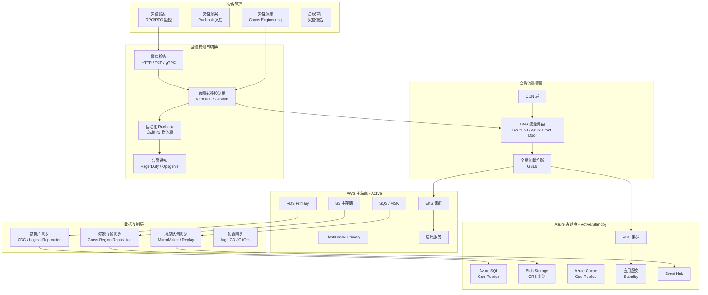
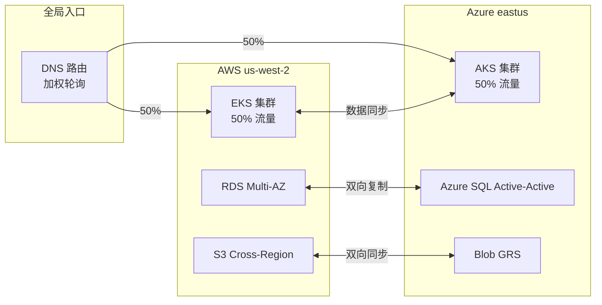

# 多云灾备深度实践

<!-- chunk: 概述 -->## 概述

多云灾备（Multi-Cloud Disaster Recovery）是企业业务连续性保障的关键策略。通过在多个云平台部署冗余工作负载和数据副本，当单一云平台发生区域级甚至云服务商级别的故障时，业务能够快速切换到备用云平台，确保 RPO（Recovery Point Objective，恢复点目标）和 RTO（Recovery Time Objective，恢复时间目标）满足业务要求。

本文档深入探讨多云灾备的四种架构模式——双活（Active-Active）、主备（Active-Passive）、Pilot Light 和冷备份，以及跨云数据复制、DNS 流量切换、自动化故障转移和灾备演练等关键技术。每种模式在成本、复杂度和恢复速度之间存在不同的权衡，企业需要根据业务关键性和预算选择合适的组合。

#<!-- chunk: 灾备模式对比 -->## 灾备模式对比

| 模式 | RPO | RTO | 成本 | 复杂度 | 适用场景 |
|:---|:---|:---|:---|:---|:---|
| Active-Active | ~0 | ~0 | 高（2x 资源） | 高 | 核心业务、金融交易 |
| Active-Passive | 分钟级 | 分钟级 | 中（1x + 备用） | 中 | 企业级应用 |
| Pilot Light | 分钟~小时 | 小时级 | 低（仅核心） | 中 | 关键数据库 |
| 冷备份 | 小时~天 | 天级 | 最低 | 低 | 开发/测试环境 |

#<!-- chunk: RPO/RTO 设计目标 -->## RPO/RTO 设计目标

| 业务等级 | RPO 目标 | RTO 目标 | 推荐模式 | 数据库复制方式 | 年度灾备成本估算 |
|:---|:---|:---|:---|:---|:---|
| L1 - 核心交易 | < 1 分钟 | < 5 分钟 | Active-Active | 同步双写 + CDC | 500-2000 万 |
| L2 - 关键业务 | < 15 分钟 | < 30 分钟 | Active-Passive | 异步复制 + CDC | 200-500 万 |
| L3 - 重要业务 | < 1 小时 | < 4 小时 | Pilot Light | 定时快照 + WAL 归档 | 50-200 万 |
| L4 - 一般业务 | < 24 小时 | < 24 小时 | 冷备份 | 每日全量备份 | 10-50 万 |

#<!-- chunk: RPO/RTO 详细计算参考 -->## RPO/RTO 详细计算参考

| 指标 | 计算公式 | 说明 |
|:---|:---|:---|
| 实际 RPO | `max(0, 数据复制延迟)` | 数据复制延迟越接近 0 越好 |
| 实际 RTO | `故障检测时间 + DNS 切换时间 + 备集群启动时间 + 健康验证时间` | 每个环节都需要精确测量 |
| 故障检测时间 | `health_check_interval * failure_threshold + evaluation_window` | 通常 30-120 秒 |
| DNS 切换时间 | `DNS TTL + Route propagation delay` | 建议 TTL <= 60s |
| 备集群启动时间 | `Pod scheduling + Image pull + Application init + Readiness probe` | 预热可降至 30-60s |
| 数据恢复时间 | `Snapshot restore + WAL replay + Index rebuild` | 取决于数据量和日志量 |

<!-- chunk: 架构设计 -->## 架构设计

#<!-- chunk: 多云灾备架构总览 -->## 多云灾备架构总览



#<!-- chunk: Active-Active 双活架构 -->## Active-Active 双活架构



<!-- chunk: 多区域部署 YAML 配置 -->## 多区域部署 YAML 配置

#<!-- chunk: 跨云多区域 Deployment（Karmada 分发） -->## 跨云多区域 Deployment（Karmada 分发）

```yaml
apiVersion: policy.karmada.io/v1alpha1
kind: PropagationPolicy
metadata:
  name: dr-application-policy
  namespace: production
spec:
  resourceSelectors:
  - apiVersion: apps/v1
    kind: Deployment
    name: dr-application
  - apiVersion: v1
    kind: Service
    name: dr-application-svc
  - apiVersion: networking.k8s.io/v1
    kind: Ingress
    name: dr-application-ingress
  - apiVersion: v1
    kind: ConfigMap
    name: dr-application-config

  placement:
    clusterAffinity:
      clusterNames:
      - aws-us-west-2
      - aws-eu-west-1
      - azure-eastus
      - gcp-asia-east1

    clusterTolerations:
    - key: "cluster.karmada.io/not-ready"
      operator: "Exists"
      effect: "NoExecute"
      tolerationSeconds: 120
    - key: "cluster.karmada.io/unreachable"
      operator: "Exists"
      effect: "NoExecute"
      tolerationSeconds: 120

    replicaScheduling:
      replicaDivisionPreference: Weighted
      replicaSchedulingType: Divided
      weightPreference:
        staticWeightList:
        - targetCluster:
            clusterNames:
            - aws-us-west-2
          weight: 3
        - targetCluster:
            clusterNames:
            - azure-eastus
          weight: 3
        - targetCluster:
            clusterNames:
            - aws-eu-west-1
          weight: 2
        - targetCluster:
            clusterNames:
            - gcp-asia-east1
          weight: 2
        dynamicWeight: AvailableReplicas

    spreadConstraints:
    - spreadByField: cluster
      maxGroups: 4
      minGroups: 2
---
apiVersion: policy.karmada.io/v1alpha1
kind: OverridePolicy
metadata:
  name: dr-application-override
  namespace: production
spec:
  resourceSelectors:
  - apiVersion: apps/v1
    kind: Deployment
    name: dr-application
  overrideRules:
  - targetCluster:
      clusterNames:
      - aws-us-west-2
    overriders:
      plaintext:
      - path: "/spec/template/spec/containers/0/env"
        operation: add
        value:
        - name: CLOUD_PROVIDER
          value: "aws"
        - name: REGION
          value: "us-west-2"
        - name: DB_HOST
          value: "rds-primary.us-west-2.rds.amazonaws.com"
  - targetCluster:
      clusterNames:
      - azure-eastus
    overriders:
      plaintext:
      - path: "/spec/template/spec/containers/0/env"
        operation: add
        value:
        - name: CLOUD_PROVIDER
          value: "azure"
        - name: REGION
          value: "eastus"
        - name: DB_HOST
          value: "azure-sql.database.windows.net"
  - targetCluster:
      clusterNames:
      - gcp-asia-east1
    overriders:
      plaintext:
      - path: "/spec/template/spec/containers/0/env"
        operation: add
        value:
        - name: CLOUD_PROVIDER
          value: "gcp"
        - name: REGION
          value: "asia-east1"
        - name: DB_HOST
          value: "cloud-sql.asia-east1.sql.googleapis.com"
---
apiVersion: apps/v1
kind: Deployment
metadata:
  name: dr-application
  namespace: production
spec:
  replicas: 20
  selector:
    matchLabels:
      app: dr-application
  template:
    metadata:
      labels:
        app: dr-application
    spec:
      affinity:
        podAntiAffinity:
          preferredDuringSchedulingIgnoredDuringExecution:
          - weight: 100
            podAffinityTerm:
              labelSelector:
                matchLabels:
                  app: dr-application
              topologyKey: topology.kubernetes.io/zone
      topologySpreadConstraints:
      - maxSkew: 1
        topologyKey: topology.kubernetes.io/zone
        whenUnsatisfiable: DoNotSchedule
        labelSelector:
          matchLabels:
            app: dr-application
      containers:
      - name: app
        image: registry.example.com/app:v2.5.1
        resources:
          requests:
            cpu: "100m"
            memory: "128Mi"
          limits:
            cpu: "500m"
            memory: "512Mi"
        ports:
        - containerPort: 8080
        livenessProbe:
          httpGet:
            path: /healthz
            port: 8080
          initialDelaySeconds: 10
          periodSeconds: 10
        readinessProbe:
          httpGet:
            path: /readyz
            port: 8080
          initialDelaySeconds: 5
          periodSeconds: 5
        env:
        - name: CLUSTER_NAME
          valueFrom:
            fieldRef:
              fieldPath: metadata.labels['topology.kubernetes.io/zone']
        - name: POD_NAME
          valueFrom:
            fieldRef:
              fieldPath: metadata.name
        volumeMounts:
        - name: config
          mountPath: /etc/app/config
          readOnly: true
      volumes:
      - name: config
        configMap:
          name: dr-application-config
```

<!-- chunk: 核心组件配置 -->## 核心组件配置

#<!-- chunk: Karmada 故障转移配置 -->## Karmada 故障转移配置

```yaml
apiVersion: policy.karmada.io/v1alpha1
kind: PropagationPolicy
metadata:
  name: dr-application-policy
  namespace: production
spec:
  resourceSelectors:
  - apiVersion: apps/v1
    kind: Deployment
    name: dr-application
  - apiVersion: v1
    kind: Service
    name: dr-application-svc
  - apiVersion: networking.k8s.io/v1
    kind: Ingress
    name: dr-application-ingress

  placement:
    clusterAffinity:
      clusterNames:
      - aws-cluster
      - azure-cluster

    clusterTolerations:
    - key: "cluster.karmada.io/not-ready"
      operator: "Exists"
      effect: "NoExecute"
      tolerationSeconds: 120
    - key: "cluster.karmada.io/unreachable"
      operator: "Exists"
      effect: "NoExecute"
      tolerationSeconds: 120

    replicaScheduling:
      replicaDivisionPreference: Weighted
      replicaSchedulingType: Divided
      weightPreference:
        staticWeightList:
        - targetCluster:
            clusterNames:
            - aws-cluster
          weight: 2
        - targetCluster:
            clusterNames:
            - azure-cluster
          weight: 1
        dynamicWeight: AvailableReplicas

    spreadConstraints:
    - spreadByField: cluster
      maxGroups: 2
      minGroups: 1
---
apiVersion: apps/v1
kind: Deployment
metadata:
  name: dr-application
  namespace: production
spec:
  replicas: 12
  selector:
    matchLabels:
      app: dr-application
  template:
    metadata:
      labels:
        app: dr-application
    spec:
      containers:
      - name: app
        image: app:latest
        resources:
          requests:
            cpu: "100m"
            memory: "128Mi"
          limits:
            cpu: "500m"
            memory: "512Mi"
        ports:
        - containerPort: 8080
        livenessProbe:
          httpGet:
            path: /healthz
            port: 8080
          initialDelaySeconds: 10
          periodSeconds: 10
        readinessProbe:
          httpGet:
            path: /readyz
            port: 8080
          initialDelaySeconds: 5
          periodSeconds: 5
        env:
        - name: CLUSTER_NAME
          valueFrom:
            fieldRef:
              fieldPath: metadata.labels['topology.kubernetes.io/zone']
```

<!-- chunk: Velero 跨集群备份调度配置 -->## Velero 跨集群备份调度配置

#<!-- chunk: Velero 多云备份调度（完整 Schedule 清单） -->## Velero 多云备份调度（完整 Schedule 清单）

```yaml
apiVersion: velero.io/v1
kind: Schedule
metadata:
  name: production-hourly-backup
  namespace: velero
spec:
  schedule: "0 * * * *"
  template:
    includedNamespaces:
    - production
    excludedResources:
    - events
    - podmetrics
    snapshotVolumes: true
    defaultVolumesToFsBackup: true
    ttl: 72h
    storageLocation: aws-primary
    volumeSnapshotLocations:
    - aws-primary
    hooks:
      pre:
      - name: database-dump-before-backup
        labelSelector:
          matchLabels:
            app: mysql
        exec:
          container: mysql
          command:
          - /bin/bash
          - -c
          - "mysqldump --all-databases --single-transaction --quick > /tmp/pre-backup-dump.sql"
          onError: Fail
          timeout: 300s
---
apiVersion: velero.io/v1
kind: Schedule
metadata:
  name: production-daily-full-backup
  namespace: velero
spec:
  schedule: "0 2 * * *"
  template:
    includedNamespaces:
    - production
    - monitoring
    - ingress-nginx
    - cert-manager
    excludedResources:
    - events
    - podmetrics
    snapshotVolumes: true
    defaultVolumesToFsBackup: true
    ttl: 720h
    storageLocation: azure-dr
    volumeSnapshotLocations:
    - azure-dr
    hooks:
      pre:
      - name: pg-dump-before-backup
        labelSelector:
          matchLabels:
            app: postgresql
        exec:
          container: postgresql
          command:
          - /bin/bash
          - -c
          - "pg_dumpall -U postgres > /tmp/pre-backup-dump.sql"
          onError: Fail
          timeout: 600s
      post:
      - name: cleanup-dump-files
        labelSelector:
          matchLabels:
            app: mysql
        exec:
          container: mysql
          command:
          - /bin/bash
          - -c
          - "rm -f /tmp/pre-backup-dump.sql"
          onError: Continue
---
apiVersion: velero.io/v1
kind: Schedule
metadata:
  name: staging-daily-backup
  namespace: velero
spec:
  schedule: "30 3 * * *"
  template:
    includedNamespaces:
    - staging
    snapshotVolumes: false
    defaultVolumesToFsBackup: false
    ttl: 168h
    storageLocation: aws-primary
---
apiVersion: velero.io/v1
kind: BackupStorageLocation
metadata:
  name: aws-primary
  namespace: velero
spec:
  provider: aws
  objectStorage:
    bucket: company-velero-backups-primary
    prefix: velero
  config:
    region: us-west-2
  accessMode: ReadWrite
---
apiVersion: velero.io/v1
kind: BackupStorageLocation
metadata:
  name: azure-dr
  namespace: velero
spec:
  provider: azure
  objectStorage:
    bucket: company-velero-backups-dr
    prefix: velero
  config:
    resourceGroup: dr-backup-rg
    storageAccount: drvelerobackup
    subscriptionId: xxxxxxxx-xxxx-xxxx-xxxx-xxxxxxxxxxxx
  accessMode: ReadWrite
```

#<!-- chunk: Velero 备份验证 [[CronJob|CronJob]] -->## Velero 备份验证 CronJob

```yaml
apiVersion: batch/v1
kind: CronJob
metadata:
  name: velero-backup-verification
  namespace: velero
spec:
  schedule: "0 6 * * *"
  concurrencyPolicy: Forbid
  successfulJobsHistoryLimit: 3
  failedJobsHistoryLimit: 5
  jobTemplate:
    spec:
      template:
        spec:
          serviceAccountName: velero-verify
          containers:
          - name: verify
            image: velero/velero:v1.15.0
            command:
            - /bin/bash
            - -c
            - |
              echo "=== Velero Backup Verification Report ==="
              echo "Report Date: $(date '+%Y-%m-%d %H:%M:%S UTC')"
              echo ""

              echo "[1] Checking all Backup Storage Locations..."
              velero backup-location get -o wide
              echo ""

              echo "[2] Checking recent backup schedules..."
              velero schedule get
              echo ""

              echo "[3] Listing backups from the last 24 hours..."
              velero backup get --sort-by=.metadata.creationTimestamp | tail -10
              echo ""

              echo "[4] Verifying latest production backup status..."
              LATEST=$(velero backup get --include-namespaces production -o json | jq -r '.items | sort_by(.metadata.creationTimestamp) | last | .metadata.name')
              if [ -n "$LATEST" ]; then
                echo "Latest backup: $LATEST"
                velero backup describe "$LATEST" --details
                echo ""
                PHASE=$(velero backup get "$LATEST" -o jsonpath='{.status.phase}')
                if [ "$PHASE" != "Completed" ]; then
                  echo "WARNING: Latest backup phase is $PHASE, expected Completed"
                fi
              else
                echo "ERROR: No production backups found!"
              fi
              echo ""

              echo "[5] Checking backup storage usage..."
              echo "AWS Primary BSL:"
              velero backup-location get aws-primary -o jsonpath='{.status}' | jq .
              echo "Azure DR BSL:"
              velero backup-location get azure-dr -o jsonpath='{.status}' | jq .
              echo ""

              echo "=== Verification Complete ==="
          restartPolicy: OnFailure
```

<!-- chunk: DNS 故障转移配置 -->## DNS 故障转移配置

#<!-- chunk: Route 53 加权 + 故障转移 DNS 配置 -->## Route 53 加权 + 故障转移 DNS 配置

```hcl
resource "aws_route53_health_check" "primary" {
  fqdn              = "api-primary.example.com"
  port              = 443
  type              = "HTTPS"
  resource_path     = "/healthz"
  failure_threshold = 3
  request_interval  = 30

  tags = {
    Name = "primary-site-health-check"
  }
}

resource "aws_route53_health_check" "secondary" {
  fqdn              = "api-secondary.example.com"
  port              = 443
  type              = "HTTPS"
  resource_path     = "/healthz"
  failure_threshold = 3
  request_interval  = 30
}

resource "aws_route53_record" "primary_record" {
  zone_id = var.route53_zone_id
  name    = "api.example.com"
  type    = "A"

  alias {
    name                   = aws_lb.primary.dns_name
    zone_id                = aws_lb.primary.zone_id
    evaluate_target_health = true
  }

  health_check_id = aws_route53_health_check.primary.id

  set_identifier = "primary"
  weighted_routing_policy {
    weight = 70
  }
}

resource "aws_route53_record" "secondary_record" {
  zone_id = var.route53_zone_id
  name    = "api.example.com"
  type    = "A"

  alias {
    name                   = azurerm_public_ip.secondary.fqdn
    zone_id                = azurerm_public_ip.secondary.zone_id
    evaluate_target_health = true
  }

  health_check_id = aws_route53_health_check.secondary.id

  set_identifier = "secondary"
  weighted_routing_policy {
    weight = 30
  }
}

resource "aws_route53_record" "failover_primary" {
  zone_id = var.route53_zone_id
  name    = "api-failover.example.com"
  type    = "A"

  alias {
    name                   = aws_lb.primary.dns_name
    zone_id                = aws_lb.primary.zone_id
    evaluate_target_health = true
  }

  set_identifier = "primary"
  failover_routing_policy {
    type = "PRIMARY"
  }
}

resource "aws_route53_record" "failover_secondary" {
  zone_id = var.route53_zone_id
  name    = "api-failover.example.com"
  type    = "A"

  alias {
    name                   = azurerm_public_ip.secondary.fqdn
    zone_id                = azurerm_public_ip.secondary.zone_id
    evaluate_target_health = true
  }

  set_identifier = "secondary"
  failover_routing_policy {
    type = "SECONDARY"
  }
}
```

#<!-- chunk: Azure Front Door DNS 故障转移配置 -->## Azure Front Door DNS 故障转移配置

```hcl
resource "azurerm_cdn_frontdoor_profile" "dr_failover" {
  name                = "dr-failover-profile"
  resource_group_name = azurerm_resource_group.dr.name
  sku_name            = "Standard_AzureFrontDoor"
}

resource "azurerm_cdn_frontdoor_endpoint" "api" {
  name                    = "api-example-dr"
  cdn_frontdoor_profile_id = azurerm_cdn_frontdoor_profile.dr_failover.id
}

resource "azurerm_cdn_frontdoor_origin_group" "primary_group" {
  name                     = "primary-origin-group"
  cdn_frontdoor_profile_id = azurerm_cdn_frontdoor_profile.dr_failover.id
  session_affinity_enabled = false

  load_balancing {
    sample_size                 = 4
    successful_samples_required = 3
    additional_latency_in_milliseconds = 50
  }

  health_probe {
    path                = "/healthz"
    request_type        = "GET"
    protocol            = "Https"
    interval_in_seconds = 30
  }
}

resource "azurerm_cdn_frontdoor_origin" "aws_primary" {
  name                          = "aws-primary"
  cdn_frontdoor_origin_group_id = azurerm_cdn_frontdoor_origin_group.primary_group.id
  enabled                        = true
  host_name                      = "api-primary.example.com"
  http_port                      = 80
  https_port                     = 443
  origin_host_header             = "api-primary.example.com"
  priority                       = 1
  weight                         = 1000
}

resource "azurerm_cdn_frontdoor_origin" "azure_secondary" {
  name                          = "azure-secondary"
  cdn_frontdoor_origin_group_id = azurerm_cdn_frontdoor_origin_group.primary_group.id
  enabled                        = true
  host_name                      = "api-secondary.example.com"
  http_port                      = 80
  https_port                     = 443
  origin_host_header             = "api-secondary.example.com"
  priority                       = 2
  weight                         = 500
}
```

<!-- chunk: 跨云数据复制配置 -->## 跨云数据复制配置

#<!-- chunk: 数据库 CDC 复制 -->## 数据库 CDC 复制

```yaml
apiVersion: apps/v1
kind: Deployment
metadata:
  name: debezium-cdc-replicator
  namespace: data-replication
spec:
  replicas: 2
  selector:
    matchLabels:
      app: debezium-cdc
  template:
    metadata:
      labels:
        app: debezium-cdc
    spec:
      containers:
      - name: connect
        image: debezium/connect:2.5
        ports:
        - containerPort: 8083
        env:
        - name: BOOTSTRAP_SERVERS
          value: "kafka:9092"
        - name: GROUP_ID
          value: "cdc-replicator"
        - name: CONFIG_STORAGE_TOPIC
          value: "connect-configs"
        - name: OFFSET_STORAGE_TOPIC
          value: "connect-offsets"
        - name: STATUS_STORAGE_TOPIC
          value: "connect-status"
        - name: KEY_CONVERTER
          value: "org.apache.kafka.connect.json.JsonConverter"
        - name: VALUE_CONVERTER
          value: "org.apache.kafka.connect.json.JsonConverter"
        resources:
          requests:
            cpu: "500m"
            memory: "1Gi"
          limits:
            cpu: "2000m"
            memory: "4Gi"
---
apiVersion: v1
kind: ConfigMap
metadata:
  name: debezium-source-config
  namespace: data-replication
data:
  source-connector.json: |
    {
      "name": "aws-rds-source",
      "config": {
        "connector.class": "io.debezium.connector.postgresql.PostgresConnector",
        "database.hostname": "rds-primary.us-west-2.rds.amazonaws.com",
        "database.port": "5432",
        "database.user": "cdc_user",
        "database.password": "${DB_PASSWORD}",
        "database.dbname": "production",
        "database.server.name": "aws_rds",
        "plugin.name": "pgoutput",
        "slot.name": "debezium_slot",
        "publication.name": "debezium_publication",
        "table.include.list": "public.orders,public.users,public.products",
        "snapshot.mode": "never",
        "tombstones.on.delete": "false",
        "decimal.handling.mode": "string",
        "heartbeat.interval.ms": "5000"
      }
    }
  sink-connector.json: |
    {
      "name": "azure-sql-sink",
      "config": {
        "connector.class": "io.debezium.connector.jdbc.JdbcSinkConnector",
        "connection.url": "jdbc:sqlserver://azure-sql.database.windows.net:1433;database=production",
        "connection.username": "cdc_user",
        "connection.password": "${DB_PASSWORD}",
        "topics": "aws_rds.public.orders,aws_rds.public.users,aws_rds.public.products",
        "insert.mode": "upsert",
        "delete.enabled": "true",
        "primary.key.mode": "record_key",
        "schema.evolution": "basic"
      }
    }
```

#<!-- chunk: MySQL 跨云主从复制配置 -->## MySQL 跨云主从复制配置

```yaml
apiVersion: v1
kind: ConfigMap
metadata:
  name: mysql-replication-config
  namespace: data-replication
data:
  primary.cnf: |
    [mysqld]
    server-id = 1
    log-bin = mysql-bin
    binlog-format = ROW
    binlog-row-image = FULL
    sync-binlog = 1
    innodb-flush-log-at-trx-commit = 1
    gtid-mode = ON
    enforce-gtid-consistency = ON
    log-slave-updates = ON
    max-binlog-size = 256M
    binlog-expire-logs-seconds = 604800
    report-host = mysql-primary.aws.internal
  replica.cnf: |
    [mysqld]
    server-id = 2
    log-bin = mysql-bin
    binlog-format = ROW
    relay-log = relay-bin
    read-only = ON
    gtid-mode = ON
    enforce-gtid-consistency = ON
    log-slave-updates = ON
    sync-relay-log = 1
    relay-log-recovery = ON
    report-host = mysql-replica.azure.internal
---
apiVersion: batch/v1
kind: Job
metadata:
  name: mysql-replication-setup
  namespace: data-replication
spec:
  template:
    spec:
      containers:
      - name: setup
        image: mysql:8.0
        command:
        - /bin/bash
        - -c
        - |
          echo "=== MySQL Cross-Cloud Replication Setup ==="
          echo "Timestamp: $(date '+%Y-%m-%d %H:%M:%S')"

          echo "[1] Verifying primary database connectivity..."
          mysql -h mysql-primary.aws.internal -u root -p"${PRIMARY_ROOT_PASSWORD}" -e "SELECT VERSION(); SHOW MASTER STATUS\G"

          echo "[2] Creating replication user on primary..."
          mysql -h mysql-primary.aws.internal -u root -p"${PRIMARY_ROOT_PASSWORD}" -e "
            CREATE USER IF NOT EXISTS 'repl_user'@'%' IDENTIFIED BY '${REPL_PASSWORD}';
            GRANT REPLICATION SLAVE ON *.* TO 'repl_user'@'%';
            FLUSH PRIVILEGES;
          "

          echo "[3] Configuring replica to connect to primary..."
          mysql -h mysql-replica.azure.internal -u root -p"${REPLICA_ROOT_PASSWORD}" -e "
            CHANGE MASTER TO
              MASTER_HOST='mysql-primary.aws.internal',
              MASTER_USER='repl_user',
              MASTER_PASSWORD='${REPL_PASSWORD}',
              MASTER_AUTO_POSITION=1,
              MASTER_CONNECT_RETRY=10,
              MASTER_RETRY_COUNT=86400;
            START SLAVE;
          "

          echo "[4] Verifying replication status..."
          mysql -h mysql-replica.azure.internal -u root -p"${REPLICA_ROOT_PASSWORD}" -e "SHOW SLAVE STATUS\G" | grep -E "Slave_IO_Running|Slave_SQL_Running|Seconds_Behind_Master"

          echo "=== MySQL Cross-Cloud Replication Setup Complete ==="
      restartPolicy: OnFailure
```

#<!-- chunk: PostgreSQL 跨云逻辑复制配置 -->## PostgreSQL 跨云逻辑复制配置

```yaml
apiVersion: v1
kind: ConfigMap
metadata:
  name: postgresql-logical-replication
  namespace: data-replication
data:
  publisher.sql: |
    -- Enable logical replication on the publisher (AWS RDS)
    -- Must be configured in RDS parameter group: rds.logical_replication = 1

    -- Create a publication for the tables to replicate
    CREATE PUBLICATION multicloud_pub FOR TABLE
      orders,
      users,
      products,
      inventory,
      transactions;

    -- Grant replication privileges
    GRANT USAGE ON SCHEMA public TO replicator;
    GRANT SELECT ON ALL TABLES IN SCHEMA public TO replicator;

    -- Monitor replication slots
    SELECT slot_name, plugin, slot_type, active, restart_lsn
    FROM pg_replication_slots;
  subscriber.sql: |
    -- Configure the subscriber (Azure PostgreSQL)
    CREATE SUBSCRIPTION multicloud_sub
      CONNECTION 'host=rds-primary.us-west-2.rds.amazonaws.com port=5432 dbname=production user=replicator password=REDACTED sslmode=require'
      PUBLICATION multicloud_pub
      WITH (
        copy_data = true,
        create_slot = true,
        streaming = 'parallel',
        synchronous_commit = 'off'
      );

    -- Monitor subscription status
    SELECT subname, pid, received_lsn, latest_end_lsn, latest_end_time
    FROM pg_stat_subscription;
---
apiVersion: batch/v1
kind: CronJob
metadata:
  name: postgresql-replication-monitor
  namespace: data-replication
spec:
  schedule: "*/5 * * * *"
  concurrencyPolicy: Forbid
  jobTemplate:
    spec:
      template:
        spec:
          containers:
          - name: monitor
            image: postgres:16
            command:
            - /bin/bash
            - -c
            - |
              echo "=== PostgreSQL Cross-Cloud Replication Monitor ==="
              echo "Check Time: $(date '+%Y-%m-%d %H:%M:%S UTC')"
              echo ""

              echo "[1] Checking publisher replication slots..."
              psql "host=$PG_PUBLISHER_HOST port=5432 dbname=production user=monitor" -c "
                SELECT slot_name, active, restart_lsn,
                       pg_current_wal_lsn() AS current_lsn,
                       pg_wal_lsn_diff(pg_current_wal_lsn(), restart_lsn) AS lag_bytes
                FROM pg_replication_slots;"
              echo ""

              echo "[2] Checking subscriber replication lag..."
              psql "host=$PG_SUBSCRIBER_HOST port=5432 dbname=production user=monitor" -c "
                SELECT subname,
                       received_lsn,
                       latest_end_lsn,
                       latest_end_time,
                       now() - latest_end_time AS replication_delay
                FROM pg_stat_subscription;"
              echo ""

              echo "[3] Checking table row counts (sample validation)..."
              for table in orders users products; do
                primary_count=$(psql "host=$PG_PUBLISHER_HOST port=5432 dbname=production user=monitor" -t -c "SELECT COUNT(*) FROM $table;" | xargs)
                replica_count=$(psql "host=$PG_SUBSCRIBER_HOST port=5432 dbname=production user=monitor" -t -c "SELECT COUNT(*) FROM $table;" | xargs)
                echo "Table $table: primary=$primary_count replica=$replica_count diff=$((primary_count - replica_count))"
              done

              echo ""
              echo "=== Replication Monitor Complete ==="
          restartPolicy: OnFailure
```

#<!-- chunk: 对象存储跨云同步 -->## 对象存储跨云同步

```yaml
apiVersion: batch/v1
kind: CronJob
metadata:
  name: s3-to-blob-sync
  namespace: data-replication
spec:
  schedule: "*/5 * * * *"
  concurrencyPolicy: Forbid
  successfulJobsHistoryLimit: 3
  failedJobsHistoryLimit: 5
  jobTemplate:
    spec:
      template:
        spec:
          containers:
          - name: rclone-sync
            image: rclone/rclone:latest
            command:
            - /bin/sh
            - -c
            - |
              echo "=== Cross-Cloud Object Storage Sync ==="
              echo "Sync Start: $(date '+%Y-%m-%d %H:%M:%S UTC')"

              rclone sync \
                --transfers 32 \
                --checkers 16 \
                --contimeout 60s \
                --timeout 300s \
                --retries 3 \
                --retries-sleep 5s \
                --log-level INFO \
                --stats 30s \
                --stats-one-line \
                aws-s3:production-bucket/data \
                azure-blob:production-container/data

              echo "Sync Complete: $(date '+%Y-%m-%d %H:%M:%S UTC')"
            volumeMounts:
            - name: rclone-config
              mountPath: /config/rclone
          restartPolicy: OnFailure
          volumes:
          - name: rclone-config
            secret:
              secretName: rclone-config
```

#<!-- chunk: Velero 跨集群备份与恢复 -->## Velero 跨集群备份与恢复

```bash
#!/bin/bash
set -euo pipefail

echo "=== Velero Cross-Cluster Disaster Recovery ==="
echo "Operation Time: $(date '+%Y-%m-%d %H:%M:%S UTC')"

echo "[1] Configure Velero on primary cluster (AWS)"
velero install \
    --provider aws \
    --bucket velero-backups \
    --backup-location-config region=us-west-2 \
    --snapshot-location-config region=us-west-2 \
    --secret-file ./aws-credentials \
    --use-node-agent \
    --default-volumes-to-fs-backup \
    --features=EnableCSI

echo "[2] Create scheduled backup plans"
velero schedule create production-hourly \
    --schedule="0 * * * *" \
    --include-namespaces production \
    --default-volumes-to-fs-backup \
    --ttl 72h

velero schedule create production-daily-full \
    --schedule="0 2 * * *" \
    --include-namespaces production,monitoring,ingress-nginx \
    --default-volumes-to-fs-backup \
    --ttl 720h

velero schedule create staging-daily \
    --schedule="30 3 * * *" \
    --include-namespaces staging \
    --ttl 168h

echo "[3] Create on-demand backup (pre-failover)"
velero backup create pre-failover-backup \
    --include-namespaces production \
    --default-volumes-to-fs-backup \
    --wait

echo "[4] Verify backup completeness"
velero backup describe pre-failover-backup --details
BACKUP_STATUS=$(velero backup get pre-failover-backup -o jsonpath='{.status.phase}')
if "$BACKUP_STATUS" != "Completed"; then
    echo "ERROR: Backup status is $BACKUP_STATUS, expected Completed"
    exit 1
fi
echo "Backup status: $BACKUP_STATUS"

echo "[5] Configure Velero on secondary cluster (Azure)"
velero install \
    --provider azure \
    --bucket velero-backups-dr \
    --backup-location-config resourceGroup=dr-rg,storageAccount=drstorage \
    --secret-file ./azure-credentials \
    --use-node-agent \
    --features=EnableCSI

echo "[6] Restore from backup to secondary cluster"
velero restore create production-restore \
    --from-backup production-daily-full-$(date +%Y%m%d --date='yesterday') \
    --namespace-mappings production:production \
    --restore-volumes \
    --wait

echo "[7] Verify restore completeness"
velero restore describe production-restore --details
RESTORE_STATUS=$(velero restore get production-restore -o jsonpath='{.status.phase}')
echo "Restore status: $RESTORE_STATUS"

echo "[8] Validate restored resources"
kubectl get pods -n production
kubectl get svc -n production
kubectl get ingress -n production
kubectl get pvc -n production

echo "=== Velero Cross-Cluster DR Complete ==="
```

<!-- chunk: 安全配置 -->## 安全配置

#<!-- chunk: 灾备安全策略 -->## 灾备安全策略

```yaml
apiVersion: kyverno.io/v1
kind: ClusterPolicy
metadata:
  name: dr-compliance-check
spec:
  validationFailureAction: Audit
  rules:
  - name: require-pdb
    match:
      any:
      - resources:
          kinds:
          - Deployment
          namespaces:
          - production
    validate:
      message: "Production Deployment must have PodDisruptionBudget configured"
  - name: require-cross-cluster-backup
    match:
      any:
      - resources:
          kinds:
          - StatefulSet
          namespaces:
          - production
    validate:
      message: "Stateful workloads must have cross-cluster backup annotation"
  - name: require-readiness-probe
    match:
      any:
      - resources:
          kinds:
          - Deployment
          namespaces:
          - production
    validate:
      message: "Production Deployment must have readiness probe for DR health checks"
      pattern:
        spec:
          template:
            spec:
              containers:
              - readinessProbe:
                  <<: {}
---
apiVersion: policy/v1
kind: PodDisruptionBudget
metadata:
  name: dr-application-pdb
  namespace: production
spec:
  minAvailable: "66%"
  selector:
    matchLabels:
      app: dr-application
```

<!-- chunk: 监控告警 -->## 监控告警

#<!-- chunk: 灾备指标监控 [[Prometheus|Prometheus]] Alert Rules -->## 灾备指标监控 Prometheus Alert Rules

```yaml
apiVersion: monitoring.coreos.com/v1
kind: PrometheusRule
metadata:
  name: disaster-recovery-alerts
  namespace: monitoring
spec:
  groups:
  - name: dr.rules
    rules:
    - alert: DRPrimarySiteUnhealthy
      expr: http_health_check_status{site="primary"} == 0
      for: 2m
      labels:
        severity: critical
        team: sre
      annotations:
        summary: "DR primary site is unhealthy"
        description: "Primary site health check has been failing for over 2 minutes, failover may be required"
        runbook_url: "https://wiki.internal/runbooks/dr-failover"

    - alert: DRDataReplicationLag
      expr: cdc_replication_lag_seconds > 60
      for: 5m
      labels:
        severity: warning
        team: database
      annotations:
        summary: "Data replication lag is too high"
        description: "CDC replication lag {{ $value }}s exceeds 60 seconds, RPO target may not be met"

    - alert: DRBackupStale
      expr: time() - velero_backup_timestamp > 86400
      for: 1h
      labels:
        severity: warning
        team: sre
      annotations:
        summary: "DR backup is stale"
        description: "Most recent backup is more than 24 hours old"

    - alert: DRSiteLatencyHigh
      expr: histogram_quantile(0.99, rate(dns_resolution_duration_seconds_bucket{site="primary"}[5m])) > 0.5
      for: 10m
      labels:
        severity: warning
      annotations:
        summary: "Primary site latency is too high"
        description: "Primary site P99 latency {{ $value }}s exceeds 500ms threshold"

    - alert: DRRPOViolation
      expr: cdc_replication_lag_seconds > 900
      for: 1m
      labels:
        severity: critical
        team: sre
      annotations:
        summary: "RPO violation detected"
        description: "Data replication lag exceeds 15 minutes, violating L2 RPO target"

    - alert: DRVeleroBackupFailed
      expr: increase(velero_backup_failure_total[1h]) > 0
      for: 5m
      labels:
        severity: critical
        team: sre
      annotations:
        summary: "Velero backup has failed"
        description: "Velero backup {{ $labels.schedule_name }} has failed in the last hour"

    - alert: DRStandbyClusterUnhealthy
      expr: up{job="kubernetes-apiserver", cluster="standby"} == 0
      for: 5m
      labels:
        severity: critical
        team: sre
      annotations:
        summary: "DR standby cluster is unreachable"
        description: "The standby cluster API server has been unreachable for 5 minutes"

    - alert: DRMySQLReplicationBroken
      expr: mysql_slave_running == 0
      for: 2m
      labels:
        severity: critical
        team: database
      annotations:
        summary: "MySQL cross-cloud replication is stopped"
        description: "MySQL replication to DR site has stopped, immediate investigation required"

    - alert: DRStorageSyncError
      expr: increase(rclone_sync_errors_total[1h]) > 5
      for: 10m
      labels:
        severity: warning
        team: storage
      annotations:
        summary: "Object storage sync errors detected"
        description: "{{ $value }} sync errors in the last hour between primary and DR object storage"

    - alert: DRKarmadaClusterNotReady
      expr: karmada_cluster_ready_status{cluster=~"aws-cluster|azure-cluster"} == 0
      for: 3m
      labels:
        severity: critical
        team: sre
      annotations:
        summary: "Karmada managed cluster is not ready"
        description: "Cluster {{ $labels.cluster }} has been in NotReady state for over 3 minutes"
```

#<!-- chunk: 灾备指标仪表板 JSON（Grafana 面板定义） -->## 灾备指标仪表板 JSON（Grafana 面板定义）

```yaml
apiVersion: v1
kind: ConfigMap
metadata:
  name: dr-dashboard-definitions
  namespace: monitoring
data:
  dr-overview.json: |
    {
      "dashboard": {
        "title": "Multi-Cloud DR Overview",
        "panels": [
          {
            "title": "RPO Compliance Status",
            "type": "stat",
            "targets": [{"expr": "max(cdc_replication_lag_seconds)"}],
            "fieldConfig": {
              "thresholds": {
                "steps": [
                  {"value": 0, "color": "green"},
                  {"value": 60, "color": "yellow"},
                  {"value": 300, "color": "red"}
                ]
              },
              "unit": "s"
            }
          },
          {
            "title": "Velero Backup Status",
            "type": "stat",
            "targets": [{"expr": "velero_backup_last_successful_timestamp"}]
          },
          {
            "title": "Cross-Cloud Replication Lag (All Tables)",
            "type": "timeseries",
            "targets": [{"expr": "cdc_replication_lag_seconds"}]
          },
          {
            "title": "Primary vs Standby Health",
            "type": "stat",
            "targets": [{"expr": "http_health_check_status"}]
          }
        ]
      }
    }
```

<!-- chunk: 运维管理 -->## 运维管理

#<!-- chunk: 自动化故障转移 Runbook -->## 自动化故障转移 Runbook

```bash
#!/bin/bash
set -euo pipefail

PRIMARY_CLUSTER="aws-cluster"
SECONDARY_CLUSTER="azure-cluster"
KARMADA_KUBECONFIG="/etc/karmada/karmada-apiserver.config"

echo "=== Automated Disaster Recovery Failover Runbook ==="
echo "Trigger Time: $(date '+%Y-%m-%d %H:%M:%S UTC')"
echo "Primary Cluster: $PRIMARY_CLUSTER"
echo "Secondary Cluster: $SECONDARY_CLUSTER"

echo "[1] Verify primary cluster failure"
PRIMARY_STATUS=$(kubectl --kubeconfig $KARMADA_KUBECONFIG get cluster $PRIMARY_CLUSTER -o jsonpath='{.status.conditions[?(@.type=="Ready")].status}')
if "$PRIMARY_STATUS" == "True"; then
    echo "Primary cluster is still healthy, aborting failover"
    exit 0
fi
echo "Primary cluster status: $PRIMARY_STATUS, failure confirmed"

echo "[2] Send alert notification"
curl -X POST "$PAGERDUTY_WEBHOOK" \
    -H "Content-Type: application/json" \
    -d "{\"event_type\": \"trigger\", \"description\": \"Failing over from $PRIMARY_CLUSTER to $SECONDARY_CLUSTER\", \"severity\": \"critical\"}"

echo "[3] Create pre-failover backup (best effort)"
velero backup create emergency-pre-failover \
    --include-namespaces production \
    --default-volumes-to-fs-backup \
    --timeout 300s || echo "WARNING: Pre-failover backup failed, continuing..."

echo "[4] Update DNS weights to redirect traffic to secondary"
aws route53 change-resource-record-sets \
    --hosted-zone-id $ZONE_ID \
    --change-batch '{
      "Changes": [
        {"Action": "UPSERT", "ResourceRecordSet": {"Name": "api.example.com", "Type": "A", "SetIdentifier": "secondary", "Weight": 100}},
        {"Action": "UPSERT", "ResourceRecordSet": {"Name": "api.example.com", "Type": "A", "SetIdentifier": "primary", "Weight": 0}}
      ]
    }'

echo "[5] Scale up secondary cluster workloads"
kubectl --kubeconfig $KARMADA_KUBECONFIG patch overridepolicy dr-application-override \
    -n production --type merge -p '{
      "spec": {
        "overrideRules": [{
          "targetCluster": {"clusterNames": ["'$SECONDARY_CLUSTER'"]},
          "overriders": {
            "plaintext": [{"path": "/spec/replicas", "operation": "replace", "value": 12}]
          }
        }]
      }
    }'

echo "[6] Wait for secondary cluster to be ready"
echo "Waiting 60 seconds for pod scheduling and startup..."
sleep 60
kubectl --kubeconfig $KARMADA_KUBECONFIG get pods -n production --cluster $SECONDARY_CLUSTER

echo "[7] Verify service availability"
for i in $(seq 1 10); do
    STATUS=$(curl -s -o /dev/null -w "%{http_code}" https://api.example.com/healthz)
    if "$STATUS" == "200"; then
        echo "Service recovered (attempt $i/10)"
        break
    fi
    echo "Waiting for service recovery... (HTTP $STATUS, attempt $i/10)"
    sleep 10
done

echo "[8] Record failover event"
FAILOVER_END_TIME=$(date '+%Y-%m-%d %H:%M:%S UTC')
echo "$FAILOVER_END_TIME Failover completed: $PRIMARY_CLUSTER -> $SECONDARY_CLUSTER" >> /var/log/dr-failover.log

echo "[9] Send recovery notification"
curl -X POST "$PAGERDUTY_WEBHOOK" \
    -H "Content-Type: application/json" \
    -d "{\"event_type\": \"resolve\", \"description\": \"Failover to $SECONDARY_CLUSTER completed at $FAILOVER_END_TIME\"}"

echo "Failover complete. Service is now running on $SECONDARY_CLUSTER"
```

#<!-- chunk: 灾备演练脚本 -->## 灾备演练脚本

```bash
#!/bin/bash
set -euo pipefail

echo "=== Multi-Cloud Disaster Recovery Drill ==="
echo "Drill Start Time: $(date '+%Y-%m-%d %H:%M:%S UTC')"
echo "Drill Type: ${1:-planned}"
echo "Operator: ${DRILL_OPERATOR:-automated}"

DR_LOG="dr-drill-$(date +%Y%m%d-%H%M%S).log"

log() {
    echo "$(date '+%H:%M:%S') $1" | tee -a $DR_LOG
}

RPO_START=$(date +%s)

log "[Phase 1] Record pre-drill state"
log "Primary cluster pod count: $(kubectl --kubeconfig /etc/k8s/aws-cluster.kubeconfig get pods -n production --no-headers | wc -l)"
log "Secondary cluster pod count: $(kubectl --kubeconfig /etc/k8s/azure-cluster.kubeconfig get pods -n production --no-headers | wc -l)"
log "Database replication lag: $(curl -s http://monitoring:9090/api/v1/query?query=cdc_replication_lag_seconds | jq '.data.result[0].value[1]')s"

log "[Phase 2] Simulate primary cluster failure"
log "Marking primary cluster as unavailable..."
kubectl --kubeconfig /etc/karmada/karmada-apiserver.config label cluster aws-cluster cluster.karmada.io/not-ready=true --overwrite

log "[Phase 3] Wait for failover trigger"
FAILOVER_START=$(date +%s)
sleep 120

log "[Phase 4] Verify secondary cluster takeover"
log "Secondary cluster pod count: $(kubectl --kubeconfig /etc/k8s/azure-cluster.kubeconfig get pods -n production --no-headers | wc -l)"

log "[Phase 5] Verify service recovery"
SERVICE_OK=false
for i in $(seq 1 20); do
    STATUS=$(curl -s -o /dev/null -w "%{http_code}" https://api.example.com/healthz 2>/dev/null || echo "000")
    if "$STATUS" == "200"; then
        SERVICE_OK=true
        FAILOVER_END=$(date +%s)
        log "Service recovered (attempt $i/20)"
        break
    fi
    log "Waiting for service recovery... (HTTP $STATUS, attempt $i/20)"
    sleep 10
done

FAILOVER_END=${FAILOVER_END:-$(date +%s)}
RPO_END=$(date +%s)

log "[Phase 6] Restore primary cluster"
kubectl --kubeconfig /etc/karmada/karmada-apiserver.config label cluster aws-cluster cluster.karmada.io/not-ready- --overwrite

log "[Phase 7] Drill Report"
RTO=$((FAILOVER_END - FAILOVER_START))
RPO=$((RPO_END - RPO_START))
log "RTO: ${RTO} seconds ($(( RTO / 60 )) minutes)"
log "RPO: ${RPO} seconds ($(( RPO / 60 )) minutes)"
log "Service recovered: $SERVICE_OK"

log "[Phase 8] Compliance check"
if $RTO -le 300; then
    log "PASS: RTO within L1 target (5 minutes)"
elif $RTO -le 1800; then
    log "PASS: RTO within L2 target (30 minutes)"
elif $RTO -le 14400; then
    log "PASS: RTO within L3 target (4 hours)"
else
    log "FAIL: RTO exceeds all targets"
fi

if $RPO -le 60; then
    log "PASS: RPO within L1 target (1 minute)"
elif $RPO -le 900; then
    log "PASS: RPO within L2 target (15 minutes)"
elif $RPO -le 3600; then
    log "PASS: RPO within L3 target (1 hour)"
else
    log "FAIL: RPO exceeds all targets"
fi

log "Drill complete. Full log saved to $DR_LOG"

if "$SERVICE_OK" != "true"; then
    log "ERROR: Service did not recover, manual intervention required"
    exit 1
fi
```

#<!-- chunk: 灾备状态检查脚本 -->## 灾备状态检查脚本

```bash
#!/bin/bash
set -euo pipefail

echo "=== Multi-Cloud DR Status Check ==="
echo "Check Time: $(date '+%Y-%m-%d %H:%M:%S UTC')"
echo ""

KARMADA_KUBECONFIG="/etc/karmada/karmada-apiserver.config"

echo "[1] Karmada cluster health status"
kubectl --kubeconfig $KARMADA_KUBECONFIG get clusters -o wide
echo ""

echo "[2] Cross-cluster application deployment status"
karmadactl get deployments -n production --kubeconfig $KARMADA_KUBECONFIG
echo ""

echo "[3] Velero backup schedule status"
velero schedule get
echo ""

echo "[4] Latest backup details"
LATEST_BACKUP=$(velero backup get --sort-by=.metadata.creationTimestamp -o json | jq -r '.items | last | .metadata.name')
if [ -n "$LATEST_BACKUP" ]; then
    echo "Latest backup: $LATEST_BACKUP"
    velero backup describe "$LATEST_BACKUP" --details 2>/dev/null | head -30
else
    echo "WARNING: No backups found!"
fi
echo ""

echo "[5] Backup storage location status"
velero backup-location get
echo ""

echo "[6] Data replication lag (CDC)"
curl -s http://monitoring:9090/api/v1/query?query=cdc_replication_lag_seconds | jq -r '.data.result[] | "\(.metric.source) -> \(.metric.destination): \(.value[1])s"'
echo ""

echo "[7] MySQL replication status (primary)"
mysql -h mysql-primary -u monitor -e "SHOW MASTER STATUS\G" 2>/dev/null | grep -E "File|Position|Binlog_Do_DB"
echo ""

echo "[8] MySQL replication status (replica)"
mysql -h mysql-replica -u monitor -e "SHOW SLAVE STATUS\G" 2>/dev/null | grep -E "Slave_IO_Running|Slave_SQL_Running|Seconds_Behind|Master_Host"
echo ""

echo "[9] PostgreSQL replication slot status"
psql "host=$PG_HOST port=5432 dbname=production user=monitor" -c "SELECT slot_name, active, restart_lsn, pg_wal_lsn_diff(pg_current_wal_lsn(), restart_lsn) AS lag_bytes FROM pg_replication_slots;" 2>/dev/null
echo ""

echo "[10] DNS health check status"
aws route53 get-health-check-status --health-check-id $PRIMARY_HC_ID 2>/dev/null | jq '.HealthCheckObservations[0]'
aws route53 get-health-check-status --health-check-id $SECONDARY_HC_ID 2>/dev/null | jq '.HealthCheckObservations[0]'
echo ""

echo "[11] Object storage sync status (last job)"
kubectl get job -n data-replication -l app=rclone-sync --sort-by=.metadata.creationTimestamp -o json | jq -r '.items | last | "\(.metadata.name): \(.status.succeeded // "RUNNING/FAILED")"'
echo ""

echo "=== DR Status Check Complete ==="
```

<!-- chunk: 最佳实践 -->## 最佳实践

#<!-- chunk: 灾备设计最佳实践 -->## 灾备设计最佳实践

1. **业务分级**: 按业务关键性分级（L1-L4），每级设置不同 RPO/RTO 目标
2. **数据优先**: 优先保障数据复制和一致性，其次才是应用层故障转移
3. **DNS 分层**: 使用加权路由（正常）和故障转移路由（灾备）组合
4. **定期演练**: 每季度至少执行一次灾备演练，验证 RPO/RTO 目标
5. **自动化**: 故障检测和转移流程尽可能自动化，减少人为干预
6. **配置即代码**: 所有灾备配置通过 GitOps 管理，确保跨集群一致性
7. **预热备用集群**: Pilot Light 模式下保持核心服务始终运行，减少冷启动时间

#<!-- chunk: 数据复制最佳实践 -->## 数据复制最佳实践

1. **CDC 复制**: 使用 Debezium CDC 实现近实时数据复制
2. **幂等写入**: 备集群写入操作必须幂等，避免重复数据
3. **冲突解决**: 双活架构必须设计数据冲突解决策略
4. **复制监控**: 实时监控复制延迟，设置 RPO 违规告警
5. **双向复制验证**: 定期对比源端和目标端数据一致性
6. **复制用户权限最小化**: CDC 复制用户仅授予必要的 REPLICATION 权限

#<!-- chunk: 成本优化最佳实践 -->## 成本优化最佳实践

1. **分级灾备**: 不同业务等级采用不同灾备模式
2. **Spot/预留**: 备集群使用 Spot 实例或预留实例降低成本
3. **自动缩放**: 备集群平时保持最小规模，故障时自动扩容
4. **数据分层**: 冷数据使用低成本存储，热数据使用高性能存储
5. **备份 TTL**: 设置合理的备份保留策略，避免无限增长存储成本

<!-- chunk: 故障排查 -->## 故障排查

#<!-- chunk: 常见问题 -->## 常见问题

| 问题 | 原因 | 解决方案 |
|:---|:---|:---|
| 故障转移未触发 | tolerationSeconds 过长 | 调整集群容忍度时间 |
| 备集群服务不可用 | 镜像/配置未同步 | 检查 GitOps 同步状态 |
| DNS 切换延迟 | TTL 过高 | 降低 DNS TTL 到 60s 以下 |
| 数据丢失 | 复制延迟过高 | 优化 CDC 配置，增加带宽 |
| 备集群资源不足 | 未预置足够资源 | 启用自动扩容 |
| 演练失败 | Runbook 过时 | 定期更新 Runbook 并演练 |
| Velero 恢复卡住 | CRD 版本不兼容 | 确保源和目标集群 Velero 版本一致 |
| CDC 连接断开 | 网络抖动/认证过期 | 配置自动重连，使用连接池 |
| 备份存储满 | TTL 过长或备份数据增长 | 调整 TTL，启用压缩 |
| 跨云权限不足 | IAM 角色配置错误 | 验证跨云 IAM 联邦和存储访问权限 |

<!-- chunk: 参考资源 -->## 参考资源

- [AWS Disaster Recovery Best Practices](https://docs.aws.amazon.com/wellarchitected/latest/disaster-recovery-playbook/)
- [Azure Business Continuity](https://learn.microsoft.com/en-us/azure/reliability/)
- [GCP DR Planning Guide](https://cloud.google.com/architecture/dr-scenarios-planning-guide)
- [Velero Documentation](https://velero.io/docs/)
- [Karmada Failover](https://karmada.io/docs/userguide/failover/)
- [Debezium CDC](https://debezium.io/documentation/)
- [Karmada PropagationPolicy Reference](https://karmada.io/docs/userguide/resource-propagation/)

---

**文档版本**: v2.0
**最后更新**: 2026年5月18日

---

<!-- chunk: Obsidian 相关文档 -->## Obsidian 相关文档

- domain-27-multi-cloud-hybrid MOC
- [[domain-12-cloud-providers/README.md|Domain 27: 多云与混合云架构管理]]
- Domain-27 多云与混合云 — 开源项目索引
- AWS EKS 企业级多云管理平台
- Azure AKS 企业级多云管理平台
- 企业级多云治理与成本优化深度实践
- Google GKE 企业级多云管理深度实践
- IBM Cloud Kubernetes Service (IKS) 企业级深度实践
- Alibaba Cloud ACK 企业级混合云深度实践
- 华为云 CCE 企业级容器平台深度实践
- Karmada 多集群联邦深度实践
- 多云网络互联深度实践

## See Also

- 08-multicloud-federation-karmada
- 09-multicloud-network-interconnect
- 01-aws-eks-enterprise-multicloud
- 02-azure-aks-enterprise-multicloud
