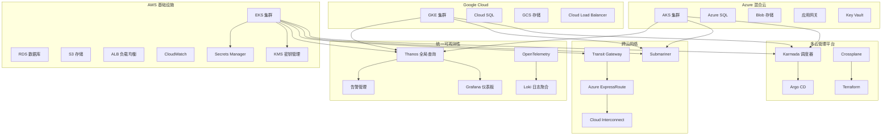
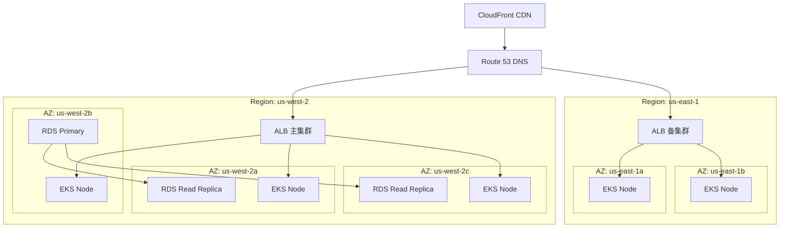

# AWS EKS 企业级多云管理平台

<!-- chunk: 概述 -->## 概述

Amazon Elastic Kubernetes Service (EKS)] [[Service|Service]] (EKS) 是 AWS 提供的托管 Kubernetes 服务，为企业提供高度可扩展、安全可靠的容器编排平台。EKS 自动管理 Kubernetes 控制平面的可用性和可扩展性，消除了企业自行维护 [[etcd|etcd]] 集群和 API Server 的复杂度，使团队能够专注于应用交付和业务创新。

在多云架构场景下，EKS 通常作为核心工作负载承载平台，与 Azure AKS、Google GKE 等云平台形成多云协同架构。企业通过统一的管理平面（如 [[Karmada|Karmada]]、Rancher）实现跨云资源调度、服务发现和故障转移，构建真正意义上的多云混合云平台。本文档从生产环境运维专家角度，深入探讨 EKS 的企业级部署架构、多云管理策略和运维最佳实践，涵盖集群规划、网络设计、安全加固、可观测性建设等关键技术领域。

## EKS 核心特性

- **托管控制平面**: AWS 负责 Kubernetes API Server、etcd 等核心组件的高可用运维
- **深度集成 AWS 服务**: IAM 认证、ALB 负载均衡、EBS 存储、CloudWatch 监控等原生集成
- **多区域部署**: 支持跨可用区部署，提供 99.95% 的 SLA 保障
- **Fargate 无服务器**: 支持无节点管理的 Pod 运行模式，按需付费
- **安全合规**: 满足 SOC、PCI DSS、HIPAA 等多项合规认证
- **混合云连接**: 通过 Direct Connect、VPN 等方式与本地数据中心互联

<!-- chunk: 架构设计 -->## 架构设计

## 企业级 EKS 集群架构

企业级 EKS 部署需要从网络、计算、存储、安全等多个维度进行全局设计。以下架构展示了典型的生产环境 EKS 集群配置，包含系统节点组、应用节点组和 GPU 节点组的分层设计。

```yaml
apiVersion: eksctl.io/v1alpha5
kind: ClusterConfig
metadata:
  name: production-eks-cluster
  region: us-west-2
  version: "1.30"

availabilityZones: ["us-west-2a", "us-west-2b", "us-west-2c"]

iam:
  withOIDC: true
  serviceAccounts:
  - metadata:
      name: cluster-autoscaler
      namespace: kube-system
    attachPolicyARNs:
    - "arn:aws:iam::aws:policy/AutoScalingFullAccess"
  - metadata:
      name: aws-load-balancer-controller
      namespace: kube-system
    attachPolicyARNs:
    - "arn:aws:iam::aws:policy/ElasticLoadBalancingFullAccess"
  - metadata:
      name: ebs-csi-controller-sa
      namespace: kube-system
    attachPolicyARNs:
    - "arn:aws:iam::aws:policy/service-role/AmazonEBSCSIDriverPolicy"

vpc:
  cidr: "10.0.0.0/16"
  subnets:
    private:
      us-west-2a: { cidr: "10.0.0.0/19" }
      us-west-2b: { cidr: "10.0.32.0/19" }
      us-west-2c: { cidr: "10.0.64.0/19" }
    public:
      us-west-2a: { cidr: "10.0.96.0/19" }
      us-west-2b: { cidr: "10.0.128.0/19" }
      us-west-2c: { cidr: "10.0.160.0/19" }
  clusterEndpoints:
    privateAccess: true
    publicAccess: false
  nat:
    gateway: HighlyAvailable

managedNodeGroups:
  - name: system-ng
    instanceType: m5.large
    desiredCapacity: 3
    minSize: 3
    maxSize: 10
    volumeSize: 50
    volumeType: gp3
    amiFamily: AmazonLinux2
    labels: { role: system }
    taints:
      - key: CriticalAddonsOnly
        value: "true"
        effect: NoSchedule
    tags:
      k8s.io/cluster-autoscaler/enabled: "true"
      k8s.io/cluster-autoscaler/production-eks-cluster: "owned"

  - name: application-ng
    instanceType: m5.xlarge
    desiredCapacity: 6
    minSize: 3
    maxSize: 30
    volumeSize: 100
    volumeType: gp3
    amiFamily: AmazonLinux2
    labels: { role: application }
    tags:
      k8s.io/cluster-autoscaler/enabled: "true"
      k8s.io/cluster-autoscaler/production-eks-cluster: "owned"

  - name: memory-ng
    instanceType: r5.xlarge
    desiredCapacity: 2
    minSize: 1
    maxSize: 10
    volumeSize: 200
    volumeType: gp3
    amiFamily: AmazonLinux2
    labels: { role: memory-intensive }
    taints:
      - key: memory-intensive
        value: "true"
        effect: NoSchedule
    tags:
      k8s.io/cluster-autoscaler/enabled: "true"
      k8s.io/cluster-autoscaler/production-eks-cluster: "owned"

  - name: gpu-ng
    instanceType: g4dn.xlarge
    desiredCapacity: 2
    minSize: 0
    maxSize: 5
    volumeSize: 200
    volumeType: gp3
    amiFamily: AmazonLinux2
    labels: { role: gpu, accelerator: nvidia }
    taints:
      - key: nvidia.com/gpu
        value: "true"
        effect: NoSchedule
    tags:
      k8s.io/cluster-autoscaler/enabled: "true"
      k8s.io/cluster-autoscaler/production-eks-cluster: "owned"

addons:
- name: vpc-cni
  version: latest
  configurationValues: |-
    env:
      ENABLE_PREFIX_DELEGATION: "true"
      WARM_PREFIX_TARGET: "1"
      POD_SECURITY_GROUP_ENFORCING_MODE: "standard"
- name: coredns
  version: latest
- name: kube-proxy
  version: latest
- name: aws-ebs-csi-driver
  version: latest
  serviceAccountRoleARN: arn:aws:iam::123456789012:role/AmazonEKS_EBS_CSI_DriverRole

cloudWatch:
  clusterLogging:
    enableTypes: ["api", "audit", "authenticator", "controllerManager", "scheduler"]
    logRetentionInDays: 90
```

## 多云架构集成

以下 Mermaid 图展示了 EKS 在多云环境中的集成架构，包括与 Azure AKS、Google GKE 的跨云协同设计，以及统一管理平台和监控告警体系。



## 多区域高可用架构



<!-- chunk: 核心组件配置 -->## 核心组件配置

## 节点组与自动扩缩容

生产环境需要根据工作负载特征设计差异化节点组，并通过 HPA、VPA 和 Cluster Autoscaler 的协同实现精准的弹性伸缩。

```yaml
apiVersion: autoscaling.k8s.io/v1
kind: VerticalPodAutoscaler
metadata:
  name: application-vpa
  namespace: production
spec:
  targetRef:
    apiVersion: "apps/v1"
    kind: Deployment
    name: application-deployment
  updatePolicy:
    updateMode: "Auto"
  resourcePolicy:
    containerPolicies:
    - containerName: '*'
      maxAllowed:
        cpu: "4"
        memory: 8Gi
      minAllowed:
        cpu: 100m
        memory: 128Mi
      controlledResources: ["cpu", "memory"]
---
apiVersion: autoscaling/v2
kind: HorizontalPodAutoscaler
metadata:
  name: application-hpa
  namespace: production
spec:
  scaleTargetRef:
    apiVersion: apps/v1
    kind: Deployment
    name: application-deployment
  minReplicas: 3
  maxReplicas: 50
  metrics:
  - type: Resource
    resource:
      name: cpu
      target:
        type: Utilization
        averageUtilization: 70
  - type: Resource
    resource:
      name: memory
      target:
        type: Utilization
        averageUtilization: 80
  - type: Pods
    pods:
      metric:
        name: http_requests_per_second
      target:
        type: AverageValue
        averageValue: "1000"
  behavior:
    scaleDown:
      stabilizationWindowSeconds: 300
      policies:
      - type: Percent
        value: 10
        periodSeconds: 60
    scaleUp:
      stabilizationWindowSeconds: 60
      policies:
      - type: Percent
        value: 100
        periodSeconds: 60
      - type: Pods
        value: 4
        periodSeconds: 60
      selectPolicy: Max
```

## Cluster Autoscaler 配置

```yaml
apiVersion: apps/v1
kind: Deployment
metadata:
  name: cluster-autoscaler
  namespace: kube-system
  labels:
    app: cluster-autoscaler
spec:
  replicas: 1
  selector:
    matchLabels:
      app: cluster-autoscaler
  template:
    metadata:
      labels:
        app: cluster-autoscaler
    spec:
      serviceAccountName: cluster-autoscaler
      containers:
      - image: registry.k8s.io/autoscaling/cluster-autoscaler:v1.30.0
        name: cluster-autoscaler
        resources:
          limits:
            cpu: 100m
            memory: 300Mi
          requests:
            cpu: 100m
            memory: 300Mi
        command:
        - ./cluster-autoscaler
        - --v=4
        - --stderrthreshold=info
        - --cloud-provider=aws
        - --skip-nodes-with-local-storage=false
        - --expander=least-waste
        - --node-group-auto-discovery=asg:tag=k8s.io/cluster-autoscaler/enabled,k8s.io/cluster-autoscaler/production-eks-cluster
        - --balance-similar-node-groups
        - --skip-nodes-with-system-pods=false
        - --scale-down-unneeded-time=5m
        - --scale-down-delay-after-add=10m
        - --scale-down-delay-after-delete=2m
        - --max-node-provision-time=15m
        env:
        - name: AWS_REGION
          value: us-west-2
        volumeMounts:
        - name: ssl-certs
          mountPath: /etc/ssl/certs/ca-certificates.crt
          readOnly: true
      volumes:
      - name: ssl-certs
        hostPath:
          path: "/etc/ssl/certs/ca-bundle.crt"
```

## 网络策略配置

```yaml
apiVersion: networking.k8s.io/v1
kind: NetworkPolicy
metadata:
  name: default-deny-all
  namespace: production
spec:
  podSelector: {}
  policyTypes:
  - Ingress
  - Egress
---
apiVersion: networking.k8s.io/v1
kind: NetworkPolicy
metadata:
  name: allow-backend-to-database
  namespace: production
spec:
  podSelector:
    matchLabels:
      app: database
  policyTypes:
  - Ingress
  ingress:
  - from:
    - podSelector:
        matchLabels:
          app: backend
    ports:
    - protocol: TCP
      port: 5432
---
apiVersion: networking.k8s.io/v1
kind: NetworkPolicy
metadata:
  name: allow-dns-egress
  namespace: production
spec:
  podSelector: {}
  policyTypes:
  - Egress
  egress:
  - to:
    - namespaceSelector:
        matchLabels:
          name: kube-system
    ports:
    - protocol: UDP
      port: 53
    - protocol: TCP
      port: 53
---
apiVersion: networking.k8s.io/v1
kind: NetworkPolicy
metadata:
  name: allow-external-api
  namespace: production
spec:
  podSelector:
    matchLabels:
      app: api
  policyTypes:
  - Ingress
  ingress:
  - from:
    - ipBlock:
        cidr: 0.0.0.0/0
    ports:
    - protocol: TCP
      port: 80
    - protocol: TCP
      port: 443
---
apiVersion: networking.k8s.io/v1
kind: NetworkPolicy
metadata:
  name: allow-monitoring
  namespace: production
spec:
  podSelector:
    matchLabels:
      app: backend
  policyTypes:
  - Ingress
  ingress:
  - from:
    - namespaceSelector:
        matchLabels:
          name: monitoring
    ports:
    - protocol: TCP
      port: 9090
    - protocol: TCP
      port: 15090
```

## 存储类配置

```yaml
apiVersion: storage.k8s.io/v1
kind: StorageClass
metadata:
  name: ebs-gp3
  annotations:
    storageclass.kubernetes.io/is-default-class: "true"
provisioner: ebs.csi.aws.com
volumeBindingMode: WaitForFirstConsumer
allowVolumeExpansion: true
reclaimPolicy: Retain
parameters:
  type: gp3
  fsType: ext4
  iops: "3000"
  throughput: "125"
  encrypted: "true"
---
apiVersion: storage.k8s.io/v1
kind: StorageClass
metadata:
  name: ebs-io2
provisioner: ebs.csi.aws.com
volumeBindingMode: WaitForFirstConsumer
allowVolumeExpansion: true
reclaimPolicy: Retain
parameters:
  type: io2
  fsType: xfs
  iopsPerGB: "100"
  encrypted: "true"
---
apiVersion: storage.k8s.io/v1
kind: StorageClass
metadata:
  name: efs-sc
provisioner: efs.csi.aws.com
volumeBindingMode: Immediate
parameters:
  provisioningMode: efs-ap
  fileSystemId: fs-0123456789abcdef0
  directoryPerms: "700"
  basePath: "/dynamic_provisioning"
```

## AWS Load Balancer Controller 配置

```yaml
apiVersion: v1
kind: Service
metadata:
  name: application-nlb
  namespace: production
  annotations:
    service.beta.kubernetes.io/aws-load-balancer-type: "external"
    service.beta.kubernetes.io/aws-load-balancer-nlb-target-type: "ip"
    service.beta.kubernetes.io/aws-load-balancer-scheme: "internet-facing"
    service.beta.kubernetes.io/aws-load-balancer-healthcheck-protocol: "HTTP"
    service.beta.kubernetes.io/aws-load-balancer-healthcheck-path: "/healthz"
    service.beta.kubernetes.io/aws-load-balancer-healthcheck-interval: "10"
    service.beta.kubernetes.io/aws-load-balancer-attributes: "load_balancing.cross_zone.enabled=true"
spec:
  type: LoadBalancer
  selector:
    app: application
  ports:
  - port: 80
    targetPort: 8080
    protocol: TCP
---
apiVersion: networking.k8s.io/v1
kind: Ingress
metadata:
  name: application-alb
  namespace: production
  annotations:
    alb.ingress.kubernetes.io/scheme: internet-facing
    alb.ingress.kubernetes.io/target-type: ip
    alb.ingress.kubernetes.io/listen-ports: '[{"HTTP": 80}, {"HTTPS": 443}]'
    alb.ingress.kubernetes.io/ssl-redirect: "443"
    alb.ingress.kubernetes.io/certificate-arn: arn:aws:acm:us-west-2:123456789012:certificate/abcd1234
    alb.ingress.kubernetes.io/healthcheck-path: /healthz
    alb.ingress.kubernetes.io/healthcheck-interval-seconds: "10"
    alb.ingress.kubernetes.io/success-codes: "200"
    alb.ingress.kubernetes.io/wafv2-acl-arn: arn:aws:wafv2:us-west-2:123456789012:regional/webacl/prod-waf/abcd1234
    alb.ingress.kubernetes.io/inbound-cidrs: 0.0.0.0/0
    alb.ingress.kubernetes.io/group.name: production-apps
spec:
  ingressClassName: alb
  rules:
  - host: api.example.com
    http:
      paths:
      - path: /
        pathType: Prefix
        backend:
          service:
            name: application-service
            port:
              number: 80
```

<!-- chunk: 安全配置 -->## 安全配置

## IAM 角色与服务账户关联

```yaml
apiVersion: v1
kind: ServiceAccount
metadata:
  name: s3-access-sa
  namespace: production
  annotations:
    eks.amazonaws.com/role-arn: arn:aws:iam::123456789012:role/S3AccessRole
---
apiVersion: v1
kind: ServiceAccount
metadata:
  name: dynamodb-access-sa
  namespace: production
  annotations:
    eks.amazonaws.com/role-arn: arn:aws:iam::123456789012:role/DynamoDBAccessRole
---
apiVersion: rbac.authorization.k8s.io/v1
kind: Role
metadata:
  name: application-role
  namespace: production
rules:
- apiGroups: [""]
  resources: ["pods", "configmaps"]
  verbs: ["get", "list", "watch"]
- apiGroups: ["apps"]
  resources: ["deployments"]
  verbs: ["get", "list", "watch"]
---
apiVersion: rbac.authorization.k8s.io/v1
kind: RoleBinding
metadata:
  name: application-binding
  namespace: production
subjects:
- kind: ServiceAccount
  name: s3-access-sa
  namespace: production
roleRef:
  kind: Role
  name: application-role
  apiGroup: rbac.authorization.k8s.io
```

## Pod 安全标准

```yaml
apiVersion: v1
kind: Namespace
metadata:
  name: production
  labels:
    pod-security.kubernetes.io/enforce: restricted
    pod-security.kubernetes.io/enforce-version: v1.30
    pod-security.kubernetes.io/audit: restricted
    pod-security.kubernetes.io/warn: restricted
---
apiVersion: apps/v1
kind: Deployment
metadata:
  name: secure-application
  namespace: production
spec:
  replicas: 3
  selector:
    matchLabels:
      app: secure-app
  template:
    metadata:
      labels:
        app: secure-app
    spec:
      serviceAccountName: s3-access-sa
      securityContext:
        runAsNonRoot: true
        seccompProfile:
          type: RuntimeDefault
      containers:
      - name: app
        image: 123456789012.dkr.ecr.us-west-2.amazonaws.com/app:latest
        securityContext:
          allowPrivilegeEscalation: false
          readOnlyRootFilesystem: true
          runAsNonRoot: true
          capabilities:
            drop:
            - ALL
        resources:
          requests:
            cpu: "100m"
            memory: "128Mi"
          limits:
            cpu: "500m"
            memory: "512Mi"
        ports:
        - containerPort: 8080
        livenessProbe:
          httpGet:
            path: /healthz
            port: 8080
          initialDelaySeconds: 10
          periodSeconds: 10
        readinessProbe:
          httpGet:
            path: /readyz
            port: 8080
          initialDelaySeconds: 5
          periodSeconds: 5
        volumeMounts:
        - name: tmp
          mountPath: /tmp
      volumes:
      - name: tmp
        emptyDir: {}
      topologySpreadConstraints:
      - maxSkew: 1
        topologyKey: topology.kubernetes.io/zone
        whenUnsatisfiable: DoNotSchedule
        labelSelector:
          matchLabels:
            app: secure-app
```

## KMS 加密与 Secrets Manager 集成

```yaml
apiVersion: secrets-store.csi.x-k8s.io/v1
kind: SecretProviderClass
metadata:
  name: aws-secrets-manager
  namespace: production
spec:
  provider: aws
  parameters:
    objects: |
      - objectName: "prod/database/credentials"
        objectType: "secretsmanager"
        objectAlias: "db-credentials"
      - objectName: "prod/api/keys"
        objectType: "secretsmanager"
        objectAlias: "api-keys"
      - objectName: "prod/tls/certificate"
        objectType: "secretsmanager"
        objectAlias: "tls-cert"
---
apiVersion: apps/v1
kind: Deployment
metadata:
  name: app-with-secrets
  namespace: production
spec:
  replicas: 3
  selector:
    matchLabels:
      app: app-with-secrets
  template:
    metadata:
      labels:
        app: app-with-secrets
    spec:
      containers:
      - name: app
        image: app:latest
        volumeMounts:
        - name: secrets-store
          mountPath: "/mnt/secrets-store"
          readOnly: true
        env:
        - name: DB_PASSWORD
          valueFrom:
            secretKeyRef:
              name: db-credentials
              key: password
      volumes:
      - name: secrets-store
        csi:
          driver: secrets-store.csi.k8s.io
          readOnly: true
          volumeAttributes:
            secretProviderClass: aws-secrets-manager
```

## KMS 信封加密配置

```bash
aws eks create-cluster \
  --name production-eks-cluster \
  --role-arn arn:aws:iam::123456789012:role/EKSClusterRole \
  --resources-vpc-config subnetIds=subnet-abc123,subnet-def456,subnet-ghi789,securityGroupIds=sg-12345678 \
  --kubernetes-version 1.30 \
  --encryption-config '[
    {
      "provider": {
        "keyArn": "arn:aws:kms:us-west-2:123456789012:key/abcd1234-5678-efgh-9012-ijklmnopqrst"
      },
      "resources": ["secrets"]
    }
  ]'
```

<!-- chunk: 监控告警 -->## 监控告警

## Prometheus 监控配置

```yaml
apiVersion: monitoring.coreos.com/v1
kind: ServiceMonitor
metadata:
  name: eks-cluster-monitoring
  namespace: monitoring
  labels:
    app: prometheus-operator
spec:
  selector:
    matchLabels:
      app: eks-monitoring
  namespaceSelector:
    matchNames:
    - kube-system
    - monitoring
    - production
  endpoints:
  - port: metrics
    interval: 30s
    path: /metrics
    relabelings:
    - sourceLabels: [__meta_kubernetes_pod_name]
      targetLabel: pod
    - sourceLabels: [__meta_kubernetes_namespace]
      targetLabel: namespace
    - sourceLabels: [__meta_kubernetes_node_name]
      targetLabel: node
---
apiVersion: monitoring.coreos.com/v1
kind: PrometheusRule
metadata:
  name: eks-alert-rules
  namespace: monitoring
spec:
  groups:
  - name: eks.infra.rules
    rules:
    - alert: EKSNodeNotReady
      expr: kube_node_status_condition{condition="Ready",status="false"} == 1
      for: 5m
      labels:
        severity: critical
      annotations:
        summary: "EKS 节点不可用"
        description: "节点 {{ $labels.node }} 已持续 5 分钟处于 NotReady 状态"

    - alert: EKSPodCrashLooping
      expr: rate(kube_pod_container_status_restarts_total[15m]) * 60 * 5 > 0
      for: 5m
      labels:
        severity: warning
      annotations:
        summary: "Pod 持续重启"
        description: "Pod {{ $labels.namespace }}/{{ $labels.pod }} 在过去 15 分钟内重启次数超过阈值"

    - alert: EKSHighCPUUtilization
      expr: 100 - (avg by(instance) (rate(node_cpu_seconds_total{mode="idle"}[5m])) * 100) > 85
      for: 10m
      labels:
        severity: warning
      annotations:
        summary: "节点 CPU 使用率过高"
        description: "节点 {{ $labels.instance }} CPU 使用率超过 85%，当前值 {{ $value }}%"

    - alert: EKSHighMemoryUtilization
      expr: (1 - (node_memory_MemAvailable_bytes / node_memory_MemTotal_bytes)) * 100 > 90
      for: 10m
      labels:
        severity: warning
      annotations:
        summary: "节点内存使用率过高"
        description: "节点 {{ $labels.instance }} 内存使用率超过 90%，当前值 {{ $value }}%"

    - alert: EKSDiskPressure
      expr: kube_node_status_condition{condition="DiskPressure",status="true"} == 1
      for: 5m
      labels:
        severity: critical
      annotations:
        summary: "节点磁盘压力"
        description: "节点 {{ $labels.node }} 存在磁盘压力"

    - alert: EKSPVCAlmostFull
      expr: (kubelet_volume_stats_used_bytes / kubelet_volume_stats_capacity_bytes) * 100 > 85
      for: 5m
      labels:
        severity: warning
      annotations:
        summary: "PVC 使用率接近满"
        description: "PVC {{ $labels.namespace }}/{{ $labels.persistentvolumeclaim }} 使用率超过 85%"

    - alert: EKSHPAMaxedOut
      expr: kube_hpa_status_current_replicas == kube_hpa_spec_max_replicas
      for: 15m
      labels:
        severity: warning
      annotations:
        summary: "HPA 已达最大副本数"
        description: "HPA {{ $labels.namespace }}/{{ $labels.hpa }} 已达到最大副本数 {{ $value }}"
```

## CloudWatch Container Insights 集成

```bash
aws logs create-log-group \
  --log-group-name /aws/eks/production-eks-cluster/performance

aws eks update-addon \
  --cluster-name production-eks-cluster \
  --addon-name amazon-cloudwatch-observability \
  --configuration-values '{
    "agent": {
      "metrics": {
        "metrics_collected": {
          "kubernetes": {
            "cluster_name": "production-eks-cluster",
            "metrics_collection_interval": 60
          }
        }
      },
      "logs": {
        "metrics_collected": {
          "kubernetes": {
            "cluster_name": "production-eks-cluster"
          }
        }
      }
    }
  }'
```

<!-- chunk: 运维管理 -->## 运维管理

## 故障排查脚本

```bash
#!/bin/bash
set -euo pipefail

CLUSTER_NAME="production-eks-cluster"
REGION="us-west-2"

check_cluster_health() {
    echo "=== EKS 集群健康检查 ==="
    echo "时间: $(date '+%Y-%m-%d %H:%M:%S')"

    echo -e "\n--- 集群状态 ---"
    aws eks describe-cluster --name $CLUSTER_NAME --region $REGION \
      --query 'cluster.{Status:status,Version:version,Endpoint:endpoint}'

    echo -e "\n--- 节点组状态 ---"
    aws eks list-nodegroups --cluster-name $CLUSTER_NAME --region $REGION \
      --query 'nodegroups[*]' --output table

    echo -e "\n--- Kubernetes 节点 ---"
    kubectl get nodes -o wide

    echo -e "\n--- 异常 Pod ---"
    kubectl get pods -A --field-selector=status.phase!=Running,status.phase!=Succeeded

    echo -e "\n--- 核心组件状态 ---"
    kubectl get pods -n kube-system -o wide

    echo -e "\n--- 最近事件 ---"
    kubectl get events -A --sort-by='.lastTimestamp' | tail -30
}

network_diagnostics() {
    echo "=== 网络诊断 ==="

    echo -e "\n--- VPC CNI 状态 ---"
    kubectl get daemonset -n kube-system aws-node
    kubectl get pods -n kube-system -l k8s-app=aws-node -o wide

    echo -e "\n--- 网络策略 ---"
    kubectl get networkpolicies -A

    echo -e "\n--- Service Endpoints ---"
    kubectl get endpoints -A | grep -v "<none>"

    echo -e "\n--- 跨可用区 Pod 分布 ---"
    kubectl get pods -A -o json | jq -r '.items[] | "\(.metadata.namespace)/\(.metadata.name) \(.spec.nodeName)"' | sort

    echo -e "\n--- Pod IP 分配 ---"
    kubectl get pods -A -o json | jq -r '.items[] | select(.status.podIP != null) | "\(.metadata.namespace)/\(.metadata.name) \(.status.podIP)"' | head -20
}

performance_analysis() {
    echo "=== 性能分析 ==="

    echo -e "\n--- 节点资源使用 ---"
    kubectl top nodes

    echo -e "\n--- 命名空间资源使用 ---"
    kubectl top pods -A --sort-by=cpu | head -20

    echo -e "\n--- 高重启次数 Pod ---"
    kubectl get pods -A --sort-by='.status.containerStatuses[0].restartCount' | tail -10

    echo -e "\n--- PVC 使用情况 ---"
    kubectl get pvc -A

    echo -e "\n--- HPA 状态 ---"
    kubectl get hpa -A

    echo -e "\n--- 资源请求与限制对比 ---"
    kubectl resource-capacity --sort cpu.request
}

security_audit() {
    echo "=== 安全审计 ==="

    echo -e "\n--- 特权容器检查 ---"
    kubectl get pods -A -o json | jq '.items[] | select(.spec.containers[].securityContext.privileged == true) | .metadata.namespace + "/" + .metadata.name'

    echo -e "\n--- 无资源限制 Pod ---"
    kubectl get pods -A -o json | jq '.items[] | select(.spec.containers[]?.resources.limits == null) | .metadata.namespace + "/" + .metadata.name'

    echo -e "\n--- TLS 证书过期检查 ---"
    kubectl get secrets -A -o json | jq '.items[] | select(.type=="kubernetes.io/tls") | {name: .metadata.name, namespace: .metadata.namespace, expires: .data["tls.crt"]}' 2>/dev/null

    echo -e "\n--- ClusterRoleBinding 审计 ---"
    kubectl get clusterrolebindings -o json | jq '.items[] | select(.subjects[]?.name == "system:anonymous" or .roleRef.name == "cluster-admin") | .metadata.name'
}

case "${1:-all}" in
    health) check_cluster_health ;;
    network) network_diagnostics ;;
    performance) performance_analysis ;;
    security) security_audit ;;
    all)
        check_cluster_health
        network_diagnostics
        performance_analysis
        security_audit
        ;;
    *) echo "Usage: $0 {health|network|performance|security|all}" ;;
esac
```

## 集群升级脚本

```bash
#!/bin/bash
set -euo pipefail

CLUSTER_NAME="production-eks-cluster"
REGION="us-west-2"
TARGET_VERSION="1.30"

echo "=== EKS 集群升级流程 ==="
echo "目标版本: $TARGET_VERSION"

CURRENT_VERSION=$(aws eks describe-cluster --name $CLUSTER_NAME --region $REGION \
  --query 'cluster.version' --output text)
echo "当前版本: $CURRENT_VERSION"

echo -e "\n[1/6] 升级前检查..."
aws eks describe-addon-versions --kubernetes-version $TARGET_VERSION \
  --query 'addons[].{Name:addonName,Versions:addonVersions[0].addonVersion}' --output table

echo -e "\n[2/6] 更新集群控制平面..."
aws eks update-cluster-version --name $CLUSTER_NAME --region $REGION \
  --kubernetes-version $TARGET_VERSION

echo "等待控制平面升级完成..."
aws eks wait cluster-active --name $CLUSTER_NAME --region $REGION

echo -e "\n[3/6] 更新 EKS Addons..."
for addon in vpc-cni coredns kube-proxy aws-ebs-csi-driver; do
    LATEST_VERSION=$(aws eks describe-addon-versions --kubernetes-version $TARGET_VERSION \
      --query "addons[?addonName=='$addon'].addonVersions[0].addonVersion" --output text)
    echo "升级 $addon 到版本 $LATEST_VERSION"
    aws eks update-addon --cluster-name $CLUSTER_NAME --addon-name $addon \
      --addon-version $LATEST_VERSION --region $REGION
    sleep 30
done

echo -e "\n[4/6] 更新节点组..."
for ng in $(aws eks list-nodegroups --cluster-name $CLUSTER_NAME --region $REGION --query 'nodegroups[*]' --output text); do
    echo "升级节点组: $ng"
    aws eks update-nodegroup-version --cluster-name $CLUSTER_NAME \
      --nodegroup-name $ng --region $REGION
    sleep 60
done

echo -e "\n[5/6] 验证集群状态..."
kubectl get nodes -o wide
kubectl version --short

echo -e "\n[6/6] 升级完成。"
```

<!-- chunk: 最佳实践 -->## 最佳实践

## 部署最佳实践

1. **基础设施即代码**: 使用 Terraform 或 eksctl 管理集群生命周期，确保可重复、可审计
2. **多可用区部署**: 跨至少 3 个可用区部署节点，确保高可用
3. **资源请求与限制**: 所有 Pod 必须设置 requests 和 limits，避免资源争抢
4. **拓扑分布约束**: 使用 topologySpreadConstraints 确保跨可用区均匀分布
5. **PDB 配置**: 为关键服务配置 PodDisruptionBudget，保障升级期间可用性

```yaml
apiVersion: policy/v1
kind: PodDisruptionBudget
metadata:
  name: application-pdb
  namespace: production
spec:
  minAvailable: "66%"
  selector:
    matchLabels:
      app: application
```

## 安全最佳实践

1. **最小权限原则**: 使用 IRSA（IAM Roles for Service Accounts）替代节点级权限
2. **网络分段**: 启用安全组策略，限制 Pod 级别网络访问
3. **信封加密**: 启用 KMS Secrets 加密，保护敏感数据
4. **镜像安全**: 使用 ECR 镜像扫描，配置 Pod 安全标准为 Restricted
5. **审计日志**: 启用 Kubernetes 审计日志，发送到 CloudWatch 或 S3

## 成本优化最佳实践

1. **Spot 实例**: 对无状态工作负载使用 Spot 实例节点组
2. **Karpenter**: 使用 Karpenter 替代 Cluster Autoscaler，实现更精准的节点调度
3. **资源右调**: 定期分析 VPA 推荐值，调整资源请求
4. **预留实例**: 对长期稳定工作负载购买 RI 或 Savings Plans
5. **FinOps 分析**: 使用 Kubecost 或 CloudHealth 进行成本归因分析

```yaml
apiVersion: karpenter.sh/v1
kind: NodePool
metadata:
  name: spot-pool
spec:
  template:
    spec:
      requirements:
      - key: karpenter.sh/capacity-type
        operator: In
        values: ["spot"]
      - key: kubernetes.io/arch
        operator: In
        values: ["amd64"]
      - key: karpenter.k8s.aws/instance-category
        operator: In
        values: ["c", "m", "r"]
      nodeClassRef:
        name: default
  limits:
    cpu: "1000"
  disruption:
    consolidationPolicy: WhenEmptyOrUnderutilized
    consolidateAfter: 30s
```

<!-- chunk: 故障排查 -->## 故障排查

## 常见问题与解决方案

| 问题 | 可能原因 | 排查步骤 |
|:---|:---|:---|
| Pod 一直 Pending | 资源不足、节点选择器不匹配 | `kubectl describe pod <name>` 查看事件 |
| 节点 NotReady | kubelet 异常、磁盘/内存压力 | 检查 kubelet 日志、节点资源使用率 |
| ImagePullBackOff | 镜像不存在、ECR 权限不足 | 检查镜像名称、IRSA 配置 |
| Pod 网络不通 | CNI IP 耗尽、安全组限制 | 检查 VPC CNI 日志、安全组规则 |
| PV 挂载失败 | EBS CSI Driver 未安装、AZ 不匹配 | 检查 CSI Driver 状态、StorageClass 配置 |
| HPA 无法获取指标 | Metrics Server 未部署 | `kubectl get deployment metrics-server -n kube-system` |

## 紧急恢复流程

> ⚠️ **🟡 中危变更** — 变更集群资源状态，建议先 --dry-run 或 diff 确认
> - `kubectl delete`：删除资源（可由声明式清单重建）

```bash
#!/bin/bash
CLUSTER_NAME="production-eks-cluster"

echo "=== 紧急恢复流程 ==="

echo "[1] 检查集群 API Server 可达性"
if ! kubectl cluster-info 2>/dev/null; then
    echo "API Server 不可达，检查 AWS 控制平面状态"
    aws eks describe-cluster --name $CLUSTER_NAME --query 'cluster.status'
fi

echo "[2] 检查节点健康"
kubectl get nodes -o json | jq -r '.items[] | select(.status.conditions[] | select(.type=="Ready" and .status=="False")) | .metadata.name'

echo "[3] 检查关键组件"
kubectl get pods -n kube-system --field-selector=status.phase!=Running

echo "[4] 强制重启异常 Pod"
kubectl get pods -A --field-selector=status.phase=Failed -o name | xargs -r kubectl delete

echo "[5] 检查集群自动扩缩容"
kubectl -n kube-system logs -l app=cluster-autoscaler --tail=50
```

<!-- chunk: 参考资源 -->## 参考资源

- [AWS EKS 官方文档](https://docs.aws.amazon.com/eks/latest/userguide/)
- [EKS 最佳实践指南](https://aws.github.io/aws-eks-best-practices/)
- [Karpenter 文档](https://karpenter.sh/docs/)
- [AWS Load Balancer Controller](https://kubernetes-sigs.github.io/aws-load-balancer-controller/)
- [EKS CSI Drivers](https://docs.aws.amazon.com/eks/latest/userguide/csi-drivers.html)
- [Amazon EKS 安全文档](https://docs.aws.amazon.com/eks/latest/userguide/security.html)

---

**文档版本**: v2.0
**最后更新**: 2026年5月17日
**适用版本**: EKS 1.28+

---

<!-- chunk: Obsidian 相关文档 -->## Obsidian 相关文档

- domain-27-multi-cloud-hybrid MOC
- [[domain-12-cloud-providers/README.md|Domain 12: 多云与混合云架构管理]]
- Domain-27 多云与混合云 — 开源项目索引
- Azure AKS 企业级多云管理平台
- 企业级多云治理与成本优化深度实践
- Google GKE 企业级多云管理深度实践
- IBM Cloud Kubernetes Service (IKS) 企业级深度实践
- Alibaba Cloud ACK 企业级混合云深度实践
- 华为云 CCE 企业级容器平台深度实践
- Karmada 多集群联邦深度实践
- 多云网络互联深度实践
- 多云灾备深度实践

## See Also

- 09-multicloud-network-interconnect
- 10-multicloud-disaster-recovery
- 02-azure-aks-enterprise-multicloud
- 03-enterprise-multicloud-governance
