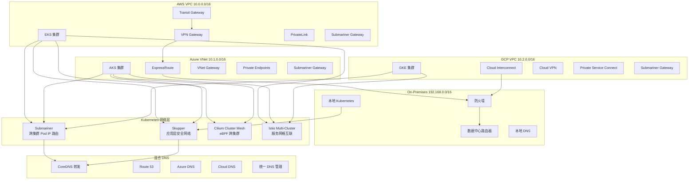

# 多云网络互联深度实践

<!-- chunk: 概述 -->## 概述

多云网络互联是构建多云混合云架构的基础。跨云网络的质量直接影响分布式应用的延迟、吞吐量和可靠性。不同云平台的网络模型（VPC、安全组、负载均衡）存在显著差异，需要在 L2/L3 网络层和应用层分别设计互联方案。网络设计的好坏直接决定了应用的响应时间、数据同步延迟和故障恢复速度，是多云架构成功的关键因素。

本文档深入探讨多云网络互联的核心技术：[[Submariner|Submariner]] 提供 L3 层跨集群 Pod/Service IP 直通路由，Skupper 提供应用层安全网络互联，[[Cilium|Cilium]] Cluster Mesh 提供基于 eBPF 的高性能跨集群通信，AWS Transit Gateway / Azure ExpressRoute / Google Cloud Interconnect 提供云间专线连接，混合 DNS 实现跨云服务发现。每个方案都有其适用场景，企业需要根据延迟要求、安全策略和成本预算选择合适的组合。

在实际生产环境中，通常需要组合多种网络方案：专线用于云间骨干连接、Submariner 或 Cilium 用于 K8s 集群内 Pod 直通、Skupper 用于跨云微服务应用层互联、VPN 作为专线的备份链路。混合 DNS 是多云网络的关键支撑组件，通过 [[CoreDNS|CoreDNS]] 转发和 External DNS 自动注册，实现跨云服务的自动发现和解析。

## 多云网络互联方案对比

| 方案 | 层级 | 延迟 | 安全性 | 适用场景 | 成本 |
|:---|:---|:---|:---|:---|:---|
| Submariner | L3 (Pod/Service IP) | 低 | IPsec/WireGuard | 跨集群 Pod 直通通信 | 低 |
| Skupper | L7 (HTTP/AMQP) | 中 | TLS 加密 | 跨云微服务互联 | 低 |
| Cilium Cluster Mesh | L3/L4 (eBPF) | 极低 | WireGuard | 高性能跨集群服务发现 | 低 |
| Transit Gateway | L3 (VPC) | 低 | 私有网络 | AWS 到其他云的 VPC 互联 | 中 |
| ExpressRoute | L2/L3 | 极低 | 专线 | Azure 到本地数据中心 | 高 |
| Cloud Interconnect | L2/L3 | 极低 | 专线 | GCP 到本地数据中心 | 高 |
| VPN Site-to-Site | L3 | 中 | IPsec | 低成本跨云连接 | 低 |
| 阿里云 CEN | L3 | 低 | 私有网络 | 阿里云全球互联 | 中 |

<!-- chunk: 架构设计 -->## 架构设计

## 多云网络互联总览



## 网络架构设计原则

```yaml
网络设计原则:
  CIDR规划:
    - 每个云平台分配独立CIDR段
    - AWS: 10.0.0.0/16 (Pod: 10.4.0.0/14, Service: 172.20.0.0/16)
    - Azure: 10.1.0.0/16 (Pod: 10.16.0.0/14, Service: 172.21.0.0/16)
    - GCP: 10.2.0.0/16 (Pod: 10.32.0.0/14, Service: 172.22.0.0/16)
    - On-Prem: 192.168.0.0/16 (Pod: 10.48.0.0/14, Service: 172.23.0.0/16)

  高可用:
    - 双专线/双VPN冗余
    - ECMP等价路由负载均衡
    - BGP路由自动收敛
    - Submariner多网关冗余

  安全:
    - 所有跨云流量加密(IPsec/WireGuard/TLS)
    - 最小权限网络策略
    - 零信任mTLS双向认证
    - 全流量审计日志

  性能:
    - MTU优化(考虑封装开销)
    - 专线优先于VPN
    - 就近部署频繁通信的服务
    - 连接池减少TCP握手开销
```

<!-- chunk: 核心组件配置 -->## 核心组件配置

## Submariner 跨集群网络

```bash
#!/bin/bash
set -euo pipefail

echo "=== Submariner 跨集群网络部署 ==="
echo "时间: $(date '+%Y-%m-%d %H:%M:%S')"

echo "[1] 部署 Submariner Broker"
subctl deploy-broker \
    --kubeconfig /etc/k8s/broker-cluster.kubeconfig \
    --broker-namespace submariner-k8s-broker \
    --service-discovery true \
    --default-globalnet-cidr 242.0.0.0/8

echo "[2] 注册 AWS EKS 集群"
subctl join \
    --kubeconfig /etc/k8s/aws-cluster.kubeconfig \
    --broker-kubeconfig /etc/k8s/broker-cluster.kubeconfig \
    --clusterid aws-cluster \
    --clustercidr 10.4.0.0/14 \
    --servicecidr 172.20.0.0/16 \
    --globalcidr 242.0.0.0/16 \
    --natt=false \
    --cable-driver wireguard \
    --health-check=true \
    --health-check-interval=10s

echo "[3] 注册 Azure AKS 集群"
subctl join \
    --kubeconfig /etc/k8s/azure-cluster.kubeconfig \
    --broker-kubeconfig /etc/k8s/broker-cluster.kubeconfig \
    --clusterid azure-cluster \
    --clustercidr 10.16.0.0/14 \
    --servicecidr 172.21.0.0/16 \
    --globalcidr 242.1.0.0/16 \
    --natt=false \
    --cable-driver wireguard

echo "[4] 注册 GCP GKE 集群"
subctl join \
    --kubeconfig /etc/k8s/gke-cluster.kubeconfig \
    --broker-kubeconfig /etc/k8s/broker-cluster.kubeconfig \
    --clusterid gke-cluster \
    --clustercidr 10.32.0.0/14 \
    --servicecidr 172.22.0.0/16 \
    --globalcidr 242.2.0.0/16 \
    --natt=true \
    --cable-driver wireguard

echo "[5] 注册本地集群"
subctl join \
    --kubeconfig /etc/k8s/onprem-cluster.kubeconfig \
    --broker-kubeconfig /etc/k8s/broker-cluster.kubeconfig \
    --clusterid onprem-cluster \
    --clustercidr 10.48.0.0/14 \
    --servicecidr 172.23.0.0/16 \
    --globalcidr 242.3.0.0/16 \
    --natt=true \
    --cable-driver wireguard

echo "[6] 验证跨集群连通性"
subctl verify \
    --kubeconfig /etc/k8s/aws-cluster.kubeconfig \
    --kubeconfig2 /etc/k8s/azure-cluster.kubeconfig \
    --operation connectivity

echo "[7] 验证服务发现"
subctl verify \
    --kubeconfig /etc/k8s/aws-cluster.kubeconfig \
    --kubeconfig2 /etc/k8s/azure-cluster.kubeconfig \
    --operation service-discovery

echo "[8] 查看连接状态"
subctl show connections --kubeconfig /etc/k8s/broker-cluster.kubeconfig
subctl show endpoints --kubeconfig /etc/k8s/broker-cluster.kubeconfig

echo "=== Submariner 部署完成 ==="
```

## Submariner 服务导出

```yaml
apiVersion: submariner.io/v1alpha1
kind: ServiceExport
metadata:
  name: backend-service
  namespace: production
---
apiVersion: v1
kind: Service
metadata:
  name: backend-service
  namespace: production
  annotations:
    submariner.io/clusterIP: "10.4.100.50"
spec:
  selector:
    app: backend
  ports:
  - protocol: TCP
    port: 80
    targetPort: 8080
  type: ClusterIP
---
apiVersion: v1
kind: Service
metadata:
  name: backend-service-remote
  namespace: production
spec:
  type: ExternalName
  externalName: backend-service.production.svc.clusterset.local
```

## Skupper 应用层网络互联

```bash
#!/bin/bash
set -euo pipefail

echo "=== Skupper 应用层网络互联 ==="

echo "[1] 在 AWS EKS 初始化 Skupper"
skupper init --kubeconfig /etc/k8s/aws-cluster.kubeconfig \
    --namespace skupper \
    --site-name aws-site \
    --ingress loadbalancer \
    --enable-flow-collector \
    --enable-console \
    --console-auth internal \
    --console-user admin \
    --console-password changeme

echo "[2] 在本地数据中心初始化 Skupper"
skupper init --kubeconfig /etc/k8s/onprem-cluster.kubeconfig \
    --namespace skupper \
    --site-name onprem-site \
    --ingress route

echo "[3] 连接两个站点"
skupper token create --kubeconfig /etc/k8s/aws-cluster.kubeconfig \
    --namespace skupper /tmp/skupper-token.yaml --expiry 24h

skupper link create --kubeconfig /etc/k8s/onprem-cluster.kubeconfig \
    --namespace skupper /tmp/skupper-token.yaml

echo "[4] 在 AWS 暴露服务到本地"
skupper expose deployment --kubeconfig /etc/k8s/aws-cluster.kubeconfig \
    --namespace production \
    --address cloud-database \
    --port 5432 \
    --protocol tcp \
    database-deployment

skupper expose service --kubeconfig /etc/k8s/aws-cluster.kubeconfig \
    --namespace production \
    --address cloud-api \
    --port 80 \
    --protocol http \
    api-service

echo "[5] 在本地暴露服务到 AWS"
skupper expose deployment --kubeconfig /etc/k8s/onprem-cluster.kubeconfig \
    --namespace production \
    --address onprem-cache \
    --port 6379 \
    --protocol tcp \
    redis-deployment

skupper expose deployment --kubeconfig /etc/k8s/onprem-cluster.kubeconfig \
    --namespace production \
    --address onprem-legacy \
    --port 8080 \
    --protocol http \
    legacy-app

echo "[6] 验证连接"
skupper status --kubeconfig /etc/k8s/aws-cluster.kubeconfig --namespace skupper
skupper status --kubeconfig /etc/k8s/onprem-cluster.kubeconfig --namespace skupper
skupper connectivity --kubeconfig /etc/k8s/aws-cluster.kubeconfig --namespace skupper

echo "=== Skupper 部署完成 ==="
```

## AWS Transit Gateway 多云互联

```hcl
resource "aws_ec2_transit_gateway" "multicloud_tgw" {
  description                     = "Multi-cloud Transit Gateway"
  default_route_table_association = "enable"
  default_route_table_propagation = "enable"
  dns_support                     = "enable"
  vpn_ecmp_support                = "enable"
  amazon_side_asn                 = 65000

  tags = {
    Name        = "multicloud-tgw"
    Environment = "Production"
  }
}

resource "aws_vpc" "eks_vpc" {
  cidr_block           = "10.0.0.0/16"
  enable_dns_hostnames = true
  enable_dns_support   = true
  tags = { Name = "eks-vpc" }
}

resource "aws_subnet" "eks_private" {
  count             = 3
  vpc_id            = aws_vpc.eks_vpc.id
  cidr_block        = "10.0.${count.index + 1}.0/24"
  availability_zone = "${var.aws_region}${count.index == 0 ? "a" : count.index == 1 ? "b" : "c"}"

  tags = { Name = "eks-private-${count.index}" }
}

resource "aws_ec2_transit_gateway_vpc_attachment" "eks_attachment" {
  subnet_ids         = aws_subnet.eks_private[*].id
  transit_gateway_id = aws_ec2_transit_gateway.multicloud_tgw.id
  vpc_id             = aws_vpc.eks_vpc.id
  dns_support        = "enable"

  tags = { Name = "eks-tgw-attachment" }
}

resource "aws_customer_gateway" "azure_cgw" {
  bgp_asn    = 65001
  ip_address = var.azure_vpn_gateway_ip
  type       = "ipsec.1"
  tags = { Name = "azure-customer-gateway" }
}

resource "aws_vpn_connection" "azure_vpn" {
  customer_gateway_id = aws_customer_gateway.azure_cgw.id
  transit_gateway_id  = aws_ec2_transit_gateway.multicloud_tgw.id
  type                = "ipsec.1"
  static_routes_only  = false

  tunnel1_preshared_key = var.azure_vpn_psk
  tunnel2_preshared_key = var.azure_vpn_psk_2

  tags = { Name = "aws-to-azure-vpn" }
}

resource "aws_customer_gateway" "onprem_cgw" {
  bgp_asn    = 65002
  ip_address = var.onprem_router_ip
  type       = "ipsec.1"
  tags = { Name = "onprem-customer-gateway" }
}

resource "aws_vpn_connection" "onprem_vpn" {
  customer_gateway_id = aws_customer_gateway.onprem_cgw.id
  transit_gateway_id  = aws_ec2_transit_gateway.multicloud_tgw.id
  type                = "ipsec.1"
  static_routes_only  = false

  tunnel1_preshared_key = var.onprem_vpn_psk
  tunnel2_preshared_key = var.onprem_vpn_psk_2

  tags = { Name = "aws-to-onprem-vpn" }
}

resource "aws_ec2_transit_gateway_route_table" "multicloud_rt" {
  transit_gateway_id = aws_ec2_transit_gateway.multicloud_tgw.id
  tags = { Name = "multicloud-route-table" }
}

resource "aws_ec2_transit_gateway_route" "to_azure" {
  destination_cidr_block         = "10.1.0.0/16"
  transit_gateway_attachment_id  = aws_vpn_connection.azure_vpn.transit_gateway_attachment_id
  transit_gateway_route_table_id = aws_ec2_transit_gateway_route_table.multicloud_rt.id
}

resource "aws_ec2_transit_gateway_route" "to_onprem" {
  destination_cidr_block         = "192.168.0.0/16"
  transit_gateway_attachment_id  = aws_vpn_connection.onprem_vpn.transit_gateway_attachment_id
  transit_gateway_route_table_id = aws_ec2_transit_gateway_route_table.multicloud_rt.id
}

resource "aws_ec2_transit_gateway_route" "to_gcp" {
  destination_cidr_block         = "10.2.0.0/16"
  transit_gateway_attachment_id  = aws_vpn_connection.gcp_vpn.transit_gateway_attachment_id
  transit_gateway_route_table_id = aws_ec2_transit_gateway_route_table.multicloud_rt.id
}
```

## Azure ExpressRoute 配置

```hcl
resource "azurerm_express_route_circuit" "primary" {
  name                  = "expressroute-primary"
  resource_group_name   = azurerm_resource_group.main.name
  location              = azurerm_resource_group.main.location
  service_provider_name = "Equinix"
  peering_location      = "Silicon Valley"
  bandwidth_in_mbps     = 1000

  sku {
    tier   = "Premium"
    family = "MeteredData"
  }

  tags = {
    Environment = "Production"
    Purpose     = "Multi-cloud Connectivity"
  }
}

resource "azurerm_express_route_circuit_peering" "azure_private_peering" {
  peering_type                  = "AzurePrivatePeering"
  express_route_circuit_name    = azurerm_express_route_circuit.primary.name
  resource_group_name           = azurerm_resource_group.main.name
  peer_asn                      = 65000
  primary_peer_address_prefix   = "192.168.1.0/30"
  secondary_peer_address_prefix = "192.168.1.4/30"
  shared_key                    = var.expressroute_shared_key
  vlan_id                       = 100
}

resource "azurerm_virtual_network_gateway" "vnet_gw" {
  name                = "vnet-gateway"
  resource_group_name = azurerm_resource_group.main.name
  location            = azurerm_resource_group.main.location
  type                = "ExpressRoute"
  vpn_type            = "RouteBased"
  sku                 = "UltraPerformance"
  enable_bgp          = true

  ip_configuration {
    name                          = "vnetGatewayConfig"
    public_ip_address_id          = azurerm_public_ip.gw_ip.id
    private_ip_address_allocation = "Dynamic"
    subnet_id                     = azurerm_subnet.gateway_subnet.id
  }
}

resource "azurerm_virtual_network_gateway_connection" "expressroute_conn" {
  name                       = "expressroute-connection"
  resource_group_name        = azurerm_resource_group.main.name
  location                   = azurerm_resource_group.main.location
  type                       = "ExpressRoute"
  virtual_network_gateway_id = azurerm_virtual_network_gateway.vnet_gw.id
  express_route_circuit_id   = azurerm_express_route_circuit.primary.id
  routing_weight             = 10
  shared_key                 = var.expressroute_shared_key
  enable_bgp                 = true
}
```

## 混合 DNS 配置

```yaml
apiVersion: v1
kind: ConfigMap
metadata:
  name: coredns-multicloud
  namespace: kube-system
data:
  Corefile: |
    .:53 {
        errors
        health {
            lameduck 5s
        }
        ready
        kubernetes cluster.local in-addr.arpa ip6.arpa {
            pods insecure
            fallthrough in-addr.arpa ip6.arpa
            ttl 30
        }
        prometheus :9153

        aws.cluster.local:53 {
            forward . 10.0.0.2
            cache 30
            reload
        }

        azure.cluster.local:53 {
            forward . 10.1.0.2
            cache 30
            reload
        }

        gcp.cluster.local:53 {
            forward . 10.2.0.2
            cache 30
            reload
        }

        onprem.local:53 {
            forward . 192.168.1.1 192.168.1.2
            cache 30
            reload
        }

        clusterset.local:53 {
            forward . /etc/resolv.conf
            cache 30
        }

        example.com:53 {
            forward . 8.8.8.8 8.8.4.4
            cache 30
            reload
        }

        forward . /etc/resolv.conf {
            max_concurrent 1000
        }
        cache 30
        loop
        reload
        loadbalance
    }
```

<!-- chunk: 安全配置 -->## 安全配置

## 跨云网络安全策略

```yaml
apiVersion: networking.k8s.io/v1
kind: NetworkPolicy
metadata:
  name: allow-cross-cluster-traffic
  namespace: production
spec:
  podSelector:
    matchLabels:
      app: backend
  policyTypes:
  - Ingress
  ingress:
  - from:
    - ipBlock:
        cidr: 10.0.0.0/8
    ports:
    - protocol: TCP
      port: 8080
---
apiVersion: submariner.io/v1alpha1
kind: GlobalnetConfig
metadata:
  name: default
  namespace: submariner-operator
spec:
  globalCIDR: "242.0.0.0/8"
  enableGlobalnet: true
---
apiVersion: v1
kind: ConfigMap
metadata:
  name: submariner-cable-driver
  namespace: submariner-operator
data:
  cable-driver: "wireguard"
  natt-enable: "false"
  ipsec-debug: "false"
  wireguard-listen-port: "4500"
  wireguard-keepalive-interval: "10s"
```

<!-- chunk: 监控告警 -->## 监控告警

## 网络互联监控

```yaml
apiVersion: monitoring.coreos.com/v1
kind: PrometheusRule
metadata:
  name: network-interconnect-alerts
  namespace: monitoring
spec:
  groups:
  - name: network.rules
    rules:
    - alert: SubmarinerGatewayDown
      expr: submariner_gateway_connection_status{status="error"} == 1
      for: 5m
      labels:
        severity: critical
        team: network
      annotations:
        summary: "Submariner 网关连接异常"
        description: "集群 {{ $labels.cluster }} 到 {{ $labels.remote_cluster }} 的网关连接异常"

    - alert: SubmarinerHighLatency
      expr: submariner_gateway_latency_seconds > 0.1
      for: 5m
      labels:
        severity: warning
        team: network
      annotations:
        summary: "跨集群网络延迟过高"
        description: "集群间延迟 {{ $value }}s 超过 100ms"

    - alert: SubmarinerConnectionRetry
      expr: rate(submariner_gateway_connection_retry_total[5m]) > 0
      for: 10m
      labels:
        severity: warning
        team: network
      annotations:
        summary: "Submariner 连接重试"
        description: "集群 {{ $labels.cluster }} 连接重试，可能存在网络不稳定"

    - alert: SkupperSiteDisconnected
      expr: skupper_site_status{connected="false"} == 1
      for: 5m
      labels:
        severity: critical
        team: network
      annotations:
        summary: "Skupper 站点断开连接"

    - alert: VPNTunnelDown
      expr: aws_vpn_connection_state{state!="UP"} == 1
      for: 10m
      labels:
        severity: critical
        team: network
      annotations:
        summary: "VPN 隧道断开"
        description: "VPN {{ $labels.vpn_id }} 隧道状态异常"

    - alert: ExpressRouteCircuitDown
      expr: azure_express_route_circuit_state{state!="Provisioned"} == 1
      for: 5m
      labels:
        severity: critical
        team: network
      annotations:
        summary: "ExpressRoute 专线异常"

    - alert: HighPacketLoss
      expr: rate(net_packet_loss_total[5m]) / rate(net_packet_total[5m]) > 0.01
      for: 10m
      labels:
        severity: warning
        team: network
      annotations:
        summary: "跨云网络丢包率过高"
        description: "丢包率超过 1%，当前值 {{ $value | humanizePercentage }}"

    - alert: DNSResolutionHighLatency
      expr: histogram_quantile(0.95, rate(coredns_dns_request_duration_seconds_bucket[5m])) > 0.1
      for: 10m
      labels:
        severity: warning
        team: network
      annotations:
        summary: "DNS 解析延迟过高"
        description: "P95 DNS 解析延迟超过 100ms"
```

<!-- chunk: 运维管理 -->## 运维管理

## 网络诊断脚本

> ⚠️ **🟡 中危变更** — 变更集群资源状态，建议先 --dry-run 或 diff 确认
> - `kubectl exec`：进入容器执行命令，可能改变容器状态

```bash
#!/bin/bash
set -euo pipefail

echo "=== 多云网络诊断 ==="
echo "时间: $(date '+%Y-%m-%d %H:%M:%S')"

echo -e "\n[1] Submariner 网关状态"
kubectl get gateways -n submariner-operator -A -o wide 2>/dev/null || echo "Submariner 未部署"

echo -e "\n[2] 跨集群连接状态"
subctl show connections --kubeconfig /etc/k8s/broker.kubeconfig 2>/dev/null || echo "subctl 不可用"

echo -e "\n[3] 跨集群端点"
subctl show endpoints --kubeconfig /etc/k8s/broker.kubeconfig 2>/dev/null || echo "subctl 不可用"

echo -e "\n[4] Submariner 延迟测试"
for cluster in aws-cluster azure-cluster gke-cluster; do
    echo "--- 延迟到 $cluster ---"
    kubectl exec -n submariner-operator deploy/submariner-gateway -- \
        ping -c 4 10.${cluster:0:1}.0.1 2>/dev/null || echo "无法到达 $cluster"
done

echo -e "\n[5] Skupper 状态"
skupper status --namespace skupper 2>/dev/null || echo "Skupper 未部署"
skupper connectivity --namespace skupper 2>/dev/null || echo "Skupper 未部署"

echo -e "\n[6] VPN 隧道状态"
aws ec2 describe-vpn-connections --query 'VpnConnections[*].{ID:VpnConnectionId,State:State,Tunnel1:VgwTelemetry[0].Status,Tunnel2:VgwTelemetry[1].Status}' --output table 2>/dev/null || echo "AWS CLI 不可用"

echo -e "\n[7] ExpressRoute 状态"
az network express-route list --output table 2>/dev/null || echo "Azure CLI 不可用"

echo -e "\n[8] DNS 解析测试"
echo "--- 集群内 DNS ---"
kubectl run dns-test --image=busybox --rm -it --restart=Never -- \
    nslookup backend-service.production.svc.clusterset.local 2>/dev/null || echo "DNS 解析失败"

echo -e "\n[9] 跨集群 Pod 连通性测试"
kubectl exec -n production deploy/test-pod -- \
    curl -s -o /dev/null -w "HTTP %{http_code} - %{time_total}s\n" \
    http://backend-service.production.svc.clusterset.local:80/healthz 2>/dev/null || echo "连通性测试失败"

echo -e "\n[10] 带宽测试"
kubectl exec -n production deploy/test-pod -- \
    iperf3 -c backend-service.production.svc.clusterset.local -t 5 -P 4 2>/dev/null || echo "带宽测试失败"

echo -e "\n[11] MTU 检测"
kubectl exec -n production deploy/test-pod -- \
    ping -M do -s 1400 backend-service.production.svc.clusterset.local -c 3 2>/dev/null || \
    echo "MTU 1400 不可达，尝试更小值"

echo "=== 网络诊断完成 ==="
```

<!-- chunk: 最佳实践 -->## 最佳实践

## 网络设计最佳实践

| 类别 | 最佳实践 | 说明 |
|:---|:---|:---|
| CIDR | 独立 CIDR 段 | 为每个云平台分配独立 CIDR，避免 IP 重叠 |
| MTU | 调整 MTU | 考虑 IPsec/WireGuard 封装开销，调整 MTU 为 1400-1450 |
| 冗余 | 多路径冗余 | 部署多条 VPN 隧道或专线，启用 ECMP 负载均衡 |
| Globalnet | Submariner Globalnet | 大规模多云启用 Globalnet 避免 CIDR 冲突 |
| DNS | CoreDNS 联邦 | 配置 CoreDNS 转发实现跨云服务发现 |

## 安全最佳实践

| 类别 | 最佳实践 | 说明 |
|:---|:---|:---|
| 加密 | WireGuard/IPsec | 所有跨云网络流量使用 WireGuard 或 IPsec 加密 |
| 分段 | 网络策略 | 通过安全组和网络策略限制跨云流量 |
| 零信任 | mTLS 双向认证 | 跨云通信使用 mTLS 双向认证 |
| 审计 | 流量日志 | 记录所有跨云网络连接和流量 |

<!-- chunk: 故障排查 -->## 故障排查

## 常见问题

| 问题 | 原因 | 解决方案 | 诊断命令 |
|:---|:---|:---|:---|
| Submariner Pod 无法通信 | CIDR 冲突 | 检查集群 CIDR 是否重叠 | `subctl show endpoints` |
| Skupper 连接断开 | Token 过期 | 重新生成连接 Token | `skupper status` |
| VPN 隧道断开 | IKE 协商失败 | 检查预共享密钥和 IKE 参数 | `aws ec2 describe-vpn-connections` |
| 跨集群 DNS 不解析 | CoreDNS 配置错误 | 检查 Corefile 转发配置 | `kubectl get configmap coredns -n kube-system` |
| 延迟过高 | 未使用专线 | 评估专线或优化路由 | `ping -c 10 <target>` |
| MTU 问题 | 封装开销 | 调整 MTU 为 1400 | `ping -M do -s 1400 <target>` |
| Submariner 网关异常 | ENI 不足 | 检查云平台 ENI 配额 | `kubectl get pods -n submariner-operator` |
| WireGuard 握手失败 | UDP 端口不通 | 检查安全组 4500/UDP | `nc -zvu <target> 4500` |

<!-- chunk: 参考资源 -->## 参考资源

- [Submariner 文档](https://submariner.io/)
- [Skupper 文档](https://skupper.io/docs/)
- [Cilium Cluster Mesh](https://docs.cilium.io/en/latest/network/clustermesh/)
- [AWS Transit Gateway](https://docs.aws.amazon.com/vpc/latest/tgw/)
- [Azure ExpressRoute](https://learn.microsoft.com/en-us/azure/expressroute/)
- [Google Cloud Interconnect](https://cloud.google.com/network-connectivity/docs/interconnect)
- [Istio Multi-Cluster](https://istio.io/latest/docs/setup/install/multicluster/)

---

**文档版本**: v2.0
**最后更新**: 2026年5月17日

---

<!-- chunk: Obsidian 相关文档 -->## Obsidian 相关文档

- domain-27-multi-cloud-hybrid MOC
- [[domain-12-cloud-providers/README.md|Domain 12: 多云与混合云架构管理]]
- Domain-27 多云与混合云 — 开源项目索引
- AWS EKS 企业级多云管理平台
- Azure AKS 企业级多云管理平台
- 企业级多云治理与成本优化深度实践
- Google GKE 企业级多云管理深度实践
- IBM Cloud Kubernetes Service (IKS) 企业级深度实践
- Alibaba Cloud ACK 企业级混合云深度实践
- 华为云 CCE 企业级容器平台深度实践
- Karmada 多集群联邦深度实践
- 多云灾备深度实践

## See Also

- 07-huawei-cce-enterprise
- 08-multicloud-federation-karmada
- 10-multicloud-disaster-recovery
- 01-aws-eks-enterprise-multicloud
