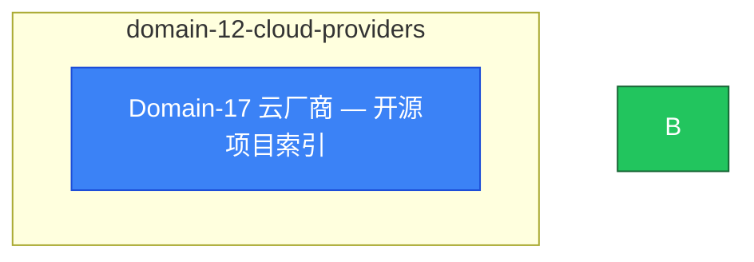

# domain-12-cloud-providers MOC

> **MOC 版本**: 1.0
> **知识域**: domain-12-cloud-providers
> **文档数量**: 1 篇
> **最后更新**: 2026-05-21
> **用途**: 本知识域的导航入口，汇总所有相关文档、关联领域、和场景入口

---

## 领域概述

云提供商 — AWS、GCP、Azure、阿里云集成

### 知识域定位

| 维度 | 说明 |
|---|---|
| **知识域** | domain-12-cloud-providers |
| **文档数量** | 1 篇 |
| **难度分布** | 入门 0 / 进阶 0 / 高级 0 / 专家 0 |

---

## 文档清单

| # | 文档 | 难度 | 标签 | 估计阅读时间 |
|---|---|---|---|---|
| 1 | Domain-17 云厂商 — 开源项目索引 |  | cloud, multi-cloud |  |

---

## 知识图谱

---

## 关联入口

| 入口 | 说明 |
|---|---|
| FTA 故障树 | domain-12-cloud-providers 相关故障树分析 |
| Skills 技能 | domain-12-cloud-providers 相关操作技能 |
| 深度研究入口 | 语料库索引与向量检索 |

---

## 统计信息

| 指标 | 数值 |
|---|---|
| 文档总数 | 1 |
| 覆盖 K8s 版本 | v1.25 - v1.32 |

---

*本文档由 scripts/generate-mocs.py 自动生成，最后更新 2026-05-21。*
