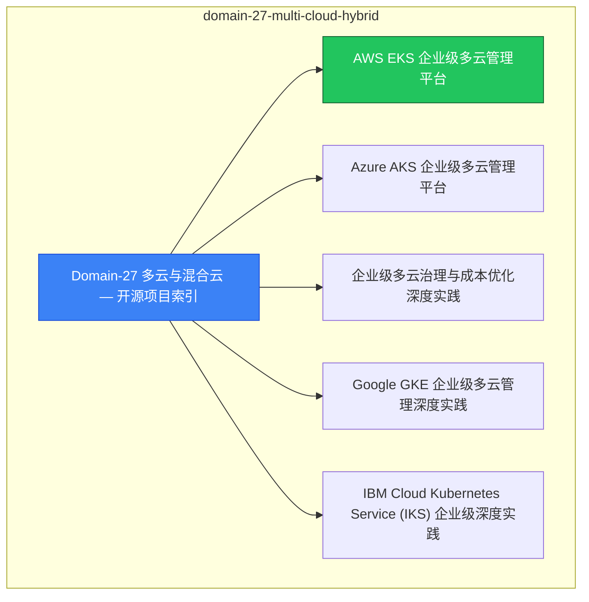

# domain-27-multi-cloud-hybrid MOC

> **MOC 版本**: 1.0
> **知识域**: domain-27-multi-cloud-hybrid
> **文档数量**: 11 篇
> **最后更新**: 2026-05-21
> **用途**: 本知识域的导航入口，汇总所有相关文档、关联领域、和场景入口

---

## 领域概述

多云与混合云 — 多云架构、混合云网络、数据同步

### 知识域定位

| 维度 | 说明 |
|---|---|
| **知识域** | domain-27-multi-cloud-hybrid |
| **文档数量** | 11 篇 |
| **难度分布** | 入门 0 / 进阶 0 / 高级 0 / 专家 0 |

---

## 文档清单

| # | 文档 | 难度 | 标签 | 估计阅读时间 |
|---|---|---|---|---|
| 1 | Domain-27 多云与混合云 — 开源项目索引 |  | cloud, hybrid |  |
| 2 | AWS EKS 企业级多云管理平台 |  | cloud, hybrid |  |
| 3 | Azure AKS 企业级多云管理平台 |  | cloud, hybrid |  |
| 4 | 企业级多云治理与成本优化深度实践 |  | cloud, hybrid |  |
| 5 | Google GKE 企业级多云管理深度实践 |  | cloud, hybrid |  |
| 6 | IBM Cloud Kubernetes Service (IKS) 企业级深度实践 |  | cloud, hybrid |  |
| 7 | Alibaba Cloud ACK 企业级混合云深度实践 |  | cloud, hybrid |  |
| 8 | 华为云 CCE 企业级容器平台深度实践 |  | cloud, hybrid |  |
| 9 | Karmada 多集群联邦深度实践 |  | cloud, hybrid |  |
| 10 | 多云网络互联深度实践 |  | cloud, hybrid, networking |  |
| 11 | 多云灾备深度实践 |  | cloud, hybrid |  |

---

## 知识图谱

---

## 关联入口

| 入口 | 说明 |
|---|---|
| FTA 故障树 | domain-27-multi-cloud-hybrid 相关故障树分析 |
| Skills 技能 | domain-27-multi-cloud-hybrid 相关操作技能 |
| 深度研究入口 | 语料库索引与向量检索 |

---

## 统计信息

| 指标 | 数值 |
|---|---|
| 文档总数 | 11 |
| 覆盖 K8s 版本 | v1.25 - v1.32 |

---

*本文档由 scripts/generate-mocs.py 自动生成，最后更新 2026-05-21。*
