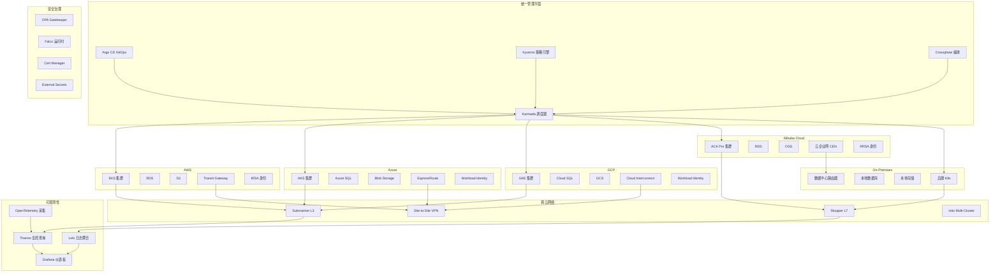
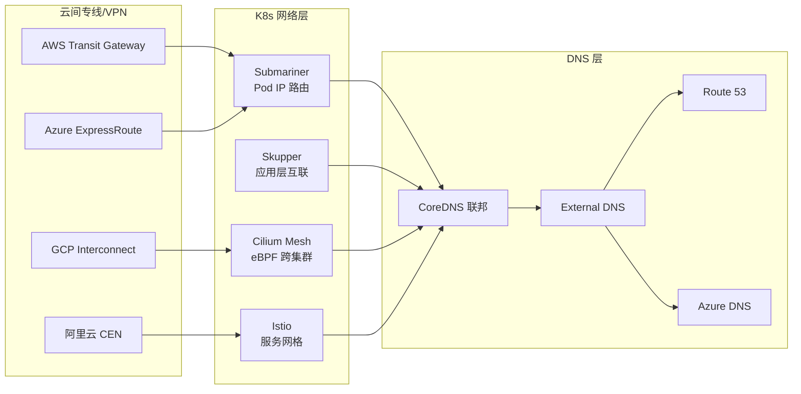
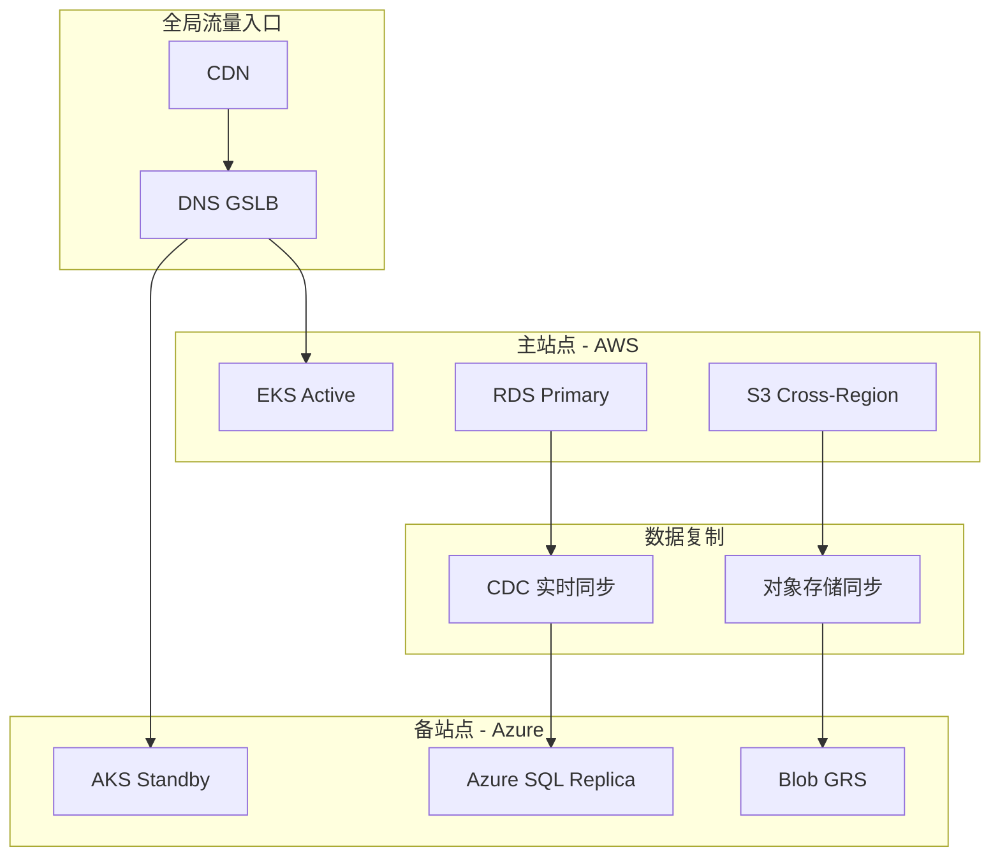

---
title: 'Domain 27: 多云与混合云架构管理'
description: '# Domain 27: 多云与混合云架构管理'
category: multi-cloud-hybrid
tags:
- k8s
- multi-cloud
- hybrid-cloud
- etcd
- apiserver
- scheduler
- controller-manager
- prometheus
- grafana
- istio
last_updated: 2026-05
difficulty: advanced
reading_level: advanced
audience:
- 云架构师
- SRE
- 平台工程师
estimated_read_time: 10min
intent_queries:
- 'Domain 27: 多云与混合云架构管理 是什么'
- '如何 Domain 27: 多云与混合云架构管理'
- [[entities/kubernetes|kubernetes]] 27 multi cloud hybrid 最佳实践
trigger_keywords:
- Domain
- '27:'
- 多云与混合云架构管理
- multi
- cloud
- hybrid

tier: peripheral---


# Domain 27: 多云与混合云架构管理

> **领域定位**: 企业级多云平台架构与混合云管理实践 | **文档数量**: 12 篇 | **更新时间**: 2026-05-18

## 领域概述

本领域专注于企业级多云和混合云架构的设计、部署和管理实践，涵盖 AWS、Azure、Google Cloud、阿里云、华为云、IBM Cloud 等主流云平台的集成方案，以及 Karmada、Submariner、Skupper、Cilium Cluster Mesh 等多云开源工具的深度实践。为企业构建灵活、可靠的跨云环境提供从架构设计到运维管理的全面技术指导。

多云与混合云架构已成为企业 IT 基础设施的主流形态。根据 Gartner 预测，到 2027 年超过 90% 的企业将采用多云策略。多云架构带来的核心价值包括：避免厂商锁定、提升业务连续性、优化成本结构、满足数据驻留合规要求、以及为全球化业务提供就近接入能力。随着云原生技术的成熟，Kubernetes 已成为多云管理的统一控制平面，通过标准化的 API 和工具链降低多云管理的复杂度。

多云架构的实施并非简单的技术叠加，而是需要从治理、安全、网络、数据、应用等多个维度进行系统性设计。企业需要建立统一的身份认证和访问管理（IAM）体系，设计跨云网络互联方案，制定数据一致性和灾备策略，构建统一的可观测性和运维自动化平台。本领域文档从这些维度出发，为企业提供端到端的多云架构实施指南。

### 领域核心价值

| 价值维度 | 说明 | 关键技术 |
|:---|:---|:---|
| 避免厂商锁定 | 工作负载可跨云迁移，不被单一云服务商绑定 | Karmada、Crossplane、Terraform |
| 业务连续性 | 跨云灾备保障业务 7x24 运行，RPO/RTO 可控 | Karmada Failover、Velero、Debezium CDC |
| 成本优化 | FinOps 治理，按需选择最优云平台资源 | Spot 实例、预留实例、动态调度 |
| 合规数据驻留 | 满足 GDPR、等保等数据本地化法规要求 | 数据分类、区域调度策略 |
| 全球化部署 | 就近接入，低延迟服务全球用户 | GSLB、CDN、跨区域集群联邦 |
| 统一管理 | 一个控制平面管理所有云上的 Kubernetes 集群 | Rancher、OCM、Anthos、Karmada |

## 文档总览与导读

### 文件内容速览

| 文档编号 | 文档名称 | 核心内容 | 页数参考 | 难度 | 建议阅读时间 |
|:---|:---|:---|:---|:---|:---|
| 00 | 开源项目索引 | Karmada、Submariner、Crossplane 等 20+ 开源项目评估 | 30+ 页 | 入门 | 60 分钟 |
| 01 | AWS EKS 多云管理 | EKS 集群管理、IRSA 安全集成、Transit Gateway 多云网络 | 40+ 页 | 高级 | 120 分钟 |
| 02 | Azure AKS 多云管理 | AKS 集群配置、Azure AD 集成、Workload Identity、Front Door | 40+ 页 | 高级 | 120 分钟 |
| 03 | 企业级多云治理 | Crossplane、Kyverno、FinOps 成本治理、统一 IAM | 50+ 页 | 专家 | 180 分钟 |
| 04 | Google GKE 多云管理 | GKE Autopilot、Anthos 多云、Binary Authorization | 40+ 页 | 高级 | 120 分钟 |
| 05 | IBM Cloud IKS | Watson AI 集成、Satellite 混合云、Key Protect | 35+ 页 | 高级 | 90 分钟 |
| 06 | 阿里云 ACK 混合云 | ACK Pro、Terway eBPF 网络、云原生 AI、混合云 | 40+ 页 | 高级 | 120 分钟 |
| 07 | 华为云 CCE | CCE Turbo、Volcano 调度、裸金属容器、UCS | 35+ 页 | 高级 | 90 分钟 |
| 08 | Karmada 多集群联邦 | PropagationPolicy、OverridePolicy、故障转移、工作负载再平衡 | 50+ 页 | 专家 | 180 分钟 |
| 09 | 多云网络互联 | Submariner L3、Skupper L7、Cilium Mesh、Transit Gateway | 45+ 页 | 专家 | 150 分钟 |
| 10 | 多云灾备 | 双活/主备/Pilot Light、数据复制、DNS Failover、RPO/RTO | 50+ 页 | 专家 | 180 分钟 |

### 架构模式对比与选型指南

| 架构模式 | 描述 | 适用企业规模 | 技术复杂度 | 成本范围 | 推荐工具链 |
|:---|:---|:---|:---|:---|:---|
| 单云多区域 | 单一云服务商多区域部署 | 小型（<500 人） | 低 | 50-200 万/年 | EKS/AKS + Argo CD |
| 双云主备 | 主云生产 + 备云灾备 | 中型（500-5000 人） | 中 | 200-800 万/年 | Karmada + Velero + Route 53 |
| 双云双活 | 两朵云同时服务，流量分担 | 大型（5000+ 人） | 高 | 500-2000 万/年 | Karmada + Submariner + Debezium |
| 全多云 3+ 云 | 三朵以上云平台统一管理 | 超大型企业 | 极高 | 1000 万+/年 | Karmada + OCM + Crossplane |
| 混合云（云+本地） | 云平台 + 本地数据中心混合 | 金融/政府/医疗 | 高 | 定制 | Anthos/Arc + Submariner |
| 边缘混合云 | 中心云 + 多边缘节点 | 制造/零售/IoT | 极高 | 定制 | K3s + Karmada + Skupper |

### 按场景选型指南

| 场景 | 推荐文档组合 | 关键设计要点 |
|:---|:---|:---|
| 避免厂商锁定 | 08 + 03 + 09 | 使用 Karmada 统一调度，Crossplane 编排资源，标准化应用清单 |
| 跨云灾备建设 | 10 + 08 + 09 | 设计 RPO/RTO 目标，配置数据复制，建立 DNS 故障转移 |
| 成本优化 FinOps | 03 + 01 + 02 | 建立成本归因体系，Spot/预留实例策略，跨云比价调度 |
| 全球化低延迟部署 | 09 + 08 + 10 | 就近区域部署，CDN + GSLB 流量管理，跨区域数据同步 |
| 合规数据驻留 | 03 + 06 + 07 | 数据分类标签，区域调度策略，审计日志集中化 |
| 混合云（云+本地） | 09 + 05 + 03 | Submariner/Skupper 跨环境网络，统一 IAM 联邦认证 |
| 统一可观测性 | 08 + 03 | Thanos 跨集群监控，Loki 日志聚合，Grafana 统一面板 |
| 多集群安全治理 | 03 + 08 | Kyverno 联邦策略，OPA Gatekeeper，Falco 运行时安全 |

## 文档目录

### 核心多云平台 (01-05)

| 编号 | 文档 | 说明 | 复杂度 | 核心技术 |
|:---|:---|:---|:---|:---|
| 00 | [开源项目索引](./00-open-source-projects-index.md) | 多云与混合云领域核心开源项目索引与选型指南 | ⭐⭐ | Karmada、Submariner、Crossplane |
| 01 | [AWS EKS 企业级多云管理](./01-aws-eks-enterprise-multicloud.md) | EKS 集群管理、IRSA、KMS 加密、多云架构集成 | ⭐⭐⭐⭐ | EKS、IRSA、Transit Gateway |
| 02 | [Azure AKS 企业级多云管理](./02-azure-aks-enterprise-multicloud.md) | AKS 集群配置、Azure AD 集成、Workload Identity、Front Door | ⭐⭐⭐⭐ | AKS、AAD、ExpressRoute |
| 03 | [企业级多云治理](./03-enterprise-multicloud-governance.md) | 统一治理框架、FinOps、身份认证、成本优化 | ⭐⭐⭐⭐⭐ | Crossplane、Kyverno、OPA |
| 04 | [Google GKE 企业级多云管理](./04-google-gke-enterprise-multicloud.md) | GKE Autopilot、Anthos 多云、Binary Authorization | ⭐⭐⭐⭐ | GKE、Anthos、Workload Identity |
| 05 | [IBM Cloud IKS 企业级](./05-ibm-cloud-kubernetes-service-enterprise.md) | Watson AI 集成、Satellite 混合云、Key Protect | ⭐⭐⭐⭐ | IKS、Satellite、Watson AI |

### 扩展多云平台 (06-07)

| 编号 | 文档 | 说明 | 复杂度 | 核心技术 |
|:---|:---|:---|:---|:---|
| 06 | [Alibaba ACK 企业级混合云](./06-alibaba-ack-enterprise-hybrid.md) | ACK Pro、Terway 网络、云原生 AI、混合云架构 | ⭐⭐⭐⭐ | ACK Pro、Terway、Arena AI |
| 07 | [华为云 CCE 企业级](./07-huawei-cce-enterprise.md) | CCE Turbo、Volcano 调度、裸金属容器、混合云 | ⭐⭐⭐⭐ | CCE Turbo、Volcano、UCS |

### 多云技术专题 (08-10)

| 编号 | 文档 | 说明 | 复杂度 | 核心技术 |
|:---|:---|:---|:---|:---|
| 08 | [Karmada 多集群联邦](./08-multicloud-federation-karmada.md) | 资源传播、覆盖策略、故障转移、工作负载再平衡 | ⭐⭐⭐⭐⭐ | PropagationPolicy、OverridePolicy |
| 09 | [多云网络互联](./09-multicloud-network-interconnect.md) | Submariner、Skupper、Transit Gateway、ExpressRoute | ⭐⭐⭐⭐⭐ | Submariner、Skupper、Cilium Mesh |
| 10 | [多云灾备](./10-multicloud-disaster-recovery.md) | 双活、主备、Pilot Light、数据复制、RPO/RTO 设计 | ⭐⭐⭐⭐⭐ | Velero、Debezium CDC、DNS Failover |

## 学习路径建议

### 入门阶段 (1-2 周)

1. 阅读 **00-开源项目索引**，了解多云生态工具全景
2. 学习 **01-AWS EKS** 和 **02-Azure AKS**，掌握两大主流云平台 K8s 服务
3. 了解基本的多云概念：集群联邦、跨云网络、统一监控

### 进阶阶段 (3-4 周)

1. 阅读 **04-Google GKE** 和 **03-多云治理**，理解 Anthos 平台和治理框架
2. 实践 **08-Karmada 多集群联邦**，部署跨云应用分发
3. 学习 **09-多云网络互联**，配置 Submariner/Skupper 跨集群网络
4. 部署统一可观测性栈（Prometheus + Thanos + Grafana）

### 专家阶段 (5-8 周)

1. 深入 **10-多云灾备**，设计跨云高可用和灾备方案
2. 实践 **06-阿里云 ACK** 和 **07-华为云 CCE**，构建全栈多云能力
3. 实施企业级 FinOps 成本治理体系
4. 建立多云安全合规自动化审计流水线
5. 设计跨云数据复制和一致性方案

## 技术栈概览

```yaml
核心_technology_stack:
  多云管理平台:
    - AWS EKS: Kubernetes 托管服务，IRSA 安全集成
    - Azure AKS: Azure 容器服务，Workload Identity
    - Google GKE: Google Kubernetes 引擎，Autopilot 模式
    - Alibaba ACK: 阿里云容器服务，Terway eBPF 网络
    - Huawei CCE: 华为云容器引擎，CCE Turbo 零损耗网络
    - IBM IKS: IBM Cloud Kubernetes Service，Satellite 混合云

  多集群编排:
    - Karmada: 多云多集群调度与资源分发（CNCF Incubating）
    - Cluster API: 声明式集群生命周期管理（K8s SIG）
    - Rancher: 多集群管理平台（SUSE）
    - OCM: Open Cluster Management（大规模集群管理）

  跨云网络:
    - Submariner: Pod/Service IP 跨集群路由（CNCF Sandbox）
    - Skupper: 应用层安全网络互联（Red Hat）
    - Cilium Cluster Mesh: eBPF 跨集群通信（CNCF Graduated）
    - AWS Transit Gateway: 多云网络中枢
    - Azure ExpressRoute: 专线连接
    - Google Cloud Interconnect: Google 专线

  统一管理:
    - Crossplane: 多云基础设施编排（CNCF Incubating）
    - Terraform: 基础设施即代码（HashiCorp）
    - Argo CD: 多集群 GitOps（CNCF Graduated）
    - Anthos: Google 多云管理平台

  可观测性:
    - Prometheus + Thanos: 跨集群监控（CNCF）
    - Loki: 多集群日志聚合（Grafana Labs）
    - OpenTelemetry: 统一可观测性框架（CNCF）
    - Grafana: 统一仪表板

  安全合规:
    - OPA/Gatekeeper: 策略引擎（CNCF Graduated）
    - Kyverno: Kubernetes 原生策略（CNCF Incubating）
    - Falco: 运行时安全（CNCF Graduated）
    - Cert Manager: 证书管理（CNCF Incubating）
    - External Secrets: 多集群密钥同步

  灾备恢复:
    - Velero: 集群备份与迁移
    - Karmada Failover: 自动故障转移
    - Debezium CDC: 跨云数据变更捕获
```

## 适用场景

- **企业级多云战略实施**: 建立跨 AWS、Azure、GCP 的统一 Kubernetes 平台
- **混合云架构设计**: 连接云平台与本地数据中心的混合部署
- **跨云资源统一管理**: 通过 Karmada/Anthos 实现统一调度和治理
- **多云安全合规管控**: 统一身份认证、网络策略、合规审计
- **成本优化与 FinOps**: 多云成本归因、预算控制、资源优化
- **灾备与业务连续性**: 跨云双活、主备、Pilot Light 灾备方案
- **云原生应用多云部署**: GitOps 驱动的多云应用交付
- **跨云网络互联优化**: 低延迟、高带宽的跨云网络架构
- **边缘计算与混合云**: 边缘节点管理、数据本地化
- **合规数据驻留**: 满足 GDPR、等保等数据本地化要求

## 多云架构参考

### 全局架构总览



### 多云网络互联架构



### 灾备架构参考



## 多云技术选型矩阵

### 按企业规模选型

| 企业规模 | 推荐方案 | 集群数量 | 管理工具 | 年度预算参考 |
|:---|:---|:---|:---|:---|
| 小型 (< 500人) | 单云 + 边缘 | 2-5 | Rancher / Argo CD | 50-200 万 |
| 中型 (500-5000人) | 双云主备 | 5-20 | Karmada + Rancher | 200-1000 万 |
| 大型 (5000+人) | 全多云 | 20-100+ | Karmada + OCM + Crossplane | 1000 万+ |

### 按行业合规要求选型

| 行业 | 合规要求 | 推荐云平台组合 | 特殊需求 |
|:---|:---|:---|:---|
| 金融 | PCI-DSS、等保四级 | 阿里云 + 华为云（境内） | 数据不出境、强审计 |
| 医疗 | HIPAA、等保三级 | AWS + Azure（全球化） | 数据加密、访问控制 |
| 政府 | 等保三级、密码评估 | 华为云 + 阿里云（境内） | 国密算法、自主可控 |
| 互联网 | GDPR、CCPA | AWS + GCP（全球化） | 数据驻留、用户隐私 |
| 制造 | ISO 27001 | Azure + AWS | IoT 边缘、混合云 |

## 多云成本参考

### 各云平台 Kubernetes 服务定价对比

| 服务 | 控制平面费用 | 节点费用 (示例) | 网络费用 | 存储费用 |
|:---|:---|:---|:---|:---|
| AWS EKS | $0.10/小时/集群 | m5.xlarge ~$0.192/小时 | 数据传输 $0.01-0.09/GB | gp3 $0.08/GB/月 |
| Azure AKS | 免费 | D4s_v3 ~$0.192/小时 | 出站 $0.087/GB | Premium SSD ~$0.122/GB |
| Google GKE | $0.10/小时/集群 | n2-standard-4 ~$0.19/小时 | 出站 $0.08-0.12/GB | pd-ssd $0.17/GB/月 |
| Alibaba ACK | ¥0.64/小时/集群 | ecs.g7.xlarge ~¥0.88/小时 | 出站 ¥0.50/GB | ESSD ~¥0.50/GB/月 |
| Huawei CCE | ¥0.39/小时/集群 | c7.xlarge.2 ~¥0.70/小时 | 出站 ¥0.50/GB | SSD ~¥0.40/GB/月 |
| IBM IKS | 免费 | bx2.4x16 ~$0.193/小时 | 出站 $0.09/GB | 10iops-tier $0.13/GB |

### 成本优化策略

| 策略 | 节省幅度 | 适用场景 | 实施难度 |
|:---|:---|:---|:---|
| Spot/抢占式实例 | 60-90% | 可中断工作负载、批处理 | 中 |
| 预留实例/节省计划 | 30-60% | 稳定长期工作负载 | 低 |
| 自动缩放 | 20-40% | 波动工作负载 | 低 |
| 多云比价调度 | 10-30% | 无平台依赖的工作负载 | 高 |
| FinOps 治理 | 15-35% | 全场景 | 中 |

## 各云平台快速启动命令

### AWS EKS 快速启动

```bash
#!/bin/bash
set -euo pipefail

echo "=== AWS EKS Multi-Cloud Quick Start ==="

echo "[1] Install AWS CLI and eksctl"
brew install awscli
brew install eksctl
aws configure

echo "[2] Create EKS cluster"
eksctl create cluster \
    --name production-eks \
    --region us-west-2 \
    --version 1.31 \
    --nodegroup-name standard-workers \
    --node-type m5.xlarge \
    --nodes 3 \
    --nodes-min 3 \
    --nodes-max 10 \
    --managed \
    --asg-access \
    --full-ecr-access

echo "[3] Enable IRSA (IAM Roles for Service Accounts)"
eksctl utils associate-iam-oidc-provider \
    --cluster production-eks \
    --region us-west-2 \
    --approve

echo "[4] Install AWS Load Balancer Controller"
helm repo add eks-charts https://aws.github.io/eks-charts
helm install aws-load-balancer-controller eks-charts/aws-load-balancer-controller \
    -n kube-system \
    --set clusterName=production-eks \
    --set serviceAccount.create=false \
    --set serviceAccount.name=aws-load-balancer-controller

echo "[5] Verify cluster"
kubectl get nodes
kubectl get pods -A

echo "=== AWS EKS cluster ready ==="
```

### Azure AKS 快速启动

```bash
#!/bin/bash
set -euo pipefail

echo "=== Azure AKS Multi-Cloud Quick Start ==="

echo "[1] Install Azure CLI"
brew install azure-cli
az login
az account set --subscription "Production Subscription"

echo "[2] Create resource group"
az group create --name production-rg --location eastus

echo "[3] Create AKS cluster"
az aks create \
    --resource-group production-rg \
    --name production-aks \
    --node-count 3 \
    --node-vm-size Standard_D4s_v3 \
    --kubernetes-version 1.31 \
    --enable-managed-identity \
    --enable-workload-identity \
    --enable-oidc-issuer \
    --enable-addons monitoring \
    --network-plugin azure \
    --network-policy calico

echo "[4] Get credentials"
az aks get-credentials --resource-group production-rg --name production-aks

echo "[5] Enable Azure Key Vault provider for Secrets Store"
az aks enable-addons \
    --resource-group production-rg \
    --name production-aks \
    --addons azure-keyvault-secrets-provider

echo "[6] Verify cluster"
kubectl get nodes
kubectl get pods -A

echo "=== Azure AKS cluster ready ==="
```

### Google GKE 快速启动

```bash
#!/bin/bash
set -euo pipefail

echo "=== Google GKE Multi-Cloud Quick Start ==="

echo "[1] Install Google Cloud SDK"
brew install google-cloud-sdk
gcloud auth login
gcloud config set project production-project

echo "[2] Create GKE Autopilot cluster"
gcloud container clusters create-auto production-gke \
    --region asia-east1 \
    --release-channel stable \
    --enable-private-nodes \
    --master-authorized-networks=10.0.0.0/8

echo "[3] Get credentials"
gcloud container clusters get-credentials production-gke --region asia-east1

echo "[4] Enable Workload Identity"
gcloud iam service-accounts create gke-workload-sa \
    --display-name "GKE Workload Identity SA"

echo "[5] Install Anthos Config Management (optional)"
gcloud container fleet config-management enable

echo "[6] Verify cluster"
kubectl get nodes
kubectl get pods -A

echo "=== Google GKE cluster ready ==="
```

### 阿里云 ACK 快速启动

```bash
#!/bin/bash
set -euo pipefail

echo "=== Alibaba ACK Multi-Cloud Quick Start ==="

echo "[1] Install Alibaba Cloud CLI"
brew install aliyun-cli
aliyun configure

echo "[2] Create ACK Pro cluster"
aliyun cs POST "/clusters" \
    --body '{
        "name": "production-ack",
        "cluster_type": "ManagedKubernetes",
        "kubernetes_version": "1.31",
        "region_id": "cn-hangzhou",
        "node_cidr_mask": "25",
        "service_cidr": "172.21.0.0/20",
        "container_cidr": "10.0.0.0/16",
        "num_of_nodes": 3,
        "worker_instance_types": ["ecs.g7.xlarge"],
        "worker_system_disk_category": "ESSD",
        "worker_system_disk_size": 120
    }'

echo "[3] Get kubeconfig"
aliyun cs GET "/clusters/$(aliyun cs GET '/clusters' | jq -r '.[0].cluster_id')/user_config" > ~/.kube/ack-config

echo "[4] Verify cluster"
kubectl --kubeconfig ~/.kube/ack-config get nodes

echo "=== Alibaba ACK cluster ready ==="
```

### Karmada 多集群联邦快速部署

```bash
#!/bin/bash
set -euo pipefail

echo "=== Karmada Multi-Cluster Federation Quick Start ==="

echo "[1] Deploy Karmada control plane"
helm repo add karmada https://raw.githubusercontent.com/karmada-io/karmada/main/charts
helm repo update
helm install karmada karmada/karmada \
  --namespace karmada-system \
  --create-namespace \
  --set components["etcd"].replicaCount=3 \
  --set components["karmada-apiserver"].replicaCount=2 \
  --set components["karmada-controller-manager"].replicaCount=2 \
  --set components["karmada-scheduler"].replicaCount=2 \
  --set components["karmada-descheduler"].enabled=true

echo "[2] Register member clusters"
KARMADA_KUBECONFIG=/etc/karmada/karmada-apiserver.config

karmadactl join aws-cluster \
  --kubeconfig $KARMADA_KUBECONFIG \
  --cluster-kubeconfig /etc/k8s/aws-cluster.config

karmadactl join azure-cluster \
  --kubeconfig $KARMADA_KUBECONFIG \
  --cluster-kubeconfig /etc/k8s/azure-cluster.config

karmadactl join gke-cluster \
  --kubeconfig $KARMADA_KUBECONFIG \
  --cluster-kubeconfig /etc/k8s/gke-cluster.config

echo "[3] Deploy cross-cloud application"
kubectl --kubeconfig $KARMADA_KUBECONFIG apply -f - <<EOF
apiVersion: policy.karmada.io/v1alpha1
kind: PropagationPolicy
metadata:
  name: web-app-propagation
  namespace: production
spec:
  resourceSelectors:
    - apiVersion: apps/v1
      kind: Deployment
      name: web-application
  placement:
    clusterAffinity:
      clusterNames:
        - aws-cluster
        - azure-cluster
        - gke-cluster
    replicaScheduling:
      replicaDivisionPreference: Weighted
      replicaSchedulingType: Divided
      weightPreference:
        dynamicWeight: AvailableReplicas
---
apiVersion: apps/v1
kind: Deployment
metadata:
  name: web-application
  namespace: production
spec:
  replicas: 9
  selector:
    matchLabels:
      app: web-application
  template:
    metadata:
      labels:
        app: web-application
    spec:
      containers:
      - name: app
        image: nginx:1.25
        ports:
        - containerPort: 80
        resources:
          requests:
            cpu: "100m"
            memory: "128Mi"
          limits:
            cpu: "500m"
            memory: "512Mi"
EOF

echo "[4] Verify deployment"
karmadactl get pods -n production --kubeconfig $KARMADA_KUBECONFIG

echo "=== Karmada federation deployment complete ==="
```

## 多云安全框架

```yaml
security_framework_layers:
  identity_and_access_management:
    - unified_sso: SAML 2.0 / OIDC federated authentication
    - cross_cloud_iam: AWS IAM + Azure AD + GCP IAM federation
    - k8s_rbac: Unified role definitions, cross-cluster sync
    - service_identity: IRSA / Workload Identity / RRSA

  network_security:
    - zero_trust: All cross-cloud traffic mTLS encrypted
    - network_segmentation: VPC isolation + NetworkPolicy fine-grained control
    - firewall: Cloud firewalls + WAF + DDoS protection
    - dns_security: DNSSEC + DNS over HTTPS

  data_security:
    - encryption_at_rest: KMS managed AES-256 encryption
    - encryption_in_transit: TLS 1.3 / IPsec / WireGuard
    - key_management: HSM / Cloud KMS / Secrets Manager
    - data_classification: Automated data classification and labeling

  compliance_audit:
    - policy_as_code: OPA/Kyverno automated compliance checks
    - continuous_monitoring: Falco runtime security + compliance scanning
    - audit_logging: Unified log collection and analysis
    - certificate_management: Cert Manager automated certificate rotation
```

## 快速入门指南

### 环境准备

```bash
#!/bin/bash
set -euo pipefail

echo "=== Multi-Cloud Management Tools Installation ==="

echo "[1] Install kubectl"
curl -LO "https://dl.k8s.io/release/$(curl -L -s https://dl.k8s.io/release/stable.txt)/bin/darwin/amd64/kubectl"
chmod +x kubectl && sudo mv kubectl /usr/local/bin/

echo "[2] Install Helm"
curl https://raw.githubusercontent.com/helm/helm/main/scripts/get-helm-3 | bash

echo "[3] Install karmadactl"
curl -LO https://github.com/karmada-io/karmada/releases/download/v1.13.0/karmadactl-darwin-amd64
chmod +x karmadactl-darwin-amd64 && sudo mv karmadactl-darwin-amd64 /usr/local/bin/karmadactl

echo "[4] Install subctl"
curl -Lo /usr/local/bin/subctl https://github.com/submariner-io/releases/releases/download/v0.19.0/subctl-v0.19.0-darwin-amd64
chmod +x /usr/local/bin/subctl

echo "[5] Install skupper CLI"
curl -Lo /usr/local/bin/skupper https://github.com/skupperproject/skupper/releases/download/v2.0.0/skupper-darwin-amd64
chmod +x /usr/local/bin/skupper

echo "[6] Install Terraform"
brew install terraform

echo "[7] Install cloud provider CLIs"
brew install awscli
brew install azure-cli
brew install google-cloud-sdk

echo "[8] Verify installations"
kubectl version --client
helm version
karmadactl version
subctl version
skupper version
terraform version
aws --version
az --version
gcloud --version

echo "=== All tools installed successfully ==="
```

## 文档贡献指南

### 文档结构规范

每篇文档应包含以下章节：

| 章节 | 必需 | 说明 |
|:---|:---|:---|
| 概述 | 是 | 3-4 段概述，核心特性列表 |
| 架构设计 | 是 | Mermaid 架构图 + 设计说明 |
| 核心组件配置 | 是 | 完整 YAML 配置（100+ 行） |
| 网络架构 | 是 | VPC/Subnet/Firewall 配置 |
| 存储配置 | 是 | StorageClass + CSI Driver |
| 安全配置 | 是 | IAM/NetworkPolicy/加密 |
| 监控告警 | 是 | PrometheusRules 完整规则 |
| 运维脚本 | 是 | 完整 Bash 脚本 |
| 最佳实践 | 是 | 表格 + 详细说明 |
| 故障排查 | 是 | 命令 + 预期输出 |

### 版本规范

```yaml
document_version_specification:
  format: "vMAJOR.MINOR"
  major: Increment on architectural changes
  minor: Increment on content updates
  metadata:
    - document_version: v2.0
    - last_updated: YYYY-MM-DD
    - applicable_versions: Product version range
    - maintainer: Team name
```

## 多云运维故障排查

### 常见故障速查表

| 故障现象 | 可能原因 | 诊断命令 | 解决方案 |
|:---|:---|:---|:---|
| Karmada 集群注册失败 | API 网络不通或证书错误 | `karmadactl get clusters` | 检查 kubeconfig 和网络连通性 |
| 跨集群 Pod 无法通信 | Submariner 未建立隧道 | `subctl show connections` | 重新 join 并检查防火墙规则 |
| 工作负载未分发到目标集群 | PropagationPolicy 选择器不匹配 | `kubectl get propagationpolicy -o yaml` | 检查 resourceSelectors 和 clusterAffinity |
| 跨集群 DNS 解析失败 | CoreDNS 联邦配置缺失 | `kubectl exec -it coredns -- dig svc.cluster.local` | 配置 ClusterEndpoint 和 ServiceImport |
| Argo CD 多集群同步失败 | 集群凭证过期 | `argocd cluster list` | 重新添加集群凭证 |
| 跨云数据复制延迟过高 | 网络带宽不足 | `curl -s prometheus:9090/api/v1/query?query=cdc_replication_lag` | 扩展带宽或优化 CDC 配置 |
| 成本异常增长 | 未配置资源请求/限制 | `kubectl describe nodes \| grep -A5 Allocatable` | 实施 Kyverno 策略强制资源配额 |

### 多云健康检查脚本

```bash
#!/bin/bash
set -euo pipefail

echo "=== Multi-Cloud Health Check Report ==="
echo "Report Time: $(date '+%Y-%m-%d %H:%M:%S UTC')"
echo ""

KARMADA_KUBECONFIG="/etc/karmada/karmada-apiserver.config"

echo "[1] Karmada managed clusters status"
kubectl --kubeconfig $KARMADA_KUBECONFIG get clusters -o wide
echo ""

echo "[2] Cross-cluster application deployment summary"
karmadactl get deployments -A --kubeconfig $KARMADA_KUBECONFIG 2>/dev/null | head -30
echo ""

echo "[3] Submariner connection status (if deployed)"
subctl show connections 2>/dev/null || echo "Submariner not configured"
echo ""

echo "[4] Skupper network status (if deployed)"
skupper status 2>/dev/null || echo "Skupper not configured"
echo ""

echo "[5] Recent Velero backup status"
velero backup get --sort-by=.metadata.creationTimestamp 2>/dev/null | tail -5 || echo "Velero not configured"
echo ""

echo "[6] Cross-cluster DNS resolution test"
echo "Testing service discovery across clusters..."
dig +short kubernetes.default.svc.cluster.local
echo ""

echo "[7] Resource usage summary per cluster"
for cluster in $(kubectl --kubeconfig $KARMADA_KUBECONFIG get clusters -o name); do
    cluster_name=$(echo $cluster | cut -d/ -f2)
    echo "Cluster: $cluster_name"
    kubectl --kubeconfig $KARMADA_KUBECONFIG top nodes --cluster $cluster_name 2>/dev/null || echo "  Metrics not available"
    echo ""
done

echo "=== Multi-Cloud Health Check Complete ==="
```

### 多云监控告警规则

```yaml
apiVersion: monitoring.coreos.com/v1
kind: PrometheusRule
metadata:
  name: multicloud-monitoring-alerts
  namespace: monitoring
spec:
  groups:
  - name: multicloud.rules
    rules:
    - alert: MultiCloudClusterNotReady
      expr: karmada_cluster_ready_status == 0
      for: 5m
      labels:
        severity: critical
        team: platform
      annotations:
        summary: "Multi-cloud managed cluster {{ $labels.cluster }} is not ready"
        description: "Cluster {{ $labels.cluster }} has been in NotReady state for over 5 minutes"

    - alert: CrossClusterNetworkPartition
      expr: submariner_connection_latency_seconds > 1
      for: 10m
      labels:
        severity: warning
        team: network
      annotations:
        summary: "Cross-cluster network latency is high"
        description: "Latency between clusters {{ $labels.source }} and {{ $labels.destination }} exceeds 1 second"

    - alert: MultiCloudCostAnomaly
      expr: rate(cloud_billing_cost_total[7d]) > rate(cloud_billing_cost_total[30d]) * 1.5
      for: 1d
      labels:
        severity: warning
        team: finops
      annotations:
        summary: "Cloud cost anomaly detected for {{ $labels.provider }}"
        description: "Weekly cost rate is 50% higher than 30-day average"
```

---

**文档版本**: v3.0
**最后更新**: 2026年5月18日
**维护者**: 多云与混合云架构团队
