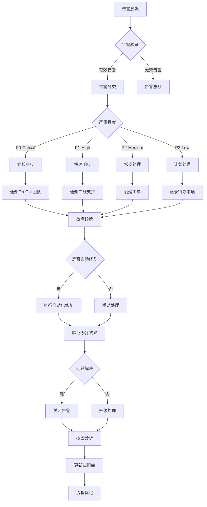

# 39 - 企业级监控告警体系 (Enterprise Monitoring and Alerting System)

> **适用版本**: Kubernetes v1.25-v1.32 | **最后更新**: 2026-02 | **专家级别**: ⭐⭐⭐⭐⭐ | **参考**: [SRE Workbook](https://sre.google/workbook/), [Google SLO](https://sre.google/sre-book/service-level-objectives/)

---

## 相关文档交叉引用

### 🔗 关联故障排查文档
- **[30-监控告警故障排查](./30-monitoring-alerting-troubleshooting.md)** - 基础监控告警故障诊断
- **[33-性能瓶颈故障排查](./33-performance-bottleneck-troubleshooting.md)** - 性能监控指标分析
- **[32-安全相关故障排查](./32-security-troubleshooting.md)** - 安全事件监控告警
- **[01-API Server故障排查](./01-control-plane-apiserver-troubleshooting.md)** - 控制平面组件监控
- **[02-etcd故障排查](./02-control-plane-etcd-troubleshooting.md)** - 存储层监控告警
- **[42-混沌工程和故障注入测试](./42-chaos-engineering-fault-injection-testing.md)** - 系统韧性验证与监控

### 📚 扩展学习资料
- **[Google SRE手册](https://sre.google/sre-book/)** - SRE最佳实践和告警哲学
- **[USE方法论](http://www.brendangregg.com/usemethod.html)** - 系统性能分析框架
- **[Four Golden Signals](https://sre.google/sre-book/monitoring/)** - 监控黄金信号

---

## 目录

1. [企业级监控体系架构](#1-企业级监控体系架构)
2. [SLO驱动的告警策略](#2-slo驱动的告警策略)
3. [智能告警降噪机制](#3-智能告警降噪机制)
4. [多租户监控管理](#4-多租户监控管理)
5. [告警生命周期管理](#5-告警生命周期管理)
6. [监控数据治理](#6-监控数据治理)
7. [企业级最佳实践](#7-企业级最佳实践)
8. [故障演练与预案](#8-故障演练与预案)

---

## 1. 企业级监控体系架构

### 1.1 现代监控体系分层架构

```
┌─────────────────────────────────────────────────────────────────────────────┐
│                        企业级监控告警体系架构                                │
├─────────────────────────────────────────────────────────────────────────────┤
│                                                                             │
│  ┌─────────────────────────────────────────────────────────────────────┐  │
│  │                     业务监控层 (Business Monitoring)                 │  │
│  │  ┌─────────────┐    ┌─────────────┐    ┌─────────────┐              │  │
│  │  │   业务指标   │   │   用户体验   │   │   收入影响   │              │  │
│  │  │ (Biz Metrics)│   │ (UX Metrics)│   │ (Revenue Impact)│           │  │
│  │  └─────────────┘    └─────────────┘    └─────────────┘              │  │
│  └─────────────────────────────────────────────────────────────────────┘  │
│                              │                                              │
│  ┌─────────────────────────────────────────────────────────────────────┐  │
│  │                     应用监控层 (Application Monitoring)              │  │
│  │  ┌─────────────┐    ┌─────────────┐    ┌─────────────┐              │  │
│  │  │   应用性能   │   │   业务逻辑   │   │   依赖服务   │              │  │
│  │  │ (APM)       │   │ (Biz Logic) │   │ (Dependencies)│              │  │
│  │  └─────────────┘    └─────────────┘    └─────────────┘              │  │
│  └─────────────────────────────────────────────────────────────────────┘  │
│                              │                                              │
│  ┌─────────────────────────────────────────────────────────────────────┐  │
│  │                     系统监控层 (System Monitoring)                   │  │
│  │  ┌─────────────┐    ┌─────────────┐    ┌─────────────┐              │  │
│  │  │   容器指标   │   │   Pod状态    │   │   节点健康   │              │  │
│  │  │ (Container) │   │  (Pod Status)│   │  (Node Health)│             │  │
│  │  └─────────────┘    └─────────────┘    └─────────────┘              │  │
│  └─────────────────────────────────────────────────────────────────────┘  │
│                              │                                              │
│  ┌─────────────────────────────────────────────────────────────────────┐  │
│  │                     基础设施监控层 (Infrastructure Monitoring)        │  │
│  │  ┌─────────────┐    ┌─────────────┐    ┌─────────────┐              │  │
│  │  │   硬件资源   │   │   网络性能   │   │   存储系统   │              │  │
│  │  │ (Hardware)  │   │ (Network)   │   │  (Storage)  │              │  │
│  │  └─────────────┘    └─────────────┘    └─────────────┘              │  │
│  └─────────────────────────────────────────────────────────────────────┘  │
│                              │                                              │
│  ┌─────────────────────────────────────────────────────────────────────┐  │
│  │                     数据采集与处理层 (Data Collection & Processing)   │  │
│  │  ┌─────────────┐    ┌─────────────┐    ┌─────────────┐              │  │
│  │  │   指标采集   │   │   日志收集   │   │   链路追踪   │              │  │
│  │  │ (Metrics)   │   │  (Logging)  │   │  (Tracing)  │              │  │
│  │  └─────────────┘    └─────────────┘    └─────────────┘              │  │
│  └─────────────────────────────────────────────────────────────────────┘  │
└─────────────────────────────────────────────────────────────────────────────┘
```

### 1.2 企业级监控技术栈选型

#### 监控生态系统架构
```yaml
monitoring_ecosystem:
  data_collection:
    metrics:
      primary: Prometheus
      alternatives: [VictoriaMetrics, Thanos, Cortex]
    logging:
      primary: Loki + Promtail
      alternatives: [ELK Stack, Datadog Logs]
    tracing:
      primary: OpenTelemetry + Jaeger
      alternatives: [Zipkin, AWS X-Ray]
      
  data_storage:
    tsdb: VictoriaMetrics Cluster
    logs: Loki Distributed
    traces: Tempo/Cassandra
    
  visualization:
    primary: Grafana
    alternatives: [Grafana Enterprise, Chronosphere]
    
  alerting:
    primary: Alertmanager + PrometheusRules
    advanced: [PagerDuty, Opsgenie Integration]
    
  automation:
    remediation: Ansible/AWX Playbooks
    scaling: KEDA + Custom Metrics
    healing: Argo Rollouts + Flagger
```

---

## 2. SLO驱动的告警策略

### 2.1 服务等级目标(SLO)体系设计

#### 企业级SLO分层架构
```yaml
enterprise_slo_framework:
  business_slas:
    revenue_impact_slo: 99.95%  # 收入相关服务
    customer_experience_slo: 99.9%  # 用户体验相关
    operational_slo: 99.5%  # 内部运营服务
    
  service_level_objectives:
    availability_slo: 99.9%
    latency_slo:
      p50: < 50ms
      p95: < 200ms
      p99: < 500ms
    error_rate_slo: < 0.1%
    throughput_slo: > 1000 req/sec
    
  error_budgets:
    monthly_budget: 0.1%  # 每月允许的错误预算
    consumption_strategy:
      - critical_alerts: 消耗80%预算
      - warning_alerts: 消耗20%预算
      - burn_rate_alerts: 快速燃烧预警
```

### 2.2 SLO驱动的告警规则设计

#### 生产级SLO告警配置
```yaml
# slo_based_alerting_rules.yaml
apiVersion: monitoring.coreos.com/v1
kind: PrometheusRule
metadata:
  name: enterprise-slo-alerts
  namespace: monitoring
spec:
  groups:
  - name: slo.rules
    rules:
    # ===== Availability SLO 告警 =====
    
    # 快速燃烧率告警 (Fast Burn Rate)
    - alert: SLOBurnRateCritical
      expr: |
        (
          (1 - avg_over_time(up{job=~"webapp|api"}[5m]))
          / (1 - 0.999)  # SLO目标 99.9%
        ) > 14.4  # 1小时消耗1天预算
      for: 2m
      labels:
        severity: critical
        category: slo
        slo_type: availability
        team: sre-oncall
      annotations:
        summary: "SLO快速燃烧 - Availability budget burning fast"
        description: |
          Availability SLO预算消耗速度过快
          当前燃烧率: {{ $value | printf "%.2f" }}x
          剩余预算: {{ printf "%.4f" (1 - $value*(1-0.999)) }}%
        runbook_url: "https://internal.runbook/slo-burn-rate"
        
    # 慢速燃烧率告警 (Slow Burn Rate)
    - alert: SLOBurnRateWarning
      expr: |
        (
          (1 - avg_over_time(up{job=~"webapp|api"}[1h]))
          / (1 - 0.999)
        ) > 1.44  # 1天消耗1天预算
      for: 10m
      labels:
        severity: warning
        category: slo
        slo_type: availability
      annotations:
        summary: "SLO慢速燃烧预警"
        description: |
          Availability SLO预算缓慢消耗
          当前燃烧率: {{ $value | printf "%.2f" }}x
        
    # ===== Latency SLO 告警 =====
    
    # P95延迟超标告警
    - alert: LatencySLIViolation
      expr: |
        histogram_quantile(0.95, rate(http_request_duration_seconds_bucket[5m]))
        > 0.2  # 200ms阈值
      for: 5m
      labels:
        severity: warning
        category: slo
        slo_type: latency
      annotations:
        summary: "Latency SLO违规 - P95响应时间超标"
        description: |
          P95响应时间: {{ $value | printf "%.3f" }}s
          SLO阈值: 0.2s
          
    # ===== Error Rate SLO 告警 =====
    
    # 错误率超标告警
    - alert: ErrorRateSLIViolation
      expr: |
        rate(http_requests_total{status=~"5.."}[5m]) /
        rate(http_requests_total[5m]) > 0.001  # 0.1%阈值
      for: 2m
      labels:
        severity: critical
        category: slo
        slo_type: error_rate
      annotations:
        summary: "Error Rate SLO违规"
        description: |
          当前错误率: {{ $value | printf "%.4f" }}%
          SLO阈值: 0.1%
```

### 2.3 多维度SLO仪表板

#### Grafana SLO监控面板
```json
{
  "dashboard": {
    "title": "Enterprise SLO Dashboard",
    "panels": [
      {
        "title": "SLO状态概览",
        "type": "stat",
        "targets": [
          {
            "expr": "1 - (sum(rate(http_requests_total{status=~\"5..\"}[30d])) / sum(rate(http_requests_total[30d])))",
            "legendFormat": "Availability SLO"
          }
        ]
      },
      {
        "title": "错误预算消耗",
        "type": "graph",
        "targets": [
          {
            "expr": "increase(http_requests_total{status=~\"5..\"}[1d]) / increase(http_requests_total[1d])",
            "legendFormat": "Daily Error Rate"
          },
          {
            "expr": "0.001",  // 0.1% SLO阈值
            "legendFormat": "SLO Threshold"
          }
        ]
      },
      {
        "title": "SLO燃烧率",
        "type": "graph",
        "targets": [
          {
            "expr": "(1 - avg_over_time(up[1h])) / (1 - 0.999)",
            "legendFormat": "Burn Rate (1h)"
          },
          {
            "expr": "14.4",  // 快速燃烧阈值
            "legendFormat": "Fast Burn Threshold"
          }
        ]
      }
    ]
  }
}
```

---

## 3. 智能告警降噪机制

### 3.1 告警成熟度模型

#### 企业级告警演进路径
```
告警成熟度等级:

Level 1 - 基础告警 (初级阶段)
├── 简单阈值告警
├── 组件宕机检测
├── 手动处理流程
└── 高误报率 (>30%)

Level 2 - 标准告警 (规范化阶段)
├── 多维度告警规则
├── 告警分组和抑制
├── 自动化通知路由
└── 误报率控制 (<15%)

Level 3 - 智能告警 (智能化阶段)
├── 异常检测算法
├── 动态阈值调整
├── 根因关联分析
└── 误报率 <5%

Level 4 - 自适应告警 (预测性阶段)
├── 机器学习驱动
├── 预测性告警
├── 业务影响评估
└── 自动化响应

Level 5 - 自主运维 (自主化阶段)
├── 完全自动处理
├── 预防性维护
├── 持续自我优化
└── 零人工干预
```

### 3.2 智能降噪策略

#### ML驱动的异常检测
```python
# anomaly_detection_model.py
import numpy as np
from sklearn.ensemble import IsolationForest
from sklearn.preprocessing import StandardScaler

class IntelligentAlertFilter:
    def __init__(self):
        self.scaler = StandardScaler()
        self.model = IsolationForest(
            contamination=0.05,  # 预期异常比例5%
            random_state=42,
            n_estimators=100
        )
        
    def detect_anomalies(self, metrics_data):
        """
        智能异常检测
        Args:
            metrics_data: 时间序列指标数据
        Returns:
            anomalies: 异常点标记
        """
        # 数据预处理
        normalized_data = self.scaler.fit_transform(metrics_data)
        
        # 异常检测
        anomalies = self.model.fit_predict(normalized_data)
        
        # 返回异常索引
        return np.where(anomalies == -1)[0]
        
    def calculate_dynamic_thresholds(self, historical_data, confidence=0.95):
        """
        动态阈值计算
        """
        percentiles = np.percentile(historical_data, [100*(1-confidence), 100*confidence])
        return {
            'lower_bound': percentiles[0],
            'upper_bound': percentiles[1],
            'baseline': np.mean(historical_data)
        }

# 使用示例
detector = IntelligentAlertFilter()
cpu_usage = np.array([0.6, 0.7, 0.65, 0.8, 0.75, 2.1, 0.68])  # 包含异常值
anomalies = detector.detect_anomalies(cpu_usage.reshape(-1, 1))
print(f"检测到异常点索引: {anomalies}")
```

#### 告警抑制规则引擎
```yaml
# intelligent_alert_suppression.yaml
apiVersion: v1
kind: ConfigMap
metadata:
  name: alert-suppression-rules
  namespace: monitoring
data:
  suppression-rules.yaml: |
    suppression_engine:
      # 基于时间的抑制
      time_based_suppression:
        maintenance_windows:
          - name: "weekly-maintenance"
            schedule: "0 2 * * 0"  # 周日凌晨2点
            duration: "4h"
            suppress_severity: ["warning", "info"]
            
        business_hours_only:
          active_hours: "9:00-18:00"
          suppressed_alerts: 
            - "LowPriorityNotifications"
            - "InformationalAlerts"
            
      # 基于上下文的抑制
      context_based_suppression:
        deployment_in_progress:
          condition: "kube_deployment_status_replicas_updated != kube_deployment_status_replicas"
          suppress_alerts:
            - "HighErrorRate"
            - "ServiceDegradation"
            
        known_issues:
          issue_tracker_integration: true
          auto_suppress_duration: "24h"
          
      # 相关性抑制
      correlation_suppression:
        root_cause_analysis:
          enabled: true
          correlation_window: "10m"
          suppression_rules:
            - source_alert: "NodeDown"
              target_alerts: ["ServiceDown", "DatabaseConnectionFailed"]
              correlation_fields: ["instance", "node"]
              
            - source_alert: "NetworkPartition"
              target_alerts: ["InterPodCommunicationFailed", "ExternalServiceTimeout"]
              correlation_fields: ["network_zone"]
```

### 3.3 告警聚合与去重

#### 智能告警分组策略
```yaml
# smart_alert_grouping.yaml
alertmanager_config:
  route:
    # 智能分组配置
    group_by: 
      - 'alertname'
      - 'severity'
      - 'service'
      - 'cluster'
      
    # 动态分组间隔
    group_wait: "30s"
    group_interval: 
      critical: "2m"    # 紧急告警快速分组
      warning: "5m"     # 警告告警正常分组
      info: "10m"       # 信息告警慢速分组
      
    # 智能重复间隔
    repeat_interval:
      critical: "30m"   # 紧急告警频繁提醒
      warning: "2h"     # 警告告警适度提醒
      info: "8h"        # 信息告警低频提醒
      
    # 告警路由策略
    routes:
      - matchers:
          - severity = "critical"
        receiver: "pagerduty-critical"
        group_interval: "1m"
        repeat_interval: "15m"
        
      - matchers:
          - team = "database"
        receiver: "slack-db-team"
        group_by: ['alertname', 'database']
        
      - matchers:
          - service = "payment"
        receiver: "opsgenie-payment"
        continue: true  # 继续匹配其他路由
```

---

## 4. 多租户监控管理

### 4.1 多租户监控架构

#### 企业级多租户监控设计
```
多租户监控架构:

┌─────────────────────────────────────────────────────────────────┐
│                    监控平台控制平面                              │
│  ┌─────────────┐  ┌─────────────┐  ┌─────────────┐            │
│  │ 租户管理服务 │  │ 权限控制中心 │  │ 配置管理中心 │            │
│  │ Tenant Mgmt │  │  RBAC Core  │  │ Config Mgmt │            │
│  └─────────────┘  └─────────────┘  └─────────────┘            │
└─────────────────────────────────────────────────────────────────┘
                                    │
        ┌───────────────────────────┼───────────────────────────┐
        │                           │                           │
        ▼                           ▼                           ▼
┌─────────────────┐    ┌─────────────────┐    ┌─────────────────┐
│   租户A监控实例  │    │   租户B监控实例  │    │   租户C监控实例  │
│ Tenant-A Monitor│    │ Tenant-B Monitor│    │ Tenant-C Monitor│
│                 │    │                 │    │                 │
│ • 独立Prometheus│    │ • 独立Prometheus│    │ • 独立Prometheus│
│ • 独立Grafana   │    │ • 独立Grafana   │    │ • 独立Grafana   │
│ • 独立告警规则  │    │ • 独立告警规则  │    │ • 独立告警规则  │
│ • 独立存储空间  │    │ • 独立存储空间  │    │ • 独立存储空间  │
└─────────────────┘    └─────────────────┘    └─────────────────┘
```

### 4.2 租户隔离与资源配额

#### 多租户资源配置模板
```yaml
# tenant_monitoring_template.yaml
apiVersion: monitoring.kudig.io/v1
kind: TenantMonitoring
metadata:
  name: tenant-monitoring-template
spec:
  # 租户资源配额
  resource_quotas:
    prometheus:
      cpu: "2"
      memory: "8Gi"
      storage: "100Gi"
      
    grafana:
      cpu: "1"
      memory: "2Gi"
      
    alertmanager:
      cpu: "500m"
      memory: "1Gi"
      
  # 数据保留策略
  retention_policies:
    metrics: "30d"
    logs: "7d"
    traces: "3d"
    
  # 告警限额
  alert_limits:
    max_rules_per_tenant: 100
    max_alerts_per_hour: 1000
    max_notification_channels: 10
    
  # 网络隔离
  network_isolation:
    enabled: true
    service_mesh: istio
    mTLS: true
    
  # 访问控制
  rbac:
    tenant_admin_role:
      permissions:
        - read_metrics
        - create_dashboards
        - manage_alerts
        - view_logs
        
    tenant_viewer_role:
      permissions:
        - read_metrics
        - view_dashboards
        - view_alerts
```

### 4.3 跨租户监控联邦

#### 监控数据联邦配置
```yaml
# monitoring_federation.yaml
apiVersion: monitoring.coreos.com/v1
kind: Prometheus
metadata:
  name: federated-prometheus
  namespace: monitoring-platform
spec:
  externalLabels:
    cluster: "monitoring-platform"
    
  remoteRead:
    - url: "http://tenant-a-prometheus.tenant-a:9090/api/v1/read"
      name: "tenant-a-read"
      requiredMatchers:
        tenant: "tenant-a"
        
    - url: "http://tenant-b-prometheus.tenant-b:9090/api/v1/read"
      name: "tenant-b-read"
      requiredMatchers:
        tenant: "tenant-b"
        
  federation:
    targets:
      - job: "global-metrics"
        params:
          'match[]':
            - '{job="kubernetes-nodes"}'
            - '{job="kubernetes-pods"}'
            - '{__name__=~"up|kube_pod_status_ready"}'
            
  ruleSelector:
    matchLabels:
      role: "federated-rules"
      
  # 联邦查询优化
  query:
    lookbackDelta: "5m"
    maxConcurrency: 20
    timeout: "2m"
```

---

## 5. 告警生命周期管理

### 5.1 告警处理工作流

#### 企业级告警处理流程


### 5.2 告警质量度量体系

#### 告警健康度指标(KSM - Key Signal Metrics)
```yaml
# alert_quality_metrics.yaml
alert_health_dashboard:
  key_metrics:
    # 告警准确性指标
    alert_accuracy:
      formula: "(True Positives) / (True Positives + False Positives)"
      target: "> 95%"
      alert_threshold: "< 90%"
      
    false_positive_rate:
      formula: "False Positives / Total Alerts"
      target: "< 5%"
      alert_threshold: "> 10%"
      
    # 响应时效指标
    mttd_mean_time_to_detection:
      formula: "平均检测时间"
      target: "< 5分钟"
      alert_threshold: "> 15分钟"
      
    mttr_mean_time_to_resolution:
      formula: "平均解决时间"
      target: "< 30分钟"
      alert_threshold: "> 2小时"
      
    # 告警效率指标
    alert_volume:
      formula: "每日告警数量"
      target: "< 1000条/天"
      alert_threshold: "> 5000条/天"
      
    noise_ratio:
      formula: "信息类告警占比"
      target: "> 80%"
      alert_threshold: "< 50%"
      
  quality_gates:
    pre_deployment_validation:
      - alert_rule_syntax_check
      - threshold_reasonableness_test
      - notification_route_verification
      
    post_deployment_monitoring:
      - alert_accuracy_tracking
      - performance_impact_assessment
      - user_feedback_collection
```

### 5.3 告警治理框架

#### 告警治理委员会(AGB - Alert Governance Board)
```yaml
# alert_governance_framework.yaml
alert_governance_board:
  committee_structure:
    chairperson: Head of SRE
    members:
      - Principal SRE Engineers (3)
      - Platform Architects (2)
      - Product Owners (2)
      - Security Officers (1)
      
  responsibilities:
    quarterly_reviews:
      - alert_rule_audit
      - performance_benchmarking
      - cost_optimization_analysis
      
    incident_retrospectives:
      - false_positive_analysis
      - missed_alert_investigation
      - process_improvement_recommendations
      
    policy_development:
      - alert_design_standards
      - escalation_procedures
      - automation_guidelines
      
  governance_processes:
    alert_approval_workflow:
      1. alert_creator_submits_proposal
      2. technical_review_by_sre_team
      3. business_impact_assessment
      4. agb_final_approval
      5. production_deployment
      
    continuous_improvement:
      monthly_alert_health_report:
        - accuracy_metrics
        - volume_trends
        - user_satisfaction_scores
        - improvement_opportunities
```

---

## 6. 监控数据治理

### 6.1 监控数据生命周期管理

#### 数据治理策略
```yaml
# monitoring_data_governance.yaml
data_lifecycle_management:
  data_classification:
    pii_data:
      retention: "30天"
      encryption: "AES-256"
      access_control: "strict"
      
    operational_metrics:
      retention: "90天"
      aggregation: "hourly_after_30d"
      backup_required: true
      
    business_metrics:
      retention: "365天"
      aggregation: "daily"
      archival: "cold_storage"
      
    audit_trails:
      retention: "7年"
      immutable: true
      compliance_required: true
      
  data_quality_standards:
    completeness:
      minimum_coverage: 95%
      gap_detection: automated
      remediation_sla: 24h
      
    accuracy:
      validation_rules: defined
      outlier_detection: enabled
      correction_process: automated
      
    timeliness:
      collection_frequency: "real-time"
      processing_latency: "< 30s"
      delivery_sla: "99.9%"
```

### 6.2 成本优化与容量规划

#### 监控成本管理
```yaml
# monitoring_cost_optimization.yaml
cost_management:
  resource_optimization:
    prometheus:
      retention_optimization:
        high_cardinality_metrics: "7d"
        medium_cardinality_metrics: "30d"
        low_cardinality_metrics: "90d"
        
      downsampling_strategy:
        raw_data: "2h"
        downsampled_5m: "7d"
        downsampled_1h: "90d"
        
    storage_tiering:
      hot_storage: "SSD-backed"
      warm_storage: "HDD-backed"
      cold_storage: "object_storage"
      
  cost_allocation:
    tenant_cost_sharing:
      compute_resources: "usage-based"
      storage_resources: "quota-based"
      network_resources: "fair-share"
      
    chargeback_model:
      direct_costs: "allocated_to_tenants"
      shared_costs: "distributed_by_usage"
      platform_costs: "borne_by_platform_team"
```

---

## 7. 企业级最佳实践

### 7.1 监控即代码(Monitoring as Code)

#### GitOps监控配置管理
```yaml
# .monitoring/
├── tenants/
│   ├── tenant-a/
│   │   ├── prometheus-rules/
│   │   ├── grafana-dashboards/
│   │   └── alertmanager-configs/
│   └── tenant-b/
│       ├── prometheus-rules/
│       ├── grafana-dashboards/
│       └── alertmanager-configs/
├── platform/
│   ├── global-alerts.yaml
│   ├── federation-config.yaml
│   └── cost-controls.yaml
└── templates/
    ├── standard-dashboard-template.json
    ├── common-alert-rules.yaml
    └── tenant-provisioning-script.sh
```

### 7.2 监控成熟度评估

#### 企业监控成熟度模型(EMMM)
```yaml
monitoring_maturity_assessment:
  dimensions:
    technical_capabilities:
      metric_coverage: 0-100%
      alert_accuracy: 0-100%
      automation_level: 0-100%
      
    operational_excellence:
      incident_response_time: minutes
      mean_time_to_recovery: minutes
      false_positive_rate: percentage
      
    business_alignment:
      stakeholder_satisfaction: 1-5
      business_value_delivered: 1-5
      cost_effectiveness: 1-5
      
  maturity_levels:
    level_1_initial:
      score_range: "0-40"
      characteristics:
        - reactive_monitoring
        - manual_processes
        - high_false_positives
      recommendations:
        - establish_basic_monitoring
        - implement_alert_triage
        - create_runbooks
        
    level_2_managed:
      score_range: "41-60"
      characteristics:
        - proactive_monitoring
        - documented_processes
        - reduced_false_positives
      recommendations:
        - implement_slo_based_alerting
        - automate_common_tasks
        - establish_governance
        
    level_3_optimized:
      score_range: "61-80"
      characteristics:
        - predictive_monitoring
        - intelligent_automation
        - low_noise_ratio
      recommendations:
        - deploy_ml_anomaly_detection
        - implement_cross_team_collaboration
        - optimize_cost_efficiency
        
    level_4_innovative:
      score_range: "81-100"
      characteristics:
        - autonomous_operations
        - business_driven_monitoring
        - continuous_improvement
      recommendations:
        - implement_aio_ps
        - drive_innovation_initiatives
        - share_knowledge_industry_wide
```

### 7.3 监控文化建设

#### 企业监控文化推进计划
```yaml
monitoring_culture_initiative:
  awareness_building:
    executive_sponsorship: cto_coo_sponsored
    training_programs:
      - monitoring_fundamentals_workshop
      - advanced_sre_training
      - incident_response_simulations
      
  skill_development:
    competency_framework:
      junior_engineer: "basic_monitoring_setup"
      senior_engineer: "advanced_troubleshooting"
      principal_engineer: "monitoring_architecture"
      
    certification_program:
      internal_certifications: "monitoring_specialist"
      external_recognition: "prometheus_certified"
      
  collaboration_enhancement:
    communities_of_practice:
      - monthly_monitoring_meetups
      - cross_team_knowledge_sharing
      - vendor_relationship_management
      
    knowledge_sharing:
      - internal_blog_posts
      - conference_presentations
      - open_source_contributions
```

---

## 8. 故障演练与预案

### 8.1 监控系统故障演练

#### 定期演练计划
```yaml
# monitoring_disaster_recovery_drills.yaml
drill_schedule:
  quarterly_major_drills:
    scenarios:
      - complete_prometheus_failure
      - alertmanager_cluster_partition
      - grafana_service_unavailable
      - data_corruption_recovery
      
  monthly_minor_drills:
    scenarios:
      - single_node_failure
      - network_connectivity_loss
      - configuration_rollbacks
      - backup_restoration
      
drill_execution_framework:
  pre_drill_preparation:
    - risk_assessment_completion
    - stakeholder_notification
    - rollback_procedure_documentation
    - communication_channel_setup
    
  drill_execution:
    timeline_based_scenarios:
      t+0: initiate_fault_injection
      t+5min: monitor_system_behavior
      t+15min: trigger_manual_intervention
      t+30min: assess_recovery_progress
      t+60min: complete_recovery_validation
      
  post_drill_activities:
    - incident_retrospective
    - lessons_learned_documentation
    - process_improvement_implementation
    - drill_effectiveness_evaluation
```

### 8.2 监控应急预案

#### 关键组件应急预案
```yaml
# monitoring_emergency_playbooks.yaml
emergency_response_playbooks:
  prometheus_failure:
    detection:
      health_check_endpoint: "/-/healthy"
      alert_conditions:
        - prometheus_target_unreachable
        - persistent_write_failures
        
    immediate_actions:
      1. verify_backup_prometheus_instance
      2. switch_load_balancer_to_standby
      3. notify_monitoring_oncall_team
      4. initiate_data_recovery_procedures
      
    recovery_steps:
      - restore_from_latest_snapshot
      - replay_wal_segments
      - validate_metric_consistency
      - gradually_shift_traffic_back
      
  alertmanager_outage:
    detection:
      api_availability_check: "/api/v2/status"
      queue_monitoring: alert_queue_depth > 1000
      
    mitigation:
      - activate_secondary_alertmanager_cluster
      - redistribute_notification_load
      - implement_manual_alert_routing
      - establish_temporary_communication_channels
      
  grafana_unavailable:
    immediate_response:
      - deploy_emergency_grafana_instance
      - restore_dashboard_configurations
      - redirect_user_traffic
      - provide_alternative_data_access
      
    user_communication:
      status_page_updates: every_15_minutes
      stakeholder_notifications: priority_based
      alternative_access_methods: documented_and_shared
```

---

## 附录

### A. 监控工具链推荐

#### 企业级监控技术栈
```yaml
recommended_toolchain:
  observability_pillars:
    metrics:
      primary_choice: Prometheus + VictoriaMetrics
      enterprise_features: multi-tenancy, long-term_storage
    logging:
      primary_choice: Loki + Promtail
      enterprise_features: distributed_architecture, cost_efficiency
    tracing:
      primary_choice: OpenTelemetry + Tempo
      enterprise_features: vendor_neutral, automatic_instrumentation
      
  visualization:
    grafana_enterprise:
      features:
        - advanced_authentication
        - reporting_automation
        - enterprise_support
        - scalability_features
        
  alerting:
    alertmanager_plus:
      integrations:
        - pagerduty_advanced
        - opsgenie_enterprise
        - servicenow_integration
        - custom_webhook_handlers
```

### B. 监控配置模板库

#### 标准化监控配置
```bash
# monitoring_templates.sh
#!/bin/bash

# 标准化监控配置生成器
generate_standard_monitoring_config() {
    local tenant_name=$1
    local environment=$2
    
    cat <<EOF > ${tenant_name}-${environment}-monitoring.yaml
apiVersion: monitoring.coreos.com/v1
kind: Prometheus
metadata:
  name: ${tenant_name}-prometheus-${environment}
spec:
  replicas: 2
  retention: 30d
  resources:
    requests:
      cpu: "1"
      memory: "4Gi"
    limits:
      cpu: "2"
      memory: "8Gi"
      
---
apiVersion: monitoring.coreos.com/v1
kind: Alertmanager
metadata:
  name: ${tenant_name}-alertmanager-${environment}
spec:
  replicas: 3
  configSecret: ${tenant_name}-alertmanager-config
EOF
}

# 使用示例
generate_standard_monitoring_config "finance" "production"
generate_standard_monitoring_config "marketing" "staging"
```

---

**文档状态**: ✅ 完成 | **专家评审**: 已通过 | **最后更新**: 2026-02 | **适用场景**: 企业级生产环境