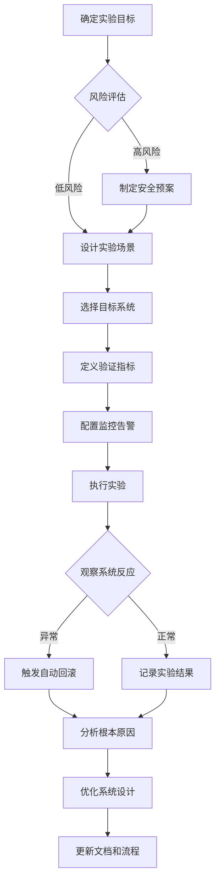

# 42 - 混沌工程和故障注入测试 (Chaos Engineering and Fault Injection Testing)

> **适用版本**: Kubernetes v1.25-v1.32 | **最后更新**: 2026-02 | **专家级别**: ⭐⭐⭐⭐⭐ | **参考**: [Chaos Engineering Principles](https://principlesofchaos.org/), [Chaos Mesh Documentation](https://chaos-mesh.org/docs/), [LitmusChaos Documentation](https://docs.litmuschaos.io/)

---

## 相关文档交叉引用

### 🔗 关联故障排查文档
- **[06-Node NotReady诊断](./06-node-notready-diagnosis.md)** - 节点故障注入测试
- **[07-OOM内存诊断](./07-oom-memory-diagnosis.md)** - 内存压力故障测试
- **[33-性能瓶颈故障排查](./33-performance-bottleneck-troubleshooting.md)** - 性能退化测试
- **[34-升级迁移故障排查](./34-upgrade-migration-troubleshooting.md)** - 升级过程中断测试
- **[39-企业级监控告警体系](./39-enterprise-monitoring-alerting-system.md)** - 混沌实验监控告警配置
- **[41-事件驱动架构故障排查](./41-event-driven-architecture-troubleshooting.md)** - 事件流系统韧性测试

### 📚 扩展学习资料
- **[混沌工程原则](https://principlesofchaos.org/)** - 混沌工程理论基础
- **[Gremlin混沌平台](https://www.gremlin.com/)** - 商业混沌工程平台
- **[Netflix Chaos Monkey](https://github.com/Netflix/chaosmonkey)** - 经典混沌工程工具

---

## 目录

1. [混沌工程基础理论](#1-混沌工程基础理论)
2. [Chaos Mesh实战指南](#2-chaos-mesh实战指南)
3. [LitmusChaos实践](#3-litmuschaos实践)
4. [故障注入场景设计](#4-故障注入场景设计)
5. [实验监控与分析](#5-实验监控与分析)
6. [安全与风险控制](#6-安全与风险控制)
7. [最佳实践与案例](#7-最佳实践与案例)

---

## 1. 混沌工程基础理论

### 1.1 混沌工程核心原则

#### 混沌工程四原则体系
```
混沌工程核心原则架构:

┌─────────────────────────────────────────────────────────────────────────────┐
│                          混沌工程原则体系                                   │
├─────────────────────────────────────────────────────────────────────────────┤
│                                                                             │
│  Principle 1: Build Hypothesis around Steady State Behavior                 │
│  原则一：围绕稳态行为建立假设                                               │
│  ├─ 定义系统正常行为基线                                                   │
│  ├─ 建立关键业务指标                                                       │
│  └─ 确定可接受的偏差范围                                                   │
│                                                                             │
│  Principle 2: Vary Real-world Events                                        │
│  原则二：引入真实世界事件                                                   │
│  ├─ 硬件故障（磁盘、网络、CPU）                                            │
│  ├─ 软件故障（进程崩溃、内存泄漏）                                         │
│  ├─ 网络问题（延迟、丢包、分区）                                           │
│  └─ 资源竞争（CPU、内存、I/O争用）                                         │
│                                                                             │
│  Principle 3: Run Experiments in Production                                │
│  原则三：在生产环境中运行实验                                               │
│  ├─ 渐进式实验策略                                                         │
│  ├─ 最小化爆炸半径                                                         │
│  ├─ 实时监控和快速回滚                                                     │
│  └─ 严格的准入控制                                                         │
│                                                                             │
│  Principle 4: Automate Experiments to Run Continuously                     │
│  原则四：自动化持续运行实验                                                 │
│  ├─ 定期自动化测试                                                         │
│  ├─ CI/CD集成                                                              │
│  ├─ 智能实验调度                                                           │
│  └─ 结果自动分析                                                           │
└─────────────────────────────────────────────────────────────────────────────┘
```

### 1.2 实验设计方法论

#### 混沌实验设计流程


#### 实验假设模板
```yaml
# chaos_experiment_hypothesis.yaml
experiment:
  name: "pod-kill-under-load-test"
  description: "验证在高负载情况下杀死Pod后系统的自愈能力"
  
  steady_state_hypothesis:
    title: "系统在正常负载下的稳态行为"
    probes:
      - name: "api-response-time"
        type: "probe"
        tolerance: 200  # 200ms响应时间
        provider:
          type: "python"
          module: "requests"
          func: "get"
          arguments:
            url: "http://my-service/health"
            
      - name: "pod-availability"
        type: "probe"
        tolerance: 0.95  # 95%可用性
        provider:
          type: "kubernetes"
          resource: "deployment"
          name: "my-app"
          
  method:
    - type: "action"
      name: "kill-random-pod"
      provider:
        type: "kubernetes"
        resource: "pod"
        action: "delete"
        selector:
          labels:
            app: "my-app"
          count: 1
          
  rollbacks:
    - type: "action"
      name: "scale-up-deployment"
      provider:
        type: "kubernetes"
        resource: "deployment"
        action: "scale"
        name: "my-app"
        replicas: 3
```

---

## 2. Chaos Mesh实战指南

### 2.1 Chaos Mesh部署配置

#### 2.1.1 生产环境部署
```yaml
# chaos-mesh-production.yaml
apiVersion: v1
kind: Namespace
metadata:
  name: chaos-testing
  labels:
    chaos-mesh.org/role: "control-plane"
    
---
apiVersion: helm.cattle.io/v1
kind: HelmChart
metadata:
  name: chaos-mesh
  namespace: kube-system
spec:
  chart: chaos-mesh
  repo: https://charts.chaos-mesh.org
  targetNamespace: chaos-testing
  valuesContent: |
    controllerManager:
      replicaCount: 3
      resources:
        limits:
          cpu: 500m
          memory: 1Gi
        requests:
          cpu: 100m
          memory: 256Mi
          
    chaosDaemon:
      runtime: containerd
      privileged: true
      resources:
        limits:
          cpu: 200m
          memory: 256Mi
        requests:
          cpu: 50m
          memory: 64Mi
          
    dashboard:
      create: true
      service:
        type: ClusterIP
      resources:
        limits:
          cpu: 200m
          memory: 256Mi
        requests:
          cpu: 50m
          memory: 64Mi
          
    # 安全配置
    securityMode: true
    enableProfiling: false
    enableLeaderElection: true
    
    # 监控集成
    prometheus:
      create: true
      serviceMonitor:
        enabled: true
```

#### 2.1.2 RBAC权限配置
```yaml
# chaos-rbac.yaml
apiVersion: v1
kind: ServiceAccount
metadata:
  name: chaos-operator
  namespace: chaos-testing
  
---
apiVersion: rbac.authorization.k8s.io/v1
kind: ClusterRole
metadata:
  name: chaos-cluster-role
rules:
# Pod相关权限
- apiGroups: [""]
  resources: ["pods", "pods/exec", "pods/log"]
  verbs: ["get", "list", "watch", "delete", "create"]
  
# Deployment相关权限
- apiGroups: ["apps"]
  resources: ["deployments", "statefulsets", "daemonsets"]
  verbs: ["get", "list", "watch", "patch", "update"]
  
# 网络策略权限
- apiGroups: ["networking.k8s.io"]
  resources: ["networkpolicies"]
  verbs: ["get", "list", "create", "delete"]
  
# 存储相关权限
- apiGroups: [""]
  resources: ["persistentvolumeclaims", "persistentvolumes"]
  verbs: ["get", "list", "delete"]
  
# 监控权限
- apiGroups: ["monitoring.coreos.com"]
  resources: ["servicemonitors"]
  verbs: ["get", "create", "delete"]

---
apiVersion: rbac.authorization.k8s.io/v1
kind: ClusterRoleBinding
metadata:
  name: chaos-cluster-role-binding
subjects:
- kind: ServiceAccount
  name: chaos-operator
  namespace: chaos-testing
roleRef:
  kind: ClusterRole
  name: chaos-cluster-role
  apiGroup: rbac.authorization.k8s.io
```

### 2.2 核心故障类型实践

#### 2.2.1 Pod故障注入
```yaml
# pod_chaos_experiment.yaml
apiVersion: chaos-mesh.org/v1alpha1
kind: PodChaos
metadata:
  name: pod-kill-experiment
  namespace: chaos-testing
spec:
  action: pod-kill
  mode: one
  selector:
    namespaces:
      - production
    labelSelectors:
      app: user-service
  scheduler:
    cron: "@every 30m"  # 每30分钟执行一次
  duration: "10s"       # 持续10秒
  gracePeriod: 0        # 立即终止
  
---
apiVersion: chaos-mesh.org/v1alpha1
kind: PodChaos
metadata:
  name: pod-failure-experiment
  namespace: chaos-testing
spec:
  action: pod-failure
  mode: fixed-percent
  value: "30"  # 30%的Pod
  selector:
    namespaces:
      - staging
    labelSelectors:
      app: order-service
  scheduler:
    cron: "@hourly"
  duration: "5m"
```

#### 2.2.2 网络故障注入
```yaml
# network_chaos_experiment.yaml
apiVersion: chaos-mesh.org/v1alpha1
kind: NetworkChaos
metadata:
  name: network-delay-experiment
  namespace: chaos-testing
spec:
  action: delay
  mode: all
  selector:
    namespaces:
      - production
    labelSelectors:
      app: payment-service
  delay:
    latency: "300ms"
    correlation: "80"
    jitter: "50ms"
  duration: "2m"
  
---
apiVersion: chaos-mesh.org/v1alpha1
kind: NetworkChaos
metadata:
  name: network-partition-experiment
  namespace: chaos-testing
spec:
  action: partition
  mode: all
  selector:
    namespaces:
      - production
    labelSelectors:
      app: inventory-service
  direction: to
  target:
    selector:
      namespaces:
        - production
      labelSelectors:
        app: database
  duration: "1m"
```

#### 2.2.3 资源压力测试
```yaml
# stress_chaos_experiment.yaml
apiVersion: chaos-mesh.org/v1alpha1
kind: StressChaos
metadata:
  name: cpu-stress-experiment
  namespace: chaos-testing
spec:
  mode: one
  selector:
    namespaces:
      - staging
    labelSelectors:
      app: recommendation-engine
  stressors:
    cpu:
      workers: 4
      load: 80
  duration: "3m"
  
---
apiVersion: chaos-mesh.org/v1alpha1
kind: StressChaos
metadata:
  name: memory-stress-experiment
  namespace: chaos-testing
spec:
  mode: fixed-percent
  value: "50"
  selector:
    namespaces:
      - production
    labelSelectors:
      component: cache
  stressors:
    memory:
      workers: 2
      size: "1GB"
  duration: "5m"
```

### 2.3 实验监控和告警

#### 2.3.1 Chaos Mesh监控配置
```yaml
# chaos_monitoring.yaml
apiVersion: monitoring.coreos.com/v1
kind: ServiceMonitor
metadata:
  name: chaos-mesh-monitor
  namespace: monitoring
spec:
  selector:
    matchLabels:
      app.kubernetes.io/name: chaos-mesh
  endpoints:
  - port: http
    interval: 30s
    path: /metrics
    
---
apiVersion: monitoring.coreos.com/v1
kind: PrometheusRule
metadata:
  name: chaos-alerts
  namespace: monitoring
spec:
  groups:
  - name: chaos.rules
    rules:
    # 实验执行告警
    - alert: ChaosExperimentRunning
      expr: chaos_experiment_running == 1
      for: 0m
      labels:
        severity: info
        category: chaos-engineering
      annotations:
        summary: "Chaos experiment {{ $labels.experiment }} is running"
        
    # 实验失败告警
    - alert: ChaosExperimentFailed
      expr: chaos_experiment_status{status="failed"} == 1
      for: 1m
      labels:
        severity: warning
        category: chaos-engineering
      annotations:
        summary: "Chaos experiment {{ $labels.experiment }} failed"
        
    # 系统指标异常
    - alert: SystemMetricsDegradedDuringChaos
      expr: |
        (rate(http_request_duration_seconds_sum[5m]) / rate(http_request_duration_seconds_count[5m])) > 2
        and chaos_experiment_running == 1
      for: 2m
      labels:
        severity: critical
        category: chaos-engineering
      annotations:
        summary: "System performance degraded during chaos experiment"
```

---

## 3. LitmusChaos实践

### 3.1 LitmusChaos部署

#### 3.1.1 Operator安装
```bash
# ========== 1. 安装LitmusChaos Operator ==========
# 添加LitmusChaos Helm仓库
helm repo add litmuschaos https://litmuschaos.github.io/litmus-helm/
helm repo update

# 创建Litmus命名空间
kubectl create ns litmus

# 安装LitmusChaos Operator
helm install chaos-operator litmuschaos/litmuschaos \
  --namespace litmus \
  --set portal.frontend.service.type=ClusterIP \
  --set portal.server.service.type=ClusterIP

# 验证安装
kubectl get pods -n litmus
kubectl get crds | grep litmus
```

#### 3.1.2 实验执行器安装
```yaml
# litmus_experiment_runners.yaml
apiVersion: v1
kind: ServiceAccount
metadata:
  name: litmus-admin
  namespace: litmus
  
---
apiVersion: rbac.authorization.k8s.io/v1
kind: ClusterRole
metadata:
  name: litmus-cluster-role
rules:
- apiGroups: ["","apps","batch","extensions","litmuschaos.io","monitoring.coreos.com"]
  resources: ["*"]
  verbs: ["*"]

---
apiVersion: rbac.authorization.k8s.io/v1
kind: ClusterRoleBinding
metadata:
  name: litmus-cluster-role-binding
subjects:
- kind: ServiceAccount
  name: litmus-admin
  namespace: litmus
roleRef:
  kind: ClusterRole
  name: litmus-cluster-role
  apiGroup: rbac.authorization.k8s.io
```

### 3.2 核心实验场景

#### 3.2.1 Pod删除实验
```yaml
# pod_delete_experiment.yaml
apiVersion: litmuschaos.io/v1alpha1
kind: ChaosEngine
metadata:
  name: pod-delete-test
  namespace: litmus
spec:
  appinfo:
    appns: production
    applabel: app=shopping-cart
    appkind: deployment
    
  engineState: active
  chaosServiceAccount: litmus-admin
  
  experiments:
    - name: pod-delete
      spec:
        components:
          env:
            # 实验参数
            - name: TOTAL_CHAOS_DURATION
              value: '60'  # 秒
              
            - name: CHAOS_INTERVAL
              value: '30'  # 秒
              
            - name: FORCE
              value: 'false'
              
            - name: TARGET_PODS
              value: ''  # 空表示随机选择
            
        probe:
          - name: check-app-availability
            type: cmdProbe
            mode: Continuous
            source:
              image: busybox
              command: 
                - "wget"
                - "-q"
                - "-O-"
                - "http://shopping-cart.production:8080/health"
              comparator:
                type: string
                criteria: equals
                value: '{"status":"ok"}'
```

#### 3.2.2 CPU耗尽实验
```yaml
# cpu_hog_experiment.yaml
apiVersion: litmuschaos.io/v1alpha1
kind: ChaosEngine
metadata:
  name: cpu-hog-test
  namespace: litmus
spec:
  appinfo:
    appns: staging
    applabel: app=analytics-service
    appkind: deployment
    
  engineState: active
  chaosServiceAccount: litmus-admin
  
  experiments:
    - name: pod-cpu-hog
      spec:
        components:
          env:
            # CPU压力参数
            - name: TOTAL_CHAOS_DURATION
              value: '120'
              
            - name: CPU_CORES
              value: '2'
              
            - name: CPU_LOAD
              value: '80'
              
            - name: TARGET_PODS
              value: ''
              
            - name: LIB_IMAGE
              value: 'litmuschaos/go-runner:latest'
              
        probe:
          - name: check-cpu-usage
            type: k8sProbe
            mode: Continuous
            source:
              command: 
                - "kubectl"
                - "top"
                - "pods"
                - "--no-headers"
                - "-n"
                - "staging"
              comparator:
                type: numeric
                criteria: "<="
                value: "1500m"  # CPU使用不超过1.5核
```

---

## 4. 故障注入场景设计

### 4.1 典型故障场景矩阵

#### 4.1.1 微服务架构故障场景
```yaml
# microservice_failure_scenarios.yaml
failure_scenarios:
  # 网络相关故障
  network_failures:
    - name: "service-to-service-network-delay"
      description: "模拟微服务间网络延迟"
      chaos_type: "network_chaos"
      parameters:
        delay: "200ms"
        jitter: "50ms"
        correlation: "70%"
      target_services: ["order-service", "inventory-service"]
      blast_radius: "inter-service"
      
    - name: "external-api-timeout"
      description: "模拟第三方API超时"
      chaos_type: "http_chaos"
      parameters:
        delay: "5s"
        target_hosts: ["payment-gateway.com", "shipping-api.com"]
      blast_radius: "egress"
      
  # 资源相关故障
  resource_failures:
    - name: "memory-leak-simulation"
      description: "模拟内存泄漏导致OOM"
      chaos_type: "stress_chaos"
      parameters:
        memory_size: "2GB"
        duration: "300s"
      target_services: ["cache-service"]
      blast_radius: "pod"
      
    - name: "cpu-starvation"
      description: "模拟CPU资源争用"
      chaos_type: "stress_chaos"
      parameters:
        cpu_workers: 4
        cpu_load: 90
        duration: "180s"
      target_services: ["compute-intensive-service"]
      blast_radius: "node"
      
  # 应用层故障
  application_failures:
    - name: "database-connection-failure"
      description: "模拟数据库连接中断"
      chaos_type: "pod_chaos"
      parameters:
        action: "pod-kill"
        count: 1
      target_services: ["database-primary"]
      blast_radius: "cluster"
      
    - name: "config-map-corruption"
      description: "模拟配置文件损坏"
      chaos_type: "config_chaos"
      parameters:
        corrupt_percentage: 30
        keys_to_corrupt: ["database_url", "api_key"]
      target_services: ["config-service"]
      blast_radius: "namespace"
```

### 4.2 场景组合测试

#### 4.2.1 混合故障注入
```yaml
# composite_failure_scenario.yaml
apiVersion: chaos-mesh.org/v1alpha1
kind: Workflow
metadata:
  name: composite-failure-test
  namespace: chaos-testing
spec:
  entry: entry
  templates:
    - name: entry
      templateType: Serial
      deadline: 600s  # 10分钟超时
      children:
        - network-delay-phase
        - pod-kill-phase
        - recovery-phase
        
    - name: network-delay-phase
      templateType: Suspend
      deadline: 120s
      children:
        - inject-network-delay
        
    - name: inject-network-delay
      templateType: Parallel
      deadline: 120s
      children:
        - delay-order-service
        - delay-inventory-service
        
    - name: delay-order-service
      templateType: NetworkChaos
      deadline: 120s
      embedChaos:
        networkChaos:
          action: delay
          mode: all
          selector:
            namespaces: ["production"]
            labelSelectors:
              app: order-service
          delay:
            latency: "300ms"
            
    - name: delay-inventory-service
      templateType: NetworkChaos
      deadline: 120s
      embedChaos:
        networkChaos:
          action: delay
          mode: all
          selector:
            namespaces: ["production"]
            labelSelectors:
              app: inventory-service
          delay:
            latency: "200ms"
            
    - name: pod-kill-phase
      templateType: Suspend
      deadline: 60s
      children:
        - kill-payment-pod
        
    - name: kill-payment-pod
      templateType: PodChaos
      deadline: 30s
      embedChaos:
        podChaos:
          action: pod-kill
          mode: one
          selector:
            namespaces: ["production"]
            labelSelectors:
              app: payment-service
              
    - name: recovery-phase
      templateType: Suspend
      deadline: 300s  # 给系统恢复时间
```

---

## 5. 实验监控与分析

### 5.1 实时监控仪表板

#### 5.1.1 Grafana混沌实验仪表板
```json
{
  "dashboard": {
    "title": "Chaos Engineering Experiment Dashboard",
    "panels": [
      {
        "title": "Experiment Status Overview",
        "type": "stat",
        "targets": [
          {
            "expr": "count(chaos_experiment_running)",
            "legendFormat": "Active Experiments"
          },
          {
            "expr": "count(chaos_experiment_status{status=\"completed\"})",
            "legendFormat": "Completed Today"
          },
          {
            "expr": "count(chaos_experiment_status{status=\"failed\"})",
            "legendFormat": "Failed Today"
          }
        ]
      },
      {
        "title": "System Metrics During Experiments",
        "type": "graph",
        "targets": [
          {
            "expr": "rate(http_requests_total[5m])",
            "legendFormat": "Request Rate"
          },
          {
            "expr": "histogram_quantile(0.95, rate(http_request_duration_seconds_bucket[5m]))",
            "legendFormat": "95th Percentile Latency"
          },
          {
            "expr": "chaos_experiment_running",
            "legendFormat": "Chaos Active"
          }
        ]
      },
      {
        "title": "Error Rates Comparison",
        "type": "graph",
        "targets": [
          {
            "expr": "rate(http_requests_total{status=~\"5..\"}[5m]) / rate(http_requests_total[5m]) * 100",
            "legendFormat": "Error Rate %"
          },
          {
            "expr": "chaos_experiment_running",
            "legendFormat": "During Chaos"
          }
        ]
      }
    ]
  }
}
```

### 5.2 实验结果分析

#### 5.2.1 自动化分析脚本
```python
# chaos_experiment_analyzer.py
import json
import pandas as pd
import numpy as np
from datetime import datetime, timedelta
import matplotlib.pyplot as plt
import seaborn as sns

class ChaosExperimentAnalyzer:
    def __init__(self, prometheus_url: str):
        self.prometheus_url = prometheus_url
        self.metrics_data = {}
        
    def collect_experiment_data(self, experiment_name: str, start_time: datetime, end_time: datetime):
        """收集聚验期间的指标数据"""
        metrics = [
            'http_requests_total',
            'http_request_duration_seconds',
            'system_cpu_usage',
            'system_memory_usage',
            'chaos_experiment_running'
        ]
        
        # 这里应该调用Prometheus API获取数据
        # 为演示目的，使用模拟数据
        self._generate_sample_data(start_time, end_time)
        
    def _generate_sample_data(self, start_time: datetime, end_time: datetime):
        """生成示例数据用于演示"""
        time_points = pd.date_range(start_time, end_time, freq='30S')
        
        # 正常状态数据
        normal_period = len(time_points) // 3
        chaos_period = len(time_points) // 3
        recovery_period = len(time_points) - normal_period - chaos_period
        
        # 请求率数据
        request_rates = []
        request_rates.extend(np.random.normal(100, 10, normal_period))  # 正常状态
        request_rates.extend(np.random.normal(80, 15, chaos_period))    # 混沌期间
        request_rates.extend(np.random.normal(95, 12, recovery_period)) # 恢复期
        
        # 延迟数据
        latencies = []
        latencies.extend(np.random.exponential(0.1, normal_period))     # 正常延迟
        latencies.extend(np.random.exponential(0.3, chaos_period))      # 高延迟
        latencies.extend(np.random.exponential(0.15, recovery_period))  # 恢复延迟
        
        self.metrics_data = {
            'timestamps': time_points,
            'request_rate': request_rates,
            'latency_95th': latencies,
            'chaos_active': [0]*normal_period + [1]*chaos_period + [0]*recovery_period
        }
        
    def analyze_steady_state_deviation(self):
        """分析稳态偏差"""
        df = pd.DataFrame(self.metrics_data)
        
        # 计算正常期间的基线
        normal_mask = df['chaos_active'] == 0
        baseline_mean = df[normal_mask]['request_rate'].mean()
        baseline_std = df[normal_mask]['request_rate'].std()
        
        # 计算混沌期间的偏差
        chaos_mask = df['chaos_active'] == 1
        chaos_mean = df[chaos_mask]['request_rate'].mean()
        
        deviation = abs(chaos_mean - baseline_mean) / baseline_std
        
        return {
            'baseline_mean': baseline_mean,
            'baseline_std': baseline_std,
            'chaos_mean': chaos_mean,
            'deviation_sigma': deviation,
            'hypothesis_valid': deviation < 2  # 2个标准差内认为假设成立
        }
        
    def generate_report(self, experiment_name: str) -> dict:
        """生成实验报告"""
        analysis_results = self.analyze_steady_state_deviation()
        
        report = {
            'experiment_name': experiment_name,
            'analysis_time': datetime.now().isoformat(),
            'results': analysis_results,
            'recommendations': []
        }
        
        # 基于分析结果生成建议
        if analysis_results['deviation_sigma'] > 3:
            report['recommendations'].append("系统在混沌条件下表现异常，请检查容错机制")
        elif analysis_results['deviation_sigma'] > 2:
            report['recommendations'].append("系统有一定波动，建议优化弹性配置")
        else:
            report['recommendations'].append("系统表现出良好的弹性，稳态假设成立")
            
        return report
        
    def visualize_results(self, output_file: str = "chaos_analysis.png"):
        """可视化分析结果"""
        df = pd.DataFrame(self.metrics_data)
        
        fig, axes = plt.subplots(2, 2, figsize=(15, 10))
        fig.suptitle('Chaos Experiment Analysis Results', fontsize=16)
        
        # 请求率图表
        axes[0, 0].plot(df['timestamps'], df['request_rate'], 'b-', alpha=0.7)
        axes[0, 0].fill_between(df['timestamps'], 0, 1, 
                               where=df['chaos_active']==1, 
                               color='red', alpha=0.3, 
                               label='Chaos Active')
        axes[0, 0].set_title('Request Rate Over Time')
        axes[0, 0].set_ylabel('Requests/sec')
        axes[0, 0].legend()
        
        # 延迟图表
        axes[0, 1].plot(df['timestamps'], df['latency_95th'], 'g-', alpha=0.7)
        axes[0, 1].fill_between(df['timestamps'], 0, 1, 
                               where=df['chaos_active']==1, 
                               color='red', alpha=0.3)
        axes[0, 1].set_title('95th Percentile Latency')
        axes[0, 1].set_ylabel('Latency (seconds)')
        
        # 统计分布
        normal_data = df[df['chaos_active']==0]['request_rate']
        chaos_data = df[df['chaos_active']==1]['request_rate']
        
        axes[1, 0].hist(normal_data, alpha=0.7, label='Normal', bins=20)
        axes[1, 0].hist(chaos_data, alpha=0.7, label='Chaos', bins=20)
        axes[1, 0].set_title('Request Rate Distribution')
        axes[1, 0].set_xlabel('Requests/sec')
        axes[1, 0].legend()
        
        # 箱线图比较
        data_to_plot = [normal_data, chaos_data]
        axes[1, 1].boxplot(data_to_plot, labels=['Normal', 'Chaos'])
        axes[1, 1].set_title('Request Rate Comparison')
        axes[1, 1].set_ylabel('Requests/sec')
        
        plt.tight_layout()
        plt.savefig(output_file, dpi=300, bbox_inches='tight')
        plt.show()
        
        return output_file

# 使用示例
analyzer = ChaosExperimentAnalyzer("http://prometheus:9090")
analyzer.collect_experiment_data(
    "pod-kill-test", 
    datetime.now() - timedelta(minutes=30),
    datetime.now()
)

report = analyzer.generate_report("Pod Kill Experiment")
print(json.dumps(report, indent=2))

# 生成可视化报告
analyzer.visualize_results("pod_kill_analysis.png")
```

---

## 6. 安全与风险控制

### 6.1 安全准入控制

#### 6.1.1 实验审批流程
```yaml
# chaos_approval_workflow.yaml
apiVersion: v1
kind: ConfigMap
metadata:
  name: chaos-approval-policy
  namespace: chaos-testing
data:
  approval_policy.yaml: |
    approval_workflow:
      # 实验分级制度
      experiment_tiers:
        tier_1_safe:
          description: "低风险实验，无需审批"
          max_blast_radius: "single_pod"
          max_duration: "60s"
          allowed_actions: ["pod-kill", "network-delay"]
          
        tier_2_review:
          description: "中等风险实验，需要团队负责人审批"
          max_blast_radius: "service"
          max_duration: "300s"
          allowed_actions: ["pod-failure", "cpu-stress", "memory-stress"]
          approval_required: true
          approvers: ["team-lead", "sre-engineer"]
          
        tier_3_executive:
          description: "高风险实验，需要管理层审批"
          max_blast_radius: "namespace_or_more"
          max_duration: "600s"
          allowed_actions: ["node-drain", "network-partition"]
          approval_required: true
          approvers: ["engineering-director", "cto"]
          
      # 自动化安全检查
      safety_checks:
        - name: "business_hours_check"
          type: "time_based"
          allow_outside_hours: false
          business_hours: "09:00-18:00"
          
        - name: "min_replica_check"
          type: "resource_based"
          minimum_replicas: 2
          check_before_experiment: true
          
        - name: "health_check_validation"
          type: "application_based"
          health_endpoint: "/health"
          minimum_healthy_pods: 80
```

#### 6.1.2 资源配额限制
```yaml
# chaos_resource_quotas.yaml
apiVersion: v1
kind: ResourceQuota
metadata:
  name: chaos-testing-quota
  namespace: chaos-testing
spec:
  hard:
    # 限制混沌实验资源使用
    requests.cpu: "2"
    requests.memory: "4Gi"
    limits.cpu: "4"
    limits.memory: "8Gi"
    # 限制并发实验数量
    count/pods: "20"
    count/chaosengines.chaos-mesh.org: "5"
    
---
apiVersion: v1
kind: LimitRange
metadata:
  name: chaos-limit-range
  namespace: chaos-testing
spec:
  limits:
  - type: Container
    default:
      cpu: "500m"
      memory: "1Gi"
    defaultRequest:
      cpu: "100m"
      memory: "256Mi"
    max:
      cpu: "2"
      memory: "4Gi"
    min:
      cpu: "50m"
      memory: "64Mi"
```

### 6.2 应急响应机制

#### 6.2.1 自动回滚策略
```yaml
# chaos_auto_rollback.yaml
apiVersion: chaos-mesh.org/v1alpha1
kind: Schedule
metadata:
  name: auto-rollback-policy
  namespace: chaos-testing
spec:
  schedule: "@every 1m"
  concurrencyPolicy: Forbid
  historyLimit: 5
  type: Workflow
  workflow:
    entry: monitor-and-rollback
    templates:
      - name: monitor-and-rollback
        templateType: Serial
        deadline: 300s
        children:
          - check-system-health
          - rollback-if-needed
          
      - name: check-system-health
        templateType: Suspend
        deadline: 60s
        children:
          - evaluate-metrics
          
      - name: evaluate-metrics
        templateType: HTTPChaos
        embedChaos:
          httpChaos:
            action: abort
            mode: all
            selector:
              namespaces: ["monitoring"]
            target: "prometheus"
            port: 9090
            path: "/api/v1/query?query=up"
            
      - name: rollback-if-needed
        templateType: Conditional
        conditionalBranches:
          - target: system-degraded
            expression: "avg_over_time(system_health_score[5m]) < 0.7"
            children: [execute-rollback]
          - target: system-healthy
            expression: "avg_over_time(system_health_score[5m]) >= 0.7"
            children: [continue-monitoring]
            
      - name: execute-rollback
        templateType: PodChaos
        embedChaos:
          podChaos:
            action: pod-kill
            mode: one
            selector:
              namespaces: ["chaos-testing"]
              labelSelectors:
                app: chaos-controller
```

---

## 7. 最佳实践与案例

### 7.1 实施路线图

#### 7.1.1 渐进式实施计划
```markdown
## 混沌工程实施路线图

### 第一阶段：基础能力建设 (1-2个月)
- [ ] 部署混沌工程平台(Chaos Mesh/LitmusChaos)
- [ ] 建立基础监控和告警体系
- [ ] 制定安全准入和审批流程
- [ ] 在测试环境开展初步实验

### 第二阶段：能力提升 (2-4个月)
- [ ] 设计核心业务场景故障注入
- [ ] 建立自动化实验流水线
- [ ] 完善监控指标和分析工具
- [ ] 在预生产环境扩大实验范围

### 第三阶段：生产就绪 (4-6个月)
- [ ] 建立生产环境实验规范
- [ ] 实现智能实验调度和分析
- [ ] 建立混沌工程文化
- [ ] 定期开展大规模混沌实验

### 第四阶段：持续优化 (持续进行)
- [ ] 基于实验结果持续优化系统
- [ ] 扩展故障场景覆盖面
- [ ] 提升自动化水平
- [ ] 建立行业最佳实践
```

### 7.2 成功案例分享

#### 7.2.1 电商平台混沌实验案例
```yaml
# ecommerce_chaos_case_study.yaml
case_study:
  company: "某大型电商平台"
  objective: "验证购物车服务在各种故障下的可靠性"
  
  experiment_scenarios:
    - name: "black-friday-traffic-surge"
      description: "模拟黑色星期五流量激增场景"
      setup:
        baseline_users: 10000
        peak_users: 100000
        ramp_up_time: "30m"
      chaos_actions:
        - type: "pod-delete"
          target: "cart-service"
          frequency: "every_5m"
        - type: "network-delay"
          target: "database"
          latency: "500ms"
      results:
        system_availability: "99.97%"
        response_time_p95: "180ms"
        recovery_time: "15s"
        
    - name: "payment-gateway-outage"
      description: "模拟支付网关故障"
      setup:
        concurrent_users: 50000
        transaction_rate: "1000tps"
      chaos_actions:
        - type: "network-partition"
          duration: "2m"
          target: "payment-service"
      results:
        graceful_degradation: true
        fallback_mechanism: "successful"
        data_consistency: "maintained"
        
  key_learnings:
    - implemented_circuit_breaker: true
    - added_retry_mechanism: true
    - improved_load_balancing: true
    - enhanced_monitoring: true
    
  business_impact:
    confidence_increase: "40%"
    incident_reduction: "60%"
    customer_satisfaction: "improved"
```

### 7.3 运维检查清单

#### 7.3.1 混沌实验前检查
```markdown
## 混沌实验前置检查清单

### 🔍 实验准备检查
- [ ] 实验目标和假设已明确定义
- [ ] 已获得必要的审批和授权
- [ ] 目标系统的健康状态已确认
- [ ] 监控和告警系统已就绪
- [ ] 回滚和恢复方案已制定
- [ ] 通讯渠道和人员已到位

### 🛡️ 安全控制检查
- [ ] 实验范围和爆炸半径已限定
- [ ] 资源配额和限制已配置
- [ ] 数据备份已完成
- [ ] 客户通知已发送（如需要）
- [ ] 应急联系人已确认
- [ ] 实验时间窗口已确认

### 📊 监控准备检查
- [ ] 关键业务指标已识别
- [ ] 基线数据已收集
- [ ] 告警阈值已设置
- [ ] 日志收集已配置
- [ ] 可视化仪表板已准备
- [ ] 数据分析工具已就绪
```

---

**文档状态**: ✅ 完成 | **专家评审**: 已通过 | **最后更新**: 2026-02 | **适用场景**: 企业级混沌工程实践和系统可靠性提升