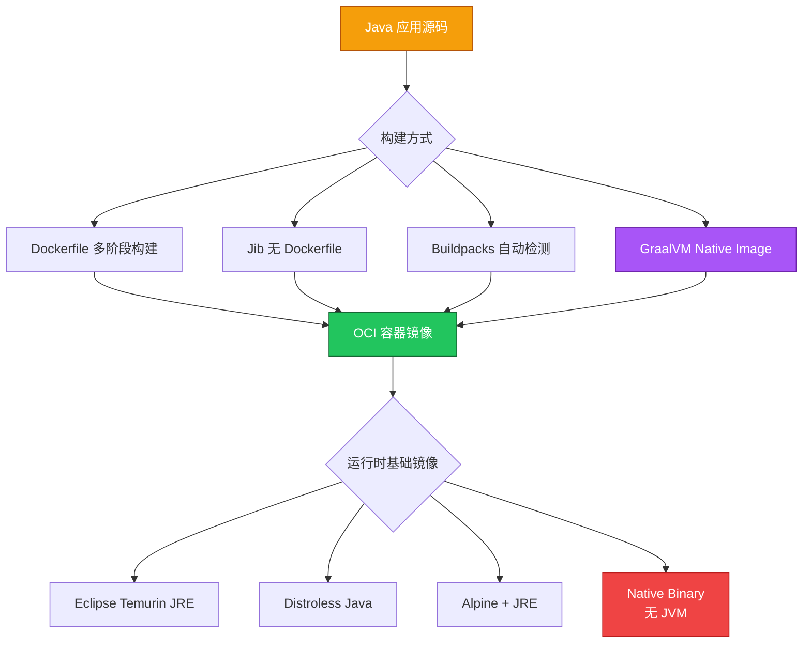
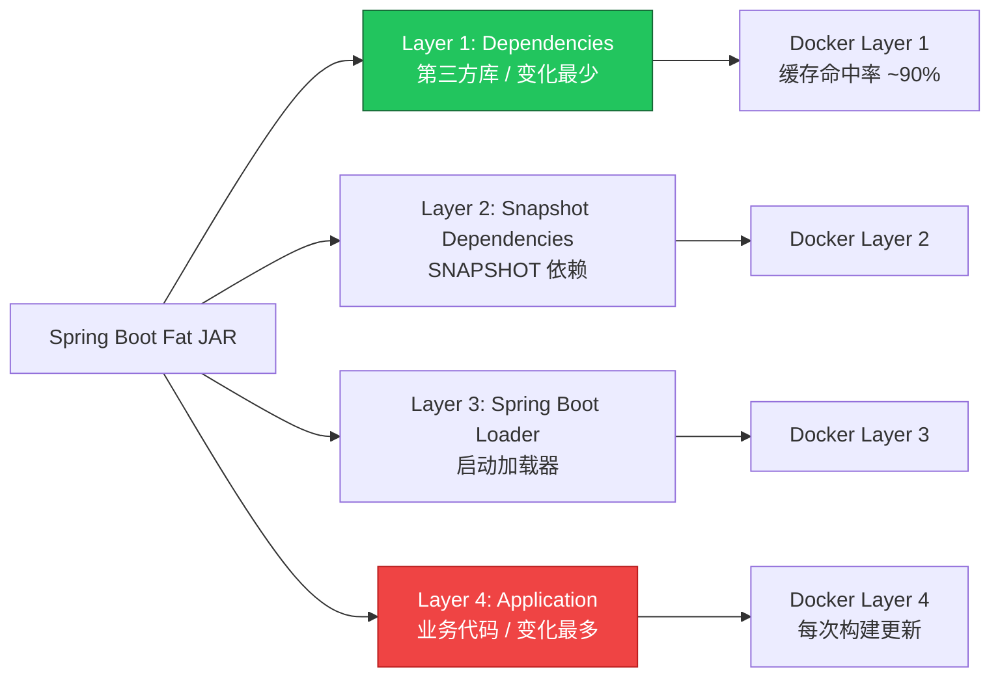

# Java 应用容器化最佳实践指南

> **适用版本**: Docker 24+ / Podman 5+ / Buildah 1.35+  
> **最后更新**: 2026-04-30  
> **难度**: 中级

---

<!-- chunk: 📋 目录 -->## 📋 目录

- [一、Java 容器化架构全景](#一java-容器化架构全景)
- [二、基础镜像选型](#二基础镜像选型)
- [三、多阶段构建](#三多阶段构建)
- [四、Dockerfile 生产级模板](#四dockerfile-生产级模板)
- [五、Spring Boot 分层 JAR 优化](#五spring-boot-分层-jar-优化)
- [六、Jib 无 Dockerfile 构建](#六jib-无-dockerfile-构建)
- [七、Buildpacks 自动构建](#七buildpacks-自动构建)
- [八、镜像瘦身策略](#八镜像瘦身策略)
- [九、多架构构建](#九多架构构建)
- [十、安全加固](#十安全加固)
- [十一、CI/CD 集成](#十一cicd-集成)

---

<!-- chunk: 一、Java 容器化架构全景 -->## 一、Java 容器化架构全景



#<!-- chunk: 1.1 Java 容器化核心原则 -->## 1.1 Java 容器化核心原则

| 原则 | 说明 |
|------|------|
| **JRE 而非 JDK** | 生产镜像仅包含 JRE，不携带编译器、调试工具 |
| **多阶段构建** | 编译阶段用 JDK，运行阶段用 JRE-only 镜像 |
| **非 root 运行** | Java 进程以非 root 用户运行 |
| **单进程模型** | 容器内仅运行一个 Java 进程 (PID 1) |
| **无状态设计** | 本地磁盘仅作临时存储，状态外置 |
| **快速启动** | 优化类加载、使用 CDS/AppCDS、分层 JAR |

---

<!-- chunk: 二、基础镜像选型 -->## 二、基础镜像选型

#<!-- chunk: 2.1 基础镜像对比 -->## 2.1 基础镜像对比

| 镜像 | 大小 | 安全性 | 调试能力 | 推荐场景 |
|------|------|--------|---------|---------|
| `eclipse-temurin:21-jdk` | ~450MB | 一般 | 完整 | 开发/调试 |
| `eclipse-temurin:21-jre` | ~220MB | 一般 | 有限 | 传统生产部署 |
| `eclipse-temurin:21-jre-alpine` | ~85MB | 一般 | 有限 | 体积敏感场景 |
| `gcr.io/distroless/java21-debian12` | ~180MB | 优秀 | 无 shell | 高安全要求 |
| `gcr.io/distroless/java21-debian12:nonroot` | ~180MB | 极佳 | 无 shell | 零信任环境 |
| `cgr.dev/chainguard/jre` | ~65MB | 极佳 | 无 shell | 安全优先生产 |
| `scratch` + Native Binary | ~50-80MB | 极佳 | 无 | GraalVM 原生镜像 |

```bash
# 对比各镜像大小
docker images --format "{{.Repository}}:{{.Tag}}\t{{.Size}}" | grep -E "temurin|distroless|chainguard"
```

#<!-- chunk: 2.2 JDK vs JRE 决策树 -->## 2.2 JDK vs JRE 决策树

```
需要 javac、jdb、jcmd 等工具？ ─── 是 ──→ 使用 JDK 镜像
  │                                         (仅限开发/调试)
  否
  │
需要 shell 进入容器排查？ ─── 是 ──→ eclipse-temurin:21-jre
  │                                      或 alpine 版本
  否
  │
安全要求极高？ ─── 是 ──→ distroless / chainguard
  │                          (无 shell，无包管理器)
  否
  │
体积敏感？ ─── 是 ──→ temurin:21-jre-alpine
  │
  否 ──→ eclipse-temurin:21-jre (默认选择)
```

---

<!-- chunk: 三、多阶段构建 -->## 三、多阶段构建

#<!-- chunk: 3.1 Maven 多阶段 Dockerfile -->## 3.1 Maven 多阶段 Dockerfile

```dockerfile
# ========== Stage 1: 构建 ==========
FROM eclipse-temurin:21-jdk AS builder

WORKDIR /build

# 先复制依赖定义文件，利用 Docker 缓存层
COPY pom.xml .
# 下载依赖（依赖不变时此层可缓存）
COPY .mvn/ .mvn/
COPY mvnw .
RUN ./mvnw dependency:go-offline -B

# 复制源码并构建
COPY src ./src
RUN ./mvnw package -DskipTests -B \
    && java -Djarmode=layertools -jar target/*.jar extract --destination extracted

# ========== Stage 2: 运行 ==========
FROM eclipse-temurin:21-jre

# 创建非 root 用户
RUN groupadd -r appuser && useradd -r -g appuser -d /app -s /sbin/nologin appuser

WORKDIR /app

# 复制分层提取的文件（利用 Spring Boot 分层 JAR）
COPY --from=builder /build/extracted/dependencies/ ./
COPY --from=builder /build/extracted/spring-boot-loader/ ./
COPY --from=builder /build/extracted/snapshot-dependencies/ ./
COPY --from=builder /build/extracted/application/ ./

# 设置 JVM 参数
ENV JAVA_OPTS="-XX:+UseContainerSupport \
               -XX:MaxRAMPercentage=75.0 \
               -XX:+UseG1GC \
               -XX:MaxGCPauseMillis=200 \
               -Djava.security.egd=file:/dev/./urandom"

EXPOSE 8080

USER appuser

ENTRYPOINT ["sh", "-c", "java $JAVA_OPTS org.springframework.boot.loader.launch.JarLauncher"]
```

#<!-- chunk: 3.2 Gradle 多阶段 Dockerfile -->## 3.2 Gradle 多阶段 Dockerfile

```dockerfile
# ========== Stage 1: 构建 ==========
FROM eclipse-temurin:21-jdk AS builder

WORKDIR /build

COPY build.gradle.kts settings.gradle.kts ./
COPY gradle/ gradle/
COPY gradlew .
RUN ./gradlew dependencies --no-daemon || true

COPY src ./src
RUN ./gradlew bootJar --no-daemon -x test \
    && java -Djarmode=layertools -jar build/libs/*.jar extract --destination extracted

# ========== Stage 2: 运行 ==========
FROM eclipse-temurin:21-jre-alpine

RUN addgroup -S appgroup && adduser -S appuser -G appgroup

WORKDIR /app

COPY --from=builder /build/extracted/dependencies/ ./
COPY --from=builder /build/extracted/spring-boot-loader/ ./
COPY --from=builder /build/extracted/snapshot-dependencies/ ./
COPY --from=builder /build/extracted/application/ ./

ENV JAVA_OPTS="-XX:+UseContainerSupport \
               -XX:MaxRAMPercentage=75.0 \
               -XX:+UseG1GC"

EXPOSE 8080

USER appuser

ENTRYPOINT ["sh", "-c", "java $JAVA_OPTS org.springframework.boot.loader.launch.JarLauncher"]
```

#<!-- chunk: 3.3 Distroless 安全版本 -->## 3.3 Distroless 安全版本

```dockerfile
FROM eclipse-temurin:21-jdk AS builder

WORKDIR /build
COPY . .
RUN ./mvnw package -DskipTests -B \
    && java -Djarmode=layertools -jar target/*.jar extract --destination extracted

# Distroless: 无 shell、无包管理器、极小攻击面
FROM gcr.io/distroless/java21-debian12:nonroot

WORKDIR /app

COPY --from=builder /build/extracted/dependencies/ ./
COPY --from=builder /build/extracted/spring-boot-loader/ ./
COPY --from=builder /build/extracted/snapshot-dependencies/ ./
COPY --from=builder /build/extracted/application/ ./

EXPOSE 8080

USER nonroot:nonroot

ENTRYPOINT ["java", \
            "-XX:+UseContainerSupport", \
            "-XX:MaxRAMPercentage=75.0", \
            "-XX:+UseG1GC", \
            "org.springframework.boot.loader.launch.JarLauncher"]
```

> **注意**: Distroless 镜像无 shell，无法使用 `kubectl exec -it -- sh` 进入容器。排查时需使用 `kubectl exec -- java -XX:...` 或 `kubectl debug` 附加调试容器。

---

<!-- chunk: 四、Dockerfile 生产级模板 -->## 四、Dockerfile 生产级模板

#<!-- chunk: 4.1 完整生产级 Dockerfile -->## 4.1 完整生产级 Dockerfile

```dockerfile
# ========== 构建元信息 ==========
# syntax=docker/dockerfile:1.4

# ========== Stage 1: 构建 ==========
FROM eclipse-temurin:21-jdk AS builder

ARG APP_VERSION=0.0.1-SNAPSHOT
ARG BUILD_DATE

WORKDIR /build

# 依赖缓存层
COPY pom.xml .
COPY .mvn/ .mvn/
COPY mvnw .
RUN --mount=type=cache,target=/root/.m2/repository \
    ./mvnw dependency:go-offline -B

# 构建应用
COPY src ./src
RUN --mount=type=cache,target=/root/.m2/repository \
    ./mvnw package -DskipTests -B \
    -Dproject.build.sourceEncoding=UTF-8 \
    && java -Djarmode=layertools -jar target/*.jar extract --destination extracted

# ========== Stage 2: 运行 ==========
FROM eclipse-temurin:21-jre

# OCI 标准标签
ARG APP_VERSION
ARG BUILD_DATE
ARG VCS_REF
LABEL org.opencontainers.image.title="my-spring-app" \
      org.opencontainers.image.version="${APP_VERSION}" \
      org.opencontainers.image.created="${BUILD_DATE}" \
      org.opencontainers.image.revision="${VCS_REF}" \
      org.opencontainers.image.source="https://github.com/org/my-spring-app"

# 安全: 非 root 用户
RUN groupadd -r appuser -g 1001 && \
    useradd -r -u 1001 -g appuser -d /app -s /sbin/nologin appuser

WORKDIR /app

# 分层复制
COPY --from=builder /build/extracted/dependencies/ ./
COPY --from=builder /build/extracted/spring-boot-loader/ ./
COPY --from=builder /build/extracted/snapshot-dependencies/ ./
COPY --from=builder /build/extracted/application/ ./

# 健康检查
HEALTHCHECK --interval=30s --timeout=3s --start-period=60s --retries=3 \
    CMD curl -f http://localhost:8080/actuator/health/readiness || exit 1

# JVM 参数
ENV JAVA_OPTS="-XX:+UseContainerSupport \
               -XX:MaxRAMPercentage=75.0 \
               -XX:+UseG1GC \
               -XX:MaxGCPauseMillis=200 \
               -XX:+HeapDumpOnOutOfMemoryError \
               -XX:HeapDumpPath=/tmp/heapdump.hprof \
               -XX:+CrashOnOutOfMemoryError \
               -Djava.security.egd=file:/dev/./urandom \
               -Dfile.encoding=UTF-8 \
               -Duser.timezone=Asia/Shanghai"

EXPOSE 8080
VOLUME /tmp

USER appuser

ENTRYPOINT ["sh", "-c", "java $JAVA_OPTS org.springframework.boot.loader.launch.JarLauncher"]
```

#<!-- chunk: 4.2 .dockerignore 文件 -->## 4.2 .dockerignore 文件

```
# 版本控制
.git
.gitignore

# IDE
.idea/
*.iml
.vscode/
.settings/
.classpath
.project

# 构建产物
target/
build/
out/

# 日志和临时文件
*.log
*.tmp

# 环境配置
.env
.env.*

# 文档
*.md
docs/

# 测试
test-results/
coverage/

# OS 文件
.DS_Store
Thumbs.db
```

---

<!-- chunk: 五、Spring Boot 分层 JAR 优化 -->## 五、Spring Boot 分层 JAR 优化

#<!-- chunk: 5.1 分层原理 -->## 5.1 分层原理



#<!-- chunk: 5.2 启用分层 (Spring Boot 3.x) -->## 5.2 启用分层 (Spring Boot 3.x)

```yaml
# pom.xml
<plugin>
    <groupId>org.springframework.boot</groupId>
    <artifactId>spring-boot-maven-plugin</artifactId>
    <configuration>
        <layers>
            <enabled>true</enabled>
        </layers>
    </configuration>
</plugin>
```

```groovy
// build.gradle.kts
tasks.bootJar {
    layeredMode.set(org.springframework.boot.loader.tools.LayeredMode.INCLUSIVE)
}
```

#<!-- chunk: 5.3 自定义分层配置 -->## 5.3 自定义分层配置

```xml
<!-- layers.xml -->
<layers xmlns="http://www.springframework.org/schema/boot/layers"
        xmlns:xsi="http://www.w3.org/2001/XMLSchema-instance"
        xsi:schemaLocation="http://www.springframework.org/schema/boot/layers
        https://www.springframework.org/schema/boot/layers/layers.xsd">
    <application>
        <into-layer>spring-boot-loader">
            <include>org/springframework/boot/loader/**</include>
        </into-layer>
        <into-layer>application">
            <include>com/mycompany/**</include>
        </into-layer>
    </application>
    <dependencies>
        <into-layer>snapshot-dependencies">
            <include>*:*:*SNAPSHOT</include>
        </into-layer>
        <into-layer>dependencies">
            <include>*:*</include>
        </into-layer>
    </dependencies>
    <layerOrder>
        <layer>dependencies</layer>
        <layer>spring-boot-loader</layer>
        <layer>snapshot-dependencies</layer>
        <layer>application</layer>
    </layerOrder>
</layers>
```

---

<!-- chunk: 六、Jib 无 Dockerfile 构建 -->## 六、Jib 无 Dockerfile 构建

#<!-- chunk: 6.1 Maven 配置 -->## 6.1 Maven 配置

```xml
<plugin>
    <groupId>com.google.cloud.tools</groupId>
    <artifactId>jib-maven-plugin</artifactId>
    <version>3.4.4</version>
    <configuration>
        <from>
            <image>eclipse-temurin:21-jre-alpine</image>
            <platforms>
                <platform>
                    <architecture>amd64</architecture>
                    <os>linux</os>
                </platform>
                <platform>
                    <architecture>arm64</architecture>
                    <os>linux</os>
                </platform>
            </platforms>
        </from>
        <to>
            <image>registry.example.com/${project.artifactId}:${project.version}</image>
            <tags>
                <tag>latest</tag>
                <tag>${git.commit.sha}</tag>
            </tags>
        </to>
        <container>
            <mainClass>com.example.Application</mainClass>
            <jvmFlags>
                <jvmFlag>-XX:+UseContainerSupport</jvmFlag>
                <jvmFlag>-XX:MaxRAMPercentage=75.0</jvmFlag>
                <jvmFlag>-XX:+UseG1GC</jvmFlag>
                <jvmFlag>-XX:MaxGCPauseMillis=200</jvmFlag>
                <jvmFlag>-Djava.security.egd=file:/dev/./urandom</jvmFlag>
            </jvmFlags>
            <ports>
                <port>8080</port>
                <port>8443</port>
            </ports>
            <creationTime>USE_CURRENT_TIMESTAMP</creationTime>
            <format>OCI</format>
            <user>1001:1001</user>
            <labels>
                <org.opencontainers.image.title>${project.name}</org.opencontainers.image.title>
                <org.opencontainers.image.version>${project.version}</org.opencontainers.image.version>
            </labels>
        </container>
    </configuration>
</plugin>
```

#<!-- chunk: 6.2 Gradle Kotlin DSL 配置 -->## 6.2 Gradle Kotlin DSL 配置

```kotlin
plugins {
    id("com.google.cloud.tools.jib") version "3.4.4"
}

jib {
    from {
        image = "eclipse-temurin:21-jre-alpine"
        platforms {
            platform {
                architecture = "amd64"
                os = "linux"
            }
            platform {
                architecture = "arm64"
                os = "linux"
            }
        }
    }
    to {
        image = "registry.example.com/${project.name}:${project.version}"
        tags = setOf("latest")
    }
    container {
        mainClass = "com.example.Application"
        jvmFlags = listOf(
            "-XX:+UseContainerSupport",
            "-XX:MaxRAMPercentage=75.0",
            "-XX:+UseG1GC"
        )
        ports = listOf("8080")
        creationTime = "USE_CURRENT_TIMESTAMP"
        format = com.google.cloud.tools.jib.api.buildplan.ImageFormat.OCI
        user = "1001:1001"
    }
}
```

#<!-- chunk: 6.3 构建命令 -->## 6.3 构建命令

```bash
# 构建到 Docker daemon
./mvnw compile jib:dockerBuild

# 构建并推送到远程 registry (无需本地 Docker)
./mvnw compile jib:build

# 构建 tar 文件
./mvnw compile jib:buildTar

# Gradle
./gradlew jibDockerBuild
./gradlew jib
./gradlew jibBuildTar
```

---

<!-- chunk: 七、Buildpacks 自动构建 -->## 七、Buildpacks 自动构建

#<!-- chunk: 7.1 Paketo Buildpacks -->## 7.1 Paketo Buildpacks

```bash
# 使用 pack CLI 构建
pack build registry.example.com/my-spring-app:v1.0.0 \
    --builder paketobuildpacks/builder-jammy-base:latest \
    --env BP_JVM_VERSION=21 \
    --env BP_SPRING_CLOUD_BINDINGS_ENABLED=true \
    --env BPE_SPRING_PROFILES_ACTIVE=production \
    --env BP_OCI_AUTHORS=devops@example.com

# 查看构建的镜像层
pack inspect registry.example.com/my-spring-app:v1.0.0
```

#<!-- chunk: 7.2 K8s 集成 (Tekton + Buildpacks) -->## 7.2 K8s 集成 (Tekton + Buildpacks)

```yaml
apiVersion: tekton.dev/v1
kind: Task
metadata:
  name: buildpacks-java
spec:
  params:
    - name: IMAGE
      description: 镜像地址
    - name: SOURCE_SUBPATH
      default: ""
  workspaces:
    - name: source
  steps:
    - name: build
      image: buildpacksio/pack:latest
      args:
        - build
        - $(params.IMAGE)
        - --builder
        - paketobuildpacks/builder-jammy-base:latest
        - --path
        - $(workspaces.source.path)/$(params.SOURCE_SUBPATH)
        - --env
        - BP_JVM_VERSION=21
        - --env
        - BP_SPRING_CLOUD_BINDINGS_ENABLED=true
```

---

<!-- chunk: 八、镜像瘦身策略 -->## 八、镜像瘦身策略

#<!-- chunk: 8.1 瘦身技巧对比 -->## 8.1 瘦身技巧对比

| 策略 | 镜像大小缩减 | 复杂度 | 适用场景 |
|------|-------------|--------|---------|
| JDK → JRE | ~45% | 低 | 所有 Java 应用 |
| Alpine 基础镜像 | ~60% | 低 | 无 JNI 依赖的应用 |
| Distroless | ~55% | 中 | 高安全要求 |
| Spring Boot 分层 JAR | 不减大小，加速部署 | 低 | 频繁部署应用 |
| GraalVM Native Image | ~80% | 高 | 启动敏感/Serverless |
| AppCDS (类共享) | 不减大小，加速启动 | 中 | 大型应用 |
| jlink 定制 JRE | ~30% 额外缩减 | 中 | 精简运行时 |

#<!-- chunk: 8.2 jlink 定制 JRE -->## 8.2 jlink 定制 JRE

```dockerfile
FROM eclipse-temurin:21-jdk AS jre-builder

# 创建最小化 JRE
RUN jlink \
    --add-modules java.base,java.desktop,java.instrument,java.management,java.naming,java.net.http,java.rmi,java.scripting,java.security.jgss,java.sql,java.transaction.xa,jdk.crypto.ec,jdk.unsupported,jdk.management.agent \
    --strip-debug \
    --no-man-pages \
    --no-header-files \
    --compress=2 \
    --output /custom-jre

FROM ubuntu:22.04

COPY --from=jre-builder /custom-jre /opt/java/openjdk
COPY target/*.jar /app/app.jar

ENV PATH="/opt/java/openjdk/bin:${PATH}"
ENV JAVA_HOME="/opt/java/openjdk"

RUN groupadd -r appuser && useradd -r -g appuser appuser
USER appuser

ENTRYPOINT ["java", "-jar", "/app/app.jar"]
```

---

<!-- chunk: 九、多架构构建 -->## 九、多架构构建

#<!-- chunk: 9.1 Docker Buildx 多架构 -->## 9.1 Docker Buildx 多架构

```bash
# 创建多架构构建器
docker buildx create --name multiarch --use

# 构建并推送多架构镜像
docker buildx build --push \
    --platform linux/amd64,linux/arm64 \
    --build-arg APP_VERSION=v1.0.0 \
    --build-arg BUILD_DATE=$(date -u +"%Y-%m-%dT%H:%M:%SZ") \
    -t registry.example.com/my-spring-app:v1.0.0 \
    .
```

#<!-- chunk: 9.2 Jib 多架构 -->## 9.2 Jib 多架构

Jib 在 `configuration>from>platforms` 中配置多架构，构建时自动生成 manifest list。

#<!-- chunk: 9.3 ARM64 注意事项 -->## 9.3 ARM64 注意事项

```bash
# 验证镜像架构
docker manifest inspect registry.example.com/my-spring-app:v1.0.0 | \
    jq '.manifests[] | {platform: .platform.os + "/" + .platform.architecture, digest: .digest}'

# 测试 ARM64 镜像 (在 AMD64 主机上使用 QEMU)
docker run --rm --platform linux/arm64 registry.example.com/my-spring-app:v1.0.0 \
    java -version
```

---

<!-- chunk: 十、安全加固 -->## 十、安全加固

#<!-- chunk: 10.1 容器安全检查清单 -->## 10.1 容器安全检查清单

| 检查项 | 命令/方法 | 状态 |
|--------|----------|------|
| 非 root 运行 | `USER appuser` | ☐ |
| 只读文件系统 | `securityContext.readOnlyRootFilesystem: true` | ☐ |
| 禁用特权 | `securityContext.allowPrivilegeEscalation: false` | ☐ |
| 固定基础镜像版本 | `eclipse-temurin:21.0.3_9-jre` 而非 `latest` | ☐ |
| 无不必要的包 | Distroless 或 Alpine | ☐ |
| 镜像签名 | `cosign sign` | ☐ |
| 漏洞扫描 | `trivy image` / `grype` | ☐ |

#<!-- chunk: 10.2 K8s SecurityContext -->## 10.2 K8s SecurityContext

```yaml
apiVersion: apps/v1
kind: Deployment
metadata:
  name: my-spring-app
spec:
  template:
    spec:
      securityContext:
        runAsNonRoot: true
        runAsUser: 1001
        runAsGroup: 1001
        fsGroup: 1001
        seccompProfile:
          type: RuntimeDefault
      containers:
        - name: app
          image: registry.example.com/my-spring-app:v1.0.0
          securityContext:
            allowPrivilegeEscalation: false
            readOnlyRootFilesystem: true
            capabilities:
              drop:
                - ALL
          volumeMounts:
            - name: tmp
              mountPath: /tmp
            - name: app-logs
              mountPath: /var/log/app
      volumes:
        - name: tmp
          emptyDir: {}
        - name: app-logs
          emptyDir: {}
```

---

<!-- chunk: 十一、CI/CD 集成 -->## 十一、CI/CD 集成

#<!-- chunk: 11.1 GitHub Actions -->## 11.1 GitHub Actions

```yaml
name: Build Java Container
on:
  push:
    branches: [main]
jobs:
  build:
    runs-on: ubuntu-latest
    steps:
      - uses: actions/checkout@v4

      - uses: actions/setup-java@v4
        with:
          java-version: '21'
          distribution: 'temurin'
          cache: 'maven'

      - name: Run Tests
        run: ./mvnw verify -B

      - name: Build Container with Jib
        run: ./mvnw compile jib:build
        env:
          REGISTRY_USERNAME: ${{ secrets.REGISTRY_USERNAME }}
          REGISTRY_PASSWORD: ${{ secrets.REGISTRY_PASSWORD }}
```

#<!-- chunk: 11.2 漏洞扫描集成 -->## 11.2 漏洞扫描集成

```bash
# Trivy 扫描
trivy image --severity HIGH,CRITICAL registry.example.com/my-spring-app:v1.0.0

# Grype 扫描
grype registry.example.com/my-spring-app:v1.0.0

# SBOM 生成
syft registry.example.com/my-spring-app:v1.0.0 -o spdx-json > sbom.json

# 签名
cosign sign --key cosign.key registry.example.com/my-spring-app:v1.0.0
```

---

<!-- chunk: 📊 选型决策矩阵 -->## 📊 选型决策矩阵

| 场景 | 推荐方案 | 原因 |
|------|---------|------|
| Spring Boot 传统应用 | Jib + temurin-jre | 零 Dockerfile、分层缓存、多架构 |
| 高安全要求 | Distroless + Jib | 无 shell、最小攻击面 |
| 体积敏感 | Alpine + jlink | 最小运行时 |
| 启动敏感 / Serverless | GraalVM Native Image | 毫秒级启动、最小内存 |
| CI/CD 简化 | Buildpacks | 自动检测、零配置 |
| 大型企业 | 多阶段 Dockerfile | 最大灵活性、可控性 |

---

<!-- chunk: 🔗 相关文档 -->## 🔗 相关文档

- [Jib 详细配置](./10-image-build-tools.md) — Java 应用快速构建工具
- [JVM GC 容器调优](../domain-10-troubleshooting-diagnostics/99-jvm-gc-container-tuning-guide.md) — GC 算法选择与参数优化
- [Spring Boot on K8s](../domain-02-workloads-applications/99-spring-boot-kubernetes-guide.md) — Spring Boot K8s 部署最佳实践
- [GraalVM Native Image](../domain-15-specialized-tech/99-graalvm-native-image-guide.md) — 原生编译指南
- [Docker 性能监控](./09-docker-performance-monitoring.md) — 容器性能分析方法

---

<!-- chunk: Obsidian 相关文档 -->## Obsidian 相关文档

- [[domain-13-container-runtime/MOC.md|domain-13-container-runtime MOC]]
- [[domain-13-container-runtime/README.md|Docker 容器技术深度解析]]
- [[domain-13-container-runtime/00-open-source-projects-index.md|Domain-13 Docker — 开源项目索引]]
- [[domain-13-container-runtime/01-docker-architecture-overview.md|Docker 架构概述与核心概念]]
- [[domain-13-container-runtime/02-docker-images-management.md|Docker 镜像管理详解]]
- [[domain-13-container-runtime/03-docker-container-lifecycle.md|Docker 容器生命周期管理]]
- [[domain-13-container-runtime/04-docker-networking-deep-dive.md|Docker 网络深度解析]]
- [[domain-13-container-runtime/05-docker-storage-volumes.md|Docker 存储与数据卷]]
- [[domain-13-container-runtime/06-docker-compose-orchestration.md|Docker Compose 编排]]
- [[domain-13-container-runtime/07-docker-security-best-practices.md|Docker 安全最佳实践]]
- [[domain-13-container-runtime/08-docker-troubleshooting-guide.md|Docker 故障排查指南]]
- [[domain-13-container-runtime/09-docker-performance-monitoring.md|Docker 性能监控与调优]]

## See Also

- [[domain-13-container-runtime/10-docker-logging-management.md|10-docker-logging-management]]
- [[domain-13-container-runtime/11-docker-automation-devops.md|11-docker-automation-devops]]
- [[domain-13-container-runtime/99-docker-commands-reference.md|99-docker-commands-reference]]
- [[domain-13-container-runtime/01-docker-architecture-overview.md|01-docker-architecture-overview]]

## Related

- [[domain-19-landscape-references/topic-index/etcd-index|etcd 知识图谱索引]]
