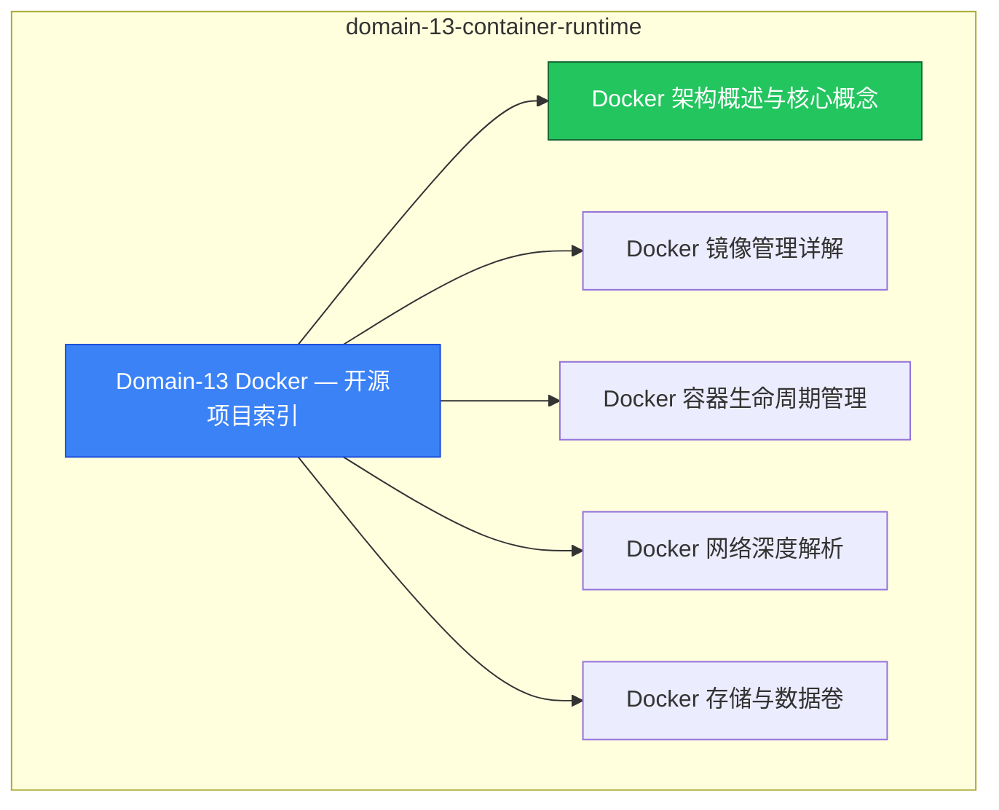

# domain-13-[[docker]] MOC

> **MOC 版本**: 1.0
> **知识域**: domain-13-container-runtime
> **文档数量**: 14 篇
> **最后更新**: 2026-05-21
> **用途**: 本知识域的导航入口，汇总所有相关文档、关联领域、和场景入口

---

## 领域概述

Docker — 容器运行时、镜像构建、Docker Compose、最佳实践

### 知识域定位

| 维度 | 说明 |
|---|---|
| **知识域** | domain-13-container-runtime |
| **文档数量** | 14 篇 |
| **难度分布** | 入门 0 / 进阶 0 / 高级 0 / 专家 0 |

---

## 文档清单

| # | 文档 | 难度 | 标签 | 估计阅读时间 |
|---|---|---|---|---|
| 1 | [[domain-13-container-runtime/00-open-source-projects-index.md|Domain-13 Docker — 开源项目索引]] |  | docker, container, best-practice |  |
| 2 | [[domain-13-container-runtime/01-docker-architecture-overview.md|Docker 架构概述与核心概念]] |  | docker, container, best-practice |  |
| 3 | [[domain-13-container-runtime/02-docker-images-management.md|Docker 镜像管理详解]] |  | docker, container, best-practice |  |
| 4 | [[domain-13-container-runtime/03-docker-container-lifecycle.md|Docker 容器生命周期管理]] |  | docker, container, best-practice |  |
| 5 | [[domain-13-container-runtime/04-docker-networking-deep-dive.md|Docker 网络深度解析]] |  | docker, container, best-practice |  |
| 6 | [[domain-13-container-runtime/05-docker-storage-volumes.md|Docker 存储与数据卷]] |  | docker, container, best-practice |  |
| 7 | [[domain-13-container-runtime/06-docker-compose-orchestration.md|Docker Compose 编排]] |  | docker, container, best-practice |  |
| 8 | [[domain-13-container-runtime/07-docker-security-best-practices.md|Docker 安全最佳实践]] |  | docker, container, best-practice |  |
| 9 | [[domain-13-container-runtime/08-docker-troubleshooting-guide.md|Docker 故障排查指南]] |  | docker, container, best-practice |  |
| 10 | [[domain-13-container-runtime/09-docker-performance-monitoring.md|Docker 性能监控与调优]] |  | docker, container, best-practice |  |
| 11 | [[domain-13-container-runtime/10-docker-logging-management.md|Docker 日志管理与分析]] |  | docker, container, best-practice |  |
| 12 | [[domain-13-container-runtime/11-docker-automation-devops.md|Docker 自动化运维与CI/CD集成]] |  | docker, container, best-practice |  |
| 13 | [[domain-13-container-runtime/12-java-containerization-guide.md|Java 应用容器化最佳实践指南]] |  | docker, container, best-practice |  |
| 14 | [[domain-13-container-runtime/99-docker-commands-reference.md|Docker 命令大全参考]] |  | docker, container, best-practice |  |

---

## 知识图谱

---

## 关联入口

| 入口 | 说明 |
|---|---|
| [[../domain-10-troubleshooting-diagnostics/topic-fta/MOC.md|FTA 故障树]] | domain-13-container-runtime 相关故障树分析 |
| [[../domain-10-troubleshooting-diagnostics/topic-skills/MOC.md|Skills 技能]] | domain-13-container-runtime 相关操作技能 |
| [[../domain-19-landscape-references/topic-index/README.md|深度研究入口]] | 语料库索引与向量检索 |

---

## 统计信息

| 指标 | 数值 |
|---|---|
| 文档总数 | 14 |
| 覆盖 K8s 版本 | v1.25 - v1.32 |

---

*本文档由 scripts/generate-mocs.py 自动生成，最后更新 2026-05-21。*

## Related

- [[docker]]
