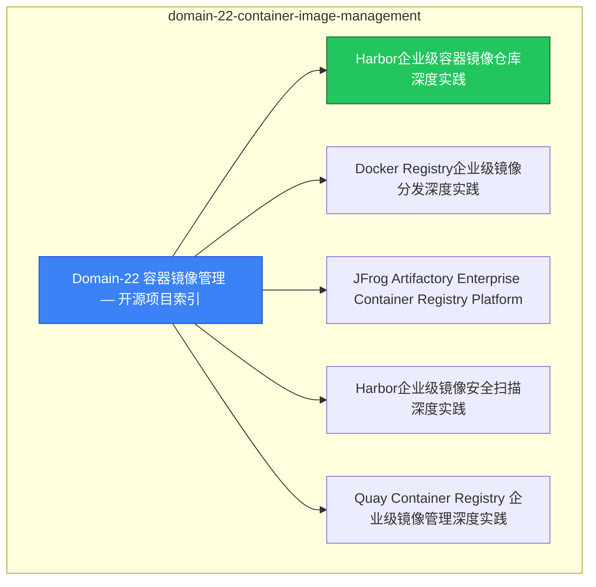

# domain-22-container-image-management MOC

> **MOC 版本**: 1.0
> **知识域**: domain-22-container-image-management
> **文档数量**: 9 篇
> **最后更新**: 2026-05-21
> **用途**: 本知识域的导航入口，汇总所有相关文档、关联领域、和场景入口

---

## 领域概述

容器镜像管理 — 镜像构建、安全扫描、分发

### 知识域定位

| 维度 | 说明 |
|---|---|
| **知识域** | domain-22-container-image-management |
| **文档数量** | 9 篇 |
| **难度分布** | 入门 0 / 进阶 0 / 高级 0 / 专家 0 |

---

## 文档清单

| # | 文档 | 难度 | 标签 | 估计阅读时间 |
|---|---|---|---|---|
| 1 | [[domain-13-container-runtime/00-open-source-projects-index.md|Domain-22 容器镜像管理 — 开源项目索引]] |  | docker, image, security |  |
| 2 | [[domain-13-container-runtime/01-harbor-enterprise-image-registry.md|Harbor企业级容器镜像仓库深度实践]] |  | docker, image, security |  |
| 3 | [[domain-13-container-runtime/02-docker-registry-enterprise-distribution.md|Docker Registry企业级镜像分发深度实践]] |  | docker, image, security |  |
| 4 | [[domain-13-container-runtime/03-jfrog-artifactory-enterprise.md|JFrog Artifactory Enterprise Container Registry Platform]] |  | docker, image, security |  |
| 5 | [[domain-13-container-runtime/04-harbor-enterprise-security-scanning.md|Harbor企业级镜像安全扫描深度实践]] |  | docker, image, security |  |
| 6 | [[domain-13-container-runtime/04-quay-enterprise-registry.md|Quay Container Registry 企业级镜像管理深度实践]] |  | docker, image, security |  |
| 7 | [[domain-13-container-runtime/05-gitlab-container-registry-enterprise.md|GitLab Container Registry Enterprise 深度实践]] |  | docker, image, security |  |
| 8 | [[domain-13-container-runtime/06-amazon-ecr-enterprise.md|Amazon ECR (Elastic Container Registry) Enterprise 深度实践]] |  | docker, image, security |  |
| 9 | [[domain-13-container-runtime/99-harbor-enterprise-guide.md|Harbor 企业级镜像仓库部署指南]] |  | docker, image, security |  |

---

## 知识图谱

---

## 关联入口

| 入口 | 说明 |
|---|---|
| [[../domain-10-troubleshooting-diagnostics/topic-fta/MOC.md|FTA 故障树]] | domain-22-container-image-management 相关故障树分析 |
| [[../domain-10-troubleshooting-diagnostics/topic-skills/MOC.md|Skills 技能]] | domain-22-container-image-management 相关操作技能 |
| [[../domain-19-landscape-references/topic-index/README.md|深度研究入口]] | 语料库索引与向量检索 |

---

## 统计信息

| 指标 | 数值 |
|---|---|
| 文档总数 | 9 |
| 覆盖 K8s 版本 | v1.25 - v1.32 |

---

*本文档由 scripts/generate-mocs.py 自动生成，最后更新 2026-05-21。*
