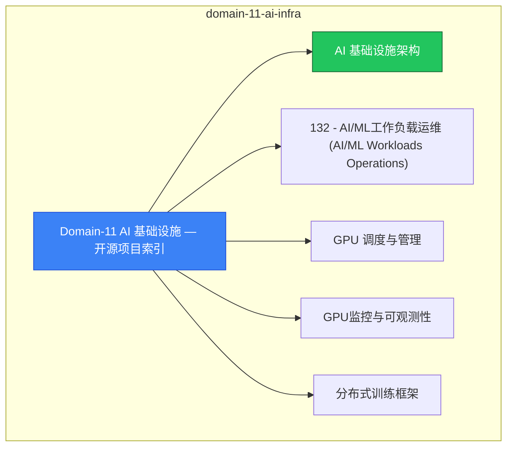

# domain-11-ai-infra MOC

> **MOC 版本**: 1.0
> **知识域**: domain-11-ai-infra
> **文档数量**: 39 篇
> **最后更新**: 2026-05-21
> **用途**: 本知识域的导航入口，汇总所有相关文档、关联领域、和场景入口

---

## 领域概述

AI 基础设施 — GPU 调度、CUDA、Model Serving、LLM 部署

### 知识域定位

| 维度 | 说明 |
|---|---|
| **知识域** | domain-11-ai-infra |
| **文档数量** | 39 篇 |
| **难度分布** | 入门 0 / 进阶 0 / 高级 3 / 专家 0 |

---

## 文档清单

| # | 文档 | 难度 | 标签 | 估计阅读时间 |
|---|---|---|---|---|
| 1 | [[domain-14-ai-ml-infra/00-open-source-projects-index.md|Domain-11 AI 基础设施 — 开源项目索引]] |  | k8s, ai, gpu |  |
| 2 | [[domain-14-ai-ml-infra/01-ai-infrastructure-overview.md|AI 基础设施架构]] | 高级 | k8s, ai, gpu | 5min |
| 3 | [[domain-14-ai-ml-infra/02-ai-ml-workloads.md|132 - AI/ML工作负载运维 (AI/ML Workloads Operations)]] |  | k8s, ai, gpu |  |
| 4 | [[domain-14-ai-ml-infra/03-gpu-scheduling-management.md|GPU 调度与管理]] | 高级 | k8s, gpu, nvidia | 5min |
| 5 | [[domain-14-ai-ml-infra/04-gpu-monitoring-dcgm.md|GPU监控与可观测性]] |  | k8s, ai, gpu |  |
| 6 | [[domain-14-ai-ml-infra/05-distributed-training-frameworks.md|分布式训练框架]] | 高级 | k8s, ai, distributed-training | 5min |
| 7 | [[domain-14-ai-ml-infra/06-ai-data-pipeline.md|AI数据处理Pipeline与特征工程]] |  | k8s, ai, gpu |  |
| 8 | [[domain-14-ai-ml-infra/07-ai-experiment-management.md|AI实验管理与MLOps平台]] |  | k8s, ai, gpu |  |
| 9 | [[domain-14-ai-ml-infra/08-automl-hyperparameter-tuning.md|AutoML与超参数调优]] |  | k8s, ai, gpu |  |
| 10 | [[domain-14-ai-ml-infra/09-model-registry.md|AI模型注册中心与版本管理]] |  | k8s, ai, gpu |  |
| 11 | [[domain-14-ai-ml-infra/10-model-deployment-management.md|AI模型部署与生命周期管理]] |  | k8s, ai, gpu |  |
| 12 | [[domain-14-ai-ml-infra/11-ai-security-model-protection.md|AI安全与模型保护]] |  | k8s, ai, gpu |  |
| 13 | [[domain-14-ai-ml-infra/12-ai-cost-analysis-finops.md|141 - AI成本分析与FinOps实践 (AI Cost Analysis & FinOps)]] |  | k8s, ai, gpu |  |
| 14 | [[domain-14-ai-ml-infra/13-ai-platform-observability.md|AI平台可观测性体系]] |  | k8s, ai, gpu |  |
| 15 | [[domain-14-ai-ml-infra/14-troubleshooting-performance.md|AI平台故障排查与性能优化]] |  | k8s, ai, gpu |  |
| 16 | [[domain-14-ai-ml-infra/15-llm-data-pipeline.md|142 - LLM训练数据Pipeline与管理 (LLM Data Pipeline & Management)]] |  | k8s, ai, gpu |  |
| 17 | [[domain-14-ai-ml-infra/16-llm-finetuning.md|143 - LLM微调技术与实践 (LLM Fine-tuning Techniques & Practices)]] |  | k8s, ai, gpu |  |
| 18 | [[domain-14-ai-ml-infra/17-llm-inference-serving.md|144 - LLM推理服务部署]] |  | k8s, ai, gpu |  |
| 19 | [[domain-14-ai-ml-infra/18-llm-serving-architecture.md|LLM模型Serving架构与推理优化]] |  | k8s, ai, gpu |  |
| 20 | [[domain-14-ai-ml-infra/19-llm-quantization.md|146 - LLM模型量化技术]] |  | k8s, ai, gpu |  |
| 21 | [[domain-14-ai-ml-infra/20-vector-database-rag.md|147 - 向量数据库与RAG架构]] |  | k8s, ai, gpu |  |
| 22 | [[domain-14-ai-ml-infra/21-multimodal-models.md|21 - 多模态模型融合与部署]] |  | k8s, ai, gpu |  |
| 23 | [[domain-14-ai-ml-infra/22-llm-privacy-security.md|LLM 隐私与安全]] |  | k8s, ai, gpu |  |
| 24 | [[domain-14-ai-ml-infra/23-llm-cost-monitoring.md|LLM 成本监控与 FinOps]] |  | k8s, ai, gpu |  |
| 25 | [[domain-14-ai-ml-infra/24-llm-model-versioning.md|24 - LLM模型版本管理与治理]] |  | k8s, ai, gpu |  |
| 26 | [[domain-14-ai-ml-infra/25-llm-observability.md|25 - LLM可观测性与监控体系]] |  | k8s, ai, gpu |  |
| 27 | [[domain-14-ai-ml-infra/26-cost-optimization-overview.md|26 - AI基础设施成本优化概览]] |  | k8s, ai, gpu |  |
| 28 | [[domain-14-ai-ml-infra/27-cost-management-kubecost.md|成本管理与 FinOps]] |  | k8s, ai, gpu |  |
| 29 | [[domain-14-ai-ml-infra/28-green-computing-sustainability.md|28 - AI绿色计算与可持续发展]] |  | k8s, ai, gpu |  |
| 30 | [[domain-14-ai-ml-infra/29-alibaba-cloud-integration.md|15 - 阿里云特定集成表]] |  | k8s, ai, gpu |  |
| 31 | [[domain-14-ai-ml-infra/30-ai-security-compliance.md|AI平台安全加固与合规]] |  | k8s, ai, gpu |  |
| 32 | [[domain-14-ai-ml-infra/31-ai-platform-governance.md|31 - AI平台治理框架]] |  | k8s, ai, gpu |  |
| 33 | [[domain-14-ai-ml-infra/32-mlops-pipeline.md|32 - MLOps端到端流水线]] |  | k8s, ai, gpu |  |
| 34 | [[domain-14-ai-ml-infra/33-model-explainability.md|33 - 模型可解释性与透明度]] |  | k8s, ai, gpu |  |
| 35 | [[domain-14-ai-ml-infra/34-federated-learning.md|34 - 联邦学习与分布式协同训练]] |  | k8s, ai, gpu |  |
| 36 | [[domain-14-ai-ml-infra/35-model-drift-monitoring.md|35 - 模型漂移监控与预警]] |  | k8s, ai, gpu |  |
| 37 | [[domain-14-ai-ml-infra/36-ai-platform-observability-enhanced.md|36 - AI平台增强可观测性]] |  | k8s, ai, gpu |  |
| 38 | [[domain-14-ai-ml-infra/37-agent-sandbox-security.md|AI Agent 沙箱安全架构]] |  | k8s, ai, gpu |  |
| 39 | [[domain-14-ai-ml-infra/99-kubeflow-ai-platform-guide.md|Kubeflow AI 平台部署与实践指南]] |  | k8s, ai, gpu |  |

---

## 知识图谱

---

## 关联入口

| 入口 | 说明 |
|---|---|
| [[../domain-10-troubleshooting-diagnostics/topic-fta/MOC.md|FTA 故障树]] | domain-11-ai-infra 相关故障树分析 |
| [[../domain-10-troubleshooting-diagnostics/topic-skills/MOC.md|Skills 技能]] | domain-11-ai-infra 相关操作技能 |
| [[../domain-19-landscape-references/topic-index/README.md|深度研究入口]] | 语料库索引与向量检索 |

---

## 统计信息

| 指标 | 数值 |
|---|---|
| 文档总数 | 39 |
| 覆盖 K8s 版本 | v1.25 - v1.32 |

---

*本文档由 scripts/generate-mocs.py 自动生成，最后更新 2026-05-21。*
