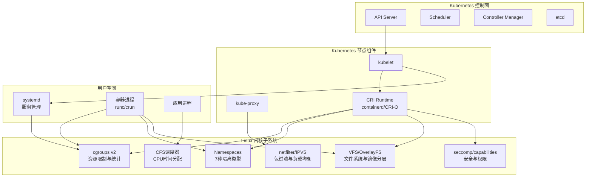

# Domain-14: Linux 基础知识体系

> **适用版本**: Linux Kernel 5.x/6.x | **最后更新**: 2026-02 | **文档数量**: 12

---

## 概述

Linux 基础知识体系为 Kubernetes 和容器化环境提供坚实的底层支撑。本域从生产环境运维专家视角，系统性地讲解 Linux 系统架构、进程管理、文件系统、网络配置、存储管理、性能调优、安全加固、容器技术和运维基础等核心主题。每个主题都深入到内核原理层面，同时结合 Kubernetes 场景阐述其实际应用，帮助运维人员建立从底层到上层的完整知识体系。

Linux 是 Kubernetes 运行的基础平台，理解 Linux 内核的工作机制对于排查集群问题至关重要。例如，当 Pod 出现 OOMKilled 时，需要理解 cgroups 的内存限制机制和 OOM Killer 的工作原理；当 Service 无法访问时，需要理解 iptables/IPVS 的包转发流程和网络命名空间的隔离机制；当容器 I/O 性能下降时，需要理解 OverlayFS 的写时复制机制和 I/O 调度器的行为。本域的每个文档都包含与 Kubernetes 的关联分析，帮助读者将 Linux 知识直接应用到 K8s 运维实践中。

### 为什么 Kubernetes 运维需要深入理解 Linux

Kubernetes 本质上是 Linux 内核特性的编排和管理层。它利用了 Linux 内核提供的 namespaces（进程/网络/文件系统隔离）、cgroups（资源限制和统计）、OverlayFS（容器镜像分层）、netfilter/iptables（Service负载均衡）、seccomp（系统调用过滤）和 capabilities（权限细分）等核心特性。不理解这些底层机制，就难以有效排查以下典型问题：

```yaml
Kubernetes问题与Linux根因映射:
  Pod_OOMKilled:
    Linux根因: cgroups memory.max 触发 OOM Killer
    排查工具: dmesg, journalctl -k, /proc/<pid>/cgroup
    参考文档: 02-进程管理, 06-性能调优
  
  Service_Cannot_Access:
    Linux根因: iptables/IPVS 规则异常或 conntrack 表满
    排查工具: iptables-save, ipvsadm -Ln, conntrack -L
    参考文档: 04-网络配置, 06-性能调优
  
  Container_IO_Slow:
    Linux根因: OverlayFS 写时复制或 I/O 调度器
    排查工具: iostat, fio, perf
    参考文档: 03-文件系统, 05-存储管理
  
  Node_NotReady:
    Linux根因: 内核参数、磁盘满、kubelet 崩溃
    排查工具: systemctl, journalctl, df -h
    参考文档: 01-系统架构, 09-运维基础
  
  CPU_Throttling:
    Linux根因: cgroups cpu.max CFS 配额耗尽
    排查工具: /sys/fs/cgroup/cpu.max, perf
    参考文档: 02-进程管理, 06-性能调优
  
  Security_Violation:
    Linux根因: SELinux/AppArmor 阻止容器操作
    排查工具: ausearch, dmesg, aa-status
    参考文档: 07-安全加固, 08-容器技术
```

---

## Linux-Kubernetes 关系深度解析

### K8s 如何映射到 Linux 内核特性

Kubernetes 的每个核心功能都直接映射到 Linux 内核特性。理解这种映射关系是高效运维 K8s 的关键。

```yaml
Kubernetes功能到Linux内核映射:
  Pod隔离:
    K8s功能: Pod内容器共享Network Namespace
    Linux特性: netns, ipcns, pidns (shareProcessID=true)
    关键文件: /proc/<pid>/ns/net, /proc/<pid>/ns/ipc
    排查命令: lsns -p <pid>, nsenter -t <pid> -n ip addr

  资源限制:
    K8s功能: resources.limits.cpu / resources.limits.memory
    Linux特性: cgroups v2 cpu.max, memory.max
    关键文件: /sys/fs/cgroup/kubepods.slice/.../cpu.max
    排查命令: cat /sys/fs/cgroup/.../memory.current

  服务发现:
    K8s功能: Service ClusterIP + kube-proxy
    Linux特性: iptables DNAT / IPVS 负载均衡
    关键文件: /proc/net/nf_conntrack
    排查命令: iptables -t nat -L KUBE-SERVICES, ipvsadm -Ln

  容器镜像:
    K8s功能: Container Image layers
    Linux特性: OverlayFS (lowerdir + upperdir)
    关键文件: /proc/mounts (overlay entries)
    排查命令: mount | grep overlay, docker inspect --format='{{.GraphDriver}}'

  网络策略:
    K8s功能: NetworkPolicy
    Linux特性: netfilter + iptables/nftables
    关键文件: /etc/iptables/rules.v4
    排查命令: iptables -L -n -v --line-numbers

  安全策略:
    K8s功能: SecurityContext (capabilities, seccomp, runAsNonRoot)
    Linux特性: Linux Capabilities, seccomp-bpf, user namespaces
    关键文件: /proc/<pid>/status (CapEff), /proc/<pid>/attr/current
    排查命令: capsh --print, grep Seccomp /proc/<pid>/status
```

### cgroups v2 与 K8s QoS 映射

```yaml
K8s_QoS到cgroups映射:
  Guaranteed (保证):
    K8s条件: limits.cpu == requests.cpu, limits.memory == requests.memory
    cgroups行为:
      cpu.max: 固定配额 (如 200000/100000 = 2 CPU)
      cpu.weight: 高优先级 (默认 100)
      memory.max: 固定上限
      memory.oom.group: 1 (OOM 时杀死整个 cgroup)
    典型使用: 数据库, 中间件

  Burstable (可突发):
    K8s条件: 至少一个 limit/request 不等
    cgroups行为:
      cpu.max: max (无硬限制)
      cpu.weight: 按 requests 计算 (2-10000)
      memory.max: max 或 limit 值
    典型使用: Web 应用, API 服务

  BestEffort (尽力而为):
    K8s条件: 无 limits 和 requests
    cgroups行为:
      cpu.max: max
      cpu.weight: 最低 (1-2)
      memory.max: max (无限制, 最先被 OOM Kill)
    典型使用: 批处理任务, 测试环境
```

---

## 架构设计

### Linux 内核架构与 Kubernetes 关系



---

## 内核参数参考表

### K8s 节点关键 sysctl 参数 (50+)

以下参数按功能分类，涵盖网络、文件系统、内存、内核安全和容器相关配置。所有参数均基于 Linux Kernel 5.15+ 和 Kubernetes 1.28+ 生产环境最佳实践。

#### 网络参数

| 参数 | 推荐值 | 说明 | K8s 关联 |
|:---|:---|:---|:---|
| `net.ipv4.ip_forward` | 1 | 启用 IP 转发 | K8s 必须，Pod 跨节点通信 |
| `net.bridge.bridge-nf-call-iptables` | 1 | 桥接流量经过 iptables | kube-proxy 必须 |
| `net.bridge.bridge-nf-call-ip6tables` | 1 | 桥接 IPv6 流量经过 iptables | IPv6 双栈必须 |
| `net.ipv4.conf.all.forwarding` | 1 | 所有接口启用转发 | CNI 网络插件需要 |
| `net.ipv4.conf.default.forwarding` | 1 | 默认接口启用转发 | CNI 网络插件需要 |
| `net.ipv4.neigh.default.gc_thresh1` | 1024 | ARP 缓存最小条目 | 大规模集群 (>100 节点) |
| `net.ipv4.neigh.default.gc_thresh2` | 4096 | ARP 缓存理想条目 | 大规模集群 |
| `net.ipv4.neigh.default.gc_thresh3` | 8192 | ARP 缓存最大条目 | 大规模集群 |
| `net.netfilter.nf_conntrack_max` | 1048576 | conntrack 表最大条目 | Service 连接跟踪 |
| `net.netfilter.nf_conntrack_tcp_timeout_established` | 86400 | TCP 已建立连接超时 (秒) | 长连接优化 |
| `net.core.somaxconn` | 32768 | Socket 最大监听队列 | 高并发 Service |
| `net.core.netdev_max_backlog` | 5000 | 网络设备积压队列长度 | 高吞吐场景 |
| `net.core.rmem_max` | 16777216 | Socket 最大接收缓冲区 | 高吞吐网络 |
| `net.core.wmem_max` | 16777216 | Socket 最大发送缓冲区 | 高吞吐网络 |
| `net.ipv4.tcp_max_syn_backlog` | 8096 | SYN 队列最大长度 | 高并发短连接 |
| `net.ipv4.tcp_tw_reuse` | 1 | 允许复用 TIME_WAIT socket | 连接回收 |
| `net.ipv4.tcp_fin_timeout` | 15 | FIN-WAIT-2 超时 (秒) | 连接回收 |
| `net.ipv4.tcp_keepalive_time` | 600 | TCP keepalive 时间 (秒) | 连接健康检查 |
| `net.ipv4.tcp_keepalive_intvl` | 30 | TCP keepalive 间隔 (秒) | 连接健康检查 |
| `net.ipv4.tcp_keepalive_probes` | 10 | TCP keepalive 探测次数 | 连接健康检查 |
| `net.ipv4.ip_local_port_range` | 1024 65535 | 本地端口范围 | 出站连接 |
| `net.ipv4.tcp_max_tw_buckets` | 65536 | TIME_WAIT socket 最大数 | 连接回收 |
| `net.ipv4.tcp_fastopen` | 3 | TCP Fast Open (客户端+服务端) | 连接加速 |
| `net.ipv4.tcp_slow_start_after_idle` | 0 | 禁用空闲后慢启动 | 长连接性能 |

#### 文件系统参数

| 参数 | 推荐值 | 说明 | K8s 关联 |
|:---|:---|:---|:---|
| `fs.inotify.max_user_watches` | 524288 | inotify 最大监视数 | kubelet 文件监视, 必须调大 |
| `fs.inotify.max_user_instances` | 8192 | inotify 最大实例数 | kubelet + 容器运行时 |
| `fs.file-max` | 2097152 | 系统最大文件描述符 | 高并发容器 |
| `fs.nr_open` | 1048576 | 单进程最大文件描述符 | 容器 ulimit |
| `fs.aio-max-nr` | 1048576 | 异步 IO 最大请求数 | 数据库容器 |
| `fs.may_detach_mounts` | 1 | 允许分离挂载点 (容器删除) | containerd/docker 必须 |

#### 内存参数

| 参数 | 推荐值 | 说明 | K8s 关联 |
|:---|:---|:---|:---|
| `vm.swappiness` | 0-10 | 交换分区使用倾向 (0=禁用) | K8s 推荐 0, 避免性能抖动 |
| `vm.overcommit_memory` | 1 | 内存超分配策略 (1=总是允许) | Redis 推荐 1, K8s 推荐 0 或 1 |
| `vm.max_map_count` | 262144 | 最大内存映射数量 | Elasticsearch 必须 (默认 65530 不够) |
| `vm.dirty_ratio` | 10 | 脏页占比达 10% 开始刷盘 | 数据库调优 |
| `vm.dirty_background_ratio` | 5 | 脏页占比达 5% 后台刷盘 | 数据库调优 |
| `vm.dirty_expire_centisecs` | 3000 | 脏页过期时间 (30秒) | 数据库调优 |
| `vm.min_free_kbytes` | 67584 | 最小空闲内存 (KB) | 防止内存耗尽 |
| `vm.panic_on_oom` | 0 | OOM 时不 panic | 由 K8s OOM Killer 处理 |
| `vm.overcommit_ratio` | 50 | 超分配比例 (当 overcommit_memory=2) | 内存限制计算 |

#### 内核安全参数

| 参数 | 推荐值 | 说明 | K8s 关联 |
|:---|:---|:---|:---|
| `kernel.panic` | 10 | 内核 panic 后自动重启延迟 (秒) | 节点自动恢复 |
| `kernel.panic_on_oops` | 1 | 内核 oops 时 panic | 节点自动恢复 |
| `kernel.keys.root_maxkeys` | 1000000 | root 最大密钥保留数 | containerd 需求 |
| `kernel.keys.maxkeys` | 1000000 | 系统最大密钥数 | containerd 需求 |
| `kernel.sem` | 32000 1024000000 500 32000 | 信号量参数 | 高并发 IPC |

#### 用户空间参数

| 参数 | 推荐值 | 说明 | K8s 关联 |
|:---|:---|:---|:---|
| `user.max_user_namespaces` | 28633 | 最大用户命名空间 | Rootless 容器需要 |
| `user.max_pid_namespaces` | 28633 | 最大 PID 命名空间 | 容器隔离 |

### sysctl 配置脚本

```bash
#!/bin/bash
# k8s-sysctl-setup.sh - Configure kernel parameters for K8s nodes
set -euo pipefail

SYSCTL_FILE="/etc/sysctl.d/99-kubernetes.conf"

cat > "$SYSCTL_FILE" << 'EOF'
# Network - Required for Kubernetes
net.ipv4.ip_forward = 1
net.bridge.bridge-nf-call-iptables = 1
net.bridge.bridge-nf-call-ip6tables = 1
net.ipv4.conf.all.forwarding = 1
net.ipv4.conf.default.forwarding = 1

# Network - High Performance
net.core.somaxconn = 32768
net.core.netdev_max_backlog = 5000
net.core.rmem_max = 16777216
net.core.wmem_max = 16777216
net.ipv4.tcp_max_syn_backlog = 8096
net.ipv4.tcp_tw_reuse = 1
net.ipv4.tcp_fin_timeout = 15
net.ipv4.tcp_keepalive_time = 600
net.ipv4.tcp_keepalive_intvl = 30
net.ipv4.tcp_keepalive_probes = 10
net.ipv4.ip_local_port_range = 1024 65535
net.ipv4.tcp_max_tw_buckets = 65536
net.ipv4.tcp_slow_start_after_idle = 0

# Conntrack - Large Scale Clusters
net.netfilter.nf_conntrack_max = 1048576
net.netfilter.nf_conntrack_tcp_timeout_established = 86400
net.ipv4.neigh.default.gc_thresh1 = 1024
net.ipv4.neigh.default.gc_thresh2 = 4096
net.ipv4.neigh.default.gc_thresh3 = 8192

# Filesystem - Container Workloads
fs.inotify.max_user_watches = 524288
fs.inotify.max_user_instances = 8192
fs.file-max = 2097152
fs.nr_open = 1048576
fs.aio-max-nr = 1048576
fs.may_detach_mounts = 1

# Memory - K8s Optimized
vm.swappiness = 0
vm.overcommit_memory = 1
vm.max_map_count = 262144
vm.dirty_ratio = 10
vm.dirty_background_ratio = 5
vm.min_free_kbytes = 67584
vm.panic_on_oom = 0

# Kernel - Auto Recovery
kernel.panic = 10
kernel.panic_on_oops = 1
kernel.keys.root_maxkeys = 1000000
kernel.keys.maxkeys = 1000000

# User Namespaces
user.max_user_namespaces = 28633
EOF

# Load br_netfilter module
modprobe br_netfilter
modprobe overlay

echo "br_netfilter" >> /etc/modules-load.d/k8s.conf
echo "overlay" >> /etc/modules-load.d/k8s.conf

# Apply sysctl settings
sysctl --system

echo "=== Kernel Parameters Applied ==="
echo "Configuration file: $SYSCTL_FILE"
echo ""
echo "Verifying critical parameters..."
echo "net.ipv4.ip_forward = $(sysctl -n net.ipv4.ip_forward)"
echo "net.bridge.bridge-nf-call-iptables = $(sysctl -n net.bridge.bridge-nf-call-iptables)"
echo "vm.swappiness = $(sysctl -n vm.swappiness)"
echo "fs.inotify.max_user_watches = $(sysctl -n fs.inotify.max_user_watches)"
echo "net.netfilter.nf_conntrack_max = $(sysctl -n net.netfilter.nf_conntrack_max)"
```

---

## 容器运行时对比

### containerd vs CRI-O vs Docker

| 维度 | containerd | CRI-O | Docker/Moby |
|:---|:---|:---|:---|
| **架构** | 单体 daemon + shim | 单体 daemon + conmon | dockerd + containerd |
| **CRI 兼容** | 原生 (CRI plugin) | 原生 (专为 CRI 设计) | 需要 dockershim (已移除) |
| **OCI 运行时** | runc, crun, kata | runc, crun, kata | runc (默认) |
| **镜像管理** | ctr, nerdctl | crictl, podman | docker CLI |
| **资源占用** | 低 (~100MB RAM) | 最低 (~50MB RAM) | 高 (~300MB RAM) |
| **镜像拉取** | 并行拉取 | 并行拉取 | 并行拉取 |
| **K8s 集成** | 默认运行时 (v1.24+) | Red Hat/OpenShift 默认 | K8s 1.24 已弃用 |
| **社区支持** | 最广泛 | OpenShift 生态 | 最广泛的工具链 |
| **安全性** | rootless 支持 | rootless 支持 | rootless 支持 |
| **调试工具** | ctr, crictl, nerdctl | crictl, podman | docker CLI |
| **适用场景** | 通用 K8s 集群 | OpenShift / 安全优先 | 开发环境 |

### 运行时配置示例

```yaml
# containerd 配置 (/etc/containerd/config.toml)
version = 2

[plugins."io.containerd.grpc.v1.cri"]
  sandbox_image = "registry.k8s.io/pause:3.9"
  
  [plugins."io.containerd.grpc.v1.cri".containerd]
    default_runtime_name = "runc"
    
    [plugins."io.containerd.grpc.v1.cri".containerd.runtimes.runc]
      runtime_type = "io.containerd.runc.v2"
      runtime_engine = ""
      runtime_root = ""
      
      [plugins."io.containerd.grpc.v1.cri".containerd.runtimes.runc.options]
        SystemdCgroup = true
  
  [plugins."io.containerd.grpc.v1.cri".registry]
    [plugins."io.containerd.grpc.v1.cri".registry.mirrors]
      [plugins."io.containerd.grpc.v1.cri".registry.mirrors."docker.io"]
        endpoint = ["https://registry-1.docker.io"]
      [plugins."io.containerd.grpc.v1.cri".registry.mirrors."ghcr.io"]
        endpoint = ["https://ghcr.io"]
```

---

## Linux 安全模块与 K8s 安全

### AppArmor / SELinux / seccomp 深度解析

Linux 提供了三种互补的安全模块，每种在不同层面保护容器安全。Kubernetes 通过 SecurityContext 和 Pod Security Standards 集成这些安全模块。

#### 三大安全模块对比

| 维度 | AppArmor | SELinux | seccomp |
|:---|:---|:---|:---|
| **安全类型** | 强制访问控制 (MAC) | 强制访问控制 (MAC) | 系统调用过滤 |
| **保护粒度** | 文件/网络/能力 | 文件/进程/端口/类型 | 系统调用级别 |
| **策略语言** | 简单 profile 语法 | 复杂 type enforcement | BPF/seccomp-bpf |
| **学习曲线** | 低 | 高 | 中 |
| **默认发行版** | Ubuntu, Debian | RHEL, CentOS, Fedora | 所有 (内核级) |
| **K8s 集成** | SecurityContext | SecurityContext | SecurityContext |
| **运行时开销** | 低 (~1-3%) | 低 (~1-5%) | 极低 (<1%) |
| **容器适用性** | 适合 | 适合 | 必需 |

#### AppArmor 容器 Profile 示例

```bash
# /etc/apparmor.d/k8s-app-profile
#include <tunables/global>

profile k8s-app-profile flags=(attach_disconnected,mediate_deleted) {
  #include <abstractions/base>
  
  # Allow network operations
  network inet tcp,
  network inet udp,
  network inet6 tcp,
  
  # Allow file reads
  /app/** r,
  /etc/ssl/** r,
  /etc/resolv.conf r,
  /etc/hosts r,
  /proc/*/status r,
  /proc/*/mountinfo r,
  /sys/fs/cgroup/** r,
  
  # Allow file writes to specific paths
  /app/logs/** rw,
  /app/data/** rw,
  /tmp/** rw,
  
  # Deny write to system directories
  deny /etc/** w,
  deny /usr/** w,
  deny /bin/** w,
  deny /sbin/** w,
  deny /var/** w,
  
  # Allow capabilities used by the app
  capability net_bind_service,
  capability setuid,
  capability setgid,
  
  # Deny dangerous capabilities
  deny capability sys_admin,
  deny capability sys_ptrace,
  deny capability dac_override,
}
```

```yaml
# K8s Pod with AppArmor
apiVersion: v1
kind: Pod
metadata:
  name: app-armor-pod
  annotations:
    container.apparmor.security.beta.kubernetes.io/app: localhost/k8s-app-profile
spec:
  containers:
    - name: app
      image: ghcr.io/org/app:v1.0.0
      securityContext:
        runAsNonRoot: true
        readOnlyRootFilesystem: true
        allowPrivilegeEscalation: false
        capabilities:
          drop: ["ALL"]
        seccompProfile:
          type: RuntimeDefault
```

#### SELinux 容器策略

```bash
# Check SELinux status
getenforce
# Expected: Enforcing

# View container SELinux context
ps -eZ | grep container_t
ls -lZ /var/lib/containerd

# Common container SELinux types:
#   container_t      - Container processes
#   container_file_t - Container files (volumes)
#   container_var_lib_t - Container data
#   container_log_t  - Container logs

# Change volume SELinux context (for K8s hostPath)
chcon -Rt container_file_t /mnt/data/app

# Persistent context change
semanage fcontext -a -t container_file_t "/mnt/data/app(/.*)?"
restorecon -Rv /mnt/data/app
```

#### seccomp Profile 示例

```json
{
  "defaultAction": "SCMP_ACT_ERRNO",
  "defaultErrnoRet": 1,
  "architectures": ["SCMP_ARCH_X86_64", "SCMP_ARCH_AARCH64"],
  "syscalls": [
    {
      "names": [
        "accept", "access", "arch_prctl", "bind", "brk", "capget",
        "capset", "chdir", "chmod", "chown", "close", "connect",
        "dup", "dup2", "dup3", "epoll_create", "epoll_create1",
        "epoll_ctl", "epoll_wait", "execve", "exit", "exit_group",
        "faccessat", "faccessat2", "fadvise64", "fallocate", "fchmod",
        "fchmodat", "fchown", "fchownat", "fcntl", "fdatasync",
        "flock", "fork", "fstat", "fstatfs", "fsync", "ftruncate",
        "futex", "getcwd", "getdents", "getdents64", "getegid",
        "geteuid", "getgid", "getpeername", "getpgrp", "getpid",
        "getppid", "getpriority", "getrandom", "getresgid", "getresuid",
        "getrlimit", "getsockname", "getsockopt", "gettid", "gettimeofday",
        "getuid", "inotify_add_watch", "inotify_init1", "ioctl",
        "listen", "lseek", "lstat", "madvise", "membarrier",
        "memfd_create", "mincore", "mkdir", "mkdirat", "mmap",
        "mprotect", "mremap", "munmap", "nanosleep", "newfstatat",
        "open", "openat", "openat2", "pipe", "pipe2", "poll",
        "ppoll", "prctl", "pread64", "preadv", "prlimit64",
        "pwrite64", "pwritev", "read", "readahead", "readlink",
        "readlinkat", "readv", "recvfrom", "recvmmsg", "recvmsg",
        "rename", "renameat", "renameat2", "restart_syscall",
        "rmdir", "rt_sigaction", "rt_sigprocmask", "rt_sigreturn",
        "sched_getaffinity", "sched_yield", "seccomp", "select",
        "sendfile", "sendmmsg", "sendmsg", "sendto", "set_robust_list",
        "set_tid_address", "setgid", "setgroups", "setpgid",
        "setrlimit", "setsid", "setsockopt", "setuid", "shutdown",
        "sigaltstack", "socket", "socketpair", "splice", "stat",
        "statfs", "statx", "symlink", "symlinkat", "sysinfo",
        "tgkill", "timer_create", "timer_delete", "timer_getoverrun",
        "timer_gettime", "timer_settime", "timerfd_create",
        "timerfd_gettime", "timerfd_settime", "tkill", "umask",
        "uname", "unlink", "unlinkat", "unshare", "wait4",
        "waitid", "write", "writev"
      ],
      "action": "SCMP_ACT_ALLOW"
    }
  ]
}
```

```yaml
# K8s Pod with custom seccomp profile
apiVersion: v1
kind: Pod
metadata:
  name: seccomp-pod
spec:
  securityContext:
    seccompProfile:
      type: Localhost
      localhostProfile: profiles/seccomp-app.json
  containers:
    - name: app
      image: ghcr.io/org/app:v1.0.0
      securityContext:
        allowPrivilegeEscalation: false
        capabilities:
          drop: ["ALL"]
          add: ["NET_BIND_SERVICE"]
```

---

## 文档目录

### 核心基础 (01-03)

| # | 文档 | 关键内容 | 适用场景 |
|:---:|:---|:---|:---|
| 01 | [Linux 系统架构](./01-linux-system-architecture.md) | 内核架构、启动过程、systemd、内核调优、与K8s关系 | 系统基础、架构理解 |
| 02 | [进程管理](./02-linux-process-management.md) | 进程生命周期、信号控制、cgroups v1/v2、OOM Killer、与K8s关系 | 进程调试、性能分析 |
| 03 | [文件系统详解](./03-linux-filesystem-deep-dive.md) | VFS、ext4/xfs/btrfs、OverlayFS、inode、与K8s关系 | 存储管理、权限控制 |

### 网络与存储 (04-05)

| # | 文档 | 关键内容 | 适用场景 |
|:---:|:---|:---|:---|
| 04 | [网络配置](./04-linux-networking-configuration.md) | iptables/nftables、IPVS、Network Namespace、veth/bridge、VXLAN、与K8s关系 | 网络运维、K8s网络排查 |
| 05 | [存储管理](./05-linux-storage-management.md) | LVM、RAID、I/O 调度、NFS/iSCSI、与K8s PV/CSI关系 | 存储架构、容量规划 |

### 性能与安全 (06-07)

| # | 文档 | 关键内容 | 适用场景 |
|:---:|:---|:---|:---|
| 06 | [性能调优](./06-linux-performance-tuning.md) | USE方法论、CPU/内存/I/O/网络分析、eBPF工具、内核参数、与K8s关系 | 性能优化、瓶颈诊断 |
| 07 | [安全加固](./07-linux-security-hardening.md) | 用户管理、SSH安全、SELinux/AppArmor、审计日志、与K8s安全关系 | 安全配置、合规要求 |

### 容器与运维 (08-09)

| # | 文档 | 关键内容 | 适用场景 |
|:---:|:---|:---|:---|
| 08 | [容器技术](./08-linux-container-fundamentals.md) | Namespaces(7种)、Cgroups v2、OverlayFS、Capabilities、Seccomp、与CRI关系 | 容器基础、K8s支撑 |
| 09 | [运维基础](./09-linux-operations-basics.md) | 系统监控、故障排查、备份恢复、应急响应、K8s节点运维 | 日常运维、应急响应 |

### 索引与参考 (00, 99)

| # | 文档 | 关键内容 | 适用场景 |
|:---:|:---|:---|:---|
| 00 | [开源项目索引](./00-open-source-projects-index.md) | 核心开源项目、版本追踪、K8s依赖关系、容器OS选型 | 技术选型、版本管理 |
| 99 | [Linux 命令大全参考](./99-linux-commands-reference.md) | 完整 Linux 命令参考，包含命令名称、用途、功能清单 | 命令速查、运维参考 |

---

## 综合学习路径

### 完整学习路径 (24 周计划)

```yaml
Phase_1_基础建设 (第1-6周):
  目标: 建立 Linux 系统管理基础能力
  
  第1-2周_系统架构:
    阅读: 01-linux-system-architecture.md
    实践任务:
      - 查看 /proc/cpuinfo、/proc/meminfo 了解系统信息
      - 使用 systemctl 管理服务, 理解 unit 文件
      - 配置 sysctl 内核参数 (使用上方 k8s-sysctl-setup.sh)
      - 理解 systemd journalctl 日志管理
    检验标准: 能解释 Linux 启动流程和 systemd 工作原理

  第3-4周_进程管理:
    阅读: 02-linux-process-management.md
    实践任务:
      - 使用 ps/top/htop 查看进程状态
      - 理解信号: kill -l, kill -SIGTERM <pid>
      - 查看 /proc/<pid>/ 目录内容 (status, cgroup, maps)
      - 理解 cgroups v2: /sys/fs/cgroup/ 结构
      - 模拟 OOM: stress-ng --vm-bytes 90% --vm-keep -m 1
    检验标准: 能解释进程状态转换和 OOM Killer 机制

  第5-6周_文件系统:
    阅读: 03-linux-filesystem-deep-dive.md
    实践任务:
      - 创建 ext4/xfs 文件系统
      - 理解 inode: stat <file>, df -i
      - 配置 /etc/fstab 自动挂载
      - 手动创建 OverlayFS 并理解分层:
        mkdir -p /tmp/overlay/{lower,upper,work,merged}
        mount -t overlay overlay -o lowerdir=/tmp/overlay/lower,upperdir=/tmp/overlay/upper,workdir=/tmp/overlay/work /tmp/overlay/merged
    检验标准: 能解释 OverlayFS 原理和容器镜像分层

Phase_2_网络存储 (第7-12周):
  目标: 掌握网络和存储管理技能

  第7-9周_网络配置:
    阅读: 04-linux-networking-configuration.md
    实践任务:
      - 配置 iptables/nftables 规则
      - 理解 IPVS: ipvsadm -A -t 10.0.0.1:80 -s rr
      - 创建 Network Namespace 并连接:
        ip netns add ns1
        ip link add veth0 type veth peer name veth1
        ip link set veth1 netns ns1
        ip netns exec ns1 ip addr add 10.0.0.2/24 dev veth1
      - 抓包分析: tcpdump -i any -nn port 80
    检验标准: 能配置 K8s 节点网络并排查网络问题

  第10-12周_存储管理:
    阅读: 05-linux-storage-management.md
    实践任务:
      - 创建 LVM: pvcreate → vgcreate → lvcreate → mkfs → mount
      - 配置 RAID: mdadm --create /dev/md0 --level=1 --raid-devices=2 /dev/sdb /dev/sdc
      - 查看 I/O 调度器: cat /sys/block/sda/queue/scheduler
      - 挂载 NFS: mount -t nfs server:/export /mnt/nfs
      - 理解 CSI: 查看 K8s CSI Driver 日志
    检验标准: 能管理企业级存储并规划容量

Phase_3_性能安全 (第13-18周):
  目标: 性能分析和安全加固能力

  第13-15周_性能调优:
    阅读: 06-linux-performance-tuning.md
    实践任务:
      - USE方法论: 对 CPU/内存/IO/网络 逐一检查
      - 使用 perf: perf record -g -- sleep 10 && perf report
      - 使用 bpftrace: bpftrace -e 'tracepoint:syscalls:sys_enter_open { printf("%s %s\n", comm, str(args->filename)); }'
      - K8s 性能排查: 分析 Pod CPU throttling 和 memory pressure
    检验标准: 能系统化分析性能瓶颈

  第16-18周_安全加固:
    阅读: 07-linux-security-hardening.md
    实践任务:
      - SSH 加固: /etc/ssh/sshd_config 禁用密码和 root
      - 配置 SELinux: semanage, restorecon, ausearch -m avc
      - 配置 AppArmor: 编写容器 profile
      - 配置 seccomp: 编写 K8s seccomp profile
      - 运行 Lynis: lynis audit system
    检验标准: 能实施企业级安全策略

Phase_4_容器与K8s (第19-24周):
  目标: 容器技术和 K8s 运维能力

  第19-21周_容器技术:
    阅读: 08-linux-container-fundamentals.md
    实践任务:
      - 手动创建容器 (unshare + cgroups):
        unshare --pid --fork --mount-proc /bin/bash
      - 理解 OCI 运行时: crun --rootless=1 run <container>
      - 配置 containerd: /etc/containerd/config.toml
      - 分析容器安全: crictl inspect <container-id>
    检验标准: 能解释容器隔离原理和 OCI 运行时

  第22-24周_综合实践:
    阅读: 09-linux-operations-basics.md + 全部回顾
    实践任务:
      - K8s 节点维护: drain → 维护 → uncordon
      - 故障排查模拟: OOMKilled / NotReady / NetworkPolicy
      - 编写运维自动化脚本
      - 参加 CKA/CKS 模拟考试
    检验标准: 能独立完成 K8s 节点运维和故障排查
```

---

## 各文档与 Kubernetes 的关联

| Linux 概念 | Kubernetes 应用 | 涉及文档 |
|:---|:---|:---|
| cgroups v2 | Pod resources.limits/requests | 01, 02, 08 |
| Namespaces | Pod 隔离、容器进程视图 | 02, 04, 08 |
| OOM Killer | Pod OOMKilled 事件 | 02, 06 |
| OverlayFS | 容器镜像分层存储 | 03, 08 |
| iptables/nftables | kube-proxy Service 转发 | 04 |
| IPVS | kube-proxy IPVS 模式 | 04 |
| Network Namespace | CNI 插件、Pod 网络 | 04, 08 |
| SELinux/AppArmor | Pod SecurityContext | 07, 08 |
| Capabilities | Container SecurityContext | 07, 08 |
| Seccomp | Pod SeccompProfile | 07, 08 |
| systemd | kubelet/容器运行时管理 | 01, 09 |
| LVM/RAID | PV/PVC/StorageClass | 03, 05 |
| conntrack | Service 连接跟踪 | 04, 06 |

---

## 核心知识要点速查

### 系统架构 (01)

```yaml
内核五大子系统:
  - 进程管理: 创建/调度/终止进程
  - 内存管理: 虚拟内存/页面置换/内存映射
  - 文件系统: VFS/ext4/XFS/OverlayFS
  - 网络栈: TCP/IP/netfilter/套接字
  - 设备驱动: 字符设备/块设备/网络设备

systemd关键特性:
  - 服务管理: systemctl start/stop/enable
  - cgroup集成: slice/scope/service
  - 日志系统: journalctl
  - 定时器: systemd-timer (替代cron)

K8s节点内核参数:
  - net.ipv4.ip_forward = 1
  - net.bridge.bridge-nf-call-iptables = 1
  - net.bridge.bridge-nf-call-ip6tables = 1
  - vm.swappiness = 10
  - fs.inotify.max_user_instances = 8192
  - fs.inotify.max_user_watches = 524288
```

### 进程管理 (02)

```yaml
进程状态:
  R(Running): 正在运行或就绪
  S(Sleeping): 可中断睡眠
  D(DiskSleep): 不可中断睡眠 (等待IO)
  T(Stopped): 被暂停
  Z(Zombie): 僵尸进程 (已终止但未回收)

信号机制:
  SIGTERM(15): 优雅终止 (K8s使用)
  SIGKILL(9): 强制终止 (不可捕获)
  SIGHUP(1): 重新加载配置
  SIGUSR1(10): 用户自定义信号1

cgroups v2控制器:
  cpu.max: CPU时间限制 (K8s limits.cpu)
  cpu.weight: CPU权重 (K8s requests.cpu)
  memory.max: 内存限制 (K8s limits.memory)
  io.max: IO限制
  pids.max: 进程数限制

OOM Killer:
  触发条件: 系统或cgroup内存耗尽
  选择算法: oom_score (基于内存使用+杀死代价)
  K8s影响: Pod OOMKilled, QoS影响分数
  排查命令: dmesg | grep -i oom
```

### 文件系统 (03)

```yaml
VFS核心对象:
  superblock: 文件系统元数据
  inode: 文件元数据 (权限/大小/位置)
  dentry: 目录项 (文件名到inode映射)
  file: 打开文件实例

文件系统选型:
  ext4: 通用场景, 成熟稳定
  XFS: 大文件/高并发, 生产推荐
  Btrfs: 快照/校验/压缩, 实验性
  OverlayFS: 容器镜像分层

OverlayFS原理:
  upperdir: 可写层 (容器修改)
  lowerdir: 只读层 (镜像层)
  merged: 联合挂载视图
  COW: 写时复制机制
  whiteout: 标记删除文件

inode管理:
  查看使用: df -i
  创建问题: No space left on device (inode耗尽)
  调整: mkfs.ext4 -N <number>
```

### 网络配置 (04)

```yaml
Network Namespace:
  创建: ip netns add ns1
  进入: ip netns exec ns1 bash
  列表: ip netns list
  K8s应用: 每个Pod独立的网络栈

veth pair:
  创建: ip link add veth0 type veth peer name veth1
  用途: 连接容器和宿主机网络
  K8s应用: Pod网络接口

iptables关键链 (kube-proxy):
  KUBE-SVC-*: Service规则链
  KUBE-SEP-*: Endpoint规则链
  KUBE-FW-*: 防火墙规则链
  查看规则: iptables -t nat -L KUBE-SERVICES

IPVS调度算法:
  rr: 轮询 (默认)
  wrr: 加权轮询
  lc: 最少连接
  wlc: 加权最少连接
  sh: 源地址哈希
```

### 存储管理 (05)

```yaml
LVM三层架构:
  PV(Physical Volume): 物理磁盘或分区
  VG(Volume Group): 卷组 (PV的集合)
  LV(Logical Volume): 逻辑卷 (从VG分配)
  常用命令:
    pvcreate /dev/sdb
    vgcreate vg_data /dev/sdb
    lvcreate -L 100G -n lv_data vg_data
    lvextend -L +50G /dev/vg_data/lv_data

RAID级别:
  RAID0: 条带, 性能最高, 无冗余
  RAID1: 镜像, 读性能提升, 50%利用率
  RAID5: 单校验, 读性能好, 1盘冗余
  RAID6: 双校验, 2盘冗余
  RAID10: 镜像+条带, 性能和冗余兼顾

I/O调度器:
  none: 无调度 (NVMe推荐)
  mq-deadline: 通用, 保证延迟
  bfq: 公平带宽分配 (桌面)
  查看当前: cat /sys/block/sda/queue/scheduler
  设置: echo mq-deadline > /sys/block/sda/queue/scheduler
```

### 性能调优 (06)

```yaml
USE方法论:
  U(Utilization): 资源使用率
  S(Saturation): 资源饱和度 (排队/等待)
  E(Errors): 错误计数
  应用: 对每种资源(CPU/内存/IO/网络)检查USE

CPU分析:
  工具: top, mpstat, perf, bpftrace
  关键指标: %steal, %iowait, run queue length
  容器相关: cpu throttling, CFS quota
  排查: cat /sys/fs/cgroup/cpu.max

内存分析:
  工具: free, vmstat, sar, perf
  关键指标: MemAvailable, SwapUsage, PageFaults
  容器相关: OOM, memory.high, workingset
  排查: cat /sys/fs/cgroup/memory.current

IO分析:
  工具: iostat, iotop, fio, blktrace
  关键指标: %util, await, svctm, queue depth
  容器相关: OverlayFS COW, IO throttling
  排查: cat /sys/fs/cgroup/io.max

网络分析:
  工具: ss, tcpdump, iperf3, bpftrace
  关键指标: conntrack使用率, 丢包率, RTT
  容器相关: NetworkPolicy, veth性能
  排查: conntrack -L | wc -l

eBPF工具集:
  BCC工具: execsnoop, opensnoop, biolatency, tcplife
  bpftrace: 一行式追踪
  Cilium: eBPF网络和安全
```

### 安全加固 (07)

```yaml
安全模型层次:
  1. 网络安全: 防火墙, NetworkPolicy
  2. 认证授权: PAM, SSH, RBAC
  3. 强制访问控制: SELinux, AppArmor
  4. 内核安全: Capabilities, Seccomp
  5. 审计: auditd, AIDE

SSH加固:
  禁用密码认证: PasswordAuthentication no
  禁用root登录: PermitRootLogin no
  使用ed25519密钥: ssh-keygen -t ed25519
  限制用户: AllowUsers deploy
  修改端口: Port 2222 (非必须)

SELinux模式:
  Enforcing: 强制执行 (生产推荐)
  Permissive: 仅记录不阻止 (调试)
  Disabled: 禁用 (不推荐)
  常用命令:
    getenforce: 查看模式
    setenforce 1: 切换到Enforcing
    semanage fcontext: 管理文件上下文
    restorecon: 恢复上下文
    ausearch -m avc: 查看拒绝日志

容器安全:
  runAsNonRoot: true
  readOnlyRootFilesystem: true
  capabilities: drop ["ALL"]
  seccompProfile: RuntimeDefault
  allowPrivilegeEscalation: false
```

### 容器技术 (08)

```yaml
7种Namespace:
  PID: 进程ID隔离
  Network: 网络栈隔离
  Mount: 文件系统挂载点隔离
  UTS: 主机名隔离
  IPC: 进程间通信隔离
  User: 用户ID隔离 (rootless容器)
  Cgroup: Cgroup视图隔离 (5.6+)

Cgroups v2关键文件:
  cpu.max: 最大CPU时间 (配额/周期)
  cpu.weight: CPU权重 (1-10000)
  memory.max: 内存硬限制
  memory.high: 内存软限制
  io.max: IO带宽和IOPS限制
  pids.max: 最大进程数

OCI运行时:
  runc: Go实现, OCI标准参考
  crun: C实现, 更快更轻量
  高级运行时: containerd, CRI-O
  K8s接口: CRI (Container Runtime Interface)
```

### 运维基础 (09)

```yaml
监控告警阈值:
  CPU: 使用率 < 70%
  内存: 使用率 < 80%
  磁盘: 使用率 < 85%
  负载: < CPU核数
  inode: 使用率 < 80%

日志管理:
  journalctl: systemd日志查看
  logrotate: 日志轮转配置
  避免磁盘满: 定期清理和归档

应急响应SLA:
  5分钟: 发现告警
  10分钟: 开始响应
  30分钟: 定位问题
  1小时: 恢复服务

K8s节点维护:
  驱逐: kubectl drain <node> --ignore-daemonsets
  维护: 执行维护操作
  恢复: kubectl uncordon <node>
```

---

## 生产环境检查清单

### 内核与系统配置

```yaml
内核检查:
  - 内核版本 >= 5.4 (推荐 5.15+)
    检查命令: uname -r
  - 已启用 cgroups v2
    检查命令: stat /sys/fs/cgroup/cgroup.controllers
  - 已加载 overlay 模块
    检查命令: lsmod | grep overlay
  - 已加载 br_netfilter 模块
    检查命令: lsmod | grep br_netfilter
  - 已启用 IP 转发
    检查命令: sysctl net.ipv4.ip_forward
    期望值: 1
  - 已启用 bridge-nf-call-iptables
    检查命令: sysctl net.bridge.bridge-nf-call-iptables
    期望值: 1
  - swap 已禁用
    检查命令: free -h | grep Swap
    swappiness <= 10
  - NTP 已同步
    检查命令: timedatectl status
```

### 网络配置

```yaml
网络检查:
  - kube-proxy 模式已选择 (iptables/IPVS)
  - IPVS 模块已加载
    检查命令: lsmod | grep ip_vs
  - conntrack_max 已调优
    检查命令: sysctl net.netfilter.nf_conntrack_max
    推荐值: 1048576+
  - 网络插件 (CNI) 已正确安装
  - NodePort 范围已确认
```

### 存储配置

```yaml
存储检查:
  - /var/lib/containerd 有足够空间 (> 100GB)
  - /var/lib/kubelet 有足够空间 (> 50GB)
  - etcd 数据目录使用 SSD
    检查命令: findmnt /var/lib/etcd
  - 文件系统使用 XFS (推荐) 或 ext4
  - 挂载参数包含 noatime
    检查命令: findmnt -n -o OPTIONS /var/lib/etcd
```

### 安全配置

```yaml
安全检查:
  - SELinux 处于 Enforcing 模式
    检查命令: getenforce
  - SSH 禁用密码认证
    检查命令: grep PasswordAuthentication /etc/ssh/sshd_config
  - SSH 禁用 root 登录
    检查命令: grep PermitRootLogin /etc/ssh/sshd_config
  - 防火墙已配置必要端口
  - auditd 已启用并配置审计规则
    检查命令: systemctl is-active auditd
  - ulimit 已调优
    检查命令: ulimit -n
    推荐值: >= 65536
```

---

## 按故障现象查找

| 故障现象 | 可能的 Linux 层面原因 | 参考文档 |
|:---|:---|:---|
| Pod OOMKilled | cgroups 内存限制不足，OOM Killer 终止进程 | 02, 06 |
| Pod CrashLoopBackOff | 容器进程异常退出，信号处理不当 | 02, 09 |
| Service 无法访问 | iptables/IPVS 规则异常，conntrack 表满 | 04, 06 |
| 节点 NotReady | 内核参数错误，磁盘满，kubelet 崩溃 | 01, 09 |
| 容器启动失败 | OverlayFS 异常，SELinux 阻止，镜像损坏 | 03, 07, 08 |
| 磁盘 I/O 慢 | I/O 调度器不当，RAID 重建，磁盘故障 | 03, 05, 06 |
| 网络延迟高 | TCP 参数未优化，网络设备缓冲区不足 | 04, 06 |
| 安全告警 | 文件被篡改，异常进程，权限提升尝试 | 07, 08 |
| CPU throttling | CPU limit 设置过低，cgroup 配额不够 | 02, 06 |
| 日志磁盘满 | logrotate 未配置，日志输出过多 | 03, 09 |

---

## 按工具查找

| 工具 | 用途 | 参考文档 |
|:---|:---|:---|
| `ps/top/htop` | 进程查看 | 02, 99 |
| `perf/bpftrace` | 性能分析 | 06, 99 |
| `iostat/fio` | I/O 分析 | 05, 06, 99 |
| `ss/tcpdump` | 网络诊断 | 04, 99 |
| `iptables/ipvsadm` | 防火墙/负载均衡 | 04, 99 |
| `systemctl/journalctl` | 服务管理/日志 | 01, 09, 99 |
| `getenforce/semanage` | SELinux 管理 | 07, 99 |
| `crictl/ctr` | 容器运行时管理 | 08, 99 |
| `strace/ltrace` | 系统调用追踪 | 02, 06, 99 |

---

## 前置知识要求

- **命令行基础**: 熟悉 Linux 命令行的基本操作，包括文件操作、文本处理和 Shell 脚本
- **网络基础**: 了解 TCP/IP 协议栈、IP 地址、子网划分和 DNS 等基本概念
- **操作系统概念**: 了解进程、内存、文件系统等操作系统基本概念
- **文本编辑**: 熟悉 vim 或 nano 等终端文本编辑器

---

## 学习目标

完成本域学习后，您将能够：

### 技能掌握

- 深入理解 Linux 内核工作机制和系统架构
- 熟练进行进程管理、资源监控和性能分析
- 掌握文件系统管理、网络配置和存储优化
- 具备安全加固、故障排查和应急响应能力

### 实践应用

- 构建稳定可靠的生产环境基础系统
- 设计高效的监控告警和自动化运维体系
- 实施企业级安全策略和合规要求
- 为容器化和 Kubernetes 环境提供底层支撑

### 职业发展

- 胜任 Linux 系统管理员和运维工程师角色
- 具备容器平台和云原生基础设施运维能力
- 掌握企业级系统架构设计和优化技能
- 具备 CKS (Certified Kubernetes Security Specialist) 考试所需的 Linux 安全知识

---

## 相关领域

- **[Domain-13: Docker 基础](../domain-13-docker)** - 容器技术深入实践
- **[Domain-15: 网络基础](../domain-15-network-fundamentals)** - 网络协议和架构详解
- **[Domain-16: 存储基础](../domain-16-storage-fundamentals)** - 存储技术和架构原理

---

**维护者**: Allen Galler (allengaller@gmail.com) | **许可证**: MIT
