title: 边缘计算架构概述 (Edge Computing Architecture Overview)
description: '# 边缘计算架构概述 (Edge Computing Architecture Overview)'
category: edge-computing
tags:
- k8s
- edge
- iot
- [[KubeEdge|kubeedge]]
- [[etcd|etcd]]
- apiserver
- [[kubelet|kubelet]]
- scheduler
- [[ArgoCD|argocd]]
- flux
last_updated: 2026-05
difficulty: advanced
reading_level: advanced
audience:
- 边缘计算工程师
- SRE
- IoT 工程师
estimated_read_time: 5min
intent_queries:
- 边缘计算架构概述 (Edge Computing Architecture Overview) 是什么
- 如何 边缘计算架构概述 (Edge Computing Architecture Overview)
- Kubernetes 37 edge computing 最佳实践
trigger_keywords:
- 边缘计算架构概述
- Edge
- Computing
- Architecture
- Overview
- edge
- computing
authors:
- name: KUDIG Team
  role: contributor
k8s_versions:
- '1.28'
- '1.29'
- '1.30'
- '1.31'
- '1.32'
---

# 边缘计算架构概述 (Edge Computing Architecture Overview)

<!-- chunk: 目录 (Table of Contents) -->## 目录 (Table of Contents)

1. [边缘计算定义与发展](#1-边缘计算定义与发展)
2. [部署拓扑结构](#2-部署拓扑结构)
3. [延迟需求与性能指标](#3-延迟需求与性能指标)
4. [典型使用场景](#4-典型使用场景)
5. [边缘计算 vs 云计算](#5-边缘计算-vs-云计算)
6. [边缘节点分类](#6-边缘节点分类)
7. [网络模型与通信架构](#7-网络模型与通信架构)
8. [数据处理模型](#8-数据处理模型)
9. [安全架构](#9-安全架构)
10. [标准化与生态](#10-标准化与生态)
11. [Kubernetes 在边缘的演进](#11-kubernetes-在边缘的演进)
12. [实践架构设计](#12-实践架构设计)

---

<!-- chunk: 1. 边缘计算定义与发展 -->## 1. 边缘计算定义与发展

## 1.1 什么是边缘计算 (What is Edge Computing)

边缘计算（Edge Computing）是一种分布式计算范式，将计算能力、存储资源和应用服务从集中式数据中心延伸到靠近数据源头的"边缘"位置。这里的"边缘"是指网络拓扑中距离数据产生源（如 IoT 设备、终端用户）更近的位置。

```
传统云计算模型:
设备 → 网络 → 云数据中心（处理）→ 网络 → 设备

边缘计算模型:
设备 → 边缘节点（就近处理）→ 网络 → 云数据中心（汇聚分析）
```

**核心价值主张：**
- **低延迟**：数据在本地处理，无需往返云端
- **带宽节省**：只上传有价值数据，减少网络传输
- **离线能力**：网络中断时仍可继续运行
- **数据隐私**：敏感数据可在本地处理，不离开边界
- **实时响应**：毫秒级响应满足工业控制等需求

## 1.2 发展历程 (Development History)

```
2009  → Cloudlet 概念提出（Carnegie Mellon University）
         "小型数据中心靠近移动用户"
         
2012  → Fog Computing 概念（Cisco 提出）
         雾计算：云和设备之间的中间层计算
         
2014  → MEC（Mobile Edge Computing）
         ETSI 发布移动边缘计算标准
         
2016  → OpenFog 联盟成立
         推动雾计算标准化
         
2017  → Edge Computing Consortium（ECC）
         华为、中科院等联合成立边缘计算产业联盟
         
2018  → KubeEdge 项目开源（华为）
         Kubernetes 边缘扩展框架
         
2019  → OpenYurt 项目开源（阿里巴巴）
         基于 Kubernetes 的边缘计算平台
         
2020  → K3s 成为 CNCF 沙箱项目
         轻量级 Kubernetes 边缘发行版
         
2021  → SuperEdge、EdgeX Foundry 发展成熟
         
2022  → CNCF 边缘计算白皮书发布
         统一术语和参考架构
         
2023+ → 云边一体化、边缘 AI 推理爆发增长
```

## 1.3 关键术语定义 (Key Terminology)

| 术语 | 英文 | 说明 |
|------|------|------|
| 边缘节点 | Edge Node | 部署在边缘的计算单元，运行容器化应用 |
| 边缘集群 | Edge Cluster | 多个边缘节点组成的本地集群 |
| 云端 | Cloud/Core | 中央数据中心，提供统一管控和数据汇聚 |
| 设备 | Device/Thing | 终端 IoT 设备，传感器、摄像头等 |
| 雾节点 | Fog Node | 边缘和云之间的中间层计算节点 |
| 近端边缘 | Near Edge | 距用户 1 跳以内，如基站侧 |
| 远端边缘 | Far Edge | 企业/工厂内部部署，距云较远 |
| CloudCore | CloudCore | KubeEdge 云端组件 |
| EdgeCore | EdgeCore | KubeEdge 边缘端组件 |

---

<!-- chunk: 2. 部署拓扑结构 -->## 2. 部署拓扑结构

## 2.1 三层架构模型 (Three-Tier Architecture)

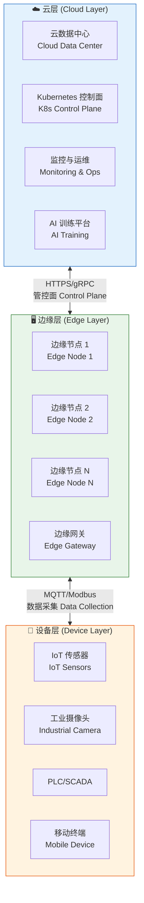

## 2.2 典型部署拓扑 (Typical Deployment Topologies)

## 2.2.1 工业边缘拓扑 (Industrial Edge Topology)

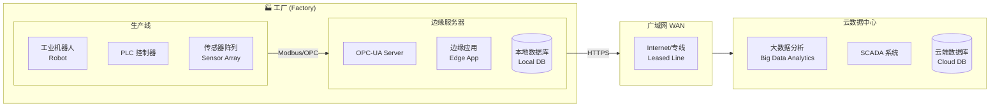

## 2.2.2 零售边缘拓扑 (Retail Edge Topology)

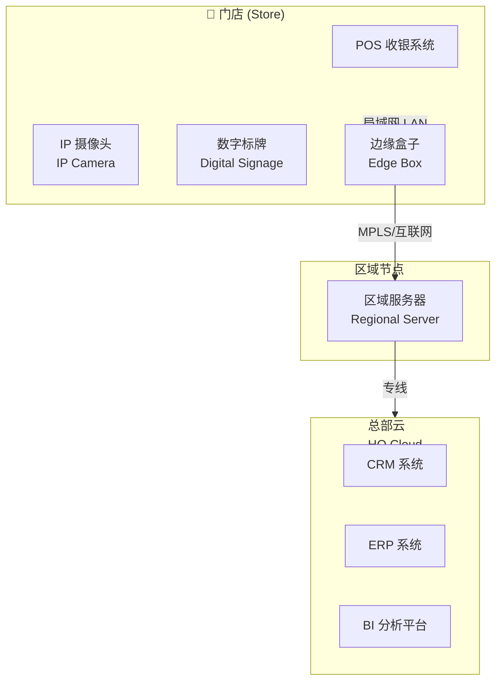

## 2.2.3 运营商 MEC 拓扑 (Telecom MEC Topology)

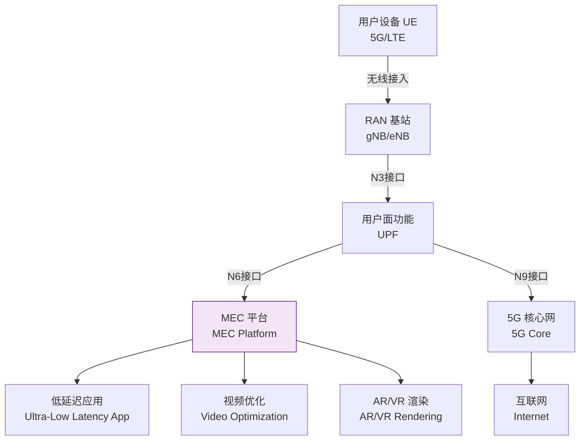

## 2.3 多层边缘架构 (Multi-Tier Edge Architecture)

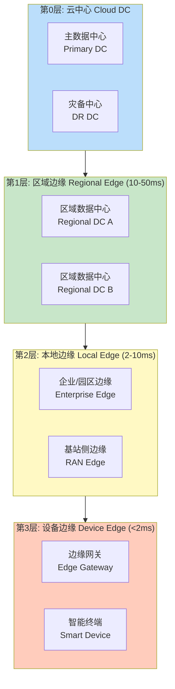

---

<!-- chunk: 3. 延迟需求与性能指标 -->## 3. 延迟需求与性能指标

## 3.1 延迟分析 (Latency Analysis)

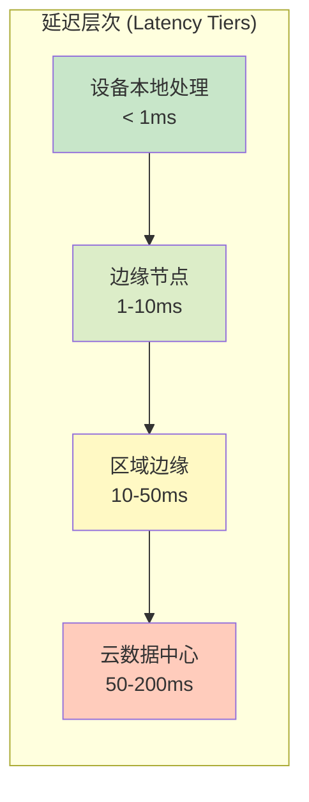

## 3.2 各场景延迟要求 (Latency Requirements by Use Case)

| 应用场景 | 最大可接受延迟 | 推荐部署层级 | 说明 |
|---------|--------------|------------|------|
| 工业控制闭环 | < 1ms | 设备本地 | PLC 控制回路 |
| AR/VR 交互 | < 5ms | 近端边缘 | 避免眩晕感 |
| 自动驾驶决策 | < 10ms | 车载边缘 | 紧急制动决策 |
| 视频质量优化 | < 20ms | 本地边缘 | 实时码率调整 |
| 实时数据分析 | < 50ms | 区域边缘 | 异常检测告警 |
| 批量数据处理 | < 500ms | 区域/云 | 报表生成 |
| 模型训练更新 | 分钟~小时 | 云中心 | 离线训练 |
| 数据存档归档 | 非实时 | 云中心 | 历史数据存储 |

## 3.3 性能指标体系 (Performance Metrics)

```yaml
# 边缘节点关键性能指标
edge_node_metrics:
  latency:
    p50: "< 5ms"      # 50th percentile
    p95: "< 20ms"     # 95th percentile
    p99: "< 50ms"     # 99th percentile
    
  throughput:
    data_ingestion: "10,000 msg/s"   # 数据摄取吞吐
    api_requests: "5,000 req/s"       # API 请求处理
    
  availability:
    uptime: "99.9%"                   # 可用性
    offline_duration: "< 30min/month" # 最大离线时长
    
  resource:
    cpu_cores: "2-8 vCPU"            # 计算资源
    memory: "4-32 GB RAM"            # 内存
    storage: "64GB-2TB SSD"          # 存储
    power: "10-200W"                  # 功耗
    
  network:
    bandwidth_to_cloud: "1-100 Mbps" # 云端带宽
    local_bandwidth: "100Mbps-1Gbps" # 本地带宽
    packet_loss: "< 0.01%"           # 丢包率
```

## 3.4 带宽优化策略 (Bandwidth Optimization)

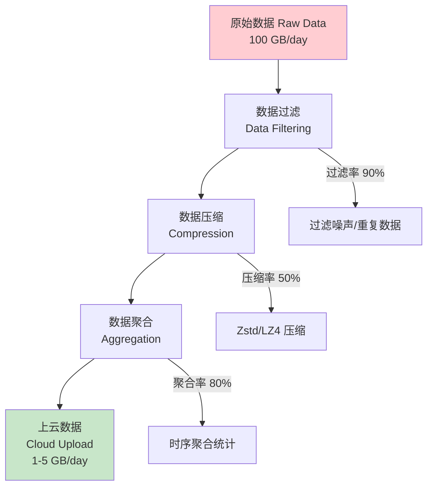

---

<!-- chunk: 4. 典型使用场景 -->## 4. 典型使用场景

## 4.1 工业物联网 (Industrial IoT)

## 预测性维护架构

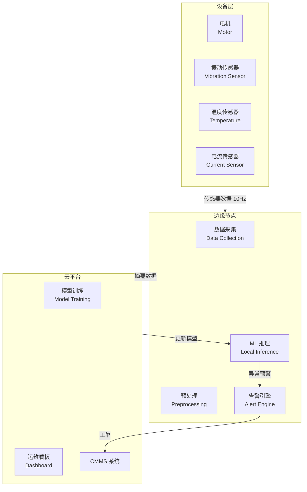

**典型数据流：**
```
传感器 (10ms 采样) → 边缘预处理 → 特征提取 → 本地 ML 推理
                                              ↓
                                    正常：继续运行
                                    异常：立即告警 + 上报云端
                                              ↓
                                    云端：深度分析 + 模型更新
```

## 4.2 智慧零售 (Smart Retail)

```yaml
# 零售边缘应用场景
smart_retail_edge:
  客流分析:
    input: "IP摄像头视频流 1080p 25fps"
    processing: "人脸检测/人体跟踪 (本地推理)"
    output: "客流热力图、停留时长统计"
    latency: "< 100ms 实时显示"
    privacy: "不上传人脸图像，只上传匿名统计数据"
    
  智能收银:
    input: "商品图像识别"
    processing: "YOLO v8 目标检测 (边缘推理)"
    output: "SKU 识别 + 价格计算"
    latency: "< 500ms 完成识别"
    
  库存管理:
    input: "货架摄像头 + RFID"
    processing: "缺货检测 (边缘 AI)"
    output: "补货建议推送"
    sync: "库存数据每5分钟同步云端ERP"
    
  数字标牌:
    input: "人口特征分析结果"
    processing: "内容推荐引擎 (本地)"
    output: "个性化广告内容 (< 200ms 切换)"
```

## 4.3 自动驾驶与 V2X

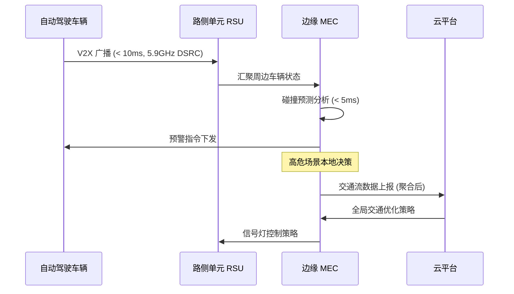

## 4.4 智慧城市 (Smart City)

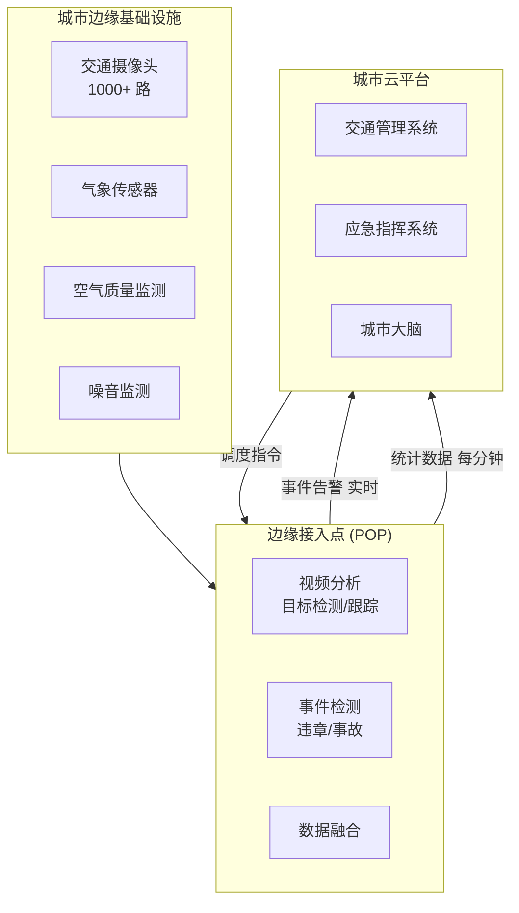

## 4.5 医疗健康 (Healthcare)

```yaml
# 医疗边缘计算场景
healthcare_edge:
  ICU监护:
    devices: ["心电监护仪", "呼吸机", "血压仪", "血氧仪"]
    edge_processing:
      - 实时波形分析
      - 生命体征异常检测 (< 1s 告警)
      - 药物相互作用检查
    cloud_sync:
      - 患者历史数据查询
      - 会诊数据共享
    compliance: "HIPAA 数据不出院区"
    
  手术机器人:
    latency_requirement: "< 1ms 控制回路"
    edge_functions:
      - 运动控制计算
      - 力反馈处理
      - 碰撞检测
    network: "本地专网，不依赖广域网"
    
  远程影像诊断:
    input: "CT/MRI 扫描图像 (100MB-2GB)"
    edge_processing: "图像预处理 + 初步 AI 筛查"
    cloud_processing: "专家会诊 + 深度 AI 分析"
    privacy: "脱敏后上传，保留本地原始数据"
```

---

<!-- chunk: 5. 边缘计算 vs 云计算 -->## 5. 边缘计算 vs 云计算

## 5.1 全面对比 (Comprehensive Comparison)

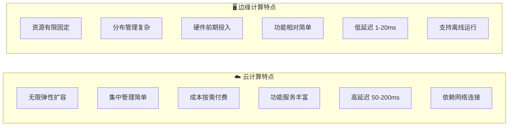

| 维度 | 云计算 | 边缘计算 | 适用场景 |
|------|--------|---------|---------|
| **延迟** | 50-200ms | 1-20ms | 实时控制→边缘 |
| **带宽消耗** | 高（全量数据上传）| 低（只传摘要）| 高带宽成本→边缘 |
| **离线能力** | 无 | 支持 | 弱网环境→边缘 |
| **数据隐私** | 数据离本地 | 数据本地处理 | 合规要求→边缘 |
| **计算规模** | 几乎无限 | 有限（数十核）| 大规模训练→云 |
| **管理复杂度** | 低（集中）| 高（分布式）| 运维简单→云 |
| **成本模型** | OPEX（按用量）| CAPEX（前期投入）| 持续高频→边缘 |
| **弹性扩展** | 秒级扩容 | 需采购硬件 | 突发流量→云 |
| **问题影响** | 单点高影响 | 局部影响 | 高可用→边缘 |
| **软件多样性** | 丰富服务 | 受限 | 复杂应用→云 |

## 5.2 云边协同最佳实践 (Cloud-Edge Best Practices)

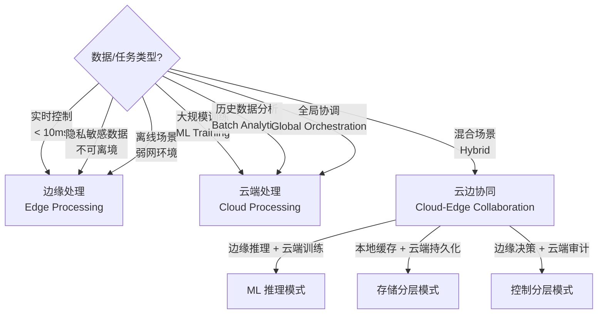

## 5.3 决策框架 (Decision Framework)

```
场景评估矩阵:

                    延迟要求
                高(>100ms)  低(<10ms)
              ┌───────────┬───────────┐
    数据量  大 │   云计算   │ 边缘+云协同│
              ├───────────┼───────────┤
           小  │   云计算   │  纯边缘   │
              └───────────┴───────────┘

                    网络可靠性
                高(99.9%+)  低(<99%)
              ┌───────────┬───────────┐
    实时性  高 │  可选云/边 │  必须边缘 │
              ├───────────┼───────────┤
           低  │   首选云   │  建议边缘 │
              └───────────┴───────────┘
```

---

<!-- chunk: 6. 边缘节点分类 -->## 6. 边缘节点分类

## 6.1 按硬件形态分类 (Hardware Classification)

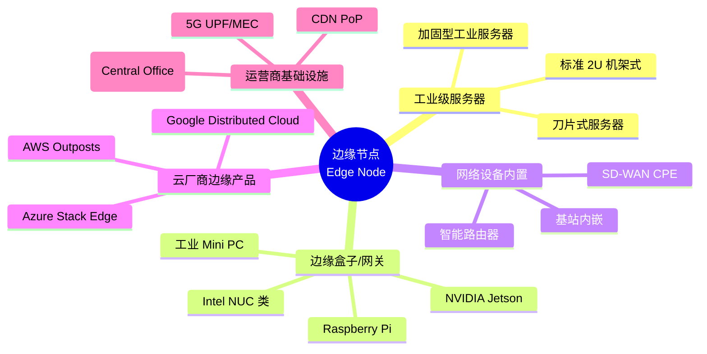

## 6.2 按计算能力分类 (Compute Capability Classification)

| 类别 | CPU | GPU/NPU | 内存 | 存储 | 典型产品 | 适用场景 |
|------|-----|---------|------|------|---------|---------|
| **超轻量** | ARM Cortex-A53 (4核) | - | 1-4GB | 16-64GB | RPi 4, Orange Pi | 简单数据采集 |
| **轻量** | ARM A55/A73 (8核) | - | 4-8GB | 64-256GB | Rockchip RK3588 | 轻量边缘应用 |
| **标准** | x86 Core i5/i7 | - | 8-32GB | 256GB-2TB | Intel NUC | 通用边缘应用 |
| **AI加速** | ARM/x86 | 50-500 TOPS | 16-64GB | 256GB-4TB | NVIDIA Jetson AGX | AI 推理 |
| **高性能** | Xeon/EPYC | T4/A2 GPU | 64-512GB | 数TB NVMe | 工业服务器 | 复杂边缘应用 |
| **云边** | 云服务器 | 云 GPU | 弹性 | 弹性 | AWS Outposts | 云原生边缘 |

## 6.3 边缘节点典型配置

```yaml
# 标准工业边缘节点配置
apiVersion: v1
kind: NodeSpec
metadata:
  name: edge-factory-node-01
  labels:
    node-role.kubernetes.io/edge: ""
    location: "factory-floor-a"
    tier: "local-edge"
spec:
  # 硬件配置
  hardware:
    cpu: "Intel Core i7-1185G7E (4C/8T, 1.8-4.4GHz)"
    memory: "32GB DDR4 ECC"
    storage:
      - type: "NVMe SSD"
        capacity: "512GB"
        purpose: "OS + Container Images"
      - type: "SATA SSD"
        capacity: "2TB"
        purpose: "Data Storage"
    network:
      - interface: "eth0"
        speed: "1Gbps"
        purpose: "Cloud Uplink"
      - interface: "eth1"
        speed: "1Gbps"
        purpose: "OT Network"
    
  # 操作系统配置
  os:
    distribution: "Ubuntu 22.04 LTS"
    kernel: "5.15 LTS"
    container_runtime: "containerd 1.7"
    
  # 环境要求
  environment:
    temperature: "0-60°C operating"
    humidity: "5-95% non-condensing"
    protection: "IP40"
    power: "12-24V DC / AC 100-240V"
    
  # 网络要求
  network_requirements:
    cloud_bandwidth: "10 Mbps minimum"
    cloud_latency: "< 500ms RTT"
    local_protocols: ["Modbus TCP", "OPC-UA", "MQTT"]
```

---

<!-- chunk: 7. 网络模型与通信架构 -->## 7. 网络模型与通信架构

## 7.1 边缘网络拓扑 (Edge Network Topology)

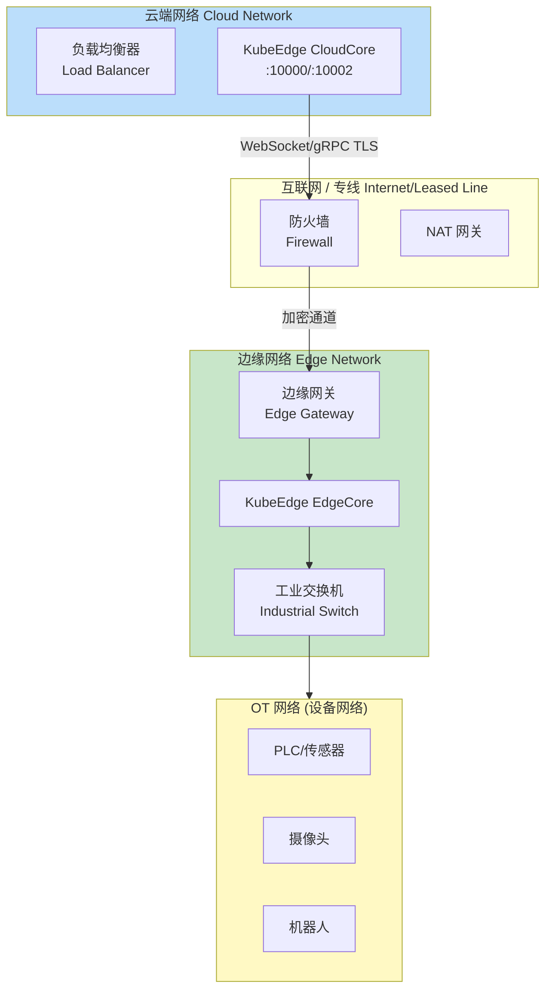

## 7.2 边缘通信协议 (Edge Communication Protocols)

## 北向接口 (Northbound - Edge to Cloud)

```yaml
# 边缘到云端通信协议
northbound_protocols:
  primary:
    protocol: "WebSocket over TLS 1.3"
    port: 10000
    usage: "KubeEdge 控制面通信"
    features:
      - 长连接保持
      - 消息可靠传递
      - 自动重连
      - 心跳检测
      
  secondary:
    protocol: "HTTPS/REST"
    port: 443
    usage: "数据上传 / 配置拉取"
    
  streaming:
    protocol: "gRPC Streaming"
    usage: "大数据量流式传输"
    compression: "gzip/zstd"
```

## 南向接口 (Southbound - Edge to Device)

```yaml
# 边缘到设备通信协议
southbound_protocols:
  iot_protocols:
    mqtt:
      version: "MQTT 5.0"
      broker: "Eclipse Mosquitto / EMQX"
      topics:
        telemetry: "$hw/events/device/{deviceID}/twin/update"
        command: "$hw/events/device/{deviceID}/twin/update/result"
      qos: [0, 1, 2]  # 0=最多一次, 1=至少一次, 2=恰好一次
      
    coap:
      usage: "低功耗设备"
      transport: "UDP"
      features: ["资源受限设备", "低功耗"]
      
  industrial_protocols:
    opcua:
      standard: "OPC UA (IEC 62541)"
      usage: "工业设备互联"
      security: "证书认证 + 数据加密"
      
    modbus:
      variants: ["Modbus TCP", "Modbus RTU", "Modbus ASCII"]
      usage: "PLC/传感器"
      
    profinet:
      usage: "西门子工业网络"
      realtime: "< 1ms 实时通信"
```

## 7.3 边缘网络隔离 (Network Isolation)

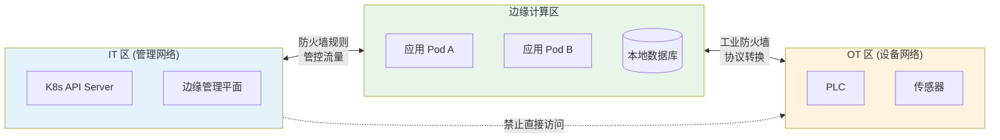

---

<!-- chunk: 8. 数据处理模型 -->## 8. 数据处理模型

## 8.1 边缘数据处理流水线 (Edge Data Processing Pipeline)

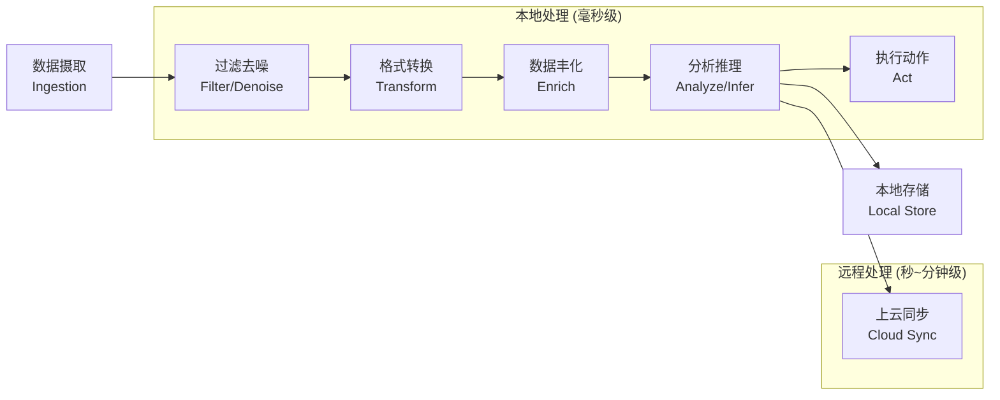

## 8.2 Lambda 架构在边缘的应用 (Lambda Architecture at Edge)

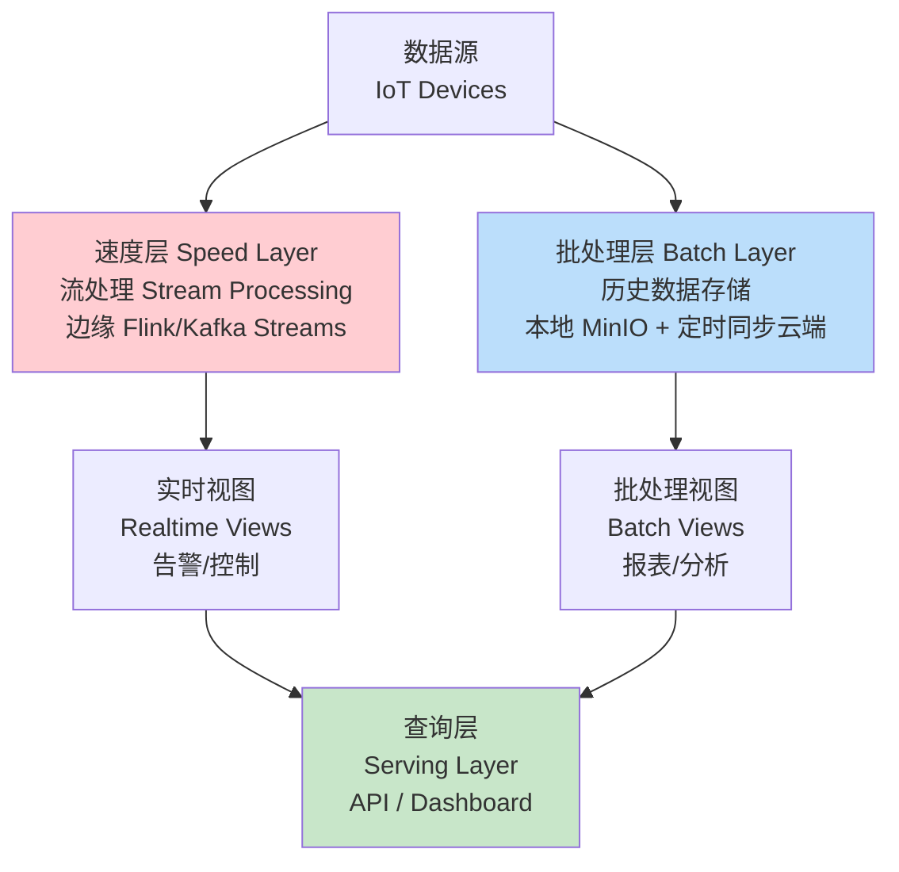

## 8.3 数据分层存储策略 (Tiered Storage Strategy)

```yaml
# 边缘数据分层存储配置
storage_tiering:
  # 第一层: 内存/本地高速存储 (热数据)
  tier1_hot:
    storage: "内存 + NVMe SSD"
    retention: "最近 1 小时"
    data_types:
      - 实时传感器数据
      - 告警事件
      - 控制指令
    access_pattern: "毫秒级读写"
    capacity: "10GB"
    
  # 第二层: 本地磁盘 (温数据)
  tier2_warm:
    storage: "本地 HDD/SATA SSD"
    retention: "最近 7 天"
    data_types:
      - 聚合统计数据
      - 事件日志
      - 视频片段
    access_pattern: "秒级读写"
    capacity: "500GB"
    lifecycle:
      compress_after: "1 hour"
      compression: "zstd"
      
  # 第三层: 云端对象存储 (冷数据)
  tier3_cold:
    storage: "OSS/S3"
    retention: "1-7 年"
    data_types:
      - 历史数据归档
      - 审计日志
      - 模型训练数据集
    access_pattern: "分钟级读取"
    lifecycle:
      upload_after: "7 days"
      format: "Parquet (列式压缩)"
      
  # 数据迁移策略
  migration_policy:
    trigger: "基于时间 + 容量阈值"
    compression_ratio: "10:1 (原始→归档)"
    bandwidth_limit: "5 Mbps (上传限速)"
    upload_window: "02:00-06:00 (低峰期)"
```

---

<!-- chunk: 9. 安全架构 -->## 9. 安全架构

## 9.1 边缘安全威胁模型 (Edge Security Threat Model)

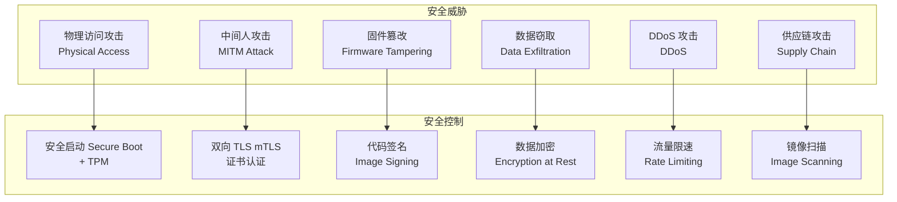

## 9.2 零信任边缘安全架构 (Zero Trust Edge Security)

```yaml
# 零信任边缘安全配置
zero_trust_edge:
  # 1. 身份认证
  identity:
    edge_node_auth:
      method: "X.509 证书"
      ca: "私有 PKI"
      rotation: "每 90 天自动轮换"
      
    workload_auth:
      method: "SPIFFE/SPIRE"
      identity_format: "spiffe://cluster.local/ns/default/sa/edge-app"
      
  # 2. 网络安全
  network:
    encryption: "mTLS 1.3 所有通信"
    network_policy: "默认拒绝，显式允许"
    micro_segmentation:
      - name: "OT Network Isolation"
        rule: "边缘应用不可直接访问 OT 设备"
        
  # 3. 运行时安全
  runtime:
    container_security:
      - "只读根文件系统"
      - "非 root 用户运行"
      - "禁用特权容器"
      - "Seccomp/AppArmor 配置"
    admission_control:
      - "OPA Gatekeeper 策略"
      - "镜像仅允许私有仓库"
      
  # 4. 数据安全
  data:
    encryption_at_rest: "AES-256 (LUKS)"
    encryption_in_transit: "TLS 1.3"
    key_management: "边缘 HSM 或云端 KMS"
    data_classification:
      - level: "机密"
        handling: "不离开边缘节点"
      - level: "内部"
        handling: "加密后可上云"
      - level: "公开"
        handling: "无限制"
```

## 9.3 边缘节点安全加固 (Edge Node Hardening)

> ⚠️ **🟠 高危操作** — 影响业务流量或节点状态，需变更工单+影响评估+计划回滚
> - `systemctl stop/restart`：停止/重启系统服务，影响节点上所有容器

```bash
#!/bin/bash
# 边缘节点安全加固脚本 Edge Node Security Hardening

# 1. 系统加固
echo "=== 系统加固 ==="
# 禁用不必要服务
systemctl disable avahi-daemon
systemctl disable bluetooth
systemctl disable cups

# 内核安全参数
cat >> /etc/sysctl.conf << 'EOF'
# 防止 IP 欺骗
net.ipv4.conf.all.rp_filter = 1
# 禁用 ICMP 重定向
net.ipv4.conf.all.accept_redirects = 0
# 禁止转发广播请求
net.ipv4.icmp_echo_ignore_broadcasts = 1
# 开启 SYN Cookies
net.ipv4.tcp_syncookies = 1
EOF
sysctl -p

# 2. 容器运行时安全配置
cat > /etc/containerd/config.toml << 'EOF'
version = 2

[plugins."io.containerd.grpc.v1.cri"]
  [plugins."io.containerd.grpc.v1.cri".containerd]
    discard_unpacked_layers = true
    [plugins."io.containerd.grpc.v1.cri".containerd.runtimes.runc]
      runtime_type = "io.containerd.runc.v2"
      [plugins."io.containerd.grpc.v1.cri".containerd.runtimes.runc.options]
        SystemdCgroup = true
        # 启用 Seccomp
        SeccompDefault = true
EOF

# 3. 防火墙配置
ufw default deny incoming
ufw default allow outgoing
# 允许 SSH 管理
ufw allow from 10.0.0.0/8 to any port 22
# 允许 KubeEdge EdgeCore 连接
ufw allow out to any port 10000
ufw allow out to any port 10002
# 允许本地 MQTT
ufw allow 1883/tcp
ufw enable

# 4. 审计日志
apt-get install -y auditd
cat >> /etc/audit/audit.rules << 'EOF'
# 监控重要文件修改
-w /etc/passwd -p wa -k identity
-w /etc/shadow -p wa -k identity
-w /etc/sudoers -p wa -k sudo_log
# 监控容器运行时
-w /usr/bin/containerd -p x -k container
-w /usr/local/bin/kubectl -p x -k kubectl
EOF
service auditd restart
```

---

<!-- chunk: 10. 标准化与生态 -->## 10. 标准化与生态

## 10.1 行业标准 (Industry Standards)

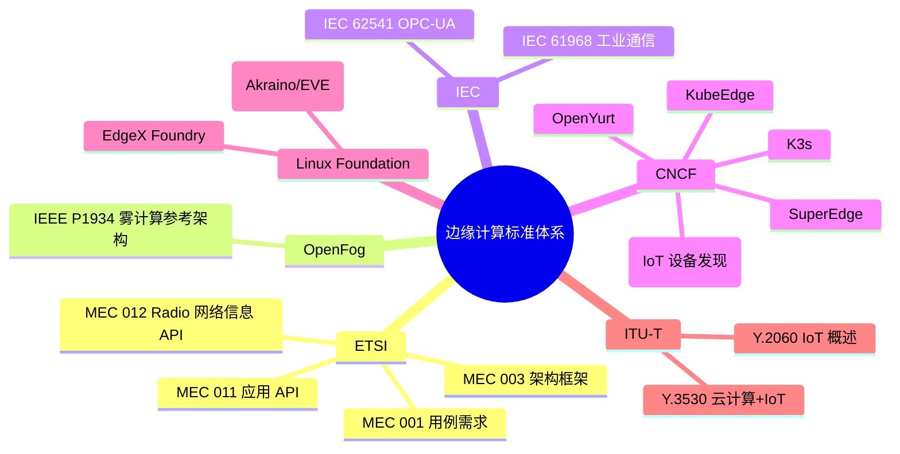

## 10.2 主要开源项目对比 (Open Source Projects Comparison)

| 项目 | 发起方 | 定位 | 架构特点 | 优势 | 劣势 |
|------|--------|------|---------|------|------|
| **KubeEdge** | 华为/CNCF | K8s 边缘扩展 | CloudCore+EdgeCore | 设备管理强、生态完善 | 部署复杂 |
| **OpenYurt** | 阿里巴巴/CNCF | K8s 边缘增强 | YurtHub+Tunnel | 无侵入、升级简单 | 设备管理弱 |
| **SuperEdge** | 腾讯 | K8s 边缘 | Tunnel+ServiceGroup | 多集群管理 | 社区较小 |
| **K3s** | Rancher/CNCF | 轻量 K8s | 单二进制 | 极简部署 | 功能受限 |
| **MicroK8s** | Canonical | 轻量 K8s | Snap 包 | Ubuntu 原生 | 仅 Ubuntu |
| **EdgeX Foundry** | Linux Foundation | IoT 中间件 | 微服务架构 | 协议适配丰富 | 非 K8s 原生 |

## 10.3 CNCF 边缘计算项目 (CNCF Edge Projects)

```yaml
# CNCF 边缘相关项目清单
cncf_edge_projects:
  graduated:
    - name: "K3s"
      description: "轻量级 Kubernetes"
      cncf_level: "Graduated"
      
  incubating:
    - name: "KubeEdge"
      description: "Kubernetes 原生边缘计算框架"
      cncf_level: "Incubating"
      
  sandbox:
    - name: "OpenYurt"
      description: "非侵入式 Kubernetes 边缘增强"
      cncf_level: "Sandbox"
      
    - name: "SuperEdge"
      description: "Kubernetes 原生边缘容器管理系统"
      cncf_level: "Sandbox"
      
    - name: "Akri"
      description: "Kubernetes 设备发现与管理"
      cncf_level: "Sandbox"
      
    - name: "WasmEdge"
      description: "边缘 WebAssembly 运行时"
      cncf_level: "Sandbox"
      
    - name: "KEDA"
      description: "事件驱动弹性伸缩 (边缘友好)"
      cncf_level: "Graduated"
```

---

<!-- chunk: 11. Kubernetes 在边缘的演进 -->## 11. Kubernetes 在边缘的演进

## 11.1 标准 K8s 的边缘局限性 (K8s Limitations at Edge)

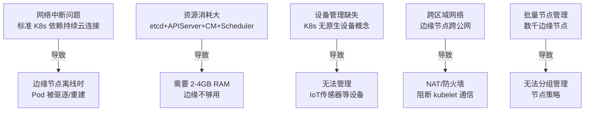

## 11.2 边缘 K8s 解决方案演进 (Edge K8s Solutions Evolution)

```
2018 ──── KubeEdge v0.1 发布
           华为开源，Kubernetes + IoT 设备管理
           
2019 ──── K3s 发布
           Rancher 开源，轻量化 Kubernetes
           单二进制 ~100MB，适合边缘
           
2020 ──── OpenYurt 发布
           阿里巴巴开源，非侵入式边缘扩展
           YurtHub 本地缓存解决离线问题
           
2021 ──── SuperEdge 发布
           腾讯开源，ServiceGroup 多集群边缘
           
2022 ──── KubeEdge 加入 CNCF Incubating
           OpenYurt 加入 CNCF Sandbox
           
2023 ──── 边缘 AI 推理场景爆发
           各方案集成 AI 加速硬件支持
           
2024+ ─── 云边一体化平台成熟
           统一管控面，异构硬件支持
```

## 11.3 轻量化 K8s 对比 (Lightweight K8s Comparison)

```mermaid
graph LR
    subgraph K3s["K3s 架构"]
        K3sServer[K3s Server<br/>All-in-one Binary<br/>~100MB]
        K3sAgent[K3s Agent<br/>Edge Node]
        SQLite[(SQLite/etcd)]
    end
    
    subgraph MicroK8s["MicroK8s 架构"]
        MK8s[MicroK8s<br/>Snap Package<br/>Ubuntu 原生]
    end
    
    subgraph KubeEdge["KubeEdge 架构"]
        CC[CloudCore<br/>云端组件]
        EC[EdgeCore<br/>边缘组件<br/>~70MB]
    end
```

| 特性 | K3s | MicroK8s | KubeEdge EdgeCore |
|------|-----|----------|-----------------|
| 二进制大小 | ~100MB | ~200MB | ~70MB |
| 最低内存 | 512MB | 1GB | 128MB |
| etcd 依赖 | 可选 (SQLite) | 必须 | 无 (本地存储) |
| 设备管理 | 无 | 无 | 支持 |
| 离线工作 | 有限 | 有限 | 完整支持 |
| ARM 支持 | 是 | 是 | 是 |

---

<!-- chunk: 12. 实践架构设计 -->## 12. 实践架构设计

## 12.1 生产级边缘架构参考 (Production Edge Architecture Reference)

```mermaid
graph TB
    subgraph CloudRegion["☁️ 云端区域 Cloud Region"]
        subgraph ControlPlane["控制面 Control Plane"]
            K8sAPI[K8s API Server<br/>HA 3节点]
            CloudCore[KubeEdge CloudCore<br/>HA 部署]
            DeviceHub[设备管理服务<br/>Device Hub]
        end
        subgraph DataPlane["数据面 Data Plane"]
            Kafka[Apache Kafka<br/>消息队列]
            ClickHouse[(ClickHouse<br/>时序数据)]
            MinIO[(MinIO<br/>对象存储)]
        end
        subgraph AI["AI 平台"]
            ModelTrain[模型训练<br/>GPU Cluster]
            ModelRegistry[模型仓库<br/>Model Registry]
        end
    end
    
    subgraph EdgeSite["🏭 边缘站点 Edge Site"]
        subgraph EdgeHA["边缘高可用"]
            EN1[边缘节点 1<br/>Master]
            EN2[边缘节点 2<br/>Worker]
        end
        subgraph EdgeApps["边缘应用"]
            DataCollect[数据采集服务]
            MLInfer[AI 推理服务]
            LocalMQTT[MQTT Broker]
            LocalDB[(本地 PostgreSQL)]
        end
    end
    
    subgraph Devices["📱 设备层"]
        Sensors[传感器 x100]
        Cameras[摄像头 x20]
        PLCs[PLC x10]
    end
    
    CloudCore <-->|WebSocket TLS| EN1
    EN1 <--> EN2
    EdgeApps --> EdgeHA
    Devices -->|MQTT/Modbus| EdgeApps
    EdgeApps -->|数据同步| CloudRegion
    AI -->|模型推送| MLInfer
```

## 12.2 高可用边缘设计 (HA Edge Design)

```yaml
# 边缘高可用配置
apiVersion: apps/v1
kind: Deployment
metadata:
  name: edge-critical-app
  namespace: edge-production
spec:
  replicas: 2  # 双副本保障可用性
  strategy:
    type: RollingUpdate
    rollingUpdate:
      maxUnavailable: 0  # 不允许不可用
      maxSurge: 1
  selector:
    matchLabels:
      app: edge-critical-app
  template:
    metadata:
      labels:
        app: edge-critical-app
    spec:
      # 强制调度到边缘节点
      nodeSelector:
        node-role.kubernetes.io/edge: ""
        location: "factory-a"
      
      # 容忍边缘节点 Taint
      tolerations:
      - key: "edge-node"
        operator: "Exists"
        effect: "NoSchedule"
      
      # Pod 反亲和 - 分散到不同节点
      affinity:
        podAntiAffinity:
          requiredDuringSchedulingIgnoredDuringExecution:
          - labelSelector:
              matchExpressions:
              - key: app
                operator: In
                values:
                - edge-critical-app
            topologyKey: "kubernetes.io/hostname"
      
      # 资源限制
      containers:
      - name: app
        image: registry.company.com/edge-app:v1.2.0
        resources:
          requests:
            cpu: "200m"
            memory: "256Mi"
          limits:
            cpu: "1000m"
            memory: "1Gi"
        
        # 健康检查
        livenessProbe:
          httpGet:
            path: /healthz
            port: 8080
          initialDelaySeconds: 30
          periodSeconds: 10
          failureThreshold: 3
          
        readinessProbe:
          httpGet:
            path: /ready
            port: 8080
          initialDelaySeconds: 5
          periodSeconds: 5
        
        # 本地存储挂载
        volumeMounts:
        - name: local-data
          mountPath: /data
        - name: config
          mountPath: /etc/config
          
      volumes:
      - name: local-data
        hostPath:
          path: /var/edge-data
          type: DirectoryOrCreate
      - name: config
        configMap:
          name: edge-app-config
```

## 12.3 边缘运维自动化 (Edge Operations Automation)

```yaml
# GitOps 边缘部署工作流
# .github/workflows/edge-deploy.yml
name: Edge Site Deployment

on:
  push:
    branches: [main]
    paths:
      - 'edge-apps/**'
      - 'edge-configs/**'

jobs:
  validate:
    runs-on: ubuntu-latest
    steps:
      - uses: actions/checkout@v3
      - name: Validate Kubernetes Manifests
        run: |
          kubectl apply --dry-run=client -f edge-apps/
          
      - name: Security Scan
        run: |
          trivy config edge-apps/
          
  deploy-to-edge:
    needs: validate
    runs-on: ubuntu-latest
    strategy:
      matrix:
        site: [factory-a, factory-b, store-chain]
    steps:
      - name: Deploy to Edge Site
        run: |
          # ArgoCD / Flux 推送配置
          kubectl --context ${{ matrix.site }} apply -f edge-apps/
          
      - name: Verify Deployment
        run: |
          kubectl --context ${{ matrix.site }} rollout status deployment/edge-app
          kubectl --context ${{ matrix.site }} get pods -l app=edge-app
```

## 12.4 容量规划指南 (Capacity Planning Guide)

```python
# 边缘节点容量规划计算
def calculate_edge_capacity(devices, apps_config):
    """
    边缘节点容量规划计算器
    
    Args:
        devices: 设备数量和数据上报频率
        apps_config: 边缘应用资源需求
    """
    
    # 数据摄取计算
    data_ingestion_per_sec = sum(
        d['count'] * d['data_size_bytes'] * d['frequency_hz'] 
        for d in devices
    )
    
    # CPU 需求计算
    cpu_for_ingestion = data_ingestion_per_sec / 10_000_000  # 10MB/s 需要 1 核
    cpu_for_apps = sum(app['cpu_cores'] for app in apps_config)
    cpu_buffer = (cpu_for_ingestion + cpu_for_apps) * 0.3  # 30% 缓冲
    total_cpu = cpu_for_ingestion + cpu_for_apps + cpu_buffer
    
    # 内存需求计算
    mem_for_os = 2  # GB
    mem_for_k8s = 1  # GB
    mem_for_apps = sum(app['memory_gb'] for app in apps_config)
    mem_buffer = mem_for_apps * 0.2  # 20% 缓冲
    total_memory = mem_for_os + mem_for_k8s + mem_for_apps + mem_buffer
    
    # 存储需求计算
    local_retention_days = 7
    storage_per_day = data_ingestion_per_sec * 86400 * 0.1  # 10% 存储率
    total_storage = storage_per_day * local_retention_days / (1024**3)  # GB
    
    return {
        "recommended_cpu_cores": max(4, round(total_cpu)),
        "recommended_memory_gb": max(8, round(total_memory)),
        "recommended_storage_gb": max(256, round(total_storage)),
        "network_bandwidth_mbps": data_ingestion_per_sec * 8 / 1_000_000 * 0.1
    }

# 示例计算
devices = [
    {"count": 100, "data_size_bytes": 64, "frequency_hz": 10},    # 传感器
    {"count": 20, "data_size_bytes": 1024, "frequency_hz": 1},    # 摄像头元数据
    {"count": 10, "data_size_bytes": 256, "frequency_hz": 5},     # PLC
]

apps = [
    {"name": "data-collector", "cpu_cores": 0.5, "memory_gb": 0.5},
    {"name": "ml-inference", "cpu_cores": 2.0, "memory_gb": 4.0},
    {"name": "local-mqtt", "cpu_cores": 0.5, "memory_gb": 0.5},
    {"name": "monitoring", "cpu_cores": 0.2, "memory_gb": 0.5},
]

result = calculate_edge_capacity(devices, apps)
print(f"推荐配置: {result['recommended_cpu_cores']} 核, "
      f"{result['recommended_memory_gb']} GB RAM, "
      f"{result['recommended_storage_gb']} GB Storage")
# 输出: 推荐配置: 8 核, 8 GB RAM, 256 GB Storage
```

---

<!-- chunk: 总结 (Summary) -->## 总结 (Summary)

边缘计算已经从概念验证阶段演进为成熟的生产技术，其核心价值在于：

```
┌─────────────────────────────────────────────────────────┐
│                  边缘计算核心价值总结                      │
├──────────────┬──────────────────────────────────────────┤
│ 低延迟       │ 1-20ms 本地处理，满足实时控制需求           │
│ 带宽效率     │ 90%+ 数据本地处理，只上传 10% 有价值数据   │
│ 离线自治     │ 网络中断时保持业务连续性                    │
│ 数据隐私     │ 敏感数据不离开边界，满足合规要求            │
│ 规模经济     │ 边缘处理降低云端算力和带宽成本              │
└──────────────┴──────────────────────────────────────────┘
```

**关键技术选型建议：**

1. **轻量级场景** → 选择 K3s，单节点边缘集群
2. **IoT 设备管理** → 选择 KubeEdge，原生设备 CRD
3. **存量 K8s 集群边缘化** → 选择 OpenYurt，无侵入改造
4. **运营商 MEC** → 使用 ETSI MEC 标准框架
5. **工业互联** → EdgeX Foundry + KubeEdge 组合

---

<!-- chunk: 参考资料 (References) -->## 参考资料 (References)

- [CNCF Edge Computing Whitepaper](https://github.com/cncf/tag-runtime/blob/main/whitepapers/edge-cloud-computing.md)
- [ETSI MEC Standards](https://www.etsi.org/technologies/multi-access-edge-computing)
- [KubeEdge Documentation](https://kubeedge.io/docs/)
- [OpenYurt Documentation](https://openyurt.io/docs/)
- [Linux Foundation Edge Projects](https://www.lfedge.org/)
- [IEEE P1934 Fog Computing Reference Architecture](https://standards.ieee.org/project/1934.html)
- [AWS Wavelength MEC Architecture](https://aws.amazon.com/wavelength/)
- [Azure Edge Zones](https://azure.microsoft.com/en-us/products/azure-edge-zones/)

---

<!-- chunk: Obsidian 相关文档 -->## Obsidian 相关文档

- domain-37-edge-computing MOC
- [[domain-15-specialized-tech/README.md|Domain 15: 边缘计算 (Edge Computing)]]
- Domain-37 边缘计算 — 开源项目索引
- 云边协同设计模式 (Cloud-Edge Collaboration Design Patterns)
- KubeEdge 架构与部署 (KubeEdge Architecture and Deployment)
- KubeEdge 设备管理与边缘应用 (KubeEdge Device Management and Edge Appl...
- OpenYurt 边缘方案 (OpenYurt Edge Solution)
- SuperEdge 架构实践 (SuperEdge Architecture Practice)
- 边缘 AI 推理与联邦学习 (Edge AI Inference and Federated Learning)
- 边缘存储与网络 (Edge Storage and Network)
- 边缘安全架构 (Edge Security Architecture)
- 边缘场景案例 (Edge Computing Use Cases)

## See Also

- 10-edge-use-cases
- 99-kubernetes-developer-toolchain-guide
- 02-cloud-edge-collaboration
- 03-kubeedge-architecture-deployment
