# 云边协同设计模式 (Cloud-Edge Collaboration Design Patterns)

<!-- chunk: 目录 (Table of Contents) -->## 目录 (Table of Contents)

1. [云边协同概述](#1-云边协同概述)
2. [通信模式](#2-通信模式)
3. [数据同步策略](#3-数据同步策略)
4. [状态管理设计](#4-状态管理设计)
5. [离线优先设计](#5-离线优先设计)
6. [最终一致性模式](#6-最终一致性模式)
7. [消息队列与事件驱动](#7-消息队列与事件驱动)
8. [服务发现与负载均衡](#8-服务发现与负载均衡)
9. [配置管理与分发](#9-配置管理与分发)
10. [可观测性设计](#10-可观测性设计)
11. [故障处理与恢复](#11-故障处理与恢复)
12. [云边协同最佳实践](#12-云边协同最佳实践)

---

<!-- chunk: 1. 云边协同概述 -->## 1. 云边协同概述

## 1.1 云边协同的挑战 (Challenges of Cloud-Edge Collaboration)

云边协同面临的核心挑战在于：**如何在不可靠的广域网连接下，保证分布在边缘和云端的系统协调一致地工作**。

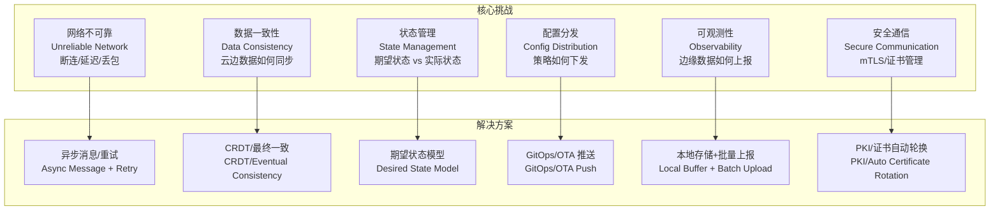

## 1.2 云边协同架构分层 (Architecture Layers)

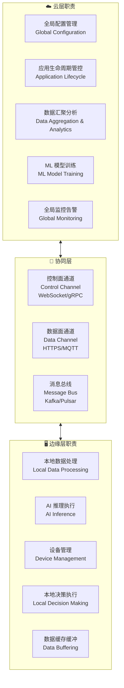

## 1.3 协同模式分类 (Collaboration Pattern Categories)

```
云边协同模式分类:

┌─────────────────┬────────────────────────────────────┐
│ 控制流协同       │ 云端下发指令，边缘执行               │
│ Control Flow    │ ConfigMap / Deployment / Job 下发   │
├─────────────────┼────────────────────────────────────┤
│ 数据流协同       │ 边缘采集，云端汇聚                   │
│ Data Flow       │ 传感器数据 / 日志 / 指标上报          │
├─────────────────┼────────────────────────────────────┤
│ 模型协同         │ 云端训练，边缘推理                   │
│ Model Flow      │ AI 模型下发，推理结果回传             │
├─────────────────┼────────────────────────────────────┤
│ 事件协同         │ 边缘触发，云端响应                   │
│ Event Flow      │ 告警事件 / 业务触发 / 审批流          │
└─────────────────┴────────────────────────────────────┘
```

---

<!-- chunk: 2. 通信模式 -->## 2. 通信模式

## 2.1 请求-响应模式 (Request-Response Pattern)

**适用场景**：配置查询、状态上报、指令下发

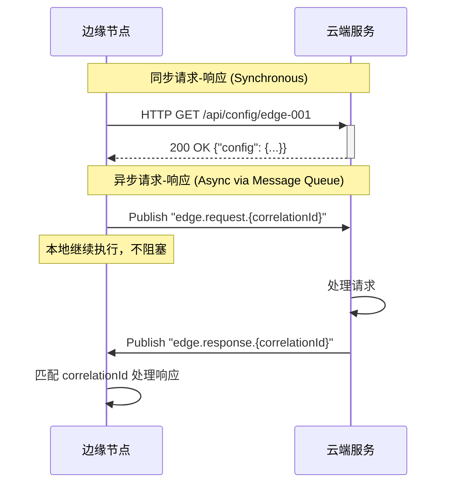

```go
// 边缘端异步请求实现示例 (Go)
type EdgeCloudClient struct {
    mqttClient  mqtt.Client
    pendingReqs sync.Map  // correlationId -> chan Response
}

func (c *EdgeCloudClient) SendRequest(ctx context.Context, payload []byte) (Response, error) {
    correlationID := uuid.New().String()
    respChan := make(chan Response, 1)
    
    // 注册等待响应
    c.pendingReqs.Store(correlationID, respChan)
    defer c.pendingReqs.Delete(correlationID)
    
    // 发送请求消息
    topic := fmt.Sprintf("cloud/requests/%s", correlationID)
    token := c.mqttClient.Publish(topic, 1, false, payload)
    token.Wait()
    
    // 等待响应或超时
    select {
    case resp := <-respChan:
        return resp, nil
    case <-ctx.Done():
        return Response{}, ctx.Err()
    case <-time.After(30 * time.Second):
        return Response{}, errors.New("request timeout")
    }
}

func (c *EdgeCloudClient) handleResponse(client mqtt.Client, msg mqtt.Message) {
    var resp Response
    json.Unmarshal(msg.Payload(), &resp)
    
    if ch, ok := c.pendingReqs.Load(resp.CorrelationID); ok {
        ch.(chan Response) <- resp
    }
}
```

## 2.2 发布-订阅模式 (Publish-Subscribe Pattern)

**适用场景**：设备遥测数据上报、事件广播、配置下发

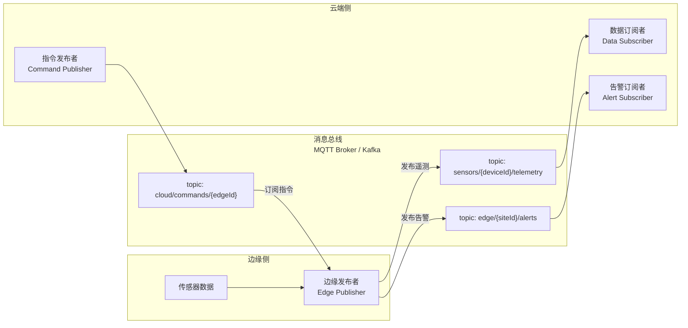

```yaml
# MQTT 主题设计规范
mqtt_topic_design:
  # 传感器遥测数据
  telemetry: "sensors/{siteId}/{deviceId}/telemetry"
  # 示例: sensors/factory-a/temp-sensor-001/telemetry
  
  # 设备状态更新
  status: "devices/{siteId}/{deviceId}/status"
  
  # 告警事件
  alerts: "alerts/{siteId}/{severity}/{alertId}"
  # 示例: alerts/factory-a/critical/overheat-001
  
  # 云端下发命令
  commands: "commands/{siteId}/{deviceId}/request"
  
  # 命令执行结果
  command_result: "commands/{siteId}/{deviceId}/response"
  
  # 配置下发
  config: "config/{siteId}/{nodeId}/update"
  
  # Topic 设计原则:
  # 1. 层级清晰，从粗到细
  # 2. siteId 便于按站点过滤
  # 3. 避免过深层级 (>5层)
  # 4. 不含特殊字符
  
  qos_policy:
    telemetry: 0    # 最多一次 (性能优先)
    alerts: 1       # 至少一次 (可靠性优先)
    commands: 2     # 恰好一次 (幂等性)
    config: 1       # 至少一次 + 幂等处理
```

## 2.3 推送-拉取模式 (Push-Pull Pattern)

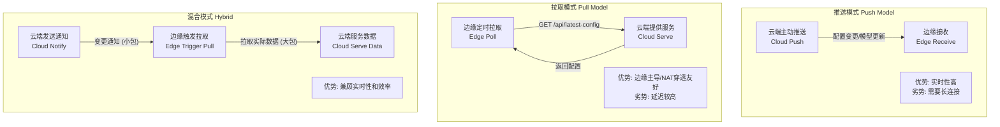

**推荐选择策略：**

```
场景                        推荐模式
────────────────────────────────────────
配置更新 (小数据)          → 推送模式
模型文件下发 (大文件)      → 通知+拉取混合
设备遥测上报              → 推送模式 (边缘→云)
边缘状态查询              → 拉取模式 (云主动查)
实时指令下发              → 推送模式 (WebSocket)
日志/指标批量上传         → 推送+本地缓冲
```

## 2.4 长连接管理 (Long Connection Management)

```go
// KubeEdge 风格的云边长连接管理
type CloudEdgeConnection struct {
    conn        *websocket.Conn
    sendChan    chan Message
    recvChan    chan Message
    done        chan struct{}
    reconnectCh chan struct{}
    
    heartbeatInterval time.Duration
    reconnectBackoff  *ExponentialBackoff
}

func (c *CloudEdgeConnection) maintainConnection(ctx context.Context) {
    for {
        select {
        case <-ctx.Done():
            return
        default:
            err := c.connect(ctx)
            if err != nil {
                // 指数退避重连
                backoff := c.reconnectBackoff.Next()
                log.Printf("连接失败，%v 后重试: %v", backoff, err)
                select {
                case <-time.After(backoff):
                case <-ctx.Done():
                    return
                }
                continue
            }
            
            // 连接成功，启动心跳和消息处理
            go c.heartbeat(ctx)
            go c.processMessages(ctx)
            
            // 等待连接断开
            <-c.done
            log.Println("连接断开，准备重连")
        }
    }
}

func (c *CloudEdgeConnection) heartbeat(ctx context.Context) {
    ticker := time.NewTicker(c.heartbeatInterval)
    defer ticker.Stop()
    
    for {
        select {
        case <-ticker.C:
            ping := Message{
                Type:    "ping",
                NodeID:  c.nodeID,
                Time:    time.Now().Unix(),
            }
            if err := c.send(ping); err != nil {
                log.Printf("心跳发送失败: %v", err)
                close(c.done)
                return
            }
        case <-ctx.Done():
            return
        }
    }
}

// 指数退避实现
type ExponentialBackoff struct {
    Initial    time.Duration
    Max        time.Duration
    Multiplier float64
    current    time.Duration
}

func (e *ExponentialBackoff) Next() time.Duration {
    if e.current == 0 {
        e.current = e.Initial
    }
    backoff := e.current
    e.current = time.Duration(float64(e.current) * e.Multiplier)
    if e.current > e.Max {
        e.current = e.Max
    }
    // 加入 jitter 避免惊群
    jitter := time.Duration(rand.Int63n(int64(backoff / 2)))
    return backoff + jitter
}
```

---

<!-- chunk: 3. 数据同步策略 -->## 3. 数据同步策略

## 3.1 数据同步模式概览 (Data Sync Pattern Overview)

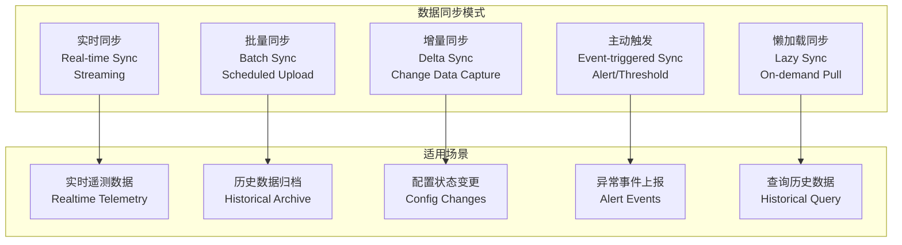

## 3.2 分级数据同步策略 (Tiered Data Sync Strategy)

```yaml
# 边缘数据分级同步策略配置
data_sync_policy:
  
  # 第一级: 实时告警 (毫秒~秒级)
  tier1_realtime:
    trigger: "阈值超限 / 异常检测"
    latency: "< 5 秒"
    data_types:
      - 设备告警
      - 安全事件
      - 系统错误
    protocol: "MQTT QoS=2 / WebSocket"
    retry_policy:
      max_retries: 5
      backoff: "exponential"
      
  # 第二级: 近实时遥测 (秒~分钟级)
  tier2_near_realtime:
    trigger: "时间驱动 (每10秒)"
    latency: "10-60 秒"
    data_types:
      - 关键传感器数据
      - 设备状态
      - 业务 KPI
    protocol: "MQTT QoS=1 / HTTPS POST"
    batch_size: 100  # 批量上报
    compression: "gzip"
    
  # 第三级: 周期性批量 (分钟~小时级)
  tier3_batch:
    trigger: "定时任务 (每5分钟)"
    latency: "5-60 分钟"
    data_types:
      - 聚合统计数据
      - 运行日志
      - 性能指标
    protocol: "HTTPS PUT / MinIO SDK"
    format: "Parquet"
    compression: "zstd"
    
  # 第四级: 离线归档 (小时~天级)
  tier4_archive:
    trigger: "低峰时间窗口 (凌晨2-6点)"
    data_types:
      - 历史原始数据
      - 视频片段
      - 审计日志
    protocol: "S3 Multipart Upload"
    format: "Parquet/Avro"
    lifecycle:
      local_delete_after: "30 days"

  # 断网期间缓冲策略
  offline_buffer:
    max_size: "10 GB"
    eviction_policy: "oldest-first"  # 满时删旧
    persistence: "SQLite / RocksDB"
    resume_on_reconnect: true
```

## 3.3 变更数据捕获 (Change Data Capture)

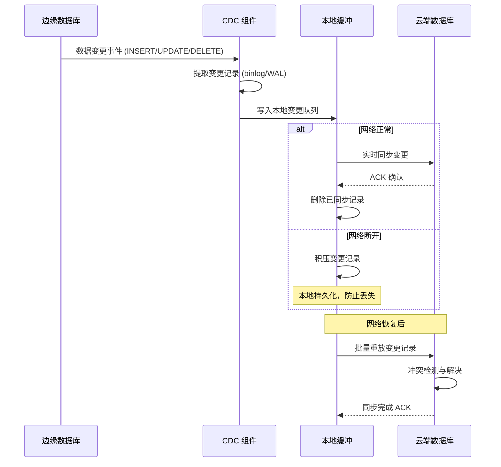

```python
# 边缘 CDC 实现 - 使用 Debezium Embedded
import debezium_embedded as debezium

class EdgeCDCSyncService:
    def __init__(self, config):
        self.local_db_url = config['local_db_url']
        self.cloud_endpoint = config['cloud_endpoint']
        self.buffer = LocalChangeBuffer(max_size_gb=5)
        self.cloud_client = CloudSyncClient(self.cloud_endpoint)
        
    def setup_cdc(self):
        """配置 CDC 监听本地数据库变更"""
        connector_config = {
            "name": "edge-postgres-connector",
            "connector.class": "io.debezium.connector.postgresql.PostgresConnector",
            "database.hostname": "localhost",
            "database.port": "5432",
            "database.user": "edge_cdc",
            "database.dbname": "edge_data",
            "table.include.list": "public.device_readings,public.events",
            "plugin.name": "pgoutput",
            "slot.name": "edge_cdc_slot",
            "publication.name": "edge_cdc_pub",
        }
        
        engine = debezium.create_engine(
            connector_config,
            change_consumer=self.handle_change
        )
        return engine
    
    def handle_change(self, records):
        """处理 CDC 变更记录"""
        for record in records:
            change = {
                "table": record.sourceInfo.table,
                "operation": record.operation.name,  # CREATE/UPDATE/DELETE
                "before": record.before,
                "after": record.after,
                "timestamp": record.timestamp,
                "lsn": record.sourceInfo.lsn,  # 日志序列号
            }
            
            # 写入本地缓冲
            self.buffer.append(change)
            
            # 尝试实时同步
            self.try_sync_to_cloud(change)
    
    def try_sync_to_cloud(self, change):
        """尝试将变更同步到云端"""
        try:
            response = self.cloud_client.sync_change(change)
            if response.success:
                self.buffer.acknowledge(change['lsn'])
        except NetworkError:
            # 网络失败，保留在缓冲中等待重试
            pass
    
    def replay_buffered_changes(self):
        """网络恢复后重放缓冲的变更"""
        pending = self.buffer.get_unsynced()
        for batch in chunks(pending, size=100):
            try:
                response = self.cloud_client.sync_batch(batch)
                if response.success:
                    self.buffer.acknowledge_batch(batch)
            except Exception as e:
                logger.error(f"重放失败: {e}")
                break
```

## 3.4 冲突解决策略 (Conflict Resolution Strategies)

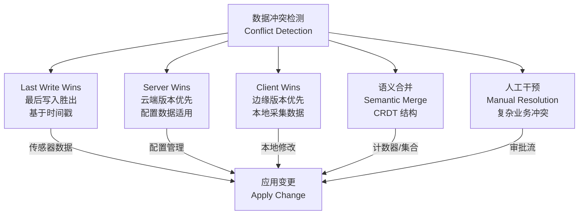

```go
// 向量时钟实现冲突检测
type VectorClock map[string]int64

func (vc VectorClock) HappensBefore(other VectorClock) bool {
    atLeastOne := false
    for nodeID, ts := range vc {
        if other[nodeID] < ts {
            return false  // vc 有更新的版本
        }
        if other[nodeID] > ts {
            atLeastOne = true
        }
    }
    return atLeastOne
}

func (vc VectorClock) IsConcurrent(other VectorClock) bool {
    return !vc.HappensBefore(other) && !other.HappensBefore(vc)
}

func (vc VectorClock) Merge(other VectorClock) VectorClock {
    result := VectorClock{}
    for k, v := range vc {
        result[k] = v
    }
    for k, v := range other {
        if result[k] < v {
            result[k] = v
        }
    }
    return result
}

// Last-Write-Wins 冲突解决
type LWWRegister struct {
    Value     interface{}
    Timestamp int64
    NodeID    string
    Clock     VectorClock
}

func (r *LWWRegister) Merge(other *LWWRegister) *LWWRegister {
    if r.Clock.IsConcurrent(other.Clock) {
        // 并发更新 - 使用时间戳决定
        if r.Timestamp >= other.Timestamp {
            return r
        }
        return other
    }
    
    if r.Clock.HappensBefore(other.Clock) {
        return other
    }
    return r
}
```

---

<!-- chunk: 4. 状态管理设计 -->## 4. 状态管理设计

## 4.1 期望状态 vs 实际状态 (Desired State vs Actual State)

[[Kubernetes|Kubernetes]]/KubeEdge 使用声明式 API 和控制器模式来管理边缘状态，这是云边协同的核心设计理念。

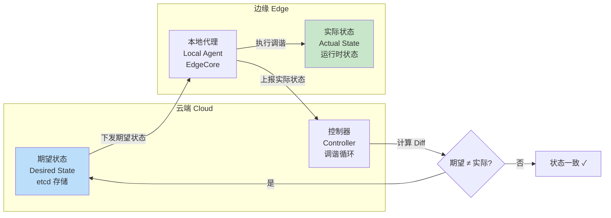

## 4.2 DeviceTwin 状态模型 (DeviceTwin State Model)

KubeEdge 的 DeviceTwin 是云边状态同步的核心机制：

```json
{
  "deviceId": "temperature-sensor-001",
  "twin": {
    "temperature": {
      "desired": {
        "value": "25",
        "metadata": {
          "type": "float",
          "unit": "celsius",
          "timestamp": 1704067200000
        }
      },
      "reported": {
        "value": "24.8",
        "metadata": {
          "type": "float",
          "unit": "celsius", 
          "timestamp": 1704067195000,
          "source": "hardware-sensor"
        }
      }
    },
    "fan_speed": {
      "desired": {
        "value": "high",
        "metadata": {
          "type": "string",
          "options": ["low", "medium", "high"]
        }
      },
      "reported": {
        "value": "medium"
      }
    }
  }
}
```

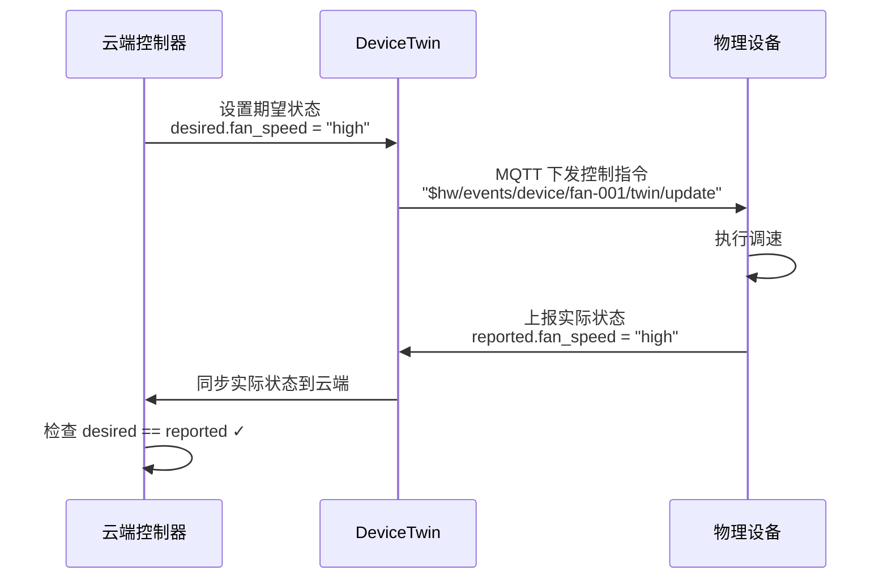

## 4.3 状态机设计 (State Machine Design)

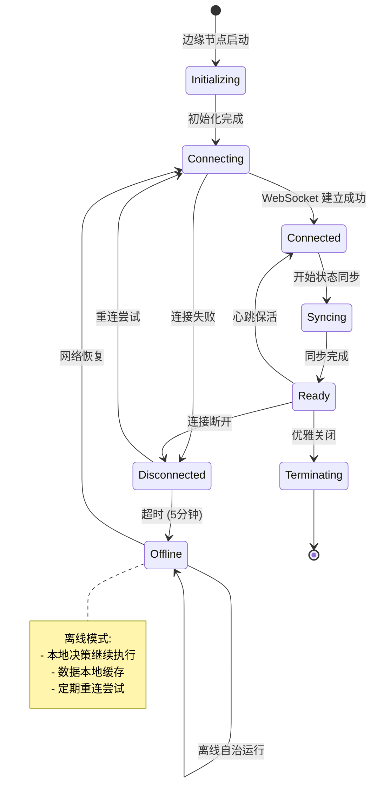

## 4.4 边缘状态持久化 (Edge State Persistence)

```go
// EdgeCore 本地状态存储 (使用 SQLite)
type LocalStateStore struct {
    db *sql.DB
}

// 存储 Pod 状态 (防止重启丢失)
func (s *LocalStateStore) SavePodState(pod *v1.Pod) error {
    data, _ := json.Marshal(pod)
    _, err := s.db.Exec(`
        INSERT OR REPLACE INTO pod_states (namespace, name, data, updated_at)
        VALUES (?, ?, ?, ?)
    `, pod.Namespace, pod.Name, data, time.Now().Unix())
    return err
}

// 存储 ConfigMap (离线使用)
func (s *LocalStateStore) SaveConfigMap(cm *v1.ConfigMap) error {
    data, _ := json.Marshal(cm)
    _, err := s.db.Exec(`
        INSERT OR REPLACE INTO config_maps (namespace, name, data, updated_at)
        VALUES (?, ?, ?, ?)
    `, cm.Namespace, cm.Name, data, time.Now().Unix())
    return err
}

// 获取本地缓存的 ConfigMap (离线时使用)
func (s *LocalStateStore) GetConfigMap(namespace, name string) (*v1.ConfigMap, error) {
    var data []byte
    err := s.db.QueryRow(`
        SELECT data FROM config_maps 
        WHERE namespace = ? AND name = ?
    `, namespace, name).Scan(&data)
    
    if err == sql.ErrNoRows {
        return nil, fmt.Errorf("ConfigMap not found in local cache")
    }
    
    var cm v1.ConfigMap
    json.Unmarshal(data, &cm)
    return &cm, nil
}
```

---

<!-- chunk: 5. 离线优先设计 -->## 5. 离线优先设计

## 5.1 离线优先原则 (Offline-First Principles)

```
离线优先设计的核心原则:

1. 本地优先 (Local First)
   - 所有写操作先写本地
   - 本地读写不依赖网络
   - 网络连接时再同步

2. 乐观更新 (Optimistic Updates)
   - 假设操作成功，立即反馈
   - 后台异步验证和同步
   - 失败时回滚+用户通知

3. 冲突感知 (Conflict Aware)
   - 预先设计冲突解决策略
   - 使用向量时钟追踪版本
   - CRDT 结构自动合并

4. 优雅降级 (Graceful Degradation)
   - 核心功能在离线时可用
   - 非核心功能优雅禁用
   - 用户明确知晓离线状态
```

## 5.2 YurtHub 离线缓存机制 (YurtHub Offline Cache)

[[OpenYurt|OpenYurt]] 的 YurtHub 实现了边缘节点离线时的本地 API 代理：

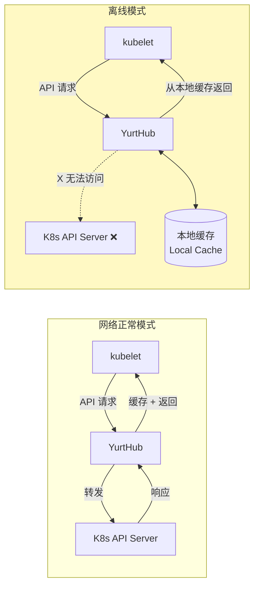

```go
// YurtHub 离线缓存核心逻辑 (简化)
type YurtHubProxy struct {
    localCacheManager LocalCacheManager
    cloudAPIServer    CloudAPIServer
    isConnected       atomic.Bool
}

func (p *YurtHubProxy) ServeHTTP(w http.ResponseWriter, r *http.Request) {
    if p.isConnected.Load() {
        // 在线模式: 透传到云端 API Server
        p.proxyToCloud(w, r)
    } else {
        // 离线模式: 从本地缓存服务
        p.serveFromCache(w, r)
    }
}

func (p *YurtHubProxy) proxyToCloud(w http.ResponseWriter, r *http.Request) {
    // 代理请求到云端
    resp, err := p.cloudAPIServer.Do(r)
    if err != nil {
        // 请求失败，回退到缓存
        p.serveFromCache(w, r)
        return
    }
    
    // 成功则更新本地缓存
    if r.Method == "GET" && resp.StatusCode == 200 {
        body, _ := io.ReadAll(resp.Body)
        p.localCacheManager.Store(r.URL.Path, body)
        w.Write(body)
    }
}

func (p *YurtHubProxy) serveFromCache(w http.ResponseWriter, r *http.Request) {
    // 只处理 GET 请求
    if r.Method != "GET" {
        // 非 GET 请求在离线时排队
        p.queueOfflineRequest(r)
        http.Error(w, "Service Unavailable (Offline Mode)", 503)
        return
    }
    
    cached, err := p.localCacheManager.Get(r.URL.Path)
    if err != nil {
        http.Error(w, "Not found in cache", 404)
        return
    }
    
    w.Header().Set("X-Cache", "HIT")
    w.Header().Set("X-Offline-Mode", "true")
    w.Write(cached)
}
```

## 5.3 离线业务连续性设计 (Offline Business Continuity)

```yaml
# 边缘应用离线能力配置
offline_capabilities:
  # 必须离线可用的核心功能
  core_functions:
    - name: "数据采集"
      offline_behavior: "继续采集，本地存储"
      max_buffer: "7 天数据"
      
    - name: "AI 推理"
      offline_behavior: "使用本地模型继续推理"
      model_update: "联网后自动更新"
      
    - name: "告警检测"
      offline_behavior: "本地规则引擎持续运行"
      notification: "本地声光告警 + 本地短信网关"
      
    - name: "设备控制"
      offline_behavior: "保持最后指令状态"
      fallback: "超时后进入安全模式"
      
  # 离线时降级的功能
  degraded_functions:
    - name: "实时云端看板"
      offline_behavior: "显示离线状态，展示本地缓存数据"
      
    - name: "跨站点数据聚合"
      offline_behavior: "不可用"
      
    - name: "模型热更新"
      offline_behavior: "延迟，联网后自动追赶"
      
  # 离线状态检测
  connectivity_check:
    interval: "30s"
    timeout: "5s"
    endpoints:
      - "https://cloud-api.company.com/healthz"
      - "8.8.8.8"  # DNS 检测
    threshold: 3  # 连续3次失败视为离线
```

## 5.4 本地规则引擎 (Local Rule Engine)

```yaml
# 边缘本地告警规则 (无需云端)
apiVersion: edge.company.com/v1alpha1
kind: EdgeRule
metadata:
  name: temperature-alert-rule
  namespace: edge-production
spec:
  # 数据源
  datasource:
    type: "mqtt"
    topic: "sensors/+/temperature"
    
  # 规则条件
  conditions:
    - field: "value"
      operator: ">"
      threshold: 85.0
      duration: "30s"  # 持续超过30秒才触发
      
  # 动作
  actions:
    - type: "alert"
      severity: "critical"
      message: "设备 {deviceId} 温度过高: {value}°C"
      channels:
        - type: "local-siren"     # 本地声光报警
        - type: "sms-gateway"     # 本地短信网关
        - type: "cloud-upload"    # 有网时上报云端
          offline_buffer: true    # 离线时缓冲
          
    - type: "control"
      target: "fan-controller-{zone}"
      command: "set_speed"
      params:
        speed: "max"
        
  # 恢复规则
  recovery:
    condition: "value < 75.0 for 60s"
    actions:
      - type: "alert-clear"
      - type: "control"
        command: "set_speed"
        params:
          speed: "normal"
```

---

<!-- chunk: 6. 最终一致性模式 -->## 6. 最终一致性模式

## 6.1 CAP 定理在云边场景的应用 (CAP Theorem in Cloud-Edge)

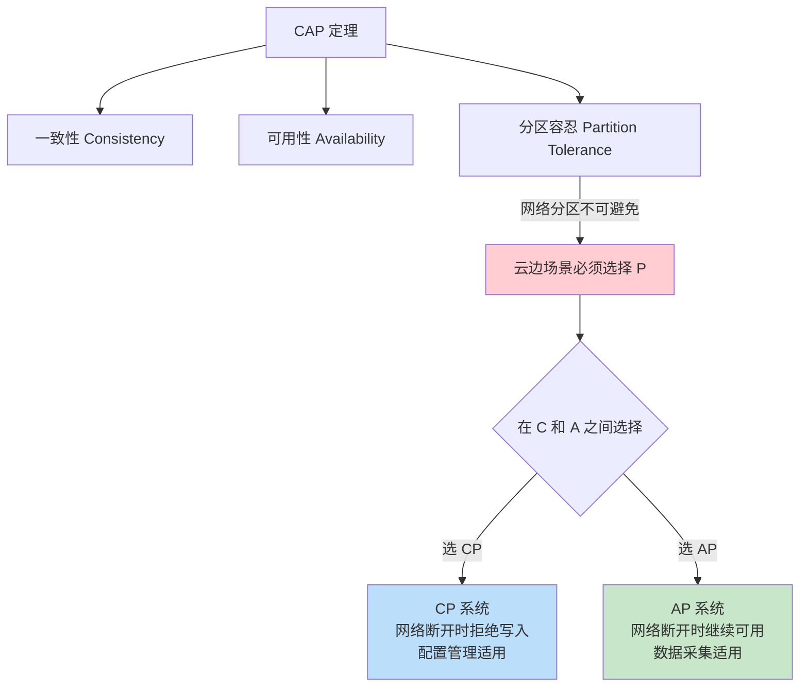

**云边协同的 PACELC 选择：**

```
场景                    选择         说明
───────────────────────────────────────────────────────
设备控制指令           CP          宁可拒绝，不能执行错误指令
设备遥测数据           AP          继续采集，允许数据暂时不一致
配置管理               CP          配置一致性优先
业务事件               AP          事件不丢失优先
全局库存计数           CP          准确性要求
本地操作日志           AP          可用性优先
```

## 6.2 CRDT 数据结构应用 (CRDT Applications)

CRDT（Conflict-free Replicated Data Types，无冲突复制数据类型）是实现最终一致性的强大工具：

```go
// G-Counter CRDT - 只增计数器 (适用于事件计数)
type GCounter struct {
    Counts map[string]int64  // nodeID -> count
}

func NewGCounter(nodeID string) *GCounter {
    return &GCounter{
        Counts: map[string]int64{nodeID: 0},
    }
}

func (c *GCounter) Increment(nodeID string) {
    c.Counts[nodeID]++
}

func (c *GCounter) Value() int64 {
    total := int64(0)
    for _, v := range c.Counts {
        total += v
    }
    return total
}

// Merge 操作是幂等的，可以反复执行
func (c *GCounter) Merge(other *GCounter) *GCounter {
    result := &GCounter{Counts: make(map[string]int64)}
    for k, v := range c.Counts {
        result.Counts[k] = v
    }
    for k, v := range other.Counts {
        if result.Counts[k] < v {
            result.Counts[k] = v
        }
    }
    return result
}

// PN-Counter CRDT - 可增可减计数器 (适用于库存计数)
type PNCounter struct {
    Increments GCounter
    Decrements GCounter
}

func (c *PNCounter) Value() int64 {
    return c.Increments.Value() - c.Decrements.Value()
}

func (c *PNCounter) Merge(other *PNCounter) *PNCounter {
    return &PNCounter{
        Increments: *c.Increments.Merge(&other.Increments),
        Decrements: *c.Decrements.Merge(&other.Decrements),
    }
}

// OR-Set CRDT - 可增可删集合 (适用于在线设备集合)
type ORSet struct {
    Additions map[string]map[string]bool  // item -> {uuid: true}
    Removals  map[string]map[string]bool  // item -> {uuid: true}
}

func (s *ORSet) Add(item string) {
    if s.Additions[item] == nil {
        s.Additions[item] = make(map[string]bool)
    }
    s.Additions[item][uuid.New().String()] = true
}

func (s *ORSet) Remove(item string) {
    // 移除所有当前的 additions (不影响未来 add)
    s.Removals[item] = s.Additions[item]
}

func (s *ORSet) Contains(item string) bool {
    for id := range s.Additions[item] {
        if !s.Removals[item][id] {
            return true
        }
    }
    return false
}
```

## 6.3 Saga 模式在云边事务 (Saga Pattern for Cloud-Edge Transactions)

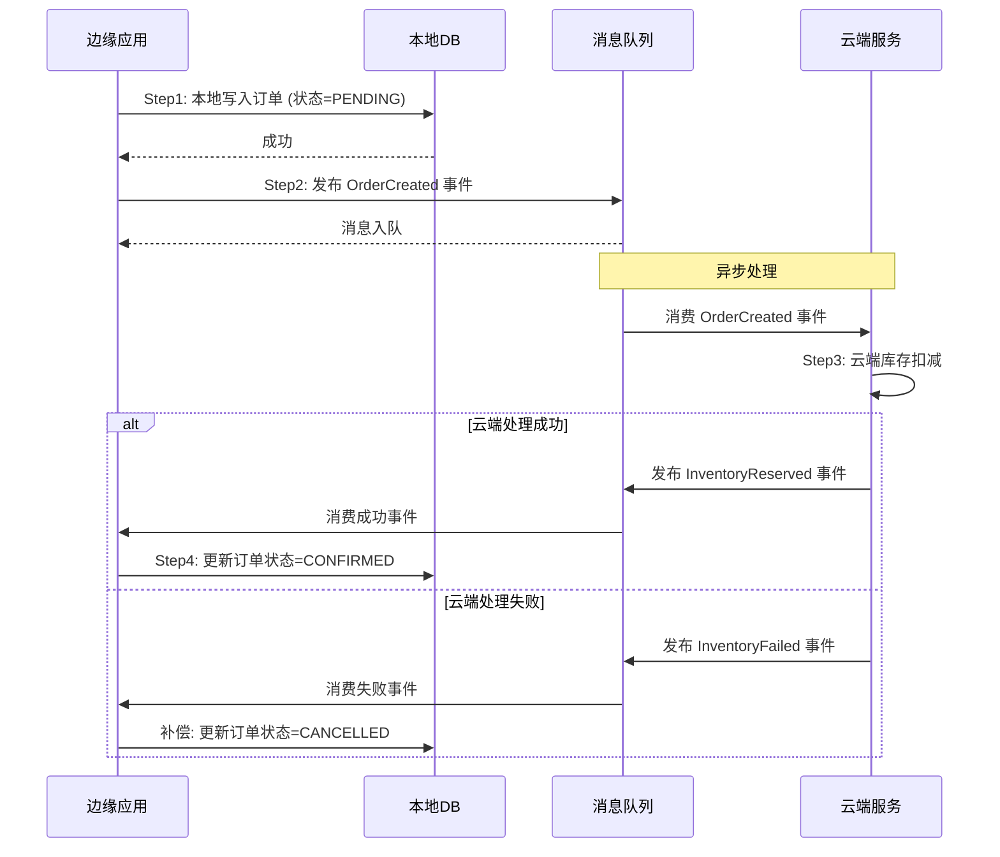

---

<!-- chunk: 7. 消息队列与事件驱动 -->## 7. 消息队列与事件驱动

## 7.1 边缘消息架构 (Edge Messaging Architecture)

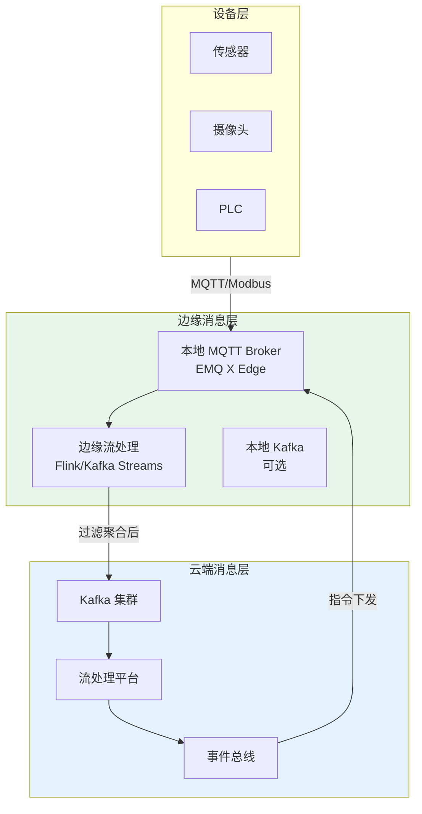

## 7.2 MQTT 边缘部署配置

```yaml
# EMQ X Edge 配置 (边缘 MQTT Broker)
# /etc/emqx/emqx.conf

# 基础配置
node:
  name: emqx@edge-site-001
  cookie: edge-secret-cookie
  
# 监听器
listeners:
  tcp:
    default:
      bind: "0.0.0.0:1883"
      max_connections: 10000
  ssl:
    default:
      bind: "0.0.0.0:8883"
      ssl_options:
        cacertfile: "/etc/emqx/certs/ca.pem"
        certfile: "/etc/emqx/certs/server.pem"
        keyfile: "/etc/emqx/certs/server-key.pem"
        verify: verify_peer
        
# 持久化配置 (离线缓冲)
session:
  session_expiry_interval: 2h
  max_subscriptions: 1000
  
# 消息持久化
retainer:
  enable: true
  storage_type: disc  # 磁盘持久化
  max_retained_messages: 10000
  
# 云端桥接 (网络正常时转发到云端)
bridges:
  mqtt:
    cloud_bridge:
      server: "ssl://cloud-mqtt.company.com:8883"
      clientid: "edge-bridge-001"
      username: "edge-bridge"
      password: "${EDGE_BRIDGE_PASSWORD}"
      ssl:
        cacertfile: "/etc/emqx/certs/cloud-ca.pem"
        certfile: "/etc/emqx/certs/edge-client.pem"
        keyfile: "/etc/emqx/certs/edge-client-key.pem"
      
      # 转发规则
      forwards:
        - "sensors/#"
        - "alerts/#"
      # 订阅云端主题
      subscriptions:
        - "commands/#"
        - "config/#"
        
      # 断线重连
      reconnect_interval: 10s
      retry_interval: 30s
      max_inflight: 32
      
      # 离线缓冲 (网络断开时本地缓存)
      queue:
        storage: disc
        max_total_size: 1GB
```

## 7.3 事件驱动边缘架构 (Event-Driven Edge Architecture)

```yaml
# CloudEvents 标准事件格式 (云边统一)
# 设备告警事件
specversion: "1.0"
id: "550e8400-e29b-41d4-a716-446655440000"
source: "edge/factory-a/sensor/temp-001"
type: "com.company.edge.device.alert"
datacontenttype: "application/json"
time: "2024-01-15T08:30:00Z"
edgeid: "factory-a"
severity: "critical"
data:
  deviceId: "temp-sensor-001"
  metric: "temperature"
  value: 92.5
  threshold: 85.0
  duration: "45s"
  location: "production-line-3"
```

```python
# 边缘事件处理器
from cloudevents.http import CloudEvent, from_json
import asyncio

class EdgeEventProcessor:
    def __init__(self):
        self.handlers = {}
        self.cloud_uploader = CloudEventUploader()
        self.local_store = LocalEventStore()
        
    def register(self, event_type: str, handler):
        self.handlers[event_type] = handler
        
    async def process(self, event_data: bytes):
        event = from_json(event_data)
        
        # 1. 本地处理
        handler = self.handlers.get(event['type'])
        if handler:
            await handler(event)
            
        # 2. 本地持久化
        await self.local_store.save(event)
        
        # 3. 尝试上报云端
        asyncio.create_task(
            self.upload_with_retry(event)
        )
    
    async def upload_with_retry(self, event: CloudEvent):
        for attempt in range(5):
            try:
                await self.cloud_uploader.upload(event)
                await self.local_store.mark_uploaded(event['id'])
                return
            except NetworkError:
                await asyncio.sleep(2 ** attempt)  # 指数退避
                
        # 上传失败，留在本地等待下次
        await self.local_store.mark_pending(event['id'])

# 注册事件处理器
processor = EdgeEventProcessor()

@processor.register("com.company.edge.device.alert")
async def handle_alert(event: CloudEvent):
    data = event.data
    if data['severity'] == 'critical':
        # 立即触发本地告警
        await local_alarm.trigger(data)
        # 控制设备降温
        await device_controller.execute({
            "device": f"fan-{data['location']}",
            "command": "set_speed_max"
        })
```

---

<!-- chunk: 8. 服务发现与负载均衡 -->## 8. 服务发现与负载均衡

## 8.1 边缘服务发现机制 (Edge Service Discovery)

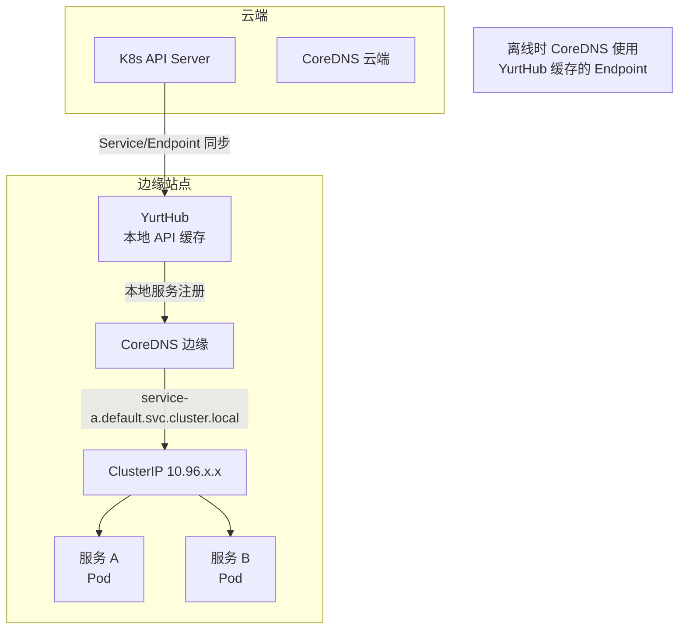

## 8.2 NodePool 服务拓扑感知 (NodePool Topology-Aware Routing)

OpenYurt NodePool 实现了边缘流量的拓扑感知路由：

```yaml
# OpenYurt NodePool 定义
apiVersion: apps.openyurt.io/v1beta1
kind: NodePool
metadata:
  name: factory-a-pool
spec:
  type: Edge
  annotations:
    apps.openyurt.io/nodepool-type: "edge"
  labels:
    apps.openyurt.io/nodepool: factory-a-pool
    location: factory-a
    region: north

---
# 拓扑感知 Service 配置
apiVersion: v1
kind: Service
metadata:
  name: data-collector
  annotations:
    # 优先访问同一 NodePool 的 Pod
    service.beta.kubernetes.io/topology-mode: "Auto"
spec:
  selector:
    app: data-collector
  ports:
  - port: 8080
    targetPort: 8080
  topologyKeys:
    - "apps.openyurt.io/nodepool"  # 优先同 NodePool
    - "kubernetes.io/hostname"      # 其次同节点
    - "*"                           # 最后全局
```

## 8.3 边缘 Ingress 配置 (Edge Ingress Configuration)

```yaml
# 边缘节点本地 Nginx Ingress
apiVersion: networking.k8s.io/v1
kind: Ingress
metadata:
  name: edge-local-ingress
  namespace: edge-production
  annotations:
    kubernetes.io/ingress.class: "nginx-edge"
    nginx.ingress.kubernetes.io/proxy-connect-timeout: "10"
    nginx.ingress.kubernetes.io/proxy-read-timeout: "60"
    # 离线友好: 启用本地缓存
    nginx.ingress.kubernetes.io/proxy-cache-valid: "200 302 10m"
    nginx.ingress.kubernetes.io/proxy-cache-valid: "404 1m"
spec:
  rules:
  - host: "edge-api.local"
    http:
      paths:
      - path: /api/v1
        pathType: Prefix
        backend:
          service:
            name: edge-api-service
            port:
              number: 8080
      - path: /dashboard
        pathType: Prefix
        backend:
          service:
            name: edge-dashboard
            port:
              number: 3000
  tls:
  - hosts:
    - edge-api.local
    secretName: edge-tls-secret
```

---

<!-- chunk: 9. 配置管理与分发 -->## 9. 配置管理与分发

## 9.1 GitOps 边缘配置管理 (GitOps for Edge)

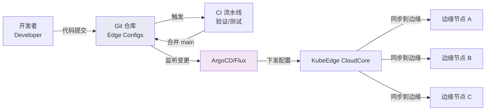

## 9.2 分层配置管理 (Hierarchical Config Management)

```
配置优先级 (低 → 高):

全局默认配置 (Global Defaults)
      ↓
区域配置覆盖 (Region Overrides)
      ↓
站点配置覆盖 (Site Overrides)
      ↓
节点配置覆盖 (Node Overrides)
      ↓
Pod 环境变量 (Pod Env Vars)  ← 最高优先级
```

```yaml
# 全局配置 (所有边缘节点继承)
# configmap: global-edge-config
apiVersion: v1
kind: ConfigMap
metadata:
  name: global-edge-config
  namespace: edge-system
  labels:
    config.edge.io/scope: "global"
data:
  log_level: "info"
  metrics_interval: "30s"
  cloud_sync_interval: "5m"
  local_retention_days: "7"

---
# 站点配置 (覆盖全局)
apiVersion: v1
kind: ConfigMap
metadata:
  name: factory-a-config
  namespace: edge-system
  labels:
    config.edge.io/scope: "site"
    config.edge.io/site: "factory-a"
data:
  log_level: "debug"  # 覆盖: 该站点需要更详细日志
  mqtt_broker: "mqtt://10.10.1.100:1883"
  opcua_server: "opc.tcp://10.10.1.200:4840"
  
---
# 使用 Kustomize 叠加配置
# kustomize/overlays/factory-a/kustomization.yaml
apiVersion: kustomize.config.k8s.io/v1beta1
kind: Kustomization

bases:
  - ../../base  # 引用基础配置

configMapGenerator:
  - name: edge-app-config
    behavior: merge  # 合并而非替换
    literals:
      - SITE_ID=factory-a
      - MQTT_BROKER=mqtt://10.10.1.100:1883

patches:
  - target: "`kind: Deployment`"
      name: edge-app
    patch: |-
      - op: replace
        path: /spec/replicas
        value: 2  # 该站点部署2副本
```

## 9.3 配置热重载 (Config Hot Reload)

```go
// 边缘应用配置热重载实现
type ConfigWatcher struct {
    configMapName string
    namespace     string
    kubeClient    kubernetes.Interface
    handlers      []func(newConfig map[string]string)
    currentConfig map[string]string
    mu            sync.RWMutex
}

func (w *ConfigWatcher) Watch(ctx context.Context) {
    watchInterface, _ := w.kubeClient.CoreV1().ConfigMaps(w.namespace).
        Watch(ctx, metav1.ListOptions{
            FieldSelector: fmt.Sprintf("metadata.name=%s", w.configMapName),
        })
    
    for {
        select {
        case event, ok := <-watchInterface.ResultChan():
            if !ok {
                // Watch 中断，重新建立
                w.Watch(ctx)
                return
            }
            
            if event.Type == watch.Modified {
                cm := event.Object.(*v1.ConfigMap)
                w.handleConfigChange(cm.Data)
            }
            
        case <-ctx.Done():
            return
        }
    }
}

func (w *ConfigWatcher) handleConfigChange(newData map[string]string) {
    w.mu.Lock()
    
    // 检测变更
    changed := false
    for k, v := range newData {
        if w.currentConfig[k] != v {
            changed = true
            break
        }
    }
    
    if !changed {
        w.mu.Unlock()
        return
    }
    
    w.currentConfig = newData
    w.mu.Unlock()
    
    // 通知所有处理器
    for _, handler := range w.handlers {
        go handler(newData)  // 异步通知，不阻塞 watch 循环
    }
    
    log.Printf("配置已热重载: %v", newData)
}
```

---

<!-- chunk: 10. 可观测性设计 -->## 10. 可观测性设计

## 10.1 云边可观测性架构 (Cloud-Edge Observability)

```mermaid
graph TB
    subgraph EdgeNode["边缘节点"]
        App[应用 Pod]
        NodeExporter[Node Exporter<br/>系统指标]
        Promtail[Promtail<br/>日志采集]
        OTelCollector[OTel Collector<br/>链路追踪]
        LocalProm[本地 Prometheus<br/>临时存储]
    end
    
    subgraph EdgePersist["边缘持久层"]
        LocalLoki[本地 Loki<br/>日志缓冲]
        LocalTempo[本地 Tempo<br/>追踪缓冲]
    end
    
    subgraph Cloud["云端可观测平台"]
        CloudProm[Prometheus<br/>长期指标]
        CloudLoki[Loki<br/>集中日志]
        CloudTempo[Tempo<br/>分布式追踪]
        Grafana[Grafana<br/>统一看板]
    end
    
    App --> OTelCollector
    NodeExporter --> LocalProm
    App --> Promtail
    
    LocalProm -->|Remote Write (批量)| CloudProm
    Promtail --> LocalLoki
    OTelCollector --> LocalTempo
    
    LocalLoki -->|批量上传| CloudLoki
    LocalTempo -->|批量上传| CloudTempo
    
    CloudProm --> Grafana
    CloudLoki --> Grafana
    CloudTempo --> Grafana
    
    style EdgeNode fill:#e8f5e9
    style Cloud fill:#e3f2fd
```

## 10.2 边缘指标采集配置 (Edge Metrics Collection)

```yaml
# Prometheus 边缘采集配置 (本地 Prometheus)
global:
  scrape_interval: 15s
  evaluation_interval: 15s
  
# 本地告警规则
rule_files:
  - "/etc/prometheus/edge_rules/*.yml"
  
# 采集配置
scrape_configs:
  # 边缘应用指标
  - job_name: 'edge-apps'
    kubernetes_sd_configs:
      - role: pod
        namespaces:
          names: ['edge-production']
    relabel_configs:
      - source_labels: [__meta_kubernetes_pod_annotation_prometheus_io_scrape]
        action: keep
        regex: true
        
  # 节点系统指标
  - job_name: 'node-exporter'
    static_configs:
      - targets: ['localhost:9100']
        
  # MQTT Broker 指标
  - job_name: 'emqx'
    static_configs:
      - targets: ['localhost:8081']
    metrics_path: '/api/v4/metrics'

# 远程写入到云端 (批量，节省带宽)
remote_write:
  - url: "https://prometheus.cloud.company.com/api/v1/write"
    remote_timeout: 30s
    queue_config:
      max_samples_per_send: 5000
      batch_send_deadline: 60s
      max_retries: 5
    write_relabel_configs:
      # 只上传重要指标，减少带宽
      - source_labels: [__name__]
        regex: "(edge_app|device|alert)_.*"
        action: keep
    tls_config:
      cert_file: /etc/prometheus/certs/client.pem
      key_file: /etc/prometheus/certs/client-key.pem
```

## 10.3 分布式追踪在云边 (Distributed Tracing)

```yaml
# OpenTelemetry Collector 边缘配置
receivers:
  otlp:
    protocols:
      grpc:
        endpoint: 0.0.0.0:4317
      http:
        endpoint: 0.0.0.0:4318

processors:
  batch:
    timeout: 10s
    send_batch_size: 512
    
  # 采样策略 (边缘资源有限，采样部分追踪)
  tail_sampling:
    decision_wait: 10s
    policies:
      - name: errors-policy
        type: status_code
        status_code:
          status_codes: [ERROR]
      - name: slow-traces
        type: latency
        latency:
          threshold_ms: 1000
      - name: sample-10pct
        type: probabilistic
        probabilistic:
          sampling_percentage: 10

exporters:
  # 本地存储 (离线时)
  file:
    path: /var/edge-traces/traces.json
    
  # 云端 Tempo (在线时)
  otlp:
    endpoint: "tempo.cloud.company.com:4317"
    tls:
      cert_file: /etc/otel/certs/client.pem
      key_file: /etc/otel/certs/client-key.pem
    retry_on_failure:
      enabled: true
      max_elapsed_time: 300s

service:
  pipelines:
    traces:
      receivers: [otlp]
      processors: [batch, tail_sampling]
      exporters: [file, otlp]
```

---

<!-- chunk: 11. 故障处理与恢复 -->## 11. 故障处理与恢复

## 11.1 问题分类与处理策略 (Failure Classification)

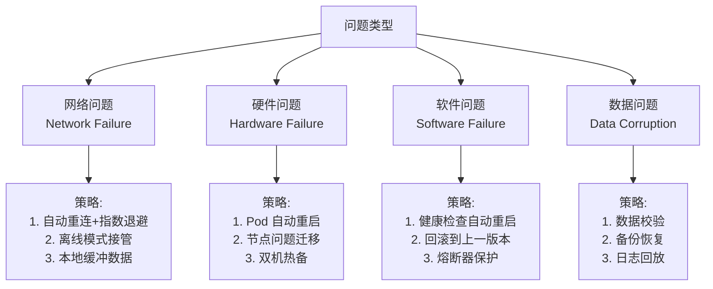

## 11.2 熔断器模式 (Circuit Breaker Pattern)

```go
// 边缘应用熔断器实现
type CircuitBreaker struct {
    name         string
    maxFailures  int
    timeout      time.Duration
    
    state        int32  // 0=Closed, 1=Open, 2=HalfOpen
    failures     int32
    lastFailure  time.Time
    mu           sync.Mutex
}

const (
    StateClosed   = 0
    StateOpen     = 1
    StateHalfOpen = 2
)

func (cb *CircuitBreaker) Execute(fn func() error) error {
    state := atomic.LoadInt32(&cb.state)
    
    switch state {
    case StateOpen:
        // 检查是否可以进入半开状态
        cb.mu.Lock()
        if time.Since(cb.lastFailure) > cb.timeout {
            atomic.StoreInt32(&cb.state, StateHalfOpen)
            cb.mu.Unlock()
        } else {
            cb.mu.Unlock()
            return fmt.Errorf("circuit breaker '%s' is OPEN", cb.name)
        }
        fallthrough
        
    case StateHalfOpen:
        // 半开状态: 允许一次试探
        err := fn()
        if err != nil {
            cb.recordFailure()
            return err
        }
        cb.reset()
        return nil
        
    default: // Closed
        err := fn()
        if err != nil {
            cb.recordFailure()
            return err
        }
        cb.resetFailureCount()
        return nil
    }
}

func (cb *CircuitBreaker) recordFailure() {
    cb.mu.Lock()
    defer cb.mu.Unlock()
    cb.lastFailure = time.Now()
    failures := atomic.AddInt32(&cb.failures, 1)
    if int(failures) >= cb.maxFailures {
        atomic.StoreInt32(&cb.state, StateOpen)
        log.Printf("熔断器 '%s' 已打开 (失败 %d 次)", cb.name, failures)
    }
}

// 使用熔断器调用云端 API
cloudCB := &CircuitBreaker{
    name:        "cloud-api",
    maxFailures: 5,
    timeout:     30 * time.Second,
}

err := cloudCB.Execute(func() error {
    return cloudClient.UploadData(data)
})
if err != nil {
    // 熔断时使用本地缓冲
    localBuffer.Append(data)
}
```

## 11.3 边缘节点自愈 (Edge Node Self-Healing)

```yaml
# 边缘节点健康检查与自愈配置
apiVersion: v1
kind: Pod
spec:
  containers:
  - name: edge-critical-service
    image: edge-service:v1.0
    
    # 启动探针 - 允许慢启动
    startupProbe:
      httpGet:
        path: /startup
        port: 8080
      failureThreshold: 30
      periodSeconds: 10
    
    # 存活探针 - 检测死锁/阻塞
    livenessProbe:
      httpGet:
        path: /healthz
        port: 8080
      initialDelaySeconds: 30
      periodSeconds: 10
      timeoutSeconds: 5
      failureThreshold: 3
      successThreshold: 1
      
    # 就绪探针 - 检测服务能力
    readinessProbe:
      httpGet:
        path: /ready
        port: 8080
      initialDelaySeconds: 5
      periodSeconds: 5
      failureThreshold: 3
    
    # 重启策略
  restartPolicy: Always
  
---
# 边缘节点 DaemonSet (每节点必须运行的服务)
apiVersion: apps/v1
kind: DaemonSet
metadata:
  name: edge-node-agent
spec:
  updateStrategy:
    type: RollingUpdate
    rollingUpdate:
      maxUnavailable: 1
  template:
    spec:
      tolerations:
      - operator: Exists  # 容忍所有 taint
      priorityClassName: system-node-critical  # 高优先级，不被驱逐
```

---

<!-- chunk: 12. 云边协同最佳实践 -->## 12. 云边协同最佳实践

## 12.1 设计原则总结 (Design Principles Summary)

```
╔══════════════════════════════════════════════════════════╗
║              云边协同设计原则                              ║
╠══════════════════════════════════════════════════════════╣
║ 1. 离线优先 (Offline-First)                              ║
║    边缘应用应假设网络随时可能中断                          ║
║    设计本地优先的数据流和决策逻辑                          ║
╠══════════════════════════════════════════════════════════╣
║ 2. 异步解耦 (Async Decoupling)                          ║
║    云边通信使用异步消息，避免强依赖                        ║
║    本地缓冲+重试+最终一致性                               ║
╠══════════════════════════════════════════════════════════╣
║ 3. 最小权限同步 (Minimal Sync)                          ║
║    只同步必要数据，减少带宽消耗                            ║
║    边缘聚合处理后上报摘要                                  ║
╠══════════════════════════════════════════════════════════╣
║ 4. 声明式配置 (Declarative Config)                      ║
║    使用 GitOps 管理配置变更                               ║
║    边缘节点自动调谐到期望状态                              ║
╠══════════════════════════════════════════════════════════╣
║ 5. 可观测性内置 (Observability Built-in)               ║
║    指标/日志/追踪三合一                                    ║
║    本地优先存储 + 批量上报云端                             ║
╠══════════════════════════════════════════════════════════╣
║ 6. 安全零信任 (Zero Trust Security)                     ║
║    mTLS 所有通信加密                                       ║
║    最小权限、网络隔离                                      ║
╚══════════════════════════════════════════════════════════╝
```

## 12.2 云边协同反模式 (Anti-Patterns)

```
❌ 反模式 1: 实时强一致性依赖
   问题: 边缘应用要求云端实时确认才执行操作
   后果: 网络抖动导致整体不可用
   解决: 使用乐观执行 + 事后同步

❌ 反模式 2: 大量小请求
   问题: 每个传感器数据点单独 HTTP 请求上报
   后果: 连接建立开销超过数据本身
   解决: 批量聚合后上报，MQTT 流式传输

❌ 反模式 3: 无状态边缘应用
   问题: 边缘 App 完全无本地持久化
   后果: 重启或断网后丢失数据和上下文
   解决: 设计本地状态持久化和恢复逻辑

❌ 反模式 4: 中心化服务发现
   问题: 边缘服务必须访问云端服务注册中心
   后果: 离线时服务互相找不到
   解决: 本地 DNS 缓存 + YurtHub 本地代理

❌ 反模式 5: 忽略时钟同步
   问题: 边缘节点时钟与云端不同步
   后果: 时序数据错乱，证书验证失败
   解决: NTP 时钟同步 + 容忍小时间偏差
```

## 12.3 云边协同参考实现架构

```yaml
# 完整云边协同参考架构
reference_architecture:
  
  cloud_components:
    control_plane:
      - kubernetes: "1.28+"
      - kubeedge_cloudcore: "1.15+"
      - argocd: "GitOps 配置管理"
    
    data_plane:
      - kafka: "消息总线 (事件驱动)"
      - clickhouse: "时序数据存储"
      - minio: "对象存储 (模型/数据)"
      - prometheus: "指标聚合"
      - loki: "日志聚合"
    
    ai_platform:
      - kubeflow: "ML 训练流水线"
      - mlflow: "模型管理"
      - triton: "模型推理服务"
  
  edge_components:
    runtime:
      - kubeedge_edgecore: "边缘运行时"
      - containerd: "容器运行时"
      - cni: "flannel/cilium"
    
    messaging:
      - emqx_edge: "本地 MQTT Broker"
      - kafka_edge: "可选本地 Kafka"
    
    storage:
      - sqlite: "元数据存储"
      - postgresql: "业务数据"
      - redis: "本地缓存"
    
    observability:
      - prometheus: "本地指标采集"
      - otel_collector: "追踪采集"
      - promtail: "日志采集"
    
    ai_inference:
      - triton_server: "模型推理"
      - onnx_runtime: "轻量推理"
  
  protocols:
    cloud_to_edge:
      control: "WebSocket over TLS 1.3"
      data: "HTTPS/gRPC"
    
    edge_to_device:
      iot: "MQTT 5.0"
      industrial: "OPC-UA, Modbus TCP"
      realtime: "本地总线 (Profinet/EtherCAT)"
```

---

<!-- chunk: 参考资料 (References) -->## 参考资料 (References)

- [KubeEdge 云边协同设计](https://kubeedge.io/docs/architecture/)
- [OpenYurt YurtHub 设计](https://openyurt.io/docs/core-concepts/yurthub/)
- [Martin Fowler - Offline First](https://martinfowler.com/articles/offline-first.html)
- [CRDT 论文 - Shapiro et al.](https://hal.inria.fr/inria-00555588)
- [Azure IoT Edge 设计模式](https://docs.microsoft.com/en-us/azure/iot-edge/patterns)
- [Google Distributed Cloud 架构](https://cloud.google.com/distributed-cloud/edge/latest/docs/overview)
- [CloudEvents 规范](https://cloudevents.io/)
- [Debezium CDC 文档](https://debezium.io/documentation/)

---

<!-- chunk: Obsidian 相关文档 -->## Obsidian 相关文档

- domain-37-edge-computing MOC
- [[domain-15-specialized-tech/README.md|Domain 15: 边缘计算 (Edge Computing)]]
- Domain-37 边缘计算 — 开源项目索引
- 边缘计算架构概述 (Edge Computing Architecture Overview)
- KubeEdge 架构与部署 (KubeEdge Architecture and Deployment)
- KubeEdge 设备管理与边缘应用 (KubeEdge Device Management and Edge Appl...
- OpenYurt 边缘方案 (OpenYurt Edge Solution)
- SuperEdge 架构实践 (SuperEdge Architecture Practice)
- 边缘 AI 推理与联邦学习 (Edge AI Inference and Federated Learning)
- 边缘存储与网络 (Edge Storage and Network)
- 边缘安全架构 (Edge Security Architecture)
- 边缘场景案例 (Edge Computing Use Cases)

## See Also

- 99-kubernetes-developer-toolchain-guide
- 01-edge-computing-architecture
- 03-kubeedge-architecture-deployment
- 04-kubeedge-device-edge-apps
