# [[KubeEdge|KubeEdge]] 架构与部署 (KubeEdge Architecture and Deployment)

<!-- chunk: 目录 (Table of Contents) -->## 目录 (Table of Contents)

1. [KubeEdge 概述](#1-kubeedge-概述)
2. [整体架构设计](#2-整体架构设计)
3. [CloudCore 组件详解](#3-cloudcore-组件详解)
4. [EdgeCore 组件详解](#4-edgecore-组件详解)
5. [通信机制](#5-通信机制)
6. [[entities/helm.md|Helm]] 部署](#6-helm-部署)
7. [keadm CLI 部署](#7-keadm-cli-部署)
8. [高可用部署](#8-高可用部署)
9. [配置详解](#9-配置详解)
10. [证书管理](#10-证书管理)
11. [网络配置](#11-网络配置)
12. [升级与维护](#12-升级与维护)

---

<!-- chunk: 1. KubeEdge 概述 -->## 1. KubeEdge 概述

#<!-- chunk: 1.1 项目简介 (Project Overview) -->## 1.1 项目简介 (Project Overview)

KubeEdge 是一个开源的边缘计算框架，构建在 [[Kubernetes|Kubernetes]] 之上，将容器化应用的编排能力扩展到边缘节点。由华为发起，2019 年进入 CNCF Sandbox，2022 年晋升为 CNCF Incubating 项目。

```
KubeEdge 核心能力:

┌────────────────────────────────────────────────┐
│  Kubernetes 原生  │  复用 K8s API 和生态工具     │
├────────────────────────────────────────────────┤
│  边缘自治         │  网络断开时边缘继续运行       │
├────────────────────────────────────────────────┤
│  设备管理         │  原生支持 IoT 设备 CRD        │
├────────────────────────────────────────────────┤
│  轻量化           │  EdgeCore ~70MB RAM          │
├────────────────────────────────────────────────┤
│  流式数据         │  Mapper 框架 + MQTT 集成      │
├────────────────────────────────────────────────┤
│  多架构           │  x86/ARM32/ARM64/RISC-V      │
└────────────────────────────────────────────────┘
```

#<!-- chunk: 1.2 版本信息 (Version Information) -->## 1.2 版本信息 (Version Information)

| KubeEdge 版本 | 支持 K8s 版本 | 主要特性 |
|-------------|------------|---------|
| v1.15 (2024) | v1.26-v1.28 | EdgeMesh GA, Mapper Framework v2 |
| v1.14 (2023) | v1.25-v1.27 | 节点分组, 镜像预拉取 |
| v1.13 (2023) | v1.24-v1.26 | 边缘 Kube-API 访问, OTA 升级 |
| v1.12 (2022) | v1.23-v1.25 | 边缘 Node 日志查询 |
| v1.11 (2022) | v1.22-v1.24 | CNCF Incubating, 边缘 exec/logs |

#<!-- chunk: 1.3 与标准 K8s 的差异 (Differences from Standard K8s) -->## 1.3 与标准 K8s 的差异 (Differences from Standard K8s)

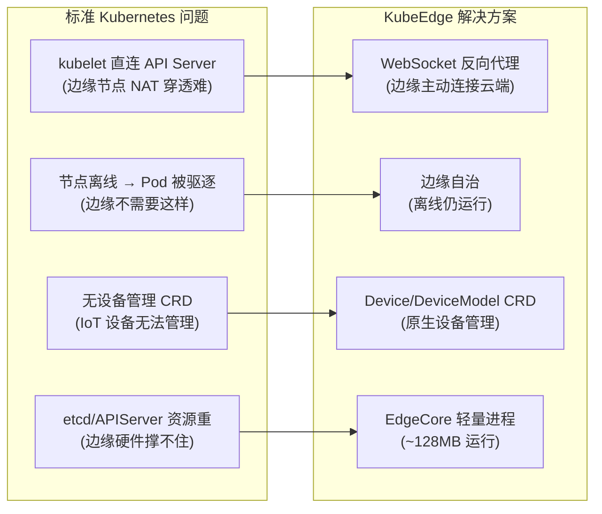

---

<!-- chunk: 2. 整体架构设计 -->## 2. 整体架构设计

#<!-- chunk: 2.1 KubeEdge 完整架构图 -->## 2.1 KubeEdge 完整架构图

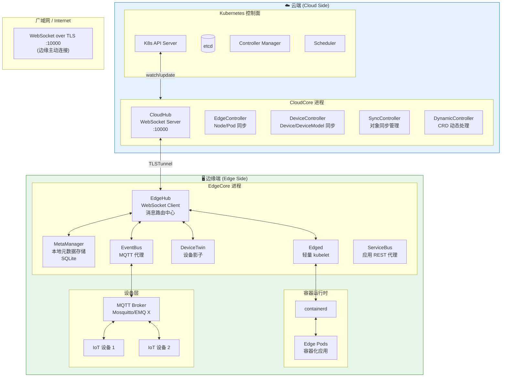

#<!-- chunk: 2.2 消息流架构 (Message Flow Architecture) -->## 2.2 消息流架构 (Message Flow Architecture)

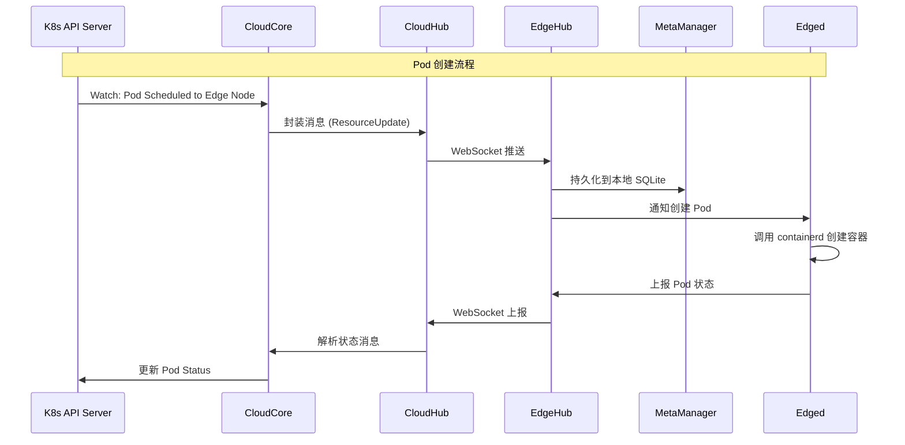

---

<!-- chunk: 3. CloudCore 组件详解 -->## 3. CloudCore 组件详解

#<!-- chunk: 3.1 CloudHub (云端通信中枢) -->## 3.1 CloudHub (云端通信中枢)

CloudHub 是 CloudCore 的核心通信组件，负责管理与所有边缘节点的 WebSocket 连接。

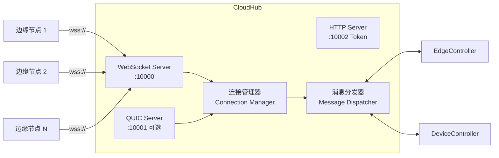

**CloudHub 关键配置：**

```yaml
# CloudCore 配置文件
apiVersion: cloudcore.config.kubeedge.io/v1alpha2
kind: CloudCore
commonConfig:
  monitorServer:
    bindAddress: 0.0.0.0:9091
    
modules:
  cloudHub:
    advertiseAddress:
      - "1.2.3.4"      # 公网 IP 或域名
    https:
      enable: true
      address: 0.0.0.0
      port: 10002      # Token 服务端口
    websocket:
      enable: true
      address: 0.0.0.0
      port: 10000      # 边缘节点连接端口
      writeDeadline: 15  # 写超时 (秒)
      readDeadline: 15   # 读超时 (秒)
    quic:
      enable: false    # QUIC 传输 (实验性)
      address: 0.0.0.0
      port: 10001
      maxIncomingStreams: 10000
    
    # 消息队列
    nodeLimit: 100     # 每个 CloudHub 最大边缘节点数
    tlsCaFile: /etc/kubeedge/ca/rootCA.crt
    tlsCertFile: /etc/kubeedge/certs/server.crt
    tlsPrivateKeyFile: /etc/kubeedge/certs/server.key
```

#<!-- chunk: 3.2 EdgeController (边缘控制器) -->## 3.2 EdgeController (边缘控制器)

EdgeController 负责在 K8s API Server 和边缘节点之间同步资源状态：

```go
// EdgeController 核心逻辑 (简化)
type EdgeController struct {
    kubeClient    kubernetes.Interface
    messageLayer  messagelayer.MessageLayer
    
    // 下行: 云端 → 边缘
    podsSynced     cache.InformerSynced
    nodesSynced    cache.InformerSynced
    configSynced   cache.InformerSynced
    secretSynced   cache.InformerSynced
    servicesSynced cache.InformerSynced
    endpointsSynced cache.InformerSynced
}

// 监听 Pod 变化，同步到边缘
func (ec *EdgeController) watchPods() {
    podInformer.AddEventHandler(cache.ResourceEventHandlerFuncs{
        AddFunc: func(obj interface{}) {
            pod := obj.(*v1.Pod)
            if isEdgePod(pod) {
                ec.sendPodToEdge(pod, model.InsertOperation)
            }
        },
        UpdateFunc: func(oldObj, newObj interface{}) {
            newPod := newObj.(*v1.Pod)
            if isEdgePod(newPod) {
                ec.sendPodToEdge(newPod, model.UpdateOperation)
            }
        },
        DeleteFunc: func(obj interface{}) {
            pod := obj.(*v1.Pod)
            if isEdgePod(pod) {
                ec.sendPodToEdge(pod, model.DeleteOperation)
            }
        },
    })
}

// 同步资源类型
var syncedResources = []string{
    "pods",
    "configmaps",
    "secrets",
    "services",
    "endpoints",
    "persistentvolumes",
    "persistentvolumeclaims",
}
```

#<!-- chunk: 3.3 DeviceController (设备控制器) -->## 3.3 DeviceController (设备控制器)

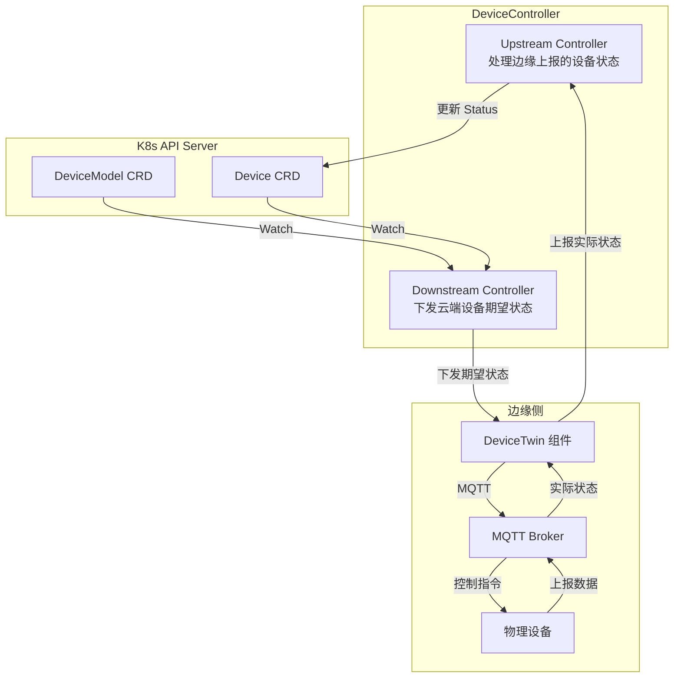

#<!-- chunk: 3.4 SyncController (同步控制器) -->## 3.4 SyncController (同步控制器)

SyncController 负责管理边缘节点对象的可靠同步，处理网络中断后的重新同步：

```yaml
# SyncController 配置
modules:
  syncController:
    enable: true
    # 对象同步策略
    objectSyncStrategy:
      clusterObjectSyncName: "edge-cluster-sync"
      # 每隔多久检查一次同步状态
      syncRetryInterval: 60s
      # 最大重试次数
      maxRetries: 3
```

---

<!-- chunk: 4. EdgeCore 组件详解 -->## 4. EdgeCore 组件详解

#<!-- chunk: 4.1 EdgeHub (边缘通信中枢) -->## 4.1 EdgeHub (边缘通信中枢)

EdgeHub 是 EdgeCore 的通信核心，维护与 CloudCore 的 WebSocket 连接：

```go
// EdgeHub 核心功能
type EdgeHub struct {
    controller *hubv1.EdgeHubController
    
    // 与 CloudCore 的连接
    cloudClient websocket.Client
    
    // 内部消息路由
    routeTable map[string]chan model.Message
}

// EdgeHub 连接维护
func (e *EdgeHub) Run() {
    for {
        // 建立连接
        if err := e.connectToCloud(); err != nil {
            log.Error("连接 CloudCore 失败:", err)
            time.Sleep(e.reconnectInterval)
            continue
        }
        
        // 并行处理: 接收消息 + 发送消息 + 心跳
        go e.receiveMessages()
        go e.sendMessages()
        go e.keepAlive()
        
        // 等待断开
        <-e.done
        log.Info("连接断开，准备重连")
    }
}

// 消息路由到内部模块
func (e *EdgeHub) routeMessage(msg model.Message) {
    switch msg.GetGroup() {
    case "resource":
        e.routeTable["meta"] <- msg     // → MetaManager
    case "twin":
        e.routeTable["twin"] <- msg     // → DeviceTwin
    case "func":
        e.routeTable["bus"] <- msg      // → ServiceBus
    case "user":
        e.routeTable["event"] <- msg    // → EventBus
    }
}
```

**EdgeHub 配置：**

```yaml
modules:
  edgeHub:
    enable: true
    heartbeat: 15        # 心跳间隔 (秒)
    projectID: e632aba927ea4ac2b575ec1603d56f10
    token: ""            # 由 keadm 自动填充
    
    httpServer: "https://1.2.3.4:10002"    # CloudCore HTTPS
    
    websocket:
      enable: true
      server: "1.2.3.4:10000"             # CloudCore WebSocket
      handshakeTimeout: 30
      writeDeadline: 15
      readDeadline: 15
      
    quic:
      enable: false
      server: "1.2.3.4:10001"
      handshakeTimeout: 30
      
    tls:
      enable: true
      tlsCaFile: /etc/kubeedge/ca/rootCA.crt
      tlsCertFile: /etc/kubeedge/certs/server.crt
      tlsPrivateKeyFile: /etc/kubeedge/certs/server.key
```

#<!-- chunk: 4.2 MetaManager (元数据管理器) -->## 4.2 MetaManager (元数据管理器)

MetaManager 负责在边缘节点本地持久化 Kubernetes 资源对象，实现离线自治：

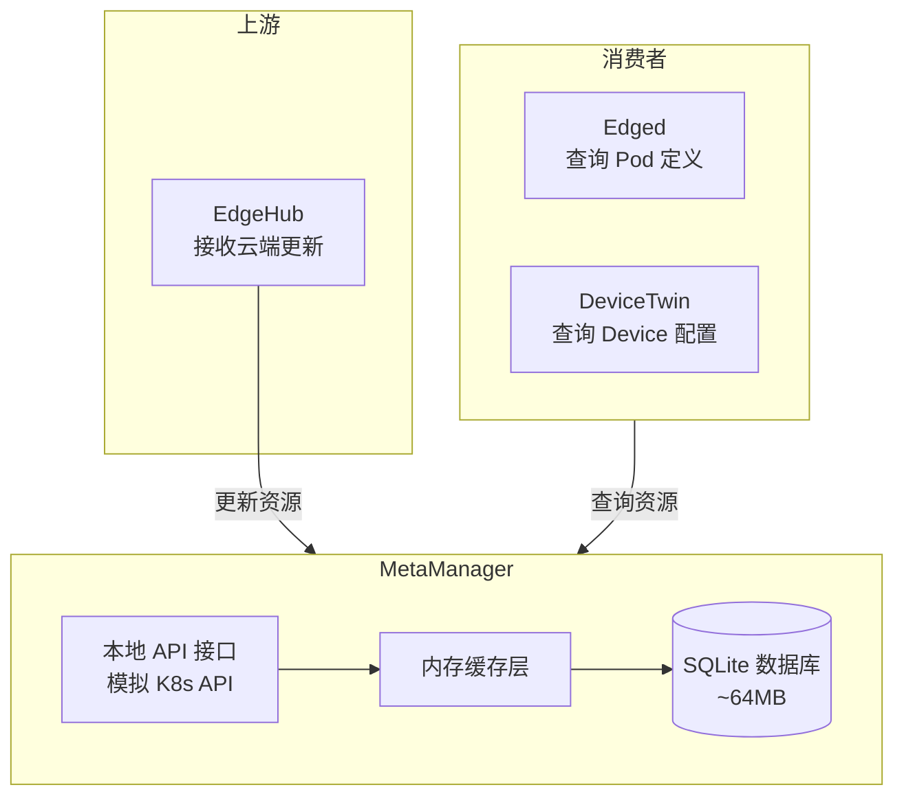

**MetaManager 存储的资源类型：**

```
SQLite 表: meta
├── Namespace
├── Pod (spec + status)
├── ConfigMap
├── Secret
├── Service
├── Endpoints
├── PersistentVolume
├── PersistentVolumeClaim
├── Device
└── DeviceModel
```

```go
// MetaManager 数据库 Schema
const createMetaTable = `
CREATE TABLE IF NOT EXISTS meta (
    key         TEXT    NOT NULL,        -- 资源唯一键 (group/version/namespace/name)
    type        TEXT    NOT NULL,        -- 资源类型
    value       TEXT    NOT NULL,        -- JSON 序列化的资源对象
    PRIMARY KEY (key, type)
);
`

// 资源键格式
// Pod: "v1/pods/{namespace}/{name}"
// ConfigMap: "v1/configmaps/{namespace}/{name}"
// Device: "devices.kubeedge.io/v1alpha2/devices/{namespace}/{name}"
```

#<!-- chunk: 4.3 Edged (轻量化 kubelet) -->## 4.3 Edged (轻量化 kubelet)

Edged 是 KubeEdge 对 kubelet 的精简实现，去掉了边缘不需要的功能：

```
Edged vs 标准 kubelet 对比:

功能                  kubelet         Edged
───────────────────────────────────────────
Pod 生命周期管理       ✅              ✅
资源限制 (cgroup)      ✅              ✅
健康检查 (probe)       ✅              ✅
Volume 挂载            ✅              ✅ (部分)
Image 拉取             ✅              ✅
节点状态上报           ✅              ✅ (via EdgeHub)
直连 API Server        ✅              ❌ (通过 EdgeHub)
Cloud Provider         ✅              ❌ (不需要)
Volume Plugin 全集     ✅              精简 (hostPath/emptyDir/configmap/secret)
cAdvisor               ✅              ✅ (精简)
Node 扩展资源          ✅              ✅
GPU 支持               ✅              ✅ (via device plugin)
```

```yaml
# Edged 配置
modules:
  edged:
    enable: true
    
    # 基础配置
    hostnameOverride: "edge-node-001"
    nodeIP: "192.168.1.100"
    
    # 容器运行时
    containerRuntimeEndpoint: "unix:///run/containerd/containerd.sock"
    imageServiceEndpoint: "unix:///run/containerd/containerd.sock"
    runtimeType: "remote"
    
    # 镜像
    podSandboxImage: "kubeedge/pause:3.6"
    imageGCHighThreshold: 80
    imageGCLowThreshold: 40
    
    # 资源
    nodeStatusUpdateFrequency: 10s
    
    # 根证书
    rootDirectory: "/var/lib/edged"
    
    # CNI 配置 (可选)
    networkPluginName: "flannel"
    cniConfDir: "/etc/cni/net.d"
    cniBinDir: "/opt/cni/bin"
    
    # 资源 GC
    minimumGCAge: 0s
    maxPerPodContainerCount: 1
    maxContainerCount: -1
```

#<!-- chunk: 4.4 DeviceTwin (设备影子) -->## 4.4 DeviceTwin (设备影子)

DeviceTwin 是 KubeEdge 的核心创新，实现云端设备期望状态和边缘实际状态的双向同步：

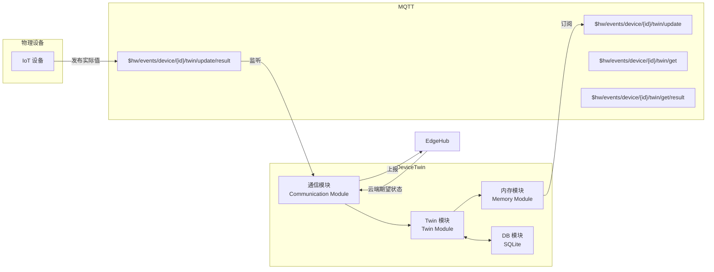

#<!-- chunk: 4.5 EventBus (事件总线) -->## 4.5 EventBus (事件总线)

EventBus 作为 MQTT 消息的代理，连接边缘应用和物理设备：

```yaml
# EventBus 配置
modules:
  eventBus:
    enable: true
    
    # 内置 MQTT Broker (可选)
    mqttMode: 0  # 0=内置 Broker, 1=外部 Broker, 2=内外部都用
    
    # 外部 MQTT Broker 配置
    mqttServer: "tcp://127.0.0.1:1883"
    mqttSessionQueueSize: 100
    mqttQOS: 0
    mqttRetain: false
    
    # 内置 Broker 配置
    mqttServerExternal: "tcp://127.0.0.1:1883"
    mqttServerInternal: "tcp://127.0.0.1:1884"
    
    # TLS 配置
    tls:
      enable: false
```

#<!-- chunk: 4.6 ServiceBus (服务总线) -->## 4.6 ServiceBus (服务总线)

ServiceBus 使云端应用能够调用边缘应用的 HTTP API：

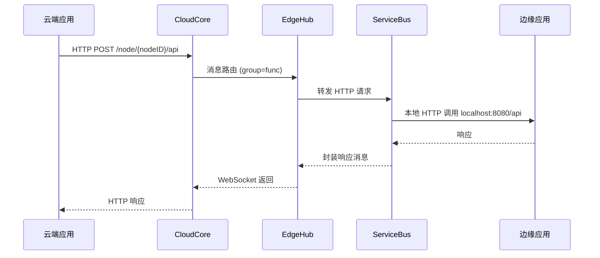

---

<!-- chunk: 5. 通信机制 -->## 5. 通信机制

#<!-- chunk: 5.1 消息格式 (Message Format) -->## 5.1 消息格式 (Message Format)

KubeEdge 使用统一的消息格式进行云边通信：

```json
{
  "header": {
    "id": "550e8400-e29b-41d4-a716-446655440000",
    "parentID": "",
    "timestamp": 1704067200000,
    "resourceVersion": 5,
    "syncFlag": false
  },
  "router": {
    "source": "edgecontroller",
    "destination": "edgehub",
    "group": "resource",
    "operation": "response"
  },
  "content": {
    "apiVersion": "v1",
    "kind": "Pod",
    "metadata": {
      "name": "nginx",
      "namespace": "default"
    },
    "spec": {
      "containers": [...]
    }
  }
}
```

#<!-- chunk: 5.2 双向通信流 (Bidirectional Communication) -->## 5.2 双向通信流 (Bidirectional Communication)

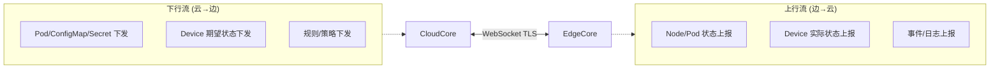

#<!-- chunk: 5.3 消息可靠性保证 (Message Reliability) -->## 5.3 消息可靠性保证 (Message Reliability)

```go
// KubeEdge 消息队列实现
type MessageQueue struct {
    // 已发送未确认消息
    inflight map[string]*Message
    // 待发送队列
    pending  chan *Message
    // 确认信道
    ack      chan string
    mu       sync.Mutex
}

func (q *MessageQueue) Send(msg *Message) error {
    // 持久化消息 (防止进程重启丢失)
    if err := q.persist(msg); err != nil {
        return err
    }
    
    q.mu.Lock()
    q.inflight[msg.GetID()] = msg
    q.mu.Unlock()
    
    q.pending <- msg
    return nil
}

func (q *MessageQueue) Ack(msgID string) {
    q.mu.Lock()
    delete(q.inflight, msgID)
    q.mu.Unlock()
    
    // 从持久化存储删除
    q.removePersisted(msgID)
}

// 重连后重发未确认消息
func (q *MessageQueue) ResendOnReconnect() {
    q.mu.Lock()
    defer q.mu.Unlock()
    
    for _, msg := range q.inflight {
        log.Printf("重发消息: %s", msg.GetID())
        q.pending <- msg
    }
}
```

---

<!-- chunk: 6. Helm 部署 -->## 6. Helm 部署

#<!-- chunk: 6.1 前置条件 (Prerequisites) -->## 6.1 前置条件 (Prerequisites)

```bash
# 1. 确认 Kubernetes 集群版本
kubectl version --short
# Server Version: v1.28.x

# 2. 安装 Helm 3.x
curl https://raw.githubusercontent.com/helm/helm/main/scripts/get-helm-3 | bash
helm version

# 3. 添加 KubeEdge Helm 仓库
helm repo add kubeedge https://kubeedge.io/charts
helm repo update

# 4. 查看可用版本
helm search repo kubeedge/cloudcore --versions
```

#<!-- chunk: 6.2 CloudCore Helm 安装 -->## 6.2 CloudCore Helm 安装

```bash
# 创建命名空间
kubectl create namespace kubeedge

# 生成证书 (重要!)
# 方式1: 自动生成
helm install cloudcore kubeedge/cloudcore \
  --namespace kubeedge \
  --set cloudCore.modules.cloudHub.advertiseAddress[0]="1.2.3.4" \
  --set global.certManager.enabled=false

# 方式2: 使用自定义证书
helm install cloudcore kubeedge/cloudcore \
  --namespace kubeedge \
  --set cloudCore.modules.cloudHub.advertiseAddress[0]="edge.company.com" \
  --set global.certManager.enabled=false \
  --set-file global.cloudHub.caCert=/path/to/ca.crt \
  --set-file global.cloudHub.certFile=/path/to/server.crt \
  --set-file global.cloudHub.keyFile=/path/to/server.key
```

#<!-- chunk: 6.3 完整 Helm values 配置 -->## 6.3 完整 Helm values 配置

```yaml
# values-production.yaml

# 全局配置
global:
  cloudHub:
    # 边缘节点连接 CloudCore 的地址
    advertiseAddress:
      - "edge.company.com"
    
  # 证书配置 (建议使用自签 CA)
  certManager:
    enabled: false

# CloudCore 配置
cloudCore:
  # 副本数 (生产建议 2)
  replicaCount: 2
  
  image:
    repository: kubeedge/cloudcore
    tag: "v1.15.0"
    pullPolicy: IfNotPresent
  
  # 资源配置
  resources:
    requests:
      cpu: "100m"
      memory: "256Mi"
    limits:
      cpu: "2000m"
      memory: "1Gi"
  
  # 服务配置
  service:
    type: NodePort          # 生产可改为 LoadBalancer
    cloudhubNodePort: 30000 # WebSocket
    cloudhubHttpsNodePort: 30002 # HTTPS Token
    cloudhubQuicNodePort: 30001  # QUIC (可选)
  
  # 模块配置
  modules:
    cloudHub:
      enable: true
      websocket:
        enable: true
        port: 10000
      https:
        enable: true
        port: 10002
      
    cloudStream:
      enable: true      # 支持 kubectl logs/exec
      streamPort: 10003
      tlsStreamCAFile: /etc/kubeedge/ca/streamCA.crt
      tlsStreamCertFile: /etc/kubeedge/certs/stream.crt
      tlsStreamPrivateKeyFile: /etc/kubeedge/certs/stream.key
      
    router:
      enable: true      # 支持消息路由规则
      restPort: 9443
      
  # 持久化 (证书等)
  persistentVolumeClaim:
    storageClass: "standard"
    storage: "1Gi"
    
  # 亲和性 (避免单点)
  affinity:
    podAntiAffinity:
      preferredDuringSchedulingIgnoredDuringExecution:
      - weight: 100
        podAffinityTerm:
          labelSelector:
            matchExpressions:
            - key: app
              operator: In
              values:
              - cloudcore
          topologyKey: "kubernetes.io/hostname"
          
  # 健康检查
  livenessProbe:
    initialDelaySeconds: 30
    periodSeconds: 10
    
  readinessProbe:
    initialDelaySeconds: 10
    periodSeconds: 5

# EdgeCore Installer (DaemonSet, 可选)
# 通常 EdgeCore 在边缘手动安装
iptablesManager:
  enabled: true
  mode: "external"
```

```bash
# 使用自定义 values 安装
helm install cloudcore kubeedge/cloudcore \
  --namespace kubeedge \
  -f values-production.yaml

# 查看安装状态
helm status cloudcore -n kubeedge
kubectl get pods -n kubeedge
kubectl get svc -n kubeedge

# 获取 Token (边缘节点加入需要)
kubectl get secret tokensecret -n kubeedge -o jsonpath='{.data.tokendata}' | base64 -d
```

#<!-- chunk: 6.4 验证 CloudCore 部署 -->## 6.4 验证 CloudCore 部署

```bash
# 检查 Pod 状态
kubectl get pods -n kubeedge -l app=cloudcore
# NAME                          READY   STATUS    RESTARTS   AGE
# cloudcore-7d9f5b6c8d-abc12   1/1     Running   0          5m

# 检查 Service
kubectl get svc -n kubeedge
# NAME        TYPE       CLUSTER-IP   EXTERNAL-IP  PORT(S)
# cloudcore   NodePort   10.96.x.x    <none>       10000:30000/TCP,...

# 检查日志
kubectl logs -n kubeedge -l app=cloudcore -f

# 测试 WebSocket 连接
curl -k https://1.2.3.4:10002/ca.crt  # 获取 CA 证书
```

---

<!-- chunk: 7. keadm CLI 部署 -->## 7. keadm CLI 部署

#<!-- chunk: 7.1 keadm 安装 (keadm Installation) -->## 7.1 keadm 安装 (keadm Installation)

```bash
# 下载 keadm (在需要部署的节点上执行)
VERSION="v1.15.0"
ARCH="amd64"  # 或 arm64, arm

# Linux x86_64
curl -LO "https://github.com/kubeedge/kubeedge/releases/download/${VERSION}/keadm-${VERSION}-linux-${ARCH}.tar.gz"
tar -xzf keadm-${VERSION}-linux-${ARCH}.tar.gz
sudo install keadm-${VERSION}-linux-${ARCH}/keadm /usr/local/bin/

# 验证安装
keadm version
```

#<!-- chunk: 7.2 CloudCore 部署 (keadm init) -->## 7.2 CloudCore 部署 (keadm init)

```bash
# 在云端 Kubernetes 节点上部署 CloudCore

# 基础安装
keadm init \
  --advertise-address="1.2.3.4" \
  --profile version=v1.15.0 \
  --kube-config=/root/.kube/config

# 高级安装 (自定义配置)
keadm init \
  --advertise-address="edge.company.com" \
  --profile version=v1.15.0 \
  --set cloudCore.modules.cloudHub.nodeLimit=1000 \
  --set cloudCore.modules.cloudStream.enable=true \
  --kube-config=/root/.kube/config

# 验证 CloudCore 状态
kubectl get pods -n kubeedge
kubectl get svc -n kubeedge

# 获取 Token
keadm gettoken
# 输出: 27a37ef16159f7d3be8fae95d588b79b3adaaf92d7768dc2d4a5dcea138d1c31

# 或通过 kubectl
kubectl get secret tokensecret -n kubeedge -o jsonpath='{.data.tokendata}' | base64 -d
```

#<!-- chunk: 7.3 EdgeCore 部署 (keadm join) -->## 7.3 EdgeCore 部署 (keadm join)

```bash
# 在边缘节点上执行

# 前置条件检查
# 1. 安装 containerd
apt-get install -y containerd
containerd config default > /etc/containerd/config.toml
# 修改: SystemdCgroup = true
systemctl restart containerd

# 2. 关闭 swap
swapoff -a
sed -i '/ swap / s/^\(.*\)$/#\1/g' /etc/fstab

# 3. 加载内核模块
modprobe overlay
modprobe br_netfilter

# 加入边缘节点
TOKEN="27a37ef16159f7d3be8fae95d588b79b3adaaf92d7768dc2d4a5dcea138d1c31"
CLOUD_ADDRESS="1.2.3.4:10000"

keadm join \
  --cloudcore-ipport="${CLOUD_ADDRESS}" \
  --token="${TOKEN}" \
  --edgenode-name="edge-node-001" \
  --kubeedge-version=v1.15.0 \
  --runtimetype=remote \
  --remote-runtime-endpoint=unix:///run/containerd/containerd.sock

# 查看加入进度
journalctl -u edgecore -f

# 验证节点已加入 (在云端执行)
kubectl get nodes
# NAME              STATUS   ROLES        AGE   VERSION
# cloud-master      Ready    control-plane 1d    v1.28.0
# edge-node-001     Ready    edge          1m    v1.28.0
```

#<!-- chunk: 7.4 keadm 常用命令 -->## 7.4 keadm 常用命令

```bash
# ====== 云端操作 ======

# 初始化 CloudCore
keadm init --advertise-address="x.x.x.x"

# 重置 CloudCore
keadm reset --kube-config=/root/.kube/config

# 获取 Token
keadm gettoken

# 查看 CloudCore 状态
keadm gettoken --kube-config=/root/.kube/config

# ====== 边缘操作 ======

# 加入边缘节点
keadm join --cloudcore-ipport="x.x.x.x:10000" --token="TOKEN"

# 重置边缘节点
keadm reset --kube-config=/root/.kube/config

# 升级边缘节点
keadm upgrade edge \
  --to-version v1.15.0 \
  --edge-node edge-node-001

# 查看 EdgeCore 状态
systemctl status edgecore

# EdgeCore 日志
journalctl -u edgecore -f --since "10 minutes ago"

# ====== 调试命令 ======

# 列出已连接边缘节点
kubectl get nodes -l node-role.kubernetes.io/edge=

# 在边缘节点查看 EdgeCore 配置
cat /etc/kubeedge/config/edgecore.yaml

# 检查证书
ls /etc/kubeedge/certs/
openssl x509 -in /etc/kubeedge/certs/server.crt -text -noout | grep -A 2 "Validity"
```

---

<!-- chunk: 8. 高可用部署 -->## 8. 高可用部署

#<!-- chunk: 8.1 CloudCore 高可用架构 -->## 8.1 CloudCore 高可用架构

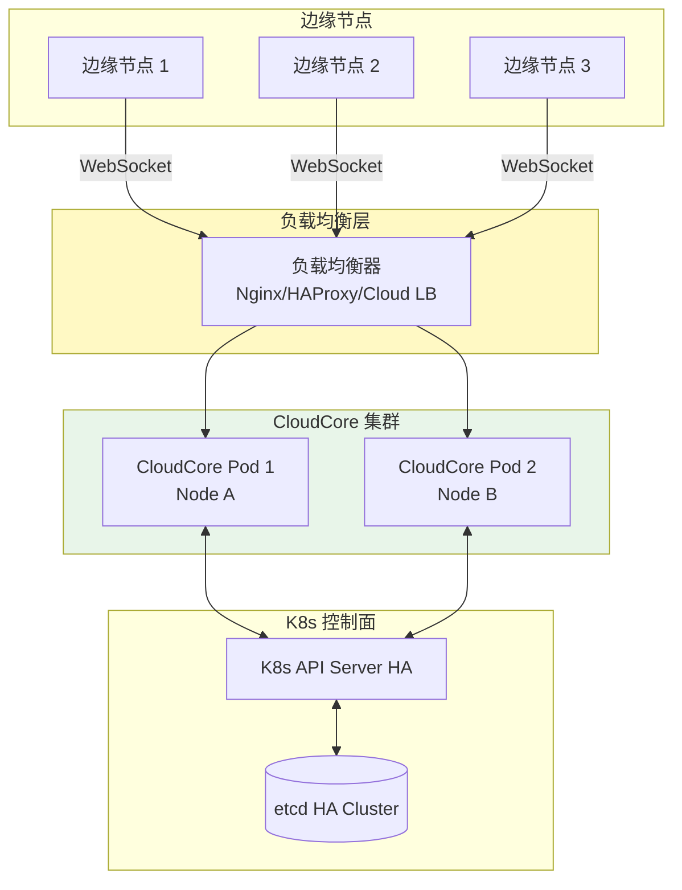

#<!-- chunk: 8.2 高可用 CloudCore 部署 -->## 8.2 高可用 CloudCore 部署

```yaml
# values-ha.yaml - 高可用配置
cloudCore:
  replicaCount: 2
  
  # 使用 LoadBalancer Service (云厂商)
  service:
    type: LoadBalancer
    loadBalancerIP: "1.2.3.4"  # 固定 IP
    annotations:
      service.beta.kubernetes.io/alicloud-loadbalancer-id: "lb-xxxxxxx"
  
  # Pod 反亲和 (分散到不同节点)
  affinity:
    podAntiAffinity:
      requiredDuringSchedulingIgnoredDuringExecution:
      - labelSelector:
          matchExpressions:
          - key: app
            operator: In
            values:
            - cloudcore
        topologyKey: "kubernetes.io/hostname"
  
  # 优雅关闭
  terminationGracePeriodSeconds: 60
  
  # PodDisruptionBudget (保证至少1个可用)
  podDisruptionBudget:
    enabled: true
    minAvailable: 1
```

```bash
# 部署 HA CloudCore
helm install cloudcore kubeedge/cloudcore \
  --namespace kubeedge \
  -f values-ha.yaml

# 验证 HA 状态
kubectl get pods -n kubeedge -w
kubectl get pdb -n kubeedge
```

#<!-- chunk: 8.3 边缘节点高可用 -->## 8.3 边缘节点高可用

KubeEdge v1.13+ 支持边缘节点高可用（多节点 EdgeCore 集群）：

```yaml
# 边缘节点 HA 配置 (EdgeCore)
# /etc/kubeedge/config/edgecore.yaml
modules:
  edged:
    # 配置多主模式
    hostnameOverride: "edge-ha-001"
    
  # EdgeMesh 配置 (边缘服务网格)
  edgeMesh:
    enable: true
    server:
      nodeName: "edge-ha-001"
      advertiseAddress: "192.168.1.100"
```

---

<!-- chunk: 9. 配置详解 -->## 9. 配置详解

#<!-- chunk: 9.1 完整 CloudCore 配置 -->## 9.1 完整 CloudCore 配置

```yaml
# /etc/kubeedge/config/cloudcore.yaml
apiVersion: cloudcore.config.kubeedge.io/v1alpha2
kind: CloudCore
commonConfig:
  monitorServer:
    bindAddress: 0.0.0.0:9091
  tunnelPort: 10004

kubeAPIConfig:
  master: ""  # 空表示使用集群内 ServiceAccount
  contentType: application/vnd.kubernetes.protobuf
  qps: 100
  burst: 200

modules:
  cloudHub:
    enable: true
    keepaliveInterval: 30
    nodeLimit: 1000
    tlsCaFile: /etc/kubeedge/ca/rootCA.crt
    tlsCaKeyFile: /etc/kubeedge/ca/rootCA.key
    tlsCertFile: /etc/kubeedge/certs/server.crt
    tlsPrivateKeyFile: /etc/kubeedge/certs/server.key
    
    advertiseAddress:
      - "1.2.3.4"
    
    https:
      enable: true
      address: 0.0.0.0
      port: 10002
      
    websocket:
      enable: true
      address: 0.0.0.0
      port: 10000
      writeDeadline: 15
      readDeadline: 15
      
    quic:
      enable: false
      address: 0.0.0.0
      port: 10001
      maxIncomingStreams: 10000
      handshakeTimeout: 30
      
    unixsocket:
      enable: false
      address: unix:///var/lib/kubeedge/kubeedge.sock

  cloudStream:
    enable: true
    streamPort: 10003
    tlsStreamCAFile: /etc/kubeedge/ca/streamCA.crt
    tlsStreamCertFile: /etc/kubeedge/certs/stream.crt
    tlsStreamPrivateKeyFile: /etc/kubeedge/certs/stream.key
    
  dynamicController:
    enable: true
    
  edgeController:
    enable: true
    nodeUpdateFrequency: 10  # 节点状态更新间隔 (秒)
    buffer:
      updatePodStatus: 1024
      updateNodeStatus: 1024
      queryConfigMap: 1024
      querySecret: 1024
      queryService: 1024
      queryEndpoints: 1024
      queryPersistentVolume: 1024
      queryPersistentVolumeClaim: 1024
      queryVolumeAttachment: 1024
      ingressUpdateChan: 1024
      
  deviceController:
    enable: true
    buffer:
      updateDeviceStatus: 1024
      updateDeviceStates: 1024
      updateDeviceTwin: 1024
      queryDeviceData: 1024
      
  router:
    enable: true
    restPort: 9443
    tunnelPort: 9444
    address: 0.0.0.0
    
  syncController:
    enable: true
```

#<!-- chunk: 9.2 完整 EdgeCore 配置 -->## 9.2 完整 EdgeCore 配置

```yaml
# /etc/kubeedge/config/edgecore.yaml
apiVersion: edgecore.config.kubeedge.io/v1alpha2
kind: EdgeCore

modules:
  edgeHub:
    enable: true
    heartbeat: 15
    messageQueueCapacity: 100
    tlsCaFile: /etc/kubeedge/ca/rootCA.crt
    tlsCertFile: /etc/kubeedge/certs/server.crt
    tlsPrivateKeyFile: /etc/kubeedge/certs/server.key
    
    httpServer: "https://1.2.3.4:10002"
    token: "TOKEN_FROM_KEADM_GETTOKEN"
    
    websocket:
      enable: true
      handshakeTimeout: 30
      readDeadline: 15
      server: "1.2.3.4:10000"
      writeDeadline: 15
      
    quic:
      enable: false
      handshakeTimeout: 30
      readDeadline: 15
      server: "1.2.3.4:10001"
      writeDeadline: 15

  edged:
    enable: true
    taints: []
    nodeStatusUpdateFrequency: 10
    nodeName: "edge-node-001"
    registerNode: true
    registerSchedulable: true
    
    hostnameOverride: "edge-node-001"
    nodeIP: "192.168.1.100"
    
    # 容器运行时
    containerRuntimeEndpoint: "unix:///run/containerd/containerd.sock"
    imageServiceEndpoint: "unix:///run/containerd/containerd.sock"
    runtimeType: "remote"
    
    podSandboxImage: "kubeedge/pause:3.6"
    
    # GC 配置
    imageMinimumGCAge: 2m0s
    imageGCHighThreshold: 80
    imageGCLowThreshold: 40
    maximumDeadContainersPerPod: 1
    
    # Volume 插件
    volumePluginDir: "/usr/libexec/kubernetes/kubelet-plugins/volume/exec/"
    
    # 根目录
    rootDirectory: /var/lib/edged
    
    # 日志目录
    podLogsRootDirectory: /var/log/pods
    
    # Node Labels (部署时自动添加)
    labels:
      node-role.kubernetes.io/edge: ""
      
    # Taints (防止云端 Pod 调度到边缘)
    taints:
      - key: "node-role.kubernetes.io/edge"
        effect: "NoSchedule"

  metaManager:
    enable: true
    contextSendGroup: "resource"
    contextSendModule: "edgehub"
    # 离线时是否允许 edged 访问本地数据
    remoteQueryTimeout: 60
    metaServer:
      enable: true
      server: "127.0.0.1:10550"  # 本地 Meta API Server

  deviceTwin:
    enable: true

  eventBus:
    enable: true
    mqttQOS: 0
    mqttRetain: false
    mqttSessionQueueSize: 100
    mqttServerExternal: "tcp://127.0.0.1:1883"
    mqttServerInternal: "tcp://127.0.0.1:1884"
    mqttMode: 2  # 内外部都使用

  serviceBus:
    enable: false
    server: "127.0.0.1"
    port: 9060
    timeout: 60

  edgeStream:
    enable: true
    handshakeTimeout: 30
    readDeadline: 15
    server: "1.2.3.4:10003"
    tlsTunnelCAFile: /etc/kubeedge/ca/rootCA.crt
    tlsTunnelCertFile: /etc/kubeedge/certs/server.crt
    tlsTunnelPrivateKeyFile: /etc/kubeedge/certs/server.key
    writeDeadline: 15

  edgeMesh:
    enable: false  # EdgeMesh 需要单独部署
```

---

<!-- chunk: 10. 证书管理 -->## 10. 证书管理

#<!-- chunk: 10.1 证书架构 (Certificate Architecture) -->## 10.1 证书架构 (Certificate Architecture)

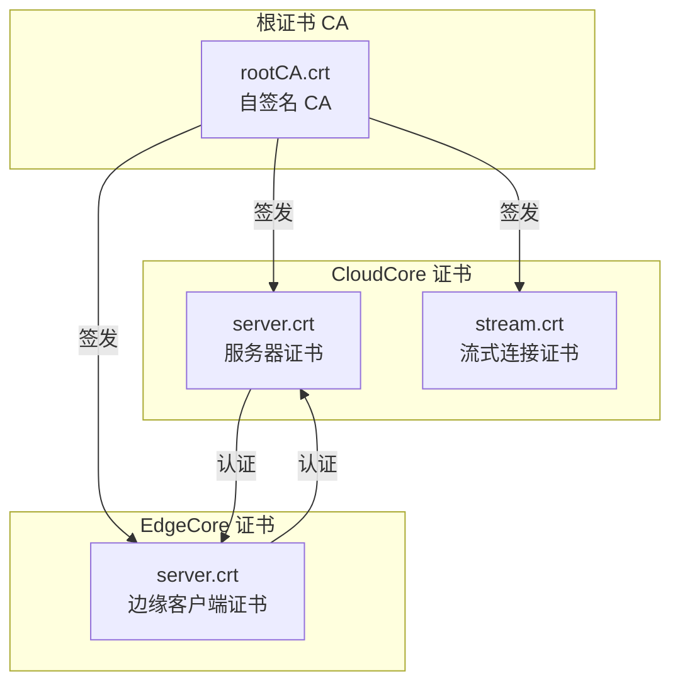

#<!-- chunk: 10.2 手动证书生成 (Manual Certificate Generation) -->## 10.2 手动证书生成 (Manual Certificate Generation)

```bash
#!/bin/bash
# generate-kubeedge-certs.sh

set -e

CERTS_DIR="/etc/kubeedge/certs"
CA_DIR="/etc/kubeedge/ca"
CLOUD_IP="1.2.3.4"
CLOUD_DOMAIN="edge.company.com"

mkdir -p $CERTS_DIR $CA_DIR

# ====== 1. 生成根 CA ======
openssl genrsa -out $CA_DIR/rootCA.key 4096

openssl req -x509 -new -nodes \
  -key $CA_DIR/rootCA.key \
  -sha256 -days 3650 \
  -subj "/C=CN/O=KubeEdge/CN=KubeEdge CA" \
  -out $CA_DIR/rootCA.crt

echo "✅ 根 CA 生成完成"

# ====== 2. 生成 CloudCore 服务器证书 ======
openssl genrsa -out $CERTS_DIR/server.key 2048

cat > /tmp/cloud-csr.conf << EOF
[req]
default_bits = 2048
prompt = no
default_md = sha256
distinguished_name = dn

[dn]
C=CN
O=KubeEdge
CN=CloudCore

[v3_req]
subjectAltName = @alt_names

[alt_names]
IP.1 = ${CLOUD_IP}
DNS.1 = ${CLOUD_DOMAIN}
DNS.2 = cloudcore.kubeedge.svc.cluster.local
EOF

openssl req -new \
  -key $CERTS_DIR/server.key \
  -out /tmp/cloud.csr \
  -config /tmp/cloud-csr.conf

openssl x509 -req -days 3650 \
  -in /tmp/cloud.csr \
  -CA $CA_DIR/rootCA.crt \
  -CAkey $CA_DIR/rootCA.key \
  -CAcreateserial \
  -out $CERTS_DIR/server.crt \
  -extensions v3_req \
  -extfile /tmp/cloud-csr.conf

echo "✅ CloudCore 证书生成完成"

# ====== 3. 生成 Stream 证书 ======
openssl genrsa -out $CERTS_DIR/stream.key 2048

openssl req -new \
  -key $CERTS_DIR/stream.key \
  -subj "/C=CN/O=KubeEdge/CN=CloudStream" \
  -out /tmp/stream.csr

openssl x509 -req -days 3650 \
  -in /tmp/stream.csr \
  -CA $CA_DIR/rootCA.crt \
  -CAkey $CA_DIR/rootCA.key \
  -CAcreateserial \
  -out $CERTS_DIR/stream.crt

echo "✅ Stream 证书生成完成"

# ====== 4. 验证证书 ======
echo "=== 证书有效期 ==="
for cert in $CA_DIR/rootCA.crt $CERTS_DIR/server.crt $CERTS_DIR/stream.crt; do
    echo -n "$cert: "
    openssl x509 -in $cert -noout -dates | grep "notAfter"
done

echo "=== 证书 SAN ==="
openssl x509 -in $CERTS_DIR/server.crt -text -noout | grep -A 5 "Subject Alternative Name"
```

#<!-- chunk: 10.3 证书自动轮换 (Certificate Auto-Rotation) -->## 10.3 证书自动轮换 (Certificate Auto-Rotation)

```yaml
# KubeEdge 支持通过 CSR 机制自动轮换证书
# CloudCore 配置
modules:
  cloudHub:
    # 允许边缘节点通过 CSR 获取证书
    unregisterNodeOnCertExpiry: true
    
# EdgeCore 会在证书到期前自动申请续期
# 无需手动干预
```

```bash
# 手动触发证书续期
# 在边缘节点上
keadm join \
  --cloudcore-ipport="1.2.3.4:10000" \
  --token="$(keadm gettoken)" \
  --force  # 强制重新颁发证书
```

---

<!-- chunk: 11. 网络配置 -->## 11. 网络配置

#<!-- chunk: 11.1 防火墙规则 (Firewall Rules) -->## 11.1 防火墙规则 (Firewall Rules)

```bash
# 云端防火墙规则
# 允许边缘节点连接 CloudCore
iptables -A INPUT -p tcp --dport 10000 -j ACCEPT  # WebSocket
iptables -A INPUT -p tcp --dport 10002 -j ACCEPT  # HTTPS Token
iptables -A INPUT -p tcp --dport 10003 -j ACCEPT  # Stream (kubectl logs/exec)

# 如果使用 QUIC (可选)
iptables -A INPUT -p udp --dport 10001 -j ACCEPT

# 边缘防火墙规则
# 允许边缘节点出站到 CloudCore
iptables -A OUTPUT -p tcp --dport 10000 -j ACCEPT
iptables -A OUTPUT -p tcp --dport 10002 -j ACCEPT
iptables -A OUTPUT -p tcp --dport 10003 -j ACCEPT
```

#<!-- chunk: 11.2 EdgeMesh 部署 (EdgeMesh) -->## 11.2 EdgeMesh 部署 (EdgeMesh)

EdgeMesh 提供边缘节点之间的服务网格能力（边缘节点跨越 NAT 的服务发现）：

```bash
# 安装 EdgeMesh
helm repo add edgemesh https://edgemesh.netlify.app/charts
helm repo update

helm install edgemesh edgemesh/edgemesh \
  --namespace kubeedge \
  --set agent.psk="your-preshared-key" \
  --set agent.relayNodes[0].nodeName=cloud-node-1 \
  --set agent.relayNodes[0].advertiseAddress[0]="1.2.3.4"
```

```yaml
# EdgeMesh 配置
apiVersion: agent.edgemesh.config.kubeedge.io/v1alpha1
kind: EdgeMeshAgent
kubeAPIConfig:
  master: ""
  contentType: application/vnd.kubernetes.protobuf
  qps: 100
  burst: 200
  
modules:
  edgeProxy:
    enable: true
    socks5Proxy:
      enable: true
      port: 10800
    # 服务发现
    loadBalancer:
      caller: "random"  # 负载均衡算法: random/roundrobin
      
  edgeTunnel:
    enable: true
    listenPort: 20006
    # P2P 穿越配置
    relayNodes:
      - nodeName: cloud-relay-node
        advertiseAddress:
          - "1.2.3.4"
    enableIpfsLog: false
    maxCandidates: 5
    heartbeatPeriod: 120
    finderPeriod: 60
    psk: "your-preshared-key"  # 预共享密钥
    TunnelBaseAddr: "9.0.0.0/8"
```

#<!-- chunk: 11.3 CNI 配置 (CNI for Edge) -->## 11.3 CNI 配置 (CNI for Edge)

```yaml
# 边缘节点 Flannel CNI 配置
# /etc/cni/net.d/10-flannel.conflist
{
  "name": "cbr0",
  "cniVersion": "0.3.1",
  "plugins": [
    {
      "type": "flannel",
      "delegate": {
        "hairpinMode": true,
        "isDefaultGateway": true
      }
    },
    {
      "type": "portmap",
      "capabilities": {
        "portMappings": true
      }
    }
  ]
}
```

```bash
# 检查边缘节点 CNI 状态
kubectl get nodes edge-node-001 -o jsonpath='{.spec.podCIDR}'
# 10.244.100.0/24

# 检查边缘节点 Pod 网络
kubectl exec -n edge-production -it test-pod -- ping 10.244.200.1
```

---

<!-- chunk: 12. 升级与维护 -->## 12. 升级与维护

#<!-- chunk: 12.1 版本升级策略 (Upgrade Strategy) -->## 12.1 版本升级策略 (Upgrade Strategy)

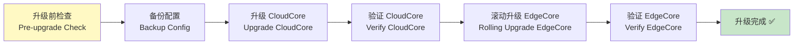

#<!-- chunk: 12.2 CloudCore 升级 -->## 12.2 CloudCore 升级

```bash
# 1. 备份现有配置
kubectl get configmap cloudcore-config -n kubeedge -o yaml > cloudcore-config-backup.yaml
cp /etc/kubeedge/config/cloudcore.yaml ~/cloudcore-backup.yaml

# 2. 更新 Helm values (如果使用 Helm)
helm upgrade cloudcore kubeedge/cloudcore \
  --namespace kubeedge \
  -f values-production.yaml \
  --set cloudCore.image.tag=v1.15.0

# 监控升级过程
kubectl get pods -n kubeedge -w

# 3. 验证升级结果
kubectl get pods -n kubeedge
kubectl logs -n kubeedge -l app=cloudcore | grep "version"
```

#<!-- chunk: 12.3 EdgeCore 升级 -->## 12.3 EdgeCore 升级

```bash
# 方式1: 使用 keadm OTA 升级 (v1.13+)
keadm upgrade edge \
  --to-version v1.15.0 \
  --edge-node edge-node-001 \
  --kube-config ~/.kube/config

# 方式2: 手动升级
# 在边缘节点上执行

# 停止 EdgeCore
systemctl stop edgecore

# 下载新版本
curl -LO "https://github.com/kubeedge/kubeedge/releases/download/v1.15.0/kubeedge-v1.15.0-linux-amd64.tar.gz"
tar -xzf kubeedge-v1.15.0-linux-amd64.tar.gz
sudo install kubeedge-v1.15.0-linux-amd64/edge/edgecore /usr/local/bin/

# 检查配置兼容性
diff /etc/kubeedge/config/edgecore.yaml <(edgecore --minconfig 2>/dev/null)

# 启动新版本
systemctl start edgecore
journalctl -u edgecore -f
```

#<!-- chunk: 12.4 运维常用命令 -->## 12.4 运维常用命令

```bash
# ====== 日常运维 ======

# 查看所有边缘节点状态
kubectl get nodes -l node-role.kubernetes.io/edge=""

# 查看边缘节点 Pod
kubectl get pods -A --field-selector spec.nodeName=edge-node-001

# 查看边缘节点事件
kubectl get events --field-selector involvedObject.kind=Node,involvedObject.name=edge-node-001

# 在边缘节点执行命令 (需要 CloudStream 启用)
kubectl exec -n default -it pod-on-edge -- bash

# 查看边缘 Pod 日志
kubectl logs -n default pod-on-edge -f

# ====== 故障排查 ======

# 检查 EdgeCore 连接状态
# 在边缘节点上
systemctl status edgecore
journalctl -u edgecore --since "1 hour ago" | grep -E "ERROR|WARN|connected|disconnected"

# 检查 CloudCore 连接的边缘节点
kubectl get nodes -l node-role.kubernetes.io/edge="" -o wide

# 检查 MetaManager 本地数据
sqlite3 /var/lib/kubeedge/edgecore.db "SELECT key, type FROM meta LIMIT 20;"

# 检查设备状态
kubectl get devices -A
kubectl describe device temperature-sensor -n default

# 重置边缘节点 (不删除数据)
systemctl stop edgecore
systemctl start edgecore

# 完全重置并重新加入
keadm reset
keadm join --cloudcore-ipport="1.2.3.4:10000" --token="TOKEN"
```

#<!-- chunk: 12.5 性能调优 (Performance Tuning) -->## 12.5 性能调优 (Performance Tuning)

```yaml
# CloudCore 性能调优
modules:
  cloudHub:
    # 增大并发连接数
    nodeLimit: 5000
    # 调整超时参数
    websocket:
      writeDeadline: 30
      readDeadline: 30
      
  edgeController:
    buffer:
      # 增大队列缓冲
      updatePodStatus: 4096
      updateNodeStatus: 4096
      queryConfigMap: 4096
      
# EdgeCore 性能调优
modules:
  edgeHub:
    # 增大消息队列
    messageQueueCapacity: 1000
    
  edged:
    # 调整 GC 阈值
    imageGCHighThreshold: 90
    imageGCLowThreshold: 70
    maximumDeadContainersPerPod: 2
```

---

<!-- chunk: 总结 (Summary) -->## 总结 (Summary)

```
KubeEdge 部署检查清单:

云端 (Cloud Side):
✅ Kubernetes 集群版本兼容 (v1.25+)
✅ CloudCore 高可用部署 (2+ 副本)
✅ 证书正确配置 (CA + Server Cert)
✅ 防火墙规则放行 (10000/10002/10003)
✅ LoadBalancer/NodePort 对外暴露

边缘 (Edge Side):
✅ containerd 运行时安装
✅ CNI 插件配置 (flannel/calico)
✅ 时钟同步 (NTP)
✅ EdgeCore 正常连接 CloudCore
✅ MetaManager 本地存储正常
✅ MQTT Broker 运行 (DeviceTwin 需要)

验证 (Validation):
✅ kubectl get nodes 显示边缘节点 Ready
✅ 部署测试 Pod 到边缘节点成功
✅ kubectl logs/exec 工作正常 (StreamServer)
✅ 断开网络后 Pod 继续运行
✅ 重新连网后状态正常同步
```

---

<!-- chunk: 参考资料 (References) -->## 参考资料 (References)

- [KubeEdge 官方文档](https://kubeedge.io/docs/)
- [KubeEdge GitHub](https://github.com/kubeedge/kubeedge)
- [KubeEdge 架构设计](https://kubeedge.io/docs/architecture/)
- [keadm 使用指南](https://kubeedge.io/docs/setup/install-with-keadm/)
- [KubeEdge Helm Chart](https://github.com/kubeedge/kubeedge/tree/master/charts)
- [EdgeMesh 文档](https://edgemesh.netlify.app/)
- [KubeEdge 最佳实践](https://kubeedge.io/docs/best-practices/)

---

<!-- chunk: Obsidian 相关文档 -->## Obsidian 相关文档

- domain-37-edge-computing MOC
- [[domain-15-specialized-tech/README.md|Domain 37: 边缘计算 (Edge Computing)]]
- Domain-37 边缘计算 — 开源项目索引
- 边缘计算架构概述 (Edge Computing Architecture Overview)
- 云边协同设计模式 (Cloud-Edge Collaboration Design Patterns)
- KubeEdge 设备管理与边缘应用 (KubeEdge Device Management and Edge Appl...
- OpenYurt 边缘方案 (OpenYurt Edge Solution)
- SuperEdge 架构实践 (SuperEdge Architecture Practice)
- 边缘 AI 推理与联邦学习 (Edge AI Inference and Federated Learning)
- 边缘存储与网络 (Edge Storage and Network)
- 边缘安全架构 (Edge Security Architecture)
- 边缘场景案例 (Edge Computing Use Cases)

## See Also

- 01-edge-computing-architecture
- 02-cloud-edge-collaboration
- 04-kubeedge-device-edge-apps
- 05-openyurt-architecture
