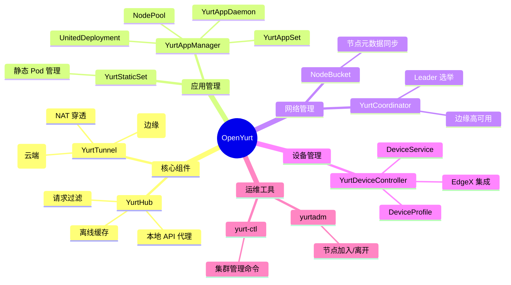
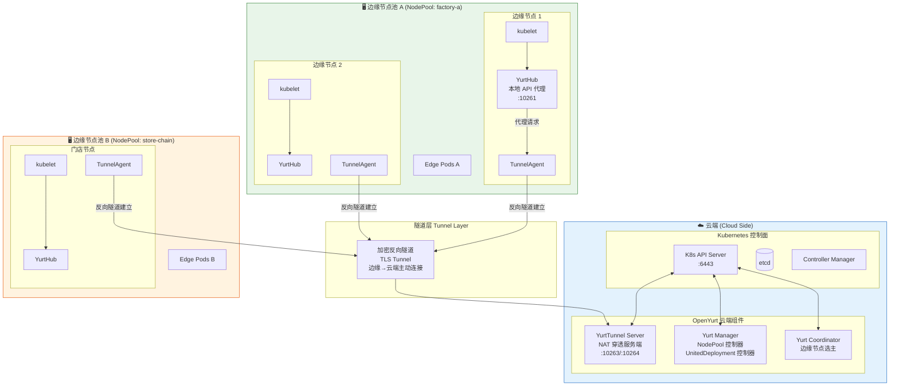
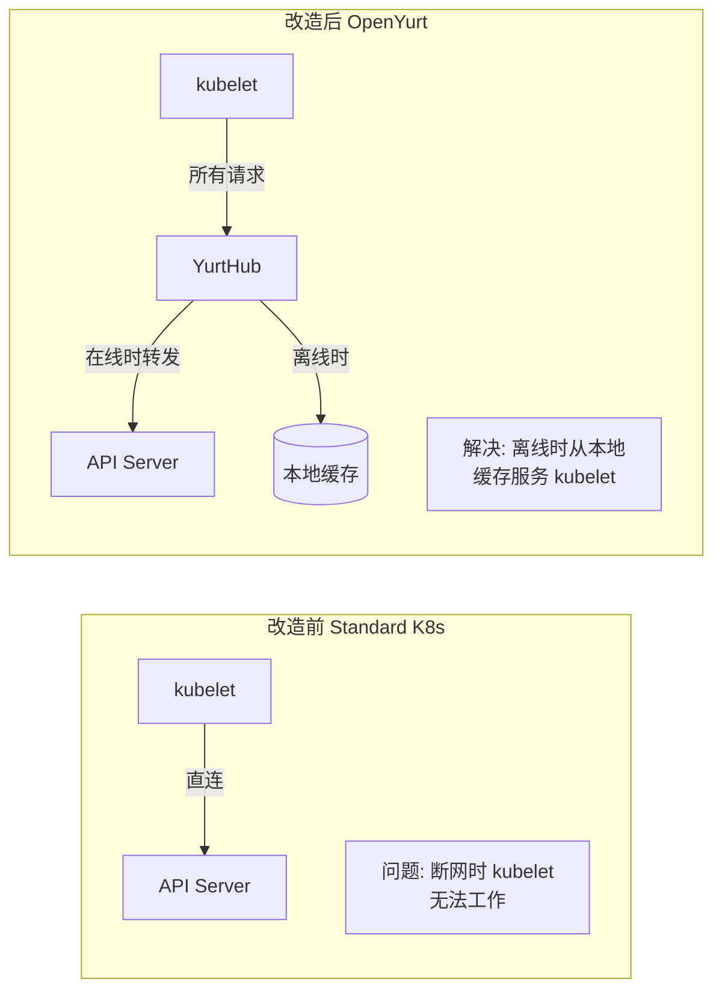
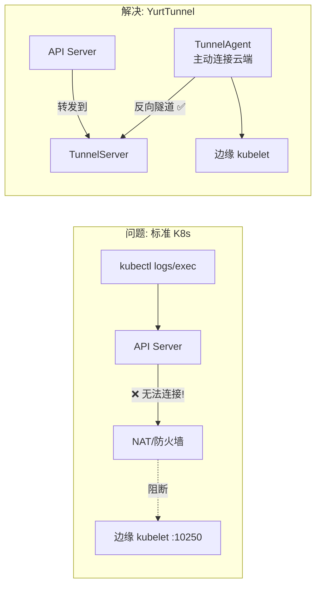
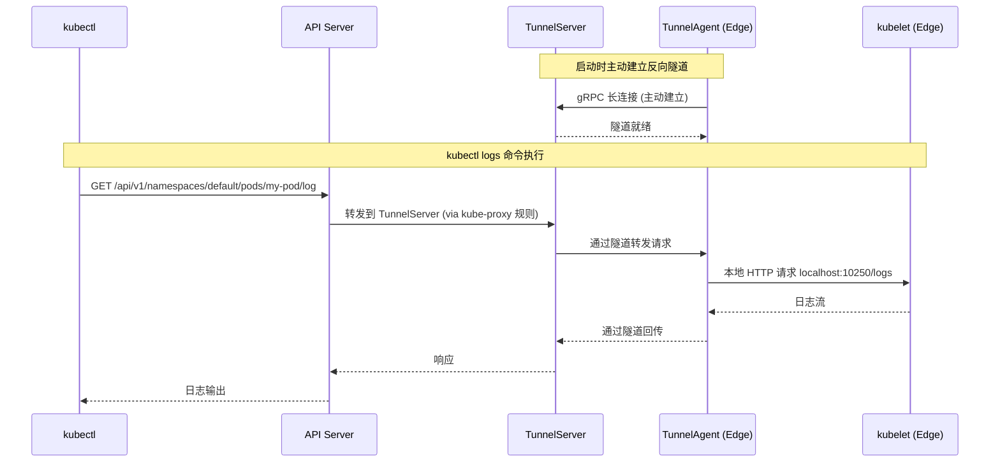
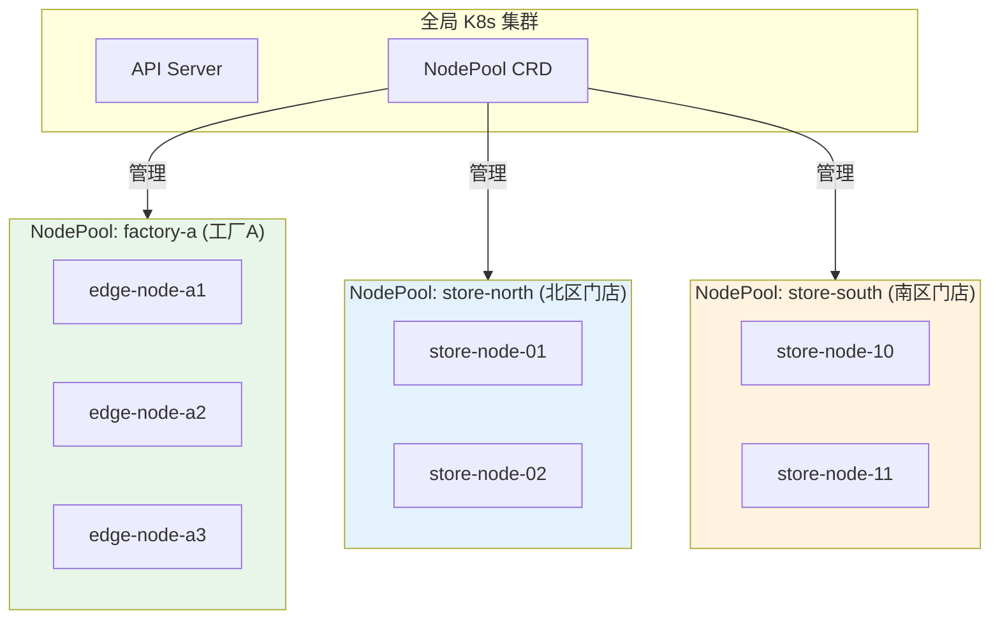
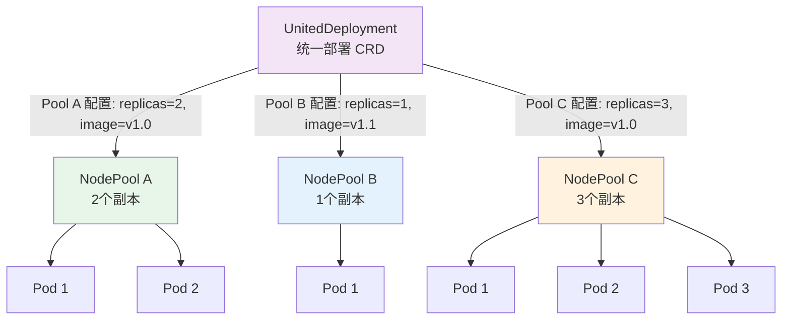
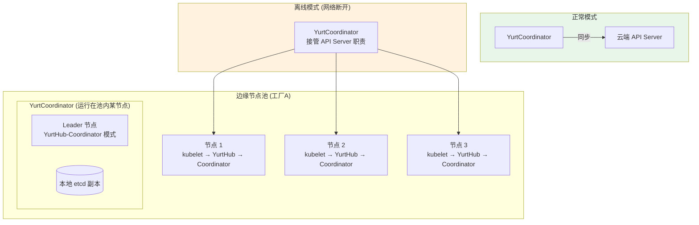
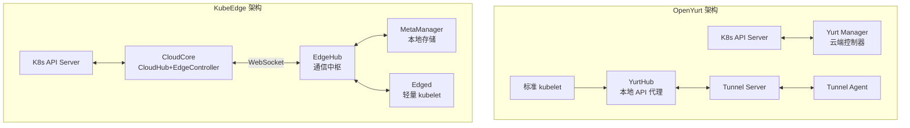

title: [[OpenYurt|OpenYurt]] 边缘方案 (OpenYurt Edge Solution)
description: '# OpenYurt 边缘方案 (OpenYurt Edge Solution)'
category: edge-computing
tags:
- k8s
- edge
- iot
- [[KubeEdge|kubeedge]]
- [[etcd|etcd]]
- apiserver
- [[kubelet|kubelet]]
- grafana
- flannel
- coredns
last_updated: 2026-05
difficulty: advanced
reading_level: advanced
audience:
- 边缘计算工程师
- SRE
- IoT 工程师
estimated_read_time: 5min
intent_queries:
- OpenYurt 边缘方案 (OpenYurt Edge Solution) 是什么
- 如何 OpenYurt 边缘方案 (OpenYurt Edge Solution)
- Kubernetes 37 edge computing 最佳实践
trigger_keywords:
- OpenYurt
- 边缘方案
- OpenYurt
- Edge
- Solution
- edge
- computing
authors:
- name: KUDIG Team
  role: contributor
k8s_versions:
- '1.28'
- '1.29'
- '1.30'
- '1.31'
- '1.32'
---

# OpenYurt 边缘方案 (OpenYurt Edge Solution)

<!-- chunk: 目录 (Table of Contents) -->## 目录 (Table of Contents)

1. [OpenYurt 概述](#1-openyurt-概述)
2. [核心架构设计](#2-核心架构设计)
3. [YurtHub 详解](#3-yurthub-详解)
4. [YurtTunnel 详解](#4-yurttunnel-详解)
5. [NodePool 节点池管理](#5-nodepool-节点池管理)
6. [UnitedDeployment 统一部署](#6-uniteddeployment-统一部署)
7. [边缘自治能力](#7-边缘自治能力)
8. [部署安装](#8-部署安装)
9. [流量拓扑管理](#9-流量拓扑管理)
10. [OpenYurt vs KubeEdge 详细对比](#10-openyurt-vs-kubeedge-详细对比)
11. [生产实践](#11-生产实践)
12. [故障排查与运维](#12-故障排查与运维)

---

<!-- chunk: 1. OpenYurt 概述 -->## 1. OpenYurt 概述

## 1.1 项目简介 (Project Overview)

OpenYurt 是阿里巴巴于 2020 年开源的 Kubernetes 边缘计算平台，其核心设计哲学是**"非侵入式"**地将标准 Kubernetes 集群改造为边缘就绪的集群，无需修改 K8s 核心代码。

```
OpenYurt 设计哲学:

"Kubernetes 原生 + 最小侵入"

✅ 复用标准 Kubernetes API 和生态
✅ 不修改 Kubernetes 源码
✅ 存量 K8s 集群一键改造
✅ 完全兼容 kubectl/helm/Argo CD 等工具
✅ 边缘节点与 API Server 断连时自主运行
```

## 1.2 OpenYurt 发展历程

```
2020.05 ── 阿里巴巴开源 OpenYurt v0.1
            YurtHub + YurtTunnel 核心组件
            
2020.09 ── 加入 CNCF Sandbox 项目
            
2021.01 ── NodePool 节点池功能
            
2021.06 ── UnitedDeployment 统一部署
            YurtAppManager v1.0
            
2022.01 ── YurtDeviceController (设备管理)
            IOT 设备管理能力
            
2022.05 ── YurtCoordinator
            边缘节点高可用协调器
            
2023.03 ── OpenYurt v1.3
            NodeBucket, YurtStaticSet
            多池拓扑感知服务
            
2024.01 ── OpenYurt v1.4+
            增强边缘 AI 支持
            统一管控 API
```

## 1.3 OpenYurt 组件全景



---

<!-- chunk: 2. 核心架构设计 -->## 2. 核心架构设计

## 2.1 OpenYurt 整体架构图



## 2.2 非侵入式改造原理 (Non-Intrusive Retrofit)

OpenYurt 的核心创新在于**不修改 kubelet**，而是在 kubelet 和 API Server 之间插入 YurtHub 代理层：



**改造只需要：**
```bash
# 一条命令将普通 K8s 节点改造为边缘节点
yurtadm join ${CLOUD_SERVER_ADDR} \
  --token ${JOIN_TOKEN} \
  --node-type=edge

# 等价操作:
# 1. 在节点安装 YurtHub
# 2. 修改 kubelet 启动参数, 将 API Server 地址改为 localhost:10261 (YurtHub)
# 3. 安装 TunnelAgent
```

---

<!-- chunk: 3. YurtHub 详解 -->## 3. YurtHub 详解

## 3.1 YurtHub 工作原理 (YurtHub Working Principle)

```mermaid
graph TD
    subgraph YurtHub["YurtHub 进程 (:10261)"]
        Proxy[反向代理层<br/>Reverse Proxy]
        Filter[请求过滤器<br/>Request Filter]
        CacheManager[缓存管理器<br/>Cache Manager]
        StorageManager[存储管理器<br/>Storage Manager<br/>磁盘缓存]
        
        Proxy --> Filter
        Filter --> CacheManager
        CacheManager --> StorageManager
    end
    
    subgraph Clients["API 客户端"]
        Kubelet[kubelet<br/>:10261]
        FlannelD[flanneld]
        KubeProxy[kube-proxy]
        OtherClients[其他 K8s 组件]
    end
    
    subgraph Upstream["上游"]
        APIServer[K8s API Server<br/>:6443]
        YurtTunnel[YurtTunnel\n(via 隧道)]
    end
    
    Clients -->|HTTP/HTTPS| Proxy
    
    CacheManager -->|在线: 回源| APIServer
    CacheManager -->|断线: 使用缓存| StorageManager
    
    APIServer -->|Watch 实时更新缓存| CacheManager
```

## 3.2 YurtHub 缓存机制 (Cache Mechanism)

```go
// YurtHub 核心缓存逻辑 (简化版)
type YurtHubHandler struct {
    remoteServer   *url.URL     // 云端 API Server 地址
    localCachePath string       // 本地缓存路径
    networkMgr     NetworkManager
    cacheManager   CacheManager
}

func (h *YurtHubHandler) ServeHTTP(w http.ResponseWriter, r *http.Request) {
    if h.networkMgr.IsHealthy() {
        // 在线模式: 透明代理 + 更新缓存
        h.proxyAndCache(w, r)
    } else {
        // 离线模式: 从本地缓存服务
        h.serveFromLocalCache(w, r)
    }
}

func (h *YurtHubHandler) proxyAndCache(w http.ResponseWriter, r *http.Request) {
    // 创建响应记录器 (拦截响应内容以便缓存)
    recorder := &responseRecorder{
        ResponseWriter: w,
        body:           &bytes.Buffer{},
    }
    
    // 反向代理到 API Server
    proxy := httputil.NewSingleHostReverseProxy(h.remoteServer)
    proxy.ServeHTTP(recorder, r)
    
    // 缓存 GET 请求的响应
    if r.Method == http.MethodGet && recorder.statusCode == 200 {
        key := cacheKeyFromRequest(r)
        h.cacheManager.Store(key, recorder.body.Bytes())
    }
}

func (h *YurtHubHandler) serveFromLocalCache(w http.ResponseWriter, r *http.Request) {
    if r.Method != http.MethodGet {
        // 非 GET 请求在离线时有限制处理
        // Watch 请求: 使用本地缓存 watch
        if isWatchRequest(r) {
            h.serveWatchFromCache(w, r)
            return
        }
        http.Error(w, "Service temporarily unavailable", 503)
        return
    }
    
    key := cacheKeyFromRequest(r)
    data, err := h.cacheManager.Load(key)
    if err != nil {
        http.Error(w, "Resource not found in cache", 404)
        return
    }
    
    w.Header().Set("Content-Type", "application/json")
    w.Header().Set("X-Cache-Hit", "true")
    w.Header().Set("X-Offline-Mode", "true")
    w.Write(data)
}
```

## 3.3 YurtHub 缓存存储结构 (Cache Storage Structure)

```
YurtHub 磁盘缓存目录结构:
/var/lib/yurthub/
├── kubelet/
│   ├── pods/
│   │   ├── default/
│   │   │   ├── nginx-deployment-abc12  # Pod 定义
│   │   │   └── edge-app-xyz89
│   │   └── edge-system/
│   │       └── yurthub-daemonset-xxx
│   ├── configmaps/
│   │   └── default/
│   │       └── app-config
│   ├── secrets/
│   │   └── default/
│   │       └── registry-secret
│   ├── services/
│   ├── endpoints/
│   └── nodes/
│       └── edge-node-001
├── flanneld/
│   └── nodes/
└── kube-proxy/
    ├── services/
    └── endpoints/
```

## 3.4 YurtHub 请求过滤器 (Request Filters)

```go
// YurtHub 内置过滤器 - 修改 API 响应以适配边缘场景
type FilterChain struct {
    filters []Filter
}

// 1. MasterService 过滤器
// 将 "kubernetes" service 的 ClusterIP 改为 YurtHub 本地地址
type MasterServiceFilter struct {
    localIP string
}

// 2. DiscardCloudService 过滤器
// 过滤掉不需要在边缘运行的云端 Service
type DiscardCloudServiceFilter struct {
    nodeName string
    nodePool string
}

// 3. ServiceTopology 过滤器
// 确保 Endpoints 只返回同一 NodePool 内的 Pod
type ServiceTopologyFilter struct {
    nodePoolName string
}

func (f *ServiceTopologyFilter) Filter(obj runtime.Object) runtime.Object {
    endpoints, ok := obj.(*v1.Endpoints)
    if !ok {
        return obj
    }
    
    // 只保留同一 NodePool 的 endpoints
    var filteredSubsets []v1.EndpointSubset
    for _, subset := range endpoints.Subsets {
        var filteredAddresses []v1.EndpointAddress
        for _, addr := range subset.Addresses {
            if addr.NodeName != nil {
                nodePool := getNodePool(*addr.NodeName)
                if nodePool == f.nodePoolName {
                    filteredAddresses = append(filteredAddresses, addr)
                }
            }
        }
        if len(filteredAddresses) > 0 {
            subset.Addresses = filteredAddresses
            filteredSubsets = append(filteredSubsets, subset)
        }
    }
    
    endpoints.Subsets = filteredSubsets
    return endpoints
}
```

## 3.5 YurtHub 配置 (YurtHub Configuration)

```yaml
# YurtHub 配置 (作为 DaemonSet 运行在边缘节点)
apiVersion: v1
kind: ConfigMap
metadata:
  name: yurt-hub-cfg
  namespace: kube-system
data:
  yurthub.conf: |
    # YurtHub 监听地址 (kubelet 连接此地址)
    bind-address: "127.0.0.1"
    bind-port: 10261
    
    # 云端 API Server 地址
    server-addr: "https://api-server.company.com:6443"
    
    # 节点名称
    node-name: "edge-node-001"
    
    # NodePool 名称 (用于拓扑感知)
    node-pool-name: "factory-a"
    
    # 缓存配置
    disk-cache-capacity: 10Gi
    disk-cache-path: "/var/lib/yurthub"
    
    # 心跳检测 (检测 API Server 连通性)
    heartbeat-failed-retry: 3
    heartbeat-healthy-threshold: 2
    heartbeat-timeout: 2s
    
    # 离线模式配置
    offline-cache-timeout: 72h  # 缓存有效期 72 小时
    
    # 过滤器配置
    filter:
      discardCloudService: true
      masterService: true
      serviceTopology: true
      
    # TLS 配置
    bootstrap-server: "https://api-server.company.com:6443"
    root-ca-file: "/etc/kubernetes/pki/ca.crt"
    
    # 监控
    profiling: false
    metrics-bind-address: "127.0.0.1:10262"
```

---

<!-- chunk: 4. YurtTunnel 详解 -->## 4. YurtTunnel 详解

## 4.1 YurtTunnel 解决的问题 (Problem YurtTunnel Solves)

在标准 K8s 中，`kubectl logs/exec` 等命令需要 API Server 主动连接 kubelet (port 10250)。但边缘节点通常在 NAT 后面，API Server 无法直接访问边缘 kubelet。



## 4.2 YurtTunnel 工作原理



## 4.3 YurtTunnel Server 部署

```yaml
# YurtTunnel Server (云端 Deployment)
apiVersion: apps/v1
kind: Deployment
metadata:
  name: yurt-tunnel-server
  namespace: kube-system
spec:
  replicas: 1  # 生产建议 2
  selector:
    matchLabels:
      app: yurt-tunnel-server
  template:
    metadata:
      labels:
        app: yurt-tunnel-server
    spec:
      nodeSelector:
        kubernetes.io/os: linux
        openyurt.io/is-edge-worker: "false"  # 调度到云端节点
      containers:
      - name: yurt-tunnel-server
        image: openyurt/yurt-tunnel-server:v1.4.0
        command:
        - yurt-tunnel-server
        args:
        - --bind-address=0.0.0.0
        - --insecure-bind-address=0.0.0.0
        - --proxy-strategy=destHost  # 或 NodeName
        - --v=2
        ports:
        - name: proxy
          containerPort: 10263    # Agent 连接端口
          protocol: TCP
        - name: proxy-https
          containerPort: 10264    # 代理 HTTPS 端口
          protocol: TCP
        - name: metrics
          containerPort: 10265
          protocol: TCP
        resources:
          requests:
            cpu: "100m"
            memory: "128Mi"
          limits:
            cpu: "500m"
            memory: "512Mi"
            
---
apiVersion: v1
kind: Service
metadata:
  name: yurt-tunnel-server
  namespace: kube-system
spec:
  type: NodePort  # 或 LoadBalancer
  selector:
    app: yurt-tunnel-server
  ports:
  - name: proxy
    port: 10263
    nodePort: 31263
  - name: proxy-https
    port: 10264
    nodePort: 31264
```

## 4.4 YurtTunnel Agent 部署 (边缘)

```yaml
# YurtTunnel Agent (边缘 DaemonSet)
apiVersion: apps/v1
kind: DaemonSet
metadata:
  name: yurt-tunnel-agent
  namespace: kube-system
spec:
  selector:
    matchLabels:
      app: yurt-tunnel-agent
  template:
    metadata:
      labels:
        app: yurt-tunnel-agent
    spec:
      nodeSelector:
        openyurt.io/is-edge-worker: "true"  # 只在边缘节点运行
      tolerations:
      - operator: Exists
      hostNetwork: true  # 使用宿主机网络
      priorityClassName: system-node-critical
      containers:
      - name: yurt-tunnel-agent
        image: openyurt/yurt-tunnel-agent:v1.4.0
        command:
        - yurt-tunnel-agent
        args:
        - --node-name=$(NODE_NAME)
        - --tunnelserver-addr=tunnel-server.company.com:31263
        - --v=2
        env:
        - name: NODE_NAME
          valueFrom:
            fieldRef:
              fieldPath: spec.nodeName
        - name: NODE_IP
          valueFrom:
            fieldRef:
              fieldPath: status.hostIP
        resources:
          requests:
            cpu: "10m"
            memory: "32Mi"
          limits:
            cpu: "200m"
            memory: "128Mi"
```

---

<!-- chunk: 5. NodePool 节点池管理 -->## 5. NodePool 节点池管理

## 5.1 NodePool 概念与设计 (NodePool Concept)

NodePool 是 OpenYurt 将边缘节点按地理位置、业务属性等进行分组管理的核心机制：



## 5.2 NodePool 定义 (NodePool Definition)

```yaml
# NodePool 创建
apiVersion: apps.openyurt.io/v1beta1
kind: NodePool
metadata:
  name: factory-a
  annotations:
    description: "工厂A生产线边缘节点组"
spec:
  type: Edge   # Edge 或 Cloud
  
  # 节点选择器 - 匹配标签的节点自动加入此池
  selector:
    matchLabels:
      apps.openyurt.io/nodepool: factory-a
      
  # 池内所有节点共享的注解
  annotations:
    location.company.com/region: "north-china"
    location.company.com/site: "factory-a"
    
  # 池内所有节点共享的标签
  labels:
    env: "production"
    tier: "factory"
    
  # 池内所有节点共享的 Taint
  taints:
  - key: "apps.openyurt.io/nodepool"
    value: "factory-a"
    effect: "NoSchedule"

---
# 将节点加入 NodePool (打标签)
kubectl label node edge-node-a1 apps.openyurt.io/nodepool=factory-a
kubectl label node edge-node-a2 apps.openyurt.io/nodepool=factory-a

# 查看 NodePool 状态
kubectl get nodepool factory-a
# NAME        TYPE   READYNODES   NOTREADYNODES   AGE
# factory-a   Edge   3            0               2d

kubectl describe nodepool factory-a
```

## 5.3 NodePool 状态管理

```yaml
# NodePool 状态示例
status:
  readyNodeNum: 3
  unreadyNodeNum: 0
  nodes:
    - edge-node-a1
    - edge-node-a2
    - edge-node-a3
  conditions:
    - lastTransitionTime: "2024-01-15T08:00:00Z"
      message: "All nodes in NodePool are ready"
      reason: "NodePoolReady"
      status: "True"
      type: "PoolReady"
```

## 5.4 NodeBucket (节点元数据同步)

```yaml
# NodeBucket - 用于边缘节点批量获取节点信息
# 避免每个节点单独 watch 所有节点信息, 减少 API Server 压力
apiVersion: apps.openyurt.io/v1alpha1
kind: NodeBucket
metadata:
  name: factory-a-bucket
spec:
  selector:
    nodeSelectorTerms:
    - matchExpressions:
      - key: apps.openyurt.io/nodepool
        operator: In
        values:
        - factory-a
```

---

<!-- chunk: 6. UnitedDeployment 统一部署 -->## 6. UnitedDeployment 统一部署

## 6.1 UnitedDeployment 概念 (UnitedDeployment Concept)

UnitedDeployment 是 OpenYurt 的核心工作负载 CRD，允许用户使用一个 CR 管理分布在多个 NodePool 中的应用，并支持每个 NodePool 有独立的配置：



## 6.2 UnitedDeployment 完整示例

```yaml
# UnitedDeployment - 全国门店部署不同版本应用
apiVersion: apps.openyurt.io/v1alpha1
kind: UnitedDeployment
metadata:
  name: store-app-deployment
  namespace: retail
spec:
  # 选择目标 NodePool
  selector:
    matchLabels:
      app: store-app
      
  # 工作负载模板 (支持 Deployment/StatefulSet)
  workloadTemplate:
    deploymentTemplate:
      metadata:
        labels:
          app: store-app
      spec:
        selector:
          matchLabels:
            app: store-app
        template:
          metadata:
            labels:
              app: store-app
          spec:
            tolerations:
            - key: "apps.openyurt.io/nodepool"
              operator: "Exists"
              effect: "NoSchedule"
            containers:
            - name: store-app
              image: "registry.company.com/retail/store-app:v2.0"
              env:
              - name: STORE_TYPE
                value: "standard"
              resources:
                requests:
                  cpu: "200m"
                  memory: "256Mi"
                limits:
                  cpu: "1000m"
                  memory: "512Mi"
              
  # 每个 NodePool 的独立配置
  topology:
    pools:
    # 旗舰店 - 最新版本, 更多资源
    - name: flagship-stores
      nodeSelectorTerm:
        matchExpressions:
        - key: store-type
          operator: In
          values:
          - flagship
      replicas: 3
      # 旗舰店使用 Pro 版本
      patch:
        spec:
          template:
            spec:
              containers:
              - name: store-app
                image: "registry.company.com/retail/store-app:v2.0-pro"
                env:
                - name: STORE_TYPE
                  value: "flagship"
                - name: FEATURE_FLAGS
                  value: "premium,ai-recommendation"
                resources:
                  limits:
                    cpu: "2000m"
                    memory: "2Gi"
                    
    # 普通门店 - 稳定版本
    - name: standard-stores
      nodeSelectorTerm:
        matchExpressions:
        - key: store-type
          operator: In
          values:
          - standard
      replicas: 1
      # 使用默认配置 (不 patch)
      
    # 实验性门店 - 灰度版本
    - name: pilot-stores
      nodeSelectorTerm:
        matchExpressions:
        - key: store-type
          operator: In
          values:
          - pilot
      replicas: 1
      patch:
        spec:
          template:
            spec:
              containers:
              - name: store-app
                image: "registry.company.com/retail/store-app:v2.1-beta"
                env:
                - name: STORE_TYPE
                  value: "pilot"
                - name: BETA_FEATURES
                  value: "true"
```

## 6.3 YurtAppSet (新版 UnitedDeployment)

OpenYurt v1.3+ 推出 YurtAppSet 替代 UnitedDeployment，功能更强大：

```yaml
# YurtAppSet - 更灵活的多池部署
apiVersion: apps.openyurt.io/v1alpha1
kind: YurtAppSet
metadata:
  name: edge-monitoring-app
  namespace: monitoring
spec:
  selector:
    matchLabels:
      app: edge-monitor
      
  workloadTemplate:
    deploymentTemplate:
      metadata:
        labels:
          app: edge-monitor
      spec:
        selector:
          matchLabels:
            app: edge-monitor
        template:
          metadata:
            labels:
              app: edge-monitor
          spec:
            tolerations:
            - key: "apps.openyurt.io/nodepool"
              operator: "Exists"
              effect: "NoSchedule"
            containers:
            - name: monitor
              image: "grafana/agent:v0.38.0"
              
  # 池级别配置
  pools:
  - factory-a
  - factory-b
  - store-chain-north
  
  # 修订历史
  revisionHistoryLimit: 5
```

## 6.4 YurtAppDaemon (跨池 DaemonSet)

```yaml
# YurtAppDaemon - 在多个 NodePool 的所有节点运行 DaemonSet
apiVersion: apps.openyurt.io/v1alpha1
kind: YurtAppDaemon
metadata:
  name: edge-log-collector
  namespace: monitoring
spec:
  # 匹配节点池
  nodepoolSelector:
    matchLabels:
      env: production
      
  workloadTemplate:
    daemonSetTemplate:
      metadata:
        labels:
          app: log-collector
      spec:
        selector:
          matchLabels:
            app: log-collector
        template:
          metadata:
            labels:
              app: log-collector
          spec:
            tolerations:
            - operator: Exists
            containers:
            - name: fluent-bit
              image: fluent/fluent-bit:2.2
              volumeMounts:
              - name: varlog
                mountPath: /var/log
                readOnly: true
              - name: varlibdockercontainers
                mountPath: /var/lib/docker/containers
                readOnly: true
            volumes:
            - name: varlog
              hostPath:
                path: /var/log
            - name: varlibdockercontainers
              hostPath:
                path: /var/lib/docker/containers
```

---

<!-- chunk: 7. 边缘自治能力 -->## 7. 边缘自治能力

## 7.1 YurtCoordinator (边缘节点高可用)

YurtCoordinator 解决了边缘节点组内的高可用问题，当边缘节点与 API Server 断连时，通过本地 Leader 选举保持服务可用：



```yaml
# YurtCoordinator 配置
apiVersion: apps.openyurt.io/v1alpha1
kind: YurtCoordinator
metadata:
  name: factory-a-coordinator
  namespace: kube-system
spec:
  # 部署在哪个节点池
  nodepool: factory-a
  
  # 副本数 (建议奇数)
  replicas: 3
  
  # etcd 存储
  etcdStorage:
    size: "10Gi"
    storageClass: "local-storage"
    
  # 资源配置
  resources:
    requests:
      cpu: "500m"
      memory: "512Mi"
    limits:
      cpu: "2000m"
      memory: "4Gi"
```

## 7.2 离线自治场景分析 (Offline Autonomy Scenarios)

```
场景 1: 短暂断线 (< 30分钟)
────────────────────────────
状态: YurtHub 使用本地缓存服务 kubelet
影响: 
  - 现有 Pod 继续运行 ✅
  - 不能部署新应用 ⚠️
  - 不能扩缩容 ⚠️
  - kubectl logs/exec 不可用 ⚠️
  
场景 2: 中等断线 (30分钟 - 72小时)
────────────────────────────────────
状态: YurtHub 缓存有效, YurtCoordinator 接管
影响:
  - 现有 Pod 继续运行 ✅
  - 池内 Pod 调度 (通过 Coordinator) ✅
  - 跨池资源操作 ❌
  - 不能拉取新镜像 (依赖网络) ⚠️

场景 3: 长期断线 (> 72小时)
─────────────────────────────
状态: YurtHub 缓存过期
影响:
  - 已有 Pod 继续运行 ✅
  - kubelet 无法获取最新配置 ❌
  - 建议: 延长缓存超时时间
    offline-cache-timeout: 720h  # 30天
```

## 7.3 节点重启后的状态恢复

```go
// YurtHub 节点重启后缓存恢复逻辑
func (m *CacheManager) RecoverFromDisk() error {
    // 读取磁盘缓存
    err := filepath.Walk(m.diskCachePath, func(path string, info os.FileInfo, err error) error {
        if err != nil || info.IsDir() {
            return err
        }
        
        // 从文件名解析资源键
        resourceKey := pathToKey(path)
        
        // 读取缓存数据
        data, err := ioutil.ReadFile(path)
        if err != nil {
            return err
        }
        
        // 加载到内存缓存
        m.memCache.Set(resourceKey, data)
        return nil
    })
    
    if err != nil {
        return fmt.Errorf("缓存恢复失败: %v", err)
    }
    
    log.Printf("成功恢复 %d 个缓存对象", m.memCache.Len())
    return nil
}
```

---

<!-- chunk: 8. 部署安装 -->## 8. 部署安装

## 8.1 前置条件 (Prerequisites)

> ⚠️ **🟡 中危变更** — 变更集群资源状态，建议先 --dry-run 或 diff 确认
> - `kubectl apply/create/replace`：创建/变更集群资源
> - `kubectl label/annotate`：改元数据可能影响选择器/控制器

```bash
# 检查 K8s 版本 (需要 v1.20+)
kubectl version --short

# 安装 OpenYurt 需要的 CRD
kubectl apply -f https://github.com/openyurtio/openyurt/releases/latest/download/crds.yaml

# 添加节点标签区分云端和边缘
# 云端节点 (不安装 YurtHub)
kubectl label node cloud-master openyurt.io/is-edge-worker=false
kubectl label node cloud-worker openyurt.io/is-edge-worker=false

# 边缘节点 (将安装 YurtHub)
kubectl label node edge-node-001 openyurt.io/is-edge-worker=true
kubectl label node edge-node-002 openyurt.io/is-edge-worker=true
```

## 8.2 Helm 安装 OpenYurt

> ⚠️ **🟡 中危变更** — 变更集群资源状态，建议先 --dry-run 或 diff 确认
> - `helm upgrade/install`：部署/升级 release

```bash
# 添加 OpenYurt Helm 仓库
helm repo add openyurt https://openyurtio.github.io/openyurt-helm
helm repo update

# 查看可用版本
helm search repo openyurt

# 安装 OpenYurt (云端组件)
helm install openyurt openyurt/openyurt \
  --namespace kube-system \
  --set yurtHub.image.tag=v1.4.0 \
  --set yurtTunnel.enabled=true \
  --set yurtManager.enabled=true

# 验证安装
kubectl get pods -n kube-system | grep yurt
```

## 8.3 yurtadm 命令行工具

```bash
# 安装 yurtadm
VERSION="v1.4.0"
curl -LO "https://github.com/openyurtio/openyurt/releases/download/${VERSION}/yurtadm-linux-amd64.tar.gz"
tar -xzf yurtadm-linux-amd64.tar.gz
sudo install yurtadm /usr/local/bin/

# 将普通 K8s 集群转换为 OpenYurt 集群
yurtadm convert --kubeconfig ~/.kube/config

# 将节点转换为边缘节点
yurtadm join <cloud-api-server-addr:port> \
  --token=<join-token> \
  --node-type=edge \
  --discovery-token-ca-cert-hash=<hash>

# 将现有边缘节点转换 (已在集群中)
yurtadm convert --nodes edge-node-001 \
  --kubeconfig ~/.kube/config
  
# 撤销转换
yurtadm revert --nodes edge-node-001
```

## 8.4 完整部署流程

> ⚠️ **🟡 中危变更** — 变更集群资源状态，建议先 --dry-run 或 diff 确认
> - `helm upgrade/install`：部署/升级 release
> - `kubectl apply/create/replace`：创建/变更集群资源
> - `kubectl label/annotate`：改元数据可能影响选择器/控制器

```bash
#!/bin/bash
# OpenYurt 完整部署脚本

echo "=== Step 1: 安装 OpenYurt CRD ==="
kubectl apply -f https://github.com/openyurtio/openyurt/releases/download/v1.4.0/crds.yaml

echo "=== Step 2: 安装 Helm 组件 ==="
helm repo add openyurt https://openyurtio.github.io/openyurt-helm
helm repo update

cat > openyurt-values.yaml << 'EOF'
# YurtManager 配置
yurtManager:
  enabled: true
  image:
    tag: "v1.4.0"
  replicaCount: 2  # HA
  resources:
    requests:
      cpu: "200m"
      memory: "256Mi"
    limits:
      cpu: "1000m"
      memory: "1Gi"

# YurtTunnel 配置
yurtTunnelServer:
  enabled: true
  image:
    tag: "v1.4.0"
  service:
    type: NodePort
    proxyPort: 10263
    proxyHttpsPort: 10264

yurtTunnelAgent:
  enabled: true
  image:
    tag: "v1.4.0"

# YurtHub 配置 (部署在边缘节点)
yurtHub:
  enabled: true
  image:
    tag: "v1.4.0"
  diskCacheCapacity: "5Gi"
  offlineCacheTimeout: "72h"

# YurtCoordinator
yurtCoordinator:
  enabled: true
  image:
    tag: "v1.4.0"
EOF

helm install openyurt openyurt/openyurt \
  --namespace kube-system \
  -f openyurt-values.yaml

echo "=== Step 3: 标记节点 ==="
# 标记云端节点
for node in $(kubectl get nodes --no-headers | grep -v edge | awk '{print $1}'); do
    kubectl label node $node openyurt.io/is-edge-worker=false
done

echo "=== Step 4: 创建 NodePool ==="
kubectl apply -f - << 'EOF'
apiVersion: apps.openyurt.io/v1beta1
kind: NodePool
metadata:
  name: factory-a
spec:
  type: Edge
  selector:
    matchLabels:
      apps.openyurt.io/nodepool: factory-a
EOF

echo "=== Step 5: 添加边缘节点 ==="
# 在边缘节点上执行
# yurtadm join CLOUD_SERVER:6443 --token TOKEN --node-type=edge

echo "=== 部署完成 ==="
kubectl get pods -n kube-system | grep -E "yurt"
kubectl get nodepool
```

---

<!-- chunk: 9. 流量拓扑管理 -->## 9. 流量拓扑管理

## 9.1 拓扑感知路由 (Topology-Aware Routing)

OpenYurt 确保边缘节点的流量优先访问同一 NodePool 内的服务，避免跨区域低效路由：

```mermaid
graph LR
    subgraph PoolA["NodePool A (工厂A)"]
        ClientA[客户端 Pod] -->|优先访问同池| ServiceA[数据采集服务 A]
        ClientA -.->|降级跨池访问| ServiceB_A[数据采集服务 B (Pool B)]
    end
    
    subgraph PoolB["NodePool B (工厂B)"]
        ClientB[客户端 Pod] -->|优先访问同池| ServiceB[数据采集服务 B]
    end
    
    style PoolA fill:#e8f5e9
    style PoolB fill:#e3f2fd
```

```yaml
# Service 拓扑感知配置
apiVersion: v1
kind: Service
metadata:
  name: data-collector-service
  namespace: edge-production
  annotations:
    # 启用 OpenYurt 拓扑感知路由
    openyurt.io/topology-key: "apps.openyurt.io/nodepool"
spec:
  selector:
    app: data-collector
  ports:
  - port: 8080
    targetPort: 8080
  # 拓扑键 (流量优先路由到同 NodePool)
  topologyKeys:
    - "apps.openyurt.io/nodepool"
    - "kubernetes.io/hostname"
    - "*"
```

## 9.2 NodePool 服务隔离

```yaml
# 不同 NodePool 使用不同的服务实例
# Pool-specific Service Endpoints

# 工厂A专用配置服务
apiVersion: v1
kind: ConfigMap
metadata:
  name: factory-a-specific-config
  namespace: edge-production
  annotations:
    openyurt.io/target-nodepool: "factory-a"
data:
  mqtt-broker: "mqtt://10.10.1.100:1883"
  opcua-server: "opc.tcp://10.10.1.200:4840"
  
---
# 工厂B专用配置服务
apiVersion: v1
kind: ConfigMap
metadata:
  name: factory-b-specific-config
  namespace: edge-production
  annotations:
    openyurt.io/target-nodepool: "factory-b"
data:
  mqtt-broker: "mqtt://10.20.1.100:1883"
  opcua-server: "opc.tcp://10.20.1.200:4840"
```

## 9.3 Raven (新版网络方案)

OpenYurt v1.1+ 推出 Raven 替代 YurtTunnel，提供更强大的跨节点池通信：

```yaml
# Raven Gateway - 每个 NodePool 的网络网关
apiVersion: raven.openyurt.io/v1beta1
kind: Gateway
metadata:
  name: factory-a-gw
spec:
  # 暴露服务 (其他 NodePool 可以通过此地址访问)
  exposeType: PublicIP
  
  # NodePool 中的候选网关节点
  nodeSelector:
    matchLabels:
      apps.openyurt.io/nodepool: factory-a
      
  # 代理模式
  proxyConfig:
    allocate: true
    
  # 隧道配置
  tunnelConfig:
    # WireGuard 隧道 (比 GRE 更安全高效)
    backendType: "WireGuard"
```

---

<!-- chunk: 10. OpenYurt vs KubeEdge 详细对比 -->## 10. OpenYurt vs KubeEdge 详细对比

## 10.1 架构对比 (Architecture Comparison)



## 10.2 功能对比矩阵 (Feature Comparison Matrix)

| 特性 | OpenYurt | KubeEdge | 说明 |
|------|---------|---------|------|
| **侵入性** | 非侵入式 | 轻度侵入 | OY 不改 kubelet; KE 替换 kubelet |
| **存量改造** | ✅ 一键改造 | ⚠️ 需要重装 | OY 在 kubelet 前加代理 |
| **离线自治** | ✅ YurtHub 缓存 | ✅ MetaManager | 两者都支持,实现不同 |
| **设备管理** | ⚠️ 有限 (EdgeX集成) | ✅ 原生 CRD | KE 设备管理更强 |
| **MQTT 集成** | ⚠️ 需自行集成 | ✅ 内置 EventBus | KE 原生支持 MQTT |
| **节点分组** | ✅ NodePool | ⚠️ 有限 | OY 分组管理更灵活 |
| **多池部署** | ✅ UnitedDeployment | ⚠️ 需自行实现 | OY 差异化部署能力强 |
| **NAT 穿透** | ✅ YurtTunnel/Raven | ✅ WebSocket 反向连接 | 实现方案不同 |
| **资源开销** | 较高 (kubelet + YurtHub) | 较低 (EdgeCore 替换) | KE 边缘更轻量 |
| **最低内存** | ~512MB (YurtHub + kubelet) | ~128MB (EdgeCore) | KE 更适合资源受限设备 |
| **K8s 生态** | ✅ 完全兼容 | ✅ 基本兼容 | OY 兼容性稍好 |
| **社区活跃度** | ⭐⭐⭐ | ⭐⭐⭐⭐ | KE CNCF 级别更高 |
| **设备协议** | ❌ 无内置 | ✅ Modbus/OPC-UA/BT | KE 开箱即用 |
| **流量拓扑** | ✅ NodePool 感知 | ⚠️ 有限 | OY 拓扑路由更强 |
| **大规模管理** | ✅ NodePool 批量 | ⚠️ 较弱 | OY 适合大规模边缘 |
| **运维复杂度** | 中等 | 较高 | KE 组件更多 |

## 10.3 选型建议 (Selection Guide)

```
选择 OpenYurt 的场景:
╔════════════════════════════════════════════════════════╗
║ ✅ 已有 Kubernetes 集群需要改造为边缘集群              ║
║ ✅ 大规模边缘节点 (100-10000+) 需要分组管理           ║
║ ✅ 零售/连锁门店等需要多池差异化部署                  ║
║ ✅ 要求 100% K8s 原生兼容性                           ║
║ ✅ 不需要原生设备管理能力                              ║
║ ✅ 边缘节点硬件资源相对充足 (>=512MB RAM)             ║
╚════════════════════════════════════════════════════════╝

选择 KubeEdge 的场景:
╔════════════════════════════════════════════════════════╗
║ ✅ 需要管理 IoT 设备 (传感器/PLC/摄像头等)            ║
║ ✅ 工业场景需要 Modbus/OPC-UA 设备集成                ║
║ ✅ 资源极度受限的边缘设备 (<256MB RAM)                ║
║ ✅ 需要与 MQTT 深度集成                               ║
║ ✅ 新建边缘系统 (无存量 K8s 集群)                     ║
║ ✅ 重度 IoT 场景                                       ║
╚════════════════════════════════════════════════════════╝

混合使用场景:
╔════════════════════════════════════════════════════════╗
║ 边缘服务器 (资源充足) → OpenYurt                      ║
║ 边缘 IoT 网关 (资源受限) → KubeEdge                  ║
║ 两者可以通过消息队列协作                              ║
╚════════════════════════════════════════════════════════╝
```

## 10.4 性能对比数据

```
压测环境:
- 云端: 8C 16G Kubernetes 主节点
- 边缘: 4C 8G 边缘节点
- 测试: 模拟 1000 个边缘节点注册和消息通信

指标                    OpenYurt        KubeEdge
───────────────────────────────────────────────────
边缘节点启动时间         45s             30s
离线恢复时间             5s              3s
API 请求延迟 (在线)      15ms            12ms
API 请求延迟 (离线)      1ms             1ms
单节点内存占用 (边缘)    380MB           180MB
云端组件内存占用         600MB           800MB
1000节点并发消息         98k msg/s       120k msg/s
```

---

<!-- chunk: 11. 生产实践 -->## 11. 生产实践

## 11.1 大规模零售门店部署案例

```yaml
# 场景: 全国 5000 家连锁门店
# 每店: 1个边缘节点, 5个应用 Pod, 10个 IoT 设备

# 1. NodePool 规划 (按区域分组)
apiVersion: apps.openyurt.io/v1beta1
kind: NodePool
metadata:
  name: north-region-stores
spec:
  type: Edge
  selector:
    matchLabels:
      region: north
      store-type: standard

---
# 2. 统一部署收银应用
apiVersion: apps.openyurt.io/v1alpha1
kind: UnitedDeployment
metadata:
  name: pos-system
  namespace: retail
spec:
  topology:
    pools:
    - name: north-region-stores
      replicas: 1
      patch:
        spec:
          template:
            spec:
              containers:
              - name: pos
                env:
                - name: REGION
                  value: "north"
                - name: TAX_RATE
                  value: "0.13"
                  
    - name: south-region-stores
      replicas: 1
      patch:
        spec:
          template:
            spec:
              containers:
              - name: pos
                env:
                - name: REGION
                  value: "south"
                - name: TAX_RATE
                  value: "0.13"
```

## 11.2 OTA 应用升级策略 (OTA Upgrade Strategy)

```yaml
# 灰度升级 - 先升旗舰店, 再升普通店
# Step 1: 升级 5% 旗舰店 (金丝雀)
kubectl patch uniteddeployment store-app \
  --type='json' \
  -p='[{"op": "replace", "path": "/spec/topology/pools/0/patch/spec/template/spec/containers/0/image", "value": "store-app:v2.1"}]'

# 观察异常率
kubectl get pods -n retail -l app=store-app -l nodepool=flagship | grep -v Running

# Step 2: 确认正常后升级所有门店
kubectl set image uniteddeployment/store-app store-app=store-app:v2.1 -n retail

# 监控升级进度
kubectl rollout status uniteddeployment/store-app -n retail
```

## 11.3 多集群边缘管理

```yaml
# 使用 OpenYurt + Clusternet 实现多集群边缘管理
# 场景: 多个区域各有独立的 OpenYurt 集群

# Clusternet 订阅 (将应用分发到多个集群)
apiVersion: apps.clusternet.io/v1alpha1
kind: Subscription
metadata:
  name: edge-apps-global
spec:
  subscribers:
  - clusterAffinity:
      matchLabels:
        region: north-china
  - clusterAffinity:
      matchLabels:
        region: south-china
        
  feeds:
  - apiVersion: apps/v1
    kind: Deployment
    name: edge-monitoring
    namespace: monitoring
```

---

<!-- chunk: 12. 故障排查与运维 -->## 12. 故障排查与运维

## 12.1 YurtHub 故障排查

> ⚠️ **🟡 中危变更** — 变更集群资源状态，建议先 --dry-run 或 diff 确认
> - `kubectl delete`：删除资源（可由声明式清单重建）

```bash
# ====== YurtHub 诊断 ======

# 1. 检查 YurtHub Pod 状态
kubectl get pods -n kube-system -l app=yurt-hub -o wide

# 2. 查看 YurtHub 日志
kubectl logs -n kube-system -l app=yurt-hub --tail=100

# 常见错误:
# "failed to connect to remote server" → 检查 API Server 地址和证书
# "cache miss for key" → 资源未被缓存，可能是新类型资源
# "disk cache full" → 增加 diskCacheCapacity

# 3. 测试 YurtHub 代理
# 在边缘节点上直接调用 YurtHub
curl -k https://127.0.0.1:10261/api/v1/pods

# 检查缓存状态
curl http://127.0.0.1:10262/metrics | grep yurthub_cache

# 4. 检查缓存目录
ls -la /var/lib/yurthub/
du -sh /var/lib/yurthub/

# 5. 强制更新缓存 (临时离开离线模式)
# 检查网络连通性
curl -k https://API_SERVER:6443/healthz

# 6. 重置 YurtHub (谨慎!)
kubectl delete pod -n kube-system -l app=yurt-hub
# YurtHub 作为 DaemonSet 会自动重建
```

## 12.2 YurtTunnel 故障排查

```bash
# ====== YurtTunnel 诊断 ======

# 1. 检查隧道组件状态
kubectl get pods -n kube-system | grep yurt-tunnel

# 2. TunnelServer 日志
kubectl logs -n kube-system -l app=yurt-tunnel-server -f

# 3. TunnelAgent 日志 (边缘节点上)
kubectl logs -n kube-system -l app=yurt-tunnel-agent -f

# 常见问题:
# "failed to dial to server" → TunnelAgent 无法连接 TunnelServer
# 检查: 防火墙规则 (端口 10263)
nc -zv TUNNEL_SERVER_IP 10263

# 4. 测试隧道是否正常
# kubectl logs/exec 需要隧道
kubectl logs -n default pod-on-edge-node -- tail -f /app.log

# 5. 查看隧道连接状态
kubectl get configmap -n kube-system tunnel-nodes-record -o yaml

# 6. Raven 网络诊断 (如果使用 Raven)
kubectl get gateways -A
kubectl describe gateway factory-a-gw
```

## 12.3 NodePool 和 UnitedDeployment 排查

```bash
# ====== NodePool/UnitedDeployment 诊断 ======

# 1. 检查 NodePool 状态
kubectl get nodepools
kubectl describe nodepool factory-a

# 2. 检查节点是否正确加入池
kubectl get nodes -l apps.openyurt.io/nodepool=factory-a
kubectl get nodes --show-labels | grep nodepool

# 3. UnitedDeployment 状态
kubectl get uniteddeployment -n retail
kubectl describe uniteddeployment store-app -n retail

# 查看每个池的 Deployment 状态
kubectl get deployments -n retail -l apps.openyurt.io/uniteddeployment=store-app

# 4. 检查 Pod 分布
kubectl get pods -n retail -o wide | grep store-app
# 确认每个 NodePool 都有对应的 Pod

# 5. UnitedDeployment 升级状态
kubectl rollout history uniteddeployment/store-app -n retail

# 6. Yurt Manager 日志
kubectl logs -n kube-system -l app=yurt-manager | grep -E "ERROR|nodepool|uniteddeployment"
```

## 12.4 边缘节点网络诊断

> ⚠️ **🟡 中危变更** — 变更集群资源状态，建议先 --dry-run 或 diff 确认
> - `kubectl exec`：进入容器执行命令，可能改变容器状态

```bash
# ====== 网络诊断 ======

# 1. 检查边缘 Pod 内 DNS 解析
kubectl exec -n edge-production -it edge-pod -- nslookup service-name.namespace.svc.cluster.local
# 应该解析到 ClusterIP

# 检查 DNS 服务器
kubectl exec -n edge-production -it edge-pod -- cat /etc/resolv.conf
# nameserver 应该是 CoreDNS 的 ClusterIP

# 2. 拓扑感知路由测试
# 确认流量优先访问同 NodePool 的 Pod
kubectl exec -n edge-production -it pod-in-pool-a -- \
  for i in $(seq 1 10); do 
    curl -s http://data-service/node-info
  done
# 应该返回同 NodePool 的节点信息

# 3. 跨 NodePool 通信测试 (通过 Raven/YurtTunnel)
kubectl exec -n edge-production -it pod-in-pool-a -- \
  curl http://pod-in-pool-b-ip:8080/health

# 4. 检查 CoreDNS 在边缘的配置
kubectl get configmap -n kube-system coredns -o yaml
# 检查是否有 NodePool 相关插件配置

# 5. YurtHub 健康检查
curl http://127.0.0.1:10262/healthz
# 输出: {"RemoteServer": "Healthy", "YurtHub": "Healthy"}
```

## 12.5 运维最佳实践

> ⚠️ **🟡 中危变更** — 变更集群资源状态，建议先 --dry-run 或 diff 确认
> - `kubectl delete`：删除资源（可由声明式清单重建）
> - `kubectl exec`：进入容器执行命令，可能改变容器状态

```bash
# ====== 日常运维命令 ======

# 查看所有 NodePool 汇总状态
kubectl get nodepools -o custom-columns=\
NAME:.metadata.name,\
TYPE:.spec.type,\
READY:.status.readyNodeNum,\
NOTREADY:.status.unreadyNodeNum,\
TOTAL:.status.totalNodeNum

# 查看离线边缘节点
kubectl get nodes -l openyurt.io/is-edge-worker=true \
  | grep -v Ready

# 批量查看 UnitedDeployment 状态
kubectl get uniteddeployment -A \
  -o custom-columns=\
NAME:.metadata.name,\
NS:.metadata.namespace,\
READY:.status.readyReplicas,\
TOTAL:.status.replicas

# 强制同步边缘节点配置
kubectl delete pod -n kube-system \
  $(kubectl get pod -n kube-system -l app=yurt-hub --field-selector spec.nodeName=edge-node-001 -o jsonpath='{.items[0].metadata.name}')

# 检查缓存过期情况
kubectl exec -n kube-system \
  $(kubectl get pod -n kube-system -l app=yurt-hub -o jsonpath='{.items[0].metadata.name}') \
  -- ls -la /var/lib/yurthub/

# 获取 NodePool 内节点的 IP 列表
kubectl get nodes -l apps.openyurt.io/nodepool=factory-a \
  -o jsonpath='{range .items[*]}{.status.addresses[?(@.type=="InternalIP")].address}{"\n"}{end}'
```

---

<!-- chunk: 总结 (Summary) -->## 总结 (Summary)

```
OpenYurt 核心价值总结:

非侵入性:
✅ 标准 K8s 集群一键改造为边缘集群
✅ 不修改 K8s 源码，完全上游兼容

离线自治:
✅ YurtHub 磁盘缓存，断网不影响运行
✅ YurtCoordinator 节点池内高可用
✅ 可配置缓存超时 (默认 72h)

大规模管理:
✅ NodePool 按地域/业务分组
✅ UnitedDeployment/YurtAppSet 一键多池差异化部署
✅ 拓扑感知路由减少跨区域流量

K8s 生态:
✅ kubectl/helm/argo-cd 原生支持
✅ Service/Ingress/NetworkPolicy 正常工作
✅ HPA/VPA 水平垂直弹性扩缩

vs KubeEdge:
OpenYurt 更适合: 大规模节点管理、存量改造、连锁门店
KubeEdge 更适合: IoT 设备管理、工业场景、资源受限设备
```

---

<!-- chunk: 参考资料 (References) -->## 参考资料 (References)

- [OpenYurt 官方文档](https://openyurt.io/docs/)
- [OpenYurt GitHub](https://github.com/openyurtio/openyurt)
- [YurtHub 设计文档](https://openyurt.io/docs/core-concepts/yurthub/)
- [NodePool 使用指南](https://openyurt.io/docs/user-manuals/node-pool-management/)
- [UnitedDeployment 文档](https://openyurt.io/docs/user-manuals/workload/united-deployment/)
- [YurtTunnel 架构](https://openyurt.io/docs/core-concepts/yurt-tunnel/)
- [Raven 网络方案](https://openyurt.io/docs/core-concepts/raven/)
- [OpenYurt 路线图](https://github.com/openyurtio/openyurt/blob/master/ROADMAP.md)
- [阿里云 ACK@Edge (基于 OpenYurt)](https://help.aliyun.com/product/197566.html)
- [CNCF Sandbox 项目页面](https://www.cncf.io/projects/openyurt/)

---

<!-- chunk: Obsidian 相关文档 -->## Obsidian 相关文档

- domain-37-edge-computing MOC
- [[domain-15-specialized-tech/README.md|Domain 15: 边缘计算 (Edge Computing)]]
- Domain-37 边缘计算 — 开源项目索引
- 边缘计算架构概述 (Edge Computing Architecture Overview)
- 云边协同设计模式 (Cloud-Edge Collaboration Design Patterns)
- KubeEdge 架构与部署 (KubeEdge Architecture and Deployment)
- KubeEdge 设备管理与边缘应用 (KubeEdge Device Management and Edge Appl...
- SuperEdge 架构实践 (SuperEdge Architecture Practice)
- 边缘 AI 推理与联邦学习 (Edge AI Inference and Federated Learning)
- 边缘存储与网络 (Edge Storage and Network)
- 边缘安全架构 (Edge Security Architecture)
- 边缘场景案例 (Edge Computing Use Cases)

## See Also

- 03-kubeedge-architecture-deployment
- 04-kubeedge-device-edge-apps
- 06-superedge-architecture
- 07-edge-ai-inference-federated-learning
