# SuperEdge 架构实践 (SuperEdge Architecture Practice)

<!-- chunk: 概述 (Overview) -->## 概述 (Overview)

SuperEdge 是腾讯开源的 [[Kubernetes|Kubernetes]] 原生边缘计算管理框架，专为大规模边缘节点管理而设计。它将 Kubernetes 强大的容器编排能力延伸到边缘端，同时解决了边缘计算场景中的网络不稳定、节点自治、服务发现等核心挑战。

SuperEdge is Tencent's open-source Kubernetes-native edge computing management framework designed for large-scale edge node management. It extends Kubernetes' powerful container orchestration capabilities to the edge while addressing core challenges in edge computing scenarios such as network instability, node autonomy, and [[Service|service]] discovery.

---

<!-- chunk: 目录 (Table of Contents) -->## 目录 (Table of Contents)

1. [SuperEdge 整体架构](#1-superedge-整体架构)
2. [核心组件详解](#2-核心组件详解)
3. [tunnel 隧道机制](#3-tunnel-隧道机制)
4. [edge-health 分布式健康检查](#4-edge-health-分布式健康检查)
5. [ServiceGroup 服务拓扑](#5-servicegroup-服务拓扑)
6. [边缘节点自治](#6-边缘节点自治)
7. [lite-apiserver 设计](#7-lite-apiserver-设计)
8. [application-grid-wrapper](#8-application-grid-wrapper)
9. [部署与配置实践](#9-部署与配置实践)
10. [故障排查与运维](#10-故障排查与运维)
11. [性能优化](#11-性能优化)
12. [最佳实践总结](#12-最佳实践总结)

---

<!-- chunk: 1. SuperEdge 整体架构 -->## 1. SuperEdge 整体架构

#<!-- chunk: 1.1 架构设计目标 -->## 1.1 架构设计目标

SuperEdge 的核心设计目标：

| 目标 | 说明 |
|------|------|
| **云边协同** | 云端管控，边端执行，统一管理面 |
| **边缘自治** | 云边网络断开时，边缘节点继续运行 |
| **分布式健康检查** | 避免云端误判边缘节点不健康 |
| **流量闭环** | 边缘服务流量在边缘节点内部闭环 |
| **零改造接入** | 原生 Kubernetes 工作负载无需修改 |

#<!-- chunk: 1.2 整体架构图 -->## 1.2 整体架构图

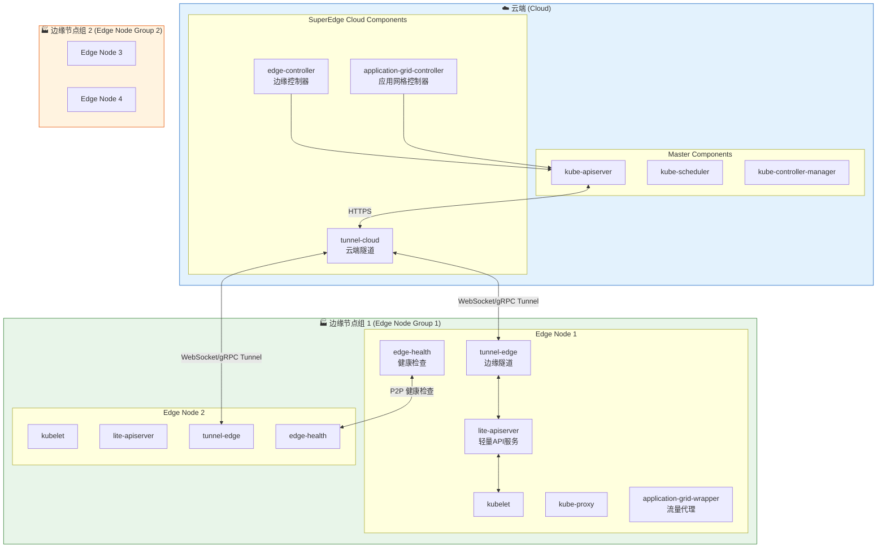

#<!-- chunk: 1.3 与标准 Kubernetes 的对比 -->## 1.3 与标准 Kubernetes 的对比

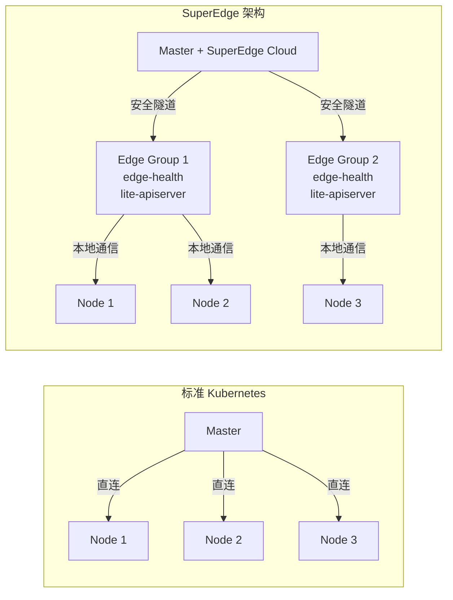

---

<!-- chunk: 2. 核心组件详解 -->## 2. 核心组件详解

#<!-- chunk: 2.1 组件清单 -->## 2.1 组件清单

SuperEdge 包含以下核心组件：

##<!-- chunk: 云端组件 (Cloud Components) -->## 云端组件 (Cloud Components)

| 组件名 | 功能 | 部署位置 |
|--------|------|----------|
| `tunnel-cloud` | 维护与边缘节点的长连接隧道 | Cloud Master |
| `edge-controller` | 管理边缘节点生命周期 | Cloud Master |
| `application-grid-controller` | 管理 ServiceGroup CRD | Cloud Master |

##<!-- chunk: 边缘组件 (Edge Components) -->## 边缘组件 (Edge Components)

| 组件名 | 功能 | 部署位置 |
|--------|------|----------|
| `tunnel-edge` | 维护到云端的隧道连接 | Edge Node ([[DaemonSet|DaemonSet]]) |
| `lite-apiserver` | 本地 API 代理与缓存 | Edge Node (Static Pod) |
| `edge-health` | 分布式节点健康检查 | Edge Node (DaemonSet) |
| `application-grid-wrapper` | 服务流量本地化代理 | Edge Node (DaemonSet) |

#<!-- chunk: 2.2 组件交互流程 -->## 2.2 组件交互流程

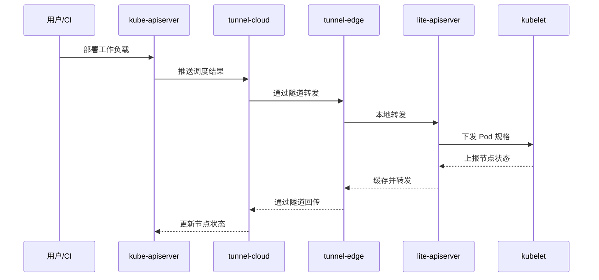

#<!-- chunk: 2.3 安装配置 -->## 2.3 安装配置

```bash
# 使用 edgeadm 工具安装 SuperEdge
# 下载 edgeadm
wget https://github.com/superedge/superedge/releases/latest/download/edgeadm-linux-amd64

chmod +x edgeadm-linux-amd64
mv edgeadm-linux-amd64 /usr/local/bin/edgeadm

# 初始化云端 Master（首次）
edgeadm init \
  --kubernetes-version=1.20.6 \
  --image-repository registry.cn-hangzhou.aliyuncs.com/superedge \
  --pod-network-cidr=192.168.0.0/16 \
  --service-cidr=10.96.0.0/12 \
  --apiserver-advertise-address=<MASTER_IP>

# 安装 SuperEdge 组件到已有集群
edgeadm change \
  --kubeconfig=/etc/kubernetes/admin.conf \
  --master-public-addr=<MASTER_PUBLIC_IP>:6443
```

---

<!-- chunk: 3. tunnel 隧道机制 -->## 3. tunnel 隧道机制

#<!-- chunk: 3.1 tunnel 设计原理 -->## 3.1 tunnel 设计原理

tunnel 是 SuperEdge 解决云边网络连通性的核心组件。由于边缘节点通常位于 NAT 后面或防火墙限制的网络中，云端 Master 无法直接访问边缘节点。tunnel 通过以下方式解决：

1. **边缘主动连接**：tunnel-edge 主动向 tunnel-cloud 建立 WebSocket/gRPC 长连接
2. **隧道复用**：单条隧道承载多路请求（kubectl exec、logs、metrics 等）
3. **TLS 加密**：所有隧道通信均使用 mTLS 加密
4. **心跳保活**：定期心跳检测维持连接活跃

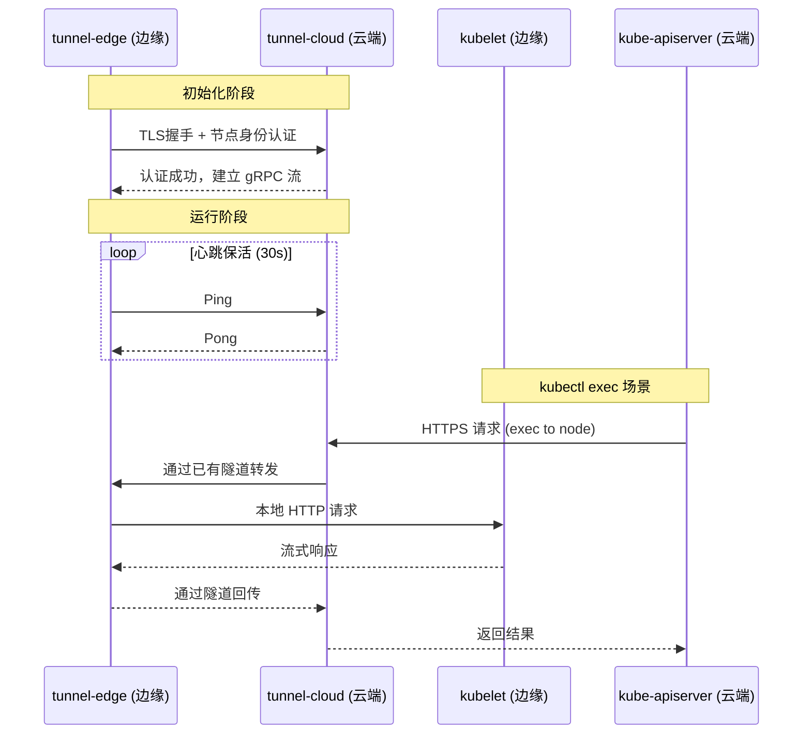

#<!-- chunk: 3.2 tunnel-cloud 配置 -->## 3.2 tunnel-cloud 配置

```yaml
# tunnel-cloud ConfigMap
apiVersion: v1
kind: ConfigMap
metadata:
  name: tunnel-cloud-conf
  namespace: edge-system
data:
  tunnel_cloud.toml: |
    [mode]
      [mode.cloud]
        [mode.cloud.stream]
          [mode.cloud.stream.server]
            # gRPC 服务监听地址
            grpcport = 9000
          [mode.cloud.stream.dns]
            # 边缘节点 DNS 解析配置
            configpath = "/etc/superedge/tunnel/conf/tunnel_persistent_peers.json"
        [mode.cloud.https]
          [mode.cloud.https.server]
            # HTTPS 转发服务端口
            addr = "127.0.0.1:9004"
          [mode.cloud.https.tokens]
            # 从 kubelet 证书获取 token
            tokenpath = "/etc/superedge/tunnel/conf/token"
```

```yaml
# tunnel-cloud Deployment
apiVersion: apps/v1
kind: Deployment
metadata:
  name: tunnel-cloud
  namespace: edge-system
spec:
  replicas: 1
  selector:
    matchLabels:
      app: tunnel-cloud
  template:
    metadata:
      labels:
        app: tunnel-cloud
    spec:
      hostNetwork: true
      nodeSelector:
        node-role.kubernetes.io/master: ""
      tolerations:
        - key: node-role.kubernetes.io/master
          effect: NoSchedule
      containers:
        - name: tunnel-cloud
          image: superedge/tunnel:v0.8.0
          command:
            - /usr/local/bin/tunnel
            - --m=cloud
            - --c=/etc/superedge/tunnel/conf/tunnel_cloud.toml
            - --log-dir=/data/superEdge/log/tunnel
            - --alsologtostderr
          env:
            - name: POD_IP
              valueFrom:
                fieldRef:
                  fieldPath: status.podIP
            - name: POD_NAMESPACE
              valueFrom:
                fieldRef:
                  fieldPath: metadata.namespace
            - name: POD_NAME
              valueFrom:
                fieldRef:
                  fieldPath: metadata.name
          volumeMounts:
            - name: tunnel-cloud-conf
              mountPath: /etc/superedge/tunnel/conf
            - name: tunnel-cloud-cert
              mountPath: /etc/superedge/tunnel/cert
          ports:
            - containerPort: 9000
              name: grpc
              protocol: TCP
            - containerPort: 9004
              name: https
              protocol: TCP
          resources:
            limits:
              cpu: 200m
              memory: 256Mi
            requests:
              cpu: 50m
              memory: 64Mi
      volumes:
        - name: tunnel-cloud-conf
          configMap:
            name: tunnel-cloud-conf
        - name: tunnel-cloud-cert
          secret:
            secretName: tunnel-cloud-cert
```

#<!-- chunk: 3.3 tunnel-edge 配置 -->## 3.3 tunnel-edge 配置

```yaml
# tunnel-edge ConfigMap
apiVersion: v1
kind: ConfigMap
metadata:
  name: tunnel-edge-conf
  namespace: edge-system
data:
  tunnel_edge.toml: |
    [mode]
      [mode.edge]
        [mode.edge.stream]
          [mode.edge.stream.client]
            # 云端 tunnel-cloud 地址
            addr = "TUNNEL_CLOUD_IP:9000"
            # 证书路径
            cafile = "/etc/superedge/tunnel/cert/ca.crt"
            certfile = "/etc/superedge/tunnel/cert/tls.crt"
            keyfile = "/etc/superedge/tunnel/cert/tls.key"
            # 重连间隔（秒）
            heartbeat = 40
          [mode.edge.https]
            [mode.edge.https.addr]
              # 代理到本地 kubelet
              "127.0.0.1:10250" = "127.0.0.1:10250"
```

```yaml
# tunnel-edge DaemonSet
apiVersion: apps/v1
kind: DaemonSet
metadata:
  name: tunnel-edge
  namespace: edge-system
spec:
  selector:
    matchLabels:
      app: tunnel-edge
  template:
    metadata:
      labels:
        app: tunnel-edge
    spec:
      hostNetwork: true
      nodeSelector:
        superedge.io/node-edge: "enable"
      tolerations:
        - effect: NoSchedule
          operator: Exists
        - effect: NoExecute
          operator: Exists
      containers:
        - name: tunnel-edge
          image: superedge/tunnel:v0.8.0
          command:
            - /usr/local/bin/tunnel
            - --m=edge
            - --c=/etc/superedge/tunnel/conf/tunnel_edge.toml
            - --log-dir=/data/superEdge/log/tunnel
            - --alsologtostderr
          env:
            - name: NODE_NAME
              valueFrom:
                fieldRef:
                  fieldPath: spec.nodeName
          volumeMounts:
            - name: tunnel-edge-conf
              mountPath: /etc/superedge/tunnel/conf
            - name: tunnel-edge-cert
              mountPath: /etc/superedge/tunnel/cert
          resources:
            limits:
              cpu: 100m
              memory: 128Mi
            requests:
              cpu: 10m
              memory: 32Mi
      volumes:
        - name: tunnel-edge-conf
          configMap:
            name: tunnel-edge-conf
        - name: tunnel-edge-cert
          secret:
            secretName: tunnel-edge-cert
```

#<!-- chunk: 3.4 隧道数据流详解 -->## 3.4 隧道数据流详解

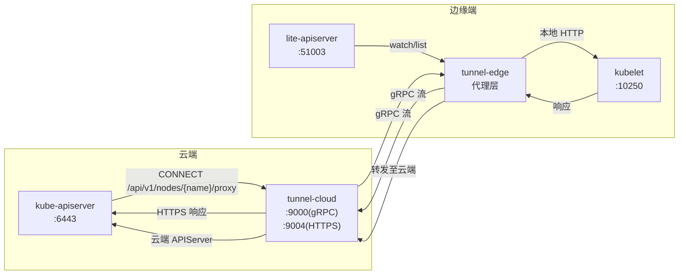

---

<!-- chunk: 4. edge-health 分布式健康检查 -->## 4. edge-health 分布式健康检查

#<!-- chunk: 4.1 问题背景 -->## 4.1 问题背景

在标准 Kubernetes 中，节点健康检查完全依赖云端 Master：如果节点心跳超时，Master 会将节点标记为 `NotReady` 并驱逐 Pod。

在边缘计算场景中，这会造成**误判**：
- 边缘节点网络正常，只是云边链路抖动
- 多个边缘节点之间互相通信正常
- 云端误判节点不健康，驱逐边缘 Pod
- 边缘业务中断

#<!-- chunk: 4.2 edge-health 解决方案 -->## 4.2 edge-health 解决方案

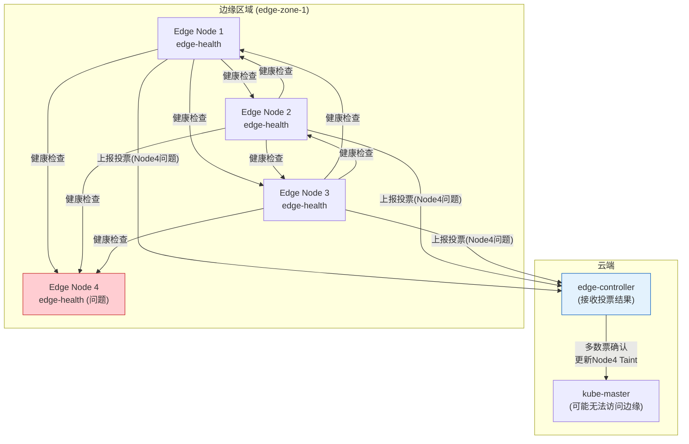

#<!-- chunk: 4.3 edge-health 工作机制 -->## 4.3 edge-health 工作机制

**分布式投票流程：**

1. 每个边缘节点的 `edge-health` 定期 ping 同区域其他节点
2. 收集各节点的健康状态
3. 通过 API Server（经 tunnel）上报投票结果到 `NodeHealthz` CRD
4. `edge-controller` 汇总投票，多数派认为不健康才标记节点为异常

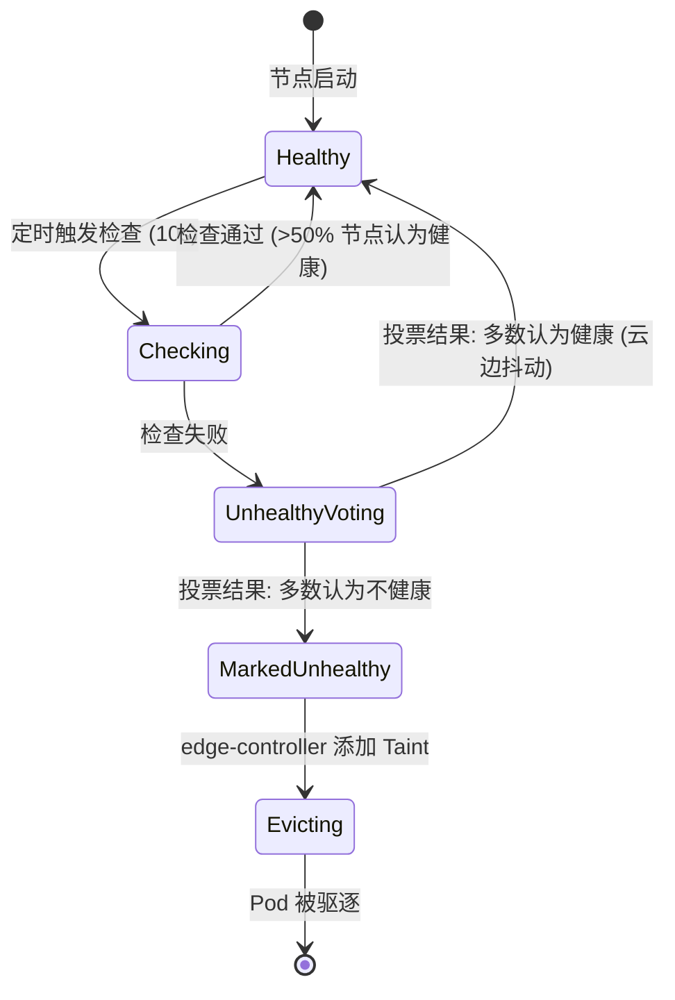

#<!-- chunk: 4.4 edge-health 配置 -->## 4.4 edge-health 配置

```yaml
# edge-health ConfigMap
apiVersion: v1
kind: ConfigMap
metadata:
  name: edge-health-config
  namespace: edge-system
data:
  # 健康检查配置
  checkconfig.yaml: |
    # 检查方式
    checkplugins:
      - name: kubelet-health-check
        pluginargs:
          # kubelet 健康检查端口
          port: 10250
          timeout: 3
      - name: ping-check
        pluginargs:
          timeout: 3
    # 投票阈值（百分比）
    healthcheckperiod: 10
    healthcheckscoreline: 100
```

```yaml
# edge-health DaemonSet
apiVersion: apps/v1
kind: DaemonSet
metadata:
  name: edge-health
  namespace: edge-system
spec:
  selector:
    matchLabels:
      app: edge-health
  template:
    metadata:
      labels:
        app: edge-health
    spec:
      # 必须使用 hostNetwork 访问节点 IP
      hostNetwork: true
      nodeSelector:
        superedge.io/node-edge: "enable"
      tolerations:
        - effect: NoSchedule
          operator: Exists
        - effect: NoExecute
          operator: Exists
      serviceAccountName: edge-health
      containers:
        - name: edge-health
          image: superedge/edge-health:v0.8.0
          command:
            - /usr/local/bin/edge-health
            - --logtostderr=true
            - --v=4
          env:
            - name: NODE_NAME
              valueFrom:
                fieldRef:
                  fieldPath: spec.nodeName
            - name: POD_NAMESPACE
              valueFrom:
                fieldRef:
                  fieldPath: metadata.namespace
          volumeMounts:
            - name: edge-health-config
              mountPath: /etc/edge-health
          resources:
            limits:
              cpu: 100m
              memory: 128Mi
            requests:
              cpu: 10m
              memory: 32Mi
      volumes:
        - name: edge-health-config
          configMap:
            name: edge-health-config
```

#<!-- chunk: 4.5 NodeHealthz CRD -->## 4.5 NodeHealthz CRD

```yaml
# NodeHealthz CRD 定义
apiVersion: apiextensions.k8s.io/v1
kind: CustomResourceDefinition
metadata:
  name: nodehealthzs.superedge.io
spec:
  group: superedge.io
  names:
    kind: NodeHealthz
    plural: nodehealthzs
    shortNames:
      - nhz
  scope: Cluster
  versions:
    - name: v1
      served: true
      storage: true
      schema:
        openAPIV3Schema:
          type: object
          properties:
            spec:
              type: object
              properties:
                checknodelist:
                  type: array
                  items:
                    type: object
                    properties:
                      nodename:
                        type: string
                      checklist:
                        type: array

---
# NodeHealthz 示例对象
apiVersion: superedge.io/v1
kind: NodeHealthz
metadata:
  name: edge-node-1
spec:
  checknodelist:
    - nodename: edge-node-2
      checklist:
        - checkernode: edge-node-1
          healthy: true
          time: "2024-01-15T10:30:00Z"
        - checkernode: edge-node-3
          healthy: true
          time: "2024-01-15T10:30:05Z"
    - nodename: edge-node-3
      checklist:
        - checkernode: edge-node-1
          healthy: false
          time: "2024-01-15T10:30:00Z"
        - checkernode: edge-node-2
          healthy: false
          time: "2024-01-15T10:30:05Z"
```

---

<!-- chunk: 5. ServiceGroup 服务拓扑 -->## 5. ServiceGroup 服务拓扑

#<!-- chunk: 5.1 ServiceGroup 概念 -->## 5.1 ServiceGroup 概念

ServiceGroup 是 SuperEdge 解决边缘流量本地化的核心机制。它通过自定义 CRD 实现：

- **流量本地化**：边缘节点上的 Pod 优先访问同一节点组内的服务
- **多区域部署**：同一工作负载在多个边缘区域独立部署
- **区域隔离**：不同边缘区域之间服务独立，互不干扰

#<!-- chunk: 5.2 ServiceGroup 核心 CRD -->## 5.2 ServiceGroup 核心 CRD

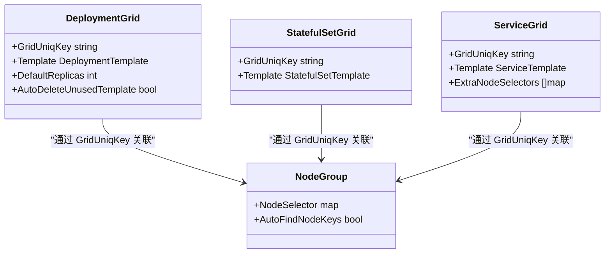

#<!-- chunk: 5.3 DeploymentGrid 示例 -->## 5.3 DeploymentGrid 示例

```yaml
# DeploymentGrid - 跨边缘区域部署工作负载
apiVersion: superedge.io/v1
kind: DeploymentGrid
metadata:
  name: nginx-deployment-grid
  namespace: default
spec:
  # 节点分组的 Label Key
  gridUniqKey: zone
  # 工作负载模板（与标准 Deployment spec 相同）
  template:
    replicas: 2
    selector:
      matchLabels:
        app: nginx
    template:
      metadata:
        labels:
          app: nginx
      spec:
        containers:
          - name: nginx
            image: nginx:1.21
            ports:
              - containerPort: 80
            resources:
              limits:
                cpu: 200m
                memory: 256Mi
              requests:
                cpu: 50m
                memory: 64Mi
        # 拓扑分布约束（确保在节点间分散）
        topologySpreadConstraints:
          - maxSkew: 1
            topologyKey: kubernetes.io/hostname
            whenUnsatisfiable: DoNotSchedule
            labelSelector:
              matchLabels:
                app: nginx
  # 默认副本数（当节点组没有特定配置时）
  defaultReplicas: 1
```

#<!-- chunk: 5.4 ServiceGrid 示例 -->## 5.4 ServiceGrid 示例

```yaml
# ServiceGrid - 为 DeploymentGrid 创建对应 Service
apiVersion: superedge.io/v1
kind: ServiceGrid
metadata:
  name: nginx-service-grid
  namespace: default
spec:
  gridUniqKey: zone
  template:
    selector:
      app: nginx
    ports:
      - port: 80
        targetPort: 80
        protocol: TCP
    # 使用 ClusterIP 类型（流量由 application-grid-wrapper 本地化）
    type: ClusterIP
```

#<!-- chunk: 5.5 节点分组配置 -->## 5.5 节点分组配置

```yaml
# 为边缘节点打 zone 标签，实现节点分组
# 节点组 zone-1
kubectl label node edge-node-1 zone=zone-1
kubectl label node edge-node-2 zone=zone-1

# 节点组 zone-2
kubectl label node edge-node-3 zone=zone-2
kubectl label node edge-node-4 zone=zone-2

# 验证 DeploymentGrid 创建的 Deployment
kubectl get deployments -l superedge.io/grid-uniq-key=zone

# 输出示例：
# NAME                          READY   UP-TO-DATE   AVAILABLE
# nginx-deployment-grid-zone-1  2/2     2            2
# nginx-deployment-grid-zone-2  2/2     2            2
```

#<!-- chunk: 5.6 ServiceGroup 流量路由 -->## 5.6 ServiceGroup 流量路由

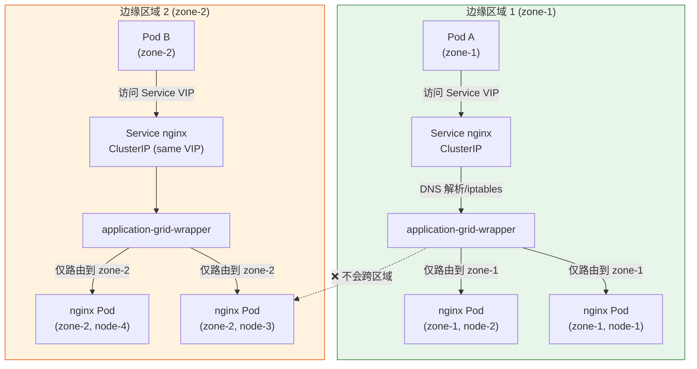

---

<!-- chunk: 6. 边缘节点自治 -->## 6. 边缘节点自治

#<!-- chunk: 6.1 自治场景 -->## 6.1 自治场景

边缘节点自治指：**当云边网络断开时，边缘节点能够独立维持业务运行**。

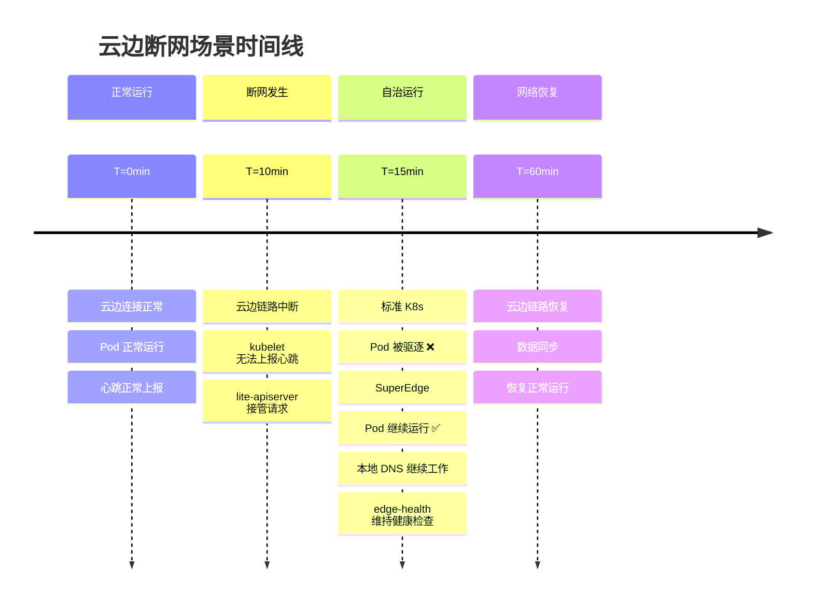

#<!-- chunk: 6.2 自治实现机制 -->## 6.2 自治实现机制

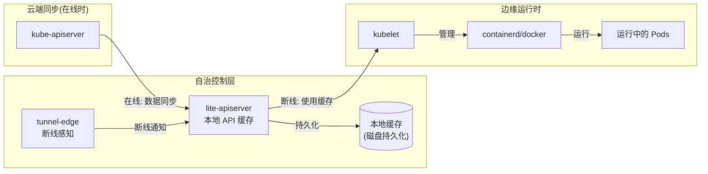

#<!-- chunk: 6.3 lite-apiserver 缓存策略 -->## 6.3 lite-apiserver 缓存策略

```yaml
# lite-apiserver 静态 Pod 配置
apiVersion: v1
kind: Pod
metadata:
  name: lite-apiserver
  namespace: edge-system
spec:
  hostNetwork: true
  containers:
    - name: lite-apiserver
      image: superedge/lite-apiserver:v0.8.0
      command:
        - /usr/local/bin/lite-apiserver
        # 云端 apiserver 地址
        - --kube-apiserver-url=https://MASTER_IP:6443
        # 本地监听地址
        - --bind-address=127.0.0.1
        - --port=51003
        # 缓存目录（持久化到本地磁盘）
        - --file-cache-path=/data/lite-apiserver/cache
        # 超时设置
        - --timeout=3
        # TLS 证书
        - --tls-cert-file=/etc/lite-apiserver/pki/lite-apiserver.crt
        - --tls-private-key-file=/etc/lite-apiserver/pki/lite-apiserver.key
        - --ca-file=/etc/lite-apiserver/pki/ca.crt
      volumeMounts:
        - name: cache-dir
          mountPath: /data/lite-apiserver/cache
        - name: cert-dir
          mountPath: /etc/lite-apiserver/pki
      resources:
        limits:
          cpu: 200m
          memory: 256Mi
  volumes:
    - name: cache-dir
      hostPath:
        path: /data/lite-apiserver/cache
        type: DirectoryOrCreate
    - name: cert-dir
      hostPath:
        path: /etc/lite-apiserver/pki
```

#<!-- chunk: 6.4 断网恢复流程 -->## 6.4 断网恢复流程

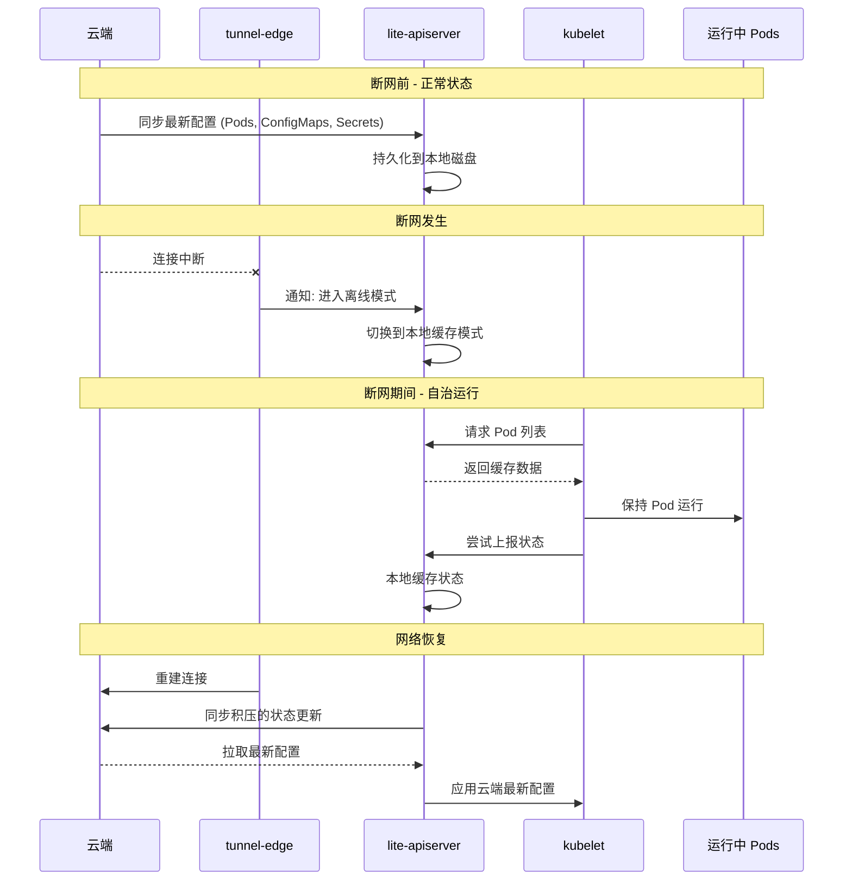

---

<!-- chunk: 7. lite-apiserver 设计 -->## 7. lite-apiserver 设计

#<!-- chunk: 7.1 架构职责 -->## 7.1 架构职责

`lite-apiserver` 是运行在每个边缘节点上的轻量级 API Server 代理，承担以下职责：

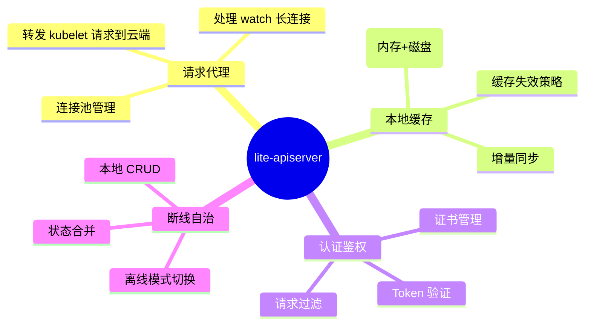

#<!-- chunk: 7.2 请求处理流程 -->## 7.2 请求处理流程

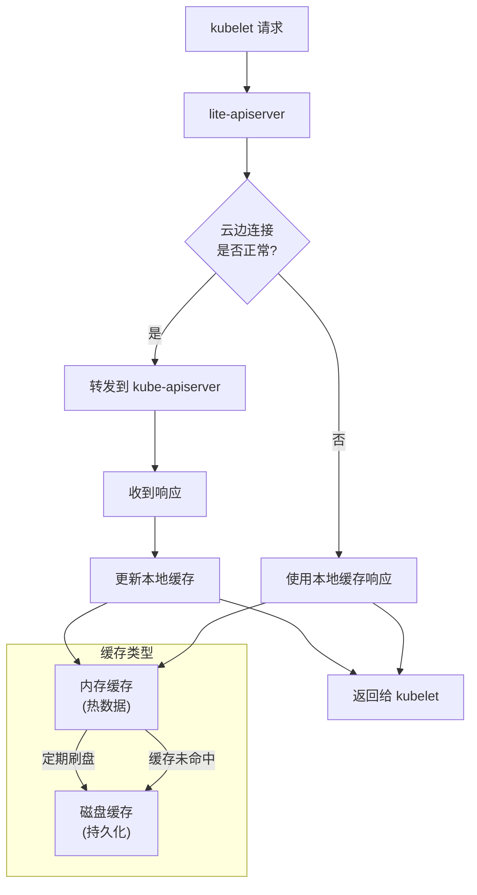

#<!-- chunk: 7.3 缓存资源类型 -->## 7.3 缓存资源类型

```go
// lite-apiserver 支持缓存的 Kubernetes 资源类型
var CacheableResources = []string{
    "pods",
    "configmaps",
    "secrets",
    "services",
    "endpoints",
    "nodes",
    "namespaces",
    "persistentvolumes",
    "persistentvolumeclaims",
    "events",
    // 自定义资源（通过配置添加）
}

// 缓存配置示例
type CacheConfig struct {
    // 内存缓存大小限制
    MaxMemoryCacheSizeMB int64
    // 磁盘缓存路径
    DiskCachePath string
    // 缓存 TTL（秒）
    CacheTTLSeconds int64
    // 是否启用增量同步
    EnableIncrementalSync bool
}
```

---

<!-- chunk: 8. application-grid-wrapper -->## 8. application-grid-wrapper

#<!-- chunk: 8.1 功能定位 -->## 8.1 功能定位

`application-grid-wrapper` 是实现 ServiceGroup 流量本地化的关键组件，它作为 DNS 和 kube-proxy 之间的代理层，将 Service 请求拦截并重定向到本地区域的 Endpoint。

#<!-- chunk: 8.2 工作原理 -->## 8.2 工作原理

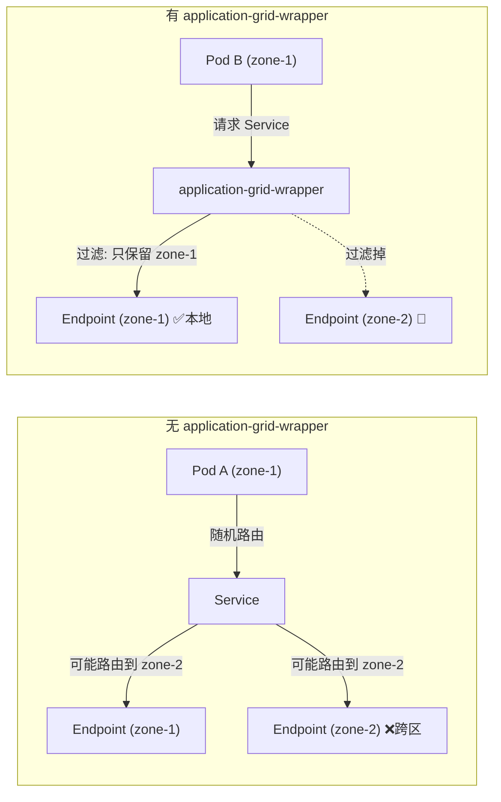

#<!-- chunk: 8.3 配置示例 -->## 8.3 配置示例

```yaml
# application-grid-wrapper ConfigMap
apiVersion: v1
kind: ConfigMap
metadata:
  name: application-grid-wrapper-config
  namespace: edge-system
data:
  wrapper.yaml: |
    # 监听地址（替代 kube-dns 的 53 端口）
    listenAddress: "169.254.20.11:53"
    
    # 上游 DNS 服务器
    upstreamDNS: "10.96.0.10:53"
    
    # 节点拓扑标签（用于判断本地区域）
    nodeTopologyKeys:
      - "zone"
      - "region"
    
    # 服务本地化规则
    serviceLocalizeRules:
      # 匹配 ServiceGrid 管理的 Service
      - labelSelector:
          superedge.io/grid-service: "true"
        # 优先路由到本地区域
        localFirst: true
        # 本地无可用 Endpoint 时是否降级到跨区域
        fallbackToGlobal: false
```

---

<!-- chunk: 9. 部署与配置实践 -->## 9. 部署与配置实践

#<!-- chunk: 9.1 边缘节点接入流程 -->## 9.1 边缘节点接入流程

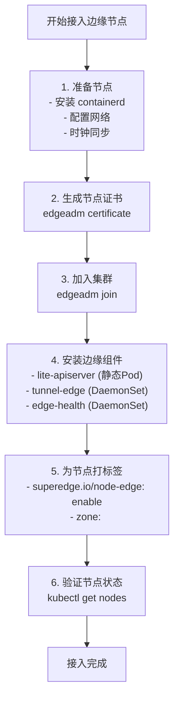

#<!-- chunk: 9.2 完整部署示例 -->## 9.2 完整部署示例

```bash
#!/bin/bash
# SuperEdge 边缘节点接入脚本

MASTER_IP="192.168.1.100"
MASTER_PORT="6443"
NODE_NAME="edge-node-1"
ZONE_NAME="factory-zone-1"

# 1. 生成 token（在 Master 节点执行）
TOKEN=$(kubeadm token create --print-join-command | awk '{print $5}')
CA_HASH=$(kubeadm token create --print-join-command | awk '{print $7}')

# 2. 在边缘节点执行 join
edgeadm join ${MASTER_IP}:${MASTER_PORT} \
  --token ${TOKEN} \
  --discovery-token-ca-cert-hash ${CA_HASH} \
  --node-labels superedge.io/node-edge=enable,zone=${ZONE_NAME} \
  --install-pkg-path ./edge-install.tar.gz

# 3. 验证节点状态（在 Master 执行）
kubectl get nodes ${NODE_NAME}
kubectl get pods -n edge-system --field-selector spec.nodeName=${NODE_NAME}

# 4. 验证 tunnel 连接
kubectl logs -n edge-system \
  $(kubectl get pods -n edge-system -l app=tunnel-cloud -o name) \
  | grep "${NODE_NAME}"
```

#<!-- chunk: 9.3 多区域部署示例 -->## 9.3 多区域部署示例

```yaml
# 完整的 ServiceGroup 多区域部署示例
# 场景：工厂数据采集服务，部署在 3 个车间（zone）

---
# 命名空间
apiVersion: v1
kind: Namespace
metadata:
  name: factory-apps

---
# DeploymentGrid: 数据采集服务
apiVersion: superedge.io/v1
kind: DeploymentGrid
metadata:
  name: data-collector
  namespace: factory-apps
spec:
  gridUniqKey: workshop
  template:
    replicas: 2
    selector:
      matchLabels:
        app: data-collector
    template:
      metadata:
        labels:
          app: data-collector
      spec:
        containers:
          - name: collector
            image: factory/data-collector:v2.1.0
            env:
              - name: NODE_ZONE
                valueFrom:
                  fieldRef:
                    fieldPath: metadata.labels['workshop']
              - name: COLLECT_INTERVAL
                value: "5s"
            ports:
              - containerPort: 8080
                name: http
              - containerPort: 9090
                name: metrics
            readinessProbe:
              httpGet:
                path: /health
                port: 8080
              initialDelaySeconds: 5
              periodSeconds: 10
            resources:
              limits:
                cpu: 500m
                memory: 512Mi
              requests:
                cpu: 100m
                memory: 128Mi
        # 节点亲和性：调度到标记了 workshop 标签的节点
        affinity:
          nodeAffinity:
            requiredDuringSchedulingIgnoredDuringExecution:
              nodeSelectorTerms:
                - matchExpressions:
                    - key: workshop
                      operator: Exists

---
# ServiceGrid: 为数据采集服务创建 Service
apiVersion: superedge.io/v1
kind: ServiceGrid
metadata:
  name: data-collector-svc
  namespace: factory-apps
spec:
  gridUniqKey: workshop
  template:
    selector:
      app: data-collector
    ports:
      - name: http
        port: 8080
        targetPort: 8080
      - name: metrics
        port: 9090
        targetPort: 9090
    type: ClusterIP

---
# 节点标签（为不同车间节点打标签）
# kubectl label node workshop-node-1 workshop=workshop-A
# kubectl label node workshop-node-2 workshop=workshop-A
# kubectl label node workshop-node-3 workshop=workshop-B
# kubectl label node workshop-node-4 workshop=workshop-B
# kubectl label node workshop-node-5 workshop=workshop-C
# kubectl label node workshop-node-6 workshop=workshop-C
```

#<!-- chunk: 9.4 RBAC 配置 -->## 9.4 RBAC 配置

```yaml
# edge-health RBAC
apiVersion: v1
kind: ServiceAccount
metadata:
  name: edge-health
  namespace: edge-system

---
apiVersion: rbac.authorization.k8s.io/v1
kind: ClusterRole
metadata:
  name: edge-health
rules:
  - apiGroups: [""]
    resources: ["nodes"]
    verbs: ["get", "list", "watch", "patch", "update"]
  - apiGroups: ["superedge.io"]
    resources: ["nodehealthzs"]
    verbs: ["get", "list", "watch", "create", "update", "patch"]

---
apiVersion: rbac.authorization.k8s.io/v1
kind: ClusterRoleBinding
metadata:
  name: edge-health
roleRef:
  apiGroup: rbac.authorization.k8s.io
  kind: ClusterRole
  name: edge-health
subjects:
  - kind: ServiceAccount
    name: edge-health
    namespace: edge-system

---
# application-grid-controller RBAC
apiVersion: rbac.authorization.k8s.io/v1
kind: ClusterRole
metadata:
  name: application-grid-controller
rules:
  - apiGroups: ["superedge.io"]
    resources: ["deploymentgrids", "servicegroups", "statefulsetgrids"]
    verbs: ["*"]
  - apiGroups: ["apps"]
    resources: ["deployments", "statefulsets"]
    verbs: ["*"]
  - apiGroups: [""]
    resources: ["services", "endpoints"]
    verbs: ["*"]
  - apiGroups: [""]
    resources: ["nodes"]
    verbs: ["get", "list", "watch"]
```

---

<!-- chunk: 10. 故障排查与运维 -->## 10. 故障排查与运维

#<!-- chunk: 10.1 常见问题排查 -->## 10.1 常见问题排查

##<!-- chunk: 问题 1: 边缘节点 NotReady -->## 问题 1: 边缘节点 NotReady

```bash
# 检查节点状态
kubectl describe node edge-node-1

# 检查 tunnel-edge 是否正常运行
kubectl get pods -n edge-system -l app=tunnel-edge --field-selector spec.nodeName=edge-node-1

# 查看 tunnel-edge 日志
kubectl logs -n edge-system <tunnel-edge-pod-name> --tail=100

# 检查 tunnel-cloud 连接状态
kubectl logs -n edge-system <tunnel-cloud-pod-name> | grep "edge-node-1"

# 常见原因：
# 1. 证书过期 → 更新 tunnel 证书
# 2. 网络端口被防火墙阻断 → 检查 9000/tcp 端口
# 3. tunnel-cloud 地址配置错误 → 检查 ConfigMap
```

##<!-- chunk: 问题 2: edge-health 投票异常 -->## 问题 2: edge-health 投票异常

```bash
# 查看 NodeHealthz 对象
kubectl get nodehealthz -o yaml

# 查看 edge-health 日志
kubectl logs -n edge-system <edge-health-pod-name> --tail=200 | grep -E "ERROR|WARN|vote"

# 手动检查节点间连通性
# 在 edge-node-1 上执行
curl -k https://edge-node-2:10250/healthz

# 检查 edge-controller 是否正常处理投票
kubectl logs -n edge-system <edge-controller-pod-name> | grep -E "taint|healthz"
```

##<!-- chunk: 问题 3: ServiceGroup 流量未本地化 -->## 问题 3: ServiceGroup 流量未本地化

```bash
# 检查节点是否有正确的 zone 标签
kubectl get nodes --show-labels | grep zone

# 检查 ServiceGrid 是否正确创建了 Service
kubectl get services -l superedge.io/grid-service=true

# 检查 application-grid-wrapper 日志
kubectl logs -n edge-system <app-grid-wrapper-pod> | grep "endpoint"

# 验证流量路由（在边缘节点执行）
# 查看 iptables 规则
iptables -t nat -L KUBE-SERVICES | grep <service-cluster-ip>
```

#<!-- chunk: 10.2 诊断脚本 -->## 10.2 诊断脚本

```bash
#!/bin/bash
# SuperEdge 一键诊断脚本

NAMESPACE="edge-system"
NODE_NAME=${1:-"all"}

echo "========================================="
echo " SuperEdge 诊断工具"
echo "========================================="

# 1. 检查云端组件
echo ""
echo "【云端组件状态】"
echo "-----------------------------------------"
for comp in tunnel-cloud edge-controller application-grid-controller; do
    STATUS=$(kubectl get pods -n ${NAMESPACE} -l app=${comp} \
        --no-headers 2>/dev/null | awk '{print $3}')
    if [ "${STATUS}" = "Running" ]; then
        echo "✅ ${comp}: Running"
    else
        echo "❌ ${comp}: ${STATUS:-Not Found}"
    fi
done

# 2. 检查边缘节点组件
echo ""
echo "【边缘组件状态】"
echo "-----------------------------------------"
EDGE_NODES=$(kubectl get nodes -l superedge.io/node-edge=enable \
    --no-headers | awk '{print $1}')

for node in ${EDGE_NODES}; do
    echo "节点: ${node}"
    for comp in tunnel-edge edge-health application-grid-wrapper; do
        POD=$(kubectl get pods -n ${NAMESPACE} -l app=${comp} \
            --field-selector spec.nodeName=${node} --no-headers 2>/dev/null | head -1)
        if [ -n "${POD}" ]; then
            STATUS=$(echo "${POD}" | awk '{print $3}')
            echo "  - ${comp}: ${STATUS}"
        else
            echo "  - ${comp}: ❌ 未找到"
        fi
    done
done

# 3. 检查 ServiceGroup
echo ""
echo "【ServiceGroup 资源】"
echo "-----------------------------------------"
kubectl get deploymentgrid,servicegrid,statefulsetgrid --all-namespaces 2>/dev/null

# 4. 检查节点健康状态
echo ""
echo "【节点健康状态】"
echo "-----------------------------------------"
kubectl get nodehealthz 2>/dev/null || echo "NodeHealthz CRD 未找到"

echo ""
echo "诊断完成"
```

#<!-- chunk: 10.3 监控指标 -->## 10.3 监控指标

```yaml
# Prometheus 监控配置 - SuperEdge 关键指标
apiVersion: monitoring.coreos.com/v1
kind: ServiceMonitor
metadata:
  name: superedge-metrics
  namespace: monitoring
spec:
  selector:
    matchLabels:
      app.kubernetes.io/part-of: superedge
  endpoints:
    - port: metrics
      interval: 30s
      path: /metrics

---
# 关键告警规则
apiVersion: monitoring.coreos.com/v1
kind: PrometheusRule
metadata:
  name: superedge-alerts
  namespace: monitoring
spec:
  groups:
    - name: superedge.tunnel
      rules:
        - alert: TunnelEdgeDisconnected
          expr: |
            superedge_tunnel_edge_connected == 0
          for: 5m
          labels:
            severity: warning
          annotations:
            summary: "边缘节点隧道断开"
            description: "节点 {{ $labels.node_name }} 的隧道已断开超过 5 分钟"

        - alert: EdgeNodeNotReady
          expr: |
            kube_node_status_condition{condition="Ready",status="true"} == 0
            and on(node)
            kube_node_labels{label_superedge_io_node_edge="enable"} == 1
          for: 10m
          labels:
            severity: critical
          annotations:
            summary: "边缘节点长时间 NotReady"
            description: "边缘节点 {{ $labels.node }} 不可用超过 10 分钟"

    - name: superedge.edge-health
      rules:
        - alert: EdgeHealthVotingAnomaly
          expr: |
            superedge_edge_health_vote_count{result="unhealthy"} > 0
          for: 2m
          labels:
            severity: warning
          annotations:
            summary: "边缘节点健康投票异常"
            description: "节点 {{ $labels.node }} 收到不健康投票"
```

---

<!-- chunk: 11. 性能优化 -->## 11. 性能优化

#<!-- chunk: 11.1 tunnel 性能优化 -->## 11.1 tunnel 性能优化

```yaml
# tunnel-cloud 高性能配置
# 适用于管理大量（>500）边缘节点的场景
apiVersion: v1
kind: ConfigMap
metadata:
  name: tunnel-cloud-conf-perf
  namespace: edge-system
data:
  tunnel_cloud.toml: |
    [mode]
      [mode.cloud]
        [mode.cloud.stream]
          [mode.cloud.stream.server]
            grpcport = 9000
            # 最大并发连接数
            maxconcurrentstreams = 1000
            # 连接保活时间
            keepalivetime = 30
            keepalivetimeout = 60
          [mode.cloud.performance]
            # 工作线程数（建议 = CPU 核数 * 2）
            workers = 16
            # 每个连接的缓冲区大小
            buffersize = 65536
```

```yaml
# tunnel-cloud 水平扩展配置
apiVersion: apps/v1
kind: Deployment
metadata:
  name: tunnel-cloud
  namespace: edge-system
spec:
  # 多副本支持（需要 Session Affinity）
  replicas: 3
  selector:
    matchLabels:
      app: tunnel-cloud
  template:
    spec:
      # 反亲和性确保分布在不同节点
      affinity:
        podAntiAffinity:
          requiredDuringSchedulingIgnoredDuringExecution:
            - labelSelector:
                matchExpressions:
                  - key: app
                    operator: In
                    values:
                      - tunnel-cloud
              topologyKey: kubernetes.io/hostname
      containers:
        - name: tunnel-cloud
          resources:
            limits:
              cpu: 2000m
              memory: 2Gi
            requests:
              cpu: 500m
              memory: 512Mi

---
# tunnel-cloud Service（使用 Session Affinity 保证连接粘性）
apiVersion: v1
kind: Service
metadata:
  name: tunnel-cloud
  namespace: edge-system
spec:
  selector:
    app: tunnel-cloud
  ports:
    - name: grpc
      port: 9000
      targetPort: 9000
  # ClientIP 亲和性确保同一节点始终连接同一 tunnel-cloud 实例
  sessionAffinity: ClientIP
  sessionAffinityConfig:
    clientIP:
      timeoutSeconds: 10800
```

#<!-- chunk: 11.2 lite-apiserver 缓存优化 -->## 11.2 lite-apiserver 缓存优化

```yaml
# 针对大量 ConfigMap/Secret 的优化配置
# lite-apiserver 启动参数优化
command:
  - /usr/local/bin/lite-apiserver
  - --kube-apiserver-url=https://MASTER_IP:6443
  - --bind-address=127.0.0.1
  - --port=51003
  - --file-cache-path=/data/lite-apiserver/cache
  # 增大内存缓存
  - --max-memory-cache-size=200  # MB
  # 预加载常用资源
  - --preload-resources=configmaps,secrets,pods
  # 连接池大小
  - --max-idle-conns=100
  - --max-idle-conns-per-host=20
  # 请求超时
  - --timeout=10
```

#<!-- chunk: 11.3 边缘节点资源规划 -->## 11.3 边缘节点资源规划

```yaml
# 边缘节点资源预留（kubelet 配置）
# /var/lib/kubelet/config.yaml
apiVersion: kubelet.config.k8s.io/v1beta1
kind: KubeletConfiguration

# 系统资源预留
systemReserved:
  cpu: "200m"
  memory: "512Mi"
  ephemeral-storage: "1Gi"

# Kubernetes 组件资源预留
kubeReserved:
  cpu: "200m"    # 为 SuperEdge 组件预留
  memory: "512Mi"  # tunnel-edge + edge-health + lite-apiserver

# 驱逐阈值
evictionHard:
  memory.available: "100Mi"
  nodefs.available: "5%"
  nodefs.inodesFree: "5%"

# 节点状态更新频率（减少云边流量）
nodeStatusUpdateFrequency: "30s"
nodeStatusReportFrequency: "5m"
```

---

<!-- chunk: 12. 最佳实践总结 -->## 12. 最佳实践总结

#<!-- chunk: 12.1 架构设计原则 -->## 12.1 架构设计原则

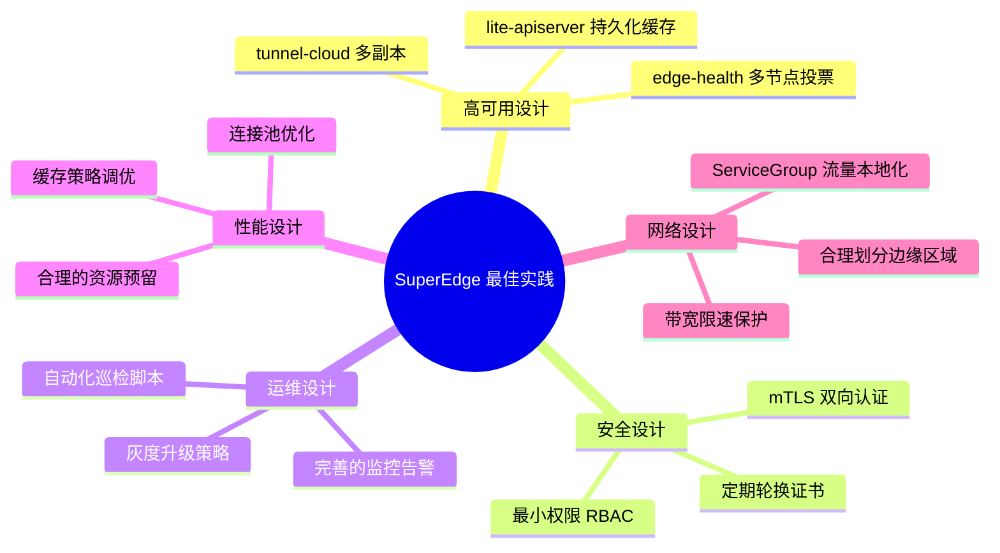

#<!-- chunk: 12.2 生产环境检查清单 -->## 12.2 生产环境检查清单

```markdown
<!-- chunk: SuperEdge 生产环境检查清单 -->## SuperEdge 生产环境检查清单

#<!-- chunk: 部署前检查 -->## 部署前检查
- [ ] 云端 Master 节点高可用（≥3 节点）
- [ ] tunnel-cloud 多副本部署（≥2 副本）
- [ ] 边缘节点每个区域 ≥2 个节点（保证 edge-health 投票）
- [ ] 证书有效期 ≥1 年，配置自动续期
- [ ] 防火墙放行 9000/tcp（tunnel gRPC 端口）

#<!-- chunk: 部署后验证 -->## 部署后验证
- [ ] 所有边缘节点状态为 Ready
- [ ] tunnel-edge 日志无 ERROR（连接建立成功）
- [ ] edge-health 投票正常
- [ ] ServiceGrid 流量路由到本地区域
- [ ] 断网测试：断开云边链路，验证边缘 Pod 继续运行

#<!-- chunk: 日常运维 -->## 日常运维
- [ ] 每日检查节点健康状态
- [ ] 每周检查证书有效期
- [ ] 每月演练云边断网自治场景
- [ ] 配置 Prometheus 告警
- [ ] 保留至少 30 天的日志
```

#<!-- chunk: 12.3 版本升级策略 -->## 12.3 版本升级策略

```bash
# SuperEdge 滚动升级脚本
#!/bin/bash

NEW_VERSION="v0.9.0"
NAMESPACE="edge-system"

# 1. 升级云端组件（先升级云端，后升级边缘）
echo "升级云端组件..."
kubectl set image deployment/edge-controller \
  edge-controller=superedge/edge-controller:${NEW_VERSION} \
  -n ${NAMESPACE}

kubectl set image deployment/application-grid-controller \
  application-grid-controller=superedge/application-grid-controller:${NEW_VERSION} \
  -n ${NAMESPACE}

# 等待云端组件就绪
kubectl rollout status deployment/edge-controller -n ${NAMESPACE}
kubectl rollout status deployment/application-grid-controller -n ${NAMESPACE}

# 2. 升级 tunnel-cloud（滚动升级，利用 Session Affinity 保证平滑）
echo "升级 tunnel-cloud..."
kubectl set image deployment/tunnel-cloud \
  tunnel-cloud=superedge/tunnel:${NEW_VERSION} \
  -n ${NAMESPACE}
kubectl rollout status deployment/tunnel-cloud -n ${NAMESPACE}

# 3. 升级边缘组件 DaemonSet（按区域分批升级）
for zone in zone-1 zone-2 zone-3; do
    echo "升级区域 ${zone} 的边缘组件..."
    
    # 临时为该区域节点打 upgrade-zone 标签
    kubectl label nodes -l zone=${zone} upgrade-zone=true
    
    # 更新 DaemonSet 镜像（DaemonSet 会按节点滚动更新）
    kubectl set image daemonset/tunnel-edge \
      tunnel-edge=superedge/tunnel:${NEW_VERSION} \
      -n ${NAMESPACE}
    
    # 等待该区域升级完成
    sleep 60
    kubectl rollout status daemonset/tunnel-edge -n ${NAMESPACE}
    
    # 验证该区域节点状态
    kubectl get nodes -l zone=${zone}
done

echo "升级完成！"
```

---

<!-- chunk: 总结 -->## 总结

SuperEdge 通过以下核心创新解决了边缘计算的主要挑战：

| 挑战 | SuperEdge 解决方案 | 核心组件 |
|------|-------------------|----------|
| 云边网络不稳定 | 主动建立隧道连接 | tunnel-cloud/edge |
| 节点误判驱逐 | 分布式投票健康检查 | edge-health |
| 断网业务中断 | 本地 API 缓存自治 | lite-apiserver |
| 流量跨区域 | 服务拓扑感知路由 | ServiceGroup + app-grid-wrapper |
| 多区域管理复杂 | CRD 统一多区域部署 | DeploymentGrid/ServiceGrid |

SuperEdge 已在腾讯内部数万台边缘节点的生产环境中验证，是构建大规模云边协同系统的可靠选择。

---

*文档版本: v1.0 | 适用 SuperEdge 版本: v0.8.x+*

---

<!-- chunk: Obsidian 相关文档 -->## Obsidian 相关文档

- domain-37-edge-computing KUDIG Database — Global MOC
- [[domain-15-specialized-tech/README|[[Domain 37: 边缘计算 (Edge Computing)|Domain 37: 边缘计算 (Edge Computing)]]]]
- Domain-37 边缘计算 — 开源项目索引
- 边缘计算架构概述 (Edge Computing Architecture Overview)
- 云边协同设计模式 (Cloud-Edge Collaboration Design Patterns)
- KubeEdge 架构与部署 (KubeEdge Architecture and Deployment)
- KubeEdge 设备管理与边缘应用 (KubeEdge Device Management and Edge Appl...
- OpenYurt 边缘方案 (OpenYurt Edge Solution)
- 边缘 AI 推理与联邦学习 (Edge AI Inference and Federated Learning)
- 边缘存储与网络 (Edge Storage and Network)
- 边缘安全架构 (Edge Security Architecture)
- 边缘场景案例 (Edge Computing Use Cases)

## See Also

- 04-kubeedge-device-edge-apps
- 05-openyurt-architecture
- 07-edge-ai-inference-federated-learning
- 08-edge-storage-network
