---
tags:
- edge
- [[KubeEdge|kubeedge]]
- tutorial
intent_queries:
- edge-ai-inference-federated-learning是什么？
- edge-ai-inference-federated-learning的使用方法
- edge-ai-inference-federated-learning的最佳实践

tier: peripheral---
title: 边缘 AI 推理与联邦学习 (Edge AI Inference and Federated Learning)
description: '<!-- chunk: 概述 (Overview)' -->## 概述 (Overview)'
category: edge-computing
tags:
- k8s
- edge
- iot
- kubeedge
- scheduler
- [[Prometheus|prometheus]]
- opa
- redis
- operator
- gpu
last_updated: 2026-05
difficulty: advanced
reading_level: advanced
audience:
- 边缘计算工程师
- SRE
- IoT 工程师
estimated_read_time: 5min
intent_queries:
- 边缘 AI 推理与联邦学习 (Edge AI Inference and Federated Learning) 是什么
- 如何 边缘 AI 推理与联邦学习 (Edge AI Inference and Federated Learning)
- [[Kubernetes|Kubernetes]] 37 edge computing 最佳实践
trigger_keywords:
- 边缘
- AI
- 推理与联邦学习
- Edge
- AI
- Inference
- and
- Federated
authors:
- name: KUDIG Team
  role: contributor
k8s_versions:
- '1.28'
- '1.29'
- '1.30'
- '1.31'
- '1.32'
---

# 边缘 AI 推理与联邦学习 (Edge AI Inference and Federated Learning)

<!-- chunk: 概述 (Overview) -->## 概述 (Overview)

随着 AIoT 的兴起，将 AI 推理能力下沉到边缘端成为主流趋势。边缘 AI 推理解决了云端推理的高延迟、带宽消耗和数据隐私问题；而联邦学习则在不集中数据的前提下实现分布式模型训练，保护数据隐私。本文档详细介绍边缘 AI 推理框架、模型优化技术和联邦学习架构的工程实践。

Edge AI inference brings intelligence to the edge, solving latency, bandwidth, and privacy challenges of cloud-based inference. Federated learning enables distributed model training without centralizing data. This document covers edge AI inference frameworks, model optimization techniques, and federated learning architecture for production deployments.

---

<!-- chunk: 目录 (Table of Contents) -->## 目录 (Table of Contents)

1. [边缘 AI 推理框架对比](#1-边缘-ai-推理框架对比)
2. [ONNX Runtime 边缘部署](#2-onnx-runtime-边缘部署)
3. [TensorFlow Lite 实践](#3-tensorflow-lite-实践)
4. [OpenVINO 边缘推理](#4-openvino-边缘推理)
5. [模型量化优化](#5-模型量化优化)
6. [模型剪枝技术](#6-模型剪枝技术)
7. [知识蒸馏](#7-知识蒸馏)
8. [联邦学习架构](#8-联邦学习架构)
9. [隐私保护机器学习](#9-隐私保护机器学习)
10. [边缘 AI Kubernetes 部署](#10-边缘-ai-kubernetes-部署)
11. [性能基准测试](#11-性能基准测试)
12. [最佳实践](#12-最佳实践)

---

<!-- chunk: 1. 边缘 AI 推理框架对比 -->## 1. 边缘 AI 推理框架对比

## 1.1 框架选型矩阵

| 框架 | 硬件支持 | 模型格式 | 量化支持 | 语言绑定 | 适用场景 |
|------|---------|---------|---------|---------|---------|
| **ONNX Runtime** | CPU/GPU/NPU | ONNX | INT8/FP16 | Python/C++/Java/C# | 通用推理，跨平台 |
| **TensorFlow Lite** | CPU/GPU/DSP/NPU | TFLite | INT8/FP16 | Python/C++/Java/Swift | 移动端/嵌入式 |
| **OpenVINO** | Intel CPU/GPU/VPU/FPGA | IR/ONNX | INT8 | Python/C++ | Intel 硬件加速 |
| **TensorRT** | NVIDIA GPU | ONNX/UFF | INT8/FP16 | Python/C++ | GPU 高性能推理 |
| **MNN** | CPU/GPU/NPU | MNN/ONNX/TF | INT8 | C++/Java/Python | 阿里移动端 |
| **NCNN** | CPU/Vulkan | NCNN | INT8 | C++ | 嵌入式高性能 |

## 1.2 边缘设备推理性能对比

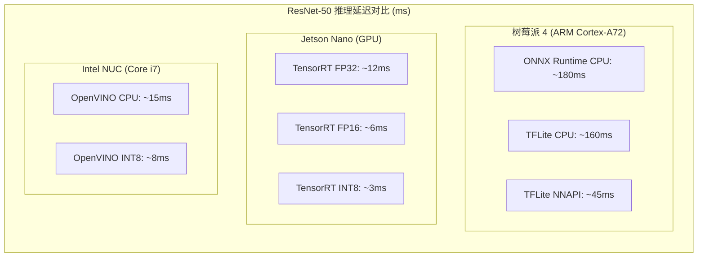

## 1.3 框架选型决策树

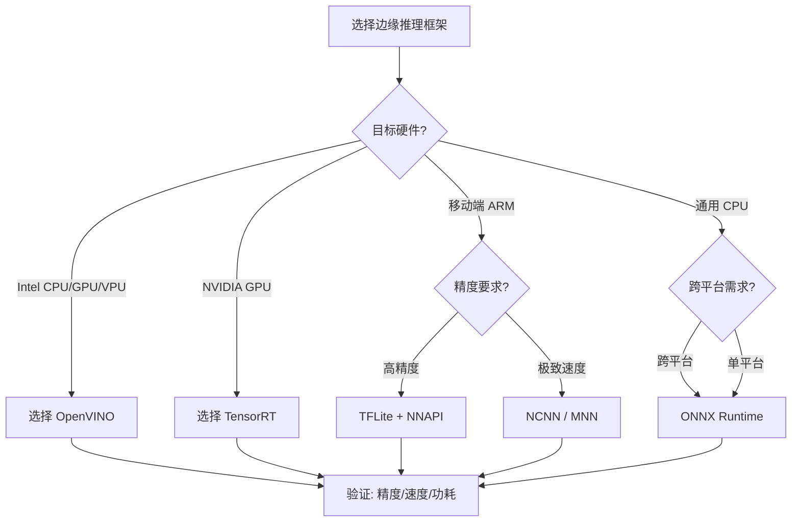

---

<!-- chunk: 2. ONNX Runtime 边缘部署 -->## 2. ONNX Runtime 边缘部署

## 2.1 ONNX Runtime 架构

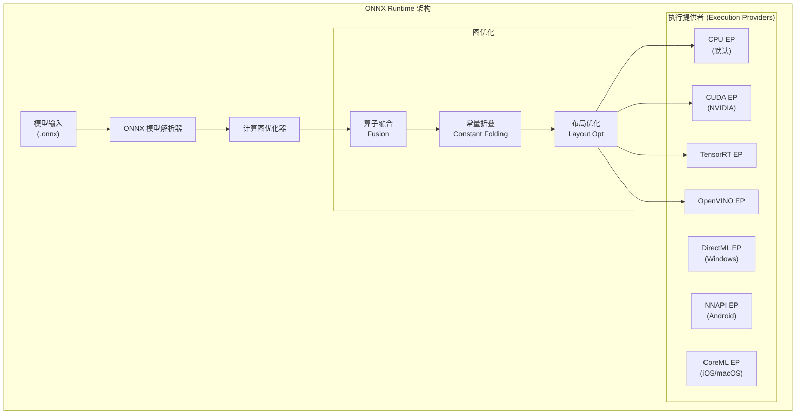

## 2.2 ONNX Runtime Python 推理示例

```python
# onnx_edge_inference.py
import onnxruntime as ort
import numpy as np
import time
from pathlib import Path
from typing import Dict, List, Optional, Tuple
import logging

logging.basicConfig(level=logging.INFO)
logger = logging.getLogger(__name__)


class EdgeInferenceEngine:
    """边缘端 ONNX Runtime 推理引擎"""
    
    def __init__(
        self,
        model_path: str,
        execution_providers: Optional[List[str]] = None,
        optimization_level: str = "all",
        inter_threads: int = 1,
        intra_threads: int = 4
    ):
        self.model_path = model_path
        
        # 配置会话选项
        sess_options = ort.SessionOptions()
        
        # 优化级别：basic / extended / all
        opt_map = {
            "basic": ort.GraphOptimizationLevel.ORT_ENABLE_BASIC,
            "extended": ort.GraphOptimizationLevel.ORT_ENABLE_EXTENDED,
            "all": ort.GraphOptimizationLevel.ORT_ENABLE_ALL,
        }
        sess_options.graph_optimization_level = opt_map.get(
            optimization_level, ort.GraphOptimizationLevel.ORT_ENABLE_ALL
        )
        
        # 线程配置（边缘设备通常核数少，合理配置避免过度竞争）
        sess_options.inter_op_num_threads = inter_threads
        sess_options.intra_op_num_threads = intra_threads
        
        # 启用内存优化
        sess_options.enable_mem_pattern = True
        sess_options.enable_cpu_mem_arena = True
        
        # 执行提供者优先级列表
        if execution_providers is None:
            # 自动检测可用 EP
            execution_providers = self._get_available_providers()
        
        logger.info(f"初始化 ONNX Runtime, EPs: {execution_providers}")
        
        self.session = ort.InferenceSession(
            model_path,
            sess_options=sess_options,
            providers=execution_providers
        )
        
        # 获取输入输出信息
        self.input_names = [i.name for i in self.session.get_inputs()]
        self.output_names = [o.name for o in self.session.get_outputs()]
        self.input_shapes = {i.name: i.shape for i in self.session.get_inputs()}
        
        logger.info(f"模型加载成功: {model_path}")
        logger.info(f"输入: {self.input_shapes}")
        logger.info(f"输出: {[o.name for o in self.session.get_outputs()]}")
    
    def _get_available_providers(self) -> List[str]:
        """自动检测可用的执行提供者"""
        available = ort.get_available_providers()
        # 优先级: TensorRT > CUDA > OpenVINO > CPU
        preferred = ["TensorrtExecutionProvider", "CUDAExecutionProvider",
                     "OpenVINOExecutionProvider", "CPUExecutionProvider"]
        return [p for p in preferred if p in available]
    
    def run(self, inputs: Dict[str, np.ndarray]) -> Dict[str, np.ndarray]:
        """执行推理"""
        start = time.perf_counter()
        outputs = self.session.run(self.output_names, inputs)
        elapsed_ms = (time.perf_counter() - start) * 1000
        logger.debug(f"推理耗时: {elapsed_ms:.2f}ms")
        
        return dict(zip(self.output_names, outputs))
    
    def benchmark(self, input_data: Dict[str, np.ndarray], 
                  num_runs: int = 100) -> Dict:
        """性能基准测试"""
        # 预热
        for _ in range(10):
            self.run(input_data)
        
        # 正式测试
        latencies = []
        for _ in range(num_runs):
            start = time.perf_counter()
            self.run(input_data)
            latencies.append((time.perf_counter() - start) * 1000)
        
        latencies = np.array(latencies)
        return {
            "mean_ms": float(np.mean(latencies)),
            "median_ms": float(np.median(latencies)),
            "p95_ms": float(np.percentile(latencies, 95)),
            "p99_ms": float(np.percentile(latencies, 99)),
            "min_ms": float(np.min(latencies)),
            "max_ms": float(np.max(latencies)),
            "throughput_qps": 1000.0 / float(np.mean(latencies))
        }


# 图像分类推理示例
class ImageClassifier:
    """基于 ONNX Runtime 的图像分类器"""
    
    def __init__(self, model_path: str, class_labels: List[str]):
        self.engine = EdgeInferenceEngine(
            model_path=model_path,
            # 边缘 CPU 推理，使用 OpenVINO 加速（如果可用）
            execution_providers=[
                "OpenVINOExecutionProvider",
                "CPUExecutionProvider"
            ],
            intra_threads=4
        )
        self.class_labels = class_labels
        self.input_size = (224, 224)  # 标准输入尺寸
    
    def preprocess(self, image: np.ndarray) -> np.ndarray:
        """图像预处理"""
        import cv2
        # 调整尺寸
        img = cv2.resize(image, self.input_size)
        # BGR -> RGB
        img = cv2.cvtColor(img, cv2.COLOR_BGR2RGB)
        # 归一化
        img = img.astype(np.float32) / 255.0
        mean = np.array([0.485, 0.456, 0.406])
        std = np.array([0.229, 0.224, 0.225])
        img = (img - mean) / std
        # HWC -> NCHW
        img = np.transpose(img, (2, 0, 1))
        img = np.expand_dims(img, axis=0)
        return img.astype(np.float32)
    
    def predict(self, image: np.ndarray) -> Tuple[str, float]:
        """预测图像类别"""
        processed = self.preprocess(image)
        outputs = self.engine.run({"input": processed})
        
        # Softmax
        logits = outputs["output"][0]
        exp_logits = np.exp(logits - np.max(logits))
        probs = exp_logits / exp_logits.sum()
        
        top_idx = np.argmax(probs)
        return self.class_labels[top_idx], float(probs[top_idx])


# 使用示例
if __name__ == "__main__":
    import cv2
    
    # 初始化分类器
    classifier = ImageClassifier(
        model_path="resnet50_quantized.onnx",
        class_labels=["cat", "dog", "car", "person"]
    )
    
    # 读取图像
    image = cv2.imread("test.jpg")
    
    # 预测
    label, confidence = classifier.predict(image)
    print(f"预测结果: {label} (置信度: {confidence:.2%})")
    
    # 性能测试
    dummy_input = {"input": np.random.randn(1, 3, 224, 224).astype(np.float32)}
    bench = classifier.engine.benchmark(dummy_input, num_runs=200)
    print(f"性能报告:")
    print(f"  平均延迟: {bench['mean_ms']:.2f}ms")
    print(f"  P95 延迟: {bench['p95_ms']:.2f}ms")
    print(f"  吞吐量: {bench['throughput_qps']:.1f} QPS")
```

## 2.3 模型转换为 ONNX

```python
# model_converter.py - 将各种框架模型转换为 ONNX

import torch
import torch.onnx
import onnx
import onnxruntime as ort
import numpy as np


def pytorch_to_onnx(
    model: torch.nn.Module,
    input_shape: tuple,
    output_path: str,
    opset_version: int = 13,
    dynamic_axes: dict = None
) -> None:
    """PyTorch 模型转换为 ONNX"""
    model.eval()
    dummy_input = torch.randn(*input_shape)
    
    if dynamic_axes is None:
        # 支持动态 batch size
        dynamic_axes = {
            "input": {0: "batch_size"},
            "output": {0: "batch_size"}
        }
    
    torch.onnx.export(
        model,
        dummy_input,
        output_path,
        export_params=True,
        opset_version=opset_version,
        do_constant_folding=True,  # 常量折叠优化
        input_names=["input"],
        output_names=["output"],
        dynamic_axes=dynamic_axes,
        verbose=False
    )
    
    # 验证转换结果
    onnx_model = onnx.load(output_path)
    onnx.checker.check_model(onnx_model)
    print(f"✅ 模型转换成功: {output_path}")
    
    # 验证推理结果一致性
    dummy_np = dummy_input.numpy()
    
    # PyTorch 推理
    with torch.no_grad():
        pt_output = model(dummy_input).numpy()
    
    # ONNX Runtime 推理
    ort_session = ort.InferenceSession(output_path)
    ort_output = ort_session.run(None, {"input": dummy_np})[0]
    
    # 比较结果
    max_diff = np.max(np.abs(pt_output - ort_output))
    print(f"最大误差: {max_diff:.6f}")
    assert max_diff < 1e-4, f"转换精度损失过大: {max_diff}"


def optimize_onnx_model(input_path: str, output_path: str) -> None:
    """使用 ONNX Runtime 优化模型"""
    from onnxruntime.transformers import optimizer
    
    sess_options = ort.SessionOptions()
    sess_options.graph_optimization_level = ort.GraphOptimizationLevel.ORT_ENABLE_ALL
    sess_options.optimized_model_filepath = output_path
    
    # 运行一次以触发优化并保存
    _ = ort.InferenceSession(
        input_path,
        sess_options=sess_options,
        providers=["CPUExecutionProvider"]
    )
    
    print(f"✅ 模型优化完成: {output_path}")
    
    # 比较模型大小
    import os
    orig_size = os.path.getsize(input_path) / 1024 / 1024
    opt_size = os.path.getsize(output_path) / 1024 / 1024
    print(f"原始大小: {orig_size:.2f} MB")
    print(f"优化后大小: {opt_size:.2f} MB")
    print(f"压缩比: {orig_size/opt_size:.2f}x")
```

---

<!-- chunk: 3. TensorFlow Lite 实践 -->## 3. TensorFlow Lite 实践

## 3.1 TFLite 部署架构

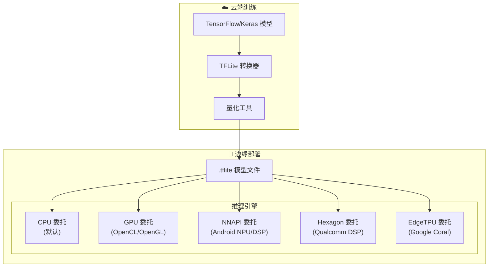

## 3.2 TFLite 转换与部署

```python
# tflite_edge_deploy.py
import tensorflow as tf
import numpy as np
from typing import Optional, List


class TFLiteConverter:
    """TensorFlow Lite 模型转换器"""
    
    @staticmethod
    def convert_with_quantization(
        saved_model_dir: str,
        output_path: str,
        quantization_type: str = "dynamic",
        representative_dataset_fn=None,
        target_spec_ops: Optional[List] = None
    ) -> None:
        """
        转换并量化 TFLite 模型
        
        Args:
            quantization_type: 
                - 'none': 不量化（FP32）
                - 'dynamic': 动态范围量化（权重 INT8）
                - 'full_int8': 全整数量化（激活+权重 INT8）
                - 'fp16': 半精度量化
        """
        converter = tf.lite.TFLiteConverter.from_saved_model(saved_model_dir)
        
        if quantization_type == "dynamic":
            # 动态范围量化：仅量化权重，激活值运行时量化
            converter.optimizations = [tf.lite.Optimize.DEFAULT]
            
        elif quantization_type == "full_int8":
            # 全整数量化：需要代表性数据集校准激活值范围
            assert representative_dataset_fn is not None, \
                "全整数量化需要提供 representative_dataset_fn"
            
            converter.optimizations = [tf.lite.Optimize.DEFAULT]
            converter.representative_dataset = representative_dataset_fn
            # 强制所有算子使用 INT8
            converter.target_spec.supported_ops = [
                tf.lite.OpsSet.TFLITE_BUILTINS_INT8
            ]
            converter.inference_input_type = tf.int8
            converter.inference_output_type = tf.int8
            
        elif quantization_type == "fp16":
            # FP16 量化：在支持 FP16 的 GPU 上效果好
            converter.optimizations = [tf.lite.Optimize.DEFAULT]
            converter.target_spec.supported_types = [tf.float16]
        
        if target_spec_ops:
            converter.target_spec.supported_ops = target_spec_ops
        
        # 执行转换
        tflite_model = converter.convert()
        
        # 保存模型
        with open(output_path, 'wb') as f:
            f.write(tflite_model)
        
        import os
        model_size = os.path.getsize(output_path) / 1024 / 1024
        print(f"✅ TFLite 模型保存: {output_path} ({model_size:.2f} MB)")


class TFLiteInferenceEngine:
    """TFLite 边缘推理引擎"""
    
    def __init__(
        self,
        model_path: str,
        num_threads: int = 4,
        use_gpu: bool = False,
        use_nnapi: bool = False
    ):
        self.interpreter = tf.lite.Interpreter(
            model_path=model_path,
            num_threads=num_threads
        )
        
        # 配置委托（硬件加速）
        delegates = []
        
        if use_gpu:
            try:
                gpu_delegate = tf.lite.experimental.load_delegate(
                    'libdelegate.so',  # GPU 委托库路径因平台而异
                    options={"precision_loss_allowed": 1}
                )
                delegates.append(gpu_delegate)
                print("✅ GPU 委托已启用")
            except Exception as e:
                print(f"⚠️  GPU 委托不可用: {e}")
        
        if use_nnapi:
            try:
                nnapi_delegate = tf.lite.experimental.load_delegate(
                    'libnnapi_util.so'
                )
                delegates.append(nnapi_delegate)
                print("✅ NNAPI 委托已启用")
            except Exception as e:
                print(f"⚠️  NNAPI 委托不可用: {e}")
        
        if delegates:
            self.interpreter = tf.lite.Interpreter(
                model_path=model_path,
                experimental_delegates=delegates,
                num_threads=num_threads
            )
        
        self.interpreter.allocate_tensors()
        
        # 获取输入输出信息
        self.input_details = self.interpreter.get_input_details()
        self.output_details = self.interpreter.get_output_details()
        
        print(f"输入信息: {self.input_details}")
        print(f"输出信息: {self.output_details}")
    
    def infer(self, input_data: np.ndarray) -> np.ndarray:
        """执行推理"""
        # 量化处理（如果是 INT8 模型）
        input_detail = self.input_details[0]
        if input_detail['dtype'] == np.int8:
            scale, zero_point = input_detail['quantization']
            input_data = (input_data / scale + zero_point).astype(np.int8)
        
        self.interpreter.set_tensor(input_detail['index'], input_data)
        self.interpreter.invoke()
        
        output = self.interpreter.get_tensor(self.output_details[0]['index'])
        
        # 反量化（如果是 INT8 输出）
        output_detail = self.output_details[0]
        if output_detail['dtype'] == np.int8:
            scale, zero_point = output_detail['quantization']
            output = (output.astype(np.float32) - zero_point) * scale
        
        return output


# 代表性数据集生成器（用于全整数量化）
def make_representative_dataset(calibration_data: np.ndarray):
    """生成校准数据集"""
    def representative_dataset_gen():
        for i in range(min(100, len(calibration_data))):
            sample = calibration_data[i:i+1].astype(np.float32)
            yield [sample]
    return representative_dataset_gen


# 示例：目标检测部署
class EdgeObjectDetector:
    """边缘端目标检测器（基于 TFLite）"""
    
    def __init__(self, model_path: str, labels_path: str):
        self.engine = TFLiteInferenceEngine(
            model_path=model_path,
            num_threads=4,
            use_nnapi=True  # 在支持 NNAPI 的 Android 设备上启用
        )
        
        with open(labels_path, 'r') as f:
            self.labels = [line.strip() for line in f.readlines()]
        
        # 获取输入尺寸
        input_shape = self.engine.input_details[0]['shape']
        self.input_height = input_shape[1]
        self.input_width = input_shape[2]
    
    def detect(self, image: np.ndarray, score_threshold: float = 0.5):
        """检测图像中的目标"""
        import cv2
        
        # 预处理
        img = cv2.resize(image, (self.input_width, self.input_height))
        img = cv2.cvtColor(img, cv2.COLOR_BGR2RGB)
        img = np.expand_dims(img, axis=0).astype(np.uint8)
        
        # 推理（SSD MobileNet 输出格式）
        self.engine.interpreter.set_tensor(
            self.engine.input_details[0]['index'], img
        )
        self.engine.interpreter.invoke()
        
        boxes = self.engine.interpreter.get_tensor(
            self.engine.output_details[0]['index']
        )[0]
        classes = self.engine.interpreter.get_tensor(
            self.engine.output_details[1]['index']
        )[0]
        scores = self.engine.interpreter.get_tensor(
            self.engine.output_details[2]['index']
        )[0]
        
        # 过滤低置信度结果
        results = []
        for i in range(len(scores)):
            if scores[i] >= score_threshold:
                results.append({
                    "label": self.labels[int(classes[i])],
                    "score": float(scores[i]),
                    "box": boxes[i].tolist()  # [ymin, xmin, ymax, xmax]
                })
        
        return results
```

---

<!-- chunk: 4. OpenVINO 边缘推理 -->## 4. OpenVINO 边缘推理

## 4.1 OpenVINO 工具链

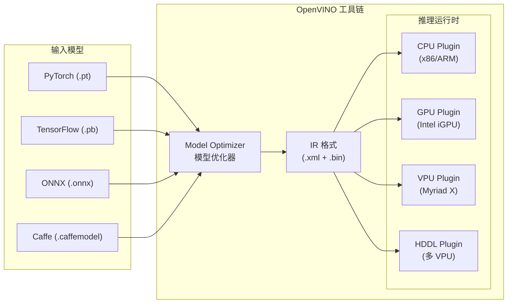

## 4.2 OpenVINO 推理实现

```python
# openvino_inference.py
from openvino.runtime import Core, Model, CompiledModel
import numpy as np
import time
from typing import Dict, List, Optional


class OpenVINOEdgeEngine:
    """Intel OpenVINO 边缘推理引擎"""
    
    SUPPORTED_DEVICES = ["CPU", "GPU", "MYRIAD", "HDDL", "AUTO", "HETERO"]
    
    def __init__(
        self,
        model_xml: str,
        device: str = "CPU",
        num_streams: int = 1,
        num_threads: Optional[int] = None,
        enable_performance_hints: bool = True
    ):
        """
        初始化 OpenVINO 推理引擎
        
        Args:
            model_xml: IR 格式模型 XML 文件路径
            device: 推理设备 (CPU/GPU/MYRIAD/AUTO)
            num_streams: 推理流数量（影响延迟/吞吐量平衡）
            num_threads: CPU 推理线程数
        """
        self.core = Core()
        
        # 加载模型
        model_bin = model_xml.replace(".xml", ".bin")
        self.model = self.core.read_model(model=model_xml, weights=model_bin)
        
        # 配置推理参数
        config = {}
        
        if device == "CPU":
            if num_threads:
                config["CPU_THREADS_NUM"] = str(num_threads)
            config["CPU_THROUGHPUT_STREAMS"] = str(num_streams)
            
            if enable_performance_hints:
                # 延迟优先模式（边缘实时推理推荐）
                config["PERFORMANCE_HINT"] = "LATENCY"
        
        elif device == "GPU":
            config["GPU_THROUGHPUT_STREAMS"] = str(num_streams)
        
        elif device == "AUTO":
            # 自动选择最佳设备
            config["PERFORMANCE_HINT"] = "LATENCY"
        
        # 编译模型
        self.compiled_model = self.core.compile_model(
            model=self.model,
            device_name=device,
            config=config
        )
        
        # 创建推理请求
        self.infer_request = self.compiled_model.create_infer_request()
        
        # 获取 I/O 信息
        self.input_layer = self.compiled_model.input(0)
        self.output_layer = self.compiled_model.output(0)
        
        print(f"✅ OpenVINO 模型加载成功 (设备: {device})")
        print(f"   输入形状: {self.input_layer.shape}")
        print(f"   输出形状: {self.output_layer.shape}")
    
    def infer_sync(self, input_data: np.ndarray) -> np.ndarray:
        """同步推理"""
        start = time.perf_counter()
        result = self.compiled_model([input_data])[self.output_layer]
        elapsed = (time.perf_counter() - start) * 1000
        return result
    
    def infer_async(self, input_data: np.ndarray, callback=None) -> None:
        """异步推理（高吞吐量场景）"""
        self.infer_request.set_input_tensor(
            self.input_layer.index,
            input_data
        )
        
        if callback:
            self.infer_request.set_callback(callback)
        
        self.infer_request.start_async()
    
    def wait_async(self, timeout_ms: int = -1) -> np.ndarray:
        """等待异步推理完成"""
        self.infer_request.wait_for(timeout_ms)
        return self.infer_request.get_output_tensor(
            self.output_layer.index
        ).data
    
    @classmethod
    def optimize_model_int8(
        cls,
        model_xml: str,
        calibration_dataset,
        output_dir: str
    ) -> str:
        """
        使用 NNCF/POT 进行 INT8 量化
        需要安装: pip install openvino-dev[nncf]
        """
        from openvino.tools.pot import IEEngine, load_model, save_model
        from openvino.tools.pot import create_pipeline
        
        # 量化配置
        algorithms = [
            {
                "name": "DefaultQuantization",
                "params": {
                    "target_device": "CPU",
                    "preset": "performance",
                    # 校准采样数
                    "stat_subset_size": 300
                }
            }
        ]
        
        # 加载模型
        model_config = {
            "model_name": "edge_model",
            "model": model_xml,
            "weights": model_xml.replace(".xml", ".bin")
        }
        
        engine_config = {
            "device": "CPU"
        }
        
        model = load_model(model_config)
        engine = IEEngine(config=engine_config, data_loader=calibration_dataset)
        
        pipeline = create_pipeline(algorithms, engine)
        compressed_model = pipeline.run(model)
        
        # 保存量化模型
        save_model(
            compressed_model,
            output_dir,
            model_name="edge_model_int8"
        )
        
        return f"{output_dir}/edge_model_int8.xml"
```

---

<!-- chunk: 5. 模型量化优化 -->## 5. 模型量化优化

## 5.1 量化原理

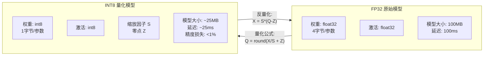

## 5.2 量化类型对比

| 量化类型 | 适用场景 | 精度损失 | 压缩比 | 速度提升 | 实现难度 |
|---------|---------|---------|--------|---------|---------|
| **动态量化** | NLP, RNN | 极低 | 4x | 1.5-2x | 简单 |
| **静态量化 (PTQ)** | CNN 分类/检测 | 低 (<1%) | 4x | 2-4x | 中等 |
| **量化感知训练 (QAT)** | 对精度敏感的模型 | 最低 | 4x | 2-4x | 复杂 |
| **FP16 量化** | GPU 推理 | 极低 | 2x | 1.5-2x | 简单 |
| **混合精度** | 平衡精度/速度 | 低 | 可调 | 可调 | 中等 |

## 5.3 PyTorch 模型量化实现

```python
# pytorch_quantization.py
import torch
import torch.quantization
import torch.nn as nn
from torch.quantization import quantize_dynamic, quantize_static
import copy
from typing import Optional


class QuantizationPipeline:
    """PyTorch 模型量化流水线"""
    
    @staticmethod
    def dynamic_quantization(
        model: nn.Module,
        quantize_layers: set = {nn.Linear, nn.LSTM, nn.GRU}
    ) -> nn.Module:
        """
        动态量化：适合 NLP 模型（BERT、RNN 等）
        只量化权重，激活值在推理时动态量化
        """
        model.eval()
        quantized_model = quantize_dynamic(
            model,
            quantize_layers,
            dtype=torch.qint8
        )
        
        # 比较模型大小
        QuantizationPipeline._compare_model_size(model, quantized_model)
        return quantized_model
    
    @staticmethod
    def post_training_static_quantization(
        model: nn.Module,
        calibration_data_loader,
        backend: str = "fbgemm"  # fbgemm (x86) or qnnpack (ARM)
    ) -> nn.Module:
        """
        训练后静态量化 (PTQ)：适合 CNN 模型
        需要校准数据集来确定激活值的量化范围
        """
        model.eval()
        model_fused = copy.deepcopy(model)
        
        # 1. 算子融合（Conv+BN+ReLU）
        torch.quantization.fuse_modules(
            model_fused,
            'conv', 'bn', 'relu',  # 根据实际模型结构修改
            inplace=True
        )
        
        # 2. 设置量化配置
        model_fused.qconfig = torch.quantization.get_default_qconfig(backend)
        
        # 3. 插入量化/反量化节点
        model_prepared = torch.quantization.prepare(model_fused)
        
        # 4. 校准：在校准数据上运行前向传播
        print("开始模型校准...")
        with torch.no_grad():
            for batch_idx, (data, _) in enumerate(calibration_data_loader):
                model_prepared(data)
                if batch_idx >= 100:  # 100 个批次足够校准
                    break
        
        # 5. 转换为量化模型
        quantized_model = torch.quantization.convert(model_prepared)
        
        print("✅ 静态量化完成")
        QuantizationPipeline._compare_model_size(model, quantized_model)
        
        return quantized_model
    
    @staticmethod
    def quantization_aware_training(
        model: nn.Module,
        train_data_loader,
        val_data_loader,
        num_epochs: int = 5,
        learning_rate: float = 1e-4,
        backend: str = "fbgemm"
    ) -> nn.Module:
        """
        量化感知训练 (QAT)：在训练中模拟量化，精度最高
        """
        model.train()
        
        # 配置 QAT
        model.qconfig = torch.quantization.get_default_qat_qconfig(backend)
        
        # 融合算子
        torch.quantization.fuse_modules(
            model,
            'conv', 'bn', 'relu',
            inplace=True
        )
        
        # 插入伪量化节点
        model_prepared = torch.quantization.prepare_qat(model)
        
        # 训练
        optimizer = torch.optim.SGD(
            model_prepared.parameters(),
            lr=learning_rate,
            momentum=0.9
        )
        criterion = nn.CrossEntropyLoss()
        
        for epoch in range(num_epochs):
            model_prepared.train()
            for data, target in train_data_loader:
                optimizer.zero_grad()
                output = model_prepared(data)
                loss = criterion(output, target)
                loss.backward()
                optimizer.step()
            
            # 在后期冻结量化范围
            if epoch > num_epochs // 2:
                model_prepared.apply(torch.quantization.disable_observer)
            
            # 验证
            acc = QuantizationPipeline._validate(model_prepared, val_data_loader)
            print(f"Epoch {epoch+1}/{num_epochs}: 验证准确率 = {acc:.2%}")
        
        # 转换为量化模型
        model_prepared.eval()
        quantized_model = torch.quantization.convert(model_prepared)
        
        return quantized_model
    
    @staticmethod
    def _compare_model_size(original: nn.Module, quantized: nn.Module) -> None:
        """比较模型大小"""
        import os
        import tempfile
        
        with tempfile.NamedTemporaryFile(delete=False) as f:
            torch.save(original.state_dict(), f.name)
            orig_size = os.path.getsize(f.name) / 1024 / 1024
            os.unlink(f.name)
        
        with tempfile.NamedTemporaryFile(delete=False) as f:
            torch.save(quantized.state_dict(), f.name)
            quant_size = os.path.getsize(f.name) / 1024 / 1024
            os.unlink(f.name)
        
        print(f"原始模型大小: {orig_size:.2f} MB")
        print(f"量化模型大小: {quant_size:.2f} MB")
        print(f"压缩比: {orig_size/quant_size:.2f}x")
    
    @staticmethod
    def _validate(model: nn.Module, data_loader) -> float:
        model.eval()
        correct = total = 0
        with torch.no_grad():
            for data, target in data_loader:
                output = model(data)
                pred = output.argmax(dim=1)
                correct += pred.eq(target).sum().item()
                total += target.size(0)
        return correct / total
```

---

<!-- chunk: 6. 模型剪枝技术 -->## 6. 模型剪枝技术

## 6.1 剪枝策略

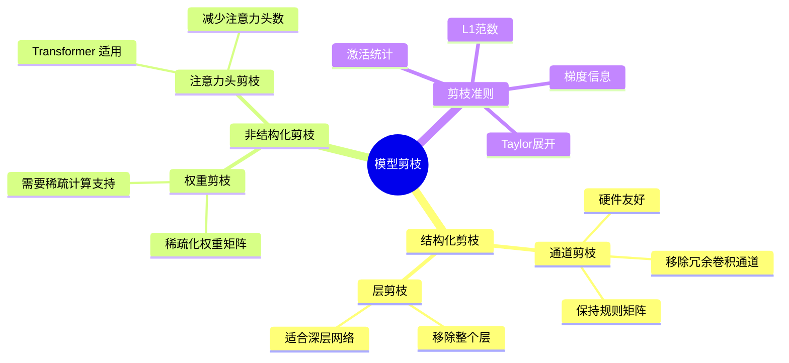

## 6.2 通道剪枝实现

```python
# channel_pruning.py
import torch
import torch.nn as nn
import numpy as np
from typing import List, Dict, Tuple


class ChannelPruner:
    """卷积神经网络通道剪枝"""
    
    def __init__(self, model: nn.Module, prune_ratio: float = 0.3):
        """
        Args:
            model: 待剪枝模型
            prune_ratio: 剪枝比例（移除多少比例的通道）
        """
        self.model = model
        self.prune_ratio = prune_ratio
    
    def compute_channel_importance(
        self, 
        data_loader,
        criterion: str = "l1_norm"
    ) -> Dict[str, torch.Tensor]:
        """计算各层通道重要性"""
        importance_scores = {}
        
        for name, module in self.model.named_modules():
            if isinstance(module, nn.Conv2d):
                if criterion == "l1_norm":
                    # L1 范数：计算每个输出通道的权重绝对值之和
                    scores = module.weight.data.abs().sum(dim=(1, 2, 3))
                    importance_scores[name] = scores
                    
                elif criterion == "bn_scale":
                    # BN 缩放因子：利用 BatchNorm 层的 gamma 参数
                    # 找到对应的 BN 层
                    # （需要知道模型结构，此处简化）
                    pass
        
        return importance_scores
    
    def get_pruning_mask(
        self,
        importance_scores: Dict[str, torch.Tensor]
    ) -> Dict[str, torch.Tensor]:
        """生成剪枝掩码"""
        masks = {}
        
        for name, scores in importance_scores.items():
            num_channels = len(scores)
            num_to_prune = int(num_channels * self.prune_ratio)
            
            # 按重要性排序，保留最重要的通道
            threshold = scores.kthvalue(num_to_prune + 1).values
            mask = (scores >= threshold).float()
            masks[name] = mask
            
            print(f"层 {name}: 保留 {mask.sum().int()}/{num_channels} 个通道")
        
        return masks
    
    def apply_pruning(self, masks: Dict[str, torch.Tensor]) -> nn.Module:
        """应用剪枝（软剪枝：将权重置零）"""
        for name, module in self.model.named_modules():
            if name in masks:
                mask = masks[name].view(-1, 1, 1, 1)
                module.weight.data *= mask
        
        return self.model
    
    def structured_prune(
        self,
        importance_scores: Dict[str, torch.Tensor]
    ) -> nn.Module:
        """结构化剪枝：物理移除通道，实际加速"""
        # 注意：结构化剪枝需要处理层间依赖关系
        # 这里展示简化版本
        
        new_model = {}
        
        for name, module in self.model.named_modules():
            if name in importance_scores:
                scores = importance_scores[name]
                num_to_keep = int(len(scores) * (1 - self.prune_ratio))
                
                # 保留重要性最高的通道索引
                keep_indices = scores.argsort(descending=True)[:num_to_keep]
                keep_indices, _ = keep_indices.sort()
                
                # 创建新的裁剪后的卷积层
                old_out_channels = module.out_channels
                new_out_channels = len(keep_indices)
                
                new_conv = nn.Conv2d(
                    in_channels=module.in_channels,
                    out_channels=new_out_channels,
                    kernel_size=module.kernel_size,
                    stride=module.stride,
                    padding=module.padding,
                    bias=module.bias is not None
                )
                
                # 复制保留的通道权重
                new_conv.weight.data = module.weight.data[keep_indices]
                if module.bias is not None:
                    new_conv.bias.data = module.bias.data[keep_indices]
                
                print(f"层 {name}: {old_out_channels} -> {new_out_channels} 通道")
        
        return self.model
```

---

<!-- chunk: 7. 知识蒸馏 -->## 7. 知识蒸馏

## 7.1 知识蒸馏架构

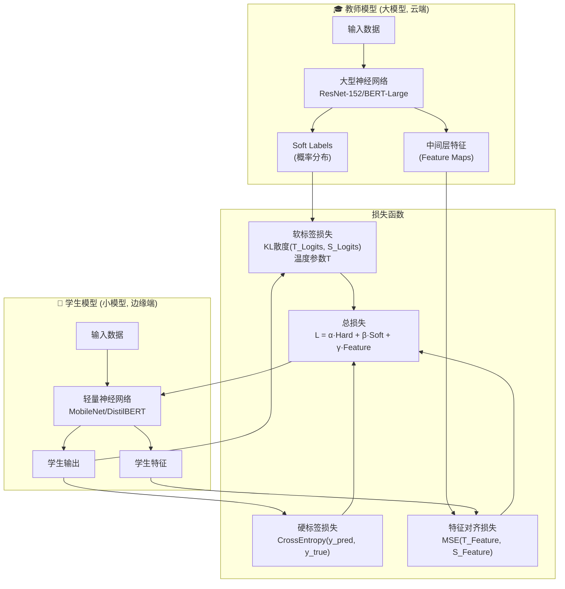

## 7.2 知识蒸馏代码实现

```python
# knowledge_distillation.py
import torch
import torch.nn as nn
import torch.nn.functional as F
from typing import Optional, Tuple


class DistillationLoss(nn.Module):
    """知识蒸馏损失函数"""
    
    def __init__(
        self,
        temperature: float = 4.0,
        alpha: float = 0.5,  # 软标签权重
        beta: float = 0.5    # 硬标签权重
    ):
        """
        Args:
            temperature: 蒸馏温度（越高软化概率分布越平滑）
            alpha: 软标签损失权重
            beta: 真实标签损失权重
        """
        super().__init__()
        self.temperature = temperature
        self.alpha = alpha
        self.beta = beta
    
    def forward(
        self,
        student_logits: torch.Tensor,
        teacher_logits: torch.Tensor,
        true_labels: torch.Tensor
    ) -> Tuple[torch.Tensor, dict]:
        """
        计算蒸馏损失
        
        Returns:
            total_loss, loss_dict
        """
        # 软标签损失（KL 散度）
        # 使用温度缩放软化概率分布
        student_soft = F.log_softmax(student_logits / self.temperature, dim=1)
        teacher_soft = F.softmax(teacher_logits / self.temperature, dim=1)
        
        # KL 散度损失，需要乘以 T^2（梯度缩放）
        soft_loss = F.kl_div(
            student_soft,
            teacher_soft,
            reduction='batchmean'
        ) * (self.temperature ** 2)
        
        # 硬标签损失（标准交叉熵）
        hard_loss = F.cross_entropy(student_logits, true_labels)
        
        # 加权组合
        total_loss = self.alpha * soft_loss + self.beta * hard_loss
        
        return total_loss, {
            "total": total_loss.item(),
            "soft": soft_loss.item(),
            "hard": hard_loss.item()
        }


class FeatureDistillation(nn.Module):
    """带特征对齐的知识蒸馏"""
    
    def __init__(
        self,
        teacher_channels: int,
        student_channels: int,
        temperature: float = 4.0
    ):
        super().__init__()
        self.base_distill = DistillationLoss(temperature)
        
        # 特征适配器：将学生特征映射到教师特征空间
        self.feature_adapter = nn.Conv2d(
            student_channels,
            teacher_channels,
            kernel_size=1,
            bias=False
        )
    
    def forward(
        self,
        student_logits: torch.Tensor,
        teacher_logits: torch.Tensor,
        true_labels: torch.Tensor,
        student_features: torch.Tensor,
        teacher_features: torch.Tensor,
        feature_weight: float = 0.1
    ) -> Tuple[torch.Tensor, dict]:
        # 主蒸馏损失
        base_loss, loss_dict = self.base_distill(
            student_logits, teacher_logits, true_labels
        )
        
        # 特征对齐损失
        student_features_adapted = self.feature_adapter(student_features)
        
        # 使用 MSE 对齐特征图
        feature_loss = F.mse_loss(
            student_features_adapted,
            teacher_features.detach()  # 不反传到教师模型
        )
        
        total_loss = base_loss + feature_weight * feature_loss
        loss_dict["feature"] = feature_loss.item()
        loss_dict["total"] = total_loss.item()
        
        return total_loss, loss_dict


class EdgeModelDistiller:
    """边缘模型蒸馏训练器"""
    
    def __init__(
        self,
        teacher_model: nn.Module,
        student_model: nn.Module,
        temperature: float = 4.0,
        alpha: float = 0.7,
        device: str = "cuda" if torch.cuda.is_available() else "cpu"
    ):
        self.teacher = teacher_model.to(device).eval()
        self.student = student_model.to(device)
        self.device = device
        
        self.criterion = DistillationLoss(
            temperature=temperature,
            alpha=alpha,
            beta=1-alpha
        )
        
        # 冻结教师模型参数
        for param in self.teacher.parameters():
            param.requires_grad = False
    
    def train_epoch(
        self,
        train_loader,
        optimizer: torch.optim.Optimizer,
        epoch: int
    ) -> dict:
        self.student.train()
        total_losses = {"total": 0, "soft": 0, "hard": 0}
        
        for batch_idx, (data, target) in enumerate(train_loader):
            data, target = data.to(self.device), target.to(self.device)
            
            # 教师模型前向（不计算梯度）
            with torch.no_grad():
                teacher_logits = self.teacher(data)
            
            # 学生模型前向
            student_logits = self.student(data)
            
            # 计算蒸馏损失
            loss, loss_dict = self.criterion(
                student_logits, teacher_logits, target
            )
            
            # 反向传播
            optimizer.zero_grad()
            loss.backward()
            optimizer.step()
            
            for k, v in loss_dict.items():
                total_losses[k] = total_losses.get(k, 0) + v
        
        # 计算平均损失
        num_batches = len(train_loader)
        return {k: v / num_batches for k, v in total_losses.items()}
    
    def evaluate(self, val_loader) -> float:
        """评估学生模型准确率"""
        self.student.eval()
        correct = total = 0
        
        with torch.no_grad():
            for data, target in val_loader:
                data, target = data.to(self.device), target.to(self.device)
                output = self.student(data)
                pred = output.argmax(dim=1)
                correct += pred.eq(target).sum().item()
                total += target.size(0)
        
        return correct / total
    
    def distill(
        self,
        train_loader,
        val_loader,
        num_epochs: int = 30,
        learning_rate: float = 1e-3,
        save_path: str = "student_distilled.pth"
    ) -> nn.Module:
        """执行完整蒸馏训练"""
        optimizer = torch.optim.Adam(
            self.student.parameters(),
            lr=learning_rate,
            weight_decay=1e-4
        )
        
        scheduler = torch.optim.lr_scheduler.CosineAnnealingLR(
            optimizer,
            T_max=num_epochs
        )
        
        best_acc = 0.0
        
        for epoch in range(1, num_epochs + 1):
            # 训练
            train_losses = self.train_epoch(train_loader, optimizer, epoch)
            
            # 验证
            val_acc = self.evaluate(val_loader)
            
            scheduler.step()
            
            print(f"Epoch {epoch}/{num_epochs}: "
                  f"Loss={train_losses['total']:.4f} "
                  f"(Soft={train_losses['soft']:.4f}, "
                  f"Hard={train_losses['hard']:.4f}) "
                  f"Val Acc={val_acc:.2%}")
            
            # 保存最佳模型
            if val_acc > best_acc:
                best_acc = val_acc
                torch.save(self.student.state_dict(), save_path)
                print(f"  ✅ 最佳模型保存 (准确率: {best_acc:.2%})")
        
        print(f"\n蒸馏完成！最终准确率: {best_acc:.2%}")
        return self.student
```

---

<!-- chunk: 8. 联邦学习架构 -->## 8. 联邦学习架构

## 8.1 联邦学习整体架构

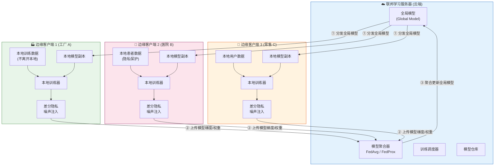

## 8.2 FedAvg 算法实现

```python
# federated_learning.py
import torch
import torch.nn as nn
import copy
import numpy as np
from typing import List, Dict, Optional, Callable
from dataclasses import dataclass, field
import asyncio
import logging

logger = logging.getLogger(__name__)


@dataclass
class FLConfig:
    """联邦学习配置"""
    # 全局训练轮数
    num_rounds: int = 100
    # 每轮参与客户端比例
    client_fraction: float = 0.5
    # 最小参与客户端数
    min_clients: int = 2
    # 本地训练轮数
    local_epochs: int = 5
    # 本地学习率
    local_lr: float = 0.01
    # 本地批量大小
    local_batch_size: int = 32
    # 是否启用差分隐私
    enable_dp: bool = True
    # 差分隐私噪声倍数
    dp_noise_multiplier: float = 1.1
    # 差分隐私梯度裁剪阈值
    dp_max_grad_norm: float = 1.0
    # 聚合算法
    aggregation: str = "fedavg"  # fedavg / fedprox / scaffold


class FederatedServer:
    """联邦学习服务器"""
    
    def __init__(
        self,
        global_model: nn.Module,
        config: FLConfig
    ):
        self.global_model = global_model
        self.config = config
        self.round_num = 0
        self.training_history = []
    
    def aggregate_fedavg(
        self,
        client_updates: List[Dict[str, torch.Tensor]],
        client_weights: List[int]  # 各客户端本地样本数
    ) -> Dict[str, torch.Tensor]:
        """
        FedAvg 聚合算法
        
        加权平均：按各客户端本地数据量加权
        参考论文：Communication-Efficient Learning of Deep Networks from Decentralized Data
        """
        total_samples = sum(client_weights)
        
        # 初始化聚合结果
        aggregated = {}
        for key in client_updates[0].keys():
            aggregated[key] = torch.zeros_like(client_updates[0][key])
        
        # 加权平均
        for update, weight in zip(client_updates, client_weights):
            scale = weight / total_samples
            for key in aggregated:
                aggregated[key] += update[key] * scale
        
        return aggregated
    
    def aggregate_fedprox(
        self,
        client_updates: List[Dict[str, torch.Tensor]],
        client_weights: List[int],
        mu: float = 0.01  # 近端项系数
    ) -> Dict[str, torch.Tensor]:
        """
        FedProx 聚合算法
        
        解决非 IID 数据场景下的收敛问题
        在客户端本地目标函数中加入近端项约束
        """
        # FedProx 聚合与 FedAvg 相同，差异在客户端训练时加近端项
        return self.aggregate_fedavg(client_updates, client_weights)
    
    def select_clients(
        self,
        available_clients: List[str],
        fraction: float
    ) -> List[str]:
        """随机选择参与本轮训练的客户端"""
        num_selected = max(
            self.config.min_clients,
            int(len(available_clients) * fraction)
        )
        
        selected = np.random.choice(
            available_clients,
            size=min(num_selected, len(available_clients)),
            replace=False
        ).tolist()
        
        logger.info(f"轮次 {self.round_num}: 选择 {len(selected)} 个客户端")
        return selected
    
    def run_round(
        self,
        clients: List["FederatedClient"],
        available_client_ids: List[str]
    ) -> dict:
        """执行一轮联邦学习"""
        self.round_num += 1
        
        # 选择客户端
        selected_ids = self.select_clients(
            available_client_ids,
            self.config.client_fraction
        )
        selected_clients = [c for c in clients if c.client_id in selected_ids]
        
        # 分发全局模型
        global_state = copy.deepcopy(self.global_model.state_dict())
        
        # 并行本地训练
        client_updates = []
        client_weights = []
        
        for client in selected_clients:
            # 发送全局模型
            client.receive_global_model(global_state)
            
            # 本地训练
            update, num_samples = client.train_local(
                self.config.local_epochs,
                self.config.local_lr,
                self.config.local_batch_size
            )
            
            client_updates.append(update)
            client_weights.append(num_samples)
        
        # 聚合
        if self.config.aggregation == "fedavg":
            aggregated = self.aggregate_fedavg(client_updates, client_weights)
        elif self.config.aggregation == "fedprox":
            aggregated = self.aggregate_fedprox(client_updates, client_weights)
        else:
            aggregated = self.aggregate_fedavg(client_updates, client_weights)
        
        # 更新全局模型
        self.global_model.load_state_dict(aggregated)
        
        metrics = {
            "round": self.round_num,
            "participating_clients": len(selected_clients),
            "total_samples": sum(client_weights)
        }
        
        self.training_history.append(metrics)
        return metrics


class FederatedClient:
    """联邦学习客户端（边缘节点）"""
    
    def __init__(
        self,
        client_id: str,
        model: nn.Module,
        local_dataset,
        config: FLConfig
    ):
        self.client_id = client_id
        self.model = model
        self.local_dataset = local_dataset
        self.config = config
        self.local_model_state = None
    
    def receive_global_model(
        self,
        global_state: Dict[str, torch.Tensor]
    ) -> None:
        """接收并加载全局模型"""
        self.model.load_state_dict(copy.deepcopy(global_state))
        self.local_model_state = copy.deepcopy(global_state)
    
    def train_local(
        self,
        local_epochs: int,
        lr: float,
        batch_size: int,
        mu: float = 0.0  # FedProx 近端项系数
    ) -> tuple:
        """
        本地训练
        
        Returns:
            (更新后的模型参数, 本地样本数)
        """
        self.model.train()
        
        data_loader = torch.utils.data.DataLoader(
            self.local_dataset,
            batch_size=batch_size,
            shuffle=True
        )
        
        optimizer = torch.optim.SGD(
            self.model.parameters(),
            lr=lr,
            momentum=0.9,
            weight_decay=1e-4
        )
        criterion = nn.CrossEntropyLoss()
        
        # 保存全局模型参数（用于 FedProx 近端项）
        global_params = {
            name: param.clone().detach()
            for name, param in self.model.named_parameters()
        }
        
        for epoch in range(local_epochs):
            for data, target in data_loader:
                optimizer.zero_grad()
                output = self.model(data)
                
                # 标准分类损失
                loss = criterion(output, target)
                
                # FedProx 近端项（防止本地模型偏离全局太远）
                if mu > 0:
                    prox_term = 0
                    for name, param in self.model.named_parameters():
                        prox_term += torch.sum(
                            (param - global_params[name]) ** 2
                        )
                    loss += (mu / 2) * prox_term
                
                loss.backward()
                
                # 差分隐私：梯度裁剪
                if self.config.enable_dp:
                    nn.utils.clip_grad_norm_(
                        self.model.parameters(),
                        self.config.dp_max_grad_norm
                    )
                
                optimizer.step()
        
        # 差分隐私：添加高斯噪声到模型更新
        updated_state = copy.deepcopy(self.model.state_dict())
        
        if self.config.enable_dp:
            updated_state = self._add_dp_noise(
                updated_state,
                self.config.dp_noise_multiplier,
                self.config.dp_max_grad_norm
            )
        
        num_samples = len(self.local_dataset)
        return updated_state, num_samples
    
    def _add_dp_noise(
        self,
        model_state: Dict[str, torch.Tensor],
        noise_multiplier: float,
        sensitivity: float
    ) -> Dict[str, torch.Tensor]:
        """添加高斯差分隐私噪声"""
        noisy_state = {}
        noise_std = noise_multiplier * sensitivity
        
        for key, param in model_state.items():
            noise = torch.randn_like(param) * noise_std
            noisy_state[key] = param + noise
        
        return noisy_state
```

---

<!-- chunk: 9. 隐私保护机器学习 -->## 9. 隐私保护机器学习

## 9.1 隐私保护技术体系

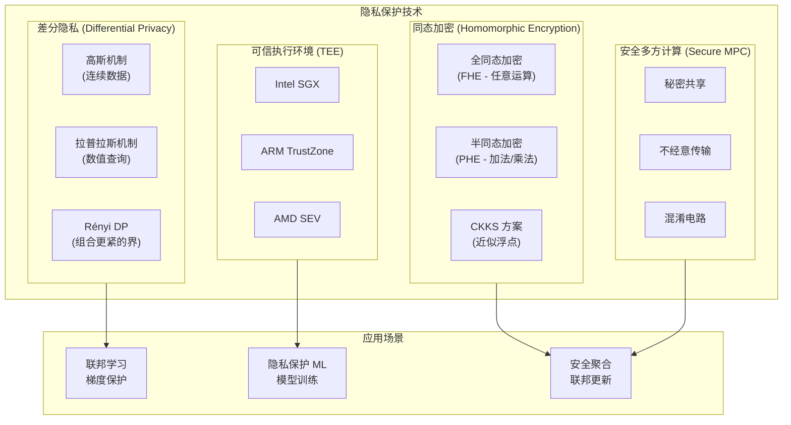

## 9.2 差分隐私实现

```python
# differential_privacy.py
import torch
import torch.nn as nn
import numpy as np
from typing import Tuple, Optional


class DifferentialPrivacyEngine:
    """差分隐私训练引擎"""
    
    def __init__(
        self,
        model: nn.Module,
        target_epsilon: float = 1.0,      # 隐私预算 ε
        target_delta: float = 1e-5,        # 隐私失败概率 δ
        max_grad_norm: float = 1.0,        # 梯度裁剪阈值 C
        noise_multiplier: Optional[float] = None  # 噪声倍数 σ/C
    ):
        self.model = model
        self.target_epsilon = target_epsilon
        self.target_delta = target_delta
        self.max_grad_norm = max_grad_norm
        
        if noise_multiplier is None:
            # 根据隐私预算自动计算噪声倍数
            self.noise_multiplier = self._compute_noise_multiplier(
                target_epsilon, target_delta
            )
        else:
            self.noise_multiplier = noise_multiplier
        
        self.steps = 0
        print(f"DP 配置: ε={target_epsilon}, δ={target_delta}, "
              f"σ={self.noise_multiplier:.3f}, C={max_grad_norm}")
    
    def _compute_noise_multiplier(
        self,
        epsilon: float,
        delta: float,
        num_steps: int = 1000,
        sample_rate: float = 0.01
    ) -> float:
        """
        使用矩会计 (Moments Accountant) 计算所需噪声倍数
        近似公式，实际使用 opacus 或 autodp 库
        """
        # 简化的噪声计算（实际应使用精确的隐私会计）
        # σ ≈ sqrt(2 * log(1.25/δ)) * C / ε（对于单步）
        noise = np.sqrt(2 * np.log(1.25 / delta)) / epsilon
        return float(noise)
    
    def clip_and_add_noise(
        self,
        gradients: list
    ) -> list:
        """
        每样本梯度裁剪 + 高斯噪声注入
        
        DP-SGD 核心步骤：
        1. 计算每个样本的梯度
        2. 裁剪每个样本梯度的 L2 范数
        3. 平均后加入校准的高斯噪声
        """
        clipped_grads = []
        
        for grad in gradients:
            # L2 范数裁剪
            grad_norm = grad.norm(2)
            clip_coef = min(1.0, self.max_grad_norm / (grad_norm + 1e-6))
            clipped_grads.append(grad * clip_coef)
        
        # 平均梯度
        avg_grad = torch.stack(clipped_grads).mean(dim=0)
        
        # 添加高斯噪声
        noise_std = self.noise_multiplier * self.max_grad_norm / len(gradients)
        noise = torch.randn_like(avg_grad) * noise_std
        
        return avg_grad + noise
    
    def get_privacy_spent(
        self,
        sample_rate: float,
        num_steps: int
    ) -> Tuple[float, float]:
        """
        计算已消耗的隐私预算 (ε, δ)
        
        使用 Rényi DP 到 (ε,δ)-DP 的转换
        实际应用中推荐使用 Google 的 dp-accounting 库
        """
        # 简化计算（实际使用精确会计）
        # 每步消耗 ε_step = sample_rate * sqrt(2 * log(1/δ)) / σ
        epsilon_step = sample_rate * np.sqrt(2 * np.log(1/self.target_delta))
        epsilon_step /= self.noise_multiplier
        
        total_epsilon = epsilon_step * np.sqrt(num_steps)
        
        return float(total_epsilon), self.target_delta
    
    def make_private_optimizer(
        self,
        optimizer: torch.optim.Optimizer
    ):
        """
        包装优化器，使其支持差分隐私
        实际使用推荐 opacus 库：
        pip install opacus
        """
        # 简化示例，实际使用 opacus.PrivacyEngine
        # from opacus import PrivacyEngine
        # privacy_engine = PrivacyEngine()
        # model, optimizer, data_loader = privacy_engine.make_private_with_epsilon(
        #     module=self.model,
        #     optimizer=optimizer,
        #     data_loader=data_loader,
        #     epochs=num_epochs,
        #     target_epsilon=self.target_epsilon,
        #     target_delta=self.target_delta,
        #     max_grad_norm=self.max_grad_norm,
        # )
        return optimizer
```

---

<!-- chunk: 10. 边缘 AI Kubernetes 部署 -->## 10. 边缘 AI Kubernetes 部署

## 10.1 AI 推理服务部署配置

```yaml
# edge-ai-inference-deployment.yaml
# 边缘 AI 推理服务 Kubernetes 部署

apiVersion: apps/v1
kind: Deployment
metadata:
  name: edge-inference-server
  namespace: edge-ai
  labels:
    app: edge-inference
    version: v1.0.0
spec:
  replicas: 1
  selector:
    matchLabels:
      app: edge-inference
  template:
    metadata:
      labels:
        app: edge-inference
      annotations:
        # Prometheus 指标采集
        prometheus.io/scrape: "true"
        prometheus.io/port: "8001"
    spec:
      # 调度到 AI 加速硬件节点
      nodeSelector:
        edge.computing/ai-accelerator: "true"
      
      tolerations:
        - key: "edge.computing/gpu"
          operator: "Exists"
          effect: "NoSchedule"
      
      # 初始化容器：下载模型
      initContainers:
        - name: model-downloader
          image: edge/model-downloader:v1.0
          command:
            - /bin/sh
            - -c
            - |
              # 从模型仓库下载最新模型
              MODEL_VERSION=$(curl -s http://model-registry/latest)
              wget -O /models/model.onnx \
                http://model-registry/models/${MODEL_VERSION}/model.onnx
              echo "模型下载完成: v${MODEL_VERSION}"
          volumeMounts:
            - name: model-storage
              mountPath: /models
      
      containers:
        - name: triton-inference-server
          # NVIDIA Triton 推理服务器（支持 ONNX/TensorRT/TFLite）
          image: nvcr.io/nvidia/tritonserver:23.10-py3
          command:
            - tritonserver
            - --model-repository=/models
            - --model-control-mode=poll      # 热更新模型
            - --repository-poll-secs=60
            - --log-verbose=0
            - --strict-model-config=false
            - --allow-metrics=true
            - --metrics-port=8002
          ports:
            - containerPort: 8000  # HTTP
            - containerPort: 8001  # gRPC
            - containerPort: 8002  # Metrics
          
          resources:
            limits:
              # GPU 资源申请
              nvidia.com/gpu: "1"
              cpu: "4"
              memory: "8Gi"
            requests:
              nvidia.com/gpu: "1"
              cpu: "1"
              memory: "2Gi"
          
          readinessProbe:
            httpGet:
              path: /v2/health/ready
              port: 8000
            initialDelaySeconds: 30
            periodSeconds: 10
            failureThreshold: 3
          
          livenessProbe:
            httpGet:
              path: /v2/health/live
              port: 8000
            initialDelaySeconds: 60
            periodSeconds: 30
          
          volumeMounts:
            - name: model-storage
              mountPath: /models
            - name: shm
              mountPath: /dev/shm
      
      volumes:
        - name: model-storage
          persistentVolumeClaim:
            claimName: edge-model-pvc
        # Triton 需要共享内存
        - name: shm
          emptyDir:
            medium: Memory
            sizeLimit: 2Gi

---
# 模型联邦学习客户端部署
apiVersion: apps/v1
kind: Deployment
metadata:
  name: fl-client
  namespace: edge-ai
spec:
  replicas: 1
  selector:
    matchLabels:
      app: fl-client
  template:
    metadata:
      labels:
        app: fl-client
    spec:
      nodeSelector:
        superedge.io/node-edge: "enable"
      containers:
        - name: fl-client
          image: edge/federated-learning-client:v2.0
          env:
            - name: FL_SERVER_URL
              value: "https://fl-server.cloud.example.com:8080"
            - name: CLIENT_ID
              valueFrom:
                fieldRef:
                  fieldPath: spec.nodeName
            - name: ZONE_LABEL
              valueFrom:
                fieldRef:
                  fieldPath: metadata.labels['zone']
            # 差分隐私配置
            - name: DP_EPSILON
              value: "1.0"
            - name: DP_DELTA
              value: "1e-5"
            - name: DP_MAX_GRAD_NORM
              value: "1.0"
            # 本地训练配置
            - name: LOCAL_EPOCHS
              value: "5"
            - name: LOCAL_BATCH_SIZE
              value: "32"
          volumeMounts:
            - name: local-data
              mountPath: /data
            - name: model-cache
              mountPath: /cache/models
          resources:
            limits:
              cpu: "2"
              memory: "4Gi"
            requests:
              cpu: "500m"
              memory: "1Gi"
      volumes:
        - name: local-data
          hostPath:
            path: /data/edge-training
        - name: model-cache
          emptyDir:
            sizeLimit: 5Gi
```

## 10.2 模型版本管理

```yaml
# model-registry-config.yaml
# 边缘端模型版本管理（MLflow 格式）
apiVersion: v1
kind: ConfigMap
metadata:
  name: triton-model-config
  namespace: edge-ai
data:
  # Triton 模型配置文件
  config.pbtxt: |
    name: "edge_classifier"
    platform: "onnxruntime_onnx"
    max_batch_size: 8
    
    input [
      {
        name: "input"
        data_type: TYPE_FP32
        dims: [3, 224, 224]
      }
    ]
    
    output [
      {
        name: "output"
        data_type: TYPE_FP32
        dims: [1000]
      }
    ]
    
    # 实例组配置（CPU 推理）
    instance_group [
      {
        kind: KIND_CPU
        count: 2
      }
    ]
    
    # 动态批处理
    dynamic_batching {
      preferred_batch_size: [4, 8]
      max_queue_delay_microseconds: 1000
    }
    
    # 模型预热
    model_warmup [
      {
        name: "warmup"
        batch_size: 1
        inputs {
          key: "input"
          value: {
            data_type: TYPE_FP32
            dims: [3, 224, 224]
            zero_data: true
          }
        }
      }
    ]
```

---

<!-- chunk: 11. 性能基准测试 -->## 11. 性能基准测试

## 11.1 推理框架性能对比实验

```python
# benchmark_inference.py
import time
import numpy as np
import psutil
import platform
from typing import Dict, List
import json


class InferenceBenchmark:
    """推理框架性能基准测试"""
    
    def __init__(self, model_path: str, input_shape: tuple):
        self.model_path = model_path
        self.input_shape = input_shape
        self.results = {}
    
    def benchmark_onnxruntime(self, num_runs: int = 500) -> Dict:
        """ONNX Runtime 基准测试"""
        import onnxruntime as ort
        
        session = ort.InferenceSession(
            self.model_path,
            providers=["CPUExecutionProvider"]
        )
        
        input_name = session.get_inputs()[0].name
        dummy = np.random.randn(*self.input_shape).astype(np.float32)
        
        # 预热
        for _ in range(50):
            session.run(None, {input_name: dummy})
        
        # 测试
        latencies = []
        for _ in range(num_runs):
            start = time.perf_counter()
            session.run(None, {input_name: dummy})
            latencies.append((time.perf_counter() - start) * 1000)
        
        return self._compute_stats(latencies, "ONNX Runtime")
    
    def benchmark_openvino(self, num_runs: int = 500) -> Dict:
        """OpenVINO 基准测试"""
        try:
            from openvino.runtime import Core
            
            core = Core()
            model_xml = self.model_path.replace(".onnx", ".xml")
            
            compiled_model = core.compile_model(
                model=core.read_model(model_xml),
                device_name="CPU",
                config={"PERFORMANCE_HINT": "LATENCY"}
            )
            
            input_layer = compiled_model.input(0)
            dummy = np.random.randn(*self.input_shape).astype(np.float32)
            
            # 预热
            for _ in range(50):
                compiled_model([dummy])
            
            # 测试
            latencies = []
            for _ in range(num_runs):
                start = time.perf_counter()
                compiled_model([dummy])
                latencies.append((time.perf_counter() - start) * 1000)
            
            return self._compute_stats(latencies, "OpenVINO")
        
        except ImportError:
            return {"framework": "OpenVINO", "error": "未安装"}
    
    def _compute_stats(self, latencies: List[float], framework: str) -> Dict:
        """计算统计指标"""
        arr = np.array(latencies)
        return {
            "framework": framework,
            "mean_ms": round(float(np.mean(arr)), 3),
            "median_ms": round(float(np.median(arr)), 3),
            "p90_ms": round(float(np.percentile(arr, 90)), 3),
            "p95_ms": round(float(np.percentile(arr, 95)), 3),
            "p99_ms": round(float(np.percentile(arr, 99)), 3),
            "min_ms": round(float(np.min(arr)), 3),
            "max_ms": round(float(np.max(arr)), 3),
            "throughput_qps": round(1000.0 / float(np.mean(arr)), 1),
            "cv": round(float(np.std(arr) / np.mean(arr)), 4)  # 变异系数
        }
    
    def run_all(self) -> None:
        """运行所有基准测试"""
        print(f"\n{'='*60}")
        print(f" 边缘 AI 推理框架基准测试")
        print(f"{'='*60}")
        print(f" 模型: {self.model_path}")
        print(f" 输入形状: {self.input_shape}")
        print(f" 平台: {platform.processor()}")
        print(f" CPU 核数: {psutil.cpu_count(logical=False)} 物理核 / "
              f"{psutil.cpu_count(logical=True)} 逻辑核")
        print(f"{'='*60}\n")
        
        frameworks = [
            ("ONNX Runtime", self.benchmark_onnxruntime),
            ("OpenVINO", self.benchmark_openvino),
        ]
        
        for name, func in frameworks:
            print(f"测试 {name}...")
            result = func()
            self.results[name] = result
            
            if "error" not in result:
                print(f"  均值延迟: {result['mean_ms']}ms")
                print(f"  P95 延迟: {result['p95_ms']}ms")
                print(f"  吞吐量:   {result['throughput_qps']} QPS")
            else:
                print(f"  ❌ {result['error']}")
        
        # 输出 JSON 报告
        with open("benchmark_results.json", "w") as f:
            json.dump(self.results, f, indent=2, ensure_ascii=False)
        print(f"\n✅ 测试报告已保存: benchmark_results.json")
```

---

<!-- chunk: 12. 最佳实践 -->## 12. 最佳实践

## 12.1 边缘 AI 部署决策矩阵

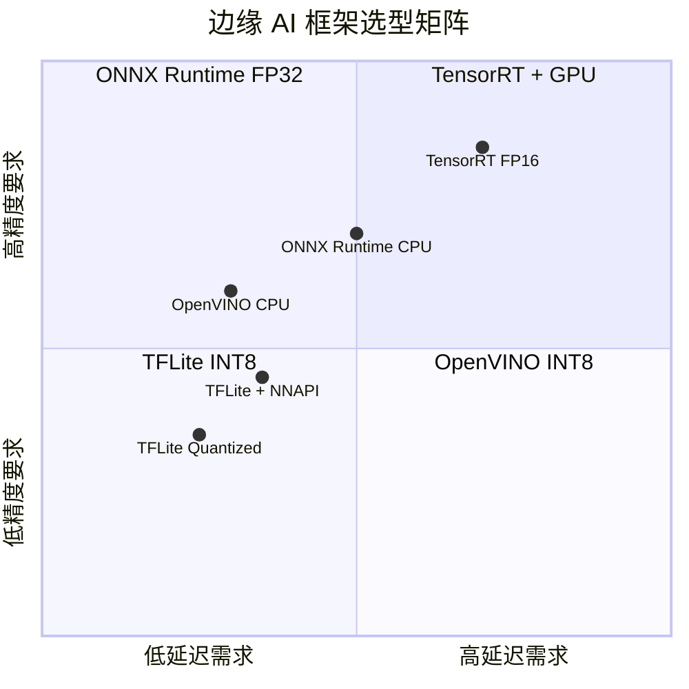

## 12.2 联邦学习生产检查清单

```markdown
<!-- chunk: 联邦学习生产环境检查清单 -->## 联邦学习生产环境检查清单

## 模型设计
- [ ] 模型参数量适合边缘设备内存（推荐 <50MB）
- [ ] 支持断点续传（训练状态持久化）
- [ ] 梯度压缩（TopK / 随机稀疏化）减少通信量
- [ ] 配置合理的本地训练轮数（避免客户端漂移）

## 隐私保护
- [ ] 差分隐私预算 ε ≤ 10（敏感数据 ε ≤ 1）
- [ ] 梯度裁剪阈值合理配置
- [ ] 安全聚合防止服务器推断单个客户端梯度
- [ ] 定期隐私审计

## 系统稳定性
- [ ] 处理客户端掉线（Partial Participation）
- [ ] 异步联邦学习支持（避免等待慢速客户端）
- [ ] 模型版本控制
- [ ] 训练指标实时监控

## 通信优化
- [ ] 模型压缩后上传（gzip/lz4）
- [ ] 仅传输模型差异（增量更新）
- [ ] 配置带宽限速（避免影响业务流量）
- [ ] 断网恢复机制
```

## 12.3 推荐架构组合

| 场景 | 推理框架 | 量化方案 | 联邦学习 | 隐私保护 |
|------|---------|---------|---------|---------|
| **工业质检** (ARM CPU) | TFLite | INT8 PTQ | FedAvg | DP-SGD |
| **人脸识别** (Jetson) | TensorRT | FP16 | FedProx | Secure Agg |
| **NLP 边缘** (x86) | ONNX Runtime | Dynamic | SCAFFOLD | DP |
| **医疗影像** (Intel) | OpenVINO | INT8 | FedAvg | HE + DP |
| **自动驾驶** (NVIDIA) | TensorRT | INT8 QAT | — | TEE |

---

*文档版本: v1.0 | 适用框架版本: ONNX Runtime 1.16+, TFLite 2.12+, OpenVINO 2023.2+*

---

<!-- chunk: Obsidian 相关文档 -->## Obsidian 相关文档

- domain-37-edge-computing MOC
- [[domain-15-specialized-tech/README.md|Domain 15: 边缘计算 (Edge Computing)]]
- Domain-37 边缘计算 — 开源项目索引
- 边缘计算架构概述 (Edge Computing Architecture Overview)
- 云边协同设计模式 (Cloud-Edge Collaboration Design Patterns)
- KubeEdge 架构与部署 (KubeEdge Architecture and Deployment)
- KubeEdge 设备管理与边缘应用 (KubeEdge Device Management and Edge Appl...
- OpenYurt 边缘方案 (OpenYurt Edge Solution)
- SuperEdge 架构实践 (SuperEdge Architecture Practice)
- 边缘存储与网络 (Edge Storage and Network)
- 边缘安全架构 (Edge Security Architecture)
- 边缘场景案例 (Edge Computing Use Cases)

## See Also

- 05-openyurt-architecture
- 06-superedge-architecture
- 08-edge-storage-network
- 09-edge-security
