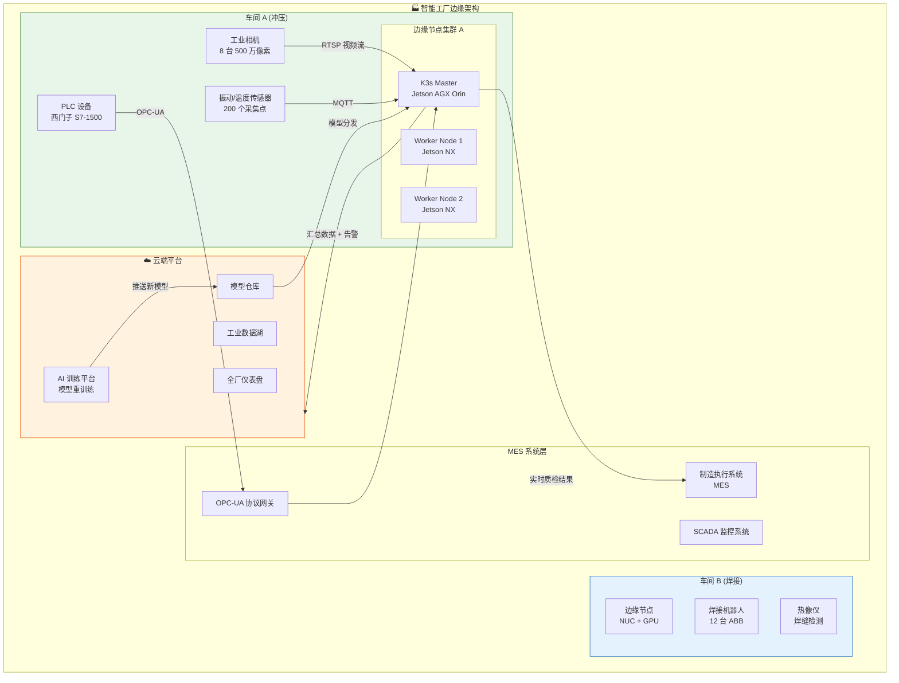
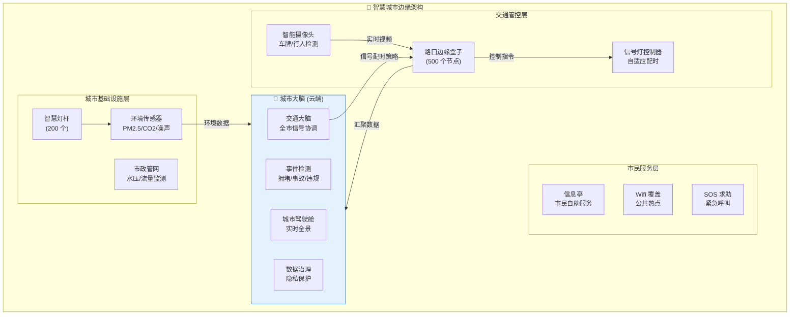
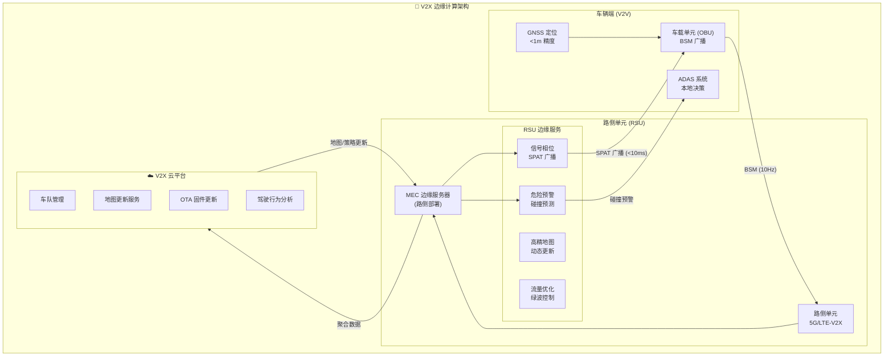
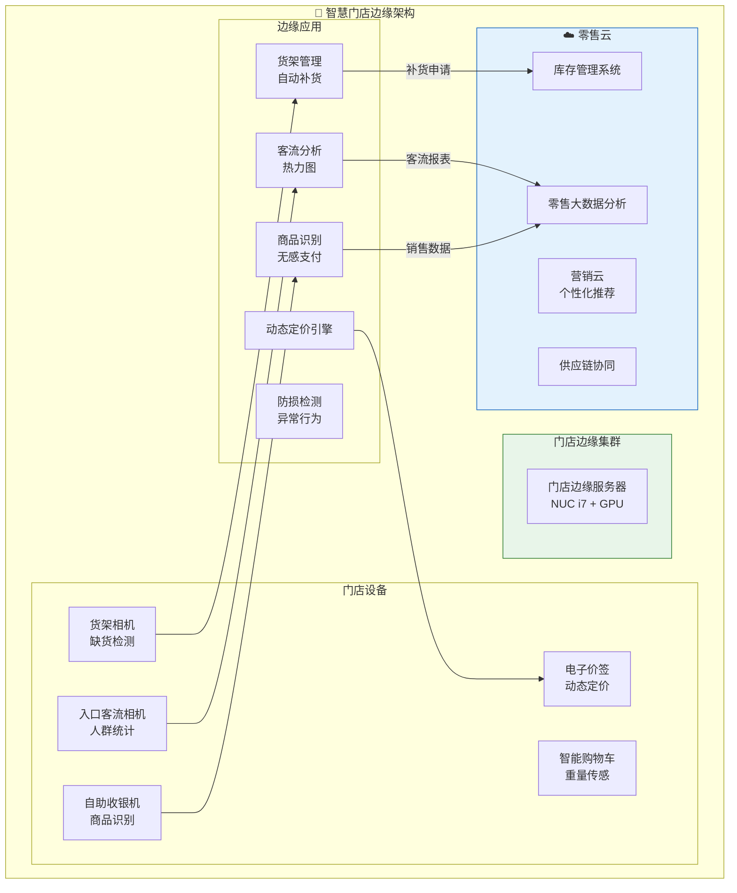
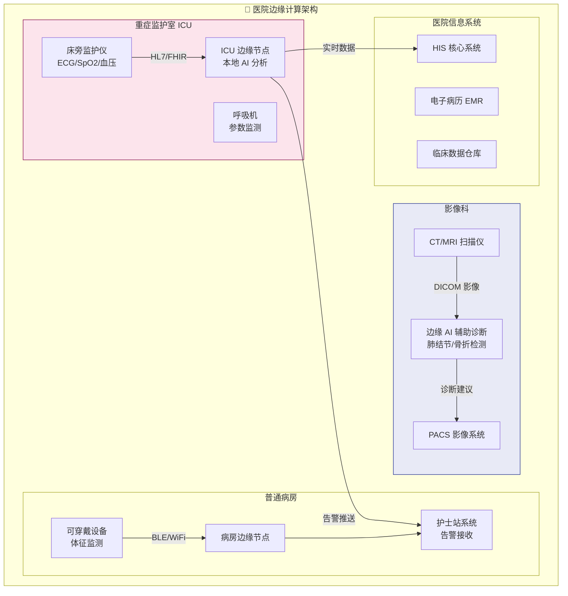
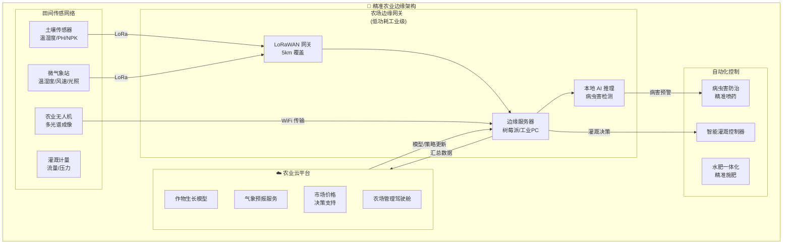
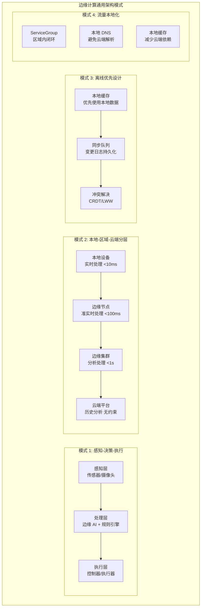
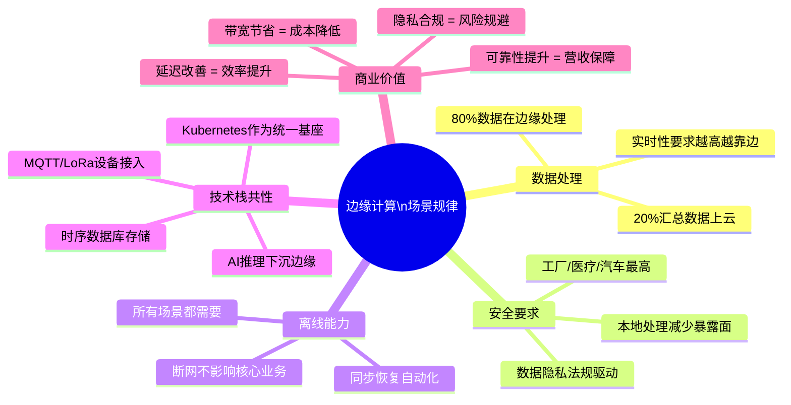

---
tags:
- edge
- [[KubeEdge|kubeedge]]
- case-study
intent_queries:
- edge-use-cases是什么？
- edge-use-cases的使用方法
- edge-use-cases的最佳实践

tier: peripheral---
title: 边缘场景案例 (Edge Computing Use Cases)
description: '<!-- chunk: 概述 (Overview)' -->## 概述 (Overview)'
category: edge-computing
tags:
- k8s
- edge
- iot
- kubeedge
- [[Flux|flux]]
- [[Harbor|harbor]]
- opa
- redis
- postgresql
- kafka
last_updated: 2026-05
difficulty: advanced
reading_level: advanced
audience:
- 边缘计算工程师
- SRE
- IoT 工程师
estimated_read_time: 5min
intent_queries:
- 边缘场景案例 (Edge Computing Use Cases) 是什么
- 如何 边缘场景案例 (Edge Computing Use Cases)
- Kubernetes 37 edge computing 最佳实践
trigger_keywords:
- 边缘场景案例
- Edge
- Computing
- Use
- Cases
- edge
- computing
authors:
- name: KUDIG Team
  role: contributor
k8s_versions:
- '1.28'
- '1.29'
- '1.30'
- '1.31'
- '1.32'
---

# 边缘场景案例 (Edge Computing Use Cases)

<!-- chunk: 概述 (Overview) -->## 概述 (Overview)

边缘计算正在深刻改变各行各业的数字化转型进程。从工业 4.0 的智能工厂、城市基础设施的智慧城市、汽车互联的车联网，到零售业的智慧门店、医疗卫生的边缘健康，再到农业物联网——每个场景都面临独特的挑战和需求。本文档通过 6 个典型行业案例，展示边缘计算的架构设计、技术选型和最佳实践。

Edge computing is transforming digital transformation across all industries. From smart factories (Industry 4.0) and smart cities, to connected vehicles (V2X), smart retail, healthcare at the edge, and agricultural IoT—each scenario presents unique challenges. This document presents 6 industry case studies showcasing edge computing architecture design, technology selection, and best practices.

---

<!-- chunk: 目录 (Table of Contents) -->## 目录 (Table of Contents)

1. [智能工厂 (Industry 4.0)](#1-智能工厂-industry-40)
2. [智慧城市 (Smart City)](#2-智慧城市-smart-city)
3. [车联网 V2X (Connected Vehicles)](#3-车联网-v2x-connected-vehicles)
4. [智慧零售 (Smart Retail)](#4-智慧零售-smart-retail)
5. [医疗边缘计算 (Healthcare Edge)](#5-医疗边缘计算-healthcare-edge)
6. [农业物联网 (Agricultural IoT)](#6-农业物联网-agricultural-iot)
7. [跨场景共性架构模式](#7-跨场景共性架构模式)

---

<!-- chunk: 1. 智能工厂 (Industry 4.0) -->## 1. 智能工厂 (Industry 4.0)

## 1.1 场景概述

某汽车零部件制造商拥有 12 个生产车间、2000+ 台设备，面临以下挑战：
- 质量检测依赖人工视觉，漏检率 3%，每年损失 500 万元
- 设备故障预测靠经验，非计划停机每月 40 小时
- 云端推理延迟 200ms，不满足生产线 50ms 要求
- 各车间数据孤岛，无法统一分析

## 1.2 智能工厂边缘架构



## 1.3 工业质量检测系统

```python
# industrial_quality_inspection.py
# 基于边缘 AI 的焊缝质量检测系统

import cv2
import numpy as np
import onnxruntime as ort
import time
from dataclasses import dataclass, field
from typing import List, Tuple, Optional, Dict
from enum import Enum
import json
import paho.mqtt.client as mqtt
import logging

logger = logging.getLogger(__name__)


class DefectType(Enum):
    """焊接缺陷类型"""
    NONE = "pass"              # 合格
    POROSITY = "porosity"      # 气孔
    CRACK = "crack"            # 裂纹
    UNDERCUT = "undercut"      # 咬边
    INCOMPLETE_FUSION = "incomplete_fusion"  # 未熔合
    SPATTER = "spatter"        # 飞溅（轻微）


@dataclass
class InspectionResult:
    """质量检测结果"""
    timestamp: float
    product_id: str
    workstation_id: str
    defects: List[Dict]
    pass_quality: bool
    confidence: float
    processing_time_ms: float
    image_path: Optional[str] = None
    metadata: Dict = field(default_factory=dict)


class WeldInspectionEngine:
    """焊缝质量检测引擎"""
    
    # 质量判定阈值
    DEFECT_THRESHOLD = 0.75       # 缺陷置信度阈值
    CRITICAL_DEFECTS = {DefectType.CRACK, DefectType.INCOMPLETE_FUSION}
    
    def __init__(
        self,
        model_path: str,
        workstation_id: str,
        mqtt_broker: str = "localhost",
        mqtt_port: int = 1883
    ):
        self.workstation_id = workstation_id
        
        # 加载 ONNX 模型（优化到 TensorRT EP）
        providers = ["TensorrtExecutionProvider", "CUDAExecutionProvider",
                     "CPUExecutionProvider"]
        
        sess_opts = ort.SessionOptions()
        sess_opts.graph_optimization_level = ort.GraphOptimizationLevel.ORT_ENABLE_ALL
        sess_opts.intra_op_num_threads = 4
        
        self.session = ort.InferenceSession(
            model_path,
            sess_options=sess_opts,
            providers=providers
        )
        
        self.input_name = self.session.get_inputs()[0].name
        self.input_shape = self.session.get_inputs()[0].shape
        
        # 统计信息
        self.stats = {
            "total_inspected": 0,
            "total_defects": 0,
            "false_alarm_rate": 0.0,
            "throughput_per_hour": 0
        }
        
        # MQTT 客户端（上报检测结果到 MES）
        self.mqtt_client = mqtt.Client(client_id=f"inspector_{workstation_id}")
        self.mqtt_client.connect(mqtt_broker, mqtt_port, keepalive=60)
        self.mqtt_client.loop_start()
        
        logger.info(f"质检引擎初始化完成: 工位 {workstation_id}")
    
    def preprocess(self, image: np.ndarray) -> np.ndarray:
        """图像预处理"""
        # 调整为模型输入尺寸
        h, w = self.input_shape[2], self.input_shape[3]
        img = cv2.resize(image, (w, h))
        
        # 灰度增强（工业图像通常需要对比度增强）
        img_yuv = cv2.cvtColor(img, cv2.COLOR_BGR2YUV)
        img_yuv[:, :, 0] = cv2.equalizeHist(img_yuv[:, :, 0])
        img = cv2.cvtColor(img_yuv, cv2.COLOR_YUV2BGR)
        
        # 归一化
        img = img.astype(np.float32) / 255.0
        mean = np.array([0.485, 0.456, 0.406])
        std = np.array([0.229, 0.224, 0.225])
        img = (img - mean) / std
        
        # HWC -> NCHW
        img = np.transpose(img, (2, 0, 1))
        return np.expand_dims(img, axis=0).astype(np.float32)
    
    def detect_defects(
        self,
        image: np.ndarray,
        product_id: str
    ) -> InspectionResult:
        """执行焊缝缺陷检测"""
        start_time = time.time()
        
        # 预处理
        processed = self.preprocess(image)
        
        # 推理
        outputs = self.session.run(None, {self.input_name: processed})
        
        # 解析结果（YOLO 格式输出）
        detections = self._parse_detections(outputs[0][0])
        
        # 缺陷分析
        defects = []
        is_pass = True
        max_confidence = 0.0
        
        for det in detections:
            if det["confidence"] >= self.DEFECT_THRESHOLD:
                defect_type = DefectType(det["class"])
                defects.append({
                    "type": defect_type.value,
                    "confidence": det["confidence"],
                    "bbox": det["bbox"],
                    "severity": self._assess_severity(defect_type, det)
                })
                
                max_confidence = max(max_confidence, det["confidence"])
                
                # 严重缺陷直接判为不合格
                if defect_type in self.CRITICAL_DEFECTS:
                    is_pass = False
        
        # 多缺陷组合判定
        if len(defects) >= 3:
            is_pass = False
        
        processing_time = (time.time() - start_time) * 1000
        
        result = InspectionResult(
            timestamp=time.time(),
            product_id=product_id,
            workstation_id=self.workstation_id,
            defects=defects,
            pass_quality=is_pass,
            confidence=max_confidence,
            processing_time_ms=processing_time
        )
        
        # 更新统计
        self.stats["total_inspected"] += 1
        if defects:
            self.stats["total_defects"] += 1
        
        # 上报结果到 MES
        self._report_to_mes(result)
        
        return result
    
    def _parse_detections(self, raw_output: np.ndarray) -> List[Dict]:
        """解析 YOLO 检测输出"""
        detections = []
        
        # raw_output shape: [num_detections, 6] -> [x1,y1,x2,y2,conf,class]
        for det in raw_output:
            x1, y1, x2, y2, conf, cls = det
            if conf >= 0.3:  # 低阈值初步过滤
                defect_names = ["pass", "porosity", "crack",
                                "undercut", "incomplete_fusion", "spatter"]
                cls_int = int(cls)
                if cls_int < len(defect_names):
                    detections.append({
                        "class": defect_names[cls_int],
                        "confidence": float(conf),
                        "bbox": [float(x1), float(y1), float(x2), float(y2)]
                    })
        
        return detections
    
    def _assess_severity(
        self,
        defect_type: DefectType,
        detection: Dict
    ) -> str:
        """评估缺陷严重程度"""
        conf = detection["confidence"]
        bbox = detection["bbox"]
        area = (bbox[2] - bbox[0]) * (bbox[3] - bbox[1])
        
        if defect_type in self.CRITICAL_DEFECTS:
            return "critical"
        elif conf > 0.9 or area > 0.05:  # 5% 图像面积
            return "major"
        else:
            return "minor"
    
    def _report_to_mes(self, result: InspectionResult) -> None:
        """上报检测结果到 MES 系统"""
        payload = {
            "timestamp": result.timestamp,
            "product_id": result.product_id,
            "workstation": result.workstation_id,
            "pass": result.pass_quality,
            "defects": result.defects,
            "processing_ms": result.processing_time_ms
        }
        
        topic = f"factory/inspection/{self.workstation_id}/result"
        self.mqtt_client.publish(
            topic,
            json.dumps(payload),
            qos=1  # At least once delivery
        )


class PredictiveMaintenanceEngine:
    """设备预测性维护引擎"""
    
    def __init__(self, model_path: str):
        self.session = ort.InferenceSession(
            model_path,
            providers=["CPUExecutionProvider"]
        )
        
        # 滑动窗口缓存（30 分钟传感器数据）
        self.window_size = 360  # 30min * 12点/min
        self.sensor_buffer: Dict[str, List] = {}
        
        # 设备健康状态
        self.device_health: Dict[str, str] = {}
    
    def update_sensor_data(
        self,
        device_id: str,
        sensor_data: Dict[str, float]
    ) -> Optional[Dict]:
        """
        更新传感器数据并预测设备健康状态
        
        传感器数据格式:
            {
                "vibration_x": 0.023,   # 振动加速度 (m/s²)
                "vibration_y": 0.019,
                "temperature": 68.5,     # 温度 (°C)
                "current": 12.3,         # 电流 (A)
                "rpm": 1450,             # 转速
                "noise_db": 72.3         # 噪声 (dB)
            }
        """
        if device_id not in self.sensor_buffer:
            self.sensor_buffer[device_id] = []
        
        # 添加时间戳
        sensor_data["timestamp"] = time.time()
        self.sensor_buffer[device_id].append(sensor_data)
        
        # 维持滑动窗口大小
        if len(self.sensor_buffer[device_id]) > self.window_size:
            self.sensor_buffer[device_id].pop(0)
        
        # 窗口未满时不预测
        if len(self.sensor_buffer[device_id]) < self.window_size:
            return None
        
        # 提取特征
        features = self._extract_features(self.sensor_buffer[device_id])
        
        # 预测
        input_array = np.array(features, dtype=np.float32).reshape(1, -1)
        output = self.session.run(None, {"features": input_array})[0]
        
        health_score = float(output[0][0])  # 0-1, 越低越差
        rul = float(output[0][1])           # 剩余使用寿命（小时）
        
        # 健康状态分类
        if health_score > 0.8:
            health_status = "healthy"
        elif health_score > 0.6:
            health_status = "degraded"
        elif health_score > 0.4:
            health_status = "warning"
        else:
            health_status = "critical"
        
        result = {
            "device_id": device_id,
            "health_score": health_score,
            "rul_hours": rul,
            "status": health_status,
            "timestamp": time.time()
        }
        
        # 状态变化时触发告警
        prev_status = self.device_health.get(device_id, "healthy")
        if health_status != prev_status:
            self._trigger_maintenance_alert(device_id, result)
            self.device_health[device_id] = health_status
        
        return result
    
    def _extract_features(self, buffer: List[Dict]) -> List[float]:
        """从时序缓冲区提取统计特征"""
        keys = ["vibration_x", "vibration_y", "temperature",
                "current", "rpm", "noise_db"]
        
        features = []
        for key in keys:
            values = [d[key] for d in buffer if key in d]
            if values:
                arr = np.array(values)
                features.extend([
                    float(np.mean(arr)),
                    float(np.std(arr)),
                    float(np.max(arr)),
                    float(np.min(arr)),
                    float(np.percentile(arr, 95))
                ])
            else:
                features.extend([0.0] * 5)
        
        return features
    
    def _trigger_maintenance_alert(
        self,
        device_id: str,
        result: Dict
    ) -> None:
        """触发维护告警"""
        logger.warning(
            f"设备 {device_id} 健康状态变化: {result['status']} "
            f"(健康分: {result['health_score']:.2f}, "
            f"RUL: {result['rul_hours']:.1f}h)"
        )
```

## 1.4 工厂边缘 Kubernetes 部署

```yaml
# factory-edge-deployment.yaml
# 智能工厂边缘 K3s 集群应用部署

---
# OPC-UA 协议网关（设备数据采集）
apiVersion: apps/v1
kind: Deployment
metadata:
  name: opcua-gateway
  namespace: factory-apps
spec:
  replicas: 1
  selector:
    matchLabels:
      app: opcua-gateway
  template:
    metadata:
      labels:
        app: opcua-gateway
    spec:
      hostNetwork: true  # 需要访问工业以太网
      nodeSelector:
        factory/role: gateway-node
      containers:
        - name: opcua-gateway
          image: factory/opcua-gateway:v3.2
          env:
            - name: OPC_UA_ENDPOINT
              value: "opc.tcp://192.168.10.1:4840"
            - name: MQTT_BROKER
              value: "mqtt://mosquitto:1883"
            - name: COLLECT_INTERVAL_MS
              value: "100"  # 100ms 采集一次
            - name: BUFFER_SIZE
              value: "10000"
          resources:
            limits:
              cpu: "500m"
              memory: "512Mi"
          securityContext:
            capabilities:
              add:
                - NET_RAW  # 工业以太网通信需要

---
# 视觉质检服务
apiVersion: apps/v1
kind: Deployment
metadata:
  name: vision-inspection
  namespace: factory-apps
spec:
  replicas: 2  # 2 个 GPU 节点
  selector:
    matchLabels:
      app: vision-inspection
  template:
    spec:
      nodeSelector:
        nvidia.com/gpu: "true"
      containers:
        - name: inspector
          image: factory/vision-inspection:v2.1
          env:
            - name: MODEL_PATH
              value: "/models/weld_defect_detector.onnx"
            - name: CAMERA_STREAM_URL
              value: "rtsp://192.168.10.100:554/stream"
            - name: DETECTION_THRESHOLD
              value: "0.75"
            - name: TARGET_FPS
              value: "30"
          resources:
            limits:
              nvidia.com/gpu: "1"
              cpu: "4"
              memory: "8Gi"
          volumeMounts:
            - name: models
              mountPath: /models
      volumes:
        - name: models
          persistentVolumeClaim:
            claimName: factory-models-pvc

---
# 预测性维护服务
apiVersion: apps/v1
kind: Deployment
metadata:
  name: predictive-maintenance
  namespace: factory-apps
spec:
  replicas: 1
  selector:
    matchLabels:
      app: predictive-maintenance
  template:
    spec:
      containers:
        - name: maintenance
          image: factory/predictive-maintenance:v1.5
          env:
            - name: MQTT_BROKER
              value: "mosquitto"
            - name: SUBSCRIBE_TOPIC
              value: "factory/sensors/#"
            - name: ALERT_WEBHOOK
              value: "http://mes-system:8080/api/alerts"
          resources:
            limits:
              cpu: "2"
              memory: "2Gi"
```

## 1.5 业务价值量化

| 指标 | 部署前 | 部署后 | 提升 |
|------|--------|--------|------|
| 质检漏检率 | 3.2% | 0.3% | ↓90.6% |
| 检测速度 | 人工 5s/件 | 边缘 80ms/件 | ↑62.5x |
| 非计划停机 | 40h/月 | 8h/月 | ↓80% |
| 云端带宽消耗 | 100Mbps | 5Mbps | ↓95% |
| 云端推理延迟 | 200ms | 50ms → 边缘 <5ms | ↓97.5% |

---

<!-- chunk: 2. 智慧城市 (Smart City) -->## 2. 智慧城市 (Smart City)

## 2.1 场景概述

某省会城市推进智慧城市建设，覆盖 500+ 个路口摄像头、200 个智慧路灯杆、50 个环境监测站，管理 300 万常住人口出行。



## 2.2 交通流量检测系统

```python
# smart_traffic_edge.py
# 边缘端交通流量检测与自适应信号控制

import cv2
import numpy as np
import asyncio
import time
from collections import deque
from typing import Dict, List, Tuple
import json
import aiohttp
import logging

logger = logging.getLogger(__name__)


class TrafficFlowDetector:
    """边缘端交通流量检测器"""
    
    # 感兴趣区域（检测线）
    ROI_LINES = {
        "north": [(0.1, 0.6), (0.9, 0.6)],   # 归一化坐标
        "south": [(0.1, 0.4), (0.9, 0.4)],
        "east":  [(0.6, 0.1), (0.6, 0.9)],
        "west":  [(0.4, 0.1), (0.4, 0.9)],
    }
    
    def __init__(
        self,
        intersection_id: str,
        model_path: str,
        frame_width: int = 1920,
        frame_height: int = 1080
    ):
        self.intersection_id = intersection_id
        self.frame_w = frame_width
        self.frame_h = frame_height
        
        # 加载车辆检测模型
        import onnxruntime as ort
        self.session = ort.InferenceSession(
            model_path,
            providers=["CPUExecutionProvider"]
        )
        
        # 流量统计（1分钟窗口）
        self.flow_counters: Dict[str, deque] = {
            direction: deque(maxlen=60)
            for direction in ["north", "south", "east", "west"]
        }
        
        # 车辆追踪（简化版 SORT）
        self.tracked_vehicles = {}
        self.next_vehicle_id = 0
        
        # 历史流量数据（24小时）
        self.hourly_flow = {}
    
    def process_frame(self, frame: np.ndarray) -> Dict:
        """处理单帧图像，返回流量数据"""
        
        # 1. 车辆检测
        vehicles = self._detect_vehicles(frame)
        
        # 2. 越线计数（使用虚拟检测线）
        crossings = self._count_crossings(vehicles)
        
        # 3. 计算当前流量
        current_flow = self._compute_flow(crossings)
        
        # 4. 拥堵评估
        congestion = self._assess_congestion(current_flow, vehicles)
        
        return {
            "intersection_id": self.intersection_id,
            "timestamp": time.time(),
            "vehicle_count": len(vehicles),
            "flow_by_direction": current_flow,
            "congestion_level": congestion,
            "vehicles": vehicles[:10]  # 仅返回前10个（节省带宽）
        }
    
    def _detect_vehicles(self, frame: np.ndarray) -> List[Dict]:
        """检测帧中的车辆"""
        # 预处理
        resized = cv2.resize(frame, (640, 640))
        input_data = resized.astype(np.float32) / 255.0
        input_data = np.transpose(input_data, (2, 0, 1))
        input_data = np.expand_dims(input_data, 0)
        
        # 推理
        outputs = self.session.run(None, {"images": input_data})[0]
        
        # 解析（YOLO 格式）
        vehicles = []
        for det in outputs[0]:
            x1, y1, x2, y2, conf, cls = det[:6]
            if conf > 0.5 and int(cls) in [2, 3, 5, 7]:  # 车辆类别
                # 还原到原始尺寸
                x1 = x1 / 640 * self.frame_w
                y1 = y1 / 640 * self.frame_h
                x2 = x2 / 640 * self.frame_w
                y2 = y2 / 640 * self.frame_h
                
                vehicle_class = {2: "car", 3: "motorcycle",
                                  5: "bus", 7: "truck"}[int(cls)]
                
                vehicles.append({
                    "bbox": [float(x1), float(y1), float(x2), float(y2)],
                    "center": [float((x1+x2)/2), float((y1+y2)/2)],
                    "class": vehicle_class,
                    "confidence": float(conf)
                })
        
        return vehicles
    
    def _count_crossings(self, vehicles: List[Dict]) -> Dict[str, int]:
        """统计各方向越线车辆数"""
        crossings = {d: 0 for d in ["north", "south", "east", "west"]}
        
        for vehicle in vehicles:
            cx, cy = vehicle["center"]
            
            # 归一化坐标
            nx = cx / self.frame_w
            ny = cy / self.frame_h
            
            # 检查是否在检测线附近
            for direction, (p1, p2) in self.ROI_LINES.items():
                if direction in ["north", "south"]:
                    # 水平检测线
                    line_y = p1[1]
                    if p1[0] <= nx <= p2[0]:
                        if abs(ny - line_y) < 0.02:  # 2% 容差
                            crossings[direction] += 1
                else:
                    # 垂直检测线
                    line_x = p1[0]
                    if p1[1] <= ny <= p2[1]:
                        if abs(nx - line_x) < 0.02:
                            crossings[direction] += 1
        
        return crossings
    
    def _compute_flow(self, crossings: Dict) -> Dict:
        """计算各方向流量（辆/小时）"""
        for direction, count in crossings.items():
            self.flow_counters[direction].append(count)
        
        flow = {}
        for direction, counter in self.flow_counters.items():
            # 1分钟内的车辆数 * 60 = 小时流量
            minute_count = sum(counter)
            flow[direction] = minute_count * 60
        
        return flow
    
    def _assess_congestion(
        self,
        flow: Dict,
        vehicles: List
    ) -> str:
        """评估拥堵等级"""
        total_flow = sum(flow.values())
        vehicle_count = len(vehicles)
        
        # 简单规则（实际应结合历史数据和路口通行能力）
        if vehicle_count > 50 or total_flow > 3000:
            return "severe"  # 严重拥堵
        elif vehicle_count > 30 or total_flow > 2000:
            return "heavy"   # 重度拥堵
        elif vehicle_count > 15 or total_flow > 1000:
            return "moderate"  # 中度拥堵
        else:
            return "free"    # 畅通


class AdaptiveTrafficSignalController:
    """自适应交通信号控制器"""
    
    # 最小绿灯时间（秒）
    MIN_GREEN = 15
    # 最大绿灯时间（秒）
    MAX_GREEN = 90
    # 黄灯时间（固定）
    YELLOW_TIME = 4
    
    def __init__(self, intersection_id: str, cloud_api_url: str):
        self.intersection_id = intersection_id
        self.cloud_api_url = cloud_api_url
        
        # 当前信号相位
        self.current_phase = "NS_GREEN"
        self.phase_start_time = time.time()
        
        # Webster 最优周期参数
        self.base_cycle = 60  # 基准周期（秒）
    
    def compute_optimal_timing(
        self,
        flow_data: Dict[str, int]
    ) -> Dict[str, int]:
        """
        使用 Webster 方法计算最优信号配时
        
        基于流量比 (Flow Ratio) 分配绿灯时间
        """
        # 东西向流量
        ew_flow = flow_data.get("east", 0) + flow_data.get("west", 0)
        # 南北向流量
        ns_flow = flow_data.get("north", 0) + flow_data.get("south", 0)
        total_flow = ew_flow + ns_flow
        
        if total_flow == 0:
            return {"NS_GREEN": 30, "EW_GREEN": 30}
        
        # 计算流量比
        ns_ratio = ns_flow / total_flow
        ew_ratio = ew_flow / total_flow
        
        # 可用绿灯时间（总周期 - 损失时间）
        loss_time = 2 * self.YELLOW_TIME  # 相位损失时间
        available_green = self.base_cycle - loss_time
        
        # 按流量比分配绿灯时间
        ns_green = max(self.MIN_GREEN,
                       min(self.MAX_GREEN, int(ns_ratio * available_green)))
        ew_green = max(self.MIN_GREEN,
                       min(self.MAX_GREEN, int(ew_ratio * available_green)))
        
        return {
            "NS_GREEN": ns_green,
            "EW_GREEN": ew_green,
            "YELLOW": self.YELLOW_TIME,
            "cycle_length": ns_green + ew_green + 2 * self.YELLOW_TIME
        }
```

## 2.3 智慧城市隐私保护

```yaml
# smart-city-privacy-policy.yaml
# 智慧城市边缘隐私保护配置

apiVersion: v1
kind: ConfigMap
metadata:
  name: privacy-protection-config
  namespace: city-apps
data:
  config.yaml: |
    # 人脸识别隐私保护
    face_recognition:
      enabled: true
      # 仅用于违规检测，不进行身份识别
      purpose_limitation: "traffic_violation_only"
      # 图像本地处理后立即丢弃原始数据
      raw_image_retention_seconds: 0
      # 处理结果匿名化
      anonymize_results: true
      # 人脸模糊
      blur_faces_before_cloud_upload: true
      blur_method: "pixelation"
      blur_intensity: 30
    
    # 车牌识别
    license_plate:
      enabled: true
      # 本地存储前脱敏（保留省份+后4位）
      mask_before_storage: true
      mask_pattern: "XX?****??"  # 粤A·1234 -> 粤A·****34
      # 违规证据保留时间
      violation_evidence_days: 180
      # 正常通行记录保留时间
      normal_record_days: 7
    
    # 人群密度统计（无个人识别）
    crowd_density:
      enabled: true
      # 只统计计数，不追踪个人
      track_individuals: false
      output_format: "density_map_only"
    
    # 数据共享规则
    data_sharing:
      # 与交警部门
      traffic_police:
        allowed_data: ["violation_events", "accident_scenes"]
        requires_approval: true
        approval_level: "district"
      
      # 跨部门禁止
      cross_department_raw_data: false
```

---

<!-- chunk: 3. 车联网 V2X (Connected Vehicles) -->## 3. 车联网 V2X (Connected Vehicles)

## 3.1 V2X 架构



## 3.2 V2X 边缘服务实现

```python
# v2x_edge_service.py
# V2X 路侧边缘计算服务

import asyncio
import json
import math
import time
from dataclasses import dataclass, field
from typing import Dict, List, Optional, Tuple
import numpy as np
import logging

logger = logging.getLogger(__name__)


@dataclass
class BasicSafetyMessage:
    """
    BSM - 基本安全消息 (SAE J2735)
    每辆车以 10Hz 频率广播
    """
    vehicle_id: str
    timestamp: float
    latitude: float       # 纬度
    longitude: float      # 经度
    elevation: float      # 海拔 (m)
    speed: float          # 速度 (m/s)
    heading: float        # 航向角 (度, 0=北)
    acceleration: float   # 加速度 (m/s²)
    width: float          # 车宽 (m)
    length: float         # 车长 (m)
    vehicle_type: str     # car/truck/bus/motorcycle
    brake_status: bool    # 是否刹车
    signal_status: str    # none/left/right/hazard
    rssi: int = -70       # 信号强度


class CollisionWarningSystem:
    """碰撞预警系统（V2X 核心安全功能）"""
    
    # 时间余量阈值（秒）
    TTC_WARNING_THRESHOLD = 3.0   # 3秒内碰撞预警
    TTC_CRITICAL_THRESHOLD = 1.5  # 1.5秒内紧急预警
    
    # 预测时间窗口（秒）
    PREDICTION_HORIZON = 5.0
    
    def __init__(self, rsu_id: str):
        self.rsu_id = rsu_id
        # 覆盖范围内的车辆状态
        self.vehicle_states: Dict[str, BasicSafetyMessage] = {}
        # 预警历史（防止重复告警）
        self._warned_pairs: Dict[str, float] = {}
    
    def update_vehicle(self, bsm: BasicSafetyMessage) -> None:
        """更新车辆状态"""
        self.vehicle_states[bsm.vehicle_id] = bsm
        
        # 清理超时车辆（2秒无信号）
        now = time.time()
        timeout_vehicles = [
            vid for vid, state in self.vehicle_states.items()
            if now - state.timestamp > 2.0
        ]
        for vid in timeout_vehicles:
            del self.vehicle_states[vid]
    
    def check_collisions(self) -> List[Dict]:
        """检测潜在碰撞风险"""
        warnings = []
        vehicles = list(self.vehicle_states.values())
        
        for i in range(len(vehicles)):
            for j in range(i + 1, len(vehicles)):
                v1, v2 = vehicles[i], vehicles[j]
                
                # 快速距离筛选（>200m 忽略）
                distance = self._haversine_distance(
                    v1.latitude, v1.longitude,
                    v2.latitude, v2.longitude
                )
                if distance > 200:
                    continue
                
                # 计算碰撞时间 (TTC)
                ttc = self._compute_ttc(v1, v2)
                
                if ttc is not None and ttc < self.TTC_WARNING_THRESHOLD:
                    pair_key = f"{min(v1.vehicle_id, v2.vehicle_id)}_{max(v1.vehicle_id, v2.vehicle_id)}"
                    
                    # 防止频繁重复告警
                    if time.time() - self._warned_pairs.get(pair_key, 0) < 1.0:
                        continue
                    
                    severity = "critical" if ttc < self.TTC_CRITICAL_THRESHOLD else "warning"
                    
                    warning = {
                        "type": "collision_warning",
                        "severity": severity,
                        "vehicle_1": v1.vehicle_id,
                        "vehicle_2": v2.vehicle_id,
                        "ttc_seconds": round(ttc, 2),
                        "distance_m": round(distance, 1),
                        "timestamp": time.time(),
                        "rsu_id": self.rsu_id,
                        # 碰撞预测位置
                        "predicted_collision_point": self._predict_collision_point(v1, v2, ttc)
                    }
                    
                    warnings.append(warning)
                    self._warned_pairs[pair_key] = time.time()
        
        return warnings
    
    def _compute_ttc(
        self,
        v1: BasicSafetyMessage,
        v2: BasicSafetyMessage
    ) -> Optional[float]:
        """
        计算碰撞时间 (Time To Collision)
        使用相对速度和位置预测
        """
        # 转换为本地坐标系（以 v1 为原点，单位：米）
        ref_lat, ref_lon = v1.latitude, v1.longitude
        
        def to_local(lat, lon):
            EARTH_RADIUS = 6371000
            dlat = math.radians(lat - ref_lat)
            dlon = math.radians(lon - ref_lon)
            x = EARTH_RADIUS * dlon * math.cos(math.radians(ref_lat))
            y = EARTH_RADIUS * dlat
            return x, y
        
        x1, y1 = 0, 0
        x2, y2 = to_local(v2.latitude, v2.longitude)
        
        # 速度分量
        def speed_components(speed, heading_deg):
            heading_rad = math.radians(heading_deg)
            vx = speed * math.sin(heading_rad)
            vy = speed * math.cos(heading_rad)
            return vx, vy
        
        vx1, vy1 = speed_components(v1.speed, v1.heading)
        vx2, vy2 = speed_components(v2.speed, v2.heading)
        
        # 相对速度
        rvx = vx1 - vx2
        rvy = vy1 - vy2
        
        # 相对位置
        dx = x1 - x2
        dy = y1 - y2
        
        # 计算最近接近时间
        rv_sq = rvx**2 + rvy**2
        if rv_sq < 0.001:  # 几乎平行运动
            return None
        
        t_cpa = -(dx * rvx + dy * rvy) / rv_sq  # CPA 时刻
        
        if t_cpa < 0 or t_cpa > self.PREDICTION_HORIZON:
            return None
        
        # 最近距离
        min_dist = math.sqrt(
            (dx + rvx * t_cpa)**2 + (dy + rvy * t_cpa)**2
        )
        
        # 安全距离（车辆长宽之和）
        safety_dist = (v1.length + v2.length) / 2 + (v1.width + v2.width) / 2
        
        if min_dist < safety_dist:
            return t_cpa
        
        return None
    
    @staticmethod
    def _haversine_distance(lat1, lon1, lat2, lon2) -> float:
        """计算两点间距离（米）"""
        R = 6371000
        phi1, phi2 = math.radians(lat1), math.radians(lat2)
        dphi = math.radians(lat2 - lat1)
        dlambda = math.radians(lon2 - lon1)
        
        a = (math.sin(dphi/2)**2 +
             math.cos(phi1) * math.cos(phi2) * math.sin(dlambda/2)**2)
        return R * 2 * math.atan2(math.sqrt(a), math.sqrt(1-a))
    
    def _predict_collision_point(
        self,
        v1: BasicSafetyMessage,
        v2: BasicSafetyMessage,
        ttc: float
    ) -> Dict:
        """预测碰撞点坐标"""
        heading_rad = math.radians(v1.heading)
        dlat = v1.speed * ttc * math.cos(heading_rad) / 111320
        dlon = v1.speed * ttc * math.sin(heading_rad) / (111320 * math.cos(math.radians(v1.latitude)))
        
        return {
            "latitude": v1.latitude + dlat,
            "longitude": v1.longitude + dlon
        }
```

---

<!-- chunk: 4. 智慧零售 (Smart Retail) -->## 4. 智慧零售 (Smart Retail)

## 4.1 智慧门店架构



## 4.2 货架缺货检测实现

```python
# smart_shelf_detection.py
# 边缘端货架管理系统

import cv2
import numpy as np
import json
import time
from typing import Dict, List, Tuple, Optional
from dataclasses import dataclass
import onnxruntime as ort


@dataclass
class ShelfZone:
    """货架区域定义"""
    zone_id: str
    sku_id: str           # 商品 SKU
    sku_name: str
    bbox: Tuple          # 货架区域坐标 [x1,y1,x2,y2]（归一化）
    min_fill_ratio: float = 0.2  # 最小填充率（低于此值触发补货）
    standard_fill_ratio: float = 0.8  # 标准填充率


class SmartShelfSystem:
    """智慧货架管理系统"""
    
    def __init__(
        self,
        detection_model_path: str,
        store_id: str,
        camera_id: str
    ):
        self.store_id = store_id
        self.camera_id = camera_id
        
        # 商品检测模型
        self.det_session = ort.InferenceSession(
            detection_model_path,
            providers=["CPUExecutionProvider"]
        )
        
        # 货架区域配置（从云端同步）
        self.shelf_zones: Dict[str, ShelfZone] = {}
        
        # 补货告警历史
        self.pending_alerts: Dict[str, float] = {}
    
    def analyze_shelf(self, frame: np.ndarray) -> List[Dict]:
        """分析货架状态"""
        h, w = frame.shape[:2]
        alerts = []
        
        for zone_id, zone in self.shelf_zones.items():
            # 提取货架区域图像
            x1 = int(zone.bbox[0] * w)
            y1 = int(zone.bbox[1] * h)
            x2 = int(zone.bbox[2] * w)
            y2 = int(zone.bbox[3] * h)
            
            shelf_roi = frame[y1:y2, x1:x2]
            
            # 计算填充率（商品占货架的比例）
            fill_ratio = self._compute_fill_ratio(shelf_roi, zone.sku_id)
            
            # 判断是否需要补货
            if fill_ratio < zone.min_fill_ratio:
                # 避免重复告警（5分钟内不重复）
                last_alert = self.pending_alerts.get(zone_id, 0)
                if time.time() - last_alert > 300:
                    severity = "urgent" if fill_ratio < 0.1 else "normal"
                    
                    alerts.append({
                        "store_id": self.store_id,
                        "camera_id": self.camera_id,
                        "zone_id": zone_id,
                        "sku_id": zone.sku_id,
                        "sku_name": zone.sku_name,
                        "fill_ratio": round(fill_ratio, 3),
                        "severity": severity,
                        "timestamp": time.time(),
                        "recommended_quantity": self._calc_replenishment(
                            zone, fill_ratio
                        )
                    })
                    
                    self.pending_alerts[zone_id] = time.time()
        
        return alerts
    
    def _compute_fill_ratio(
        self,
        roi: np.ndarray,
        sku_id: str
    ) -> float:
        """
        计算货架填充率
        使用图像分析：检测商品标签颜色/纹理
        """
        if roi.size == 0:
            return 0.0
        
        # 方法1：背景/商品分割（简化版）
        # 将货架图像转换为灰度图
        gray = cv2.cvtColor(roi, cv2.COLOR_BGR2GRAY)
        
        # 背景（空货架）通常是白色/浅色
        # 商品通常有彩色包装
        # 使用颜色饱和度区分
        hsv = cv2.cvtColor(roi, cv2.COLOR_BGR2HSV)
        saturation = hsv[:, :, 1]
        
        # 高饱和度区域 = 商品
        product_mask = saturation > 30
        fill_ratio = float(product_mask.sum()) / product_mask.size
        
        return min(1.0, fill_ratio / 0.9)  # 标准化，满架约 90% 被商品覆盖
    
    def _calc_replenishment(
        self,
        zone: ShelfZone,
        current_fill: float
    ) -> int:
        """计算建议补货数量"""
        target_fill = zone.standard_fill_ratio
        deficit_ratio = target_fill - current_fill
        
        # 假设每个标准位置放 2 个商品
        products_per_unit_area = 2.0
        zone_capacity = 20  # 假设每个货架区域容量 20 个
        
        return max(1, int(deficit_ratio * zone_capacity * products_per_unit_area))


class CustomerFlowAnalyzer:
    """客流热力图分析"""
    
    def __init__(self, store_width: int, store_height: int):
        """
        Args:
            store_width, store_height: 门店俯视图尺寸（厘米）
        """
        self.store_w = store_width
        self.store_h = store_height
        
        # 客流热力图（累积）
        self.heatmap = np.zeros((store_height // 50, store_width // 50),
                                dtype=np.float32)
        
        # 区域停留时间统计
        self.zone_dwell_time: Dict[str, List[float]] = {}
        
        # 当前追踪的顾客
        self.tracked_customers: Dict[str, Dict] = {}
    
    def update(
        self,
        detections: List[Dict],
        floor_transform_matrix: np.ndarray
    ) -> None:
        """更新客流热力图（将相机坐标映射到地面坐标）"""
        
        for det in detections:
            # 相机像素坐标（人脚底部中心）
            foot_x = (det["bbox"][0] + det["bbox"][2]) / 2
            foot_y = det["bbox"][3]
            
            # 使用单应性矩阵映射到地面坐标
            cam_pt = np.array([foot_x, foot_y], dtype=np.float32)
            floor_pt = cv2.perspectiveTransform(
                cam_pt, floor_transform_matrix
            )[0][0]
            
            # 更新热力图
            grid_x = min(int(floor_pt[0] / 50), self.heatmap.shape[1] - 1)
            grid_y = min(int(floor_pt[1] / 50), self.heatmap.shape[0] - 1)
            
            if 0 <= grid_x < self.heatmap.shape[1] and \
               0 <= grid_y < self.heatmap.shape[0]:
                self.heatmap[grid_y, grid_x] += 1.0
    
    def get_heatmap_visualization(self) -> np.ndarray:
        """生成热力图可视化"""
        # 归一化
        max_val = self.heatmap.max()
        if max_val > 0:
            normalized = self.heatmap / max_val
        else:
            normalized = self.heatmap
        
        # 应用颜色映射
        colored = cv2.applyColorMap(
            (normalized * 255).astype(np.uint8),
            cv2.COLORMAP_JET
        )
        
        return colored
    
    def get_zone_analytics(
        self,
        zones: Dict[str, Dict]
    ) -> Dict:
        """获取各区域分析数据"""
        analytics = {}
        
        for zone_name, zone_bbox in zones.items():
            x1, y1, x2, y2 = zone_bbox
            
            # 转换为热力图坐标
            gx1 = int(x1 / 50)
            gy1 = int(y1 / 50)
            gx2 = min(int(x2 / 50), self.heatmap.shape[1])
            gy2 = min(int(y2 / 50), self.heatmap.shape[0])
            
            zone_heat = self.heatmap[gy1:gy2, gx1:gx2]
            
            analytics[zone_name] = {
                "total_visits": int(zone_heat.sum()),
                "avg_density": float(zone_heat.mean()),
                "max_density": float(zone_heat.max())
            }
        
        return analytics
```

---

<!-- chunk: 5. 医疗边缘计算 (Healthcare Edge) -->## 5. 医疗边缘计算 (Healthcare Edge)

## 5.1 医疗边缘架构



## 5.2 患者生命体征实时分析

```python
# patient_vital_monitor.py
# 边缘端患者生命体征实时监测与告警

import numpy as np
import time
from dataclasses import dataclass, field
from typing import Dict, List, Optional, Tuple, Callable
from enum import Enum
import json
import asyncio
import logging

logger = logging.getLogger(__name__)


class AlertLevel(Enum):
    NORMAL = "normal"
    ADVISORY = "advisory"    # 建议级
    WARNING = "warning"      # 警告级
    CRITICAL = "critical"    # 紧急级
    LIFE_THREATENING = "life_threatening"  # 生命危险


@dataclass
class VitalSigns:
    """生命体征数据"""
    patient_id: str
    timestamp: float
    heart_rate: Optional[float] = None         # 心率 (bpm)
    spo2: Optional[float] = None               # 血氧饱和度 (%)
    systolic_bp: Optional[float] = None        # 收缩压 (mmHg)
    diastolic_bp: Optional[float] = None       # 舒张压 (mmHg)
    respiratory_rate: Optional[float] = None   # 呼吸频率 (/min)
    temperature: Optional[float] = None        # 体温 (°C)
    ecg_data: Optional[np.ndarray] = None      # ECG 波形（10秒）


class VitalSignsAnalyzer:
    """生命体征分析引擎（边缘端实时分析）"""
    
    # 正常值参考范围
    NORMAL_RANGES = {
        "heart_rate": (60, 100),          # bpm
        "spo2": (95, 100),                # %
        "systolic_bp": (90, 140),         # mmHg
        "diastolic_bp": (60, 90),         # mmHg
        "respiratory_rate": (12, 20),     # /min
        "temperature": (36.0, 37.5),      # °C
    }
    
    # 危急值范围（需要立即干预）
    CRITICAL_RANGES = {
        "heart_rate": (40, 150),
        "spo2": (90, 100),
        "systolic_bp": (70, 200),
        "respiratory_rate": (8, 30),
        "temperature": (35.0, 40.0),
    }
    
    def __init__(
        self,
        patient_id: str,
        alert_callback: Optional[Callable] = None,
        ecg_model_path: Optional[str] = None
    ):
        self.patient_id = patient_id
        self.alert_callback = alert_callback
        
        # ECG 心律失常检测模型（可选）
        self.ecg_model = None
        if ecg_model_path:
            import onnxruntime as ort
            self.ecg_model = ort.InferenceSession(
                ecg_model_path,
                providers=["CPUExecutionProvider"]
            )
        
        # 历史数据缓冲区（5分钟）
        self.history_buffer: List[VitalSigns] = []
        self.buffer_max_size = 300  # 5 min * 60 readings
        
        # 趋势分析
        self.trend_alerts: Dict[str, bool] = {}
    
    def analyze(self, vitals: VitalSigns) -> List[Dict]:
        """综合分析生命体征"""
        alerts = []
        
        # 1. 单值异常检测
        alerts.extend(self._check_single_values(vitals))
        
        # 2. ECG 心律失常检测
        if vitals.ecg_data is not None and self.ecg_model:
            arrhythmia = self._detect_arrhythmia(vitals.ecg_data)
            if arrhythmia:
                alerts.append({
                    "type": "arrhythmia",
                    "level": AlertLevel.CRITICAL.value,
                    "finding": arrhythmia,
                    "patient_id": vitals.patient_id
                })
        
        # 3. 趋势分析（需要足够历史数据）
        self.history_buffer.append(vitals)
        if len(self.history_buffer) > self.buffer_max_size:
            self.history_buffer.pop(0)
        
        if len(self.history_buffer) >= 30:
            trends = self._analyze_trends()
            alerts.extend(trends)
        
        # 4. 早期预警评分 (NEWS2)
        news_score = self._compute_news2(vitals)
        if news_score >= 7:
            alerts.append({
                "type": "early_warning",
                "level": AlertLevel.CRITICAL.value,
                "news2_score": news_score,
                "message": "NEWS2 评分危急，需要立即评估",
                "patient_id": vitals.patient_id
            })
        elif news_score >= 5:
            alerts.append({
                "type": "early_warning",
                "level": AlertLevel.WARNING.value,
                "news2_score": news_score,
                "message": "NEWS2 评分升高，建议增加监测频率",
                "patient_id": vitals.patient_id
            })
        
        # 触发回调
        if alerts and self.alert_callback:
            asyncio.create_task(self.alert_callback(alerts))
        
        return alerts
    
    def _check_single_values(self, vitals: VitalSigns) -> List[Dict]:
        """检查单个生命体征值"""
        alerts = []
        
        checks = [
            ("heart_rate", vitals.heart_rate, "心率"),
            ("spo2", vitals.spo2, "血氧饱和度"),
            ("systolic_bp", vitals.systolic_bp, "收缩压"),
            ("diastolic_bp", vitals.diastolic_bp, "舒张压"),
            ("respiratory_rate", vitals.respiratory_rate, "呼吸频率"),
            ("temperature", vitals.temperature, "体温"),
        ]
        
        for param, value, label in checks:
            if value is None:
                continue
            
            critical_range = self.CRITICAL_RANGES.get(param)
            normal_range = self.NORMAL_RANGES.get(param)
            
            # 检查危急值
            if critical_range:
                if value < critical_range[0] or value > critical_range[1]:
                    level = AlertLevel.LIFE_THREATENING
                    message = f"{label} 危急值: {value}"
                    alerts.append({
                        "type": "vital_critical",
                        "level": level.value,
                        "parameter": param,
                        "value": value,
                        "message": message,
                        "patient_id": vitals.patient_id,
                        "timestamp": vitals.timestamp
                    })
                    continue
            
            # 检查异常值
            if normal_range:
                if value < normal_range[0] or value > normal_range[1]:
                    # 根据偏离程度决定告警级别
                    deviation = max(
                        (normal_range[0] - value) / normal_range[0] if value < normal_range[0] else 0,
                        (value - normal_range[1]) / normal_range[1] if value > normal_range[1] else 0
                    )
                    
                    if deviation > 0.2:
                        level = AlertLevel.WARNING
                    else:
                        level = AlertLevel.ADVISORY
                    
                    alerts.append({
                        "type": "vital_abnormal",
                        "level": level.value,
                        "parameter": param,
                        "value": value,
                        "normal_range": normal_range,
                        "message": f"{label} 异常: {value}（正常: {normal_range[0]}-{normal_range[1]}）",
                        "patient_id": vitals.patient_id
                    })
        
        return alerts
    
    def _compute_news2(self, vitals: VitalSigns) -> int:
        """计算 NEWS2 (National Early Warning Score 2) 早期预警评分"""
        score = 0
        
        # 呼吸频率
        rr = vitals.respiratory_rate
        if rr:
            if rr <= 8: score += 3
            elif rr <= 11: score += 1
            elif rr <= 20: score += 0
            elif rr <= 24: score += 2
            else: score += 3
        
        # 血氧饱和度 (Scale 1)
        spo2 = vitals.spo2
        if spo2:
            if spo2 <= 91: score += 3
            elif spo2 <= 93: score += 2
            elif spo2 <= 95: score += 1
            else: score += 0
        
        # 收缩压
        sbp = vitals.systolic_bp
        if sbp:
            if sbp <= 90: score += 3
            elif sbp <= 100: score += 2
            elif sbp <= 110: score += 1
            elif sbp <= 219: score += 0
            else: score += 3
        
        # 心率
        hr = vitals.heart_rate
        if hr:
            if hr <= 40: score += 3
            elif hr <= 50: score += 1
            elif hr <= 90: score += 0
            elif hr <= 110: score += 1
            elif hr <= 130: score += 2
            else: score += 3
        
        # 体温
        temp = vitals.temperature
        if temp:
            if temp <= 35.0: score += 3
            elif temp <= 36.0: score += 1
            elif temp <= 38.0: score += 0
            elif temp <= 39.0: score += 1
            else: score += 2
        
        return score
    
    def _detect_arrhythmia(self, ecg_data: np.ndarray) -> Optional[str]:
        """ECG 心律失常检测"""
        if self.ecg_model is None:
            return None
        
        # 预处理 ECG 数据
        normalized = (ecg_data - ecg_data.mean()) / (ecg_data.std() + 1e-8)
        input_data = normalized.reshape(1, 1, -1).astype(np.float32)
        
        output = self.ecg_model.run(None, {"ecg": input_data})[0][0]
        
        # 分类
        classes = [
            "Normal sinus rhythm",
            "Atrial fibrillation",  # 房颤
            "Ventricular tachycardia",  # 室速
            "Ventricular fibrillation",  # 室颤（危及生命）
            "Bradycardia",  # 心动过缓
            "Bundle branch block"  # 束支传导阻滞
        ]
        
        pred_class = np.argmax(output)
        confidence = float(output[pred_class])
        
        if pred_class == 0 or confidence < 0.7:
            return None  # 正常或置信度不足
        
        return f"{classes[pred_class]} (置信度: {confidence:.1%})"
    
    def _analyze_trends(self) -> List[Dict]:
        """趋势分析：检测指标持续恶化"""
        alerts = []
        
        if len(self.history_buffer) < 30:
            return alerts
        
        recent = self.history_buffer[-30:]  # 最近 30 个读数
        
        # 分析 SpO2 下降趋势
        spo2_values = [v.spo2 for v in recent if v.spo2 is not None]
        if len(spo2_values) >= 10:
            trend = np.polyfit(range(len(spo2_values)), spo2_values, 1)[0]
            if trend < -0.1:  # SpO2 持续下降
                alerts.append({
                    "type": "trend_alert",
                    "level": AlertLevel.WARNING.value,
                    "parameter": "spo2",
                    "trend": f"{trend:.3f}%/reading",
                    "message": "血氧饱和度持续下降趋势",
                    "patient_id": self.patient_id
                })
        
        return alerts
```

## 5.3 医疗数据合规配置

```yaml
# healthcare-data-compliance.yaml
# 医疗数据 HIPAA 合规配置

apiVersion: v1
kind: ConfigMap
metadata:
  name: healthcare-compliance
  namespace: healthcare-edge
data:
  compliance.yaml: |
    # PHI (Protected Health Information) 处理规则
    phi_handling:
      # 传输加密：强制 TLS 1.3
      transport_encryption: "TLS_1_3"
      
      # 存储加密：AES-256
      storage_encryption: "AES_256_GCM"
      
      # 数据最小化：只处理必要的 PHI
      data_minimization: true
      
      # 访问控制：RBAC + 审计
      access_control:
        require_authentication: true
        require_authorization: true
        audit_all_access: true
        
      # 数据保留：按法规要求
      retention:
        clinical_records_years: 10
        imaging_years: 7
        vital_signs_days: 90
      
      # 患者同意管理
      consent:
        require_consent_for_analytics: true
        allow_withdrawal: true
        consent_log_required: true
      
      # 数据脱敏规则
      de_identification:
        method: "safe_harbor"  # HIPAA Safe Harbor 方法
        remove_fields:
          - patient_name
          - date_of_birth
          - ssn
          - address
          - phone
          - fax
          - email
          - url
          - ip_address
          - device_identifiers
          - biometric_identifiers
          - photos
        generalize_fields:
          age:
            method: "range"
            ranges: ["<1", "1-17", "18-64", "65-89", ">=90"]
          location:
            method: "zip_code_prefix"  # 仅保留邮编前 3 位
          dates:
            method: "year_only"        # 日期仅保留年份
```

---

<!-- chunk: 6. 农业物联网 (Agricultural IoT) -->## 6. 农业物联网 (Agricultural IoT)

## 6.1 精准农业架构



## 6.2 农业边缘 AI 实现

```python
# agricultural_edge_ai.py
# 精准农业边缘 AI 系统

import numpy as np
import json
import time
from typing import Dict, List, Optional, Tuple
from dataclasses import dataclass
import onnxruntime as ort
import logging

logger = logging.getLogger(__name__)


@dataclass
class SoilData:
    """土壤传感器数据"""
    sensor_id: str
    timestamp: float
    temperature: float    # 土壤温度 (°C)
    moisture: float       # 土壤湿度 (%)
    ph: float             # PH 值
    nitrogen: float       # 氮含量 (mg/kg)
    phosphorus: float     # 磷含量 (mg/kg)
    potassium: float      # 钾含量 (mg/kg)
    ec: float             # 电导率 (mS/cm)


@dataclass
class WeatherData:
    """气象数据"""
    station_id: str
    timestamp: float
    temperature: float        # 气温 (°C)
    humidity: float           # 相对湿度 (%)
    wind_speed: float         # 风速 (m/s)
    wind_direction: float     # 风向 (度)
    solar_radiation: float    # 太阳辐射 (W/m²)
    rainfall: float           # 降雨量 (mm)


class CropDiseaseDetector:
    """作物病虫害检测器"""
    
    # 常见病虫害类别
    DISEASE_CLASSES = [
        "healthy",
        "bacterial_spot",       # 细菌性斑点病
        "early_blight",         # 早疫病
        "late_blight",          # 晚疫病
        "leaf_mold",            # 叶霉病
        "septoria_leaf_spot",   # 斑枯病
        "spider_mites",         # 红蜘蛛
        "target_spot",          # 靶斑病
        "mosaic_virus",         # 花叶病毒
        "yellow_curl_virus"     # 黄化曲叶病毒
    ]
    
    def __init__(self, model_path: str, crop_type: str = "tomato"):
        self.crop_type = crop_type
        
        self.session = ort.InferenceSession(
            model_path,
            providers=["CPUExecutionProvider"]
        )
        
        # 检测历史（用于趋势分析）
        self.detection_history: List[Dict] = []
        
        # 病害扩散预测参数
        self.spread_risk_factors = {}
    
    def detect_disease(
        self,
        image: np.ndarray,
        field_id: str,
        location: Tuple[float, float]
    ) -> Dict:
        """检测作物病害"""
        import cv2
        
        # 预处理
        resized = cv2.resize(image, (224, 224))
        img = resized.astype(np.float32) / 255.0
        mean = np.array([0.485, 0.456, 0.406])
        std = np.array([0.229, 0.224, 0.225])
        img = (img - mean) / std
        img = np.transpose(img, (2, 0, 1))
        img = np.expand_dims(img, 0).astype(np.float32)
        
        # 推理
        output = self.session.run(None, {"input": img})[0][0]
        
        # 取 Top-3 结果
        top3_idx = np.argsort(output)[::-1][:3]
        top3 = [
            {
                "disease": self.DISEASE_CLASSES[i],
                "confidence": float(output[i]),
                "is_diseased": self.DISEASE_CLASSES[i] != "healthy"
            }
            for i in top3_idx
        ]
        
        result = {
            "field_id": field_id,
            "location": {"lat": location[0], "lon": location[1]},
            "timestamp": time.time(),
            "crop_type": self.crop_type,
            "top_prediction": top3[0],
            "all_predictions": top3,
            "action_required": top3[0]["is_diseased"] and top3[0]["confidence"] > 0.7
        }
        
        # 记录历史
        self.detection_history.append(result)
        
        # 评估病害扩散风险
        if result["action_required"]:
            result["spread_risk"] = self._assess_spread_risk(
                top3[0]["disease"], field_id
            )
        
        return result
    
    def _assess_spread_risk(
        self,
        disease: str,
        field_id: str
    ) -> str:
        """评估病害扩散风险"""
        # 统计最近 7 天同类病害检测次数
        recent = [
            r for r in self.detection_history[-100:]
            if r.get("top_prediction", {}).get("disease") == disease
            and time.time() - r["timestamp"] < 7 * 86400
        ]
        
        if len(recent) >= 10:
            return "high"
        elif len(recent) >= 5:
            return "medium"
        else:
            return "low"


class SmartIrrigationController:
    """智能灌溉控制器"""
    
    # 不同作物最优土壤湿度范围
    CROP_MOISTURE_TARGETS = {
        "tomato": (65, 80),
        "corn": (70, 85),
        "wheat": (60, 75),
        "lettuce": (70, 80),
        "strawberry": (65, 75),
    }
    
    def __init__(
        self,
        crop_type: str,
        field_area_m2: float,
        drip_rate_lph: float = 2.0  # 滴灌流量 L/h/滴头
    ):
        self.crop_type = crop_type
        self.field_area = field_area_m2
        self.drip_rate = drip_rate_lph
        
        # 灌溉决策模型（ETc 蒸散量计算）
        self.last_irrigation = 0.0
        self.irrigation_log = []
    
    def compute_irrigation_need(
        self,
        soil_data: SoilData,
        weather_data: WeatherData,
        forecast_data: Optional[Dict] = None
    ) -> Dict:
        """
        计算灌溉需求
        
        使用 Penman-Monteith 方法计算参考蒸散量 (ET0)
        结合土壤湿度和天气预报做决策
        """
        target_min, target_max = self.CROP_MOISTURE_TARGETS.get(
            self.crop_type, (65, 80)
        )
        
        current_moisture = soil_data.moisture
        
        # 如果土壤湿度在目标范围内，无需灌溉
        if target_min <= current_moisture <= target_max:
            return {
                "action": "none",
                "reason": f"土壤湿度正常 ({current_moisture:.1f}%)",
                "current_moisture": current_moisture
            }
        
        # 如果预报未来 24 小时有雨，推迟灌溉
        if forecast_data and forecast_data.get("rainfall_24h", 0) > 5:
            return {
                "action": "postpone",
                "reason": f"预报 24 小时降雨 {forecast_data['rainfall_24h']}mm，推迟灌溉",
                "current_moisture": current_moisture
            }
        
        # 计算 ET0（Penman-Monteith 简化版）
        et0 = self._compute_et0(weather_data)
        
        # 作物系数 Kc（根据生长期不同）
        kc = 1.0  # 中期生长阶段
        etc = et0 * kc  # 作物蒸散量 mm/day
        
        # 计算灌溉量（补偿蒸散损失 + 补充土壤湿度）
        moisture_deficit = target_min - current_moisture if current_moisture < target_min else 0
        
        # 将湿度百分比转换为灌水量
        # 假设每 1% 湿度对应 1mm 水量（简化）
        irrigation_depth_mm = etc + moisture_deficit
        
        # 灌溉时长计算
        irrigation_volume_l = irrigation_depth_mm * self.field_area / 1000  # L
        irrigation_duration_min = irrigation_volume_l / (self.drip_rate * 60)  # 分钟
        
        return {
            "action": "irrigate",
            "duration_minutes": round(irrigation_duration_min, 1),
            "water_volume_liters": round(irrigation_volume_l, 1),
            "et0_mm": round(et0, 2),
            "etc_mm": round(etc, 2),
            "moisture_deficit": round(moisture_deficit, 1),
            "current_moisture": current_moisture,
            "target_range": [target_min, target_max],
            "reason": f"土壤湿度不足 ({current_moisture:.1f}% < {target_min}%)，计划灌溉 {irrigation_duration_min:.0f} 分钟"
        }
    
    def _compute_et0(self, weather: WeatherData) -> float:
        """计算参考蒸散量 ET0 (Hargreaves-Samani 简化方法)"""
        # 温度修正
        T_mean = weather.temperature
        
        # 太阳辐射转换 (W/m² -> MJ/m²/day)
        Rs = weather.solar_radiation * 0.0864
        
        # Hargreaves-Samani 公式（简化）
        et0 = 0.0135 * (T_mean + 17.78) * Rs * 0.408
        
        return max(0, et0)


class LoRaWANDataCollector:
    """LoRaWAN 传感器数据收集器"""
    
    def __init__(self, gateway_host: str = "localhost", port: int = 1700):
        self.gateway_host = gateway_host
        self.gateway_port = port
        self.sensor_registry: Dict[str, Dict] = {}
    
    async def decode_lorawan_packet(self, raw_packet: bytes) -> Optional[Dict]:
        """解码 LoRaWAN 数据包"""
        # 实际实现使用 ChirpStack 或 TTN 的 API
        # 此处为示意
        try:
            # 解析 LoRaWAN MAC 帧
            # MHDR (1B) + MACPayload + MIC (4B)
            mhdr = raw_packet[0]
            mtype = (mhdr >> 5) & 0x7  # 消息类型
            
            if mtype not in [2, 4]:  # Unconfirmed/Confirmed Data Up
                return None
            
            # 解析 FHdr, FPort, FRMPayload
            payload = raw_packet[1:-4]  # 去掉 MIC
            
            # 解密 (AES-128 解密，需要 AppSKey)
            # 此处简化，直接返回 JSON payload
            decoded = json.loads(payload[10:].decode('utf-8'))
            
            return decoded
        
        except Exception as e:
            logger.error(f"LoRaWAN 解包失败: {e}")
            return None
```

## 6.3 农业 IoT 边缘部署

```yaml
# farm-edge-deployment.yaml
# 农场边缘 K3s 集群部署（ARM 架构节点）

apiVersion: apps/v1
kind: Deployment
metadata:
  name: lorawan-gateway-bridge
  namespace: farm-iot
spec:
  replicas: 1
  selector:
    matchLabels:
      app: lorawan-bridge
  template:
    spec:
      hostNetwork: true  # 访问 LoRaWAN 硬件
      nodeSelector:
        kubernetes.io/arch: arm64
        farm/role: gateway-node
      containers:
        - name: chirpstack-gateway-bridge
          image: chirpstack/chirpstack-gateway-bridge:4.0
          env:
            - name: INTEGRATION__MQTT__EVENT_TOPIC_TEMPLATE
              value: "farm/lora/+/+/event/+"
            - name: INTEGRATION__MQTT__AUTH__GENERIC__SERVERS
              value: "tcp://mosquitto:1883"
          resources:
            limits:
              cpu: "200m"
              memory: "128Mi"

---
# 农业 AI 推理服务（ARM 优化）
apiVersion: apps/v1
kind: Deployment
metadata:
  name: crop-disease-detector
  namespace: farm-iot
spec:
  replicas: 1
  selector:
    matchLabels:
      app: disease-detector
  template:
    spec:
      nodeSelector:
        kubernetes.io/arch: arm64
      containers:
        - name: detector
          image: farm/crop-disease-detector:v1.0-arm64
          env:
            - name: MODEL_PATH
              value: "/models/plant_disease_mobilenet_int8.onnx"
            - name: MQTT_BROKER
              value: "mosquitto"
            - name: SUBSCRIBE_TOPIC
              value: "farm/drone/images"
            - name: ALERT_TOPIC
              value: "farm/alerts/disease"
          resources:
            limits:
              cpu: "1"
              memory: "512Mi"
          volumeMounts:
            - name: models
              mountPath: /models
      volumes:
        - name: models
          hostPath:
            path: /data/farm-models

---
# 智能灌溉控制
apiVersion: apps/v1
kind: Deployment
metadata:
  name: irrigation-controller
  namespace: farm-iot
spec:
  replicas: 1
  selector:
    matchLabels:
      app: irrigation-controller
  template:
    spec:
      containers:
        - name: controller
          image: farm/irrigation-controller:v2.0
          env:
            - name: CROP_TYPE
              value: "tomato"
            - name: FIELD_AREA_M2
              value: "50000"
            - name: WEATHER_API_URL
              value: "http://weather-api:8080"
            - name: SOIL_SENSOR_TOPIC
              value: "farm/sensors/soil/#"
          resources:
            limits:
              cpu: "500m"
              memory: "256Mi"
```

---

<!-- chunk: 7. 跨场景共性架构模式 -->## 7. 跨场景共性架构模式

## 7.1 边缘计算通用架构模式



## 7.2 行业场景对比矩阵

| 场景 | 延迟要求 | 带宽消耗 | 离线能力 | AI 复杂度 | 安全级别 | 数据隐私 |
|------|---------|---------|---------|---------|---------|---------|
| **智能工厂** | <5ms (控制) | 中等 | 必须 | 高 | 高 | 中 |
| **智慧城市** | <200ms | 高 | 部分 | 高 | 高 | 极高 |
| **车联网 V2X** | <10ms | 高 | 必须 | 高 | 极高 | 高 |
| **智慧零售** | <500ms | 中等 | 部分 | 中 | 中 | 高 |
| **医疗边缘** | <1s (监护) | 低 | 必须 | 高 | 极高 | 极高 |
| **农业 IoT** | <5min | 极低 | 必须 | 中 | 低 | 低 |

## 7.3 技术选型汇总

```yaml
# 各场景推荐技术栈汇总
edge_technology_recommendations:
  
  smart_factory:
    edge_os: "K3s on Ubuntu 20.04 LTS"
    ai_inference: "TensorRT (NVIDIA Jetson)"
    protocol: "OPC-UA + MQTT"
    storage: "InfluxDB + RocksDB"
    messaging: "Kafka (边缘) + Kafka (云端)"
    security: "mTLS + OPA"
  
  smart_city:
    edge_os: "K3s on Ubuntu 22.04"
    ai_inference: "OpenVINO (Intel) / TensorRT (NVIDIA)"
    protocol: "MQTT + HTTP/2"
    storage: "TimescaleDB + Longhorn"
    privacy: "Differential Privacy + Face Blur"
    security: "SPIFFE/SPIRE + mTLS"
  
  connected_vehicles:
    edge_os: "Automotive Linux / QNX"
    ai_inference: "TensorRT INT8"
    protocol: "DSRC / C-V2X (PC5)"
    latency: "< 10ms (safety-critical)"
    security: "V2X Security Credentials (IEEE 1609.2)"
  
  smart_retail:
    edge_os: "K3s on Debian"
    ai_inference: "ONNX Runtime"
    protocol: "HTTP/2 + WebSocket"
    storage: "SQLite + Redis"
    analytics: "Apache Flink (边缘流处理)"
  
  healthcare_edge:
    edge_os: "Hardened Ubuntu + Confidential Computing"
    ai_inference: "ONNX Runtime (Intel SGX 可选)"
    protocol: "HL7 FHIR + DICOM"
    storage: "PostgreSQL (加密) + PACS"
    compliance: "HIPAA + HL7 FHIR R4"
    security: "mTLS + Vault + Audit Logging"
  
  agricultural_iot:
    edge_os: "Raspberry Pi OS / Yocto"
    ai_inference: "TFLite INT8 (ARM优化)"
    protocol: "LoRaWAN + MQTT"
    storage: "InfluxDB (时序) + SQLite (配置)"
    power: "太阳能供电 + 低功耗设计"
    connectivity: "4G LTE (主) + LoRa (辅)"
```

## 7.4 边缘计算 ROI 分析框架

```python
# edge_roi_calculator.py
# 边缘计算投资回报分析

from dataclasses import dataclass
from typing import Dict


@dataclass
class EdgeROIAnalysis:
    """边缘计算 ROI 分析"""
    
    scenario: str
    
    # 成本
    edge_hardware_cost: float      # 边缘硬件成本
    deployment_cost: float         # 部署实施成本
    annual_maintenance_cost: float # 年维护成本
    
    # 收益
    bandwidth_savings_annual: float     # 带宽节省（年）
    latency_improvement_value: float    # 延迟改善带来的业务价值（年）
    efficiency_gain_value: float        # 效率提升带来的价值（年）
    downtime_reduction_value: float     # 问题减少节省（年）
    compliance_cost_avoidance: float    # 合规风险规避（年）
    
    # 生命周期（年）
    lifetime_years: int = 5
    
    def compute(self) -> Dict:
        total_investment = (
            self.edge_hardware_cost +
            self.deployment_cost +
            self.annual_maintenance_cost * self.lifetime_years
        )
        
        annual_benefit = (
            self.bandwidth_savings_annual +
            self.latency_improvement_value +
            self.efficiency_gain_value +
            self.downtime_reduction_value +
            self.compliance_cost_avoidance
        )
        
        total_benefit = annual_benefit * self.lifetime_years
        net_profit = total_benefit - total_investment
        roi = net_profit / total_investment * 100
        payback_years = total_investment / annual_benefit
        
        return {
            "scenario": self.scenario,
            "total_investment": f"¥{total_investment:,.0f}",
            "annual_benefit": f"¥{annual_benefit:,.0f}",
            "total_benefit_5y": f"¥{total_benefit:,.0f}",
            "net_profit_5y": f"¥{net_profit:,.0f}",
            "roi_5y": f"{roi:.1f}%",
            "payback_years": f"{payback_years:.1f} 年"
        }


# 智能工厂 ROI 示例
factory_roi = EdgeROIAnalysis(
    scenario="智能工厂 - 质量检测+预测维护",
    edge_hardware_cost=2_000_000,      # 边缘服务器 200 万
    deployment_cost=500_000,           # 部署 50 万
    annual_maintenance_cost=200_000,   # 年维护 20 万
    
    bandwidth_savings_annual=300_000,  # 云端带宽节省 30 万
    latency_improvement_value=500_000, # 实时控制价值 50 万
    efficiency_gain_value=2_000_000,   # 质检效率提升 200 万
    downtime_reduction_value=1_500_000, # 停机减少 150 万
    compliance_cost_avoidance=200_000,  # 数据合规 20 万
).compute()

print("智能工厂边缘计算 ROI 分析:")
for k, v in factory_roi.items():
    print(f"  {k}: {v}")
```

---

<!-- chunk: 总结：边缘计算场景共性规律 -->## 总结：边缘计算场景共性规律



| 场景 | 核心价值主张 | 关键成功因素 |
|------|------------|------------|
| 智能工厂 | 质量提升 + 停机减少 | 低延迟控制 + AI 精度 |
| 智慧城市 | 效率提升 + 市民体验 | 隐私保护 + 大规模运维 |
| 车联网 | 生命安全 + 出行效率 | 超低延迟 + 超高可靠 |
| 智慧零售 | 运营效率 + 体验升级 | 无感知 + 精准推荐 |
| 医疗边缘 | 患者安全 + 医疗质量 | HIPAA 合规 + 告警准确性 |
| 农业 IoT | 降本增效 + 可持续 | 低功耗 + 恶劣环境适应 |

---

*文档版本: v1.0 | 案例参考时间: 2024-2026*

---

<!-- chunk: Obsidian 相关文档 -->## Obsidian 相关文档

- domain-37-edge-computing MOC
- [[domain-15-specialized-tech/README.md|Domain 15: 边缘计算 (Edge Computing)]]
- Domain-37 边缘计算 — 开源项目索引
- 边缘计算架构概述 (Edge Computing Architecture Overview)
- 云边协同设计模式 (Cloud-Edge Collaboration Design Patterns)
- KubeEdge 架构与部署 (KubeEdge Architecture and Deployment)
- KubeEdge 设备管理与边缘应用 (KubeEdge Device Management and Edge Appl...
- OpenYurt 边缘方案 (OpenYurt Edge Solution)
- SuperEdge 架构实践 (SuperEdge Architecture Practice)
- 边缘 AI 推理与联邦学习 (Edge AI Inference and Federated Learning)
- 边缘存储与网络 (Edge Storage and Network)
- 边缘安全架构 (Edge Security Architecture)

## See Also

- 08-edge-storage-network
- 09-edge-security
- 99-kubernetes-developer-toolchain-guide
- 01-edge-computing-architecture
