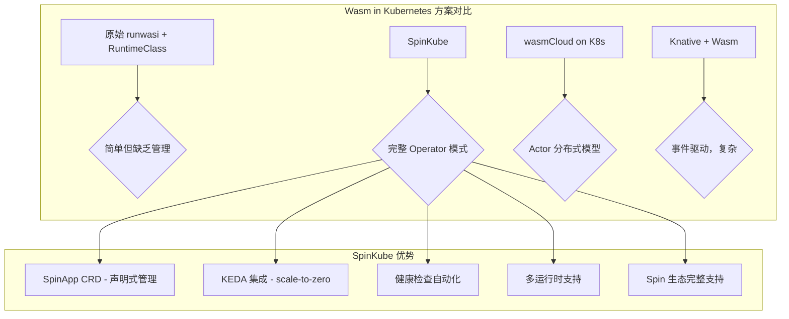
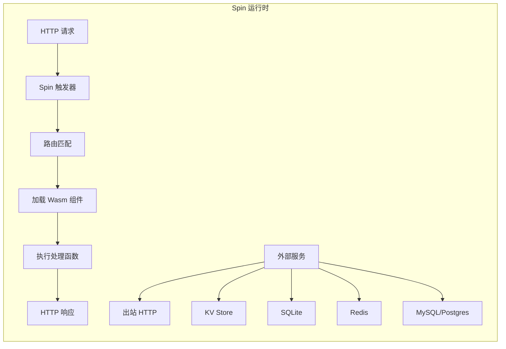
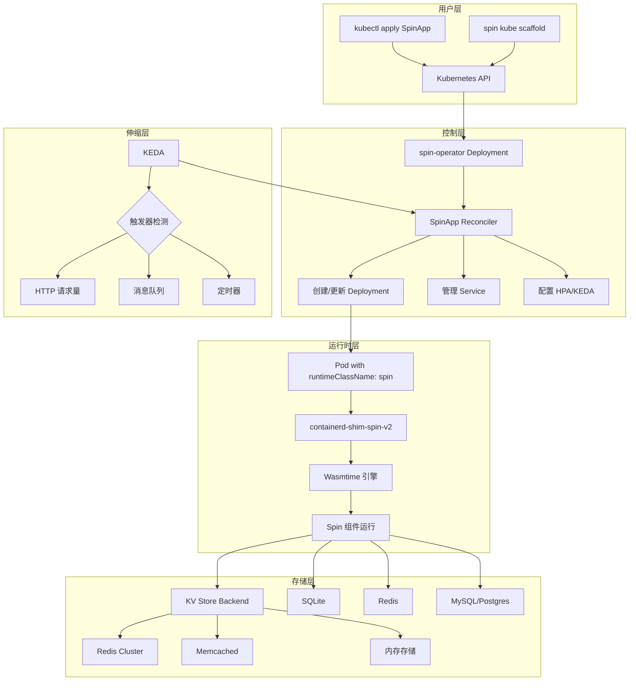
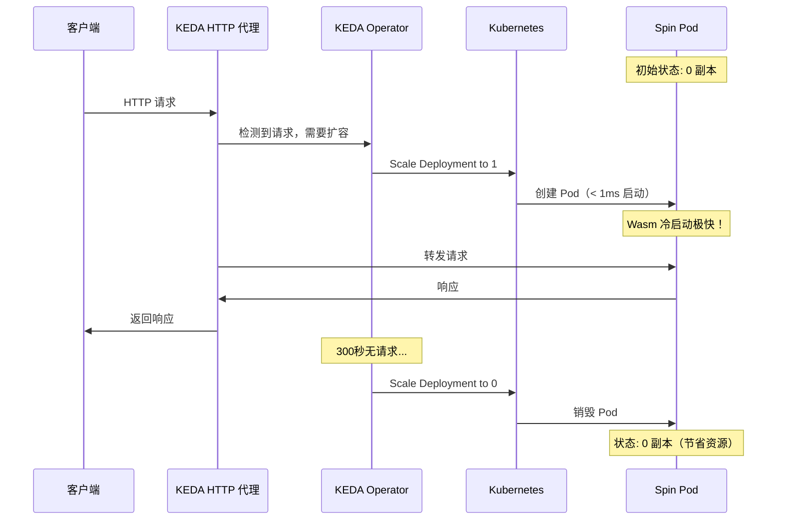
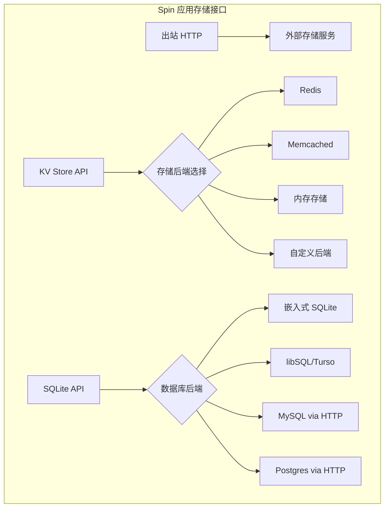

# SpinKube 框架实践
# SpinKube Framework Practice

<!-- chunk: 目录 / Table of Contents -->## 目录 / Table of Contents

1. [SpinKube 概述](#1-spinkube-概述)
2. [Spin 应用模型](#2-spin-应用模型)
3. [SpinKube 架构](#3-spinkube-架构)
4. [SpinApp CRD](#4-spinapp-crd)
5. [安装与配置](#5-安装与配置)
6. [HTTP 触发器](#6-http-触发器)
7. [KEDA 集成与 Scale-to-Zero](#7-keda-集成与-scale-to-zero)
8. [存储系统集成](#8-存储系统集成)
9. [Redis 与 KV Store](#9-redis-与-kv-store)
10. [SQLite 集成](#10-sqlite-集成)
11. [高级配置与安全](#11-高级配置与安全)
12. [监控与可观测性](#12-监控与可观测性)

---

<!-- chunk: 1. SpinKube 概述 -->## 1. SpinKube 概述

#<!-- chunk: 1.1 什么是 SpinKube / What is SpinKube -->## 1.1 什么是 SpinKube / What is SpinKube

SpinKube 是基于 Fermyon Spin 的 Kubernetes 原生 WebAssembly 运行时项目，是 CNCF Sandbox 项目。它将 Spin 的开发者友好体验带入 Kubernetes，实现了 Wasm Serverless 工作负载的云原生部署：

```
SpinKube 项目组成
github.com/spinkube
│
├── spin-operator        # Kubernetes Operator（核心）
│   ├── SpinApp CRD      # 应用自定义资源
│   ├── SpinAppExec CRD  # 执行配置
│   └── Reconciler       # 协调控制器
│
├── containerd-shim-spin # containerd Spin shim
│   └── spin.v2          # Spin v2 运行时
│
├── spin-runtime-class   # RuntimeClass 管理
│   └── Helm Chart
│
└── docs                 # 文档
```

#<!-- chunk: 1.2 SpinKube vs 其他方案 / SpinKube vs Alternatives -->## 1.2 SpinKube vs 其他方案 / SpinKube vs Alternatives



#<!-- chunk: 1.3 核心特性 / Core Features -->## 1.3 核心特性 / Core Features

| 特性 | 描述 |
|------|------|
| **SpinApp CRD** | Kubernetes 原生 Spin 应用管理 |
| **Scale-to-Zero** | 通过 KEDA 实现真正的 0 副本伸缩 |
| **OCI 镜像** | 标准 OCI 镜像分发 Wasm 模块 |
| **多触发器** | HTTP、消息队列、定时器等触发方式 |
| **KV/SQLite** | 内置分布式存储支持 |
| **TLS 终止** | 内置 HTTPS 支持 |
| **健康检查** | 自动 Liveness/Readiness 探针 |
| **灰度发布** | 支持 Canary/Blue-Green 部署 |

---

<!-- chunk: 2. Spin 应用模型 -->## 2. Spin 应用模型

#<!-- chunk: 2.1 Spin 框架概述 / Spin Framework Overview -->## 2.1 Spin 框架概述 / Spin Framework Overview

Spin 是 Fermyon 开发的 WebAssembly Serverless 框架，专注于快速构建 HTTP 微服务：



#<!-- chunk: 2.2 spin.toml 应用清单 / Application Manifest -->## 2.2 spin.toml 应用清单 / Application Manifest

```toml
# spin.toml - Spin 应用配置清单
spin_manifest_version = 2

[application]
name = "my-wasm-api"
version = "1.2.0"
description = "云原生 WebAssembly API 服务"
authors = ["developer@example.com"]

# 全局触发器配置
[application.trigger.http]
base = "/"

# 变量定义（来自环境或 Kubernetes Secret）
[variables]
db_url = { required = true }
api_key = { required = true }
log_level = { default = "info" }
cache_ttl = { default = "300" }

# 组件 1: 用户 API
[[trigger.http]]
route = "/api/v1/users/..."
component = "users-handler"

[component.users-handler]
source = "target/wasm32-wasi/release/users_handler.wasm"
description = "用户管理 API"

[component.users-handler.build]
command = "cargo build --target wasm32-wasi --release"
workdir = "users"
watch = ["src/**/*.rs", "Cargo.toml"]

# 允许的出站 HTTP 域名
[component.users-handler.trigger]
executor = { type = "wagi" }  # 也支持 spin（默认）

[component.users-handler.allowed_outbound_hosts]
hosts = [
  "https://auth-service.internal",
  "https://email.sendgrid.com"
]

# KV Store 访问
[component.users-handler.key_value_stores]
stores = ["default", "sessions"]

# SQLite 数据库访问
[component.users-handler.sqlite_databases]
databases = ["users_db"]

# 变量访问
[component.users-handler.variables]
db_url = "{{ db_url }}"
api_key = "{{ api_key }}"

# 组件 2: 健康检查
[[trigger.http]]
route = "/health"
component = "health"

[component.health]
source = "target/wasm32-wasi/release/health.wasm"
description = "健康检查端点"

# 组件 3: 后台任务（Redis 触发器）
[[trigger.redis]]
channel = "task-queue"
component = "task-processor"

[component.task-processor]
source = "target/wasm32-wasi/release/task_processor.wasm"
description = "异步任务处理"

[component.task-processor.allowed_outbound_hosts]
hosts = ["https://api.external-service.com"]
```

#<!-- chunk: 2.3 Rust Spin 应用开发 / Rust Spin Development -->## 2.3 Rust Spin 应用开发 / Rust Spin Development

```rust
// Cargo.toml
[package]
name = "users-handler"
version = "1.0.0"
edition = "2021"

[lib]
crate-type = ["cdylib"]

[dependencies]
spin-sdk = "3.0"
serde = { version = "1", features = ["derive"] }
serde_json = "1"
anyhow = "1"
```

```rust
// src/lib.rs - 完整 Spin HTTP 处理器
use anyhow::Result;
use spin_sdk::{
    http::{
        IntoResponse, Method, Params, Request, Response, Router
    },
    http_component,
    key_value::Store,
    sqlite::{Connection, QueryResult, Value},
    variables,
};
use serde::{Deserialize, Serialize};

#[derive(Debug, Serialize, Deserialize, Clone)]
struct User {
    id: u64,
    username: String,
    email: String,
    created_at: String,
}

#[derive(Debug, Deserialize)]
struct CreateUserRequest {
    username: String,
    email: String,
}

#[derive(Debug, Serialize)]
struct ApiResponse<T> {
    success: bool,
    data: Option<T>,
    error: Option<String>,
    total: Option<usize>,
}

// Spin HTTP 组件入口
#[http_component]
fn handle_request(req: Request) -> Result<impl IntoResponse> {
    let mut router = Router::new();
    
    // 注册路由
    router.get("/api/v1/users", list_users);
    router.get("/api/v1/users/:id", get_user);
    router.post("/api/v1/users", create_user);
    router.put("/api/v1/users/:id", update_user);
    router.delete("/api/v1/users/:id", delete_user);
    
    // 中间件：日志记录
    println!("[{}] {} {}", 
        chrono_like_timestamp(),
        req.method(), 
        req.uri().path()
    );
    
    Ok(router.handle(req))
}

// 获取用户列表
fn list_users(_req: Request, _params: Params) -> Result<impl IntoResponse> {
    let conn = Connection::open_default()?;
    
    let result = conn.execute(
        "SELECT id, username, email, created_at FROM users ORDER BY id DESC LIMIT 100",
        &[],
    )?;
    
    let users = rows_to_users(result);
    
    // 缓存到 KV Store
    let store = Store::open_default()?;
    let cache_key = "users:list";
    let cached = serde_json::to_vec(&users)?;
    store.set(cache_key, &cached)?;
    
    Ok(json_response(200, ApiResponse {
        success: true,
        data: Some(users.clone()),
        error: None,
        total: Some(users.len()),
    }))
}

// 获取单个用户
fn get_user(_req: Request, params: Params) -> Result<impl IntoResponse> {
    let id: u64 = params.get("id")
        .and_then(|s| s.parse().ok())
        .ok_or_else(|| anyhow::anyhow!("无效的用户 ID"))?;
    
    // 先检查 KV 缓存
    let store = Store::open_default()?;
    let cache_key = format!("user:{}", id);
    
    if let Some(cached) = store.get(&cache_key)? {
        if let Ok(user) = serde_json::from_slice::<User>(&cached) {
            return Ok(json_response(200, ApiResponse {
                success: true,
                data: Some(user),
                error: None,
                total: None,
            }));
        }
    }
    
    // 从数据库查询
    let conn = Connection::open_default()?;
    let result = conn.execute(
        "SELECT id, username, email, created_at FROM users WHERE id = ?",
        &[Value::Integer(id as i64)],
    )?;
    
    let users = rows_to_users(result);
    
    match users.into_iter().next() {
        Some(user) => {
            // 缓存结果
            let cached = serde_json::to_vec(&user)?;
            store.set(&cache_key, &cached)?;
            
            Ok(json_response(200, ApiResponse {
                success: true,
                data: Some(user),
                error: None,
                total: None,
            }))
        }
        None => Ok(json_response(404, ApiResponse::<User> {
            success: false,
            data: None,
            error: Some(format!("用户 {} 不存在", id)),
            total: None,
        })),
    }
}

// 创建用户
fn create_user(req: Request, _params: Params) -> Result<impl IntoResponse> {
    // 解析请求体
    let body = req.body();
    let create_req: CreateUserRequest = serde_json::from_slice(body)
        .map_err(|e| anyhow::anyhow!("无效的请求体: {}", e))?;
    
    // 验证
    if create_req.username.is_empty() {
        return Ok(json_response(400, ApiResponse::<User> {
            success: false,
            data: None,
            error: Some("用户名不能为空".to_string()),
            total: None,
        }));
    }
    
    // 获取 API 密钥（来自 Spin 变量）
    let _api_key = variables::get("api_key")?;
    
    // 插入数据库
    let conn = Connection::open_default()?;
    conn.execute(
        "INSERT INTO users (username, email, created_at) VALUES (?, ?, datetime('now'))",
        &[
            Value::Text(create_req.username.clone()),
            Value::Text(create_req.email.clone()),
        ],
    )?;
    
    // 获取新用户 ID
    let id_result = conn.execute("SELECT last_insert_rowid()", &[])?;
    let id = id_result.rows.first()
        .and_then(|r| r.first())
        .and_then(|v| if let Value::Integer(n) = v { Some(*n as u64) } else { None })
        .unwrap_or(0);
    
    let user = User {
        id,
        username: create_req.username,
        email: create_req.email,
        created_at: "now".to_string(),
    };
    
    // 缓存新用户
    let store = Store::open_default()?;
    store.set(
        &format!("user:{}", id),
        &serde_json::to_vec(&user)?,
    )?;
    
    Ok(json_response(201, ApiResponse {
        success: true,
        data: Some(user),
        error: None,
        total: None,
    }))
}

// 更新用户
fn update_user(req: Request, params: Params) -> Result<impl IntoResponse> {
    let id: u64 = params.get("id")
        .and_then(|s| s.parse().ok())
        .ok_or_else(|| anyhow::anyhow!("无效的用户 ID"))?;
    
    let body = req.body();
    let update_req: CreateUserRequest = serde_json::from_slice(body)?;
    
    let conn = Connection::open_default()?;
    conn.execute(
        "UPDATE users SET username = ?, email = ? WHERE id = ?",
        &[
            Value::Text(update_req.username.clone()),
            Value::Text(update_req.email.clone()),
            Value::Integer(id as i64),
        ],
    )?;
    
    // 清除缓存
    let store = Store::open_default()?;
    store.delete(&format!("user:{}", id))?;
    store.delete("users:list")?;
    
    let user = User {
        id,
        username: update_req.username,
        email: update_req.email,
        created_at: "updated".to_string(),
    };
    
    Ok(json_response(200, ApiResponse {
        success: true,
        data: Some(user),
        error: None,
        total: None,
    }))
}

// 删除用户
fn delete_user(_req: Request, params: Params) -> Result<impl IntoResponse> {
    let id: u64 = params.get("id")
        .and_then(|s| s.parse().ok())
        .ok_or_else(|| anyhow::anyhow!("无效的用户 ID"))?;
    
    let conn = Connection::open_default()?;
    conn.execute(
        "DELETE FROM users WHERE id = ?",
        &[Value::Integer(id as i64)],
    )?;
    
    // 清除缓存
    let store = Store::open_default()?;
    store.delete(&format!("user:{}", id))?;
    store.delete("users:list")?;
    
    Ok(Response::builder()
        .status(204)
        .body(())
        .build())
}

// 辅助函数：行转用户
fn rows_to_users(result: QueryResult) -> Vec<User> {
    result.rows.into_iter().filter_map(|row| {
        if row.len() >= 4 {
            Some(User {
                id: if let Value::Integer(n) = &row[0] { *n as u64 } else { 0 },
                username: if let Value::Text(s) = &row[1] { s.clone() } else { String::new() },
                email: if let Value::Text(s) = &row[2] { s.clone() } else { String::new() },
                created_at: if let Value::Text(s) = &row[3] { s.clone() } else { String::new() },
            })
        } else {
            None
        }
    }).collect()
}

// JSON 响应构建
fn json_response<T: Serialize>(status: u16, body: T) -> Response {
    let json = serde_json::to_vec(&body).unwrap_or_default();
    Response::builder()
        .status(status)
        .header("Content-Type", "application/json")
        .header("X-Powered-By", "SpinKube")
        .body(json)
        .build()
}

fn chrono_like_timestamp() -> String {
    "2025-03-04T00:00:00Z".to_string() // 实际应该使用 WASI 时钟
}
```

---

<!-- chunk: 3. SpinKube 架构 -->## 3. SpinKube 架构

#<!-- chunk: 3.1 整体架构 / Overall Architecture -->## 3.1 整体架构 / Overall Architecture



#<!-- chunk: 3.2 spin-operator 控制器 / spin-operator Controller -->## 3.2 spin-operator 控制器 / spin-operator Controller

```
spin-operator 工作流程

1. Watch SpinApp CRD 变更
   ↓
2. 验证 SpinApp 规范
   ↓
3. 拉取 OCI Wasm 镜像（获取 spin.toml 和 .wasm 文件）
   ↓
4. 生成 Kubernetes 资源：
   ├── Deployment（指定 runtimeClassName: spin）
   ├── Service
   ├── ConfigMap（spin.toml）
   ├── Secret（敏感变量）
   └── ScaledObject/HPA（如果配置了自动伸缩）
   ↓
5. 持续协调（Reconcile）：
   ├── 检查实际状态 vs 期望状态
   ├── 更新 SpinApp Status
   └── 处理错误和重试
```

```go
// spin-operator Reconciler 核心逻辑（简化）
package controller

import (
    "context"
    "fmt"
    
    spinv1alpha1 "github.com/spinkube/spin-operator/api/v1alpha1"
    appsv1 "k8s.io/api/apps/v1"
    corev1 "k8s.io/api/core/v1"
    metav1 "k8s.io/apimachinery/pkg/apis/meta/v1"
    "sigs.k8s.io/controller-runtime/pkg/client"
    "sigs.k8s.io/controller-runtime/pkg/reconcile"
)

type SpinAppReconciler struct {
    client.Client
    SpinImageCache *ImageCache
}

func (r *SpinAppReconciler) Reconcile(
    ctx context.Context,
    req reconcile.Request,
) (reconcile.Result, error) {
    
    // 获取 SpinApp 资源
    spinApp := &spinv1alpha1.SpinApp{}
    if err := r.Get(ctx, req.NamespacedName, spinApp); err != nil {
        return reconcile.Result{}, client.IgnoreNotFound(err)
    }
    
    // 确保 Deployment 存在
    if err := r.reconcileDeployment(ctx, spinApp); err != nil {
        return reconcile.Result{}, fmt.Errorf("协调 Deployment 失败: %w", err)
    }
    
    // 确保 Service 存在
    if err := r.reconcileService(ctx, spinApp); err != nil {
        return reconcile.Result{}, fmt.Errorf("协调 Service 失败: %w", err)
    }
    
    // 配置自动伸缩
    if spinApp.Spec.EnableAutoscaling {
        if err := r.reconcileKEDA(ctx, spinApp); err != nil {
            return reconcile.Result{}, fmt.Errorf("协调 KEDA 失败: %w", err)
        }
    }
    
    // 更新状态
    spinApp.Status.ReadyReplicas = r.getReadyReplicas(ctx, spinApp)
    spinApp.Status.Phase = "Ready"
    r.Status().Update(ctx, spinApp)
    
    return reconcile.Result{}, nil
}

func (r *SpinAppReconciler) reconcileDeployment(
    ctx context.Context,
    spinApp *spinv1alpha1.SpinApp,
) error {
    
    deployment := &appsv1.Deployment{
        ObjectMeta: metav1.ObjectMeta{
            Name:      spinApp.Name,
            Namespace: spinApp.Namespace,
        },
        Spec: appsv1.DeploymentSpec{
            Replicas: &spinApp.Spec.Replicas,
            Selector: &metav1.LabelSelector{
                MatchLabels: map[string]string{
                    "app": spinApp.Name,
                },
            },
            Template: corev1.PodTemplateSpec{
                ObjectMeta: metav1.ObjectMeta{
                    Labels: spinApp.Spec.PodLabels,
                    Annotations: map[string]string{
                        "module.wasm.image/variant": "spin",
                    },
                },
                Spec: corev1.PodSpec{
                    RuntimeClassName: &spinApp.Spec.RuntimeClassName,
                    Containers: []corev1.Container{
                        {
                            Name:  spinApp.Name,
                            Image: spinApp.Spec.Image,
                            Env:   spinApp.Spec.Env,
                            Resources: spinApp.Spec.Resources,
                            Ports: []corev1.ContainerPort{
                                {ContainerPort: 80},
                            },
                        },
                    },
                },
            },
        },
    }
    
    // CreateOrUpdate 模式
    return r.CreateOrUpdate(ctx, deployment)
}
```

---

<!-- chunk: 4. SpinApp CRD -->## 4. SpinApp CRD

#<!-- chunk: 4.1 SpinApp 资源定义 / SpinApp Resource Definition -->## 4.1 SpinApp 资源定义 / SpinApp Resource Definition

```yaml
# SpinApp CRD 完整示例
apiVersion: core.spinoperator.dev/v1alpha1
kind: SpinApp
metadata:
  name: users-api
  namespace: production
  labels:
    app: users-api
    team: backend
    version: v2.1.0
  annotations:
    description: "用户管理 API 服务"
spec:
  # OCI 镜像（包含 Wasm 模块和 spin.toml）
  image: "ghcr.io/myorg/users-api:v2.1.0"
  
  # 使用的运行时类
  executor: containerd-shim-spin
  
  # 副本数（如果启用自动伸缩，这是初始值）
  replicas: 3
  
  # 启用自动伸缩
  enableAutoscaling: true
  
  # 环境变量
  env:
  - name: SPIN_LOG_LEVEL
    value: "info"
  - name: DB_URL
    valueFrom:
      secretKeyRef:
        name: db-secrets
        key: url
  - name: REDIS_URL
    valueFrom:
      configMapKeyRef:
        name: infra-config
        key: redis_url
  
  # 资源配置
  resources:
    requests:
      memory: "16Mi"
      cpu: "50m"
    limits:
      memory: "128Mi"
      cpu: "500m"
  
  # 健康检查
  livenessProbe:
    httpGet:
      path: /health
      port: 80
    initialDelaySeconds: 3
    periodSeconds: 10
  
  readinessProbe:
    httpGet:
      path: /ready
      port: 80
    initialDelaySeconds: 1
    periodSeconds: 5
  
  # 存储卷
  volumes:
  - name: config-data
    configMap:
      name: app-config
  
  volumeMounts:
  - name: config-data
    mountPath: /config
  
  # Pod 注解
  podAnnotations:
    prometheus.io/scrape: "true"
    prometheus.io/port: "9090"
  
  # 节点选择
  nodeSelector:
    runtime.wasm/enabled: "true"
  
  # 容忍
  tolerations:
  - key: "runtime.wasm/enabled"
    operator: "Exists"
    effect: "NoSchedule"

# 状态（由 operator 自动维护）
status:
  conditions:
  - type: Ready
    status: "True"
    lastTransitionTime: "2025-03-04T00:00:00Z"
    reason: "SpinAppReady"
    message: "All 3 replicas are ready"
  activeReplicas: 3
  readyReplicas: 3
  phase: "Ready"
```

#<!-- chunk: 4.2 SpinApp 自动伸缩配置 / Autoscaling Configuration -->## 4.2 SpinApp 自动伸缩配置 / Autoscaling Configuration

```yaml
# 结合 KEDA 的 SpinApp
apiVersion: core.spinoperator.dev/v1alpha1
kind: SpinApp
metadata:
  name: api-autoscale
  namespace: production
spec:
  image: "ghcr.io/myorg/api:latest"
  executor: containerd-shim-spin
  replicas: 1      # 初始副本（KEDA 可以缩到 0）
  enableAutoscaling: true
  
  # 自动伸缩配置
  autoscalingConfig:
    minReplicas: 0   # 允许缩到 0！
    maxReplicas: 50
    
    # 伸缩触发器
    triggers:
    # HTTP 请求触发器（基于 Prometheus 指标）
    - type: prometheus
      metadata:
        serverAddress: http://prometheus.monitoring.svc:9090
        metricName: spin_requests_per_second
        query: |
          sum(rate(spin_http_requests_total{app="api-autoscale"}[1m]))
        threshold: "50"
    
    # 冷却时间配置
    cooldownPeriod: 300   # 5 分钟无请求后缩容到 0
    pollingInterval: 10   # 每 10 秒检查一次
```

#<!-- chunk: 4.3 SpinAppExec CRD / Execution Configuration -->## 4.3 SpinAppExec CRD / Execution Configuration

```yaml
# SpinAppExec - 为 SpinApp 定义执行环境
apiVersion: core.spinoperator.dev/v1alpha1
kind: SpinAppExec
metadata:
  name: production-exec
  namespace: production
spec:
  # 关联的 SpinApp
  spinAppRef:
    name: users-api
  
  # Executor 配置
  executor:
    name: containerd-shim-spin
    runtimeClassName: wasmtime-spin
    
    # Spin 特定配置
    spinConfig:
      # 允许访问的外部服务
      allowedOutboundHosts:
      - "https://auth.internal.example.com"
      - "https://api.sendgrid.com"
      
      # KV Store 后端配置
      keyValueStores:
      - label: "default"
        provider:
          type: redis
          redisUrl: "redis://redis.default.svc:6379"
      
      # SQLite 数据库配置
      sqliteDatabases:
      - label: "users_db"
        provider:
          type: libsql
          url: "libsql://users.turso.io"
          token:
            secretKeyRef:
              name: turso-secret
              key: token
```

---

<!-- chunk: 5. 安装与配置 -->## 5. 安装与配置

#<!-- chunk: 5.1 使用 Helm 安装 SpinKube / Install with Helm -->## 5.1 使用 Helm 安装 SpinKube / Install with Helm

```bash
# 添加 SpinKube Helm 仓库
helm repo add spinkube https://spinkube.dev/helm-charts
helm repo update

# 安装 spin-operator
helm upgrade --install spin-operator \
  spinkube/spin-operator \
  --namespace spin-operator \
  --create-namespace \
  --version 0.3.0 \
  --wait

# 验证安装
kubectl -n spin-operator get pods
# NAME                                    READY   STATUS    RESTARTS
# spin-operator-controller-manager-xxx   1/1     Running   0

# 安装 CRD
kubectl apply -f https://github.com/spinkube/spin-operator/releases/download/v0.3.0/spin-operator.crds.yaml

# 验证 CRD
kubectl get crd | grep spin
# spinapps.core.spinoperator.dev
# spinappexecs.core.spinoperator.dev
```

```bash
# 安装 containerd-shim-spin（需要在每个工作节点执行）
SHIM_VERSION="v0.15.1"

# 使用 DaemonSet 自动安装（推荐）
kubectl apply -f - <<EOF
apiVersion: apps/v1
kind: DaemonSet
metadata:
  name: spin-shim-installer
  namespace: kube-system
spec:
  selector:
    matchLabels:
      app: spin-shim-installer
  template:
    metadata:
      labels:
        app: spin-shim-installer
    spec:
      hostPID: true
      initContainers:
      - name: installer
        image: ghcr.io/spinkube/containerd-shim-spin:${SHIM_VERSION}
        command: ["/bin/sh", "-c"]
        args:
        - |
          cp /spin-shim/containerd-shim-spin-v2 /host/usr/local/bin/
          chmod +x /host/usr/local/bin/containerd-shim-spin-v2
          echo "Spin shim 安装完成"
        volumeMounts:
        - name: host-bin
          mountPath: /host/usr/local/bin
        securityContext:
          privileged: true
      containers:
      - name: pause
        image: gcr.io/google_containers/pause:3.6
      volumes:
      - name: host-bin
        hostPath:
          path: /usr/local/bin
      tolerations:
      - operator: Exists
EOF
```

#<!-- chunk: 5.2 配置 RuntimeClass / Configure RuntimeClass -->## 5.2 配置 RuntimeClass / Configure RuntimeClass

```bash
# 使用官方 RuntimeClass 配置
kubectl apply -f - <<EOF
apiVersion: node.k8s.io/v1
kind: RuntimeClass
metadata:
  name: wasmtime-spin
handler: spin
scheduling:
  nodeClassification:
    tolerations:
    - effect: NoSchedule
      key: spin.fermyon.com/enabled
      operator: Exists
    nodeSelector:
      matchLabels:
        spin.fermyon.com/enabled: "true"
EOF

# 标记节点
kubectl label node worker-1 spin.fermyon.com/enabled=true

# 验证
kubectl run test-spin \
  --image=ghcr.io/fermyon/spin-wasm-hello:latest \
  --overrides='{"spec":{"runtimeClassName":"wasmtime-spin"}}' \
  --restart=Never

kubectl get pod test-spin
kubectl delete pod test-spin
```

#<!-- chunk: 5.3 安装 KEDA / Install KEDA -->## 5.3 安装 KEDA / Install KEDA

```bash
# 使用 Helm 安装 KEDA
helm repo add kedacore https://kedacore.github.io/charts
helm repo update

helm install keda kedacore/keda \
  --namespace keda \
  --create-namespace \
  --version 2.13.0

# 验证 KEDA 安装
kubectl -n keda get pods
# NAME                                      READY   STATUS
# keda-operator-xxx                         2/2     Running
# keda-operator-metrics-apiserver-xxx       1/1     Running

# 安装 KEDA HTTP Add-on（可选，用于 HTTP scale-to-zero）
helm install keda-add-ons-http \
  kedacore/keda-add-ons-http \
  --namespace keda

# 验证
kubectl -n keda get pods | grep http
```

---

<!-- chunk: 6. HTTP 触发器 -->## 6. HTTP 触发器

#<!-- chunk: 6.1 HTTP 路由配置 / HTTP Routing -->## 6.1 HTTP 路由配置 / HTTP Routing

```toml
# spin.toml - 复杂 HTTP 路由示例
spin_manifest_version = 2

[application]
name = "advanced-api"
version = "2.0.0"

[application.trigger.http]
base = "/api/v2"

# 精确路径匹配
[[trigger.http]]
route = "/ping"
component = "ping"

# 通配符路由
[[trigger.http]]
route = "/users/..."
component = "users"

# 路径参数
[[trigger.http]]
route = "/products/:id"
component = "product-detail"

# 管理接口
[[trigger.http]]
route = "/admin/..."
component = "admin"

[component.admin]
source = "admin.wasm"
[component.admin.trigger]
# 只允许 POST 和 DELETE
executor = { type = "http" }
```

#<!-- chunk: 6.2 HTTP 中间件模式 / HTTP Middleware Pattern -->## 6.2 HTTP 中间件模式 / HTTP Middleware Pattern

```rust
// src/lib.rs - HTTP 中间件实现
use spin_sdk::http::{
    IntoResponse, Request, Response,
};
use spin_sdk::http_component;
use anyhow::Result;

// 中间件链
struct MiddlewareChain {
    middlewares: Vec<Box<dyn Middleware>>,
}

trait Middleware {
    fn handle(&self, req: &Request, next: &dyn Fn(&Request) -> Response) -> Response;
}

// 认证中间件
struct AuthMiddleware {
    api_key: String,
}

impl Middleware for AuthMiddleware {
    fn handle(&self, req: &Request, next: &dyn Fn(&Request) -> Response) -> Response {
        // 检查认证 Header
        let auth = req.header("X-API-Key")
            .and_then(|v| v.as_str());
        
        if auth != Some(self.api_key.as_str()) {
            return Response::builder()
                .status(401)
                .header("Content-Type", "application/json")
                .body(r#"{"error":"未授权"}"#)
                .build();
        }
        
        next(req)
    }
}

// 限流中间件（使用 KV Store 计数）
struct RateLimitMiddleware {
    max_requests: u32,
    window_seconds: u64,
}

impl Middleware for RateLimitMiddleware {
    fn handle(&self, req: &Request, next: &dyn Fn(&Request) -> Response) -> Response {
        use spin_sdk::key_value::Store;
        
        // 获取客户端 IP
        let ip = req.header("X-Forwarded-For")
            .and_then(|v| v.as_str())
            .unwrap_or("unknown");
        
        let store = Store::open_default().unwrap();
        let key = format!("ratelimit:{}:{}", ip, 
            current_window(self.window_seconds));
        
        // 获取当前计数
        let count: u32 = store.get(&key)
            .ok()
            .flatten()
            .and_then(|v| String::from_utf8(v).ok())
            .and_then(|s| s.parse().ok())
            .unwrap_or(0);
        
        if count >= self.max_requests {
            return Response::builder()
                .status(429)
                .header("X-RateLimit-Limit", self.max_requests.to_string())
                .header("X-RateLimit-Remaining", "0")
                .body(r#"{"error":"请求过于频繁"}"#)
                .build();
        }
        
        // 增加计数
        store.set(&key, (count + 1).to_string().as_bytes()).ok();
        
        let mut response = next(req);
        // 在响应中添加限流 Header
        response
    }
}

// CORS 中间件
struct CorsMiddleware {
    allowed_origins: Vec<String>,
}

impl Middleware for CorsMiddleware {
    fn handle(&self, req: &Request, next: &dyn Fn(&Request) -> Response) -> Response {
        // 处理 OPTIONS 预检请求
        if req.method() == spin_sdk::http::Method::Options {
            return Response::builder()
                .status(204)
                .header("Access-Control-Allow-Origin", "*")
                .header("Access-Control-Allow-Methods", "GET, POST, PUT, DELETE")
                .header("Access-Control-Allow-Headers", "Content-Type, Authorization, X-API-Key")
                .header("Access-Control-Max-Age", "86400")
                .body(())
                .build();
        }
        
        let mut response = next(req);
        // 添加 CORS Header
        response
    }
}

fn current_window(window_seconds: u64) -> u64 {
    // 简化实现（实际应使用 WASI 时钟）
    0 / window_seconds
}

#[http_component]
fn handle_request(req: Request) -> Result<impl IntoResponse> {
    // 获取认证密钥
    let api_key = spin_sdk::variables::get("api_key")
        .unwrap_or_default();
    
    // 认证检查
    let auth = req.header("X-API-Key")
        .and_then(|v| v.as_str().map(|s| s.to_string()));
    
    if auth.as_deref() != Some(&api_key) && !req.uri().path().contains("/public") {
        return Ok(Response::builder()
            .status(401)
            .body(r#"{"error":"未授权","code":401}"#)
            .build());
    }
    
    // 路由到处理函数
    let path = req.uri().path();
    let response = match (req.method(), path) {
        (spin_sdk::http::Method::Get, "/api/v2/ping") => {
            Response::builder()
                .status(200)
                .body(r#"{"status":"ok","runtime":"SpinKube"}"#)
                .build()
        }
        _ => {
            Response::builder()
                .status(404)
                .body(r#"{"error":"路由未找到"}"#)
                .build()
        }
    };
    
    Ok(response)
}
```

#<!-- chunk: 6.3 出站 HTTP 请求 / Outbound HTTP -->## 6.3 出站 HTTP 请求 / Outbound HTTP

```rust
// Spin 出站 HTTP 客户端
use spin_sdk::http::{IntoResponse, Request, Response};
use spin_sdk::http_component;
use spin_sdk::http_client;
use anyhow::Result;

#[http_component]
fn handle_request(req: Request) -> Result<impl IntoResponse> {
    // 出站 HTTP GET 请求
    let response = http_client::send(
        Request::builder()
            .method("GET")
            .uri("https://api.github.com/repos/spinkube/spin-operator")
            .header("User-Agent", "SpinKube-App/1.0")
            .header("Accept", "application/vnd.github.v3+json")
            .body(())?
    )?;
    
    let status = response.status();
    let body = response.into_body();
    
    Ok(Response::builder()
        .status(200)
        .header("Content-Type", "application/json")
        .body(format!(
            r#"{{"upstream_status": {}, "data": {}}}"#,
            status,
            String::from_utf8_lossy(&body)
        ))
        .build())
}
```

---

<!-- chunk: 7. KEDA 集成与 Scale-to-Zero -->## 7. KEDA 集成与 Scale-to-Zero

#<!-- chunk: 7.1 Scale-to-Zero 原理 / Scale-to-Zero Principle -->## 7.1 Scale-to-Zero 原理 / Scale-to-Zero Principle



#<!-- chunk: 7.2 KEDA ScaledObject 配置 / ScaledObject Configuration -->## 7.2 KEDA ScaledObject 配置 / ScaledObject Configuration

```yaml
# HTTP 触发的 scale-to-zero
apiVersion: keda.sh/v1alpha1
kind: ScaledObject
metadata:
  name: users-api-scaler
  namespace: production
  annotations:
    # KEDA Annotations
    scaledobject.keda.sh/transfer-hpa-ownership: "true"
spec:
  scaleTargetRef:
    apiVersion: apps/v1
    kind: Deployment
    name: users-api
  
  # 允许缩到 0
  minReplicaCount: 0
  maxReplicaCount: 100
  
  # 伸缩策略
  pollingInterval: 10      # 每 10 秒评估
  cooldownPeriod: 300      # 5 分钟后缩到 0
  
  # 预扩容时间窗口（减少冷启动影响）
  initialCooldownPeriod: 0
  
  # 高级伸缩配置
  advanced:
    # 扩容快，缩容慢
    scalingModifiers:
      formula: "max(target * 1.5, 1)"
    
    horizontalPodAutoscalerConfig:
      behavior:
        scaleUp:
          stabilizationWindowSeconds: 0  # 立即扩容
          policies:
          - type: Pods
            value: 10
            periodSeconds: 10
        scaleDown:
          stabilizationWindowSeconds: 300  # 5 分钟稳定窗口再缩容
          policies:
          - type: Percent
            value: 10
            periodSeconds: 60
  
  triggers:
  # Prometheus 指标触发
  - type: prometheus
    metadata:
      serverAddress: http://prometheus.monitoring.svc:9090
      metricName: spin_active_requests
      query: |
        sum(spin_http_active_requests{app="users-api"}) or vector(0)
      threshold: "5"          # 每实例最多 5 个并发请求
      activationThreshold: "1" # 有 1 个请求就激活
  
  # CPU 触发（备用）
  - type: cpu
    metricType: Utilization
    metadata:
      value: "70"  # CPU 利用率 70% 时扩容

---
# HTTPScaledObject（KEDA HTTP Add-on）- 更简单的 HTTP scale-to-zero
apiVersion: http.keda.sh/v1alpha1
kind: HTTPScaledObject
metadata:
  name: users-api-http-scaler
  namespace: production
spec:
  hosts:
  - users-api.production.svc.cluster.local
  - users.example.com  # 外部域名
  
  # 每实例最多处理的挂起请求数
  targetPendingRequests: 100
  
  scaleTargetRef:
    deployment: users-api
    service: users-api
    port: 80
  
  replicas:
    min: 0
    max: 50
```

#<!-- chunk: 7.3 预扩容与预热 / Pre-scaling and Warmup -->## 7.3 预扩容与预热 / Pre-scaling and Warmup

```yaml
# CronJob 在高峰前预热 Wasm 实例
apiVersion: batch/v1
kind: CronJob
metadata:
  name: spin-warmup
  namespace: production
spec:
  # 每天早上 8:50 预热（9:00 高峰前 10 分钟）
  schedule: "50 8 * * 1-5"
  jobTemplate:
    spec:
      template:
        spec:
          containers:
          - name: warmup
            image: curlimages/curl:latest
            command:
            - sh
            - -c
            - |
              # 提前发送请求唤醒 Wasm 实例
              for i in $(seq 1 5); do
                curl -s http://users-api.production.svc/health
                sleep 1
              done
              echo "预热完成"
          restartPolicy: OnFailure

---
# 使用 KEDA Cron 触发器实现定时预扩容
apiVersion: keda.sh/v1alpha1
kind: ScaledObject
metadata:
  name: users-api-cron-scaler
spec:
  scaleTargetRef:
    name: users-api
  minReplicaCount: 0
  maxReplicaCount: 20
  triggers:
  - type: cron
    metadata:
      timezone: "Asia/Shanghai"
      start: "50 8 * * 1-5"  # 工作日 8:50 扩容
      end: "0 22 * * 1-5"    # 工作日 22:00 缩容
      desiredReplicas: "5"   # 维持 5 个实例
  
  # 同时保留 Prometheus 触发器
  - type: prometheus
    metadata:
      serverAddress: http://prometheus.monitoring.svc:9090
      metricName: spin_requests
      query: rate(spin_http_requests_total[1m])
      threshold: "50"
```

---

<!-- chunk: 8. 存储系统集成 -->## 8. 存储系统集成

#<!-- chunk: 8.1 Spin 存储架构 / Spin Storage Architecture -->## 8.1 Spin 存储架构 / Spin Storage Architecture



#<!-- chunk: 8.2 KV Store 配置 / KV Store Configuration -->## 8.2 KV Store 配置 / KV Store Configuration

```yaml
# Kubernetes ConfigMap - Spin KV Store 配置
apiVersion: v1
kind: ConfigMap
metadata:
  name: spin-kv-config
  namespace: production
data:
  # Runtime config 格式
  runtime-config.toml: |
    # 默认 KV Store 使用 Redis
    [key_value_store.default]
    type = "redis"
    url = "redis://redis-master.default.svc:6379"
    
    # 会话 KV Store 使用独立 Redis
    [key_value_store.sessions]
    type = "redis"
    url = "redis://sessions-redis.default.svc:6379"
    
    # 缓存 KV Store 使用 Memcached
    # [key_value_store.cache]
    # type = "memcached"
    # url = "memcached://memcached.default.svc:11211"

---
# SpinApp 使用 RuntimeConfig
apiVersion: core.spinoperator.dev/v1alpha1
kind: SpinApp
metadata:
  name: kv-demo
spec:
  image: ghcr.io/myorg/kv-demo:latest
  executor: containerd-shim-spin
  replicas: 2
  
  # 挂载运行时配置
  runtimeConfig:
    loadFromSecret: spin-runtime-secret
    # 或者从 ConfigMap
    # loadFromConfigMap: spin-kv-config
  
  env:
  - name: REDIS_URL
    valueFrom:
      secretKeyRef:
        name: redis-secret
        key: url
```

---

<!-- chunk: 9. Redis 与 KV Store -->## 9. Redis 与 KV Store

#<!-- chunk: 9.1 KV Store 操作 / KV Store Operations -->## 9.1 KV Store 操作 / KV Store Operations

```rust
// KV Store 完整操作示例
use spin_sdk::http::{IntoResponse, Request, Response};
use spin_sdk::http_component;
use spin_sdk::key_value::{Error, Store};
use serde::{Deserialize, Serialize};
use anyhow::Result;

#[derive(Debug, Serialize, Deserialize)]
struct Session {
    user_id: u64,
    username: String,
    expires_at: u64,
    metadata: std::collections::HashMap<String, String>,
}

// 会话管理器（使用 KV Store）
struct SessionManager {
    store: Store,
    ttl_seconds: u64,
}

impl SessionManager {
    fn new() -> Result<Self> {
        Ok(Self {
            store: Store::open("sessions")
                .map_err(|e| anyhow::anyhow!("无法打开 KV Store: {:?}", e))?,
            ttl_seconds: 3600,  // 1 小时
        })
    }
    
    fn create_session(&self, user_id: u64, username: &str) -> Result<String> {
        // 生成会话 ID
        let session_id = generate_session_id();
        
        let session = Session {
            user_id,
            username: username.to_string(),
            expires_at: current_time() + self.ttl_seconds,
            metadata: std::collections::HashMap::new(),
        };
        
        let data = serde_json::to_vec(&session)?;
        self.store.set(&format!("session:{}", session_id), &data)
            .map_err(|e| anyhow::anyhow!("保存会话失败: {:?}", e))?;
        
        Ok(session_id)
    }
    
    fn get_session(&self, session_id: &str) -> Result<Option<Session>> {
        match self.store.get(&format!("session:{}", session_id)) {
            Ok(Some(data)) => {
                let session: Session = serde_json::from_slice(&data)?;
                
                // 检查是否过期
                if session.expires_at < current_time() {
                    self.delete_session(session_id)?;
                    return Ok(None);
                }
                
                Ok(Some(session))
            }
            Ok(None) => Ok(None),
            Err(e) => Err(anyhow::anyhow!("读取会话失败: {:?}", e)),
        }
    }
    
    fn delete_session(&self, session_id: &str) -> Result<()> {
        self.store.delete(&format!("session:{}", session_id))
            .map_err(|e| anyhow::anyhow!("删除会话失败: {:?}", e))
    }
    
    fn list_sessions(&self) -> Result<Vec<String>> {
        // 注意：列出所有键可能很慢，生产中应避免
        self.store.get_keys()
            .map_err(|e| anyhow::anyhow!("列出键失败: {:?}", e))
            .map(|keys| {
                keys.into_iter()
                    .filter(|k| k.starts_with("session:"))
                    .collect()
            })
    }
    
    fn refresh_session(&self, session_id: &str) -> Result<()> {
        if let Some(mut session) = self.get_session(session_id)? {
            session.expires_at = current_time() + self.ttl_seconds;
            let data = serde_json::to_vec(&session)?;
            self.store.set(&format!("session:{}", session_id), &data)
                .map_err(|e| anyhow::anyhow!("刷新会话失败: {:?}", e))?;
        }
        Ok(())
    }
}

#[http_component]
fn handle_request(req: Request) -> Result<impl IntoResponse> {
    let manager = SessionManager::new()?;
    
    let path = req.uri().path().to_string();
    
    match path.as_str() {
        "/session/create" => {
            let session_id = manager.create_session(12345, "alice")?;
            Ok(Response::builder()
                .status(201)
                .header("Set-Cookie", format!("session={}; HttpOnly; Secure; SameSite=Strict", session_id))
                .body(format!(r#"{{"session_id":"{}"}}"#, session_id))
                .build())
        }
        _ if path.starts_with("/session/") => {
            let session_id = &path["/session/".len()..];
            match manager.get_session(session_id)? {
                Some(session) => Ok(Response::builder()
                    .status(200)
                    .header("Content-Type", "application/json")
                    .body(serde_json::to_vec(&session)?)
                    .build()),
                None => Ok(Response::builder()
                    .status(404)
                    .body(r#"{"error":"会话不存在或已过期"}"#)
                    .build()),
            }
        }
        _ => Ok(Response::builder()
            .status(404)
            .body(r#"{"error":"未找到"}"#)
            .build()),
    }
}

fn generate_session_id() -> String {
    // 简化实现
    use std::collections::hash_map::DefaultHasher;
    use std::hash::{Hash, Hasher};
    let mut hasher = DefaultHasher::new();
    "session".hash(&mut hasher);
    format!("{:x}", hasher.finish())
}

fn current_time() -> u64 {
    0 // 实际应使用 WASI 时钟 API
}
```

#<!-- chunk: 9.2 Redis 后端部署 / Redis Backend Deployment -->## 9.2 Redis 后端部署 / Redis Backend Deployment

```yaml
# 为 SpinKube 部署 Redis
apiVersion: apps/v1
kind: Deployment
metadata:
  name: redis
  namespace: production
spec:
  replicas: 1
  selector:
    matchLabels:
      app: redis
  template:
    metadata:
      labels:
        app: redis
    spec:
      containers:
      - name: redis
        image: redis:7-alpine
        command:
        - redis-server
        - --requirepass
        - $(REDIS_PASSWORD)
        - --maxmemory
        - 256mb
        - --maxmemory-policy
        - allkeys-lru
        - --save
        - ""  # 禁用 RDB 持久化（纯缓存模式）
        env:
        - name: REDIS_PASSWORD
          valueFrom:
            secretKeyRef:
              name: redis-secret
              key: password
        ports:
        - containerPort: 6379
        resources:
          requests:
            memory: "64Mi"
            cpu: "100m"
          limits:
            memory: "256Mi"
            cpu: "500m"
        livenessProbe:
          exec:
            command:
            - redis-cli
            - ping
          initialDelaySeconds: 5
          periodSeconds: 10
        volumeMounts:
        - name: redis-data
          mountPath: /data
      volumes:
      - name: redis-data
        emptyDir: {}

---
apiVersion: v1
kind: Service
metadata:
  name: redis
  namespace: production
spec:
  selector:
    app: redis
  ports:
  - port: 6379
    targetPort: 6379
```

---

<!-- chunk: 10. SQLite 集成 -->## 10. SQLite 集成

#<!-- chunk: 10.1 SQLite 数据库操作 / SQLite Operations -->## 10.1 SQLite 数据库操作 / SQLite Operations

```rust
// Spin SQLite 完整操作示例
use spin_sdk::sqlite::{Connection, QueryResult, Value};
use anyhow::Result;

struct UserRepository {
    conn: Connection,
}

impl UserRepository {
    fn new() -> Result<Self> {
        let conn = Connection::open_default()?;
        
        // 初始化表结构
        conn.execute(
            "CREATE TABLE IF NOT EXISTS users (
                id INTEGER PRIMARY KEY AUTOINCREMENT,
                username TEXT NOT NULL UNIQUE,
                email TEXT NOT NULL UNIQUE,
                password_hash TEXT NOT NULL,
                role TEXT NOT NULL DEFAULT 'user',
                created_at DATETIME DEFAULT CURRENT_TIMESTAMP,
                updated_at DATETIME DEFAULT CURRENT_TIMESTAMP
            )",
            &[],
        )?;
        
        conn.execute(
            "CREATE INDEX IF NOT EXISTS idx_users_email ON users(email)",
            &[],
        )?;
        
        Ok(Self { conn })
    }
    
    fn create(&self, username: &str, email: &str, password_hash: &str) -> Result<u64> {
        self.conn.execute(
            "INSERT INTO users (username, email, password_hash) VALUES (?, ?, ?)",
            &[
                Value::Text(username.to_string()),
                Value::Text(email.to_string()),
                Value::Text(password_hash.to_string()),
            ],
        )?;
        
        let result = self.conn.execute(
            "SELECT last_insert_rowid()",
            &[],
        )?;
        
        Ok(result.rows.first()
            .and_then(|r| r.first())
            .and_then(|v| if let Value::Integer(n) = v { Some(*n as u64) } else { None })
            .unwrap_or(0))
    }
    
    fn find_by_id(&self, id: u64) -> Result<Option<UserRow>> {
        let result = self.conn.execute(
            "SELECT id, username, email, role, created_at FROM users WHERE id = ?",
            &[Value::Integer(id as i64)],
        )?;
        
        Ok(result.rows.into_iter().next().map(UserRow::from_row))
    }
    
    fn find_by_email(&self, email: &str) -> Result<Option<UserRow>> {
        let result = self.conn.execute(
            "SELECT id, username, email, role, created_at FROM users WHERE email = ?",
            &[Value::Text(email.to_string())],
        )?;
        
        Ok(result.rows.into_iter().next().map(UserRow::from_row))
    }
    
    fn update_role(&self, id: u64, role: &str) -> Result<bool> {
        let result = self.conn.execute(
            "UPDATE users SET role = ?, updated_at = CURRENT_TIMESTAMP WHERE id = ?",
            &[
                Value::Text(role.to_string()),
                Value::Integer(id as i64),
            ],
        )?;
        
        Ok(result.rows_affected > 0)
    }
    
    fn delete(&self, id: u64) -> Result<bool> {
        let result = self.conn.execute(
            "DELETE FROM users WHERE id = ?",
            &[Value::Integer(id as i64)],
        )?;
        
        Ok(result.rows_affected > 0)
    }
    
    fn search(&self, query: &str, limit: usize, offset: usize) -> Result<Vec<UserRow>> {
        let pattern = format!("%{}%", query);
        let result = self.conn.execute(
            "SELECT id, username, email, role, created_at 
             FROM users 
             WHERE username LIKE ? OR email LIKE ?
             ORDER BY created_at DESC
             LIMIT ? OFFSET ?",
            &[
                Value::Text(pattern.clone()),
                Value::Text(pattern),
                Value::Integer(limit as i64),
                Value::Integer(offset as i64),
            ],
        )?;
        
        Ok(result.rows.into_iter().map(UserRow::from_row).collect())
    }
    
    fn count(&self) -> Result<u64> {
        let result = self.conn.execute(
            "SELECT COUNT(*) FROM users",
            &[],
        )?;
        
        Ok(result.rows.first()
            .and_then(|r| r.first())
            .and_then(|v| if let Value::Integer(n) = v { Some(*n as u64) } else { None })
            .unwrap_or(0))
    }
}

#[derive(Debug, serde::Serialize)]
struct UserRow {
    id: u64,
    username: String,
    email: String,
    role: String,
    created_at: String,
}

impl UserRow {
    fn from_row(row: Vec<Value>) -> Self {
        Self {
            id: if let Some(Value::Integer(n)) = row.get(0) { *n as u64 } else { 0 },
            username: if let Some(Value::Text(s)) = row.get(1) { s.clone() } else { String::new() },
            email: if let Some(Value::Text(s)) = row.get(2) { s.clone() } else { String::new() },
            role: if let Some(Value::Text(s)) = row.get(3) { s.clone() } else { "user".to_string() },
            created_at: if let Some(Value::Text(s)) = row.get(4) { s.clone() } else { String::new() },
        }
    }
}
```

#<!-- chunk: 10.2 libSQL/Turso 云数据库 / Cloud Database -->## 10.2 libSQL/Turso 云数据库 / Cloud Database

```toml
# spin.toml - 配置 libSQL/Turso 数据库
spin_manifest_version = 2

[application]
name = "turso-example"

[variables]
turso_url = { required = true }
turso_token = { required = true }

[[trigger.http]]
route = "/..."
component = "api"

[component.api]
source = "target/wasm32-wasi/release/api.wasm"

[component.api.sqlite_databases]
databases = ["main"]

# 运行时配置（runtime-config.toml）
# [sqlite_database.main]
# type = "libsql"
# url = "libsql://mydb.turso.io"
# token = "eyJ..."
```

```yaml
# SpinKube 使用 libSQL Secret
apiVersion: v1
kind: Secret
metadata:
  name: spin-runtime-secret
  namespace: production
type: Opaque
stringData:
  runtime-config.toml: |
    [sqlite_database.main]
    type = "libsql"
    url = "libsql://users-db.turso.io"
    token = "your-turso-token-here"
    
    [key_value_store.default]
    type = "redis"
    url = "redis://:password@redis.production.svc:6379"
```

---

<!-- chunk: 11. 高级配置与安全 -->## 11. 高级配置与安全

#<!-- chunk: 11.1 TLS 配置 / TLS Configuration -->## 11.1 TLS 配置 / TLS Configuration

```yaml
# SpinApp TLS 配置
apiVersion: core.spinoperator.dev/v1alpha1
kind: SpinApp
metadata:
  name: secure-api
spec:
  image: ghcr.io/myorg/secure-api:latest
  executor: containerd-shim-spin
  replicas: 3
  
  # TLS 配置
  tls:
    enabled: true
    secretName: api-tls-cert  # 包含 tls.crt 和 tls.key
    port: 443
  
  # 强制 HTTPS
  httpToHttpsRedirect: true
```

```bash
# 生成自签名证书（开发用）
openssl req -x509 -nodes -days 365 \
  -newkey rsa:2048 \
  -keyout tls.key \
  -out tls.crt \
  -subj "/CN=myapp.example.com"

# 创建 TLS Secret
kubectl create secret tls api-tls-cert \
  --key=tls.key \
  --cert=tls.crt \
  --namespace=production

# 使用 cert-manager 自动证书管理
```

#<!-- chunk: 11.2 RBAC 与安全策略 / RBAC and Security Policies -->## 11.2 RBAC 与安全策略 / RBAC and Security Policies

```yaml
# spin-operator ServiceAccount
apiVersion: v1
kind: ServiceAccount
metadata:
  name: spin-operator
  namespace: spin-operator

---
# RBAC ClusterRole
apiVersion: rbac.authorization.k8s.io/v1
kind: ClusterRole
metadata:
  name: spin-operator-role
rules:
- apiGroups: ["core.spinoperator.dev"]
  resources: ["spinapps", "spinappexecs"]
  verbs: ["get", "list", "watch", "create", "update", "patch", "delete"]
- apiGroups: ["core.spinoperator.dev"]
  resources: ["spinapps/status"]
  verbs: ["update", "patch"]
- apiGroups: ["apps"]
  resources: ["deployments"]
  verbs: ["get", "list", "watch", "create", "update", "patch", "delete"]
- apiGroups: [""]
  resources: ["services", "configmaps", "secrets"]
  verbs: ["get", "list", "watch", "create", "update", "patch"]
- apiGroups: ["keda.sh"]
  resources: ["scaledobjects"]
  verbs: ["get", "list", "watch", "create", "update", "patch", "delete"]

---
# Pod 安全策略
apiVersion: v1
kind: Pod
metadata:
  name: spin-workload
spec:
  runtimeClassName: wasmtime-spin
  securityContext:
    runAsNonRoot: true
    runAsUser: 65534  # nobody
    runAsGroup: 65534
    fsGroup: 65534
    seccompProfile:
      type: RuntimeDefault
  
  containers:
  - name: app
    image: ghcr.io/myorg/app:latest
    securityContext:
      allowPrivilegeEscalation: false
      readOnlyRootFilesystem: true
      capabilities:
        drop:
        - ALL
    resources:
      requests:
        memory: "16Mi"
        cpu: "50m"
      limits:
        memory: "128Mi"
        cpu: "500m"
```

#<!-- chunk: 11.3 网络策略 / Network Policies -->## 11.3 网络策略 / Network Policies

```yaml
# SpinKube 网络策略
apiVersion: networking.k8s.io/v1
kind: NetworkPolicy
metadata:
  name: spin-app-netpol
  namespace: production
spec:
  podSelector:
    matchLabels:
      app.kubernetes.io/managed-by: spin-operator
  
  policyTypes:
  - Ingress
  - Egress
  
  # 入站：只接受来自 Ingress 的流量
  ingress:
  - from:
    - namespaceSelector:
        matchLabels:
          kubernetes.io/metadata.name: ingress-nginx
    - podSelector:
        matchLabels:
          app.kubernetes.io/name: ingress-nginx
    ports:
    - port: 80
      protocol: TCP
    - port: 443
      protocol: TCP
  
  # 出站：控制可访问的外部服务
  egress:
  # DNS 解析
  - to:
    - namespaceSelector: {}
    ports:
    - port: 53
      protocol: UDP
  
  # Redis
  - to:
    - podSelector:
        matchLabels:
          app: redis
    ports:
    - port: 6379
  
  # 允许 HTTPS 出站（Spin 出站 HTTP）
  - to:
    - ipBlock:
        cidr: 0.0.0.0/0
        except:
        - 10.0.0.0/8
        - 172.16.0.0/12
        - 192.168.0.0/16
    ports:
    - port: 443
      protocol: TCP
```

---

<!-- chunk: 12. 监控与可观测性 -->## 12. 监控与可观测性

#<!-- chunk: 12.1 Prometheus 指标 / Prometheus Metrics -->## 12.1 Prometheus 指标 / Prometheus Metrics

```yaml
# Prometheus ServiceMonitor for SpinKube
apiVersion: monitoring.coreos.com/v1
kind: ServiceMonitor
metadata:
  name: spinkube-monitor
  namespace: monitoring
  labels:
    app: spinkube
    prometheus: kube-prometheus
spec:
  selector:
    matchLabels:
      app.kubernetes.io/managed-by: spin-operator
  namespaceSelector:
    matchNames:
    - production
  endpoints:
  - port: metrics
    interval: 15s
    path: /metrics

---
# 自定义告警规则
apiVersion: monitoring.coreos.com/v1
kind: PrometheusRule
metadata:
  name: spinkube-alerts
  namespace: monitoring
spec:
  groups:
  - name: spinkube.rules
    interval: 30s
    rules:
    # Spin 应用不可用
    - alert: SpinAppDown
      expr: |
        kube_deployment_status_replicas_available{
          deployment=~".*spin.*"
        } == 0
      for: 2m
      labels:
        severity: critical
        team: platform
      annotations:
        summary: "SpinKube 应用无可用副本"
        description: "部署 {{ $labels.deployment }} 在 {{ $labels.namespace }} 没有可用副本"
    
    # Scale-to-zero 后长时间未激活
    - alert: SpinAppScaledToZeroTooLong
      expr: |
        kube_deployment_spec_replicas{
          deployment=~".*spin.*"
        } == 0
      for: 24h
      labels:
        severity: info
      annotations:
        summary: "SpinKube 应用已缩容到 0 超过 24 小时"
        description: "考虑是否需要删除或归档此应用"
    
    # 高延迟
    - alert: SpinAppHighLatency
      expr: |
        histogram_quantile(0.99,
          rate(spin_http_request_duration_seconds_bucket[5m])
        ) > 1.0
      for: 5m
      labels:
        severity: warning
      annotations:
        summary: "SpinKube 应用 P99 延迟过高"
        description: "P99 延迟 {{ $value }}s 超过 1 秒阈值"
```

#<!-- chunk: 12.2 Grafana Dashboard 配置 / Grafana Dashboard -->## 12.2 Grafana Dashboard 配置 / Grafana Dashboard

```json
{
  "title": "SpinKube 应用监控",
  "panels": [
    {
      "title": "活跃 Spin 实例数",
      "type": "stat",
      "targets": [{
        "expr": "sum(kube_deployment_spec_replicas{deployment=~\".*spin.*\"})"
      }]
    },
    {
      "title": "请求速率 (RPS)",
      "type": "graph",
      "targets": [{
        "expr": "sum(rate(spin_http_requests_total[1m])) by (app)",
        "legendFormat": "{{app}}"
      }]
    },
    {
      "title": "P95 响应时间",
      "type": "graph",
      "targets": [{
        "expr": "histogram_quantile(0.95, rate(spin_http_request_duration_seconds_bucket[5m]))",
        "legendFormat": "P95 延迟"
      }]
    },
    {
      "title": "Scale-to-Zero 冷启动次数",
      "type": "counter",
      "targets": [{
        "expr": "increase(spin_cold_starts_total[1h])"
      }]
    },
    {
      "title": "KV Store 操作速率",
      "type": "graph",
      "targets": [{
        "expr": "rate(spin_kv_ops_total[1m])"
      }]
    }
  ]
}
```

#<!-- chunk: 12.3 日志收集 / Log Collection -->## 12.3 日志收集 / Log Collection

```yaml
# Fluentd 日志收集配置（针对 SpinKube）
apiVersion: v1
kind: ConfigMap
metadata:
  name: fluentd-config
  namespace: kube-system
data:
  fluent.conf: |
    # 收集 Spin 应用日志
    <source>
      @type tail
      path /var/log/containers/*spin*.log
      pos_file /var/log/fluentd-spin.log.pos
      tag spin.*
      <parse>
        @type json
        time_format %Y-%m-%dT%H:%M:%S.%NZ
      </parse>
    </source>
    
    # 添加 SpinKube 相关标签
    <filter spin.**>
      @type record_transformer
      <record>
        runtime wasm
        framework spin
        cluster ${ENV["CLUSTER_NAME"]}
      </record>
    </filter>
    
    # 输出到 Elasticsearch
    <match spin.**>
      @type elasticsearch
      host elasticsearch.logging.svc
      port 9200
      index_name spin-logs
      <buffer>
        @type file
        path /var/log/fluentd-spin-buffer
        flush_mode interval
        flush_interval 5s
      </buffer>
    </match>
```

---

<!-- chunk: 参考资料 / References -->## 参考资料 / References

#<!-- chunk: 官方文档 / Official Documentation -->## 官方文档 / Official Documentation
- [SpinKube 官方文档](https://www.spinkube.dev/docs/)
- [spin-operator GitHub](https://github.com/spinkube/spin-operator)
- [Fermyon Spin 文档](https://developer.fermyon.com/spin/)

#<!-- chunk: CNCF 相关 / CNCF Related -->## CNCF 相关 / CNCF Related
- [SpinKube CNCF Sandbox](https://www.cncf.io/projects/spinkube/)
- [KEDA 官方文档](https://keda.sh/docs/)

#<!-- chunk: 示例代码 / Example Code -->## 示例代码 / Example Code
- [Spin 示例仓库](https://github.com/fermyon/spin-samples)
- [SpinKube 示例](https://github.com/spinkube/spin-operator/tree/main/config/samples)

---

*最后更新 / Last Updated: 2025-03-04*
*版本 / Version: 1.0.0*

---

<!-- chunk: Obsidian 相关文档 -->## Obsidian 相关文档

- [[domain-15-specialized-tech/MOC.md|domain-38-webassembly-cloud-native MOC]]
- [[domain-15-specialized-tech/README.md|Domain 38: WebAssembly 云原生 (WebAssembly Cloud Native)]]
- [[domain-15-specialized-tech/00-open-source-projects-index.md|Domain-38 WebAssembly 云原生 — 开源项目索引]]
- [[domain-15-specialized-tech/01-wasm-fundamentals-cloud-native.md|WebAssembly 云原生基础]]
- [[domain-15-specialized-tech/02-containerd-wasm-shim.md|containerd Wasm 运行时]]
- [[domain-15-specialized-tech/04-wasmcloud-platform.md|wasmCloud 平台]]
- [[domain-15-specialized-tech/05-wasmedge-runtime.md|WasmEdge 运行时]]
- [[domain-15-specialized-tech/06-wasm-component-model.md|Wasm 组件模型 (Wasm Component Model)]]
- [[domain-15-specialized-tech/07-wasm-plugin-system.md|Wasm 插件系统 (Wasm Plugin System)]]
- [[domain-15-specialized-tech/08-wasm-ai-inference.md|Wasm AI 推理 (Wasm AI Inference)]]
- [[domain-15-specialized-tech/09-wasm-serverless.md|Wasm Serverless (Wasm Serverless)]]
- [[domain-15-specialized-tech/10-wasm-security-sandbox.md|Wasm 安全与沙箱 (Wasm Security and Sandbox)]]

## See Also

- [[domain-15-specialized-tech/01-wasm-fundamentals-cloud-native.md|01-wasm-fundamentals-cloud-native]]
- [[domain-15-specialized-tech/02-containerd-wasm-shim.md|02-containerd-wasm-shim]]
- [[domain-15-specialized-tech/04-wasmcloud-platform.md|04-wasmcloud-platform]]
- [[domain-15-specialized-tech/05-wasmedge-runtime.md|05-wasmedge-runtime]]
