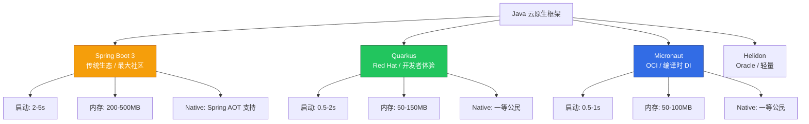

# Quarkus / Micronaut 云原生 Java 框架实践指南

> **适用版本**: Quarkus 3.12+ / Micronaut 4.7+ / JDK 21  
> **最后更新**: 2026-04-30  
> **难度**: 中级

---

<!-- chunk: 📋 目录 -->
## 📋 目录

- [一、云原生 Java 框架全景](#一云原生-java-框架全景)
- [二、框架对比](#二框架对比)
- [三、Quarkus 核心实践](#三quarkus-核心实践)
- [四、Micronaut 核心实践](#四micronaut-核心实践)
- [五、[[Kubernetes|Kubernetes]] 原生集成](#五kubernetes-原生集成)
- [六、Dev Services 开发体验](#六dev-services-开发体验)
- [七、反应式编程](#七反应式编程)
- [八、Native Image 编译](#八native-image-编译)
- [九、迁移策略](#九迁移策略)
- [十、选型决策矩阵](#十选型决策矩阵)

---

<!-- chunk: 一、云原生 Java 框架全景 -->
## 一、云原生 Java 框架全景



---

<!-- chunk: 二、框架对比 -->
## 二、框架对比

### 2.1 核心特性对比

| 特性 | Spring Boot 3 | Quarkus | Micronaut |
|------|-------------|---------|-----------|
| **DI 方式** | 运行时反射 | 编译时 + 运行时 | 编译时 (无反射) |
| **启动时间 (JVM)** | 2-5s | 0.5-2s | 0.5-1s |
| **启动时间 (Native)** | 35-100ms | 12-30ms | 15-40ms |
| **内存 (JVM)** | 200-500MB | 50-150MB | 50-100MB |
| **内存 (Native)** | 45-80MB | 25-50MB | 30-60MB |
| **Native 编译** | Spring AOT | 原生支持 | 原生支持 |
| **热重载** | Spring DevTools | Live Reload | 需配置 |
| **GraalVM** | 3.x 支持 | 一等公民 | 一等公民 |
| **反应式** | WebFlux (可选) | Vert.x (默认) | Netty (默认) |
| **K8s 集成** | Spring Cloud K8s | 原生 K8s Client | 原生 K8s |
| **微服务** | Spring Cloud | Quarkus Extensions | Micronaut Module |
| **社区规模** | 最大 | 大 | 中 |
| **企业支持** | VMware | Red Hat | Oracle |

---

<!-- chunk: 三、Quarkus 核心实践 -->
## 三、Quarkus 核心实践

### 3.1 项目创建

```bash
# 使用 Quarkus CLI
quarkus create app com.example:my-quarkus-app \
    --extension=rest,rest-jackson,hibernate-orm-panache,postgresql,smallrye-openapi,smallrye-health,metrics,container-image-jib

# 或使用 Maven
mvn io.quarkus.platform:quarkus-maven-plugin:3.12.0:create \
    -DprojectGroupId=com.example \
    -DprojectArtifactId=my-quarkus-app \
    -Dextensions='rest,hibernate-orm-panache,postgresql,smallrye-health,metrics'
```

### 3.2 REST Endpoint

```java
@Path("/api/users")
@Produces(MediaType.APPLICATION_JSON)
@Consumes(MediaType.APPLICATION_JSON)
public class UserResource {

    @Inject
    UserRepository userRepository;

    @GET
    public List<User> list() {
        return userRepository.listAll();
    }

    @GET
    @Path("/{id}")
    public User get(@PathParam("id") Long id) {
        return userRepository.findById(id);
    }

    @POST
    @Transactional
    public Response create(User user) {
        userRepository.persist(user);
        return Response.created(URI.create("/api/users/" + user.getId())).entity(user).build();
    }

    @PUT
    @Path("/{id}")
    @Transactional
    public User update(@PathParam("id") Long id, User user) {
        User entity = userRepository.findById(id);
        entity.setName(user.getName());
        entity.setEmail(user.getEmail());
        return entity;
    }

    @DELETE
    @Path("/{id}")
    @Transactional
    public void delete(@PathParam("id") Long id) {
        userRepository.deleteById(id);
    }
}
```

### 3.3 Panache ORM (简化数据访问)

```java
@Entity
@Table(name = "users")
public class User extends PanacheEntityBase {
    @Id
    @GeneratedValue(strategy = GenerationType.IDENTITY)
    public Long id;

    public String name;
    public String email;

    public static User findByName(String name) {
        return find("name", name).firstResult();
    }

    public static List<User> findActive() {
        return list("active", true);
    }
}
```

### 3.4 配置

```yaml
# application.yml
quarkus:
  http:
    port: 8080
  datasource:
    db-kind: postgresql
    jdbc:
      url: jdbc:postgresql://${DB_HOST:localhost}:${DB_PORT:5432}/${DB_NAME:mydb}
    username: ${DB_USER}
    password: ${DB_PASSWORD}
  hibernate-orm:
    database:
      generation: update
    dialect: postgresql
  container-image:
    builder: jib
    registry: registry.example.com
    group: com.example
    name: my-quarkus-app
  native:
    additional-build-args: >
      --initialize-at-build-time=org.slf4j
  smallrye-health:
    root-path: /health
    liveness-path: /health/live
    readiness-path: /health/ready
```

### 3.5 K8s 部署

```yaml
apiVersion: apps/v1
kind: Deployment
metadata:
  name: quarkus-app
spec:
  replicas: 3
  selector:
    matchLabels:
      app: quarkus-app
  template:
    metadata:
      labels:
        app: quarkus-app
    spec:
      containers:
        - name: app
          image: registry.example.com/my-quarkus-app:latest
          ports:
            - containerPort: 8080
          env:
            - name: DB_HOST
              value: "postgres-service"
            - name: DB_USER
              valueFrom:
                secretKeyRef:
                  name: db-credentials
                  key: username
            - name: DB_PASSWORD
              valueFrom:
                secretKeyRef:
                  name: db-credentials
                  key: password
          resources:
            requests: { memory: "256Mi", cpu: "100m" }
            limits: { memory: "512Mi", cpu: "500m" }
          livenessProbe:
            httpGet: { path: /health/live, port: 8080 }
            periodSeconds: 10
          readinessProbe:
            httpGet: { path: /health/ready, port: 8080 }
            periodSeconds: 5
```

---

<!-- chunk: 四、Micronaut 核心实践 -->
## 四、Micronaut 核心实践

### 4.1 项目创建

```bash
# 使用 Micronaut CLI
mn create-app com.example.my-micronaut-app \
    --features data-jdbc,postgres,management,graalvm,kubernetes

# 或使用 SDKMAN
sdk install micronaut
mn create-function-app com.example.my-function --features aws-lambda
```

### 4.2 Controller

```java
@Controller("/api/orders")
public class OrderController {
    private final OrderService orderService;

    public OrderController(OrderService orderService) {
        this.orderService = orderService;
    }

    @Get(produces = MediaType.APPLICATION_JSON)
    public List<Order> list() {
        return orderService.findAll();
    }

    @Get("/{id}")
    public Order get(Long id) {
        return orderService.findById(id);
    }

    @Post(processes = MediaType.APPLICATION_JSON)
    public HttpResponse<Order> create(@Body OrderRequest request) {
        Order order = orderService.create(request);
        return HttpResponse.created(order);
    }
}
```

### 4.3 编译时 DI

```java
@Singleton
public class OrderService {
    private final OrderRepository orderRepository;

    public OrderService(OrderRepository orderRepository) {
        this.orderRepository = orderRepository;
    }

    @Transactional
    public Order create(OrderRequest request) {
        Order order = new Order();
        order.setProductName(request.getProductName());
        order.setQuantity(request.getQuantity());
        return orderRepository.save(order);
    }
}
```

### 4.4 配置

```yaml
micronaut:
  server:
    port: 8080
    max-request-size: 10MB
  application:
    name: my-micronaut-app
  router:
    static-resources:
      swagger:
        paths: classpath:META-INF/swagger
        mapping: /swagger/**
endpoints:
  health:
    enabled: true
    sensitive: false
    details-visible: ANONYMOUS
datasources:
  default:
    url: jdbc:postgresql://${DB_HOST:localhost}:${DB_PORT:5432}/${DB_NAME:mydb}
    username: ${DB_USER}
    password: ${DB_PASSWORD}
    driver-class-name: org.postgresql.Driver
    schema-generate: UPDATE
    dialect: POSTGRES
```

---

<!-- chunk: 五、Kubernetes 原生集成 -->
## 五、Kubernetes 原生集成

### 5.1 Quarkus K8s Extension

```yaml
# application.yml - 自动生成 K8s 资源
quarkus:
  kubernetes:
    deploy: true
    namespace: production
    replicas: 3
    resources:
      requests:
        memory: 256Mi
        cpu: 100m
      limits:
        memory: 512Mi
        cpu: 500m
    liveness-probe:
      http-get-path: /health/live
      http-get-port: 8080
      period-seconds: 10
    readiness-probe:
      http-get-path: /health/ready
      http-get-port: 8080
      period-seconds: 5
    env:
      vars:
        DB_HOST:
          secret: db-credentials
          key: host
    labels:
      app-type: quarkus
    annotations:
      prometheus.io/scrape: "true"
      prometheus.io/path: /q/metrics
      prometheus.io/port: "8080"
```

### 5.2 Micronaut K8s

```java
@Singleton
@Requires(beans = KubernetesClient.class)
public class K8sServiceDiscovery implements ServiceInstanceList {
    private final KubernetesClient client;

    @Override
    public List<ServiceInstance> getInstances(String serviceId) {
        return client.services()
            .inNamespace("production")
            .withLabel("app", serviceId)
            .list()
            .getItems()
            .stream()
            .map(this::toServiceInstance)
            .toList();
    }
}
```

---

<!-- chunk: 六、Dev Services 开发体验 -->
## 六、Dev Services 开发体验

### 6.1 Quarkus Dev Services

```yaml
# 开发环境自动启动 PostgreSQL 容器
quarkus:
  datasource:
    db-kind: postgresql
    devservices:
      enabled: true
      port: 5432
      image-name: postgres:16-alpine
  hibernate-orm:
    database:
      generation: drop-and-create
```

### 6.2 Quarkus Dev UI

```bash
# 开发模式 (Live Reload)
./mvnw quarkus:dev

# 访问 Dev UI
# http://localhost:8080/q/dev-ui
# 可视化查看: 配置、Bean、Endpoints、Health、Metrics
```

---

<!-- chunk: 七、反应式编程 -->
## 七、反应式编程

### 7.1 Quarkus Reactive (Vert.x)

```java
@Path("/api/products")
public class ReactiveProductResource {

    @Inject
    ReactiveProductRepository repository;

    @GET
    @Produces(MediaType.APPLICATION_JSON)
    public Uni<List<Product>> list() {
        return repository.listAll();
    }

    @GET
    @Path("/{id}")
    public Uni<Product> get(@PathParam("id") Long id) {
        return repository.findById(id)
            .onItem().ifNull().failWith(new NotFoundException());
    }

    @POST
    @Transactional
    public Uni<Response> create(@Valid Product product) {
        return repository.persist(product)
            .map(p -> Response.created(URI.create("/api/products/" + p.getId())).entity(p).build());
    }
}
```

### 7.2 Micronaut Reactive (Netty)

```java
@Controller("/api/products")
public class ReactiveProductController {

    private final ProductRepository repository;

    @Get
    public Flux<Product> list() {
        return repository.findAll();
    }

    @Get("/{id}")
    public Mono<Product> get(Long id) {
        return repository.findById(id);
    }

    @Post
    public Mono<HttpResponse<Product>> create(@Body Product product) {
        return repository.save(product)
            .map(p -> HttpResponse.created(p));
    }
}
```

---

<!-- chunk: 八、Native Image 编译 -->
## 八、Native Image 编译

### 8.1 Quarkus Native 编译

```bash
# JVM 模式
./mvnw package -Dquarkus.package.type=fast-jar

# Native 二进制
./mvnw package -Dnative

# Native 容器 (使用 Docker 多阶段)
./mvnw package -Dnative \
    -Dquarkus.native.container-build=true \
    -Dquarkus.container-image.build=true \
    -Dquarkus.container-image.push=true

# Native 性能对比
# JVM: 启动 1.2s, 内存 120MB, RSS 80MB
# Native: 启动 0.015s, 内存 30MB, RSS 25MB
```

### 8.2 Micronaut Native 编译

```bash
# Native 编译
./gradlew nativeCompile

# Docker 构建原生镜像
docker build -t registry.example.com/my-micronaut-app:native -f Dockerfile.native .

# Dockerfile.native
FROM ghcr.io/graalvm/native-image-community:21 AS builder
WORKDIR /build
COPY . .
RUN ./gradlew nativeCompile

FROM gcr.io/distroless/cc-debian12:nonroot
COPY --from=builder /build/build/native/nativeCompile/my-micronaut-app /app/my-micronaut-app
EXPOSE 8080
USER nonroot:nonroot
ENTRYPOINT ["/app/my-micronaut-app"]
```

---

<!-- chunk: 九、迁移策略 -->
## 九、迁移策略

### 9.1 Spring Boot → Quarkus 迁移

| Spring 注解 | Quarkus 等价 | 说明 |
|------------|-------------|------|
| `@RestController` | `@Path` + `@GET/@POST` | JAX-RS 风格 |
| `@Service` | `@ApplicationScoped` | CDI |
| `@Autowired` | `@Inject` | CDI 注入 |
| `@Value` | `@ConfigProperty` | Micrometer Config |
| `@Entity` | `@Entity` (Panache) | 可继承 PanacheEntity |
| `@Transactional` | `@Transactional` | 相同 |
| `@SpringBootApplication` | `@QuarkusMain` | 主类 |
| `application.yml` | `application.yml` | 格式兼容 |
| `@Scheduled` | `@Scheduled` | 相同 |
| `@EventListener` | `@Observes` | CDI Event |

### 9.2 迁移步骤

```
Phase 1: 评估
  ├── 列出所有 Spring 依赖
  ├── 识别不可替换的 Spring 特有功能
  └── 评估工作量

Phase 2: 核心迁移
  ├── 替换 DI 注解
  ├── 替换 Web 注解 (Spring MVC → JAX-RS)
  ├── 替换配置注解
  └── 替换数据访问层

Phase 3: 扩展迁移
  ├── 安全 (Spring Security → Quarkus Security)
  ├── 消息 (Spring Kafka → Quarkus SmallRye)
  └── 缓存 (Spring Cache → Quarkus Cache)

Phase 4: 测试与优化
  ├── 功能测试
  ├── 性能基准
  └── Native 编译测试
```

---

<!-- chunk: 十、选型决策矩阵 -->
## 十、选型决策矩阵

### 10.1 场景推荐

| 场景 | 推荐 | 原因 |
|------|------|------|
| 已有 Spring 生态 | Spring Boot 3 | 无迁移成本 |
| 新项目, 团队熟悉 Spring | Spring Boot 3 + Native | 平滑过渡 |
| 新项目, 追求极致性能 | Quarkus Native | 最快启动、最低内存 |
| 新项目, 编译时安全 | Micronaut | 无反射、编译时校验 |
| K8s Operator 开发 | Quarkus | Operator SDK 原生支持 |
| Serverless / FaaS | Quarkus Native | 毫秒启动 |
| 多云微服务 | Micronaut | 无厂商锁定 |
| 大型企业后台 | Spring Boot | 生态最全 |

### 10.2 快速决策树

```
有现有 Spring 代码库？
  ├── 是 → Spring Boot 3 (迁移成本最低)
  └── 否 → 启动时间/内存敏感？
              ├── 是 → Quarkus Native
              └── 否 → 团队偏好？
                        ├── Java EE 背景 → Quarkus (JAX-RS)
                        ├── Spring 背景 → Spring Boot
                        └── 新团队 → Micronaut (编译时安全)
```

---

<!-- chunk: 🔗 相关文档 -->
## 🔗 相关文档

- [GraalVM Native Image 指南](./99-graalvm-native-image-guide.md) — 原生编译原理
- [Spring Boot on K8s](../domain-02-workloads-applications/99-spring-boot-kubernetes-guide.md) — Spring Boot 对比参考
- [Java 容器化](../domain-13-container-runtime/12-java-containerization-guide.md) — 容器构建优化
- [Java 性能 Sizing](../domain-10-troubleshooting-diagnostics/99-java-performance-resource-sizing-guide.md) — 资源配置

---

<!-- chunk: Obsidian 相关文档 -->
## Obsidian 相关文档

- domain-15-specialized-tech KUDIG Database — Global MOC
- [[domain-15-specialized-tech/README.md|Domain-10: Kubernetes 扩展生态]]
- index.md|Domain-10 扩展与自定义 — 开源项目索引]]
- CRD 自定义资源定义开发指南
- 02 - Operator开发模式与控制器实现
- 03 - 准入控制器(Webhook)配置与实现
- Kubernetes API 聚合扩展机制详解
- 包管理与应用分发工具
- 47 - Helm Chart开发与管理
- 129 - Helm 高级运维：复杂部署、CI/CD 集成与安全最佳实践
- CI/CD 管道
- 48 - GitOps工作流

## See Also

- 16-security-compliance-management
- 99-graalvm-native-image-guide
- 99-serverless-faas-guide
- 01-crd-development-guide
