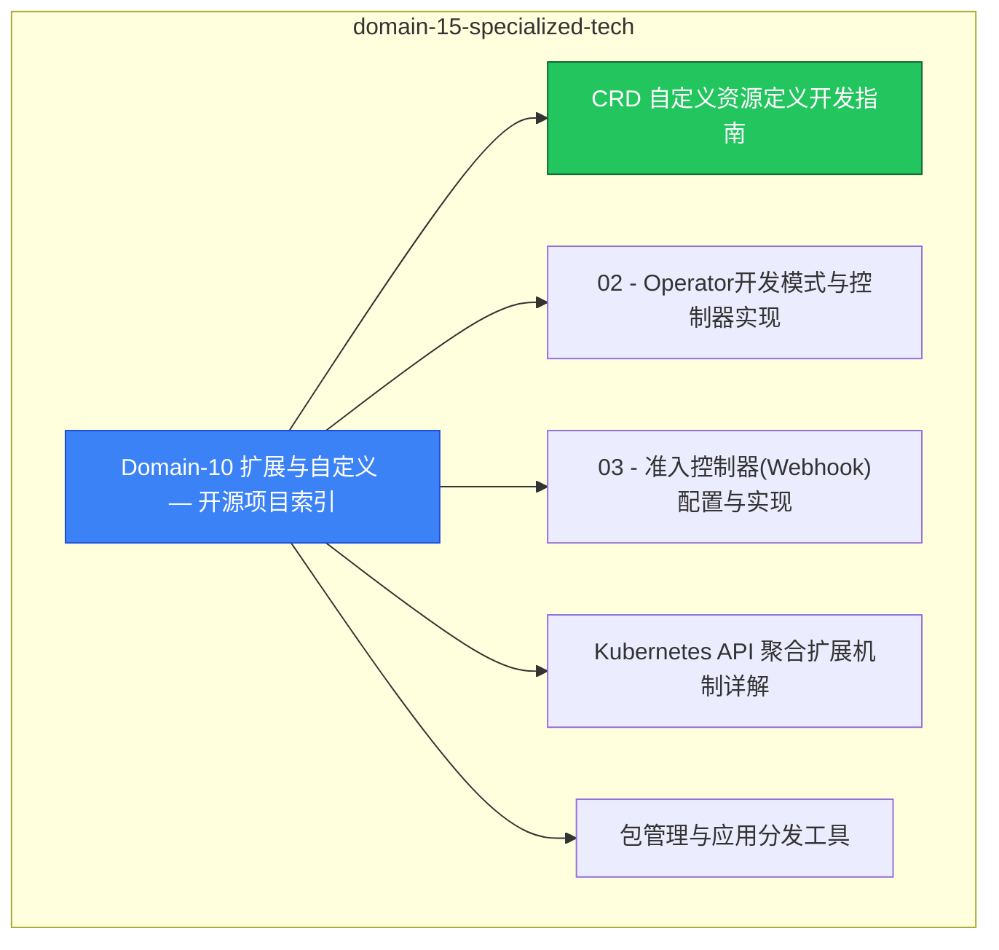

# domain-15-specialized-tech MOC

> **MOC 版本**: 1.0
> **知识域**: domain-15-specialized-tech
> **文档数量**: 20 篇
> **最后更新**: 2026-05-21
> **用途**: 本知识域的导航入口，汇总所有相关文档、关联领域、和场景入口

---

## 领域概述

扩展 — CRD、Operator、Webhook、API Aggregation

### 知识域定位

| 维度 | 说明 |
|---|---|
| **知识域** | domain-15-specialized-tech |
| **文档数量** | 20 篇 |
| **难度分布** | 入门 0 / 进阶 2 / 高级 1 / 专家 0 |

---

## 文档清单

| # | 文档 | 难度 | 标签 | 估计阅读时间 |
|---|---|---|---|---|
| 1 | [[domain-15-specialized-tech/00-open-source-projects-index.md|Domain-10 扩展与自定义 — 开源项目索引]] |  | k8s, crd, operator |  |
| 2 | [[domain-15-specialized-tech/01-crd-development-guide.md|CRD 自定义资源定义开发指南]] | 高级 | k8s, crd, custom-resource | 5min |
| 3 | [[domain-15-specialized-tech/02-operator-development-patterns.md|02 - Operator开发模式与控制器实现]] |  | k8s, crd, operator |  |
| 4 | [[domain-15-specialized-tech/03-admission-webhook-configuration.md|03 - 准入控制器(Webhook)配置与实现]] |  | k8s, crd, operator |  |
| 5 | [[domain-15-specialized-tech/04-api-aggregation-extension.md|Kubernetes API 聚合扩展机制详解]] |  | k8s, crd, operator |  |
| 6 | [[domain-15-specialized-tech/05-package-management-tools.md|包管理与应用分发工具]] | 进阶 | k8s, helm, kustomize | 5min |
| 7 | [[domain-15-specialized-tech/06-helm-charts-management.md|47 - Helm Chart开发与管理]] |  | k8s, crd, operator |  |
| 8 | [[domain-15-specialized-tech/07-helm-advanced-operations.md|129 - Helm 高级运维：复杂部署、CI/CD 集成与安全最佳实践]] |  | k8s, crd, operator |  |
| 9 | [[domain-15-specialized-tech/08-cicd-pipelines.md|CI/CD 管道]] | 进阶 | k8s, cicd, gitops | 5min |
| 10 | [[domain-15-specialized-tech/09-gitops-workflow-argocd.md|48 - GitOps工作流]] |  | k8s, crd, operator |  |
| 11 | [[domain-15-specialized-tech/10-image-build-tools.md|103 - 容器镜像构建工具 (Container Image Build)]] |  | k8s, crd, operator |  |
| 12 | [[domain-15-specialized-tech/11-service-mesh-overview.md|20 - 服务网格集成表]] |  | k8s, crd, operator |  |
| 13 | [[domain-15-specialized-tech/12-service-mesh-advanced.md|49 - 服务网格进阶配置]] |  | k8s, crd, operator |  |
| 14 | [[domain-15-specialized-tech/13-kubernetes-operations-fundamentals.md|130 - Kubernetes 运维基础技能：日志管理、备份恢复、安全加固与性能调优]] |  | k8s, crd, operator |  |
| 15 | [[domain-15-specialized-tech/14-multi-cluster-management.md|14 - 多集群管理与联邦 (Multi-Cluster Management & Federation)]] |  | k8s, crd, operator |  |
| 16 | [[domain-15-specialized-tech/15-monitoring-alerting-system.md|15 - 监控告警体系 (Monitoring & Alerting System)]] |  | k8s, crd, operator |  |
| 17 | [[domain-15-specialized-tech/16-security-compliance-management.md|16 - 安全合规管理 (Security & Compliance Management)]] |  | k8s, crd, operator |  |
| 18 | [[domain-15-specialized-tech/99-graalvm-native-image-guide.md|GraalVM Native Image 云原生实践指南]] |  | k8s, crd, operator |  |
| 19 | [[domain-15-specialized-tech/99-quarkus-micronaut-cloud-native-java-guide.md|Quarkus / Micronaut 云原生 Java 框架实践指南]] |  | k8s, crd, operator |  |
| 20 | [[domain-15-specialized-tech/99-serverless-faas-guide.md|K8s Serverless / FaaS 实践指南]] |  | k8s, crd, operator |  |

---

## 知识图谱

---

## 关联入口

| 入口 | 说明 |
|---|---|
| [[../domain-10-troubleshooting-diagnostics/topic-fta/MOC.md|FTA 故障树]] | domain-15-specialized-tech 相关故障树分析 |
| [[../domain-10-troubleshooting-diagnostics/topic-skills/MOC.md|Skills 技能]] | domain-15-specialized-tech 相关操作技能 |
| [[../domain-19-landscape-references/topic-index/README.md|深度研究入口]] | 语料库索引与向量检索 |

---

## 统计信息

| 指标 | 数值 |
|---|---|
| 文档总数 | 20 |
| 覆盖 K8s 版本 | v1.25 - v1.32 |

---

*本文档由 scripts/generate-mocs.py 自动生成，最后更新 2026-05-21。*
