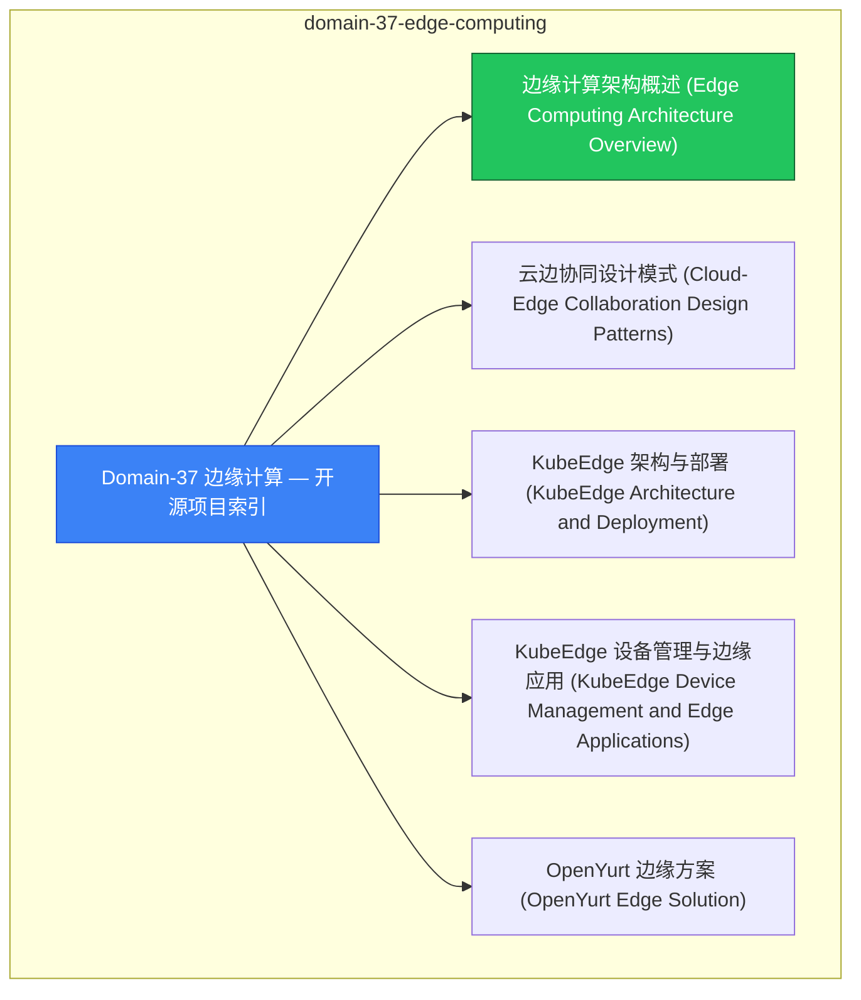

# domain-37-edge-computing MOC

> **MOC 版本**: 1.0
> **知识域**: domain-37-edge-computing
> **文档数量**: 12 篇
> **最后更新**: 2026-05-21
> **用途**: 本知识域的导航入口，汇总所有相关文档、关联领域、和场景入口

---

## 领域概述

边缘计算 — KubeEdge、边缘集群、边缘 AI

### 知识域定位

| 维度 | 说明 |
|---|---|
| **知识域** | domain-37-edge-computing |
| **文档数量** | 12 篇 |
| **难度分布** | 入门 0 / 进阶 0 / 高级 0 / 专家 0 |

---

## 文档清单

| # | 文档 | 难度 | 标签 | 估计阅读时间 |
|---|---|---|---|---|
| 1 | Domain-37 边缘计算 — 开源项目索引 |  | edge, kubeedge |  |
| 2 | 边缘计算架构概述 (Edge Computing Architecture Overview) |  | edge, kubeedge, architecture |  |
| 3 | 云边协同设计模式 (Cloud-Edge Collaboration Design Patterns) |  | edge, kubeedge |  |
| 4 | KubeEdge 架构与部署 (KubeEdge Architecture and Deployment) |  | edge, kubeedge, deployment |  |
| 5 | KubeEdge 设备管理与边缘应用 (KubeEdge Device Management and Edge Applications) |  | edge, kubeedge |  |
| 6 | OpenYurt 边缘方案 (OpenYurt Edge Solution) |  | edge, kubeedge, architecture |  |
| 7 | SuperEdge 架构实践 (SuperEdge Architecture Practice) |  | edge, kubeedge, architecture |  |
| 8 | 边缘 AI 推理与联邦学习 (Edge AI Inference and Federated Learning) |  | edge, kubeedge, tutorial |  |
| 9 | 边缘存储与网络 (Edge Storage and Network) |  | edge, kubeedge, networking |  |
| 10 | 边缘安全架构 (Edge Security Architecture) |  | edge, kubeedge, security |  |
| 11 | 边缘场景案例 (Edge Computing Use Cases) |  | edge, kubeedge, case-study |  |
| 12 | K8s 开发者体验工具链指南 |  | edge, kubeedge, guide |  |

---

## 知识图谱

---

## 关联入口

| 入口 | 说明 |
|---|---|
| FTA 故障树 | domain-37-edge-computing 相关故障树分析 |
| Skills 技能 | domain-37-edge-computing 相关操作技能 |
| 深度研究入口 | 语料库索引与向量检索 |

---

## 统计信息

| 指标 | 数值 |
|---|---|
| 文档总数 | 12 |
| 覆盖 K8s 版本 | v1.25 - v1.32 |

---

*本文档由 scripts/generate-mocs.py 自动生成，最后更新 2026-05-21。*
