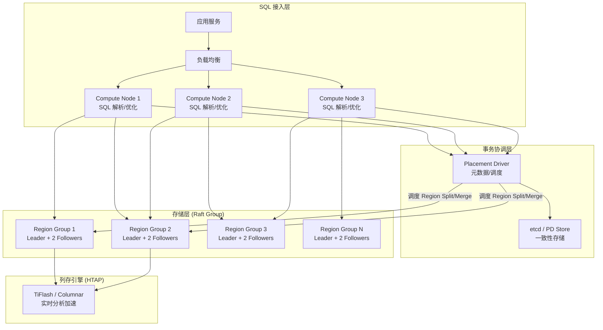
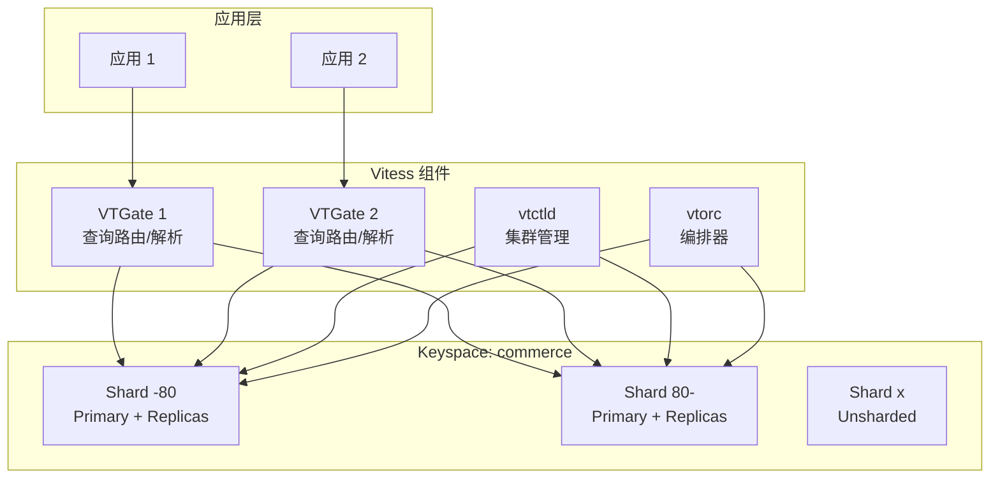

# 分布式数据库企业级实践深度指南

> **适用版本**: TiDB v9.0 / CockroachDB v25.1 / Vitess v21.0  
> **最后更新**: 2026-04-26  
> **难度**: 高级 → 专家

---

<!-- chunk: 概述 -->## 概述

分布式数据库是解决海量数据存储、高并发访问和跨地域容灾的核心基础设施。随着企业数据规模的指数级增长和全球化业务部署的需求，传统的单机数据库和简单主从复制架构已无法满足 RPO≈0、RTO<30s 的严苛要求。分布式数据库通过数据分片（Sharding）、多副本共识（Raft/Paxos）、分布式事务（2PC/1PC 优化）等技术，实现了水平扩展、强一致性和高可用性的统一。

本文档深入探讨企业级分布式数据库的架构设计、选型决策、性能调优和运维管理实践，涵盖 TiDB、CockroachDB、YugabyteDB、Vitess 等主流方案。所有配置和脚本均基于大规模生产环境（数据量 10TB+、QPS 50万+）的实际经验总结。

分布式数据库的核心技术挑战包括：分布式事务的 ACID 保证（TiDB 的异步提交和 1PC 优化）、跨节点 JOIN 的查询优化（TiDB 的 MPP 模式）、数据均衡与热点处理（Region Split/Merge）、以及全球分布式部署的延迟优化（CockroachDB 的 Leaseholder 亲和性）。理解这些技术细节对于正确选型和运维至关重要。

#<!-- chunk: 分布式数据库技术演进 -->## 分布式数据库技术演进

分布式数据库的发展经历了三个主要阶段。第一代以 Google Spanner 和 Megastore 为代表，提出了分布式事务、TrueTime API 等基础概念。第二代以 TiDB、CockroachDB 为代表，将分布式数据库技术普及到开源社区，降低了使用门槛。第三代正在向 HTAP（混合事务/分析处理）方向演进，TiDB 通过 TiFlash 列存引擎实现了行存和列存的透明融合，使得同一套数据库系统既能处理高并发的 OLTP 请求，又能执行复杂的 OLAP 分析查询。

在云原生时代，分布式数据库正在与 Kubernetes 深度集成。TiDB Operator 和 CockroachDB Operator 使得在 K8s 上管理分布式数据库集群成为可能。然而，分布式数据库对网络延迟和存储性能的敏感性意味着在 K8s 上部署时需要特别注意网络配置（HostNetwork、NetworkPolicy）和存储选型（Local PV、高性能 StorageClass）。

Vitess 作为一个独特的存在，它并不是一个完整的分布式数据库，而是 MySQL 的水平扩展中间件。Vitess 通过 VTGate 提供统一的查询入口，通过 VTTablet 管理每个 MySQL 实例，通过 VReplication 实现数据迁移和重新分片。Vitess 已经被 YouTube、Slack、Square 等大规模互联网公司采用，是 MySQL 水平扩展领域最成熟的开源方案。

Apache ShardingSphere 则从数据库代理的角度切入，提供了一套通用的数据库分片和治理方案。它支持 MySQL、PostgreSQL 等多种后端数据库，通过 SQL 解析和路由实现透明的数据分片。ShardingSphere 的优势在于对现有数据库架构的侵入性最小，适合渐进式迁移场景。

企业在选型时需要根据自身的技术栈、数据规模、团队能力和业务增长预期做出综合判断。对于已有大量 MySQL 投入的企业，Vitess 或 ShardingSphere 是更平滑的选择。对于新系统或需要 HTAP 能力的场景，TiDB 或 CockroachDB 是更好的选择。

---

<!-- chunk: 架构设计 -->## 架构设计

#<!-- chunk: 分布式数据库总体架构 -->## 分布式数据库总体架构



#<!-- chunk: 主流分布式数据库对比 -->## 主流分布式数据库对比

| 维度 | TiDB | CockroachDB | YugabyteDB | Vitess |
|:---|:---|:---|:---|:---|
| 数据模型 | 关系型（MySQL 兼容） | 关系型（PG 兼容） | 关系型（PG/Cassandra） | MySQL 分片中间件 |
| 共识协议 | Multi-Raft | Multi-Raft | Multi-Raft | 基于 MySQL 复制 |
| 事务模型 | 乐观+悲观 | 乐观 | 混合 | 基于 MySQL |
| HTAP | TiFlash 列存 | 不支持 | 不支持 | 不支持 |
| 水平扩展 | 自动分片 | 自动分片 | 自动分片 | 手动/自动分片 |
| 语言 | Go + Rust | Go | C++ | Go |
| License | Apache-2.0 | BSL/Apache | Apache-2.0 | Apache-2.0 |
| 适用场景 | HTAP 混合负载 | 全球分布式 | 云原生 PG 替代 | MySQL 水平扩展 |

#<!-- chunk: Vitess 架构图 -->## Vitess 架构图



---

<!-- chunk: 核心组件配置 -->## 核心组件配置

#<!-- chunk: TiDB 集群完整配置 -->## TiDB 集群完整配置

```yaml
# tidb-cluster.yaml - TiDB v9.0 生产部署 (TiDB Operator)
apiVersion: pingcap.com/v1alpha1
kind: TidbCluster
metadata:
  name: production-tidb
  namespace: tidb
spec:
  version: v9.0.0
  timezone: Asia/Shanghai
  pvReclaimPolicy: Retain
  enableDynamicConfiguration: true
  configUpdateStrategy: RollingUpdate

  pd:
    baseImage: pingcap/pd
    replicas: 3
    requests:
      cpu: "2"
      memory: "4Gi"
    config: |
      [log]
      level = "info"
      [schedule]
      max-merge-region-size = 64
      max-merge-region-keys = 640000
      split-merge-interval = "1h"
      enable-one-way-merge = true
      enable-cross-table-merge = true
      patrol-region-interval = "100ms"
      max-snapshot-count = 80
      max-pending-peer-count = 64
      max-store-down-time = "30m"
      leader-schedule-limit = 40
      region-schedule-limit = 2048
      replica-schedule-limit = 64
      merge-schedule-limit = 64
      hot-region-schedule-limit = 8
      [replication]
      max-replicas = 3
      location-labels = ["region", "zone", "rack", "host"]

  tidb:
    baseImage: pingcap/tidb
    replicas: 4
    requests:
      cpu: "8"
      memory: "16Gi"
    config: |
      [log]
      level = "info"
      [performance]
      max-procs = 8
      tcp-keep-alive = true
      [prepared-plan-cache]
      enabled = true
      capacity = 2000
      memory-guard-ratio = 0.1
      [tikv-client]
      max-batch-wait-time = "1000us"
      batch-requests = true
      [stats]
      lease = "3h"
      pseudo-estimate-ratio = 0.8

  tikv:
    baseImage: pingcap/tikv
    replicas: 6
    requests:
      cpu: "8"
      memory: "16Gi"
    storageClassName: local-ssd
    config: |
      [log]
      level = "info"
      [storage]
      reserve-space = "50GB"
      scheduler-concurrency = 524288
      scheduler-worker-pool-size = 8
      [storage.block-cache]
      shared = true
      capacity = "12GB"
      [rocksdb]
      max-open-files = 10240
      max-background-jobs = 12
      [rocksdb.defaultcf]
      compaction-style = 2
      write-buffer-size = "128MB"
      max-write-buffer-number = 8
      target-file-size-base = "128MB"
      level0-file-num-compaction-trigger = 4
      [rocksdb.writecf]
      compaction-style = 2
      write-buffer-size = "128MB"
      max-write-buffer-number = 8
      target-file-size-base = "128MB"
      [raftdb]
      max-open-files = 10240
      max-background-jobs = 8
      [raftstore]
      region-max-size = "144MB"
      region-split-size = "96MB"
      sync-log = true
      [server]
      grpc-concurrency = 8
      grpc-raft-conn-num = 4
      [import]
      num-threads = 8
      stream-channel-window = 128

  tiflash:
    baseImage: pingcap/tiflash
    replicas: 3
    requests:
      cpu: "8"
      memory: "32Gi"
    config: |
      [logger]
      level = "information"
      [profiles.default]
      max_memory_usage = 20000000000
      max_bytes_before_external_group_by = 10000000000

  pump:
    baseImage: pingcap/tidb-binlog
    replicas: 3
    requests:
      cpu: "1"
      memory: "2Gi"
    config: |
      [storage]
      sync-log = true
      stop-write-at-available-space = "10GB"

  ticdc:
    baseImage: pingcap/ticdc
    replicas: 3
    requests:
      cpu: "2"
      memory: "4Gi"
```

#<!-- chunk: Vitess 生产部署配置 -->## Vitess 生产部署配置

```yaml
# vitess-operator-deploy.yaml
apiVersion: apps/v1
kind: Deployment
metadata:
  name: vitess-operator
  namespace: vitess
spec:
  replicas: 1
  selector:
    matchLabels:
      name: vitess-operator
  template:
    metadata:
      labels:
        name: vitess-operator
    spec:
      serviceAccountName: vitess-operator
      containers:
        - name: vitess-operator
          image: vitess/vitess-operator:v21.0.0
          env:
            - name: VTGATE_REPLICAS
              value: "3"
            - name: VTTABLET_REPLICAS
              value: "5"
---
apiVersion: planetscale.com/v2
kind: VitessCluster
metadata:
  name: production-vitess
  namespace: vitess
spec:
  images:
    vtgate: vitess/vtgate:v21.0.0
    vttablet: vitess/vttablet:v21.0.0
    vtbackup: vitess/vtbackup:v21.0.0
    vtctld: vitess/vtctld:v21.0.0
    mysqld: vitess/mysqld:v21.0.0
    vtorc: vitess/vtorc:v21.0.0

  cellAlias:
    - cell: zone1
      alias: production

  vitessDashboard:
    replicas: 1
    resources:
      requests:
        cpu: "100m"
        memory: "256Mi"

  vtgate:
    replicas: 3
    resources:
      requests:
        cpu: "4"
        memory: "8Gi"
      limits:
        cpu: "8"
        memory: "16Gi"
    flags:
      web_port: "15001"
      grpc_port: "15999"
      mysql_server_port: "15306"
      query_cache_size: "1000000"
      query_cache_lru: "true"
      normalize_queries: "true"
      enable_buffer: "true"
      buffer_size: "10"
      buffer_max_failover_duration: "30s"
      buffer_window: "5m"

  keyspaces:
    - name: commerce
      replication:
        enforce: true
      shards:
        - shard: "-80"
          databases:
            - name: commerce
          replication:
            enforce: true
          tabletPools:
            - type: replicas
              replicas: 3
              vttablet:
                resources:
                  requests:
                    cpu: "4"
                    memory: "8Gi"
                  limits:
                    cpu: "8"
                    memory: "16Gi"
                mysql:
                  resources:
                    requests:
                      cpu: "4"
                      memory: "8Gi"
                    limits:
                      cpu: "8"
                      memory: "16Gi"
                flags:
                  queryserver-config-pool-size: "500"
                  queryserver-config-stream-pool-size: "100"
                  queryserver-config-transaction-cap: "500"
                  queryserver-config-query-timeout: "60"
                  queryserver-config-terse-errors: "true"
              backup:
                schedule: "0 2 * * *"
                retention: "7d"
        - shard: "80-"
          databases:
            - name: commerce
          tabletPools:
            - type: replicas
              replicas: 3
              vttablet:
                resources:
                  requests:
                    cpu: "4"
                    memory: "8Gi"
```

#<!-- chunk: Apache ShardingSphere 配置 -->## Apache ShardingSphere 配置

```yaml
# shardingsphere-config.yaml
mode:
  type: Cluster
  repository:
    type: ZooKeeper
    props:
      namespace: governance_ds
      server-lists: zk-0:2181,zk-1:2181,zk-2:2181
      retryIntervalMilliseconds: 500
      timeToLiveSeconds: 60
      maxRetries: 3
      operationTimeoutMilliseconds: 5000

dataSources:
  ds_0:
    dataSourceClassName: com.zaxxer.hikari.HikariDataSource
    driverClassName: com.mysql.cj.jdbc.Driver
    jdbcUrl: jdbc:mysql://mysql-0:3306/db_0?useSSL=true
    username: app_user
    password: ${DB_PASSWORD}
    hikari:
      maximumPoolSize: 50
      minimumIdle: 10
      connectionTimeout: 30000
      idleTimeout: 600000
      maxLifetime: 1800000
  ds_1:
    dataSourceClassName: com.zaxxer.hikari.HikariDataSource
    driverClassName: com.mysql.cj.jdbc.Driver
    jdbcUrl: jdbc:mysql://mysql-1:3306/db_1?useSSL=true
    username: app_user
    password: ${DB_PASSWORD}
    hikari:
      maximumPoolSize: 50
      minimumIdle: 10

rules:
  - !SHARDING
    tables:
      t_order:
        actualDataNodes: ds_${0..1}.t_order_${0..15}
        tableStrategy:
          standard:
            shardingColumn: order_id
            shardingAlgorithmName: t_order_mod
        keyGenerateStrategy:
          column: order_id
          keyGeneratorName: snowflake
      t_order_item:
        actualDataNodes: ds_${0..1}.t_order_item_${0..15}
        tableStrategy:
          standard:
            shardingColumn: order_id
            shardingAlgorithmName: t_order_item_mod
        keyGenerateStrategy:
          column: id
          keyGeneratorName: snowflake
      t_user:
        actualDataNodes: ds_${0..1}.t_user
        databaseStrategy:
          standard:
            shardingColumn: user_id
            shardingAlgorithmName: t_user_db_mod

    bindingTables:
      - t_order, t_order_item

    shardingAlgorithms:
      t_order_mod:
        type: MOD
        props:
          sharding-count: '16'
      t_order_item_mod:
        type: MOD
        props:
          sharding-count: '16'
      t_user_db_mod:
        type: MOD
        props:
          sharding-count: '2'

    keyGenerators:
      snowflake:
        type: SNOWFLAKE
        props:
          worker-id: '1'

props:
  sql-show: false
  max-connections-size-per-query: 5
  check-table-metadata-enabled: false
```

---

<!-- chunk: 性能调优 -->## 性能调优

#<!-- chunk: TiDB 性能参数调优 -->## TiDB 性能参数调优

```
TiDB 性能调优参考（TiKV 节点 16核/32GB/NVMe SSD）：

存储引擎:
  rocksdb.defaultcf.write-buffer-size   = 128MB
  rocksdb.defaultcf.max-write-buffer-number = 8
  rocksdb.defaultcf.target-file-size-base = 128MB
  rocksdb.defaultcf.level0-file-num-compaction-trigger = 4
  rocksdb.writecf.write-buffer-size     = 128MB

Block Cache:
  storage.block-cache.shared            = true
  storage.block-cache.capacity          = 机器内存 × 40% = ~12GB

Raft Store:
  raftstore.region-max-size             = 144MB
  raftstore.region-split-size           = 96MB
  raftstore.sync-log                    = true
  raftstore.capacity                    = 磁盘容量 × 80%

Scheduler:
  storage.scheduler-concurrency         = 524288
  storage.scheduler-worker-pool-size    = 8

GRPC:
  server.grpc-concurrency               = CPU核数 = 8
  server.grpc-raft-conn-num             = 4

预估吞吐量：
  单 TiKV 节点写入: ~20K-50K TPS
  单 TiKV 节点读取: ~100K-300K QPS
  线性扩展: N 节点 × 单节点吞吐 (理想状态)
```

#<!-- chunk: 热点诊断与处理 -->## 热点诊断与处理

```sql
-- TiDB 热点 Region 诊断
SELECT
    store_id,
    region_id,
    ROUND(leader_read_rate, 2) AS read_rate,
    ROUND(leader_write_rate, 2) AS write_rate,
    ROUND(leader_read_keys, 2) AS read_keys
FROM information_schema.tikv_region_status
WHERE leader_read_rate > 1000 OR leader_write_rate > 500
ORDER BY leader_write_rate DESC
LIMIT 20;

-- 查看写入热点
SELECT
    table_name,
    index_name,
    COUNT(*) AS region_count
FROM information_schema.tikv_region_status
WHERE db_name = 'production_db'
GROUP BY table_name, index_name
ORDER BY region_count DESC;

-- 处理方案：
-- 1. SHARD_ROW_ID_BITS = 4 打散写入热点
-- 2. AUTO_RANDOM 替代自增主键
-- 3. 预切分 Region: SPLIT TABLE t_name BETWEEN (min) AND (max) REGIONS N
```

#<!-- chunk: Vitess 查询优化 -->## Vitess 查询优化

```sql
-- Vitess 查询计划分析
-- 使用 VExplain 查看查询路由
VEXPLAIN ALL SELECT * FROM t_order WHERE user_id = 123;

-- 查看分片键使用情况
-- 确保查询包含分片键以避免 scatter-gather
-- 以下查询会导致全分片扫描（避免）：
SELECT * FROM t_order WHERE status = 'pending';

-- 优化为包含分片键：
SELECT * FROM t_order WHERE user_id = 123 AND status = 'pending';

-- 使用 VITESS_HINT 控制路由
SELECT /*+ VTGTID commerce.-80 */ * FROM t_order LIMIT 10;
```

---

<!-- chunk: 高可用与容灾 -->## 高可用与容灾

#<!-- chunk: TiDB 多数据中心部署 -->## TiDB 多数据中心部署

```yaml
# TiDB 跨机房拓扑
global:
  user: tidb
  deploy_dir: /opt/tidb
  data_dir: /data/tidb

server_configs:
  pd:
    replication.max-replicas: 5
    replication.location-labels: ["dc", "rack", "host"]
  tikv:
    raftstore.sync-log: true

pd_servers:
  - host: pd-0.dc1
    config:
      schedule.max-store-down-time: "30m"
  - host: pd-1.dc1
  - host: pd-2.dc2
  - host: pd-3.dc2
  - host: pd-4.dc3

tikv_servers:
  - host: tikv-0.dc1
    config:
      server.labels: { dc: "dc1", rack: "rack1", host: "tikv-0" }
  - host: tikv-1.dc1
    config:
      server.labels: { dc: "dc1", rack: "rack2", host: "tikv-1" }
  - host: tikv-2.dc2
    config:
      server.labels: { dc: "dc2", rack: "rack1", host: "tikv-2" }
  - host: tikv-3.dc2
    config:
      server.labels: { dc: "dc2", rack: "rack2", host: "tikv-3" }
  - host: tikv-4.dc3
    config:
      server.labels: { dc: "dc3", rack: "rack1", host: "tikv-4" }
  - host: tikv-5.dc3
    config:
      server.labels: { dc: "dc3", rack: "rack2", host: "tikv-5" }
```

#<!-- chunk: 容灾切换流程 -->## 容灾切换流程

```bash
#!/bin/bash
# dr_switchover.sh - 分布式数据库容灾切换脚本

ACTION="${1:?Usage: $0 failover|revert}"
DC_PRIMARY="dc1"
DC_DR="dc2"

echo "=== DR Switchover: $ACTION ==="

case "$ACTION" in
    failover)
        echo "Step 1: Verify primary DC is down"
        # 检查主机房 PD 是否可达
        if pd-ctl -u http://pd-0.dc1:2379 store 2>/dev/null; then
            echo "WARNING: Primary DC PD is still reachable!"
            read -p "Force failover anyway? (yes/no): " confirm
            [[ "$confirm" != "yes" ]] && exit 0
        fi

        echo "Step 2: Promote DR DC"
        # 在 DR 机房启动新的 PD leader
        pd-ctl -u http://pd-2.dc2:2379 scheduler add evict-leader-scheduler 1
        pd-ctl -u http://pd-2.dc2:2379 scheduler add evict-leader-scheduler 2

        echo "Step 3: Update application DNS/VIP"
        # 更新 DNS 指向 DR 机房的 TiDB 节点
        # 或切换 VIP

        echo "Step 4: Verify cluster health"
        pd-ctl -u http://pd-2.dc2:2379 store
        mysql -h tidb-0.dc2 -P 4000 -e "SELECT * FROM information_schema.cluster_info;"
        ;;

    revert)
        echo "Step 1: Sync data from DR back to primary DC"
        # 使用 TiCDC 或 Dumpling/Lightning 同步数据
        tiup br restore full \
            --storage "s3://company-tidb-backup" \
            --pd pd-0.dc1:2379

        echo "Step 2: Switch traffic back"
        echo "Step 3: Verify data consistency"
        ;;
esac
```

---

<!-- chunk: 备份恢复 -->## 备份恢复

#<!-- chunk: TiDB Backup & Restore -->## TiDB Backup & Restore

```bash
#!/bin/bash
# tidb_backup.sh - TiDB 全量/增量备份脚本
set -euo pipefail

PD_ENDPOINT="pd-0:2379"
S3_BUCKET="s3://company-tidb-backup"
BACKUP_DATE=$(date +%Y%m%d_%H%M%S)

full_backup() {
    echo "Starting full backup..."
    tiup br backup full \
        --pd "${PD_ENDPOINT}" \
        --storage "${S3_BUCKET}/full_${BACKUP_DATE}" \
        --s3.region "cn-north-1" \
        --concurrency 8 \
        --ratelimit "100MB" \
        --log-file "/var/log/tidb/backup_full_${BACKUP_DATE}.log"

    echo "Full backup completed"
}

incremental_backup() {
    local last_backup_ts="${1:?Last backup TS required}"
    echo "Starting incremental backup from TS $last_backup_ts..."

    tiup br backup full \
        --pd "${PD_ENDPOINT}" \
        --storage "${S3_BUCKET}/incr_${BACKUP_DATE}" \
        --s3.region "cn-north-1" \
        --lastbackupts "${last_backup_ts}" \
        --concurrency 8

    echo "Incremental backup completed"
}

restore() {
    local backup_path="${1:?Backup path required}"
    echo "!!! PRODUCTION RESTORE from $backup_path !!!"
    read -p "Confirm? (yes/no): " confirm
    [[ "$confirm" != "yes" ]] && exit 0

    tiup br restore full \
        --pd "${PD_ENDPOINT}" \
        --storage "${backup_path}" \
        --s3.region "cn-north-1" \
        --concurrency 8 \
        --online

    echo "Restore completed"
}

case "${1:-help}" in
    full)     full_backup ;;
    incr)     incremental_backup "${2:?TS required}" ;;
    restore)  restore "${2:?Path required}" ;;
    *)        echo "Usage: $0 {full|incr <ts>|restore <path>}" ;;
esac
```

---

<!-- chunk: 监控告警 -->## 监控告警

#<!-- chunk: TiDB Prometheus 告警规则 -->## TiDB Prometheus 告警规则

```yaml
groups:
  - name: tidb.rules
    rules:
      - alert: TiDBServerDown
        expr: up{job="tidb"} == 0
        for: 2m
        labels:
          severity: critical
        annotations:
          summary: "TiDB 节点 {{ $labels.instance }} 宕机"

      - alert: TiKVServerDown
        expr: up{job="tikv"} == 0
        for: 1m
        labels:
          severity: critical
        annotations:
          summary: "TiKV 节点 {{ $labels.instance }} 宕机"

      - alert: TiKVRegionUnhealthy
        expr: pd_regions_status{type="offline-count"} > 0
        for: 5m
        labels:
          severity: critical
        annotations:
          summary: "存在 Offline Region"

      - alert: TiKVSlowQuery
        expr: histogram_quantile(0.99, sum(rate(tidb_server_handle_query_duration_seconds_bucket[5m])) by (le)) > 1
        for: 5m
        labels:
          severity: warning
        annotations:
          summary: "P99 查询延迟超过 1 秒"

      - alert: TiKVHighMemory
        expr: tikv_engine_block_cache_size_bytes / (1024*1024*1024) > 12
        for: 10m
        labels:
          severity: warning
        annotations:
          summary: "Block Cache 内存使用过高"

      - alert: TiDBConnectionExhausted
        expr: tidb_server_connections / tidb_server_max_connections > 0.85
        for: 5m
        labels:
          severity: warning
        annotations:
          summary: "TiDB 连接数使用率超过 85%"
```

---

<!-- chunk: 运维管理 -->## 运维管理

#<!-- chunk: TiDB 日常运维脚本 -->## TiDB 日常运维脚本

```bash
#!/bin/bash
# tidb_ops.sh - TiDB 运维管理脚本

PD="pd-0:2379"

cluster_health() {
    echo "=== TiDB Cluster Health ==="
    tiup cluster display production-tidb

    echo ""
    echo "--- Store Status ---"
    pd-ctl -u "http://${PD}" store

    echo ""
    echo "--- Region Status ---"
    pd-ctl -u "http://${PD}" region --jq '.regions | length'
}

hot_region_check() {
    echo "=== Hot Region Analysis ==="
    pd-ctl -u "http://${PD}" hot read
    pd-ctl -u "http://${PD}" hot write

    echo ""
    echo "--- Top Write Hot Regions ---"
    pd-ctl -u "http://${PD}" hot write --detail 2>/dev/null | head -30
}

scale_out() {
    local component="${1:?tikv|tidb|pd}"
    local count="${2:?count}"
    echo "Scaling out $component by $count..."
    tiup cluster scale-out production-tidb scale-out.yaml
}

case "${1:-health}" in
    health) cluster_health ;;
    hot)    hot_region_check ;;
    scale)  scale_out "${2:?}" "${3:?}" ;;
    *)      echo "Usage: $0 {health|hot|scale <component> <count>}" ;;
esac
```

---

<!-- chunk: 最佳实践 -->## 最佳实践

#<!-- chunk: 分片键选择原则 -->## 分片键选择原则

| 原则 | 说明 | 反模式 |
|:---|:---|:---|
| 高基数 | 分片键值域足够大（> 分片数 × 10） | 使用 status 等低基数字段 |
| 均匀分布 | 写入均匀到所有分片 | 自增 ID 导致热点 |
| 查询覆盖 | 大多数查询包含分片键 | 不带分片键的全表扫描 |
| 不可变 | 分片键值创建后不更新 | 使用可能变更的字段 |
| 时间无关 | 避免按时间聚集 | 仅用 created_at 作为分片键 |

#<!-- chunk: 分布式事务优化 -->## 分布式事务优化

```sql
-- TiDB 事务优化

-- 1. 使用 Async Commit 减少提交延迟
SET SESSION tidb_enable_async_commit = ON;

-- 2. 使用 1PC 减少事务延迟（单 Region 事务自动优化）
SET SESSION tidb_enable_1pc = ON;

-- 3. 大事务拆分（TiDB 事务限制 100MB）
-- 避免 single transaction > 100MB
-- 分批提交：每批 1000-5000 行

-- 4. 使用 AUTO_RANDOM 避免热点
CREATE TABLE orders (
    id BIGINT PRIMARY KEY AUTO_RANDOM,
    user_id BIGINT NOT NULL,
    amount DECIMAL(12,2),
    created_at DATETIME DEFAULT CURRENT_TIMESTAMP,
    INDEX idx_user (user_id)
) SHARD_ROW_ID_BITS = 4 PRE_SPLIT_REGIONS = 4;
```

---

<!-- chunk: 故障排查 -->## 故障排查

#<!-- chunk: 常见故障速查表 -->## 常见故障速查表

| 故障现象 | 可能原因 | 排查方法 | 解决方案 |
|:---|:---|:---|:---|
| TiDB 查询超时 | 热点 Region / 统计信息过期 | `EXPLAIN ANALYZE` / `ADMIN SHOW SLOW` | `ANALYZE TABLE` /打散热点 Region |
| TiKV 节点 Down | 磁盘满 / IO 过载 | `pd-ctl store` / `df -h` | 清理磁盘 / 扩容 |
| Region 不均衡 | 调度策略不合理 | `pd-ctl region` / `pd-ctl scheduler` | 调整 `leader-schedule-limit` |
| 分布式事务冲突 | 悲观锁冲突高 | `information_schema.deadlocks` | 优化事务 / 使用乐观事务 |
| BR 备份失败 | S3 权限/网络 | 查看 BR 日志 | 检查 IAM / 网络 |
| Vitess 全分片扫描 | 查询缺少分片键 | `VEXPLAIN ALL` | 添加分片键到 WHERE 条件 |
| Vitess VReplication 延迟 | 大事务 / 网络抖动 | `vtctlclient VDiff` | 拆分事务 / 检查网络 |
| ShardingSphere 路由错误 | 分片算法配置不当 | 查看 proxy 日志 | 校验分片规则和算法 |

---

**文档版本**: v2.0  
**最后更新**: 2026-04-26  
**适用版本**: TiDB v9.0 / CockroachDB v25.1 / Vitess v21.0

---

<!-- chunk: Obsidian 相关文档 -->## Obsidian 相关文档

- [[domain-16-database-middleware/MOC.md|domain-28-enterprise-database-middleware MOC]]
- [[domain-16-database-middleware/README.md|Domain 28: 企业级数据库与中间件运维 (Enterprise Database & Middleware Op...]]
- [[domain-16-database-middleware/00-open-source-projects-index.md|Domain-28 企业数据库与中间件 — 开源项目索引]]
- [[domain-16-database-middleware/01-mysql-enterprise-database.md|MySQL 企业级数据库运维管理]]
- [[domain-16-database-middleware/02-postgresql-enterprise-database.md|PostgreSQL 企业级数据库高可用架构]]
- [[domain-16-database-middleware/04-database-middleware-kubernetes.md|数据库中间件 Kubernetes 企业级实践]]
- [[domain-16-database-middleware/05-mongodb-enterprise-database.md|MongoDB 企业级数据库运维深度实践]]
- [[domain-16-database-middleware/06-redis-enterprise-cache.md|Redis 企业级缓存运维深度实践]]
- [[domain-16-database-middleware/07-redis-kubernetes-operator.md|Redis Kubernetes Operator 企业级实践]]
- [[domain-16-database-middleware/08-kafka-kubernetes-strimzi.md|Kafka Kubernetes 企业级实践 — Strimzi Operator 深度指南]]
- [[domain-16-database-middleware/99-cloudnativepg-enterprise-guide.md|CloudNativePG 企业级 PostgreSQL 运维指南]]

## See Also

- [[domain-16-database-middleware/01-mysql-enterprise-database.md|01-mysql-enterprise-database]]
- [[domain-16-database-middleware/02-postgresql-enterprise-database.md|02-postgresql-enterprise-database]]
- [[domain-16-database-middleware/04-database-middleware-kubernetes.md|04-database-middleware-kubernetes]]
- [[domain-16-database-middleware/05-mongodb-enterprise-database.md|05-mongodb-enterprise-database]]
