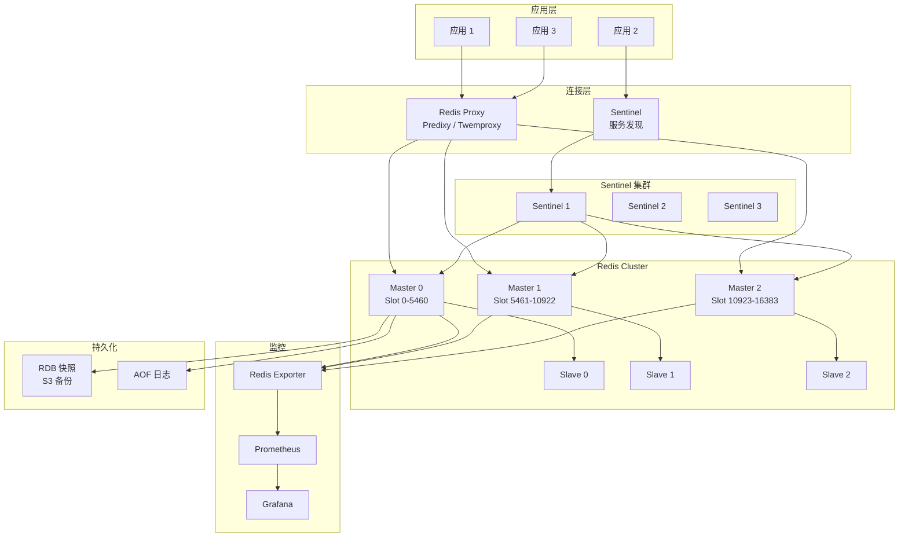
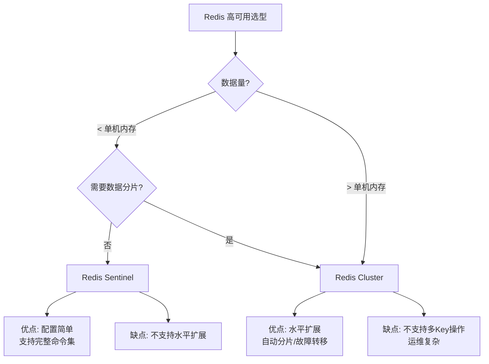

# Redis 企业级缓存运维深度实践

> **适用版本**: Redis 7.2 ~ 8.0  
> **最后更新**: 2026-04-26  
> **难度**: 中级 → 高级

---

<!-- chunk: 概述 -->## 概述

Redis 是全球使用最广泛的内存数据结构存储系统，在企业架构中承担着缓存加速、会话管理、消息队列、实时排行榜、分布式锁、限流器等关键角色。Redis 8.0 引入了多线程 I/O、原生函数支持、增强的 ACL 和模块化架构，使其在保持单线程模型简洁性的同时大幅提升了吞吐量。

企业级 Redis 运维的核心挑战包括：内存管理（OOM 预防、淘汰策略选择、碎片整理）、数据持久化（RDB vs AOF vs 混合持久化的权衡）、高可用架构（Sentinel vs Cluster 的选型决策）、大 Key 与热 Key 的检测与治理、以及缓存一致性策略的设计。本文档从生产环境实践出发，系统覆盖上述所有领域。

Redis 在 K8s 环境中的部署方案多样：简单的单实例 + Sentinel 适合中小规模场景，Redis Cluster 适合需要数据分片的大规模场景，而 Redis Operator（如 OT-CONTAINER-KIT 或 Spotahome）提供了自动化管理能力。选型时需要权衡数据规模、一致性要求、运维复杂度和成本。

## Redis 数据结构与企业应用场景

Redis 提供了丰富的数据结构，每种结构都有其特定的应用场景和性能特征。理解这些数据结构的底层实现对于正确使用 Redis 至关重要。

**String** 是 Redis 最基础的数据类型，底层使用 SDS（Simple Dynamic Strings）实现。String 类型可以存储字符串、整数、浮点数和二进制数据（如图片、序列化对象），最大大小为 512MB。常见应用场景包括缓存 HTML 页面、存储用户 Session、分布式锁（SETNX + EXPIRE）、计数器（INCR/INCRBY）、以及限流器（结合 Lua 脚本实现滑动窗口限流）。对于大量的小 String 对象，Redis 7.0+ 使用 listpack 结构将多个键值对存储在一起，显著降低了内存碎片和 per-key 的内存开销。

**Hash** 适合存储对象属性，类似于 Java 的 HashMap 或 Python 的 dict。Redis 使用两种编码方式：当 field 数量较少且 value 较短时使用 listpack（紧凑内存结构），否则使用 hashtable。Hash 类型非常适合缓存用户资料（user:1001 → {name, email, avatar}）、商品详情和配置信息。使用 `HGETALL` 获取所有字段比多次 `GET` 更高效，因为只需要一次网络往返。

**List** 是一个有序的字符串列表，底层使用 quicklist（双向链表 + listpack）实现。List 适合实现消息队列（LPUSH + BRPOP）、最新消息列表（LPUSH + LTRIM 保持固定长度）和时间线功能。然而，对于需要可靠消息传递的场景，建议使用 Redis Stream（XADD + XREAD），它支持消费者组、消息确认和持久化。

**Set** 是无序的字符串集合，底层使用 intset（整数集合，当所有元素都是整数时）或 hashtable 实现。Set 适合实现标签系统（SADD/SINTER）、共同好友（SINTER）、抽奖系统（SRANDMEMBER/SPOP）和去重（SADD 返回是否已存在）。

**Sorted Set**（ZSET）是 Redis 最强大的数据结构之一，它在 Set 的基础上为每个元素关联一个分数（[[Score|score]]），并按照分数排序。底层使用 listpack（元素较少时）或 skiplist + hashtable（元素较多时）实现。Sorted Set 的典型应用场景包括排行榜（ZINCRBY + ZREVRANGE）、延迟队列（score 存储执行时间戳，ZRANGEBYSCORE 取出到期的任务）、带权重的标签系统和滑动窗口限流。

**Bitmap**、**HyperLogLog** 和 **Geo** 是 Redis 的扩展数据结构。Bitmap 适合实现用户签到（每天一个 bit）、在线状态和布隆过滤器；HyperLogLog 适合基数统计（UV 计数），标准误差为 0.81%，每个键仅占用 12KB 内存；Geo 适合存储地理位置信息并计算距离和范围查询。

除了数据结构本身，Redis 的 Lua 脚本能力是企业级应用的关键工具。通过 `EVAL` 或 `EVALSHA` 执行 Lua 脚本，可以将多个 Redis 操作封装为一个原子操作，避免了多次网络往返和并发竞争问题。典型应用包括分布式锁的加锁/解锁（Redlock 算法）、限流器（滑动窗口）、库存扣减（防止超卖）和分布式 ID 生成。

---

<!-- chunk: 架构设计 -->## 架构设计

## Redis 企业级高可用架构



## Sentinel vs Cluster 选型



---

<!-- chunk: 核心组件配置 -->## 核心组件配置

## Redis 生产配置文件

```ini
# redis.conf - Redis 8.0 生产优化配置
# 适用场景: 32GB 内存 / 主从复制 + Sentinel

# ============================================================
# 网络
# ============================================================
bind 0.0.0.0
port 6379
protected-mode yes
tcp-backlog 511
timeout 300
tcp-keepalive 60
tcp-keepalive-interval 15

# TLS
tls-port 6380
tls-cert-file /etc/redis/tls/redis.crt
tls-key-file /etc/redis/tls/redis.key
tls-ca-cert-file /etc/redis/tls/ca.crt
tls-auth-clients optional
tls-replication yes
tls-cluster yes

# ============================================================
# 通用
# ============================================================
daemonize no
pidfile /var/run/redis/redis-server.pid
loglevel notice
logfile /var/log/redis/redis-server.log
databases 16

# ============================================================
# 内存管理
# ============================================================
maxmemory 24gb
maxmemory-policy allkeys-lru
maxmemory-samples 5
lazyfree-lazy-eviction yes
lazyfree-lazy-expire yes
lazyfree-lazy-server-del yes
replica-lazy-flush yes
lazyfree-lazy-user-del yes
lazyfree-lazy-user-flush yes
activedefrag yes
active-defrag-ignore-bytes 100mb
active-defrag-threshold-lower 10
active-defrag-threshold-upper 100
active-defrag-cycle-min 1
active-defrag-cycle-max 25

# ============================================================
# 持久化 - RDB
# ============================================================
save 900 1
save 300 10
save 60 10000
stop-writes-on-bgsave-error yes
rdbcompression yes
rdbchecksum yes
dbfilename dump.rdb
rdb-del-sync-files no

# ============================================================
# 持久化 - AOF
# ============================================================
appendonly yes
appendfilename "appendonly.aof"
appenddirname "appendonlydir"
appendfsync everysec
no-appendfsync-on-rewrite no
auto-aof-rewrite-percentage 100
auto-aof-rewrite-min-size 64mb
aof-use-rdb-preamble yes
aof-timestamp-enabled yes

# ============================================================
# 复制
# ============================================================
replicaof master-ip 6379
masterauth ${REDIS_PASSWORD}
replica-serve-stale-data yes
replica-read-only yes
replica-ignore-maxmemory no
repl-diskless-sync yes
repl-diskless-sync-delay 5
repl-diskless-sync-max-replicas 2
repl-diskless-load on-empty-db
repl-backlog-size 64mb
repl-backlog-ttl 3600
replica-priority 100
repl-timeout 60
min-replicas-to-write 1
min-replicas-max-lag 10

# ============================================================
# 安全
# ============================================================
requirepass ${REDIS_PASSWORD}
rename-command FLUSHDB ""
rename-command FLUSHALL ""
rename-command DEBUG ""
rename-command CONFIG "CONFIG_SECURED_2026"

# ACL
aclfile /etc/redis/users.acl

# ============================================================
# 客户端
# ============================================================
maxclients 10000
client-output-buffer-limit normal 0 0 0
client-output-buffer-limit replica 256mb 64mb 60
client-output-buffer-limit pubsub 32mb 8mb 60

# ============================================================
# 慢查询日志
# ============================================================
slowlog-log-slower-than 10000
slowlog-max-len 128

# ============================================================
# 延迟监控
# ============================================================
latency-monitor-threshold 100
latency-tracking yes
latency-tracking-info-periodal-seconds 60

# ============================================================
# 事件通知
# ============================================================
notify-keyspace-events "Ex"

# ============================================================
# 性能优化
# ============================================================
io-threads 4
io-threads-do-reads yes
dynamic-hz yes
hz 100

# ============================================================
# 集群（仅在 Cluster 模式启用）
# ============================================================
cluster-enabled no
# cluster-config-file nodes.conf
# cluster-node-timeout 15000
# cluster-announce-ip
# cluster-announce-port 6379
# cluster-announce-bus-port 16379
# cluster-require-full-coverage no
# cluster-migration-barrier 1
# cluster-allow-replica-migration yes
```

## ACL 用户配置

```
# /etc/redis/users.acl - Redis ACL 配置

# 管理员用户
user admin on #hash_password_placeholder ~* &* +@all

# 应用读写用户（仅限 app:* 前缀的键）
user app_user on #hash_password_placeholder ~app:* &app:* +@read +@write +@string +@hash +@list +@set +@sortedset +@bitmap +@hyperloglog +@stream +expire +ttl +del +exists +type +object

# 只读用户
user readonly on #hash_password_placeholder ~* &* +@read -@dangerous

# 监控用户
user monitoring on #hash_password_placeholder ~* &* +info +client +ping +dbsize +lastsave +slowlog +latency +memory +config|get +cluster|info +cluster|nodes

# 备份用户
user backup on #hash_password_placeholder ~* &* +@read +bgsave +lastsave +dbsize +ping +info +client +config|get +debug|object
```

## Sentinel 配置

```ini
# sentinel.conf - Redis Sentinel 生产配置

port 26379
bind 0.0.0.0
daemonize no
loglevel notice
logfile /var/log/redis/sentinel.log
pidfile /var/run/redis/sentinel.pid

sentinel monitor mymaster 192.168.1.100 6379 2
sentinel auth-pass mymaster ${REDIS_PASSWORD}
sentinel auth-user mymaster admin

sentinel down-after-milliseconds mymaster 5000
sentinel failover-timeout mymaster 10000
sentinel parallel-syncs mymaster 1

sentinel resolve-hostnames yes
sentinel announce-ip 192.168.1.200
sentinel announce-port 26379

sentinel notification-script mymaster /etc/redis/scripts/notify.sh
sentinel client-reconfig-script mymaster /etc/redis/scripts/reconfig.sh

# 禁止保护模式
protected-mode no
```

---

<!-- chunk: 性能调优 -->## 性能调优

## 内存计算与优化

```
Redis 内存分配参考（32GB 物理内存）：

maxmemory = 物理内存 × 70% = ~24GB
  （留 30% 给 OS、缓冲区、子进程）

内存消耗估算：
  String: key + value + overhead = key_len + value_len + 96 bytes
  Hash (ziplist): field_count × (field_len + value_len) + 64 bytes
  List (quicklist): element_count × (element_len + 32 bytes) + overhead
  Set (intset): element_count × 8 bytes (整数集合)
  Sorted Set (ziplist): element_count × (member_len + 8 bytes) + overhead

内存碎片率监控：
  mem_fragmentation_ratio = used_memory_rss / used_memory
  < 1.0: Redis 使用了 swap（严重问题）
  1.0 - 1.5: 正常
  > 1.5: 内存碎片较多，需关注
  > 2.0: 开启 activedefrag 整理碎片
```

## 淘汰策略选择

| 策略 | 说明 | 适用场景 |
|:---|:---|:---|
| `noeviction` | 不淘汰，写入报错 | 数据不能丢失的缓存 |
| `allkeys-lru` | 所有键中 LRU 淘汰 | 通用缓存（推荐） |
| `allkeys-lfu` | 所有键中 LFU 淘汰 | 访问频率差异大的缓存 |
| `volatile-lru` | 仅过期键中 LRU 淘汰 | 混合使用 TTL 和永久键 |
| `volatile-lfu` | 仅过期键中 LFU 淘汰 | 同上 |
| `allkeys-random` | 随机淘汰 | 所有键访问概率相近 |
| `volatile-ttl` | 淘汰 TTL 最短的 | 希望保留长期有效的数据 |

## Pipeline 批量操作

```python
import redis
import json
import time

class RedisPipelineOps:
    def __init__(self, host='localhost', port=6379, password=None):
        self.client = redis.Redis(
            host=host, port=port, password=password,
            decode_responses=True, socket_timeout=5
        )

    def batch_set(self, items: dict, ttl: int = None) -> bool:
        pipe = self.client.pipeline(transaction=False)
        for key, value in items.items():
            serialized = json.dumps(value) if isinstance(value, (dict, list)) else value
            if ttl:
                pipe.setex(key, ttl, serialized)
            else:
                pipe.set(key, serialized)
        return all(pipe.execute())

    def batch_get(self, keys: list) -> dict:
        pipe = self.client.pipeline(transaction=False)
        for key in keys:
            pipe.get(key)
        results = pipe.execute()
        output = {}
        for key, value in zip(keys, results):
            if value:
                try:
                    output[key] = json.loads(value)
                except (json.JSONDecodeError, TypeError):
                    output[key] = value
            else:
                output[key] = None
        return output

    def atomic_transfer(self, from_key: str, to_key: str, amount: int) -> bool:
        with self.client.pipeline(transaction=True) as pipe:
            while True:
                try:
                    pipe.watch(from_key)
                    balance = int(pipe.get(from_key) or 0)
                    if balance < amount:
                        pipe.unwatch()
                        return False
                    pipe.multi()
                    pipe.decrby(from_key, amount)
                    pipe.incrby(to_key, amount)
                    pipe.execute()
                    return True
                except redis.WatchError:
                    continue

    def cache_warmup(self, data_source, pattern: str, ttl: int = 3600) -> int:
        pipe = self.client.pipeline(transaction=False)
        count = 0
        for key, value in data_source.items():
            if key.startswith(pattern):
                serialized = json.dumps(value) if isinstance(value, (dict, list)) else value
                pipe.setex(key, ttl, serialized)
                count += 1
                if count % 1000 == 0:
                    pipe.execute()
                    pipe = self.client.pipeline(transaction=False)
        if count % 1000 != 0:
            pipe.execute()
        return count
```

---

<!-- chunk: 高可用与容灾 -->## 高可用与容灾

## Redis Cluster 部署

```bash
#!/bin/bash
# redis_cluster_setup.sh - Redis Cluster 自动化部署

NODES=(
    "redis-0:6379"
    "redis-1:6379"
    "redis-2:6379"
    "redis-3:6379"
    "redis-4:6379"
    "redis-5:6379"
)

PASSWORD="${REDIS_PASSWORD}"
REPLICAS=1

create_cluster() {
    echo "Creating Redis Cluster with ${#NODES[@]} nodes..."
    redis-cli --cluster create \
        ${NODES[@]} \
        --cluster-replicas $REPLICAS \
        --cluster-yes \
        -a "$PASSWORD"

    echo "Cluster created. Verifying..."
    redis-cli -h ${NODES[0]%:*} -p ${NODES[0]#*:} -a "$PASSWORD" cluster info
    redis-cli -h ${NODES[0]%:*} -p ${NODES[0]#*:} -a "$PASSWORD" cluster nodes
}

add_shard() {
    local new_master="${1:?New master node required}"
    local new_slave="${2:-}"
    local existing="${NODES[0]}"

    echo "Adding new shard: $new_master"
    redis-cli --cluster add-node "$new_master" "$existing" -a "$PASSWORD"

    if -n "$new_slave"; then
        local master_id=$(redis-cli -h ${new_master%:*} -p ${new_master#*:} -a "$PASSWORD" cluster myid)
        redis-cli --cluster add-node "$new_slave" "$existing" \
            --cluster-slave --cluster-master-id "$master_id" -a "$PASSWORD"
    fi

    echo "Resharding..."
    redis-cli --cluster reshard "$existing" \
        --cluster-from all --cluster-to $(redis-cli -h ${new_master%:*} -p ${new_master#*:} -a "$PASSWORD" cluster myid) \
        --cluster-slots 1000 --cluster-yes -a "$PASSWORD"
}

failover_test() {
    local target="${NODES[0]}"
    echo "Testing failover for $target..."
    redis-cli -h ${target%:*} -p ${target#*:} -a "$PASSWORD" debug sleep 10

    sleep 15
    redis-cli -h ${target%:*} -p ${target#*:} -a "$PASSWORD" cluster nodes | grep master
}

case "${1:-create}" in
    create)   create_cluster ;;
    addshard) add_shard "${2:?}" "${3:-}" ;;
    failover) failover_test ;;
    *)
        echo "Usage: $0 {create|addshard <master> [slave]|failover}"
        ;;
esac
```

## 跨机房容灾

```yaml
# Redis 跨机房容灾配置
disaster_recovery:
  strategy: "replication_chain"
  dc_primary: "dc1"
  dc_dr: "dc2"

  replication:
    # 使用 Redis Replicaof 异步复制到 DR 机房
    mode: "async"
    heartbeat_interval: "1s"
    replication_backlog: "256mb"

  failover:
    rto: "60 seconds"
    rpo: "1 second"
    procedure:
      - "确认主机房 Redis 不可恢复"
      - "提升 DR 机房 replica 为主"
      - "更新 Sentinel 配置或 DNS"
      - "通知应用层刷新连接"

  consistency:
    min_replicas_to_write: 1
    min_replicas_max_lag: 10
```

---

<!-- chunk: 备份恢复 -->## 备份恢复

## 综合备份方案

> ⚠️ **🟠 高危操作** — 影响业务流量或节点状态，需变更工单+影响评估+计划回滚
> - `systemctl stop/restart`：停止/重启系统服务，影响节点上所有容器

```bash
#!/bin/bash
# redis_backup.sh - Redis 综合备份脚本
set -euo pipefail

BACKUP_DIR="/backup/redis"
DATE=$(date +%Y%m%d_%H%M%S)
REDIS_HOST="${REDIS_HOST:-localhost}"
REDIS_PORT="${REDIS_PORT:-6379}"
REDIS_PASSWORD="${REDIS_PASSWORD}"
S3_BUCKET="s3://company-redis-backup"
RETENTION_DAYS=14

rdb_backup() {
    echo "$(date): Starting RDB backup..."

    redis-cli -h "$REDIS_HOST" -p "$REDIS_PORT" -a "$REDIS_PASSWORD" bgsave

    while true; do
        local status=$(redis-cli -h "$REDIS_HOST" -p "$REDIS_PORT" -a "$REDIS_PASSWORD" info persistence | grep rdb_bgsave_in_progress | tail -1 | cut -d: -f2 | tr -d '[:space:]')
        if "$status" == "0"; then
            break
        fi
        echo "Waiting for bgsave to complete..."
        sleep 2
    done

    local backup_file="${BACKUP_DIR}/rdb_${DATE}.rdb"
    cp /var/lib/redis/dump.rdb "$backup_file"
    md5sum "$backup_file" > "${backup_file}.md5"
    gzip "$backup_file"

    aws s3 cp "${backup_file}.gz" "${S3_BUCKET}/rdb/rdb_${DATE}.rdb.gz" \
        --storage-class STANDARD_IA

    echo "$(date): RDB backup completed"
}

aof_backup() {
    echo "$(date): Starting AOF backup..."

    redis-cli -h "$REDIS_HOST" -p "$REDIS_PORT" -a "$REDIS_PASSWORD" bgrewriteaof
    sleep 10

    local backup_file="${BACKUP_DIR}/aof_${DATE}.aof"
    cp /var/lib/redis/appendonlydir/appendonly.aof "$backup_file"
    md5sum "$backup_file" > "${backup_file}.md5"
    gzip "$backup_file"

    aws s3 cp "${backup_file}.gz" "${S3_BUCKET}/aof/aof_${DATE}.aof.gz"

    echo "$(date): AOF backup completed"
}

restore() {
    local backup_file="${1:?Backup file required}"
    echo "!!! RESTORING Redis from $backup_file !!!"
    read -p "Confirm? (yes/no): " confirm
    "$confirm" != "yes" && exit 0

    systemctl stop redis

    cp /var/lib/redis/dump.rdb "/var/lib/redis/dump.rdb.bak_${DATE}"

    if "$backup_file" == *.gz; then
        gunzip -c "$backup_file" > /var/lib/redis/dump.rdb
    else
        cp "$backup_file" /var/lib/redis/dump.rdb
    fi

    chown redis:redis /var/lib/redis/dump.rdb
    systemctl start redis

    sleep 5
    local key_count=$(redis-cli -h "$REDIS_HOST" -p "$REDIS_PORT" -a "$REDIS_PASSWORD" dbsize)
    echo "Restore completed. Key count: $key_count"
}

cleanup() {
    find "$BACKUP_DIR" -name "*.gz" -mtime +${RETENTION_DAYS} -delete
    find "$BACKUP_DIR" -name "*.md5" -mtime +${RETENTION_DAYS} -delete
}

case "${1:-rdb}" in
    rdb)     rdb_backup ;;
    aof)     aof_backup ;;
    all)     rdb_backup && aof_backup && cleanup ;;
    restore) restore "${2:?}" ;;
    cleanup) cleanup ;;
    *)       echo "Usage: $0 {rdb|aof|all|restore <file>|cleanup}" ;;
esac
```

---

<!-- chunk: 监控告警 -->## 监控告警

## Prometheus 告警规则

```yaml
groups:
  - name: redis.rules
    rules:
      - alert: RedisDown
        expr: redis_up == 0
        for: 1m
        labels:
          severity: critical
          team: dba
        annotations:
          summary: "Redis 实例宕机"
          description: "实例 {{ $labels.instance }} 不可达"

      - alert: RedisMemoryHigh
        expr: redis_memory_used_bytes / redis_memory_max_bytes > 0.85
        for: 5m
        labels:
          severity: warning
          team: dba
        annotations:
          summary: "Redis 内存使用率超过 85%"

      - alert: RedisMemoryCritical
        expr: redis_memory_used_bytes / redis_memory_max_bytes > 0.95
        for: 2m
        labels:
          severity: critical
          team: dba
        annotations:
          summary: "Redis 内存使用率超过 95%，即将触发淘汰"

      - alert: RedisHighFragmentation
        expr: redis_mem_fragmentation_ratio > 2.0
        for: 10m
        labels:
          severity: warning
          team: dba
        annotations:
          summary: "Redis 内存碎片率超过 2.0"

      - alert: RedisRejectedConnections
        expr: irate(redis_rejected_connections_total[5m]) > 0
        for: 2m
        labels:
          severity: critical
          team: dba
        annotations:
          summary: "Redis 拒绝连接，可能达到 maxclients 上限"

      - alert: RedisEvictionsHigh
        expr: irate(redis_evicted_keys_total[5m]) > 100
        for: 5m
        labels:
          severity: warning
          team: dba
        annotations:
          summary: "Redis 淘汰速率过高"

      - alert: RedisHitRateLow
        expr: |
          irate(redis_keyspace_hits_total[5m]) /
          (irate(redis_keyspace_hits_total[5m]) + irate(redis_keyspace_misses_total[5m])) < 0.8
        for: 10m
        labels:
          severity: warning
          team: dba
        annotations:
          summary: "Redis 缓存命中率低于 80%"

      - alert: RedisReplicationBroken
        expr: redis_replication_connected_slaves == 0
        for: 5m
        labels:
          severity: warning
          team: dba
        annotations:
          summary: "Redis 主节点没有连接的从节点"

      - alert: RedisReplicationOffsetDiff
        expr: redis_replication_master_offset - redis_replication_slave_offset > 10485760
        for: 5m
        labels:
          severity: warning
          team: dba
        annotations:
          summary: "Redis 主从复制延迟超过 10MB"

      - alert: RedisBlockedClients
        expr: redis_blocked_clients > 10
        for: 2m
        labels:
          severity: warning
          team: dba
        annotations:
          summary: "Redis 阻塞客户端数量异常"
```

---

<!-- chunk: 运维管理 -->## 运维管理

## 综合运维脚本

```bash
#!/bin/bash
# redis_ops.sh - Redis 运维管理脚本
set -euo pipefail

REDIS_CLI="redis-cli -h ${REDIS_HOST:-localhost} -p ${REDIS_PORT:-6379} -a ${REDIS_PASSWORD}"

cmd_health() {
    echo "=== Redis Health Check $(date) ==="

    echo ""
    echo "--- Server Info ---"
    $REDIS_CLI info server | grep -E "redis_version|uptime_in_days|tcp_port|connected_clients"

    echo ""
    echo "--- Memory ---"
    $REDIS_CLI info memory | grep -E "used_memory_human|maxmemory_human|mem_fragmentation_ratio|used_memory_peak_human"

    echo ""
    echo "--- Stats ---"
    $REDIS_CLI info stats | grep -E "total_connections|total_commands|keyspace_hits|keyspace_misses|evicted_keys|rejected_connections|instantaneous_ops_per_sec"

    echo ""
    echo "--- Replication ---"
    $REDIS_CLI info replication | grep -E "role|connected_slaves|master_repl_offset|slave_repl_offset|master_sync_in_progress"

    echo ""
    echo "--- Keyspace ---"
    $REDIS_CLI info keyspace

    echo ""
    echo "--- Slowlog (Top 10) ---"
    $REDIS_CLI slowlog get 10

    echo ""
    echo "--- Connected Clients ---"
    $REDIS_CLI client list | wc -l
    echo "clients total"
}

cmd_bigkeys() {
    echo "=== Large Key Analysis ==="
    $REDIS_CLI --bigkeys -i 0.1

    echo ""
    echo "--- Top Memory Keys ---"
    $REDIS_CLI --memkeys -i 0.1
}

cmd_analysis() {
    echo "=== Cache Hit Analysis ==="
    local hits=$($REDIS_CLI info stats | grep keyspace_hits | cut -d: -f2 | tr -d '[:space:]')
    local misses=$($REDIS_CLI info stats | grep keyspace_misses | cut -d: -f2 | tr -d '[:space:]')
    local total=$((hits + misses))
    if $total -gt 0; then
        echo "Hits: $hits | Misses: $misses | Hit Rate: $(echo "scale=4; $hits / $total * 100" | bc)%"
    fi
}

case "${1:-health}" in
    health)   cmd_health ;;
    bigkeys)  cmd_bigkeys ;;
    analysis) cmd_analysis ;;
    *)        echo "Usage: $0 {health|bigkeys|analysis}" ;;
esac
```

---

<!-- chunk: 最佳实践 -->## 最佳实践

## 1. 键命名规范

```
格式: 业务:实体:标识符
示例:
  user:profile:12345
  order:detail:ORD-2026-001234
  cache:product:67890
  session:web:abc123
  lock:order:create:12345

TTL 设置:
  会话数据:     30min
  缓存数据:     5min - 1hour
  排行榜:       1day - 7day
  计数器:       1hour - 1day
```

## 2. 大 Key 预防

- String 类型不超过 10KB
- Hash 字段数不超过 5000
- List 元素数不超过 5000
- Set 元素数不超过 5000
- Sorted Set 元素数不超过 5000
- 使用 `redis-cli --bigkeys` 定期扫描
- 使用 `MEMORY USAGE key` 检查单个键内存

## 3. 缓存一致性策略

```
Cache-Aside (推荐):
  读: 先读缓存 → miss → 读DB → 写缓存
  写: 先写DB → 删缓存

延迟双删:
  写DB → 删缓存 → 延迟500ms → 再删缓存

基于 Binlog 的异步更新:
  DB变更 → Debezium → Kafka → 更新Redis
```

---

<!-- chunk: 故障排查 -->## 故障排查

## 常见问题速查表

| 问题现象 | 可能原因 | 排查方法 | 解决方案 |
|:---|:---|:---|:---|
| `OOM command not allowed` | 内存达到 maxmemory | `info memory` 查看 | 增大 maxmemory / 调整淘汰策略 |
| `LOADING Redis is loading` | 正在恢复 RDB/AOF | `info persistence` 查看 | 等待加载完成 |
| `MISCONF Redis is configured to save RDB` | bgsave 失败（磁盘满/权限） | 查看 error log | 清理磁盘、修复权限 |
| 主从不同步 | 网络问题/密码错误 | `info replication` | 检查网络和 masterauth |
| 响应变慢 | 大 Key / 命令阻塞 | `slowlog get` / `--latency` | 拆分大 Key、使用 pipeline |
| 内存碎片率高 | 频繁修改/删除 | `info memory` fragmentation_ratio | 开启 `activedefrag` |
| 连接被拒绝 | maxclients 达上限 | `info clients` | 增大 maxclients、排查连接泄漏 |
| `MOVED 3999 127.0.0.1:6380` | Cluster 重定向 | 客户端需支持 Cluster | 使用 smart client |

---

**文档版本**: v2.0  
**最后更新**: 2026-04-26  
**适用版本**: Redis 7.2 ~ 8.0

---

<!-- chunk: Obsidian 相关文档 -->## Obsidian 相关文档

- domain-28-enterprise-database-middleware KUDIG Database — Global MOC
- [[domain-16-database-middleware/README.md|Domain 16: 企业级数据库与中间件运维 (Enterprise [[Database & Middleware|Database & Middleware]] Op...]]
- Domain-28 企业数据库与中间件 — 开源项目索引
- MySQL 企业级数据库运维管理
- PostgreSQL 企业级数据库高可用架构
- 分布式数据库企业级实践深度指南
- 数据库中间件 Kubernetes 企业级实践
- MongoDB 企业级数据库运维深度实践
- Redis Kubernetes Operator 企业级实践
- Kafka Kubernetes 企业级实践 — Strimzi Operator 深度指南
- CloudNativePG 企业级 PostgreSQL 运维指南

## See Also

- 04-database-middleware-kubernetes
- 05-mongodb-enterprise-database
- 07-redis-kubernetes-operator
- 08-kafka-kubernetes-strimzi
