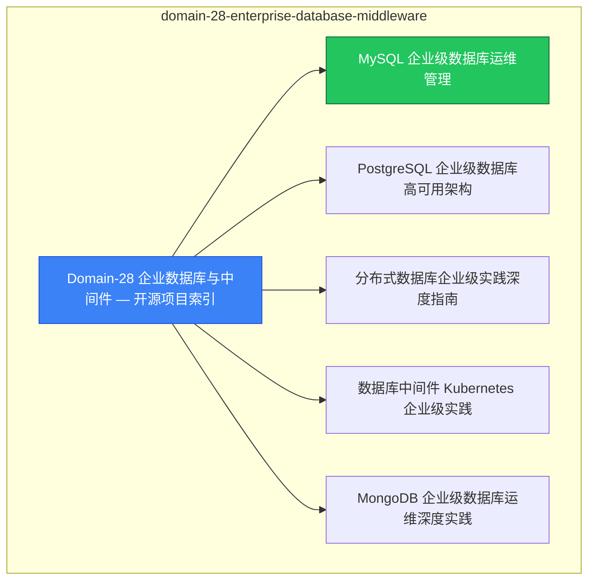

# domain-28-enterprise-database-middleware MOC

> **MOC 版本**: 1.0
> **知识域**: domain-28-enterprise-database-middleware
> **文档数量**: 10 篇
> **最后更新**: 2026-05-21
> **用途**: 本知识域的导航入口，汇总所有相关文档、关联领域、和场景入口

---

## 领域概述

企业数据库中间件 — MySQL、PostgreSQL、Redis on K8s

### 知识域定位

| 维度 | 说明 |
|---|---|
| **知识域** | domain-28-enterprise-database-middleware |
| **文档数量** | 10 篇 |
| **难度分布** | 入门 0 / 进阶 0 / 高级 0 / 专家 0 |

---

## 文档清单

| # | 文档 | 难度 | 标签 | 估计阅读时间 |
|---|---|---|---|---|
| 1 | [[domain-16-database-middleware/00-open-source-projects-index.md|Domain-28 企业数据库与中间件 — 开源项目索引]] |  | database, middleware |  |
| 2 | [[domain-16-database-middleware/01-mysql-enterprise-database.md|MySQL 企业级数据库运维管理]] |  | database, middleware |  |
| 3 | [[domain-16-database-middleware/02-postgresql-enterprise-database.md|PostgreSQL 企业级数据库高可用架构]] |  | database, middleware |  |
| 4 | [[domain-16-database-middleware/03-distributed-database-enterprise.md|分布式数据库企业级实践深度指南]] |  | database, middleware |  |
| 5 | [[domain-16-database-middleware/04-database-middleware-kubernetes.md|数据库中间件 Kubernetes 企业级实践]] |  | database, middleware |  |
| 6 | [[domain-16-database-middleware/05-mongodb-enterprise-database.md|MongoDB 企业级数据库运维深度实践]] |  | database, middleware |  |
| 7 | [[domain-16-database-middleware/06-redis-enterprise-cache.md|Redis 企业级缓存运维深度实践]] |  | database, middleware |  |
| 8 | [[domain-16-database-middleware/07-redis-kubernetes-operator.md|Redis Kubernetes Operator 企业级实践]] |  | database, middleware |  |
| 9 | [[domain-16-database-middleware/08-kafka-kubernetes-strimzi.md|Kafka Kubernetes 企业级实践 — Strimzi Operator 深度指南]] |  | database, middleware |  |
| 10 | [[domain-16-database-middleware/99-cloudnativepg-enterprise-guide.md|CloudNativePG 企业级 PostgreSQL 运维指南]] |  | database, middleware, guide |  |

---

## 知识图谱

---

## 关联入口

| 入口 | 说明 |
|---|---|
| [[../domain-10-troubleshooting-diagnostics/topic-fta/MOC.md|FTA 故障树]] | domain-28-enterprise-database-middleware 相关故障树分析 |
| [[../domain-10-troubleshooting-diagnostics/topic-skills/MOC.md|Skills 技能]] | domain-28-enterprise-database-middleware 相关操作技能 |
| [[../domain-19-landscape-references/topic-index/README.md|深度研究入口]] | 语料库索引与向量检索 |

---

## 统计信息

| 指标 | 数值 |
|---|---|
| 文档总数 | 10 |
| 覆盖 K8s 版本 | v1.25 - v1.32 |

---

*本文档由 scripts/generate-mocs.py 自动生成，最后更新 2026-05-21。*
