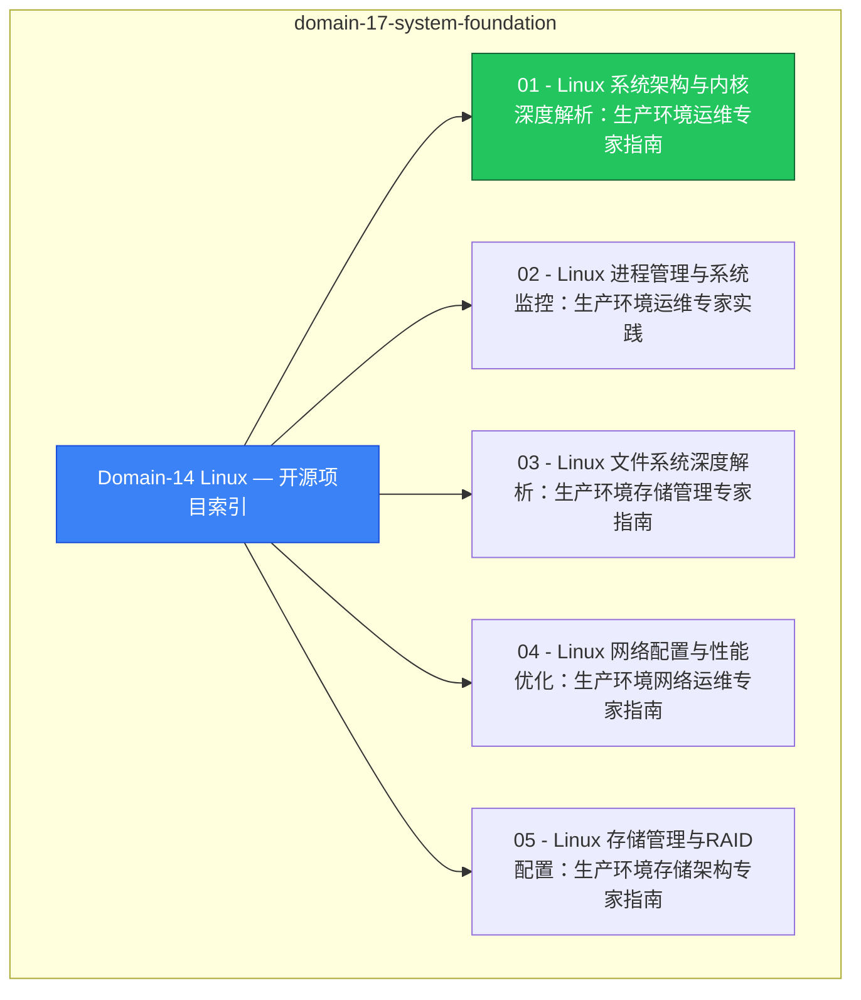

# domain-17-system-foundation MOC

> **MOC 版本**: 1.0
> **知识域**: domain-17-system-foundation
> **文档数量**: 11 篇
> **最后更新**: 2026-05-21
> **用途**: 本知识域的导航入口，汇总所有相关文档、关联领域、和场景入口

---

## 领域概述

Linux 基础 — 系统管理、网络配置、性能调优、安全加固

### 知识域定位

| 维度 | 说明 |
|---|---|
| **知识域** | domain-17-system-foundation |
| **文档数量** | 11 篇 |
| **难度分布** | 入门 0 / 进阶 0 / 高级 0 / 专家 0 |

---

## 文档清单

| # | 文档 | 难度 | 标签 | 估计阅读时间 |
|---|---|---|---|---|
| 1 | [[domain-17-system-foundation/00-open-source-projects-index.md|Domain-14 Linux — 开源项目索引]] |  | linux, system-admin, guide |  |
| 2 | [[domain-17-system-foundation/01-linux-system-architecture.md|01 - Linux 系统架构与内核深度解析：生产环境运维专家指南]] |  | linux, system-admin, guide |  |
| 3 | [[domain-17-system-foundation/02-linux-process-management.md|02 - Linux 进程管理与系统监控：生产环境运维专家实践]] |  | linux, system-admin, guide |  |
| 4 | [[domain-17-system-foundation/03-linux-filesystem-deep-dive.md|03 - Linux 文件系统深度解析：生产环境存储管理专家指南]] |  | linux, system-admin, guide |  |
| 5 | [[domain-17-system-foundation/04-linux-networking-configuration.md|04 - Linux 网络配置与性能优化：生产环境网络运维专家指南]] |  | linux, system-admin, guide |  |
| 6 | [[domain-17-system-foundation/05-linux-storage-management.md|05 - Linux 存储管理与RAID配置：生产环境存储架构专家指南]] |  | linux, system-admin, guide |  |
| 7 | [[domain-17-system-foundation/06-linux-performance-tuning.md|06 - Linux 性能调优与瓶颈分析：生产环境性能优化专家指南]] |  | linux, system-admin, guide |  |
| 8 | [[domain-17-system-foundation/07-linux-security-hardening.md|07 - Linux 安全加固与合规管理：生产环境安全运维专家指南]] |  | linux, system-admin, guide |  |
| 9 | [[domain-17-system-foundation/08-linux-container-fundamentals.md|08 - Linux 容器技术深度解析：生产环境容器运维专家指南]] |  | linux, system-admin, guide |  |
| 10 | [[domain-17-system-foundation/09-linux-operations-basics.md|09 - Linux 运维基础与应急响应：生产环境运维专家实践指南]] |  | linux, system-admin, guide |  |
| 11 | [[domain-17-system-foundation/99-linux-commands-reference.md|Linux 命令大全参考]] |  | linux, system-admin, guide |  |

---

## 知识图谱

---

## 关联入口

| 入口 | 说明 |
|---|---|
| [[../domain-10-troubleshooting-diagnostics/topic-fta/MOC.md|FTA 故障树]] | domain-17-system-foundation 相关故障树分析 |
| [[../domain-10-troubleshooting-diagnostics/topic-skills/MOC.md|Skills 技能]] | domain-17-system-foundation 相关操作技能 |
| [[../domain-19-landscape-references/topic-index/README.md|深度研究入口]] | 语料库索引与向量检索 |

---

## 统计信息

| 指标 | 数值 |
|---|---|
| 文档总数 | 11 |
| 覆盖 K8s 版本 | v1.25 - v1.32 |

---

*本文档由 scripts/generate-mocs.py 自动生成，最后更新 2026-05-21。*
