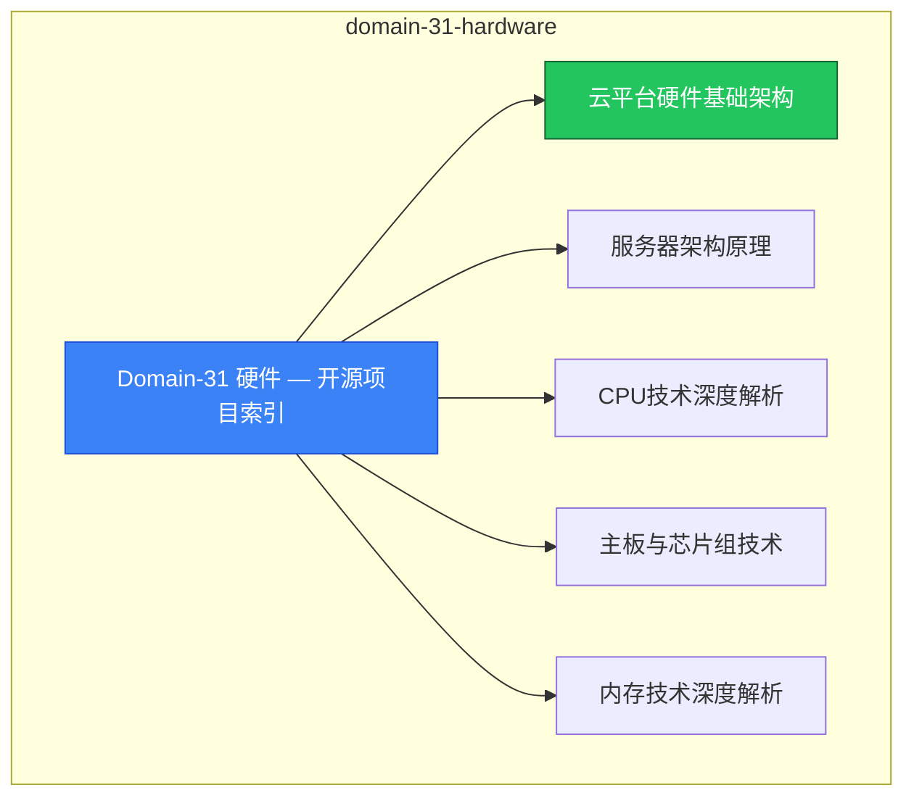

# domain-31-hardware MOC

> **MOC 版本**: 1.0
> **知识域**: domain-31-hardware
> **文档数量**: 19 篇
> **最后更新**: 2026-05-21
> **用途**: 本知识域的导航入口，汇总所有相关文档、关联领域、和场景入口

---

## 领域概述

硬件 — 服务器、网络硬件、存储硬件

### 知识域定位

| 维度 | 说明 |
|---|---|
| **知识域** | domain-31-hardware |
| **文档数量** | 19 篇 |
| **难度分布** | 入门 0 / 进阶 0 / 高级 0 / 专家 0 |

---

## 文档清单

| # | 文档 | 难度 | 标签 | 估计阅读时间 |
|---|---|---|---|---|
| 1 | [[domain-17-system-foundation/00-open-source-projects-index.md|Domain-31 硬件 — 开源项目索引]] |  | hardware |  |
| 2 | [[domain-17-system-foundation/01-cloud-hardware-architecture.md|云平台硬件基础架构]] |  | hardware, architecture |  |
| 3 | [[domain-17-system-foundation/02-server-architecture-principles.md|服务器架构原理]] |  | hardware, architecture |  |
| 4 | [[domain-17-system-foundation/03-cpu-technology-deep-dive.md|CPU技术深度解析]] |  | hardware |  |
| 5 | [[domain-17-system-foundation/04-motherboard-chipset-technology.md|主板与芯片组技术]] |  | hardware |  |
| 6 | [[domain-17-system-foundation/05-memory-technology-deep-dive.md|内存技术深度解析]] |  | hardware |  |
| 7 | [[domain-17-system-foundation/06-storage-hdd-technology.md|机械硬盘技术]] |  | hardware, storage |  |
| 8 | [[domain-17-system-foundation/07-storage-ssd-technology.md|SSD固态硬盘技术]] |  | hardware, storage |  |
| 9 | [[domain-17-system-foundation/08-network-hardware-technology.md|网络硬件技术]] |  | hardware, networking |  |
| 10 | [[domain-17-system-foundation/09-hardware-vendors-ecosystem.md|硬件厂商生态]] |  | hardware |  |
| 11 | [[domain-17-system-foundation/10-hardware-troubleshooting-methodology.md|硬件故障排查方法论]] |  | hardware, troubleshooting |  |
| 12 | [[domain-17-system-foundation/11-cpu-memory-troubleshooting.md|CPU与内存故障排查]] |  | hardware, troubleshooting |  |
| 13 | [[domain-17-system-foundation/12-storage-troubleshooting.md|存储设备故障排查]] |  | hardware, troubleshooting, storage |  |
| 14 | [[domain-17-system-foundation/13-network-hardware-troubleshooting.md|网络硬件故障排查]] |  | hardware, troubleshooting, networking |  |
| 15 | [[domain-17-system-foundation/14-power-thermal-troubleshooting.md|电源与散热故障排查]] |  | hardware, troubleshooting |  |
| 16 | [[domain-17-system-foundation/15-bios-firmware-troubleshooting.md|BIOS与固件故障排查]] |  | hardware, troubleshooting |  |
| 17 | [[domain-17-system-foundation/16-kubernetes-hardware-troubleshooting.md|Kubernetes 运维硬件故障排查专题]] |  | hardware, troubleshooting |  |
| 18 | [[domain-17-system-foundation/17-hardware-error-codes-reference.md|硬件错误码速查大全]] |  | hardware, troubleshooting, reference |  |
| 19 | [[domain-17-system-foundation/18-hardware-failure-case-studies.md|硬件故障实战案例库]] |  | hardware, case-study |  |

---

## 知识图谱

---

## 关联入口

| 入口 | 说明 |
|---|---|
| [[../domain-10-troubleshooting-diagnostics/topic-fta/MOC.md|FTA 故障树]] | domain-31-hardware 相关故障树分析 |
| [[../domain-10-troubleshooting-diagnostics/topic-skills/MOC.md|Skills 技能]] | domain-31-hardware 相关操作技能 |
| [[../domain-19-landscape-references/topic-index/README.md|深度研究入口]] | 语料库索引与向量检索 |

---

## 统计信息

| 指标 | 数值 |
|---|---|
| 文档总数 | 19 |
| 覆盖 K8s 版本 | v1.25 - v1.32 |

---

*本文档由 scripts/generate-mocs.py 自动生成，最后更新 2026-05-21。*
