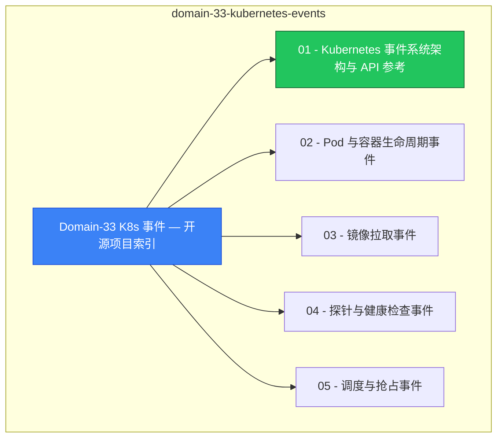

# domain-33-kubernetes-events MOC

> **MOC 版本**: 1.0
> **知识域**: domain-33-kubernetes-events
> **文档数量**: 16 篇
> **最后更新**: 2026-05-21
> **用途**: 本知识域的导航入口，汇总所有相关文档、关联领域、和场景入口

---

## 领域概述

Kubernetes 事件 — 事件模型、事件驱动、事件分析

### 知识域定位

| 维度 | 说明 |
|---|---|
| **知识域** | domain-33-kubernetes-events |
| **文档数量** | 16 篇 |
| **难度分布** | 入门 0 / 进阶 0 / 高级 0 / 专家 0 |

---

## 文档清单

| # | 文档 | 难度 | 标签 | 估计阅读时间 |
|---|---|---|---|---|
| 1 | [[domain-17-system-foundation/00-open-source-projects-index.md|Domain-33 K8s 事件 — 开源项目索引]] |  | k8s, events |  |
| 2 | [[domain-17-system-foundation/01-event-system-architecture.md|01 - Kubernetes 事件系统架构与 API 参考]] |  | k8s, events, architecture |  |
| 3 | [[domain-17-system-foundation/02-pod-container-lifecycle-events.md|02 - Pod 与容器生命周期事件]] |  | k8s, events |  |
| 4 | [[domain-17-system-foundation/03-image-pull-events.md|03 - 镜像拉取事件]] |  | k8s, events |  |
| 5 | [[domain-17-system-foundation/04-probe-health-check-events.md|04 - 探针与健康检查事件]] |  | k8s, events |  |
| 6 | [[domain-17-system-foundation/05-scheduling-preemption-events.md|05 - 调度与抢占事件]] |  | k8s, events |  |
| 7 | [[domain-17-system-foundation/06-node-lifecycle-condition-events.md|06 - 节点生命周期与状态事件]] |  | k8s, events |  |
| 8 | [[domain-17-system-foundation/07-deployment-replicaset-events.md|07 - Deployment 与 ReplicaSet 控制器事件]] |  | k8s, events, deployment |  |
| 9 | [[domain-17-system-foundation/08-statefulset-daemonset-events.md|08 - StatefulSet 与 DaemonSet 控制器事件]] |  | k8s, events |  |
| 10 | [[domain-17-system-foundation/09-job-cronjob-batch-events.md|09 - Job 与 CronJob 批处理事件]] |  | k8s, events |  |
| 11 | [[domain-17-system-foundation/10-service-networking-events.md|10 - Service 与网络事件]] |  | k8s, events, networking |  |
| 12 | [[domain-17-system-foundation/11-storage-volume-events.md|11 - 存储与卷事件]] |  | k8s, events, storage |  |
| 13 | [[domain-17-system-foundation/12-autoscaling-events.md|12 - 自动扩缩容事件 (HPA / VPA / Cluster Autoscaler)]] |  | k8s, events |  |
| 14 | [[domain-17-system-foundation/13-security-admission-rbac-events.md|13 - 安全、准入控制与 RBAC 事件]] |  | k8s, events, security |  |
| 15 | [[domain-17-system-foundation/14-namespace-resource-gc-events.md|14 - Namespace、资源管理与垃圾回收事件]] |  | k8s, events |  |
| 16 | [[domain-17-system-foundation/15-ecosystem-addon-events.md|15 - 生态系统与插件事件]] |  | k8s, events |  |

---

## 知识图谱

---

## 关联入口

| 入口 | 说明 |
|---|---|
| [[../domain-10-troubleshooting-diagnostics/topic-fta/MOC.md|FTA 故障树]] | domain-33-kubernetes-events 相关故障树分析 |
| [[../domain-10-troubleshooting-diagnostics/topic-skills/MOC.md|Skills 技能]] | domain-33-kubernetes-events 相关操作技能 |
| [[../domain-19-landscape-references/topic-index/README.md|深度研究入口]] | 语料库索引与向量检索 |

---

## 统计信息

| 指标 | 数值 |
|---|---|
| 文档总数 | 16 |
| 覆盖 K8s 版本 | v1.25 - v1.32 |

---

*本文档由 scripts/generate-mocs.py 自动生成，最后更新 2026-05-21。*
