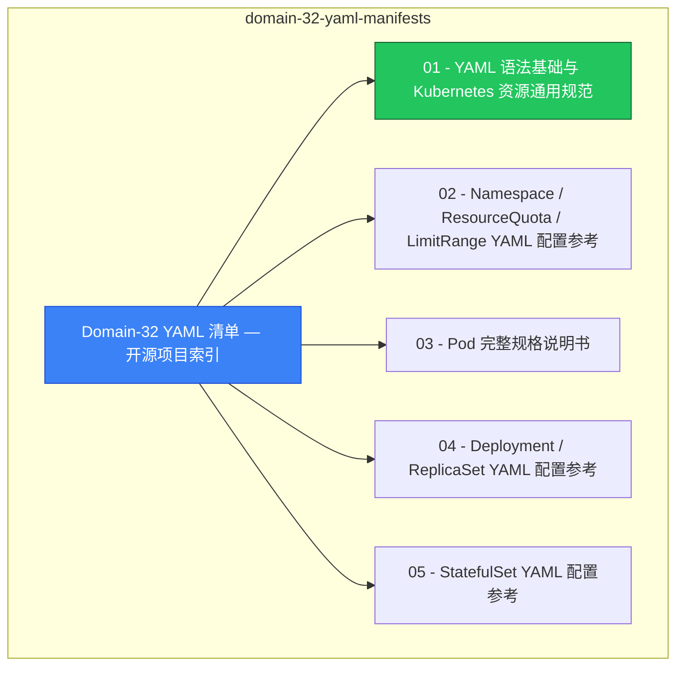

# domain-32-yaml-manifests MOC

> **MOC 版本**: 1.0
> **知识域**: domain-32-yaml-manifests
> **文档数量**: 37 篇
> **最后更新**: 2026-05-21
> **用途**: 本知识域的导航入口，汇总所有相关文档、关联领域、和场景入口

---

## 领域概述

YAML 清单 — 资源清单编写规范、最佳实践

### 知识域定位

| 维度 | 说明 |
|---|---|
| **知识域** | domain-32-yaml-manifests |
| **文档数量** | 37 篇 |
| **难度分布** | 入门 0 / 进阶 0 / 高级 0 / 专家 0 |

---

## 文档清单

| # | 文档 | 难度 | 标签 | 估计阅读时间 |
|---|---|---|---|---|
| 1 | [[domain-18-manifests-patterns/00-open-source-projects-index.md|Domain-32 YAML 清单 — 开源项目索引]] |  | yaml, reference |  |
| 2 | [[domain-18-manifests-patterns/01-yaml-syntax-resource-conventions.md|01 - YAML 语法基础与 Kubernetes 资源通用规范]] |  | yaml, reference |  |
| 3 | [[domain-18-manifests-patterns/02-namespace-resourcequota-limitrange.md|02 - Namespace / ResourceQuota / LimitRange YAML 配置参考]] |  | yaml, reference |  |
| 4 | [[domain-18-manifests-patterns/03-pod-specification-complete.md|03 - Pod 完整规格说明书]] |  | yaml, reference |  |
| 5 | [[domain-18-manifests-patterns/04-deployment-replicaset.md|04 - Deployment / ReplicaSet YAML 配置参考]] |  | yaml, reference, deployment |  |
| 6 | [[domain-18-manifests-patterns/05-statefulset-reference.md|05 - StatefulSet YAML 配置参考]] |  | yaml, reference |  |
| 7 | [[domain-18-manifests-patterns/06-daemonset-reference.md|06 - DaemonSet YAML 配置参考]] |  | yaml, reference |  |
| 8 | [[domain-18-manifests-patterns/07-job-cronjob-reference.md|07 - Job / CronJob YAML 配置参考]] |  | yaml, reference |  |
| 9 | [[domain-18-manifests-patterns/08-service-all-types.md|08 - Service 全类型 YAML 配置参考]] |  | yaml, reference |  |
| 10 | [[domain-18-manifests-patterns/09-endpoints-endpointslice.md|09 - Endpoints / EndpointSlice YAML 配置参考]] |  | yaml, reference |  |
| 11 | [[domain-18-manifests-patterns/10-ingress-ingressclass.md|10 - Ingress / IngressClass YAML 配置参考]] |  | yaml, reference |  |
| 12 | [[domain-18-manifests-patterns/11-gateway-api-core.md|11 - Gateway API 核心资源 YAML 配置参考]] |  | yaml, reference |  |
| 13 | [[domain-18-manifests-patterns/12-gateway-api-advanced-routes.md|12 - Gateway API 高级路由 YAML 配置参考]] |  | yaml, reference |  |
| 14 | [[domain-18-manifests-patterns/13-configmap-reference.md|13 - ConfigMap YAML 配置参考]] |  | yaml, reference, configuration |  |
| 15 | [[domain-18-manifests-patterns/14-secret-all-types.md|14 - Secret 全类型 YAML 配置参考]] |  | yaml, reference |  |
| 16 | [[domain-18-manifests-patterns/15-persistentvolume-reference.md|15 - PersistentVolume YAML 配置参考]] |  | yaml, reference |  |
| 17 | [[domain-18-manifests-patterns/16-persistentvolumeclaim-reference.md|16 - PersistentVolumeClaim YAML 配置参考]] |  | yaml, reference |  |
| 18 | [[domain-18-manifests-patterns/17-storageclass-volumesnapshot.md|17 - StorageClass / VolumeSnapshot YAML 配置参考]] |  | yaml, reference, storage |  |
| 19 | [[domain-18-manifests-patterns/18-csi-driver-resources.md|18 - CSI 驱动资源 YAML 配置参考]] |  | yaml, reference |  |
| 20 | [[domain-18-manifests-patterns/19-serviceaccount-token.md|19 - ServiceAccount / Token 管理 YAML 配置参考]] |  | yaml, reference |  |
| 21 | [[domain-18-manifests-patterns/20-rbac-role-rolebinding.md|20 - Role / RoleBinding YAML 配置参考]] |  | yaml, reference, rbac |  |
| 22 | [[domain-18-manifests-patterns/21-rbac-clusterrole-clusterrolebinding.md|21 - ClusterRole / ClusterRoleBinding YAML 配置参考]] |  | yaml, reference, rbac |  |
| 23 | [[domain-18-manifests-patterns/22-networkpolicy-reference.md|22 - NetworkPolicy YAML 配置参考]] |  | yaml, reference, networking |  |
| 24 | [[domain-18-manifests-patterns/23-pod-security-standards.md|23 - Pod Security Standards (PSS/PSA) YAML 配置参考]] |  | yaml, reference, security |  |
| 25 | [[domain-18-manifests-patterns/24-admission-webhook-configuration.md|24 - Admission Webhook 配置参考]] |  | yaml, reference, configuration |  |
| 26 | [[domain-18-manifests-patterns/25-validatingadmissionpolicy.md|25 - ValidatingAdmissionPolicy YAML 配置参考]] |  | yaml, reference |  |
| 27 | [[domain-18-manifests-patterns/26-priorityclass-runtimeclass.md|26 - PriorityClass / RuntimeClass YAML 配置参考]] |  | yaml, reference |  |
| 28 | [[domain-18-manifests-patterns/27-hpa-autoscaling-v2.md|27 - HorizontalPodAutoscaler v2 YAML 配置参考]] |  | yaml, reference |  |
| 29 | [[domain-18-manifests-patterns/28-poddisruptionbudget-reference.md|28 - PodDisruptionBudget YAML 配置参考]] |  | yaml, reference |  |
| 30 | [[domain-18-manifests-patterns/29-customresourcedefinition.md|29 - CustomResourceDefinition (CRD) YAML 配置参考]] |  | yaml, reference |  |
| 31 | [[domain-18-manifests-patterns/30-apiservice-aggregation.md|30 - APIService YAML 配置参考]] |  | yaml, reference |  |
| 32 | [[domain-18-manifests-patterns/31-api-priority-fairness.md|31 - FlowSchema / PriorityLevelConfiguration YAML 配置参考]] |  | yaml, reference |  |
| 33 | [[domain-18-manifests-patterns/32-lease-event-node.md|32 - Lease / Event / Node YAML 配置参考]] |  | yaml, reference |  |
| 34 | [[domain-18-manifests-patterns/33-kubeadm-cluster-bootstrap.md|33 - kubeadm 集群引导配置 YAML 参考]] |  | yaml, reference |  |
| 35 | [[domain-18-manifests-patterns/34-component-configuration.md|34. Kubernetes 组件配置（Component Configuration）]] |  | yaml, reference, configuration |  |
| 36 | [[domain-18-manifests-patterns/35-advanced-pod-patterns.md|35 - 高级 Pod 模式与调度策略 YAML 配置参考]] |  | yaml, reference |  |
| 37 | [[domain-18-manifests-patterns/36-ecosystem-kustomize-helm-argocd.md|36 - 生态工具 (Kustomize / Helm / ArgoCD) YAML 配置参考]] |  | yaml, reference |  |

---

## 知识图谱

---

## 关联入口

| 入口 | 说明 |
|---|---|
| [[../domain-10-troubleshooting-diagnostics/topic-fta/MOC.md|FTA 故障树]] | domain-32-yaml-manifests 相关故障树分析 |
| [[../domain-10-troubleshooting-diagnostics/topic-skills/MOC.md|Skills 技能]] | domain-32-yaml-manifests 相关操作技能 |
| [[../domain-19-landscape-references/topic-index/README.md|深度研究入口]] | 语料库索引与向量检索 |

---

## 统计信息

| 指标 | 数值 |
|---|---|
| 文档总数 | 37 |
| 覆盖 K8s 版本 | v1.25 - v1.32 |

---

*本文档由 scripts/generate-mocs.py 自动生成，最后更新 2026-05-21。*
