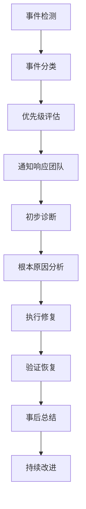

# 23. 事件响应处理 (Incident Response Handling)

> **适用范围**: Kubernetes v1.25-v1.32 | **更新时间**: 2024年 | **预计阅读时间**: 45分钟

## 📋 章节概览

本章节详细介绍Kubernetes生产环境中事件响应和处理的最佳实践，涵盖SRE理念、故障处理流程、根因分析和持续改进机制。

---

## 1. SRE理念与事件管理

### 1.1 Site Reliability Engineering核心原则

#### Google SRE三大支柱
```yaml
可靠性工程核心理念:
  服务级别目标(SLO):
    - 用户体验量化标准
    - 错误预算管理
    - 可接受的风险水平
  
  监控与告警:
    - 黄金信号监控
    - 智能告警策略
    - 告警疲劳预防
  
  自动化与工具化:
    - 故障自愈能力
    - 运维效率提升
    - 人机协作优化
```

#### SRE vs 传统运维对比
| 维度 | 传统运维 | SRE |
|------|----------|-----|
| 关注点 | 系统稳定性 | 用户体验 |
| 衡量标准 | 系统正常运行时间 | 服务质量指标 |
| 处理方式 | 被动响应 | 主动预防 |
| 自动化程度 | 手工操作为主 | 高度自动化 |

### 1.2 事件分级与响应标准

#### 事件严重性等级定义
```yaml
事件分级标准:
  P0 - 紧急:
    影响范围: 全局服务中断
    响应时间: 15分钟内响应
    解决时限: 2小时内恢复
    
  P1 - 高优先级:
    影响范围: 核心功能受损
    响应时间: 30分钟内响应
    解决时限: 4小时内恢复
    
  P2 - 中等优先级:
    影响范围: 部分功能异常
    响应时间: 2小时内响应
    解决时限: 24小时内解决
    
  P3 - 低优先级:
    影响范围: 轻微影响
    响应时间: 8小时内响应
    解决时限: 72小时内解决
```

#### Kubernetes特定事件分类
```bash
# 集群层面事件
kubectl get events --all-namespaces --field-selector type!=Normal

# Pod相关事件筛选
kubectl get events --field-selector involvedObject.kind=Pod

# Node相关事件
kubectl get events --field-selector involvedObject.kind=Node
```

---

## 2. 事件响应流程

### 2.1 标准事件响应流程

#### ITIL事件管理流程


#### 详细响应步骤
```yaml
事件响应阶段:
  第一阶段 - 检测与通知:
    - 监控系统触发告警
    - 自动创建事件工单
    - 通知相关人员
    
  第二阶段 - 评估与分类:
    - 确认事件真实性
    - 评估影响范围
    - 确定优先级等级
    
  第三阶段 - 响应与沟通:
    - 组建应急响应团队
    - 建立沟通渠道
    - 定期状态更新
    
  第四阶段 - 诊断与修复:
    - 收集诊断信息
    - 制定修复方案
    - 执行修复操作
    
  第五阶段 - 验证与关闭:
    - 验证服务恢复正常
    - 更新事件状态
    - 关闭事件工单
```

### 2.2 Kubernetes事件处理实战

#### 事件信息收集脚本
```bash
#!/bin/bash
# incident-collector.sh - 事件信息自动收集脚本

CLUSTER_NAME=$(kubectl config current-context)
TIMESTAMP=$(date -u +"%Y%m%d_%H%M%S")

# 创建事件收集目录
INCIDENT_DIR="/tmp/incident_${TIMESTAMP}"
mkdir -p ${INCIDENT_DIR}

echo "开始收集事件信息..."
echo "集群: ${CLUSTER_NAME}"
echo "时间戳: ${TIMESTAMP}"

# 1. 集群基本信息
kubectl cluster-info > ${INCIDENT_DIR}/cluster-info.txt 2>&1
kubectl get nodes -o wide > ${INCIDENT_DIR}/nodes-status.txt 2>&1

# 2. 事件收集
kubectl get events --all-namespaces --sort-by='.lastTimestamp' > ${INCIDENT_DIR}/events-all.txt
kubectl get events --all-namespaces --field-selector type=Warning > ${INCIDENT_DIR}/events-warning.txt

# 3. Pod状态
kubectl get pods --all-namespaces --field-selector=status.phase!=Running > ${INCIDENT_DIR}/pods-non-running.txt
kubectl get pods --all-namespaces | grep -E "(CrashLoopBackOff|Error|Pending)" > ${INCIDENT_DIR}/pods-problematic.txt

# 4. 系统组件状态
kubectl get componentstatuses > ${INCIDENT_DIR}/component-status.txt 2>&1
kubectl top nodes > ${INCIDENT_DIR}/node-resources.txt 2>&1
kubectl top pods --all-namespaces > ${INCIDENT_DIR}/pod-resources.txt 2>&1

# 5. 日志收集
echo "收集关键组件日志..."
kubectl logs -n kube-system -l component=kube-apiserver --tail=1000 > ${INCIDENT_DIR}/apiserver-logs.txt 2>&1
kubectl logs -n kube-system -l component=kube-controller-manager --tail=1000 > ${INCIDENT_DIR}/controller-logs.txt 2>&1
kubectl logs -n kube-system -l component=kube-scheduler --tail=1000 > ${INCIDENT_DIR}/scheduler-logs.txt 2>&1

# 6. 网络状态
kubectl get svc --all-namespaces > ${INCIDENT_DIR}/services.txt
kubectl get endpoints --all-namespaces > ${INCIDENT_DIR}/endpoints.txt
kubectl get ingress --all-namespaces > ${INCIDENT_DIR}/ingresses.txt

# 7. 存储状态
kubectl get pv > ${INCIDENT_DIR}/persistent-volumes.txt
kubectl get pvc --all-namespaces > ${INCIDENT_DIR}/persistent-volume-claims.txt

# 打包收集结果
tar -czf "/tmp/incident_${TIMESTAMP}.tar.gz" -C /tmp "incident_${TIMESTAMP}"
rm -rf ${INCIDENT_DIR}

echo "事件信息收集完成: /tmp/incident_${TIMESTAMP}.tar.gz"
```

#### 事件快速诊断命令集
```bash
# 快速健康检查
alias khealth='kubectl get nodes && kubectl get pods --all-namespaces'

# 事件实时监控
alias kevents='watch -n 5 "kubectl get events --all-namespaces --sort-by=.lastTimestamp | tail -20"'

# Pod问题诊断
alias kpods-problem='kubectl get pods --all-namespaces --field-selector=status.phase!=Running'

# 资源压力检查
alias kpressure='kubectl top nodes && kubectl top pods --all-namespaces'
```

---

## 3. 根本原因分析(RCA)

### 3.1 RCA方法论

#### 5 Whys分析法
```markdown
问题: API Server响应缓慢

1. 为什么API Server慢？因为etcd响应时间增加
2. 为什么etcd响应慢？因为磁盘I/O延迟高
3. 为什么磁盘I/O延迟高？因为磁盘空间不足
4. 为什么磁盘空间不足？因为日志文件未清理
5. 为什么日志未清理？因为缺少自动清理策略

根本原因: 缺少etcd日志自动清理机制
解决方案: 配置etcd自动压缩和日志轮转
```

#### 鱼骨图分析法
```
API Server性能问题
├── 人员因素
│   ├── 配置错误
│   └── 操作失误
├── 流程因素
│   ├── 缺少监控
│   └── 告警不及时
├── 技术因素
│   ├── 资源不足
│   ├── 版本bug
│   └── 网络问题
└── 环境因素
    ├── 硬件故障
    └── 云服务商问题
```

### 3.2 Kubernetes常见故障模式

#### 控制平面故障
```yaml
故障类型:
  API Server故障:
    症状: kubectl命令失败，集群不可访问
    常见原因:
      - 证书过期
      - 资源耗尽
      - 配置错误
    诊断命令:
      kubectl get componentstatuses
      systemctl status kube-apiserver
      
  etcd故障:
    症状: 数据读写失败，集群状态不一致
    常见原因:
      - 磁盘空间满
      - 网络分区
      - 成员节点故障
    诊断命令:
      etcdctl endpoint health
      etcdctl member list
      
  Controller Manager故障:
    症状: Deployment不工作，服务无法调度
    常见原因:
      - 权限配置错误
      - 资源竞争
      - 版本兼容问题
    诊断命令:
      kubectl logs -n kube-system -l component=kube-controller-manager
```

#### 工作节点故障
```yaml
故障类型:
  Node NotReady:
    症状: 节点状态显示NotReady
    常见原因:
      - kubelet服务停止
      - 网络连接问题
      - 资源耗尽
    诊断命令:
      systemctl status kubelet
      journalctl -u kubelet
      
  Pod驱逐:
    症状: Pod被意外终止并重新调度
    常见原因:
      - 内存压力
      - 磁盘压力
      - 节点维护
    诊断命令:
      kubectl describe node <node-name>
      kubectl get events --field-selector involvedObject.name=<node-name>
      
  CNI网络故障:
    症状: Pod间通信失败，DNS解析异常
    常见原因:
      - CNI插件配置错误
      - 网络策略冲突
      - IP地址耗尽
    诊断命令:
      kubectl exec -it <pod> -- ping <other-pod-ip>
      ip route show
```

---

## 4. 事后总结与改进

### 4.1 事件复盘会议

#### 复盘会议流程
```markdown
事件复盘标准流程:

1. 事前准备 (会前1天)
   - 收集事件相关资料
   - 准备时间线梳理
   - 确定参会人员

2. 会议进行 (90分钟)
   - 事件回顾 (15分钟)
   - 时间线梳理 (20分钟)
   - 根因分析 (25分钟)
   - 改进措施讨论 (20分钟)
   - 行动计划确认 (10分钟)

3. 会后跟进
   - 编写复盘报告
   - 跟踪改进措施执行
   - 更新应急预案
```

#### 复盘报告模板
```markdown
# 事件复盘报告

## 基本信息
- 事件编号: INC-2024-001
- 发生时间: 2024-01-15 14:30 UTC
- 恢复时间: 2024-01-15 16:45 UTC
- 影响时长: 2小时15分钟
- 影响范围: 生产环境50%服务能力

## 事件时间线
```

### 4.2 持续改进机制

#### 改进措施跟踪系统
```yaml
改进措施管理:
  记录格式:
    - 问题描述
    - 根本原因
    - 解决方案
    - 责任人
    - 完成期限
    - 验证方法
    
  跟踪周期:
    - 周报: 进度更新
    - 月报: 效果评估
    - 季度: 整体回顾
```

#### 预防措施实施
```bash
# 自动化检查脚本
#!/bin/bash
# preventive-checks.sh

echo "执行预防性检查..."

# 1. 证书有效期检查
CERT_EXPIRY=$(openssl x509 -in /etc/kubernetes/pki/apiserver.crt -noout -enddate)
echo "API Server证书到期时间: ${CERT_EXPIRY}"

# 2. 磁盘空间检查
DISK_USAGE=$(df -h /var/lib/etcd | awk 'NR==2 {print $5}' | sed 's/%//')
if [ ${DISK_USAGE} -gt 80 ]; then
    echo "警告: etcd磁盘使用率过高 (${DISK_USAGE}%)"
fi

# 3. Pod重启次数检查
RESTARTING_PODS=$(kubectl get pods --all-namespaces -o jsonpath='{range .items[*]}{.metadata.name}{" "}{.status.containerStatuses[*].restartCount}{"\n"}{end}' | awk '$2 > 10 {print $1}')

if [ -n "${RESTARTING_PODS}" ]; then
    echo "发现频繁重启的Pod:"
    echo "${RESTARTING_PODS}"
fi

echo "预防性检查完成"
```

---

## 5. 事件管理系统集成

### 5.1 告警与工单系统

#### Prometheus告警规则示例
```yaml
# alert-rules.yaml
groups:
- name: incident.rules
  rules:
  # 高优先级告警
  - alert: ClusterDown
    expr: up == 0
    for: 2m
    labels:
      severity: critical
      team: sre
    annotations:
      summary: "集群组件宕机"
      description: "{{ $labels.instance }} 组件已宕机超过2分钟"

  - alert: HighCPUUsage
    expr: rate(container_cpu_usage_seconds_total[5m]) > 0.9
    for: 5m
    labels:
      severity: warning
      team: sre
    annotations:
      summary: "CPU使用率过高"
      description: "容器CPU使用率超过90%"

  # 自动创建事件工单
  - alert: ServiceDegraded
    expr: probe_success == 0
    for: 3m
    labels:
      severity: major
      team: sre
      create_ticket: "true"
    annotations:
      summary: "服务降级"
      description: "服务 {{ $labels.service }} 不可用"
```

#### ServiceNow集成示例
```python
# servicenow_integration.py
import requests
import json
from datetime import datetime

class IncidentManager:
    def __init__(self, instance_url, username, password):
        self.base_url = f"https://{instance_url}/api/now/table/incident"
        self.auth = (username, password)
        self.headers = {
            'Content-Type': 'application/json',
            'Accept': 'application/json'
        }
    
    def create_incident(self, alert_data):
        """根据告警数据创建ServiceNow事件"""
        incident_data = {
            'short_description': alert_data['alertname'],
            'description': alert_data['description'],
            'urgency': self._map_severity(alert_data['severity']),
            'impact': '2',  # 中等影响
            'assignment_group': 'SRE Team',
            'caller_id': 'kubernetes_monitoring'
        }
        
        response = requests.post(
            self.base_url,
            auth=self.auth,
            headers=self.headers,
            data=json.dumps(incident_data)
        )
        
        if response.status_code == 201:
            return response.json()['result']['number']
        else:
            raise Exception(f"创建事件失败: {response.text}")
    
    def _map_severity(self, severity):
        """映射告警级别到ServiceNow紧急度"""
        mapping = {
            'critical': '1',  # 高
            'warning': '2',   # 中
            'info': '3'       # 低
        }
        return mapping.get(severity, '3')

# 使用示例
manager = IncidentManager('your-instance.service-now.com', 'username', 'password')
incident_number = manager.create_incident({
    'alertname': 'HighMemoryUsage',
    'description': 'Node memory usage exceeded 90%',
    'severity': 'warning'
})
print(f"创建事件工单: {incident_number}")
```

### 5.2 自动化响应机制

#### ChatOps机器人集成
```yaml
# chatbot-config.yaml
chatbot:
  name: "K8s-SRE-Bot"
  channels:
    - name: "production-alerts"
      type: "slack"
    - name: "incident-response"
      type: "teams"
  
  commands:
    - name: "incident_status"
      description: "查询当前事件状态"
      trigger: "/status"
      script: |
        #!/bin/bash
        kubectl get events --sort-by=.lastTimestamp | tail -10
        
    - name: "incident_acknowledge"
      description: "确认处理事件"
      trigger: "/ack"
      script: |
        #!/bin/bash
        INCIDENT_ID=$1
        echo "事件 ${INCIDENT_ID} 已被 ${USER} 确认处理"
        
    - name: "incident_escalate"
      description: "升级事件"
      trigger: "/escalate"
      script: |
        #!/bin/bash
        INCIDENT_ID=$1
        # 触发电话告警
        /usr/local/bin/phone-alert.sh ${INCIDENT_ID}
```

---

## 6. 最佳实践总结

### 6.1 关键成功因素

#### 组织层面
✅ **建立SRE文化**: 将可靠性作为核心价值
✅ **跨团队协作**: 开发、运维、安全团队紧密配合
✅ **投资自动化**: 减少人工干预，提高响应速度
✅ **持续学习**: 定期复盘，不断优化流程

#### 技术层面
✅ **全面监控**: 覆盖所有关键组件和服务
✅ **智能告警**: 减少噪音，提高告警准确性
✅ **快速诊断**: 标准化的诊断工具和流程
✅ **自动化修复**: 对于已知问题实现自动恢复

### 6.2 常见陷阱避免

#### ❌ 避免的做法
- 依赖个人经验而非标准化流程
- 忽视告警疲劳问题
- 缺少事后总结和改进
- 过度依赖手工操作

#### ✅ 推荐做法
- 建立完善的事件响应手册
- 实施告警分级和路由机制
- 定期进行故障演练
- 持续优化自动化工具链

---

## 📚 参考资源

### 官方文档
- [Google SRE Workbook](https://sre.google/workbook/)
- [Kubernetes故障排查指南](https://kubernetes.io/docs/tasks/debug/)
- [Prometheus告警最佳实践](https://prometheus.io/docs/practices/alerting/)

### 工具推荐
- **事件管理**: PagerDuty, Opsgenie, ServiceNow
- **协作工具**: Slack, Microsoft Teams, Discord
- **文档管理**: Confluence, Notion, Wiki系统

### 社区资源
- CNCF SRE工作组
- Kubernetes SIG Instrumentation
- DevOps Institute认证课程

---
*本文档由Kubernetes生产运维专家团队维护*