# 24. 容量规划与预测 (Capacity Planning & Forecasting)

> **适用范围**: Kubernetes v1.25-v1.32 | **更新时间**: 2024年 | **预计阅读时间**: 50分钟

## 📋 章节概览

本章节深入探讨Kubernetes环境下的容量规划方法论，包括资源需求预测、扩容策略制定、容量优化和成本效益分析等核心内容。

---

## 1. 容量规划基础理论

### 1.1 容量规划核心概念

#### 容量规划定义与目标
```yaml
容量规划核心要素:
  资源维度:
    计算资源: CPU、内存、GPU
    存储资源: 持久化存储、临时存储
    网络资源: 带宽、连接数
    人力资源: 运维人员、开发人员
    
  时间维度:
    短期规划: 3-6个月
    中期规划: 6-12个月
    长期规划: 1-3年
    
  规划目标:
    - 确保业务连续性
    - 优化成本效益比
    - 支持业务增长需求
    - 预防性能瓶颈
```

#### 容量规划生命周期

```mermaid
graph LR
    A[需求分析] --> B[现状评估]
    B --> C[趋势预测]
    C --> D[方案设计]
    D --> E[实施部署]
    E --> F[效果监控]
    F --> G[持续优化]
    G --> A
```


### 1.2 Kubernetes资源模型

#### 资源请求与限制
```yaml
# 资源配置示例
apiVersion: v1
kind: Pod
metadata:
  name: capacity-demo
spec:
  containers:
  - name: app
    image: nginx
    resources:
      requests:
        cpu: "100m"      # 请求100毫核
        memory: "128Mi"  # 请求128MB内存
      limits:
        cpu: "200m"      # 限制200毫核
        memory: "256Mi"  # 限制256MB内存
```

#### 资源计量单位说明
```bash
# CPU单位换算
1 Core = 1000 milli cores (m)
1 Core = 1000000 micro cores (u)

# 内存单位换算
1 Ki = 1024 bytes
1 Mi = 1024 Ki = 1,048,576 bytes
1 Gi = 1024 Mi = 1,073,741,824 bytes
```

---

## 2. 现状评估与数据分析

### 2.1 集群资源现状分析

#### 集群资源使用情况收集
```bash
#!/bin/bash
# cluster-capacity-analyzer.sh

echo "=== Kubernetes集群容量分析报告 ==="
DATE=$(date '+%Y-%m-%d %H:%M:%S')
echo "分析时间: ${DATE}"

# 1. 节点资源统计
echo -e "\n--- 节点资源配置 ---"
kubectl get nodes -o jsonpath='{
  "总节点数": "{range .items[*]}{.metadata.name}{"\n"}{end}",
  "CPU总量": "{range .items[*]}{.status.capacity.cpu}{"\n"}{end}",
  "内存总量": "{range .items[*]}{.status.capacity.memory}{"\n"}{end}"
}' | jq '.'

# 2. Pod资源分配情况
echo -e "\n--- Pod资源分配 ---"
kubectl get pods --all-namespaces -o jsonpath='{
  "Pod总数": "{range .items[*]}{.metadata.name}{"\n"}{end}",
  "CPU请求总量": "{range .items[*].spec.containers[*]}{.resources.requests.cpu}{"\n"}{end}",
  "内存请求总量": "{range .items[*].spec.containers[*]}{.resources.requests.memory}{"\n"}{end}"
}' | jq '.'

# 3. 资源使用率统计
echo -e "\n--- 实际资源使用率 ---"
kubectl top nodes
kubectl top pods --all-namespaces

# 4. 存储使用情况
echo -e "\n--- 存储资源使用 ---"
kubectl get pv -o jsonpath='{
  "PV总数": "{range .items[*]}{.metadata.name}{"\n"}{end}",
  "总存储容量": "{range .items[*]}{.spec.capacity.storage}{"\n"}{end}"
}' | jq '.'
```

#### 资源使用率可视化脚本
```python
#!/usr/bin/env python3
# resource-visualizer.py

import matplotlib.pyplot as plt
import numpy as np
from datetime import datetime, timedelta
import subprocess
import json

def collect_resource_metrics():
    """收集资源使用数据"""
    # 执行kubectl命令获取数据
    result = subprocess.run([
        'kubectl', 'top', 'nodes', '-o', 'json'
    ], capture_output=True, text=True)
    
    data = json.loads(result.stdout)
    metrics = []
    
    for item in data['rows']:
        metrics.append({
            'node': item['metadata']['name'],
            'cpu_usage': float(item['metrics']['cpu']['usage']),
            'memory_usage': float(item['metrics']['memory']['usage'])
        })
    
    return metrics

def plot_resource_utilization(metrics):
    """绘制资源使用图表"""
    nodes = [m['node'] for m in metrics]
    cpu_usage = [m['cpu_usage'] for m in metrics]
    memory_usage = [m['memory_usage'] for m in metrics]
    
    fig, (ax1, ax2) = plt.subplots(1, 2, figsize=(15, 6))
    
    # CPU使用率图表
    bars1 = ax1.bar(nodes, cpu_usage, color='skyblue')
    ax1.set_title('CPU使用率 (%)')
    ax1.set_ylabel('使用率 (%)')
    ax1.tick_params(axis='x', rotation=45)
    
    # 内存使用率图表
    bars2 = ax2.bar(nodes, memory_usage, color='lightcoral')
    ax2.set_title('内存使用率 (%)')
    ax2.set_ylabel('使用率 (%)')
    ax2.tick_params(axis='x', rotation=45)
    
    # 添加数值标签
    for bar in bars1:
        height = bar.get_height()
        ax1.annotate(f'{height:.1f}%',
                    xy=(bar.get_x() + bar.get_width() / 2, height),
                    xytext=(0, 3),
                    textcoords="offset points",
                    ha='center', va='bottom')
    
    for bar in bars2:
        height = bar.get_height()
        ax2.annotate(f'{height:.1f}%',
                    xy=(bar.get_x() + bar.get_width() / 2, height),
                    xytext=(0, 3),
                    textcoords="offset points",
                    ha='center', va='bottom')
    
    plt.tight_layout()
    plt.savefig('/tmp/resource_utilization.png', dpi=300, bbox_inches='tight')
    print("资源使用图表已保存到: /tmp/resource_utilization.png")

# 执行分析
if __name__ == "__main__":
    metrics = collect_resource_metrics()
    plot_resource_utilization(metrics)
```

### 2.2 历史数据分析

#### 资源使用历史数据收集
```bash
#!/bin/bash
# historical-data-collector.sh

# 收集过去30天的历史数据
END_TIME=$(date -u +"%Y-%m-%dT%H:%M:%SZ")
START_TIME=$(date -u -d "30 days ago" +"%Y-%m-%dT%H:%M:%SZ")

# 从Prometheus收集数据
curl -G "http://prometheus-server:9090/api/v1/query_range" \
  --data-urlencode "query=rate(container_cpu_usage_seconds_total[5m])" \
  --data-urlencode "start=${START_TIME}" \
  --data-urlencode "end=${END_TIME}" \
  --data-urlencode "step=1h" > /tmp/cpu_usage_history.json

curl -G "http://prometheus-server:9090/api/v1/query_range" \
  --data-urlencode "query=container_memory_working_set_bytes" \
  --data-urlencode "start=${START_TIME}" \
  --data-urlencode "end=${END_TIME}" \
  --data-urlencode "step=1h" > /tmp/memory_usage_history.json
```

#### 趋势分析脚本
```python
#!/usr/bin/env python3
# trend-analyzer.py

import pandas as pd
import numpy as np
from sklearn.linear_model import LinearRegression
import matplotlib.pyplot as plt
from datetime import datetime, timedelta
import json

class CapacityTrendAnalyzer:
    def __init__(self, data_file):
        self.data = pd.read_json(data_file)
        self.model = LinearRegression()
    
    def analyze_cpu_trend(self):
        """分析CPU使用趋势"""
        # 提取CPU使用数据
        timestamps = []
        cpu_values = []
        
        for result in self.data['data']['result']:
            for value in result['values']:
                timestamp = datetime.fromtimestamp(int(value[0]))
                cpu_percent = float(value[1]) * 100  # 转换为百分比
                timestamps.append(timestamp)
                cpu_values.append(cpu_percent)
        
        # 创建DataFrame
        df = pd.DataFrame({
            'timestamp': timestamps,
            'cpu_usage': cpu_values
        })
        
        # 按日期聚合
        daily_avg = df.groupby(df['timestamp'].dt.date)['cpu_usage'].mean()
        
        # 线性回归分析
        X = np.array(range(len(daily_avg))).reshape(-1, 1)
        y = daily_avg.values
        
        self.model.fit(X, y)
        trend_slope = self.model.coef_[0]
        
        # 预测未来30天
        future_days = np.array(range(len(daily_avg), len(daily_avg) + 30)).reshape(-1, 1)
        future_predictions = self.model.predict(future_days)
        
        return {
            'current_avg': daily_avg.iloc[-1],
            'trend_slope': trend_slope,
            'predictions': future_predictions,
            'daily_data': daily_avg
        }
    
    def plot_trend_analysis(self, analysis_result):
        """绘制趋势分析图表"""
        fig, (ax1, ax2) = plt.subplots(2, 1, figsize=(12, 10))
        
        # 历史数据图表
        dates = list(analysis_result['daily_data'].index)
        values = analysis_result['daily_data'].values
        
        ax1.plot(dates, values, marker='o', linewidth=2, markersize=4)
        ax1.set_title('CPU使用率历史趋势')
        ax1.set_ylabel('CPU使用率 (%)')
        ax1.grid(True, alpha=0.3)
        ax1.tick_params(axis='x', rotation=45)
        
        # 趋势预测图表
        future_dates = [dates[-1] + timedelta(days=i) for i in range(1, 31)]
        ax2.plot(dates[-30:], values[-30:], 'b-', label='历史数据', marker='o')
        ax2.plot(future_dates, analysis_result['predictions'], 'r--', 
                label='趋势预测', marker='s')
        ax2.axhline(y=80, color='orange', linestyle=':', 
                   label='预警阈值 (80%)')
        ax2.set_title('CPU使用率趋势预测 (未来30天)')
        ax2.set_ylabel('CPU使用率 (%)')
        ax2.legend()
        ax2.grid(True, alpha=0.3)
        ax2.tick_params(axis='x', rotation=45)
        
        plt.tight_layout()
        plt.savefig('/tmp/capacity_trend_analysis.png', dpi=300, bbox_inches='tight')

# 使用示例
analyzer = CapacityTrendAnalyzer('/tmp/cpu_usage_history.json')
result = analyzer.analyze_cpu_trend()
analyzer.plot_trend_analysis(result)

print(f"当前平均CPU使用率: {result['current_avg']:.2f}%")
print(f"趋势斜率: {result['trend_slope']:.4f}%/天")
print(f"30天后预测: {result['predictions'][-1]:.2f}%")
```

---

## 3. 需求预测方法

### 3.1 统计学预测方法

#### 时间序列分析
```python
#!/usr/bin/env python3
# time-series-forecast.py

import pandas as pd
import numpy as np
from statsmodels.tsa.seasonal import seasonal_decompose
from statsmodels.tsa.arima.model import ARIMA
import matplotlib.pyplot as plt
from datetime import datetime, timedelta

class ResourceForecaster:
    def __init__(self, historical_data):
        self.data = pd.read_csv(historical_data, parse_dates=['timestamp'])
        self.data.set_index('timestamp', inplace=True)
    
    def decompose_series(self):
        """分解时间序列"""
        decomposition = seasonal_decompose(
            self.data['cpu_usage'], 
            model='additive', 
            period=24  # 假设24小时周期
        )
        
        fig, axes = plt.subplots(4, 1, figsize=(12, 10))
        decomposition.observed.plot(ax=axes[0], title='原始数据')
        decomposition.trend.plot(ax=axes[1], title='趋势')
        decomposition.seasonal.plot(ax=axes[2], title='季节性')
        decomposition.resid.plot(ax=axes[3], title='残差')
        
        plt.tight_layout()
        plt.savefig('/tmp/time_series_decomposition.png')
        
        return decomposition
    
    def arima_forecast(self, periods=30):
        """ARIMA预测"""
        # 拟合ARIMA模型
        model = ARIMA(self.data['cpu_usage'], order=(1,1,1))
        fitted_model = model.fit()
        
        # 预测未来periods期
        forecast = fitted_model.forecast(steps=periods)
        confidence_intervals = fitted_model.get_forecast(steps=periods).conf_int()
        
        # 创建预测时间轴
        last_date = self.data.index[-1]
        forecast_dates = [last_date + timedelta(hours=i) for i in range(1, periods+1)]
        
        # 绘制预测结果
        plt.figure(figsize=(12, 6))
        plt.plot(self.data.index[-168:], self.data['cpu_usage'][-168:], 
                label='历史数据', linewidth=2)
        plt.plot(forecast_dates, forecast, 'r--', label='ARIMA预测', linewidth=2)
        plt.fill_between(forecast_dates, 
                        confidence_intervals['lower cpu_usage'],
                        confidence_intervals['upper cpu_usage'],
                        alpha=0.3, label='95%置信区间')
        
        plt.title('CPU使用率ARIMA预测')
        plt.xlabel('时间')
        plt.ylabel('CPU使用率 (%)')
        plt.legend()
        plt.grid(True, alpha=0.3)
        plt.savefig('/tmp/arima_forecast.png')
        
        return {
            'forecast': forecast,
            'confidence_intervals': confidence_intervals,
            'forecast_dates': forecast_dates
        }

# 使用示例
forecaster = ResourceForecaster('/tmp/historical_cpu_data.csv')
decomposition = forecaster.decompose_series()
forecast_result = forecaster.arima_forecast(periods=168)  # 预测一周
```

### 3.2 机器学习预测方法

#### 基于特征的预测模型
```python
#!/usr/bin/env python3
# ml-capacity-predictor.py

import pandas as pd
import numpy as np
from sklearn.ensemble import RandomForestRegressor
from sklearn.model_selection import train_test_split
from sklearn.metrics import mean_absolute_error, mean_squared_error
import joblib
from datetime import datetime, timedelta

class MLResourcePredictor:
    def __init__(self):
        self.model = RandomForestRegressor(
            n_estimators=100,
            max_depth=10,
            random_state=42
        )
    
    def prepare_features(self, data):
        """准备特征数据"""
        df = data.copy()
        
        # 时间特征
        df['hour'] = df.index.hour
        df['day_of_week'] = df.index.dayofweek
        df['day_of_month'] = df.index.day
        df['month'] = df.index.month
        df['is_weekend'] = (df['day_of_week'] >= 5).astype(int)
        
        # 滞后特征
        for lag in [1, 2, 3, 24, 168]:  # 1h, 2h, 3h, 24h, 168h
            df[f'cpu_lag_{lag}'] = df['cpu_usage'].shift(lag)
        
        # 滚动窗口统计
        windows = [3, 6, 12, 24]
        for window in windows:
            df[f'cpu_mean_{window}h'] = df['cpu_usage'].rolling(window=window).mean()
            df[f'cpu_std_{window}h'] = df['cpu_usage'].rolling(window=window).std()
            df[f'cpu_max_{window}h'] = df['cpu_usage'].rolling(window=window).max()
        
        # 删除含有NaN的行
        df = df.dropna()
        
        return df
    
    def train_model(self, training_data):
        """训练预测模型"""
        # 准备特征
        feature_df = self.prepare_features(training_data)
        
        # 分离特征和目标变量
        feature_columns = [col for col in feature_df.columns if col != 'cpu_usage']
        X = feature_df[feature_columns]
        y = feature_df['cpu_usage']
        
        # 分割训练测试集
        X_train, X_test, y_train, y_test = train_test_split(
            X, y, test_size=0.2, random_state=42
        )
        
        # 训练模型
        self.model.fit(X_train, y_train)
        
        # 评估模型
        y_pred = self.model.predict(X_test)
        mae = mean_absolute_error(y_test, y_pred)
        rmse = np.sqrt(mean_squared_error(y_test, y_pred))
        
        print(f"模型评估结果:")
        print(f"平均绝对误差 (MAE): {mae:.2f}%")
        print(f"均方根误差 (RMSE): {rmse:.2f}%")
        
        # 保存模型
        joblib.dump(self.model, '/tmp/resource_predictor_model.pkl')
        
        return {
            'mae': mae,
            'rmse': rmse,
            'feature_importance': dict(zip(feature_columns, self.model.feature_importances_))
        }
    
    def predict_future(self, recent_data, hours_ahead=168):
        """预测未来资源使用"""
        # 获取最近的数据点用于预测
        latest_data = recent_data.tail(168).copy()  # 获取最近一周数据
        prediction_start = latest_data.index[-1] + timedelta(hours=1)
        
        predictions = []
        current_data = latest_data.copy()
        
        for i in range(hours_ahead):
            # 准备当前时间点的特征
            current_time = prediction_start + timedelta(hours=i)
            feature_row = self._create_feature_row(current_data, current_time)
            
            # 预测
            pred = self.model.predict([feature_row])[0]
            predictions.append(pred)
            
            # 将预测结果添加到数据中用于后续预测
            new_row = pd.DataFrame({'cpu_usage': [pred]}, index=[current_time])
            current_data = pd.concat([current_data, new_row])
        
        return predictions
    
    def _create_feature_row(self, data, timestamp):
        """为特定时间点创建特征向量"""
        hour = timestamp.hour
        day_of_week = timestamp.dayofweek
        day_of_month = timestamp.day
        month = timestamp.month
        is_weekend = 1 if day_of_week >= 5 else 0
        
        # 获取滞后值
        lag_values = []
        for lag in [1, 2, 3, 24, 168]:
            if len(data) >= lag:
                lag_value = data['cpu_usage'].iloc[-lag]
            else:
                lag_value = data['cpu_usage'].mean()  # 如果数据不足，使用平均值
            lag_values.append(lag_value)
        
        # 获取滚动统计
        rolling_stats = []
        windows = [3, 6, 12, 24]
        for window in windows:
            if len(data) >= window:
                mean_val = data['cpu_usage'].tail(window).mean()
                std_val = data['cpu_usage'].tail(window).std()
                max_val = data['cpu_usage'].tail(window).max()
            else:
                mean_val = data['cpu_usage'].mean()
                std_val = data['cpu_usage'].std()
                max_val = data['cpu_usage'].max()
            
            rolling_stats.extend([mean_val, std_val, max_val])
        
        # 组合所有特征
        feature_vector = [hour, day_of_week, day_of_month, month, is_weekend]
        feature_vector.extend(lag_values)
        feature_vector.extend(rolling_stats)
        
        return feature_vector

# 使用示例
predictor = MLResourcePredictor()
training_data = pd.read_csv('/tmp/training_data.csv', parse_dates=['timestamp'])
training_data.set_index('timestamp', inplace=True)

# 训练模型
evaluation = predictor.train_model(training_data)

# 预测未来一周
future_predictions = predictor.predict_future(training_data, hours_ahead=168)
```

---

## 4. 容量规划策略

### 4.1 扩容策略制定

#### 基于阈值的自动扩容
```yaml
# hpa-capacity-planning.yaml
apiVersion: autoscaling/v2
kind: HorizontalPodAutoscaler
metadata:
  name: capacity-aware-hpa
spec:
  scaleTargetRef:
    apiVersion: apps/v1
    kind: Deployment
    name: app-deployment
  minReplicas: 3
  maxReplicas: 50
  metrics:
  - type: Resource
    resource:
      name: cpu
      target:
        type: Utilization
        averageUtilization: 70  # 70%使用率触发扩容
  - type: Resource
    resource:
      name: memory
      target:
        type: Utilization
        averageUtilization: 80  # 80%使用率触发扩容
  behavior:
    scaleUp:
      stabilizationWindowSeconds: 60
      policies:
      - type: Percent
        value: 100  # 每次最多扩容100%
        periodSeconds: 60
      - type: Pods
        value: 5    # 每次最多增加5个Pod
        periodSeconds: 60
      selectPolicy: Max
    scaleDown:
      stabilizationWindowSeconds: 300
      policies:
      - type: Percent
        value: 10   # 每次最多缩容10%
        periodSeconds: 120
```

#### 集群自动扩容配置
```yaml
# cluster-autoscaler-config.yaml
apiVersion: v1
kind: ConfigMap
metadata:
  name: cluster-autoscaler-config
  namespace: kube-system
data:
  cluster-autoscaler.yaml: |
    ---
    expander: least-waste
    scale-down-enabled: true
    scale-down-delay-after-add: 10m
    scale-down-unneeded-time: 10m
    scale-down-utilization-threshold: 0.5
    max-node-provision-time: 15m
    cores-total: 0:1000
    memory-total: 0:3000Gi
    gpu-total: 0:100
    
    # 容量规划相关配置
    max-empty-bulk-delete: 10
    max-graceful-termination-sec: 600
    max-total-unready-percentage: 45
    ok-total-unready-count: 3
```

### 4.2 资源预留策略

#### 节点资源预留配置
```yaml
# kubelet-config.yaml
apiVersion: kubelet.config.k8s.io/v1beta1
kind: KubeletConfiguration
kubeReserved:
  cpu: "500m"
  memory: "1Gi"
  ephemeral-storage: "10Gi"
systemReserved:
  cpu: "500m"
  memory: "1Gi"
  ephemeral-storage: "5Gi"
evictionHard:
  memory.available: "500Mi"
  nodefs.available: "10%"
  nodefs.inodesFree: "5%"
  imagefs.available: "15%"
```

#### 命名空间资源配额
```yaml
# namespace-quota.yaml
apiVersion: v1
kind: ResourceQuota
metadata:
  name: capacity-planning-quota
  namespace: production
spec:
  hard:
    # 计算资源配额
    requests.cpu: "100"
    requests.memory: "200Gi"
    limits.cpu: "200"
    limits.memory: "400Gi"
    
    # 存储资源配额
    requests.storage: "10Ti"
    persistentvolumeclaims: "1000"
    
    # 对象数量配额
    pods: "10000"
    services: "500"
    secrets: "1000"
    configmaps: "1000"
```

---

## 5. 成本效益分析

### 5.1 成本计算模型

#### 资源成本计算器
```python
#!/usr/bin/env python3
# cost-calculator.py

class ResourceCostCalculator:
    def __init__(self, pricing_config):
        self.pricing = pricing_config
    
    def calculate_node_cost(self, node_spec):
        """计算节点成本"""
        hourly_rate = self.pricing['node_types'][node_spec['type']]['hourly_rate']
        monthly_hours = 730  # 平均每月小时数
        
        base_cost = hourly_rate * monthly_hours
        
        # 存储成本
        storage_cost = node_spec['storage_gb'] * self.pricing['storage_per_gb_month']
        
        # 网络成本
        network_cost = node_spec['bandwidth_gb'] * self.pricing['network_per_gb']
        
        total_cost = base_cost + storage_cost + network_cost
        
        return {
            'base_cost': base_cost,
            'storage_cost': storage_cost,
            'network_cost': network_cost,
            'total_cost': total_cost
        }
    
    def calculate_cluster_cost(self, cluster_nodes):
        """计算集群总成本"""
        total_costs = {
            'compute': 0,
            'storage': 0,
            'network': 0,
            'total': 0
        }
        
        for node in cluster_nodes:
            node_cost = self.calculate_node_cost(node)
            total_costs['compute'] += node_cost['base_cost']
            total_costs['storage'] += node_cost['storage_cost']
            total_costs['network'] += node_cost['network_cost']
            total_costs['total'] += node_cost['total_cost']
        
        return total_costs
    
    def optimize_capacity(self, current_usage, growth_rate=0.2):
        """容量优化建议"""
        recommendations = []
        
        # CPU利用率优化
        if current_usage['cpu_utilization'] < 30:
            recommendations.append({
                'type': 'rightsizing',
                'action': '降低实例规格',
                'savings': '预计节省30-50%成本'
            })
        
        # 内存利用率优化
        if current_usage['memory_utilization'] < 40:
            recommendations.append({
                'type': 'memory_optimization',
                'action': '调整内存分配',
                'savings': '预计节省20-40%内存成本'
            })
        
        # 存储优化
        if current_usage['storage_utilization'] < 50:
            recommendations.append({
                'type': 'storage_optimization',
                'action': '清理无用数据，使用更便宜的存储类别',
                'savings': '预计节省25-60%存储成本'
            })
        
        return recommendations

# 使用示例
pricing_config = {
    'node_types': {
        't3.medium': {'hourly_rate': 0.0416},
        't3.large': {'hourly_rate': 0.0832},
        'm5.xlarge': {'hourly_rate': 0.192}
    },
    'storage_per_gb_month': 0.10,
    'network_per_gb': 0.01
}

calculator = ResourceCostCalculator(pricing_config)

cluster_nodes = [
    {
        'type': 't3.medium',
        'count': 10,
        'storage_gb': 100,
        'bandwidth_gb': 1000
    },
    {
        'type': 'm5.xlarge',
        'count': 3,
        'storage_gb': 500,
        'bandwidth_gb': 5000
    }
]

costs = calculator.calculate_cluster_cost(cluster_nodes)
recommendations = calculator.optimize_capacity({
    'cpu_utilization': 25,
    'memory_utilization': 35,
    'storage_utilization': 45
})

print("集群月度成本分析:")
print(f"计算资源: ${costs['compute']:.2f}")
print(f"存储资源: ${costs['storage']:.2f}")
print(f"网络资源: ${costs['network']:.2f}")
print(f"总成本: ${costs['total']:.2f}")

print("\n优化建议:")
for rec in recommendations:
    print(f"- {rec['action']}: {rec['savings']}")
```

### 5.2 ROI计算与投资回报分析

#### 容量投资回报计算器
```python
#!/usr/bin/env python3
# roi-calculator.py

class ROICalculator:
    def __init__(self):
        pass
    
    def calculate_capacity_investment_roi(self, scenario):
        """
        计算容量投资的ROI
        scenario: {
            'current_capacity': 当前容量配置,
            'proposed_capacity': 建议容量配置,
            'growth_projection': 业务增长预测,
            'implementation_cost': 实施成本,
            'operational_savings': 运营节省,
            'timeline_months': 时间周期
        }
        """
        # 计算直接成本差异
        current_monthly_cost = scenario['current_capacity']['monthly_cost']
        proposed_monthly_cost = scenario['proposed_capacity']['monthly_cost']
        
        monthly_savings = current_monthly_cost - proposed_monthly_cost
        
        # 计算实施成本
        implementation_cost = scenario['implementation_cost']
        
        # 计算累计收益
        timeline = scenario['timeline_months']
        cumulative_savings = monthly_savings * timeline
        
        # 计算ROI
        roi_percentage = (cumulative_savings - implementation_cost) / implementation_cost * 100
        
        # 计算回收期
        payback_period = implementation_cost / monthly_savings if monthly_savings > 0 else float('inf')
        
        # 考虑业务增长的影响
        growth_impact = self._calculate_growth_impact(
            scenario['growth_projection'],
            scenario['proposed_capacity']
        )
        
        return {
            'monthly_savings': monthly_savings,
            'cumulative_savings': cumulative_savings,
            'implementation_cost': implementation_cost,
            'roi_percentage': roi_percentage,
            'payback_period_months': payback_period,
            'growth_impact': growth_impact,
            'net_present_value': self._calculate_npv(cumulative_savings, implementation_cost)
        }
    
    def _calculate_growth_impact(self, growth_projection, capacity_config):
        """计算业务增长对容量需求的影响"""
        # 简化的增长模型
        baseline_capacity = capacity_config['baseline_resources']
        projected_capacity = {}
        
        for resource_type, current_amount in baseline_capacity.items():
            growth_factor = (1 + growth_projection['annual_growth_rate']) ** (growth_projection['years'] / 12)
            projected_capacity[resource_type] = current_amount * growth_factor
        
        return {
            'current_capacity': baseline_capacity,
            'projected_capacity': projected_capacity,
            'additional_capacity_needed': {
                k: projected_capacity[k] - baseline_capacity[k] 
                for k in baseline_capacity.keys()
            }
        }
    
    def _calculate_npv(self, future_cash_flows, initial_investment, discount_rate=0.1):
        """计算净现值"""
        npv = -initial_investment
        monthly_discount_rate = (1 + discount_rate) ** (1/12) - 1
        
        for month in range(1, 37):  # 3年预测
            discounted_cf = future_cash_flows / ((1 + monthly_discount_rate) ** month)
            npv += discounted_cf
            
        return npv

# 使用示例
roi_calc = ROICalculator()

scenario = {
    'current_capacity': {
        'monthly_cost': 15000,
        'baseline_resources': {
            'cpu_cores': 200,
            'memory_gb': 800,
            'storage_tb': 50
        }
    },
    'proposed_capacity': {
        'monthly_cost': 12000,
        'baseline_resources': {
            'cpu_cores': 180,
            'memory_gb': 750,
            'storage_tb': 45
        }
    },
    'growth_projection': {
        'annual_growth_rate': 0.3,  # 30%年增长率
        'years': 2
    },
    'implementation_cost': 50000,  # 一次性实施成本
    'timeline_months': 36
}

results = roi_calc.calculate_capacity_investment_roi(scenario)

print("容量投资ROI分析:")
print(f"月度节省: ${results['monthly_savings']:,.2f}")
print(f"3年累计节省: ${results['cumulative_savings']:,.2f}")
print(f"实施成本: ${results['implementation_cost']:,.2f}")
print(f"投资回报率: {results['roi_percentage']:.1f}%")
print(f"投资回收期: {results['payback_period_months']:.1f} 个月")
print(f"净现值(NPV): ${results['net_present_value']:,.2f}")
```

---

## 6. 实施与监控

### 6.1 容量规划实施框架

#### 容量规划实施路线图
```yaml
# capacity-planning-roadmap.yaml
capacity_planning_phases:
  phase_1_assessment:
    duration: "1-2 months"
    objectives:
      - 完成现有资源盘点
      - 建立监控体系
      - 收集历史数据
    deliverables:
      - 资源使用现状报告
      - 监控仪表板
      - 数据收集管道
    
  phase_2_modeling:
    duration: "2-3 months"
    objectives:
      - 建立预测模型
      - 验证模型准确性
      - 制定容量策略
    deliverables:
      - 预测模型
      - 容量规划策略文档
      - 自动化工具
  
  phase_3_implementation:
    duration: "3-6 months"
    objectives:
      - 部署自动化工具
      - 实施容量策略
      - 建立预警机制
    deliverables:
      - 自动化扩容系统
      - 容量预警系统
      - 操作手册
  
  phase_4_optimization:
    duration: "持续进行"
    objectives:
      - 持续监控优化
      - 定期回顾调整
      - 成本效益分析
    deliverables:
      - 月度优化报告
      - 成本分析报告
      - 改进建议
```

### 6.2 监控与告警体系

#### 容量相关监控指标
```yaml
# capacity-monitoring-rules.yaml
groups:
- name: capacity.planning
  rules:
  # 资源使用率告警
  - alert: HighCPUUtilization
    expr: avg(rate(container_cpu_usage_seconds_total[5m])) by (node) > 0.8
    for: 10m
    labels:
      severity: warning
      category: capacity
    annotations:
      summary: "节点CPU使用率过高"
      description: "节点 {{ $labels.node }} CPU使用率超过80%"

  - alert: HighMemoryUtilization
    expr: avg(container_memory_working_set_bytes/container_memory_limit_bytes) by (node) > 0.85
    for: 10m
    labels:
      severity: warning
      category: capacity
    annotations:
      summary: "节点内存使用率过高"
      description: "节点 {{ $labels.node }} 内存使用率超过85%"

  # 容量预警指标
  - alert: StorageCapacityLow
    expr: kubelet_volume_stats_available_bytes / kubelet_volume_stats_capacity_bytes < 0.2
    for: 5m
    labels:
      severity: warning
      category: capacity
    annotations:
      summary: "存储容量不足"
      description: "存储卷 {{ $labels.persistentvolumeclaim }} 可用空间低于20%"

  # 预测性告警
  - alert: PredictedCapacityExhaustion
    expr: predict_linear(kube_pod_container_resource_requests{resource="cpu"}[1d], 7*24*3600) > kube_node_status_allocatable{resource="cpu"}
    for: 1h
    labels:
      severity: critical
      category: capacity
    annotations:
      summary: "预测CPU容量即将耗尽"
      description: "预测7天后节点 {{ $labels.node }} CPU资源将不足"
```

#### 容量规划仪表板配置
```json
{
  "dashboard": {
    "title": "容量规划监控面板",
    "panels": [
      {
        "title": "集群资源使用概览",
        "type": "graph",
        "targets": [
          {
            "expr": "sum(kube_pod_container_resource_requests{resource=\"cpu\"}) / sum(kube_node_status_allocatable{resource=\"cpu\"}) * 100",
            "legendFormat": "CPU使用率"
          },
          {
            "expr": "sum(kube_pod_container_resource_requests{resource=\"memory\"}) / sum(kube_node_status_allocatable{resource=\"memory\"}) * 100",
            "legendFormat": "内存使用率"
          }
        ]
      },
      {
        "title": "容量预测趋势",
        "type": "graph",
        "targets": [
          {
            "expr": "predict_linear(kube_pod_container_resource_requests{resource=\"cpu\"}[7d], 30*24*3600)",
            "legendFormat": "CPU预测 (30天)"
          },
          {
            "expr": "sum(kube_node_status_allocatable{resource=\"cpu\"})",
            "legendFormat": "CPU总容量"
          }
        ]
      },
      {
        "title": "成本趋势分析",
        "type": "graph",
        "targets": [
          {
            "expr": "sum(node_total_hourly_cost) * 730",
            "legendFormat": "月度预估成本"
          }
        ]
      }
    ]
  }
}
```

---

## 7. 最佳实践总结

### 7.1 成功关键因素

#### 🎯 核心原则
✅ **数据驱动决策**: 基于实际使用数据而非假设进行规划
✅ **持续监控**: 建立实时监控和预警机制
✅ **渐进式优化**: 小步快跑，持续改进
✅ **业务对齐**: 容量规划必须支持业务目标

#### 🛠️ 技术实践
✅ **自动化工具**: 使用成熟的容量管理工具
✅ **标准化流程**: 建立标准化的容量规划流程
✅ **多维度考虑**: 综合考虑性能、成本、可靠性
✅ **风险管控**: 预留合理的安全边际

### 7.2 常见误区避免

#### ❌ 避免的错误做法
- 过度配置资源造成浪费
- 忽视历史数据趋势
- 缺乏预警机制
- 不考虑业务增长变化

#### ✅ 推荐的最佳实践
- 建立容量基线和趋势分析
- 实施预测性容量管理
- 定期进行容量审查
- 结合FinOps理念优化成本

---

## 📚 参考资源

### 官方文档与标准
- [Kubernetes资源管理](https://kubernetes.io/docs/concepts/configuration/manage-resources-containers/)
- [Horizontal Pod Autoscaler](https://kubernetes.io/docs/tasks/run-application/horizontal-pod-autoscale/)
- [Cluster Autoscaler](https://github.com/kubernetes/autoscaler/tree/master/cluster-autoscaler)

### 工具推荐
- **监控工具**: Prometheus, Grafana, Datadog
- **预测工具**: Kubecost, OpenCost
- **分析工具**: Python (pandas, scikit-learn), R

### 学习资源
- 《Site Reliability Engineering》- Google
- CNCF容量管理最佳实践
- Kubernetes SIG Scalability

---
*本文档由Kubernetes生产运维专家团队维护*