# Kubernetes 生产环境部署模式架构详解

> **适用版本**: Kubernetes v1.29 - v1.33  
> **最后更新**: 2026-04-24  
> **用途**: 企业级部署模式架构设计，含完整 Mermaid 状态流转图  
> **目标读者**: SRE、DevOps、平台工程师

---

## 📋 目录

- [一、滚动更新 (Rolling Update)](#一滚动更新-rolling-update)
- [二、蓝绿部署 (Blue-Green Deployment)](#二蓝绿部署-blue-green-deployment)
- [三、金丝雀发布 (Canary Release)](#三金丝雀发布-canary-release)
- [四、A/B 测试部署](#四ab-测试部署)
- [五、影子流量部署 (Shadow / Mirror)](#五影子流量部署-shadow--mirror)
- [六、特性开关部署 (Feature Flag)](#六特性开关部署-feature-flag)
- [七、多环境晋升流水线](#七多环境晋升流水线)
- [八、部署模式选型决策树](#八部署模式选型决策树)

---

## 一、滚动更新 (Rolling Update)

### 1.1 架构原理

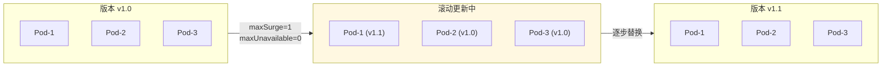

### 1.2 状态机流转

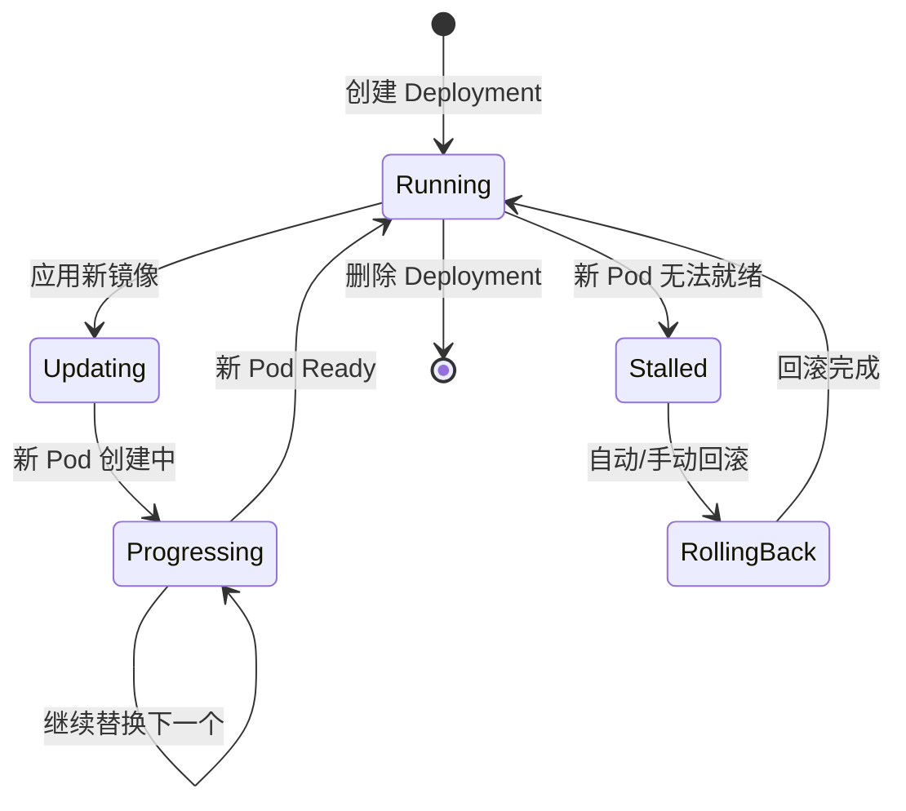

### 1.3 生产配置

```yaml
apiVersion: apps/v1
kind: Deployment
metadata:
  name: payment-service
spec:
  replicas: 10
  strategy:
    type: RollingUpdate
    rollingUpdate:
      maxSurge: 25%          # 最多多创建 25% Pod
      maxUnavailable: 0      # 不允许不可用 Pod
  minReadySeconds: 30        # Pod ready 后等待 30s
  progressDeadlineSeconds: 600  # 10 分钟未完成视为失败
  template:
    spec:
      containers:
        - name: payment
          image: payment:v1.1
          readinessProbe:
            httpGet:
              path: /healthz
              port: 8080
            initialDelaySeconds: 10
            periodSeconds: 5
            failureThreshold: 3
```

---

## 二、蓝绿部署 (Blue-Green Deployment)

### 2.1 架构原理

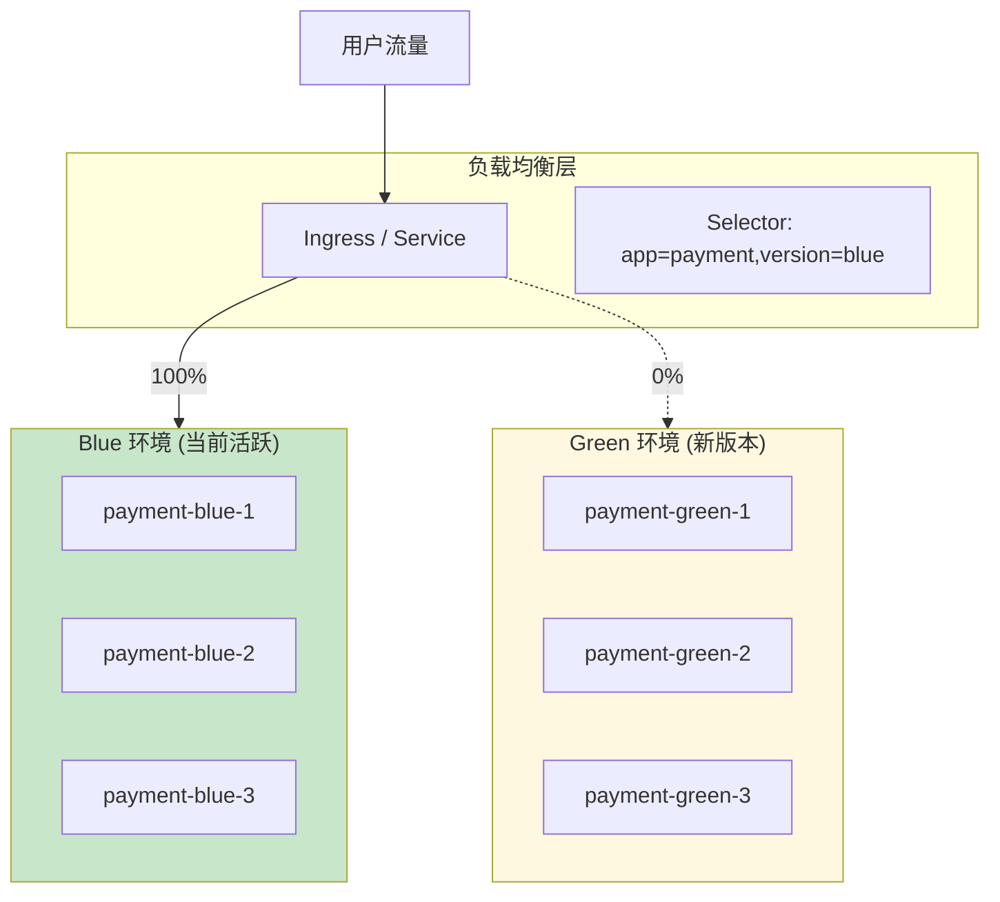

### 2.2 切换流程

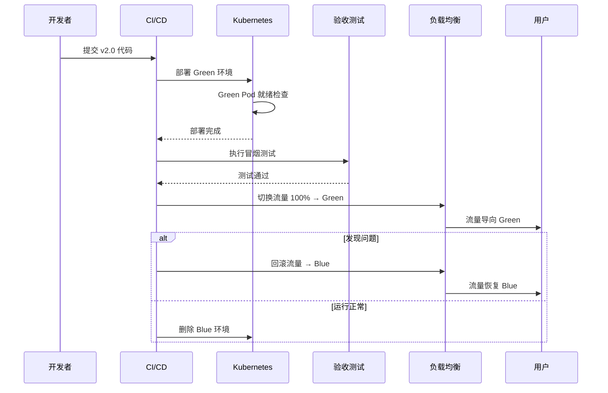

### 2.3 完整配置

```yaml
# Blue 环境 (当前活跃)
apiVersion: apps/v1
kind: Deployment
metadata:
  name: payment-blue
spec:
  replicas: 5
  selector:
    matchLabels:
      app: payment
      version: blue
  template:
    metadata:
      labels:
        app: payment
        version: blue
    spec:
      containers:
        - name: payment
          image: payment:v1.0
---
# Green 环境 (新版本)
apiVersion: apps/v1
kind: Deployment
metadata:
  name: payment-green
spec:
  replicas: 5
  selector:
    matchLabels:
      app: payment
      version: green
  template:
    metadata:
      labels:
        app: payment
        version: green
    spec:
      containers:
        - name: payment
          image: payment:v2.0
---
# Service 切换
apiVersion: v1
kind: Service
metadata:
  name: payment
spec:
  selector:
    app: payment
    version: blue  # 切换为 green 完成发布
  ports:
    - port: 80
      targetPort: 8080
```

### 2.4 数据库兼容性处理

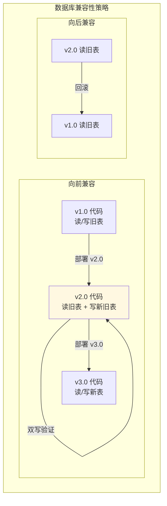

---

## 三、金丝雀发布 (Canary Release)

### 3.1 架构原理

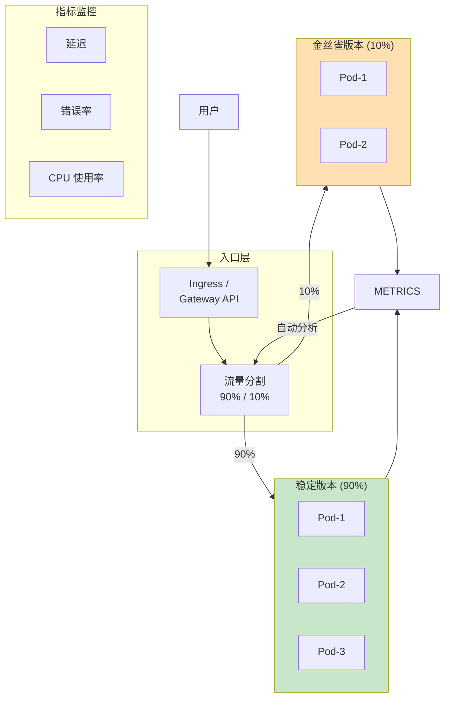

### 3.2 Flagger 自动金丝雀流程

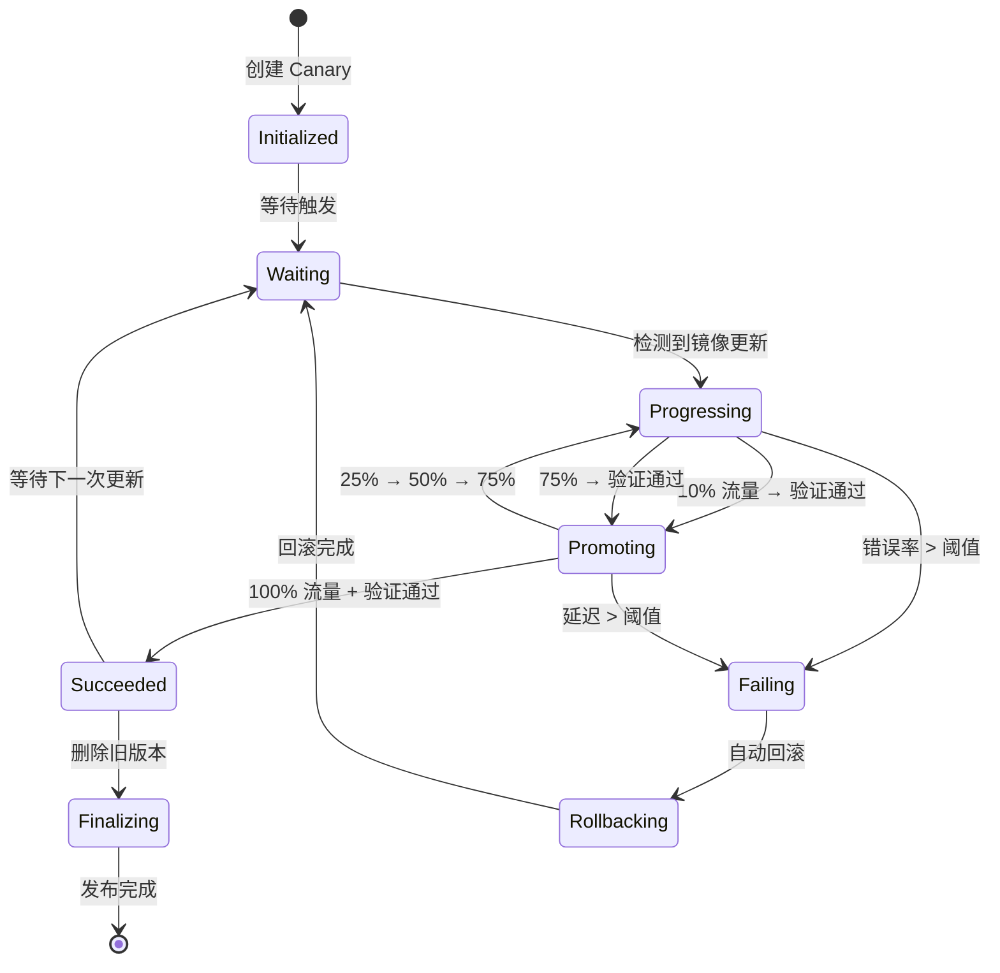

### 3.3 Flagger + Gateway API 配置

```yaml
apiVersion: flagger.app/v1beta1
kind: Canary
metadata:
  name: payment-service
spec:
  targetRef:
    apiVersion: apps/v1
    kind: Deployment
    name: payment
  service:
    port: 8080
    targetPort: 8080
    gateways:
      - gateway-namespace/payment-gateway
    hosts:
      - payment.example.com
  analysis:
    interval: 30s
    threshold: 5
    maxWeight: 50
    stepWeight: 10
    metrics:
      - name: request-success-rate
        interval: 1m
        thresholdRange:
          min: 99
      - name: request-duration
        interval: 1m
        thresholdRange:
          max: 500
    webhooks:
      - name: load-test
        url: http://flagger-loadtester.test/
        timeout: 5s
        metadata:
          cmd: "hey -z 1m -q 10 -c 2 http://payment.example.com/"
      - name: conformance-test
        type: pre-rollout
        url: http://flagger-loadtester.test/
        timeout: 30s
        metadata:
          type: bash
          cmd: "curl -f http://payment-canary:8080/healthz"
```

### 3.4 渐进式流量调整

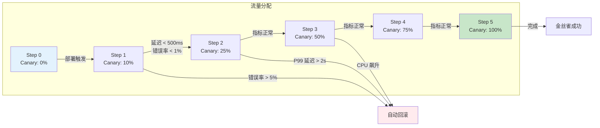

---

## 四、A/B 测试部署

### 4.1 架构原理

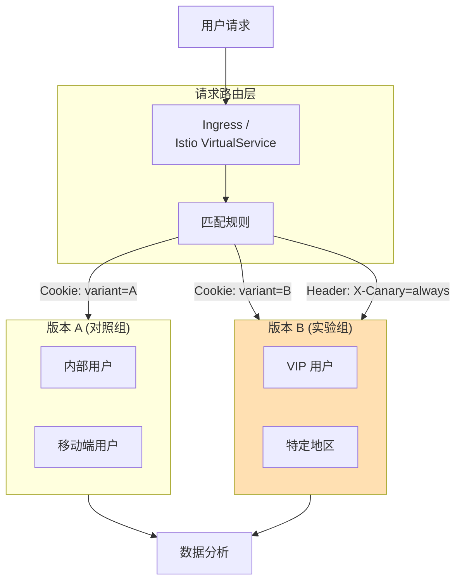

### 4.2 Istio A/B 测试配置

```yaml
apiVersion: networking.istio.io/v1beta1
kind: VirtualService
metadata:
  name: payment-ab-test
spec:
  hosts:
    - payment.example.com
  http:
    - match:
        - headers:
            x-canary:
              exact: "true"
        - uri:
            prefix: /api/v2
      route:
        - destination:
            host: payment
            subset: v2
          weight: 100
    - route:
        - destination:
            host: payment
            subset: v1
          weight: 95
        - destination:
            host: payment
            subset: v2
          weight: 5
---
apiVersion: networking.istio.io/v1beta1
kind: DestinationRule
metadata:
  name: payment-dr
spec:
  host: payment
  subsets:
    - name: v1
      labels:
        version: v1.0
    - name: v2
      labels:
        version: v2.0
```

---

## 五、影子流量部署 (Shadow / Mirror)

### 5.1 架构原理

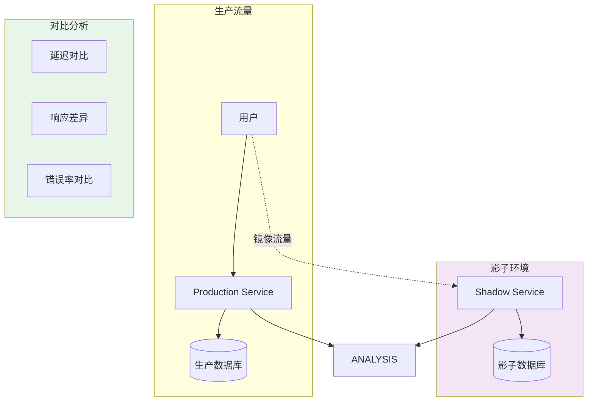

### 5.2 Istio 流量镜像配置

```yaml
apiVersion: networking.istio.io/v1beta1
kind: VirtualService
metadata:
  name: payment-mirror
spec:
  hosts:
    - payment
  http:
    - route:
        - destination:
            host: payment
            subset: stable
          weight: 100
      mirror:
        host: payment
        subset: shadow
      mirrorPercentage:
        value: 100.0  # 镜像 100% 流量
```

---

## 六、特性开关部署 (Feature Flag)

### 6.1 架构原理

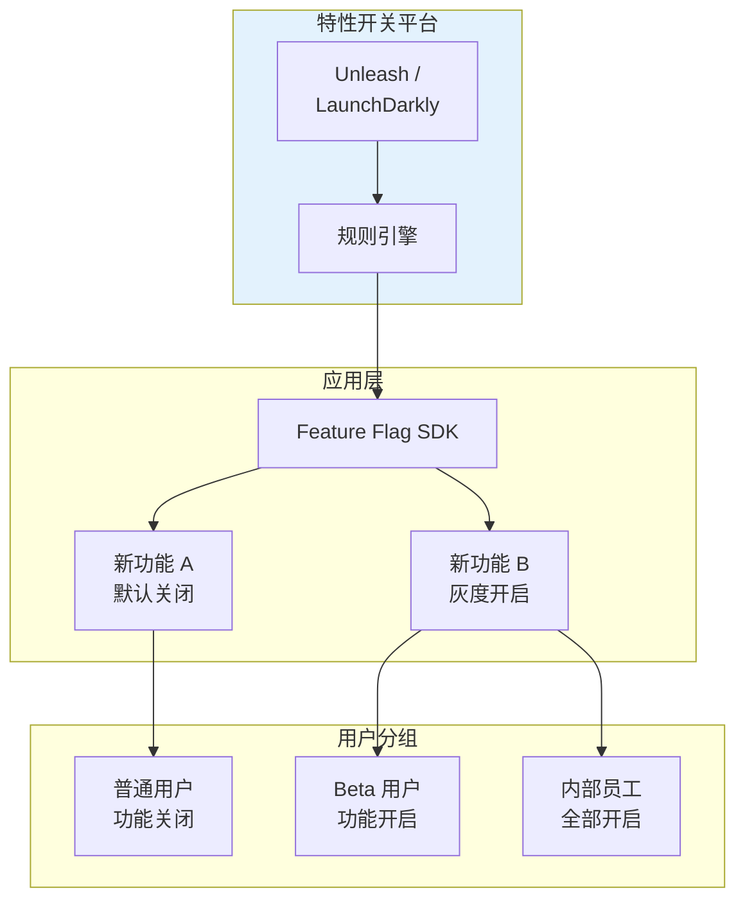

### 6.2 与 K8s 集成的特性开关

```yaml
# ConfigMap 作为简单特性开关
apiVersion: v1
kind: ConfigMap
metadata:
  name: feature-flags
data:
  NEW_PAYMENT_FLOW: "true"
  DARK_MODE: "false"
  BETA_API: "enabled"
---
# 应用通过环境变量读取
apiVersion: apps/v1
kind: Deployment
metadata:
  name: payment-service
spec:
  template:
    spec:
      containers:
        - name: payment
          image: payment:v1.0
          envFrom:
            - configMapRef:
                name: feature-flags
```

---

## 七、多环境晋升流水线

### 7.1 完整晋升流程

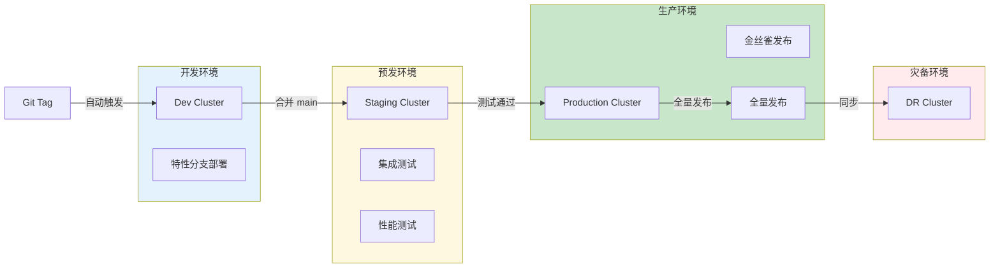

### 7.2 GitOps 晋升流水线

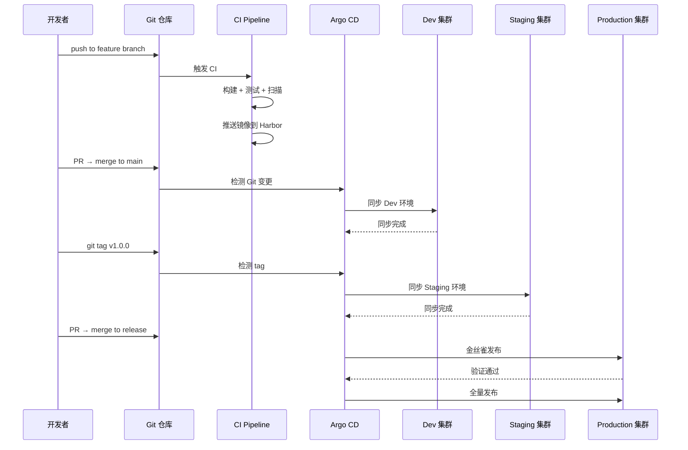

---

## 八、部署模式选型决策树

### 8.1 综合决策树

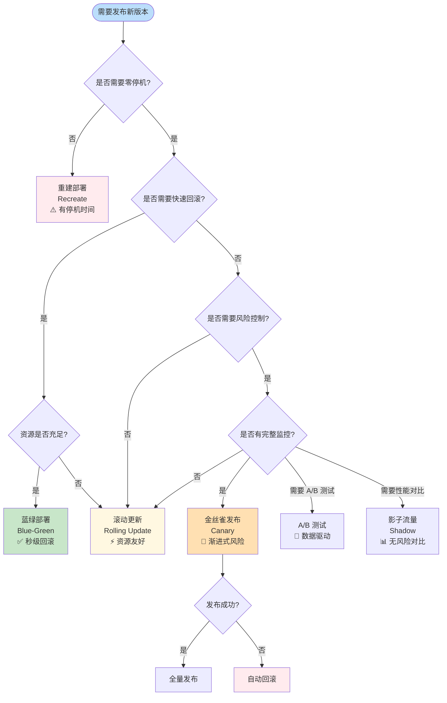

### 8.2 模式对比矩阵

| 模式 | 零停机 | 快速回滚 | 资源需求 | 复杂度 | 适用场景 |
|:---|:---:|:---:|:---:|:---:|:---|
| **重建 (Recreate)** | ❌ | ❌ | 低 | ⭐ | 开发环境、允许停机 |
| **滚动更新 (Rolling)** | ✅ | ⚠️ 慢 | 中 | ⭐⭐ | 标准生产发布 |
| **蓝绿 (Blue-Green)** | ✅ | ✅ 秒级 | 高 (2x) | ⭐⭐⭐ | 核心业务、需要秒级回滚 |
| **金丝雀 (Canary)** | ✅ | ✅ 自动 | 中 | ⭐⭐⭐⭐ | 风险控制、渐进发布 |
| **A/B 测试** | ✅ | ✅ | 中 | ⭐⭐⭐⭐ | 数据验证、用户实验 |
| **影子流量** | ✅ | N/A | 高 (2x) | ⭐⭐⭐⭐⭐ | 性能基准测试 |

---

## 附录：生产环境部署检查清单

```bash
#!/bin/bash
# production-deployment-checklist.sh

APP="$1"
NAMESPACE="${2:-default}"

echo "=== ${APP} 生产环境部署检查清单 ==="

check() {
    local name="$1"
    local cmd="$2"
    echo -n "[ ] ${name}... "
    if eval "$cmd" >/dev/null 2>&1; then
        echo "✅ PASS"
        return 0
    else
        echo "❌ FAIL"
        return 1
    fi
}

# 1. 资源限制
check "CPU/Memory Limits 已设置" \
    "kubectl get deploy/${APP} -n ${NAMESPACE} -o json | jq -e '.spec.template.spec.containers[].resources.limits'

# 2. 健康检查
check "Liveness Probe 已配置" \
    "kubectl get deploy/${APP} -n ${NAMESPACE} -o json | jq -e '.spec.template.spec.containers[].livenessProbe'

check "Readiness Probe 已配置" \
    "kubectl get deploy/${APP} -n ${NAMESPACE} -o json | jq -e '.spec.template.spec.containers[].readinessProbe'

# 3. 安全上下文
check "SecurityContext 已配置" \
    "kubectl get deploy/${APP} -n ${NAMESPACE} -o json | jq -e '.spec.template.spec.securityContext'

# 4. PDB
check "PodDisruptionBudget 已创建" \
    "kubectl get pdb -n ${NAMESPACE} | grep ${APP}"

# 5. HPA
check "HorizontalPodAutoscaler 已创建" \
    "kubectl get hpa -n ${NAMESPACE} | grep ${APP}"

# 6. NetworkPolicy
check "NetworkPolicy 已创建" \
    "kubectl get networkpolicy -n ${NAMESPACE} | grep ${APP}"

# 7. 镜像签名
check "镜像使用具体标签 (非 latest)" \
    "kubectl get deploy/${APP} -n ${NAMESPACE} -o json | jq -r '.spec.template.spec.containers[].image' | grep -v ':latest'"

# 8. 资源配额
check "命名空间有 ResourceQuota" \
    "kubectl get resourcequota -n ${NAMESPACE}"

echo "=== 检查完成 ==="
```

---

## 参考链接

- [Flagger 文档](https://flagger.app/)
- [Argo Rollouts](https://argoproj.github.io/argo-rollouts/)
- [Istio 流量管理](https://istio.io/latest/docs/concepts/traffic-management/)
- [Kubernetes Deployment 策略](https://kubernetes.io/docs/concepts/workloads/controllers/deployment/#strategy)
