# Kubernetes 多租户与资源隔离生产架构

> **适用版本**: Kubernetes v1.29 - v1.33  
> **最后更新**: 2026-04-24  
> **用途**: 企业级多租户架构设计，含完整 Mermaid 隔离模型图  
> **目标读者**: 平台架构师、安全工程师、SRE

---

## 📋 目录

- [一、多租户隔离模型](#一多租户隔离模型)
- [二、Namespace 级隔离架构](#二namespace-级隔离架构)
- [三、节点池级隔离架构](#三节点池级隔离架构)
- [四、虚拟集群隔离 (vCluster)](#四虚拟集群隔离-vcluster)
- [五、资源配额与限制架构](#五资源配额与限制架构)
- [六、网络隔离架构](#六网络隔离架构)
- [七、Pod 安全标准实施架构](#七pod-安全标准实施架构)
- [八、成本分摊与 FinOps 架构](#八成本分摊与-finops-架构)
- [九、多租户平台即服务 (PaaS) 架构](#九多租户平台即服务-paas-架构)

---

## 一、多租户隔离模型

### 1.1 隔离层级金字塔

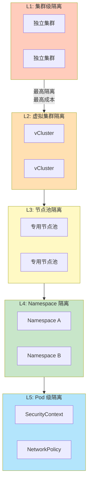

### 1.2 租户隔离矩阵

| 隔离级别 | 实现方式 | 安全性 | 资源利用率 | 运维复杂度 | 适用场景 |
|:---|:---|:---:|:---:|:---:|:---|
| **集群级** | 独立 K8s 集群 | ⭐⭐⭐⭐⭐ | ⭐⭐ | ⭐⭐⭐⭐⭐ | 强合规要求 (金融、政务) |
| **虚拟集群** | vCluster / Kamaji | ⭐⭐⭐⭐ | ⭐⭐⭐ | ⭐⭐⭐ | 中型团队、开发测试 |
| **节点池级** | 污点/标签 + 亲和性 | ⭐⭐⭐⭐ | ⭐⭐⭐⭐ | ⭐⭐⭐ | GPU/高安全负载 |
| **Namespace 级** | RBAC + NetworkPolicy + ResourceQuota | ⭐⭐⭐ | ⭐⭐⭐⭐⭐ | ⭐⭐ | 标准多租户 |
| **Pod 级** | SecurityContext + Seccomp | ⭐⭐⭐ | ⭐⭐⭐⭐⭐ | ⭐⭐ | 基础隔离 |

### 1.3 多租户架构全景

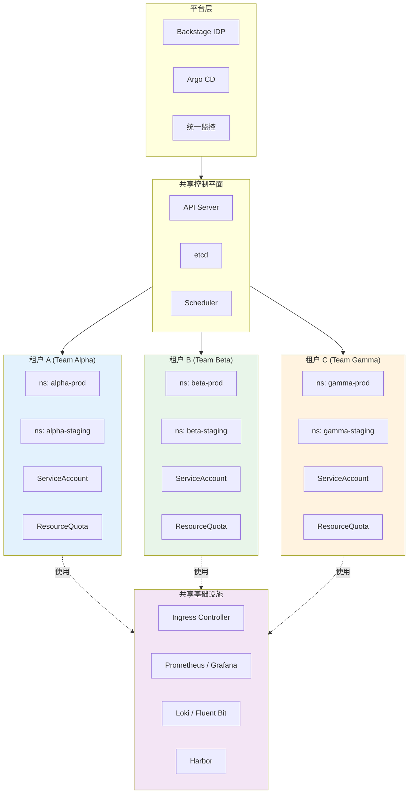

---

## 二、Namespace 级隔离架构

### 2.1 命名空间设计模式

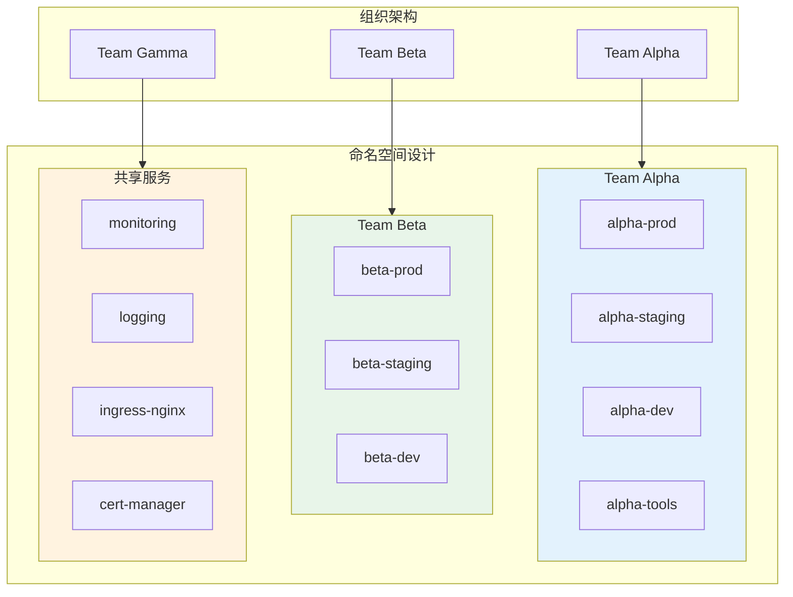

### 2.2 Namespace 模板化创建

```yaml
# namespace-template.yaml
apiVersion: v1
kind: Namespace
metadata:
  name: team-alpha-prod
  labels:
    team: alpha
    environment: production
    cost-center: "CC-1234"
    pod-security.kubernetes.io/enforce: restricted
    pod-security.kubernetes.io/audit: restricted
    pod-security.kubernetes.io/warn: restricted
---
# 资源配额
apiVersion: v1
kind: ResourceQuota
metadata:
  name: team-alpha-quota
  namespace: team-alpha-prod
spec:
  hard:
    requests.cpu: "20"
    requests.memory: 100Gi
    limits.cpu: "40"
    limits.memory: 200Gi
    pods: "50"
    services: "10"
    persistentvolumeclaims: "10"
    secrets: "20"
    configmaps: "20"
---
# 限制范围
apiVersion: v1
kind: LimitRange
metadata:
  name: team-alpha-limits
  namespace: team-alpha-prod
spec:
  limits:
    - default:
        cpu: "1"
        memory: 2Gi
      defaultRequest:
        cpu: "200m"
        memory: 512Mi
      max:
        cpu: "4"
        memory: 16Gi
      min:
        cpu: "50m"
        memory: 128Mi
      type: Container
---
# 默认网络策略：拒绝所有入站
apiVersion: networking.k8s.io/v1
kind: NetworkPolicy
metadata:
  name: default-deny-ingress
  namespace: team-alpha-prod
spec:
  podSelector: {}
  policyTypes:
    - Ingress
---
# 允许同命名空间通信
apiVersion: networking.k8s.io/v1
kind: NetworkPolicy
metadata:
  name: allow-same-namespace
  namespace: team-alpha-prod
spec:
  podSelector: {}
  ingress:
    - from:
        - podSelector: {}
  policyTypes:
    - Ingress
---
# RBAC 绑定
apiVersion: rbac.authorization.k8s.io/v1
kind: RoleBinding
metadata:
  name: team-alpha-admin
  namespace: team-alpha-prod
subjects:
  - kind: Group
    name: team-alpha
    apiGroup: rbac.authorization.k8s.io
roleRef:
  kind: ClusterRole
  name: admin
  apiGroup: rbac.authorization.k8s.io
```

### 2.3 命名空间生命周期管理

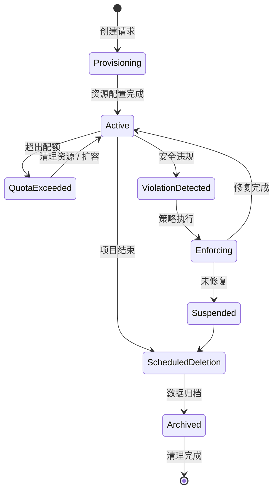

---

## 三、节点池级隔离架构

### 3.1 多节点池隔离模型

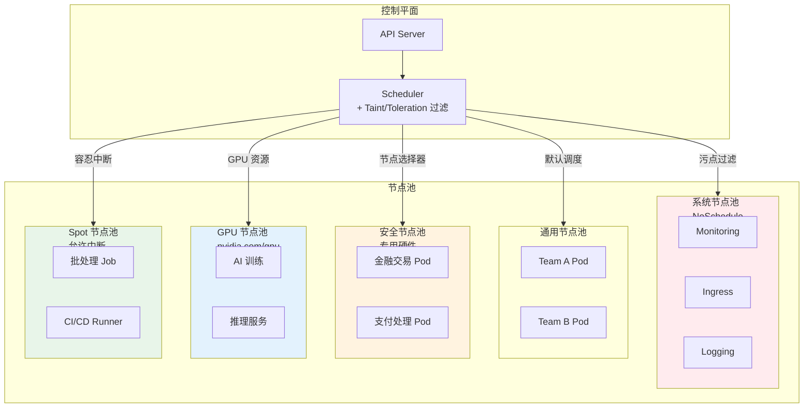

### 3.2 节点池配置

```yaml
# 系统节点池：禁止业务 Pod 调度
apiVersion: v1
kind: Node
metadata:
  name: system-node-1
  labels:
    node-role.kubernetes.io/system: "true"
spec:
  taints:
    - key: node-role.kubernetes.io/system
      value: "true"
      effect: NoSchedule
---
# 安全节点池：物理隔离
apiVersion: v1
kind: Node
metadata:
  name: secure-node-1
  labels:
    node-type: secure
    compliance-level: pci-dss
spec:
  taints:
    - key: node-type
      value: secure
      effect: NoSchedule
---
# 业务 Pod 调度到安全节点
apiVersion: apps/v1
kind: Deployment
metadata:
  name: payment-service
spec:
  template:
    spec:
      nodeSelector:
        node-type: secure
      tolerations:
        - key: node-type
          operator: Equal
          value: secure
          effect: NoSchedule
      affinity:
        podAntiAffinity:
          requiredDuringSchedulingIgnoredDuringExecution:
            - labelSelector:
                matchExpressions:
                  - key: app
                    operator: In
                    values:
                      - payment
              topologyKey: kubernetes.io/hostname
```

---

## 四、虚拟集群隔离 (vCluster)

### 4.1 vCluster 架构

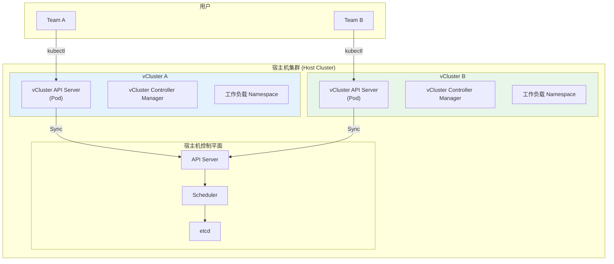

### 4.2 vCluster 创建

```bash
# 安装 vCluster CLI
curl -L -o vcluster "https://github.com/loft-sh/vcluster/releases/latest/download/vcluster-linux-amd64" && \
  sudo install -c -m 0755 vcluster /usr/local/bin

# 创建虚拟集群
vcluster create team-alpha-vcluster \
  --namespace team-alpha \
  --expose-local=false \
  --connect=false

# 连接虚拟集群
vcluster connect team-alpha-vcluster --namespace team-alpha

# 在 vCluster 中操作（完全隔离）
kubectl get nodes  # 只看到 vCluster 的虚拟节点
kubectl create namespace production
kubectl apply -f deployment.yaml
```

---

## 五、资源配额与限制架构

### 5.1 层级配额模型

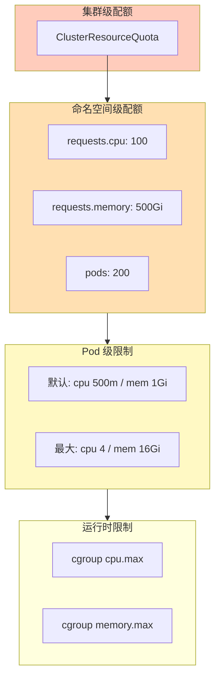

### 5.2 资源配额监控

```yaml
# PrometheusRule: 资源配额告警
apiVersion: monitoring.coreos.com/v1
kind: PrometheusRule
metadata:
  name: resource-quota-alerts
spec:
  groups:
    - name: quota-alerts
      rules:
        - alert: NamespaceQuotaHigh
          expr: |
            (
              kube_resourcequota{resource="requests.cpu",type="used"}
              /
              kube_resourcequota{resource="requests.cpu",type="hard"}
            ) > 0.8
          for: 5m
          labels:
            severity: warning
          annotations:
            summary: "命名空间 {{ $labels.namespace }} CPU 配额使用率超过 80%"

        - alert: NamespaceQuotaExceeded
          expr: |
            (
              kube_resourcequota{resource="pods",type="used"}
              /
              kube_resourcequota{resource="pods",type="hard"}
            ) >= 1
          for: 1m
          labels:
            severity: critical
          annotations:
            summary: "命名空间 {{ $labels.namespace }} Pod 配额已用完"
```

---

## 六、网络隔离架构

### 6.1 零信任网络模型

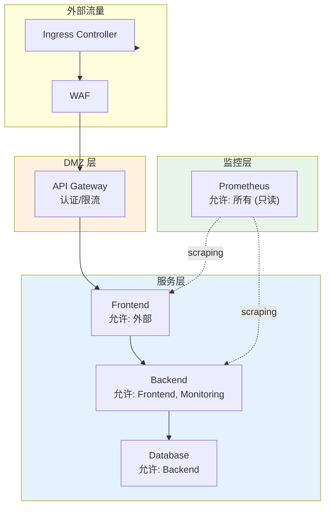

### 6.2 Cilium L7 策略

```yaml
apiVersion: cilium.io/v2
kind: CiliumNetworkPolicy
metadata:
  name: backend-policy
  namespace: production
spec:
  endpointSelector:
    matchLabels:
      app: backend
  ingress:
    - fromEndpoints:
        - matchLabels:
            app: frontend
            k8s:io.kubernetes.pod.namespace: production
      toPorts:
        - ports:
            - port: "8080"
              protocol: TCP
          rules:
            http:
              - method: GET
                path: "/api/v1/.*"
              - method: POST
                path: "/api/v1/orders"
    - fromEndpoints:
        - matchLabels:
            app: prometheus
            k8s:io.kubernetes.pod.namespace: monitoring
      toPorts:
        - ports:
            - port: "9090"
              protocol: TCP
          rules:
            http:
              - method: GET
                path: "/metrics"
```

---

## 七、Pod 安全标准实施架构

### 7.1 PSA (Pod Security Admission) 架构

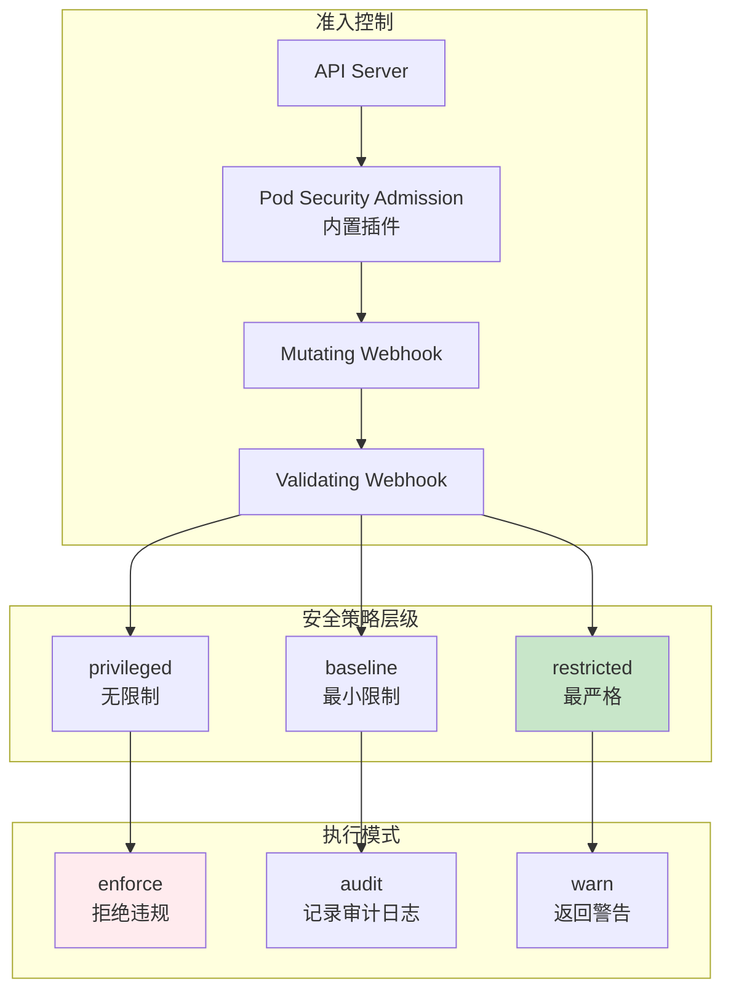

### 7.2 PSA 实施配置

```yaml
# 集群级配置
apiVersion: apiserver.config.k8s.io/v1
kind: AdmissionConfiguration
plugins:
  - name: PodSecurity
    configuration:
      apiVersion: pod-security.admission.config.k8s.io/v1
      kind: PodSecurityConfiguration
      defaults:
        enforce: "restricted"
        audit: "restricted"
        warn: "restricted"
      exemptions:
        usernames: []
        runtimeClasses: []
        namespaces:
          - kube-system
          - ingress-nginx
          - monitoring
          - cert-manager
---
# 命名空间级覆盖
apiVersion: v1
kind: Namespace
metadata:
  name: legacy-app
  labels:
    pod-security.kubernetes.io/enforce: baseline
    pod-security.kubernetes.io/enforce-version: v1.33
    pod-security.kubernetes.io/audit: restricted
    pod-security.kubernetes.io/warn: restricted
```

### 7.3 合规 Pod 模板

```yaml
apiVersion: v1
kind: Pod
metadata:
  name: compliant-app
spec:
  securityContext:
    runAsNonRoot: true
    seccompProfile:
      type: RuntimeDefault
  containers:
    - name: app
      image: myapp:v1.0
      securityContext:
        allowPrivilegeEscalation: false
        readOnlyRootFilesystem: true
        runAsUser: 1000
        runAsGroup: 1000
        capabilities:
          drop:
            - ALL
      resources:
        requests:
          cpu: 100m
          memory: 128Mi
        limits:
          cpu: 500m
          memory: 512Mi
      volumeMounts:
        - name: tmp
          mountPath: /tmp
        - name: cache
          mountPath: /cache
  volumes:
    - name: tmp
      emptyDir: {}
    - name: cache
      emptyDir:
        sizeLimit: 100Mi
```

---

## 八、成本分摊与 FinOps 架构

### 8.1 成本归因模型

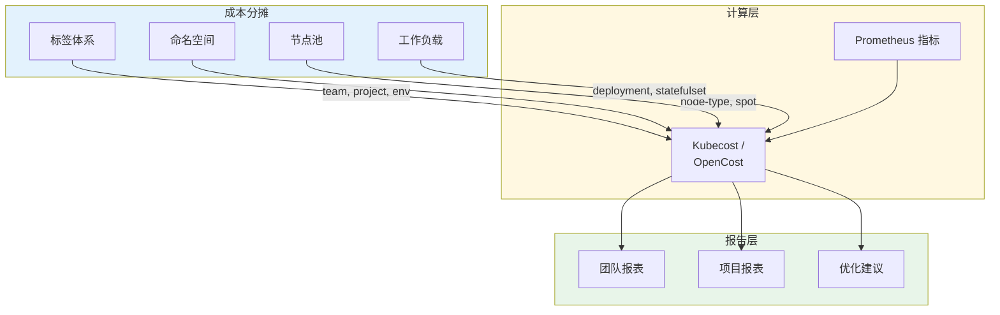

### 8.2 标签规范

```yaml
# 强制标签规范
apiVersion: v1
kind: Namespace
metadata:
  name: team-alpha-prod
  labels:
    # 组织信息
    company.com/team: "alpha"
    company.com/cost-center: "CC-1234"
    company.com/project: "payment-platform"
    # 环境信息
    company.com/environment: "production"
    company.com/criticality: "tier-1"
    # 技术信息
    company.com/domain: "finance"
    company.com/data-classification: "confidential"
---
# Kyverno 策略：强制标签
apiVersion: kyverno.io/v1
kind: ClusterPolicy
metadata:
  name: require-labels
spec:
  validationFailureAction: Enforce
  rules:
    - name: check-required-labels
      match:
        any:
          - resources:
              kinds:
                - Namespace
      validate:
        message: "Namespace 必须包含 required 标签"
        pattern:
          metadata:
            labels:
              company.com/team: "?*"
              company.com/cost-center: "?*"
              company.com/environment: "?*"
```

---

## 九、多租户平台即服务 (PaaS) 架构

### 9.1 自服务平台架构

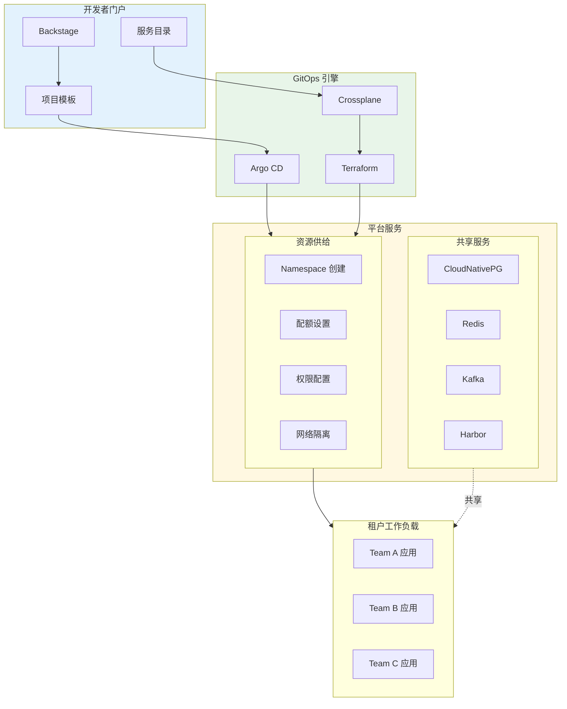

### 9.2 自助服务流程

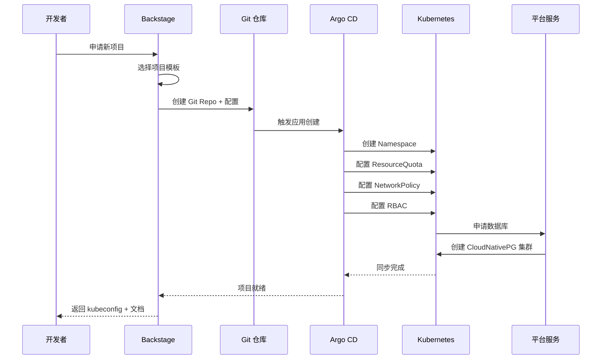

---

## 附录：多租户检查清单

```bash
#!/bin/bash
# multi-tenant-checklist.sh

NAMESPACE="$1"

echo "=== 命名空间 ${NAMESPACE} 多租户合规检查 ==="

# 1. 网络隔离
echo "[1] 网络策略检查"
kubectl get networkpolicy -n ${NAMESPACE} -o json | jq '.items | length'

# 2. 资源配额
echo "[2] 资源配额检查"
kubectl get resourcequota -n ${NAMESPACE}

# 3. 限制范围
echo "[3] 限制范围检查"
kubectl get limitrange -n ${NAMESPACE}

# 4. RBAC
echo "[4] RBAC 检查"
kubectl get rolebinding,clusterrolebinding -n ${NAMESPACE}

# 5. Pod 安全
echo "[5] Pod 安全配置检查"
kubectl get pods -n ${NAMESPACE} -o json | jq '
  .items[] |
  select(.spec.containers[].securityContext.allowPrivilegeEscalation != false)
  | .metadata.name'

# 6. 标签规范
echo "[6] 标签规范检查"
kubectl get namespace ${NAMESPACE} -o json | jq '.metadata.labels | keys'

# 7. 成本标签
echo "[7] 成本归因标签"
kubectl get all -n ${NAMESPACE} -o json | jq '
  .items[] | select(.metadata.labels["company.com/team"] == null)
  | .metadata.name'

echo "=== 检查完成 ==="
```

---

## 参考链接

- [Kubernetes 多租户指南](https://kubernetes.io/docs/concepts/security/multi-tenancy/)
- [vCluster 文档](https://www.vcluster.com/docs/)
- [Pod Security Standards](https://kubernetes.io/docs/concepts/security/pod-security-standards/)
- [Kubecost](https://www.kubecost.com/)
- [Backstage](https://backstage.io/)
