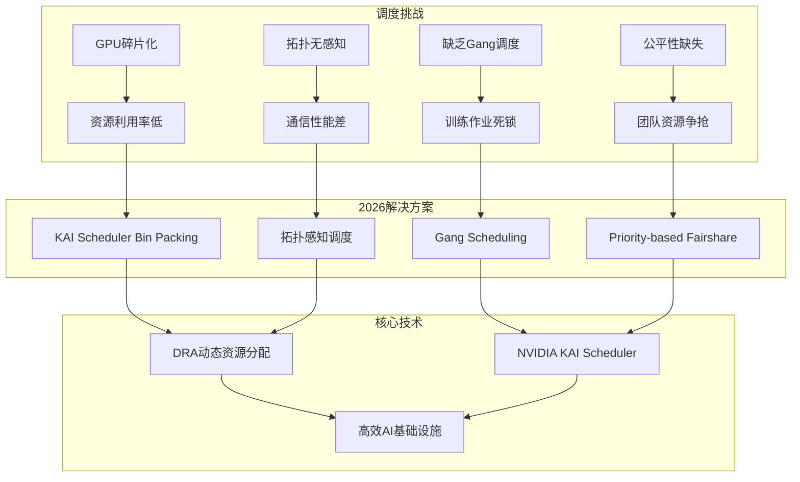
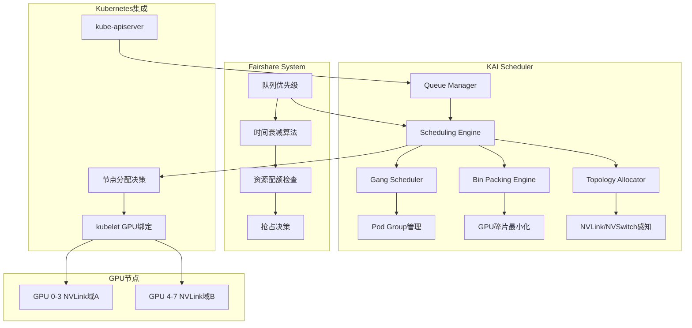
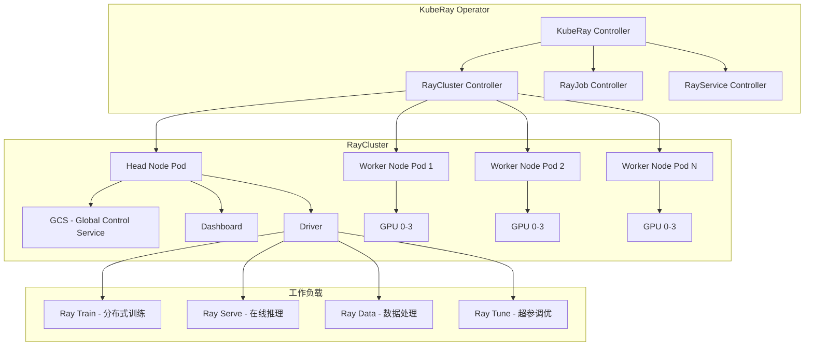

# [[Kubernetes|Kubernetes]] AI/ML GPU调度与LLM推理服务 (AI/ML GPU Scheduling and LLM Inference Serving)

> **作者**: AI基础设施架构专家 | **版本**: v1.0 | **更新时间**: 2026-03-03
> **适用场景**: AI/ML平台架构、GPU集群管理、LLM推理服务 | **复杂度**: ⭐⭐⭐⭐⭐

<!-- chunk: 🎯 摘要 -->## 🎯 摘要

本文档深入探讨Kubernetes环境下AI/ML工作负载的GPU调度策略与LLM推理服务架构，涵盖NVIDIA KAI Scheduler、vLLM生产部署、Ray on Kubernetes、Google TPU/Ironwood等2026年最新技术实践。基于大规模GPU集群的生产运维经验，提供从GPU设备管理到推理服务优化的完整技术指南，帮助企业构建高效、可靠的AI基础设施平台。

<!-- chunk: 1. AI/ML工作负载挑战概述 -->## 1. AI/ML工作负载挑战概述

## 1.1 2026年AI基础设施现状

```yaml
AI工作负载规模演进:
  模型参数规模:
    2023年: 175B (GPT-4级别)
    2024年: 405B (Llama 3.1)
    2025年: 1T+ (MoE架构模型)
    2026年: 2T+ (多模态大模型)
  
  GPU需求特征:
    训练作业:
      - 需要数十到数千张GPU协同
      - 作业运行时间：数小时到数周
      - 对GPU间通信带宽要求极高(NVLink/InfiniBand)
      - 容错性要求：检查点保存与恢复
    
    推理服务:
      - 单模型可能需要多张GPU(张量并行)
      - 延迟敏感(P99 < 500ms)
      - 吞吐量要求高(数千tokens/s)
      - 动态负载波动大(10x-100x峰谷比)
    
    微调作业:
      - LoRA/QLoRA等参数高效微调
      - 需要1-8张GPU
      - 运行时间：数小时
      - 数据隐私要求高

  GPU资源稀缺性:
    H100供货周期: 6-12个月
    单卡成本: $25,000-$40,000
    集群利用率目标: > 80%
    碎片化浪费: 典型集群30-50%
```

## 1.2 Kubernetes AI调度核心挑战



<!-- chunk: 2. GPU设备架构与Kubernetes集成 -->## 2. GPU设备架构与Kubernetes集成

## 2.1 NVIDIA Device Plugin工作原理

```yaml
# NVIDIA Device Plugin DaemonSet部署
apiVersion: apps/v1
kind: DaemonSet
metadata:
  name: nvidia-device-plugin-daemonset
  namespace: kube-system
spec:
  selector:
    matchLabels:
      name: nvidia-device-plugin-ds
  template:
    metadata:
      labels:
        name: nvidia-device-plugin-ds
    spec:
      tolerations:
        - key: nvidia.com/gpu
          operator: Exists
          effect: NoSchedule
      priorityClassName: system-node-critical
      containers:
        - name: nvidia-device-plugin-ctr
          image: nvcr.io/nvidia/k8s-device-plugin:v0.17.0
          env:
            - name: FAIL_ON_INIT_ERROR
              value: "false"
            # 启用MIG策略
            - name: MIG_STRATEGY
              value: "mixed"
            # 启用GPU共享
            - name: DEVICE_SPLIT_COUNT
              value: "0"
          securityContext:
            allowPrivilegeEscalation: false
            capabilities:
              drop: ["ALL"]
          volumeMounts:
            - name: device-plugin
              mountPath: /var/lib/kubelet/device-plugins
      volumes:
        - name: device-plugin
          hostPath:
            path: /var/lib/kubelet/device-plugins
```

## 2.2 GPU拓扑架构

```yaml
GPU拓扑层级:
  L1 - 同NVLink域:
    带宽: 900 GB/s (NVLink 4.0, H100)
    延迟: < 1μs
    场景: 张量并行(Tensor Parallelism)
    
  L2 - 同NVSwitch域:
    带宽: 900 GB/s (NVSwitch 3.0全互联)
    延迟: ~2μs
    场景: 8卡DGX节点内通信
    
  L3 - 跨节点(InfiniBand):
    带宽: 400 Gb/s (NDR InfiniBand)
    延迟: ~5μs
    场景: 数据并行(Data Parallelism)、流水线并行
    
  L4 - 跨机架(以太网):
    带宽: 100-400 Gb/s
    延迟: ~50μs
    场景: 参数服务器、梯度聚合

GPU节点标签示例:
  nvidia.com/gpu.product: "NVIDIA-H100-80GB-HBM3"
  nvidia.com/gpu.count: "8"
  nvidia.com/gpu.memory: "81920"
  nvidia.com/gpu.machine: "DGX-H100"
  topology.kubernetes.io/zone: "us-central1-a"
  nvidia.com/gpu.nvlink.topology: "full-mesh"
```

## 2.3 Dynamic Resource Allocation (DRA)

```yaml
# DRA ResourceClaim 示例 - K8s 1.33+ Beta
apiVersion: resource.k8s.io/v1beta1
kind: ResourceClaim
metadata:
  name: gpu-claim-training
spec:
  devices:
    requests:
      - name: gpu
        deviceClassName: gpu.nvidia.com
        selectors:
          - cel:
              expression: >
                device.attributes["gpu.nvidia.com"].productName == "H100" &&
                device.attributes["gpu.nvidia.com"].memory >= 80000
        count: 4
    constraints:
      - requests: ["gpu"]
        matchAttribute: "gpu.nvidia.com/nvlinkDomain"
---
# DRA DeviceClass 定义
apiVersion: resource.k8s.io/v1beta1
kind: DeviceClass
metadata:
  name: gpu.nvidia.com
spec:
  selectors:
    - cel:
        expression: device.driver == "gpu.nvidia.com"
---
# 使用DRA的训练Pod
apiVersion: v1
kind: Pod
metadata:
  name: llm-training-job
spec:
  containers:
    - name: trainer
      image: nvcr.io/nvidia/pytorch:24.06-py3
      command: ["torchrun", "--nproc_per_node=4", "train.py"]
      resources:
        claims:
          - name: gpu-claim
  resourceClaims:
    - name: gpu-claim
      resourceClaimName: gpu-claim-training
```

```yaml
DRA vs Extended Resources对比:
  Extended Resources (传统方式):
    优点:
      - 简单易用
      - 无需额外组件
    缺点:
      - 只能表达数量(nvidia.com/gpu: 4)
      - 无法表达拓扑约束
      - 无法选择特定GPU型号
      - 不支持GPU共享细粒度控制
    
  Dynamic Resource Allocation (DRA):
    优点:
      - 结构化参数(型号/显存/拓扑)
      - CEL表达式灵活选择
      - 支持设备间约束(同NVLink域)
      - 支持多种分配策略
    缺点:
      - K8s 1.33 Beta，需启用Feature Gate
      - 需要设备驱动支持DRA接口
      - 配置复杂度较高
    状态: 2026年预计在K8s 1.35 GA
```

<!-- chunk: 3. NVIDIA KAI Scheduler深度实践 -->## 3. NVIDIA KAI Scheduler深度实践

## 3.1 KAI Scheduler架构



## 3.2 KAI Scheduler安装部署

```yaml
# KAI Scheduler Helm安装
# helm repo add nvidia https://helm.ngc.nvidia.com/nvidia
# helm install kai-scheduler nvidia/kai-scheduler -n kai-scheduler --create-namespace

# KAI Scheduler 配置
apiVersion: v1
kind: ConfigMap
metadata:
  name: kai-scheduler-config
  namespace: kai-scheduler
data:
  config.yaml: |
    scheduler:
      schedulerName: kai-scheduler
      
      # Gang Scheduling配置
      gangScheduling:
        enabled: true
        # 等待所有Pod就绪的超时时间
        waitTimeout: 300s
        # Pod Group最小可调度比例
        minAvailable: 100%
      
      # GPU Bin Packing配置
      binPacking:
        enabled: true
        strategy: "MostAllocated"
        # GPU碎片化权重
        fragmentationWeight: 0.3
        # 拓扑亲和权重
        topologyWeight: 0.7
      
      # 拓扑感知配置
      topologyAwareness:
        enabled: true
        levels:
          - name: "nvlink"
            weight: 100
          - name: "node"
            weight: 50
          - name: "rack"
            weight: 10
      
      # 公平共享配置
      fairshare:
        enabled: true
        algorithm: "DRF"  # Dominant Resource Fairness
        decayFactor: 0.95
        preemption:
          enabled: true
          gracePeriod: 60s
```

## 3.3 GPU共享策略

```yaml
# GPU共享三种模式对比
GPU共享模式:
  MIG (Multi-Instance GPU):
    适用GPU: A100, H100
    隔离级别: 硬件级(独立显存/计算核心/缓存)
    分区选项:
      - 1g.10gb (1/7 GPU)
      - 2g.20gb (2/7 GPU)
      - 3g.40gb (3/7 GPU)
      - 4g.40gb (4/7 GPU)
      - 7g.80gb (全GPU)
    优点: 硬件级强隔离，性能可预测
    缺点: 分区粒度固定，需重启配置
    场景: 推理服务多租户共享

  时间片 (Time-Slicing):
    适用GPU: 所有NVIDIA GPU
    隔离级别: 无隔离(共享显存和计算)
    配置方式: Device Plugin ConfigMap
    优点: 配置简单，适用所有GPU
    缺点: 无显存隔离，可能OOM
    场景: 开发测试环境

  MPS (Multi-Process Service):
    适用GPU: Volta+架构
    隔离级别: 进程级(共享GPU上下文)
    配置方式: CUDA MPS Server
    优点: 低延迟切换，显存隔离(受限)
    缺点: 需CUDA应用配合
    场景: 多推理服务并发
---
# MIG配置示例
apiVersion: v1
kind: ConfigMap
metadata:
  name: nvidia-mig-config
  namespace: kube-system
data:
  config.yaml: |
    version: v1
    mig-configs:
      all-balanced:
        - devices: all
          mig-enabled: true
          mig-devices:
            "1g.10gb": 2
            "2g.20gb": 1
            "3g.40gb": 1
---
# 时间片配置示例
apiVersion: v1
kind: ConfigMap
metadata:
  name: nvidia-device-plugin
  namespace: kube-system
data:
  config.yaml: |
    version: v1
    sharing:
      timeSlicing:
        renameByDefault: false
        failRequestsGreaterThanOne: false
        resources:
          - name: nvidia.com/gpu
            replicas: 4  # 每个物理GPU虚拟为4个
```

## 3.4 Gang Scheduling配置

```yaml
# KAI Scheduler Gang Scheduling - 训练作业
apiVersion: scheduling.kai.nvidia.com/v1alpha1
kind: PodGroup
metadata:
  name: llm-training-group
  namespace: ai-training
spec:
  schedulerName: kai-scheduler
  minMember: 8  # 需要8个Pod全部就绪才开始调度
  queue: high-priority-training
  priorityClassName: training-high
  scheduleTimeoutSeconds: 600
---
apiVersion: batch/v1
kind: Job
metadata:
  name: llm-training-job
  namespace: ai-training
spec:
  parallelism: 8
  completions: 8
  template:
    metadata:
      labels:
        pod-group.scheduling.kai.nvidia.com: llm-training-group
    spec:
      schedulerName: kai-scheduler
      containers:
        - name: trainer
          image: nvcr.io/nvidia/pytorch:24.06-py3
          command:
            - torchrun
            - --nnodes=8
            - --nproc_per_node=8
            - --rdzv_backend=c10d
            - --rdzv_endpoint=llm-training-master:29500
            - train_llm.py
            - --model=llama-70b
            - --batch-size=4
            - --gradient-accumulation-steps=8
          resources:
            limits:
              nvidia.com/gpu: 8
              rdma/rdma_shared_device_a: 1
            requests:
              cpu: "64"
              memory: "512Gi"
          env:
            - name: NCCL_IB_DISABLE
              value: "0"
            - name: NCCL_NET_GDR_LEVEL
              value: "5"
      restartPolicy: OnFailure
      tolerations:
        - key: nvidia.com/gpu
          operator: Exists
          effect: NoSchedule
```

## 3.5 Priority-based Fairshare

```yaml
# KAI Scheduler 队列与公平共享配置
apiVersion: scheduling.kai.nvidia.com/v1alpha1
kind: Queue
metadata:
  name: research-team
spec:
  weight: 40  # 40%的GPU资源份额
  priority: 100
  quota:
    hardQuota:
      nvidia.com/gpu: "64"
    softQuota:
      nvidia.com/gpu: "32"  # 保证最低32张GPU
  preemptionPolicy:
    withinQueue: LowerPriority
    crossQueue: ReclaimBelowFairShare
---
apiVersion: scheduling.kai.nvidia.com/v1alpha1
kind: Queue
metadata:
  name: production-inference
spec:
  weight: 50  # 50%的GPU资源份额
  priority: 200  # 高于research
  quota:
    hardQuota:
      nvidia.com/gpu: "80"
    softQuota:
      nvidia.com/gpu: "40"
  preemptionPolicy:
    withinQueue: LowerPriority
    crossQueue: ReclaimBelowFairShare
---
apiVersion: scheduling.kai.nvidia.com/v1alpha1
kind: Queue
metadata:
  name: dev-testing
spec:
  weight: 10  # 10%的GPU资源份额
  priority: 50
  quota:
    hardQuota:
      nvidia.com/gpu: "16"
    softQuota:
      nvidia.com/gpu: "8"
  preemptionPolicy:
    withinQueue: LowerPriority
    crossQueue: Never  # 不可抢占其他队列
```

<!-- chunk: 4. vLLM on Kubernetes生产部署 -->## 4. vLLM on Kubernetes生产部署

## 4.1 vLLM架构原理

```yaml
vLLM核心技术:
  PagedAttention:
    原理: 将KV Cache分页管理，类似操作系统虚拟内存
    优势:
      - 消除KV Cache碎片化(传统方案浪费60-80%显存)
      - 支持动态序列长度
      - 显存利用率提升2-4倍
    
  Continuous Batching:
    原理: 请求级别的动态批处理(非静态批次)
    优势:
      - 吞吐量提升2-3倍(vs HuggingFace静态批处理)
      - 长短请求不互相阻塞
      - GPU利用率稳定在70-90%
    
  Prefix Caching:
    原理: 缓存共同前缀的KV Cache
    优势:
      - 相同system prompt的请求共享缓存
      - 首次token延迟(TTFT)降低50-80%
    
  Speculative Decoding:
    原理: 小模型快速生成候选token，大模型验证
    优势:
      - 延迟降低30-50%
      - 不影响输出质量
```

## 4.2 vLLM Kubernetes部署

```yaml
# vLLM推理服务Deployment
apiVersion: apps/v1
kind: Deployment
metadata:
  name: vllm-llama-70b
  namespace: ai-inference
  labels:
    app: vllm
    model: llama-3-70b
spec:
  replicas: 2
  selector:
    matchLabels:
      app: vllm
      model: llama-3-70b
  template:
    metadata:
      labels:
        app: vllm
        model: llama-3-70b
    spec:
      containers:
        - name: vllm
          image: vllm/vllm-openai:v0.7.3
          args:
            - --model=/models/Meta-Llama-3-70B-Instruct
            - --tensor-parallel-size=4
            - --max-model-len=8192
            - --gpu-memory-utilization=0.92
            - --enable-prefix-caching
            - --enable-chunked-prefill
            - --max-num-batched-tokens=32768
            - --max-num-seqs=256
            - --port=8000
            - --served-model-name=llama-3-70b
            - --trust-remote-code
            # 量化选项
            - --quantization=awq
            - --dtype=float16
          ports:
            - containerPort: 8000
              name: http
              protocol: TCP
          resources:
            limits:
              nvidia.com/gpu: 4
              cpu: "32"
              memory: "128Gi"
            requests:
              cpu: "16"
              memory: "64Gi"
          env:
            - name: NCCL_P2P_DISABLE
              value: "0"
            - name: CUDA_VISIBLE_DEVICES
              value: "0,1,2,3"
            - name: VLLM_ATTENTION_BACKEND
              value: "FLASH_ATTN"
          volumeMounts:
            - name: model-storage
              mountPath: /models
            - name: shm
              mountPath: /dev/shm
          livenessProbe:
            httpGet:
              path: /health
              port: 8000
            initialDelaySeconds: 120
            periodSeconds: 30
          readinessProbe:
            httpGet:
              path: /health
              port: 8000
            initialDelaySeconds: 60
            periodSeconds: 10
      volumes:
        - name: model-storage
          persistentVolumeClaim:
            claimName: model-pvc-llama-70b
        - name: shm
          emptyDir:
            medium: Memory
            sizeLimit: 16Gi
      nodeSelector:
        nvidia.com/gpu.product: "NVIDIA-H100-80GB-HBM3"
      tolerations:
        - key: nvidia.com/gpu
          operator: Exists
          effect: NoSchedule
---
# vLLM Service
apiVersion: v1
kind: Service
metadata:
  name: vllm-llama-70b
  namespace: ai-inference
spec:
  selector:
    app: vllm
    model: llama-3-70b
  ports:
    - port: 8000
      targetPort: 8000
      protocol: TCP
  type: ClusterIP
---
# HPA基于自定义指标自动扩缩
apiVersion: autoscaling/v2
kind: HorizontalPodAutoscaler
metadata:
  name: vllm-llama-70b-hpa
  namespace: ai-inference
spec:
  scaleTargetRef:
    apiVersion: apps/v1
    kind: Deployment
    name: vllm-llama-70b
  minReplicas: 2
  maxReplicas: 8
  metrics:
    - type: Pods
      pods:
        metric:
          name: vllm_num_requests_waiting
        target:
          type: AverageValue
          averageValue: "50"
    - type: Pods
      pods:
        metric:
          name: vllm_gpu_cache_usage_perc
        target:
          type: AverageValue
          averageValue: "85"
  behavior:
    scaleUp:
      stabilizationWindowSeconds: 60
      policies:
        - type: Pods
          value: 2
          periodSeconds: 120
    scaleDown:
      stabilizationWindowSeconds: 300
      policies:
        - type: Pods
          value: 1
          periodSeconds: 300
```

## 4.3 llm-d分布式推理框架

```yaml
# llm-d (Google开源) - 分布式推理网关
# 基于Gateway API路由推理请求到最优vLLM实例
llm-d架构:
  核心理念: 
    - 推理请求感知的智能路由
    - KV Cache亲和性路由(相同prefix路由到同一实例)
    - 负载感知的请求分发
    
  组件:
    llm-d Gateway:
      - 基于Envoy Gateway实现
      - 支持Gateway API HTTPRoute
      - 推理请求metadata解析
    
    llm-d Router:
      - KV Cache状态感知
      - Prefix匹配路由
      - 请求队列长度均衡
    
    vLLM Backend:
      - 标准vLLM实例
      - 暴露KV Cache利用率指标
      - 支持prefix cache查询API
---
# llm-d Gateway配置示例
apiVersion: gateway.networking.k8s.io/v1
kind: HTTPRoute
metadata:
  name: llm-inference-route
  namespace: ai-inference
spec:
  parentRefs:
    - name: llm-gateway
  rules:
    - matches:
        - path:
            type: PathPrefix
            value: /v1/chat/completions
      backendRefs:
        - name: vllm-llama-70b
          port: 8000
      filters:
        - type: ExtensionRef
          extensionRef:
            group: llm-d.ai
            kind: InferenceRouter
            name: kv-cache-aware-router
```

<!-- chunk: 5. Ray on Kubernetes -->## 5. Ray on Kubernetes

## 5.1 KubeRay Operator架构



## 5.2 RayCluster部署配置

```yaml
# KubeRay RayCluster for LLM训练
apiVersion: ray.io/v1
kind: RayCluster
metadata:
  name: llm-training-cluster
  namespace: ai-training
spec:
  rayVersion: '2.41.0'
  enableInTreeAutoscaling: true
  autoscalerOptions:
    upscalingMode: Default
    idleTimeoutSeconds: 300
    resources:
      limits:
        cpu: "2"
        memory: "4Gi"
      requests:
        cpu: "1"
        memory: "2Gi"
  headGroupSpec:
    rayStartParams:
      dashboard-host: '0.0.0.0'
      block: 'true'
      num-gpus: '0'
    template:
      spec:
        containers:
          - name: ray-head
            image: rayproject/ray-ml:2.41.0-py310-gpu
            resources:
              limits:
                cpu: "8"
                memory: "32Gi"
              requests:
                cpu: "4"
                memory: "16Gi"
            ports:
              - containerPort: 6379  # GCS
              - containerPort: 8265  # Dashboard
              - containerPort: 10001 # Client
            volumeMounts:
              - name: shared-storage
                mountPath: /mnt/shared
        volumes:
          - name: shared-storage
            persistentVolumeClaim:
              claimName: ray-shared-pvc
  workerGroupSpecs:
    - groupName: gpu-workers
      replicas: 4
      minReplicas: 2
      maxReplicas: 8
      rayStartParams:
        num-gpus: '8'
        block: 'true'
      template:
        spec:
          containers:
            - name: ray-worker
              image: rayproject/ray-ml:2.41.0-py310-gpu
              resources:
                limits:
                  nvidia.com/gpu: 8
                  cpu: "64"
                  memory: "512Gi"
                  rdma/rdma_shared_device_a: 1
                requests:
                  cpu: "32"
                  memory: "256Gi"
              env:
                - name: NCCL_IB_DISABLE
                  value: "0"
                - name: NCCL_SOCKET_IFNAME
                  value: "eth0"
              volumeMounts:
                - name: shared-storage
                  mountPath: /mnt/shared
                - name: shm
                  mountPath: /dev/shm
          volumes:
            - name: shared-storage
              persistentVolumeClaim:
                claimName: ray-shared-pvc
            - name: shm
              emptyDir:
                medium: Memory
                sizeLimit: 64Gi
          nodeSelector:
            nvidia.com/gpu.product: "NVIDIA-H100-80GB-HBM3"
          tolerations:
            - key: nvidia.com/gpu
              operator: Exists
              effect: NoSchedule
```

## 5.3 Ray Serve推理部署

```yaml
# RayService for LLM推理
apiVersion: ray.io/v1
kind: RayService
metadata:
  name: llm-serve
  namespace: ai-inference
spec:
  serviceUnhealthySecondThreshold: 900
  deploymentUnhealthySecondThreshold: 300
  serveConfigV2: |
    applications:
      - name: llm_app
        route_prefix: /
        import_path: serve_llm:deployment
        deployments:
          - name: VLLMDeployment
            num_replicas: 2
            ray_actor_options:
              num_gpus: 4
              num_cpus: 16
            user_config:
              model: /models/Meta-Llama-3-70B-Instruct
              tensor_parallel_size: 4
              max_model_len: 8192
              gpu_memory_utilization: 0.92
  rayClusterConfig:
    rayVersion: '2.41.0'
    headGroupSpec:
      rayStartParams:
        dashboard-host: '0.0.0.0'
      template:
        spec:
          containers:
            - name: ray-head
              image: rayproject/ray-ml:2.41.0-py310-gpu
              resources:
                limits:
                  cpu: "8"
                  memory: "32Gi"
    workerGroupSpecs:
      - groupName: gpu-workers
        replicas: 2
        minReplicas: 1
        maxReplicas: 4
        rayStartParams:
          num-gpus: '4'
        template:
          spec:
            containers:
              - name: ray-worker
                image: rayproject/ray-ml:2.41.0-py310-gpu
                resources:
                  limits:
                    nvidia.com/gpu: 4
                    cpu: "32"
                    memory: "128Gi"
            nodeSelector:
              nvidia.com/gpu.product: "NVIDIA-H100-80GB-HBM3"
```

<!-- chunk: 6. Google TPU/Ironwood on GKE -->## 6. Google TPU/Ironwood on GKE

## 6.1 TPU Ironwood架构(2026 GA)

```yaml
Google TPU Ironwood (第6代TPU):
  发布状态: 2026年GA
  核心规格:
    单芯片算力: 4614 TFLOPs (BF16)
    HBM容量: 192 GB/芯片
    ICI带宽: 7.2 Tbps (芯片间互联)
    Pod规模: 最大9216芯片
    
  与前代对比:
    | 特性 | v5p | v5e | Ironwood |
    |------|-----|-----|----------|
    | BF16 TFLOPs | 459 | 197 | 4614 |
    | HBM | 95GB | 16GB | 192GB |
    | Pod最大芯片 | 8960 | 256 | 9216 |
    | 主要场景 | 训练 | 推理 | 训练+推理 |
  
  GKE集成:
    - GKE Autopilot原生支持TPU Pod
    - TPU多切片(Multi-Slice)训练
    - JAX + TPU一键配置
    - 自动容错(检查点+重启)
```

## 6.2 GKE TPU工作负载配置

```yaml
# GKE TPU NodePool配置 (gcloud命令参考)
# gcloud container node-pools create tpu-ironwood-pool \
#   --cluster=ai-training-cluster \
#   --zone=us-central2-b \
#   --machine-type=ct6e-standard-8t \
#   --tpu-topology=4x4 \
#   --num-nodes=1 \
#   --spot

# TPU训练Pod配置
apiVersion: v1
kind: Pod
metadata:
  name: jax-tpu-training
  namespace: ai-training
spec:
  containers:
    - name: jax-trainer
      image: gcr.io/my-project/jax-trainer:latest
      command: ["python", "train_jax.py"]
      args:
        - --model=llama-70b
        - --batch-size=256
        - --num-epochs=3
      resources:
        limits:
          google.com/tpu: 4  # 4个TPU芯片
        requests:
          cpu: "8"
          memory: "64Gi"
      env:
        - name: TPU_CHIPS_PER_HOST
          value: "4"
        - name: XLA_FLAGS
          value: "--xla_tpu_enable_data_parallel_all_reduce_opt=true"
  nodeSelector:
    cloud.google.com/gke-tpu-topology: "2x2"
    cloud.google.com/gke-tpu-accelerator: "tpu-ironwood-lite"
---
# GKE Autopilot TPU工作负载
apiVersion: apps/v1
kind: Deployment
metadata:
  name: tpu-inference-service
  namespace: ai-inference
spec:
  replicas: 2
  selector:
    matchLabels:
      app: tpu-inference
  template:
    metadata:
      labels:
        app: tpu-inference
    spec:
      containers:
        - name: inference
          image: gcr.io/my-project/tpu-inference:latest
          resources:
            limits:
              google.com/tpu: 4
            requests:
              cpu: "8"
              memory: "32Gi"
      nodeSelector:
        cloud.google.com/gke-tpu-accelerator: "tpu-v5-lite-podslice"
      # Autopilot自动创建匹配的TPU节点
```

## 6.3 Ray on GKE with TPU

```yaml
# KubeRay + GKE TPU 联合配置
apiVersion: ray.io/v1
kind: RayCluster
metadata:
  name: ray-tpu-cluster
  namespace: ai-training
spec:
  rayVersion: '2.41.0'
  headGroupSpec:
    rayStartParams:
      dashboard-host: '0.0.0.0'
    template:
      spec:
        containers:
          - name: ray-head
            image: rayproject/ray:2.41.0-py310
            resources:
              limits:
                cpu: "4"
                memory: "16Gi"
  workerGroupSpecs:
    - groupName: tpu-workers
      replicas: 4
      rayStartParams:
        resources: '"{\"TPU\": 4}"'
      template:
        spec:
          containers:
            - name: ray-worker
              image: rayproject/ray:2.41.0-py310
              resources:
                limits:
                  google.com/tpu: 4
                  cpu: "8"
                  memory: "64Gi"
              env:
                - name: JAX_PLATFORMS
                  value: "tpu"
          nodeSelector:
            cloud.google.com/gke-tpu-topology: "2x2"
            cloud.google.com/gke-tpu-accelerator: "tpu-ironwood-lite"
```

<!-- chunk: 7. GPU监控与可观测性 -->## 7. GPU监控与可观测性

## 7.1 DCGM Exporter配置

```yaml
# NVIDIA DCGM Exporter DaemonSet
apiVersion: apps/v1
kind: DaemonSet
metadata:
  name: dcgm-exporter
  namespace: monitoring
spec:
  selector:
    matchLabels:
      app: dcgm-exporter
  template:
    metadata:
      labels:
        app: dcgm-exporter
      annotations:
        prometheus.io/scrape: "true"
        prometheus.io/port: "9400"
    spec:
      containers:
        - name: dcgm-exporter
          image: nvcr.io/nvidia/k8s/dcgm-exporter:3.3.8-3.6.0-ubuntu22.04
          ports:
            - containerPort: 9400
              name: metrics
          env:
            - name: DCGM_EXPORTER_KUBERNETES
              value: "true"
            - name: DCGM_EXPORTER_LISTEN
              value: ":9400"
          securityContext:
            runAsNonRoot: false
            runAsUser: 0
            capabilities:
              add: ["SYS_ADMIN"]
          volumeMounts:
            - name: device-metrics
              mountPath: /etc/dcgm-exporter
      volumes:
        - name: device-metrics
          configMap:
            name: dcgm-exporter-metrics
      nodeSelector:
        nvidia.com/gpu.present: "true"
      tolerations:
        - key: nvidia.com/gpu
          operator: Exists
          effect: NoSchedule
---
# 自定义GPU指标配置
apiVersion: v1
kind: ConfigMap
metadata:
  name: dcgm-exporter-metrics
  namespace: monitoring
data:
  counters.csv: |
    # GPU利用率
    DCGM_FI_DEV_GPU_UTIL, gauge, GPU utilization (%)
    DCGM_FI_DEV_MEM_COPY_UTIL, gauge, Memory utilization (%)
    # 显存
    DCGM_FI_DEV_FB_FREE, gauge, Free framebuffer memory (MiB)
    DCGM_FI_DEV_FB_USED, gauge, Used framebuffer memory (MiB)
    # 温度和功耗
    DCGM_FI_DEV_GPU_TEMP, gauge, GPU temperature (C)
    DCGM_FI_DEV_POWER_USAGE, gauge, Power usage (W)
    # NVLink
    DCGM_FI_DEV_NVLINK_BANDWIDTH_TOTAL, gauge, NVLink total bandwidth
    # 错误
    DCGM_FI_DEV_ECC_DBE_VOL_TOTAL, gauge, ECC double-bit errors
    DCGM_FI_DEV_RETIRED_PENDING, gauge, Pending retired pages
    # 时钟
    DCGM_FI_DEV_SM_CLOCK, gauge, SM clock frequency (MHz)
    DCGM_FI_DEV_MEM_CLOCK, gauge, Memory clock frequency (MHz)
    # Tensor Core利用率
    DCGM_FI_PROF_PIPE_TENSOR_ACTIVE, gauge, Tensor Core utilization
    DCGM_FI_PROF_DRAM_ACTIVE, gauge, DRAM active ratio
```

## 7.2 Prometheus告警规则

```yaml
# GPU关键告警规则
apiVersion: monitoring.coreos.com/v1
kind: PrometheusRule
metadata:
  name: gpu-alerts
  namespace: monitoring
spec:
  groups:
    - name: gpu.rules
      rules:
        # GPU利用率过低(浪费)
        - alert: GPUUnderutilized
          expr: |
            avg_over_time(DCGM_FI_DEV_GPU_UTIL{pod!=""}[30m]) < 20
          for: 1h
          labels:
            severity: warning
          annotations:
            summary: "GPU利用率持续低于20%"
            description: "Pod {{ $labels.pod }} 的GPU利用率在过去1小时平均低于20%，建议检查工作负载或释放GPU资源"
        
        # GPU显存即将耗尽
        - alert: GPUMemoryNearFull
          expr: |
            (DCGM_FI_DEV_FB_USED / (DCGM_FI_DEV_FB_USED + DCGM_FI_DEV_FB_FREE)) > 0.95
          for: 5m
          labels:
            severity: critical
          annotations:
            summary: "GPU显存使用超过95%"
            description: "节点 {{ $labels.node }} GPU {{ $labels.gpu }} 显存即将耗尽"
        
        # GPU温度过高
        - alert: GPUTemperatureHigh
          expr: DCGM_FI_DEV_GPU_TEMP > 85
          for: 10m
          labels:
            severity: warning
          annotations:
            summary: "GPU温度超过85°C"
        
        # GPU ECC错误
        - alert: GPUECCErrors
          expr: DCGM_FI_DEV_ECC_DBE_VOL_TOTAL > 0
          for: 1m
          labels:
            severity: critical
          annotations:
            summary: "GPU检测到不可纠正的ECC错误"
            description: "节点 {{ $labels.node }} GPU {{ $labels.gpu }} 出现ECC双位错误，可能需要替换硬件"
        
        # NVLink带宽异常
        - alert: NVLinkBandwidthDegraded
          expr: |
            DCGM_FI_DEV_NVLINK_BANDWIDTH_TOTAL < 500000000000
          for: 15m
          labels:
            severity: warning
          annotations:
            summary: "NVLink带宽低于预期"
        
        # vLLM推理队列积压
        - alert: VLLMRequestQueueHigh
          expr: vllm_num_requests_waiting > 100
          for: 5m
          labels:
            severity: warning
          annotations:
            summary: "vLLM推理请求队列积压超过100"
            description: "服务 {{ $labels.deployment }} 请求队列积压，考虑扩容推理实例"
```

## 7.3 关键GPU Grafana Dashboard指标

```yaml
GPU集群Dashboard核心面板:
  集群级:
    - GPU总量/已分配/空闲数
    - 集群GPU平均利用率趋势
    - GPU碎片化率(不可调度GPU占比)
    - 队列等待作业数
    
  节点级:
    - 单节点8卡利用率热力图
    - 显存使用水位
    - GPU温度/功耗曲线
    - NVLink带宽利用率
    
  Pod级:
    - 单Pod GPU利用率(按命名空间分组)
    - 显存使用vs请求量
    - Tensor Core活跃率
    - GPU时间片分配情况
    
  推理服务级(vLLM):
    - 请求吞吐量(tokens/s)
    - 首次Token延迟(TTFT) P50/P90/P99
    - 生成Token间延迟(TPOT)
    - KV Cache利用率
    - 等待队列长度
    - 批大小分布
```

<!-- chunk: 8. 最佳实践检查清单 -->## 8. 最佳实践检查清单

## 8.1 GPU集群规划

```yaml
GPU集群规划检查清单:
  硬件选型:
    ☐ 根据工作负载类型选择GPU型号(训练:H100/H200, 推理:L40S/L4)
    ☐ 评估NVLink/NVSwitch需求(多GPU训练必需)
    ☐ 规划InfiniBand网络(跨节点训练必需)
    ☐ 确认散热和供电容量(H100 TDP 700W/卡)
    
  Kubernetes配置:
    ☐ 部署NVIDIA GPU Operator或Device Plugin
    ☐ 配置GPU节点污点(taint)和容忍(toleration)
    ☐ 设置节点标签(GPU型号/拓扑/MIG配置)
    ☐ 启用DRA Feature Gate(K8s 1.33+)
    ☐ 部署DCGM Exporter监控
    
  调度策略:
    ☐ 评估KAI Scheduler vs 默认调度器
    ☐ 配置Gang Scheduling(训练作业)
    ☐ 设置队列和公平共享策略
    ☐ 启用GPU Bin Packing减少碎片化
    ☐ 配置拓扑感知调度(NVLink域)

  资源管理:
    ☐ 设置GPU ResourceQuota(按命名空间/团队)
    ☐ 配置PriorityClass(训练/推理/开发分级)
    ☐ 启用抢占策略(低优先级让位高优先级)
    ☐ 设置GPU利用率告警(低于20%浪费告警)
```

## 8.2 LLM推理服务

```yaml
LLM推理服务检查清单:
  模型部署:
    ☐ 选择推理引擎(vLLM/TensorRT-LLM/Ray Serve)
    ☐ 确定张量并行度(GPU数 = 模型参数/单卡可容纳)
    ☐ 配置共享内存(/dev/shm >= 模型KV Cache大小)
    ☐ 评估量化策略(AWQ/GPTQ/FP8降低显存占用)
    ☐ 启用Prefix Caching(共同system prompt场景)
    
  性能调优:
    ☐ 设置gpu-memory-utilization(推荐0.90-0.95)
    ☐ 调整max-num-seqs和max-num-batched-tokens
    ☐ 启用chunked-prefill(减少预填充阻塞)
    ☐ 配置Speculative Decoding(降低延迟)
    
  弹性扩缩:
    ☐ 配置HPA基于vLLM自定义指标
    ☐ 设置合理的扩缩容窗口(扩容快、缩容慢)
    ☐ 预留缓冲副本应对突发流量
    ☐ 配置PDB保证最低可用实例数
    
  可靠性:
    ☐ 配置就绪探针(模型加载完成后才接收流量)
    ☐ 设置健康检查(GPU错误自动重启)
    ☐ 配置反亲和性(推理实例分布在不同节点)
    ☐ 模型权重预加载(PVC挂载而非运行时下载)
```

<!-- chunk: 9. 未来发展趋势 -->## 9. 未来发展趋势

## 9.1 技术演进方向

```yaml
AI基础设施演进趋势(2026-2027):
  硬件层:
    - NVIDIA Blackwell (B100/B200)架构普及
    - AMD MI350X + ROCm生态成熟
    - Google TPU Ironwood成为训练主力
    - 存算一体芯片(PIM)开始在推理场景应用
    
  调度层:
    - DRA成为GPU分配标准(替代Extended Resources)
    - 跨集群GPU调度联邦(GPU Cluster Federation)
    - AI感知的预测性调度(基于训练曲线预测资源需求)
    - 能效感知调度(碳排放优化)
    
  推理层:
    - 推测解码(Speculative Decoding)成为标准
    - 多模态模型推理架构(视觉+语言统一引擎)
    - 推理与训练统一平台(continuous learning)
    - 端云协同推理(Edge-Cloud Inference)
    
  标准化:
    - Kubernetes AI WG推动标准资源模型
    - DRA API稳定化(预计K8s 1.35 GA)
    - LLM推理服务API标准化(OpenAI兼容)
    - GPU可观测性标准(统一指标命名)
    
  成本优化:
    - GPU虚拟化成熟(单卡多租户隔离)
    - Spot/Preemptible GPU智能调度
    - 模型压缩自动化(自动选择量化策略)
    - FinOps GPU成本归属(按推理请求计费)
```

## 9.2 相关领域链接

```yaml
交叉引用:
  - "[12-调度器深度优化](./12-kubernetes-scheduler-deep-optimization-custom-scheduling.md)" - KAI Scheduler与默认调度器协同
  - "[25-GKE Autopilot与Google AI基础设施](./25-gke-autopilot-google-cloud-ai-infrastructure.md)" - TPU/Ironwood深度实践
  - "[23-OpenTelemetry原生可观测性](./23-kubernetes-opentelemetry-native-observability.md)" - GPU指标集成OTel
  - "[06-成本治理与FinOps](./06-kubernetes-cost-governance-finops-practice.md)" - GPU成本优化策略
```

---
*本文档由AI基础设施架构专家团队维护，内容基于大规模GPU集群生产运维经验，持续跟踪NVIDIA、Google等硅谷厂商最新技术动态*

---

<!-- chunk: Obsidian 相关文档 -->## Obsidian 相关文档

- domain-19-papers KUDIG Database — Global MOC
- [[domain-19-landscape-references/README.md|Domain 19: Kubernetes 高级技术论文与最佳实践 (Advanced Technical Papers...]]
- index.md|Domain-19 论文与参考 — 开源项目索引]]
- Kubernetes 生产就绪性评估框架 (Production Readiness Assessment Framew...
- Kubernetes 大规模集群性能优化深度实践 (Large-Scale Cluster Performance Op...
- Kubernetes 安全零信任架构实施指南 (Zero Trust Security Architecture Imp...
- Kubernetes 多云混合部署架构与实践 (Multi-Cloud Hybrid Deployment Archit...
- Kubernetes GitOps 完整实践指南 (GitOps Complete Practice Guide)
- Kubernetes 成本治理与 FinOps 实践 (Kubernetes Cost Governance and F...
- Kubernetes 容器存储接口 (CSI) 深度实践指南 (Container Storage Interface ...
- Kubernetes 网络策略与安全微隔离实践 (Network Policies and Security Micro...
- Kubernetes 服务网格深度实践与Istio集成 (Service Mesh Deep Practice and ...

## See Also

- 15-kubernetes-chaos-engineering-fault-injection-testing
- 16-kubernetes-edge-computing-kubeedge-practice
- 18-kubernetes-ebpf-cilium-deep-practice
- 19-kubernetes-gateway-api-modern-traffic-management

## Related

- [[domain-19-landscape-references/topic-index/ai-gpu-index.md|AI / GPU 基础设施知识图谱索引]]
