title: [[Kubernetes|Kubernetes]] 平台工程与内部开发者平台 ([[concepts/platform-engineering-sre.md|Platform Engineering]] and Internal Developer Platform)
description: '**作者:** 平台工程架构专家 | **版本:** v1.0 | **更新时间:** 2026-03-03 | **适用场景:** 开发者平台建设、DevEx优化、自助服务
  | **复杂度:** ⭐⭐⭐⭐⭐'
category: papers
tags:
- k8s
- papers
- research
- [[Prometheus|prometheus]]
- grafana
- [[Jaeger|jaeger]]
- cilium
- helm
- argocd
- flux
last_updated: 2026-05
difficulty: expert
reading_level: expert
audience:
- 架构师
- 技术决策者
- 研究员
estimated_read_time: 20min
intent_queries:
- Kubernetes 平台工程与内部开发者平台 (Platform Engineering and Internal Developer Platform) 是什么
- 如何 Kubernetes 平台工程与内部开发者平台 (Platform Engineering and Internal Developer Platform)
- Kubernetes 19 papers 最佳实践
trigger_keywords:
- Kubernetes
- 平台工程与内部开发者平台
- Platform
- Engineering
- and
- Internal
- Developer
- Platform
authors:
- name: KUDIG Team
  role: contributor
k8s_versions:
- '1.28'
- '1.29'
- '1.30'
- '1.31'
- '1.32'
---

# Kubernetes 平台工程与内部开发者平台 (Platform Engineering and Internal Developer Platform)

**作者:** 平台工程架构专家 | **版本:** v1.0 | **更新时间:** 2026-03-03 | **适用场景:** 开发者平台建设、DevEx优化、自助服务 | **复杂度:** ⭐⭐⭐⭐⭐

---

<!-- chunk: 摘要 -->## 摘要

平台工程（Platform Engineering）正在成为现代云原生组织的核心战略。Gartner 预测，到 2026 年，80% 的软件工程组织将建立平台团队，以提供可复用的自助服务能力。内部开发者平台（Internal Developer Platform，IDP）是平台工程的核心交付物，它通过抽象底层基础设施复杂性、提供黄金路径（Golden Paths）和自助服务能力，显著降低开发者认知负载，提升整体交付效率。

本文深入探讨如何在 Kubernetes 之上构建企业级 IDP，涵盖 Backstage 平台门户、Kratix 多集群管理、黄金路径设计、开发者体验度量以及自助服务能力建设的完整实践体系，为平台工程团队提供端到端的落地参考。

---

<!-- chunk: 目录 -->## 目录

1. [平台工程背景与核心理念](#1-平台工程背景与核心理念)
2. [IDP 架构设计](#2-idp-架构设计)
3. [Backstage 平台门户实践](#3-backstage-平台门户实践)
4. [Kratix 多集群 IDP 管理](#4-kratix-多集群-idp-管理)
5. [黄金路径设计与治理](#5-黄金路径设计与治理)
6. [开发者体验指标体系](#6-开发者体验指标体系)
7. [自助服务能力构建](#7-自助服务能力构建)
8. [最佳实践与反模式](#8-最佳实践与反模式)
9. [未来趋势](#9-未来趋势)

---

<!-- chunk: 1. 平台工程背景与核心理念 -->## 1. 平台工程背景与核心理念

## 1.1 行业背景与驱动力

随着云原生技术栈的日趋复杂，开发者需要掌握的工具和概念呈指数级增长：Kubernetes、服务网格、可观测性栈、CI/CD 流水线、安全合规、成本管理……**认知负载（Cognitive Overload）** 问题成为制约研发效能的关键瓶颈。

**Gartner 核心预测（2024-2026）：**

| 预测维度 | 数据/结论 |
|---------|---------|
| 平台团队建设 | 2026 年 80% 软件工程组织将建立平台团队 |
| 开发者自助服务 | 2025 年 65% 企业将采用 IDP 提供自助服务 |
| DevEx ROI | 平台工程投资平均带来 30-50% 的交付速度提升 |
| 技术债务降低 | IDP 可使基础设施相关技术债务降低 40% |

**认知负载问题量化：**

```
典型 K8s 开发者日常工作认知负载分布：
├── 理解 Kubernetes 概念与 API           → 25%
├── 配置 CI/CD 流水线                    → 20%
├── 处理安全合规要求                     → 18%
├── 配置监控告警                         → 15%
├── 管理多环境部署差异                   → 12%
└── 实际业务逻辑开发                     → 仅剩 10%
```

## 1.2 平台工程 vs DevOps vs SRE 定位

三者并非替代关系，而是互补的实践体系：

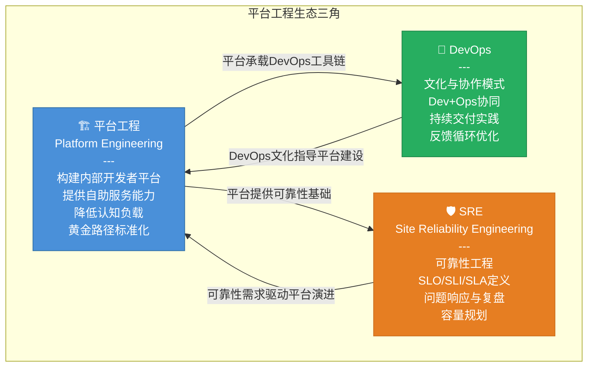

**核心区别：**

| 维度 | 平台工程 | DevOps | SRE |
|------|---------|--------|-----|
| 核心目标 | 降低认知负载，提升 DevEx | 打破 Dev/Ops 壁垒 | 保障系统可靠性 |
| 主要产出 | IDP、黄金路径、自助服务 | 协作文化、实践方法 | SLO体系、问题手册 |
| 服务对象 | 应用开发团队 | 整个工程组织 | 运维与可靠性 |
| 技术重心 | 平台产品化 | 自动化与协作 | 监控与响应 |

## 1.3 Team Topologies 与平台团队模型

Matthew Skelton 和 Manuel Pais 的 **Team Topologies** 框架为平台工程提供了组织模型基础：

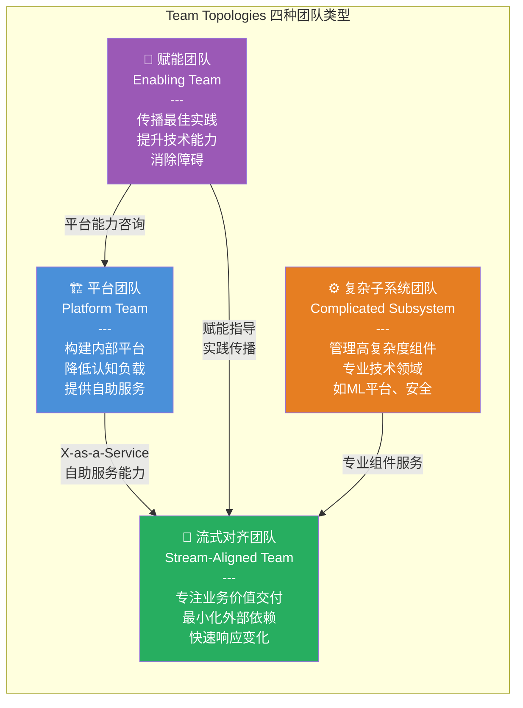

**平台团队核心职责：**

- **产品思维**：将平台视为内部产品，开发者是"客户"
- **自助服务优先**：减少协调成本，提升开发者自主性
- **黄金路径维护**：定义并维护标准化最佳实践路径
- **开发者体验度量**：通过 DORA/SPACE 等指标持续改进

---

<!-- chunk: 2. IDP 架构设计 -->## 2. IDP 架构设计

## 2.1 IDP 能力层次模型

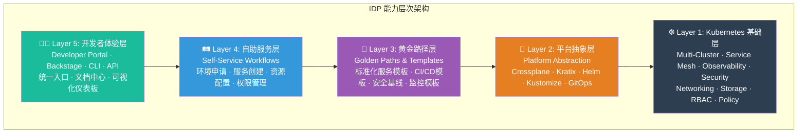

## 2.2 Platform API 设计原则

优秀的 Platform API 应遵循以下设计原则：

```yaml
# Platform API 设计原则清单
platform_api_design_principles:

  developer_centric:
    principle: "以开发者为中心，隐藏基础设施复杂性"
    good_example: |
      # ✅ 好的 Platform API：开发者只需关心业务语义
      apiVersion: platform.company.io/v1
      kind: Application
      metadata:
        name: payment-service
      spec:
        language: java
        framework: spring-boot
        replicas: 3
        database: postgres
        tier: production

    bad_example: |
      # ❌ 差的 Platform API：暴露过多 K8s 细节
      apiVersion: apps/v1
      kind: Deployment
      # ... 大量 K8s 原生配置，开发者需要深度理解 K8s

  progressive_disclosure:
    principle: "渐进式披露，简单场景简单配置，高级场景可扩展"
    levels:
      - level: basic    # 最小配置，适合80%场景
      - level: standard # 标准配置，覆盖常见需求
      - level: advanced # 高级配置，满足特殊需求
      - level: escape_hatch # 逃生出口，直接操作 K8s

  golden_path_first:
    principle: "黄金路径优先，默认即最佳实践"
    defaults_include:
      - resource_limits: "自动根据服务类型设置合理默认值"
      - security_context: "默认非特权运行、只读文件系统"
      - network_policy: "默认最小权限网络访问"
      - observability: "自动注入日志、指标、链路追踪"

  self_service_by_default:
    principle: "自助服务优先，无需人工审批常见操作"
    auto_approved:
      - namespace_creation: "开发/测试环境"
      - scale_within_quota: "配额范围内扩缩容"
      - feature_flags: "功能开关管理"
    requires_approval:
      - production_namespace: "生产环境命名空间"
      - quota_increase: "资源配额超限申请"
      - external_access: "对外暴露服务"
```

## 2.3 平台团队组织模型

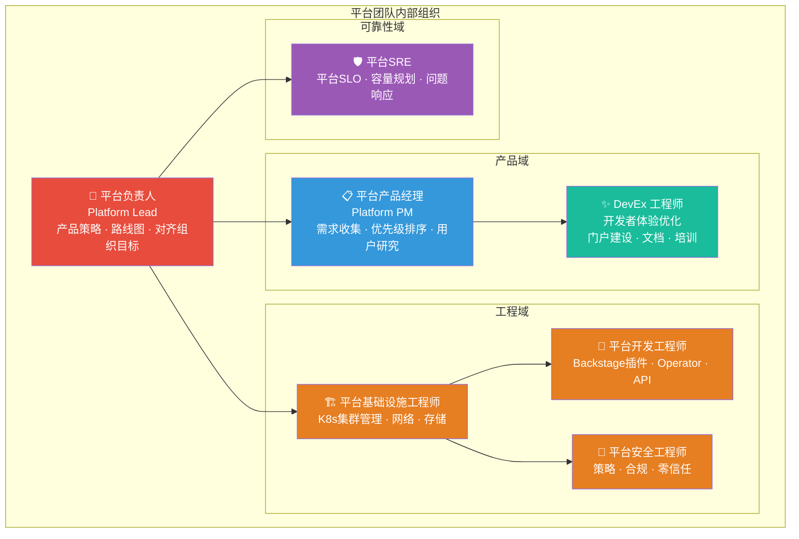

---

<!-- chunk: 3. Backstage 平台门户实践 -->## 3. Backstage 平台门户实践

## 3.1 Backstage 项目概述

[Backstage](https://backstage.io) 由 Spotify 开源，2022 年成为 **CNCF Incubating** 项目，2024 年晋升为 **CNCF Graduated** 项目。它是目前最广泛采用的开发者门户框架，被 Spotify、Netflix、American Airlines、Box 等数百家企业使用。

**核心能力：**

| 组件 | 功能描述 |
|------|---------|
| **Software Catalog** | 统一服务目录，追踪所有组件、API、资源的元数据 |
| **Scaffolder** | 软件模板引擎，快速创建符合标准的新项目 |
| **TechDocs** | 文档即代码，从代码仓库自动生成和发布技术文档 |
| **Search** | 跨所有数据源的统一搜索 |
| **Plugins** | 可扩展插件生态，支持集成任意工具 |

## 3.2 Backstage 架构图

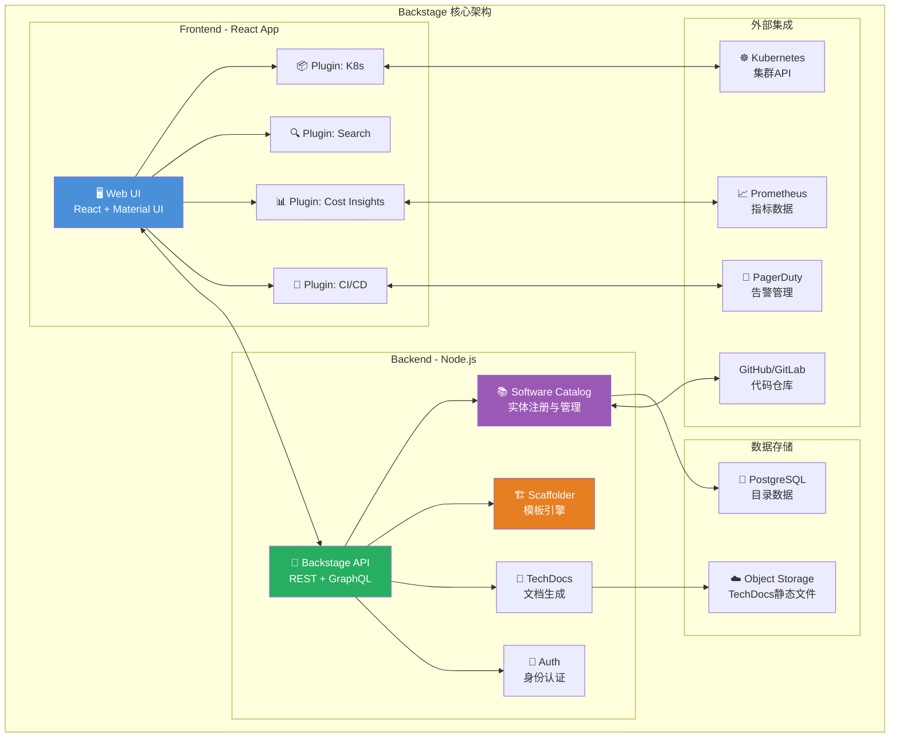

## 3.3 在 Kubernetes 上部署 Backstage

```yaml
# backstage-deployment.yaml
# 完整的 Backstage K8s 部署配置（生产级）

---
apiVersion: v1
kind: Namespace
metadata:
  name: backstage
  labels:
    app.kubernetes.io/part-of: internal-developer-platform

---
# PostgreSQL StatefulSet
apiVersion: apps/v1
kind: StatefulSet
metadata:
  name: backstage-postgres
  namespace: backstage
spec:
  serviceName: backstage-postgres
  replicas: 1
  selector:
    matchLabels:
      app: backstage-postgres
  template:
    metadata:
      labels:
        app: backstage-postgres
    spec:
      containers:
        - name: postgres
          image: postgres:15-alpine
          env:
            - name: POSTGRES_DB
              value: backstage
            - name: POSTGRES_USER
              valueFrom:
                secretKeyRef:
                  name: backstage-postgres-secret
                  key: username
            - name: POSTGRES_PASSWORD
              valueFrom:
                secretKeyRef:
                  name: backstage-postgres-secret
                  key: password
          ports:
            - containerPort: 5432
          volumeMounts:
            - name: postgres-data
              mountPath: /var/lib/postgresql/data
          resources:
            requests:
              memory: "256Mi"
              cpu: "250m"
            limits:
              memory: "512Mi"
              cpu: "500m"
  volumeClaimTemplates:
    - metadata:
        name: postgres-data
      spec:
        accessModes: ["ReadWriteOnce"]
        storageClassName: standard
        resources:
          requests:
            storage: 10Gi

---
# Backstage Deployment
apiVersion: apps/v1
kind: Deployment
metadata:
  name: backstage
  namespace: backstage
  labels:
    app: backstage
    app.kubernetes.io/component: portal
    app.kubernetes.io/part-of: internal-developer-platform
spec:
  replicas: 2
  selector:
    matchLabels:
      app: backstage
  template:
    metadata:
      labels:
        app: backstage
      annotations:
        prometheus.io/scrape: "true"
        prometheus.io/port: "7007"
        prometheus.io/path: "/metrics"
    spec:
      serviceAccountName: backstage
      containers:
        - name: backstage
          image: company/backstage:v1.25.0
          imagePullPolicy: Always
          ports:
            - name: http
              containerPort: 7007
          env:
            - name: NODE_ENV
              value: production
            - name: POSTGRES_HOST
              value: backstage-postgres
            - name: POSTGRES_PORT
              value: "5432"
            - name: POSTGRES_USER
              valueFrom:
                secretKeyRef:
                  name: backstage-postgres-secret
                  key: username
            - name: POSTGRES_PASSWORD
              valueFrom:
                secretKeyRef:
                  name: backstage-postgres-secret
                  key: password
            - name: GITHUB_TOKEN
              valueFrom:
                secretKeyRef:
                  name: backstage-github-secret
                  key: token
            - name: AUTH_GITHUB_CLIENT_ID
              valueFrom:
                secretKeyRef:
                  name: backstage-auth-secret
                  key: github-client-id
            - name: AUTH_GITHUB_CLIENT_SECRET
              valueFrom:
                secretKeyRef:
                  name: backstage-auth-secret
                  key: github-client-secret
          volumeMounts:
            - name: backstage-config
              mountPath: /app/app-config.production.yaml
              subPath: app-config.production.yaml
          livenessProbe:
            httpGet:
              path: /healthcheck
              port: 7007
            initialDelaySeconds: 30
            periodSeconds: 10
          readinessProbe:
            httpGet:
              path: /healthcheck
              port: 7007
            initialDelaySeconds: 10
            periodSeconds: 5
          resources:
            requests:
              memory: "512Mi"
              cpu: "500m"
            limits:
              memory: "1Gi"
              cpu: "1000m"
      volumes:
        - name: backstage-config
          configMap:
            name: backstage-config

---
# ServiceAccount with RBAC for K8s plugin
apiVersion: v1
kind: ServiceAccount
metadata:
  name: backstage
  namespace: backstage

---
apiVersion: rbac.authorization.k8s.io/v1
kind: ClusterRole
metadata:
  name: backstage-k8s-reader
rules:
  - apiGroups: [""]
    resources: ["pods", "services", "configmaps", "namespaces", "nodes"]
    verbs: ["get", "list", "watch"]
  - apiGroups: ["apps"]
    resources: ["deployments", "replicasets", "statefulsets", "daemonsets"]
    verbs: ["get", "list", "watch"]
  - apiGroups: ["autoscaling"]
    resources: ["horizontalpodautoscalers"]
    verbs: ["get", "list", "watch"]
  - apiGroups: ["batch"]
    resources: ["jobs", "cronjobs"]
    verbs: ["get", "list", "watch"]
  - apiGroups: ["networking.k8s.io"]
    resources: ["ingresses"]
    verbs: ["get", "list", "watch"]
  - apiGroups: ["metrics.k8s.io"]
    resources: ["pods", "nodes"]
    verbs: ["get", "list"]

---
apiVersion: rbac.authorization.k8s.io/v1
kind: ClusterRoleBinding
metadata:
  name: backstage-k8s-reader
roleRef:
  apiGroup: rbac.authorization.k8s.io
  kind: ClusterRole
  name: backstage-k8s-reader
subjects:
  - kind: ServiceAccount
    name: backstage
    namespace: backstage

---
# Service and Ingress
apiVersion: v1
kind: Service
metadata:
  name: backstage
  namespace: backstage
spec:
  selector:
    app: backstage
  ports:
    - port: 80
      targetPort: 7007

---
apiVersion: networking.k8s.io/v1
kind: Ingress
metadata:
  name: backstage
  namespace: backstage
  annotations:
    nginx.ingress.kubernetes.io/ssl-redirect: "true"
    cert-manager.io/cluster-issuer: "letsencrypt-prod"
spec:
  ingressClassName: nginx
  tls:
    - hosts:
        - backstage.company.internal
      secretName: backstage-tls
  rules:
    - host: backstage.company.internal
      http:
        paths:
          - path: /
            pathType: Prefix
            backend:
              service:
                name: backstage
                port:
                  number: 80
```

## 3.4 自定义软件模板（Scaffolder Template）

```yaml
# template-spring-boot-service.yaml
# Backstage Scaffolder 模板：快速创建 Spring Boot 微服务

apiVersion: scaffolder.backstage.io/v1beta3
kind: Template
metadata:
  name: spring-boot-microservice
  title: Spring Boot 微服务模板
  description: |
    创建符合公司标准的 Spring Boot 微服务，包含：
    - 标准化项目结构
    - CI/CD 流水线（GitHub Actions）
    - Helm Chart 部署配置
    - Prometheus 指标暴露
    - 结构化日志配置
    - Dockerfile（多阶段构建）
  tags:
    - java
    - spring-boot
    - microservice
    - golden-path
  annotations:
    backstage.io/techdocs-ref: dir:.
spec:
  owner: platform-team
  type: service

  # 用户输入参数定义
  parameters:
    - title: 服务基本信息
      required:
        - component_id
        - description
        - owner
        - java_version
      properties:
        component_id:
          title: 服务名称
          type: string
          description: 服务的唯一标识符（英文小写，连字符分隔）
          pattern: '^[a-z0-9-]+$'
          ui:autofocus: true
        description:
          title: 服务描述
          type: string
          description: 简要描述服务的业务功能
        owner:
          title: 所属团队
          type: string
          description: 负责该服务的团队
          ui:field: OwnerPicker
          ui:options:
            allowedKinds:
              - Group
        java_version:
          title: Java 版本
          type: string
          default: "21"
          enum:
            - "17"
            - "21"
          enumNames:
            - "Java 17 (LTS)"
            - "Java 21 (LTS, 推荐)"
        initial_replicas:
          title: 初始副本数
          type: integer
          default: 2
          minimum: 1
          maximum: 10

    - title: 数据库配置（可选）
      properties:
        database_required:
          title: 是否需要数据库
          type: boolean
          default: false
        database_type:
          title: 数据库类型
          type: string
          enum:
            - postgresql
            - mysql
            - none
          default: none
          ui:widget: select

    - title: 代码仓库配置
      required:
        - repoUrl
      properties:
        repoUrl:
          title: 代码仓库地址
          type: string
          ui:field: RepoUrlPicker
          ui:options:
            allowedHosts:
              - github.com
              - gitlab.company.internal

  # 执行步骤
  steps:
    - id: fetch-base
      name: 拉取基础模板
      action: fetch:template
      input:
        url: ./skeleton
        copyWithoutRender:
          - .github/workflows/*.yml
        values:
          component_id: ${{ parameters.component_id }}
          description: ${{ parameters.description }}
          owner: ${{ parameters.owner }}
          java_version: ${{ parameters.java_version }}
          initial_replicas: ${{ parameters.initial_replicas }}
          database_required: ${{ parameters.database_required }}
          database_type: ${{ parameters.database_type }}
          destination: ${{ parameters.repoUrl | parseRepoUrl }}

    - id: publish
      name: 推送到代码仓库
      action: publish:github
      input:
        allowedHosts: ['github.com']
        description: ${{ parameters.description }}
        repoUrl: ${{ parameters.repoUrl }}
        repoVisibility: private
        defaultBranch: main
        gitCommitMessage: "feat: initial project setup from platform template"
        topics:
          - java
          - spring-boot
          - microservice

    - id: register
      name: 注册到 Backstage Catalog
      action: catalog:register
      input:
        repoContentsUrl: ${{ steps.publish.output.repoContentsUrl }}
        catalogInfoPath: '/catalog-info.yaml'

    - id: create-argocd-app
      name: 创建 ArgoCD 应用（开发环境）
      action: argocd:create-resources
      input:
        appName: ${{ parameters.component_id }}-dev
        argoInstance: main-argocd
        namespace: ${{ parameters.component_id }}-dev
        repoUrl: ${{ steps.publish.output.remoteUrl }}
        path: deploy/helm
        values:
          environment: development
          replicaCount: 1

  # 完成后输出信息
  output:
    links:
      - title: 打开代码仓库
        url: ${{ steps.publish.output.remoteUrl }}
        icon: github
      - title: 在 Backstage 中查看服务
        icon: catalog
        entityRef: ${{ steps.register.output.entityRef }}
      - title: 查看 ArgoCD 应用
        url: https://argocd.company.internal/applications/${{ parameters.component_id }}-dev
        icon: dashboard
    text:
      - title: 下一步操作
        content: |
          🎉 服务创建成功！

          **接下来你需要：**
          1. Clone 仓库：`git clone ${{ steps.publish.output.remoteUrl }}`
          2. 按需修改 `src/main/resources/application.yml`
          3. 推送代码触发 CI/CD 流水线
          4. 在 Backstage 中查看服务状态
```

## 3.5 Kubernetes Plugin 集成配置

```yaml
# backstage app-config.yaml 中的 K8s plugin 配置
kubernetes:
  serviceLocatorMethod:
    type: multiTenant       # 多租户模式，通过 catalog 标签定位服务
  clusterLocatorMethods:
    - type: config
      clusters:
        - name: production-cluster
          url: https://k8s-prod.company.internal
          authProvider: serviceAccount
          skipTLSVerify: false
          skipMetricsLookup: false
          serviceAccountToken:
            $secret:
              env: K8S_PROD_SA_TOKEN
          caData:
            $secret:
              env: K8S_PROD_CA_DATA
          customResources:
            - group: 'argoproj.io'
              apiVersion: 'v1alpha1'
              plural: 'rollouts'
            - group: 'monitoring.coreos.com'
              apiVersion: 'v1'
              plural: 'servicemonitors'

        - name: staging-cluster
          url: https://k8s-staging.company.internal
          authProvider: serviceAccount
          serviceAccountToken:
            $secret:
              env: K8S_STAGING_SA_TOKEN

  # 对象标注规范（开发者在 catalog-info.yaml 中添加）
  # 示例：
  # backstage.io/kubernetes-id: payment-service
  # backstage.io/kubernetes-namespace: payment
  # backstage.io/kubernetes-label-selector: 'app=payment-service'
```

---

<!-- chunk: 4. Kratix 多集群 IDP 管理 -->## 4. Kratix 多集群 IDP 管理

## 4.1 Kratix 简介与架构

[Kratix](https://kratix.io) 是由 Syntasso 开发的开源框架，专为构建平台即产品（Platform as a Product）设计。它通过 **Promise** 概念将平台能力封装为可组合的服务，并通过 GitOps 工作流将请求分发到多个工作集群。

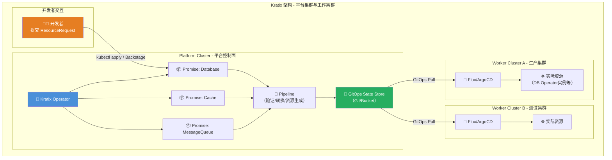

## 4.2 Promise 定义示例（自助服务数据库）

```yaml
# kratix-postgresql-promise.yaml
# 定义一个自助服务 PostgreSQL 数据库 Promise

apiVersion: platform.kratix.io/v1alpha1
kind: Promise
metadata:
  name: postgresql
  namespace: kratix-platform-system
  labels:
    kratix.io/promise-version: v1.0.0
  annotations:
    kratix.io/description: |
      提供按需 PostgreSQL 数据库实例，支持开发、测试、生产环境。
      包含自动备份、监控集成和连接池配置。
spec:
  # API 定义：开发者可请求的数据库规格
  api:
    apiVersion: apiextensions.k8s.io/v1
    kind: CustomResourceDefinition
    metadata:
      name: postgresqls.marketplace.kratix.io
    spec:
      group: marketplace.kratix.io
      names:
        kind: postgresql
        plural: postgresqls
      scope: Namespaced
      versions:
        - name: v1alpha1
          served: true
          storage: true
          schema:
            openAPIV3Schema:
              type: object
              properties:
                spec:
                  type: object
                  required: ["env", "teamName"]
                  properties:
                    env:
                      type: string
                      description: "目标环境"
                      enum: [dev, staging, production]
                    teamName:
                      type: string
                      description: "申请团队名称"
                      pattern: '^[a-z0-9-]+$'
                    dbName:
                      type: string
                      description: "数据库名称"
                      default: "app"
                    size:
                      type: string
                      description: "数据库规格"
                      enum: [small, medium, large]
                      default: small
                    version:
                      type: string
                      description: "PostgreSQL 版本"
                      enum: ["14", "15", "16"]
                      default: "15"
                    enableBackup:
                      type: boolean
                      default: true

  # Pipeline：处理请求的工作流
  workflows:
    resource:
      configure:
        - apiVersion: platform.kratix.io/v1alpha1
          kind: Pipeline
          metadata:
            name: postgresql-configure-pipeline
          spec:
            volumes:
              - name: shared-output
                emptyDir: {}
            initContainers:
              # Step 1: 验证请求合规性
              - name: validate-request
                image: company/platform-tools:v1.0
                command: ["/scripts/validate-postgresql-request.sh"]
                volumeMounts:
                  - name: shared-output
                    mountPath: /output

              # Step 2: 根据环境和规格生成资源
              - name: generate-resources
                image: company/platform-tools:v1.0
                command: ["/scripts/generate-postgresql-resources.sh"]
                env:
                  - name: BACKUP_BUCKET
                    value: "company-db-backups"
                  - name: MONITORING_NAMESPACE
                    value: "monitoring"
                volumeMounts:
                  - name: shared-output
                    mountPath: /output

              # Step 3: 安全扫描与策略检查
              - name: security-check
                image: company/platform-security:v1.0
                command: ["/scripts/security-policy-check.sh"]
                volumeMounts:
                  - name: shared-output
                    mountPath: /output

            containers:
              - name: status-writer
                image: ghcr.io/syntasso/kratix-pipeline-utility:v0.11.0

  # 集群选择器：决定资源部署到哪些集群
  destinationSelectors:
    - matchLabels:
        environment: production   # 生产请求发往生产集群
      when:
        - spec.env == "production"
    - matchLabels:
        environment: non-production  # 其他请求发往非生产集群
      when:
        - spec.env != "production"

---
# 开发者提交的资源请求示例
apiVersion: marketplace.kratix.io/v1alpha1
kind: postgresql
metadata:
  name: payment-service-db
  namespace: payment-team
spec:
  env: production
  teamName: payment-team
  dbName: payment
  size: medium
  version: "15"
  enableBackup: true
```

## 4.3 GitOps 工作流集成

```yaml
# Flux HelmRelease 用于工作集群同步 Kratix 输出
# 工作集群上的 Flux 配置

apiVersion: source.toolkit.fluxcd.io/v1beta2
kind: GitRepository
metadata:
  name: kratix-state-store
  namespace: flux-system
spec:
  interval: 1m
  url: https://github.com/company/kratix-state-store
  secretRef:
    name: flux-git-credentials
  ref:
    branch: main

---
apiVersion: kustomize.toolkit.fluxcd.io/v1
kind: Kustomization
metadata:
  name: kratix-worker-resources
  namespace: flux-system
spec:
  interval: 2m
  path: "./worker-cluster-prod"
  prune: true               # 自动清理已删除的资源
  sourceRef:
    kind: GitRepository
    name: kratix-state-store
  healthChecks:
    - apiVersion: apps/v1
      kind: Deployment
      name: "*"
      namespace: "*"
  postBuild:
    substitute:
      CLUSTER_NAME: "production-cluster"
      CLUSTER_ENV: "production"
```

---

<!-- chunk: 5. 黄金路径设计与治理 -->## 5. 黄金路径设计与治理

## 5.1 三条核心黄金路径

黄金路径（Golden Path）是平台团队为常见业务场景预先设计的标准化端到端路径，包含从代码到生产的完整工具链配置：

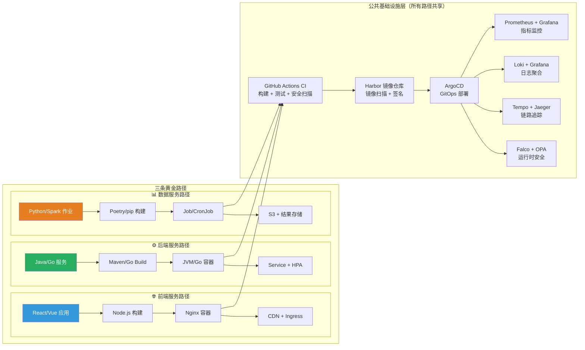

## 5.2 后端服务黄金路径模板内容

```yaml
# golden-path-backend-service.yaml
# 后端微服务黄金路径 - 模板内容清单

golden_path:
  name: backend-microservice
  version: v2.1.0
  last_updated: "2026-03-03"
  maintained_by: platform-team

  # 1. 项目结构模板
  project_structure:
    required_files:
      - path: Dockerfile
        description: "多阶段构建，最终镜像基于 distroless"
        security_baseline:
          - run_as_non_root: true
          - no_privileged: true
          - read_only_root: false
      - path: .github/workflows/ci.yaml
        description: "标准 CI 流水线配置"
      - path: deploy/helm/Chart.yaml
        description: "Helm Chart 部署配置"
      - path: deploy/helm/values.yaml
        description: "默认值（黄金路径默认配置）"
      - path: deploy/helm/values-production.yaml
        description: "生产环境覆盖值"
      - path: catalog-info.yaml
        description: "Backstage 服务注册信息"
      - path: docs/index.md
        description: "TechDocs 文档入口"

  # 2. Helm Chart 默认值（黄金路径强制项）
  helm_defaults:
    # 资源配置（按规格分级）
    resources:
      small:
        requests: { memory: "128Mi", cpu: "100m" }
        limits:   { memory: "256Mi", cpu: "200m" }
      medium:
        requests: { memory: "256Mi", cpu: "250m" }
        limits:   { memory: "512Mi", cpu: "500m" }
      large:
        requests: { memory: "512Mi", cpu: "500m" }
        limits:   { memory: "1Gi", cpu: "1000m" }

    # 安全上下文（强制）
    securityContext:
      runAsNonRoot: true
      runAsUser: 1000
      allowPrivilegeEscalation: false
      readOnlyRootFilesystem: true
      capabilities:
        drop: ["ALL"]

    # 健康检查（强制）
    probes:
      liveness:
        httpGet: { path: /health/live, port: 8080 }
        initialDelaySeconds: 30
        periodSeconds: 10
        failureThreshold: 3
      readiness:
        httpGet: { path: /health/ready, port: 8080 }
        initialDelaySeconds: 10
        periodSeconds: 5
        failureThreshold: 3

    # 可观测性（自动注入）
    observability:
      metrics:
        enabled: true
        port: 8080
        path: /actuator/prometheus
      tracing:
        enabled: true
        sampler: 0.1  # 10% 采样率
        otlp_endpoint: http://otel-collector:4317
      logging:
        format: json  # 结构化日志
        level: INFO

    # HPA 配置（默认启用）
    autoscaling:
      enabled: true
      minReplicas: 2
      maxReplicas: 10
      targetCPUUtilizationPercentage: 70
      targetMemoryUtilizationPercentage: 80

    # PodDisruptionBudget（强制，保障可用性）
    podDisruptionBudget:
      enabled: true
      minAvailable: 1

    # Network Policy（默认最小权限）
    networkPolicy:
      enabled: true
      ingressRules:
        - from: [namespaceSelector: {matchLabels: {app.kubernetes.io/part-of: "ingress-nginx"}}]
        - from: [namespaceSelector: {matchLabels: {app.kubernetes.io/name: "prometheus"}}]
          ports: [{port: 8080, protocol: TCP}]

  # 3. CI 流水线标准步骤
  ci_pipeline_stages:
    - stage: code-quality
      steps: [lint, format-check, complexity-analysis]
    - stage: test
      steps: [unit-tests, integration-tests, coverage-report]
      requirements:
        coverage_threshold: 80
    - stage: security
      steps: [sast-scan, dependency-audit, license-check]
      tools: [trivy, snyk, cyclonedx]
    - stage: build
      steps: [docker-build, docker-scan, sign-image]
    - stage: publish
      steps: [push-to-harbor, update-gitops-repo]

  # 4. 监控仪表板（自动创建）
  monitoring:
    dashboards:
      - name: service-overview
        metrics: [qps, error_rate, p99_latency, saturation]
      - name: jvm-metrics
        metrics: [heap_usage, gc_pause, thread_count]
    alerts:
      - name: high-error-rate
        condition: error_rate > 5%
        severity: warning
      - name: high-latency
        condition: p99_latency > 500ms
        severity: warning
      - name: pod-crash-loop
        condition: restart_count > 3
        severity: critical

## 5.3 黄金路径偏差治理

```yaml
# deviation-governance-policy.yaml
# 黄金路径偏差申请与治理

apiVersion: platform.company.io/v1
kind: DeviationRequest
metadata:
  name: payment-service-custom-network-policy
  namespace: payment-team
  annotations:
    platform.company.io/reviewer: platform-team
    platform.company.io/expires: "2026-06-03"
spec:
  service: payment-service
  team: payment-team
  golden_path: backend-microservice
  deviation_type: network-policy   # 偏差类型

  justification: |
    支付服务需要直接访问外部 PCI DSS 合规的支付网关 IP 段，
    标准网络策略不允许此类出站连接。安全团队已审批 (SEC-2026-0234)。

  requested_change:
    field: "networkPolicy.egressRules"
    current_value: "[]  # 默认无出站"
    requested_value: |
      - to:
          - ipBlock:
              cidr: 192.168.100.0/24  # 支付网关IP段
        ports:
          - port: 443
            protocol: TCP

  approval_status: approved
  approved_by: security-team@company.com
  approved_at: "2026-02-15"
  review_date: "2026-06-03"  # 到期重新评审
```

---

<!-- chunk: 6. 开发者体验指标体系 -->## 6. 开发者体验指标体系

## 6.1 DORA 指标集成

DORA（DevOps Research and Assessment）四项指标是衡量软件交付效能的行业标准：

```yaml
# dora-metrics-config.yaml
# DORA 指标采集与计算配置

dora_metrics:
  deployment_frequency:
    description: "部署频率 - 成功将代码部署到生产环境的频率"
    target:
      elite: "按需部署（每天多次）"
      high: "每天 1 次到每周 1 次"
      medium: "每周 1 次到每月 1 次"
      low: "每月 1 次以下"
    measurement:
      source: argocd
      query: |
        sum(increase(argocd_app_sync_total{
          result="succeeded",
          dest_server=~".*production.*"
        }[24h]))
      dashboard: grafana/dora-dashboard
      alert_threshold: "low_performer"

  lead_time_for_changes:
    description: "变更前置时间 - 从代码提交到生产部署的时间"
    target:
      elite: "< 1 小时"
      high: "1 天到 1 周"
      medium: "1 周到 1 月"
      low: "> 1 月"
    measurement:
      source: github_actions + argocd
      calculation: "production_deploy_time - first_commit_time"
      percentile: p50  # 中位数

  change_failure_rate:
    description: "变更失败率 - 导致生产问题的部署比例"
    target:
      elite: "0-5%"
      high: "5-10%"
      medium: "10-15%"
      low: "> 15%"
    measurement:
      source: pagerduty + argocd
      calculation: "failed_deployments / total_deployments"

  mean_time_to_restore:
    description: "平均恢复时间 - 生产事故从发生到恢复的时间"
    target:
      elite: "< 1 小时"
      high: "< 1 天"
      medium: "1 天到 1 周"
      low: "> 1 周"
    measurement:
      source: pagerduty
      calculation: "incident_resolved_time - incident_created_time"
```

## 6.2 SPACE 框架应用

SPACE 框架由 GitHub/Microsoft 研究团队提出，提供更全面的开发者生产力度量视角：

```yaml
# space-framework-metrics.yaml
# SPACE 开发者生产力框架

space_framework:
  satisfaction_and_wellbeing:
    description: "开发者满意度与工作幸福感"
    metrics:
      - name: platform_nps
        description: "平台 NPS（净推荐值）"
        measurement: quarterly_survey
        question: "你向同事推荐使用我们内部开发者平台的可能性？(0-10)"
        calculation: "promoters(9-10) - detractors(0-6)"
        target: "> 30 (良好), > 50 (优秀)"

      - name: developer_satisfaction_index
        description: "开发者满意度指数"
        measurement: monthly_survey
        dimensions:
          - tooling_quality: "工具链质量"
          - documentation: "文档完善度"
          - onboarding_experience: "入职上手体验"
          - self_service_availability: "自助服务可用性"
          - platform_reliability: "平台可靠性"

  performance:
    description: "个人/团队交付成果"
    metrics:
      - name: feature_cycle_time
        description: "功能从开发到上线的周期时间"
        source: jira + github
        target: "P50 < 3 天"
      - name: pr_merge_time
        description: "PR 从提交到合并的时间"
        source: github
        target: "P50 < 4 小时"

  activity:
    description: "可量化的工作产出"
    metrics:
      - name: deployment_count
        description: "每团队每周部署次数"
      - name: automated_test_coverage
        description: "自动化测试覆盖率"
        target: "> 80%"
      - name: documentation_freshness
        description: "文档更新率（过去90天内更新）"

  communication_and_collaboration:
    description: "沟通与协作效率"
    metrics:
      - name: pr_review_turnaround
        description: "Code Review 响应时间"
        target: "P90 < 24 小时"
      - name: cross_team_dependency_resolution
        description: "跨团队依赖解决时间"
      - name: incident_collaboration_score
        description: "事故协作效率评分"

  efficiency_and_flow:
    description: "工作流畅度与效率"
    metrics:
      - name: flow_efficiency
        description: "流动效率（活跃工作时间/总周期时间）"
        target: "> 40%"
      - name: context_switching_index
        description: "上下文切换频率"
        measurement: "同时进行中的任务数量"
        target: "< 3 个并行任务"
      - name: build_success_rate
        description: "CI 构建成功率"
        source: github_actions
        target: "> 95%"
      - name: mean_time_to_onboard
        description: "新服务从零到首次生产部署时间"
        target: "< 2 天（使用黄金路径模板）"
```

## 6.3 平台 NPS 监测配置

```yaml
# platform-nps-cronjob.yaml
# 定期向开发者发送 NPS 调研的 CronJob

apiVersion: batch/v1
kind: CronJob
metadata:
  name: platform-nps-survey
  namespace: backstage
  labels:
    app.kubernetes.io/component: devex-measurement
spec:
  schedule: "0 9 1 * *"   # 每月 1 日 09:00 执行
  jobTemplate:
    spec:
      template:
        spec:
          containers:
            - name: nps-sender
              image: company/platform-tools:v1.0
              command: ["/scripts/send-nps-survey.sh"]
              env:
                - name: SURVEY_TOOL
                  value: "typeform"  # 或 google-forms, custom
                - name: SLACK_WEBHOOK
                  valueFrom:
                    secretKeyRef:
                      name: platform-notifications
                      key: slack-webhook
                - name: TARGET_AUDIENCE
                  value: "all-engineers"
                - name: SURVEY_LINK
                  value: "https://platform.company.internal/nps"
          restartPolicy: OnFailure
```

---

<!-- chunk: 7. 自助服务能力构建 -->## 7. 自助服务能力构建

## 7.1 Namespace 自动化创建（Crossplane + Backstage）

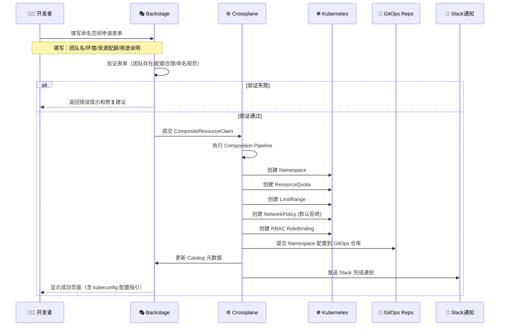

## 7.2 Crossplane Composition 配置

```yaml
# crossplane-namespace-composition.yaml
# Crossplane Composition：自动化创建标准化命名空间

apiVersion: apiextensions.crossplane.io/v1
kind: Composition
metadata:
  name: team-namespace
  labels:
    crossplane.io/xrd: xteamnamespaces.platform.company.io
spec:
  compositeTypeRef:
    apiVersion: platform.company.io/v1alpha1
    kind: XTeamNamespace

  resources:
    # 1. 创建 Namespace
    - name: namespace
      base:
        apiVersion: v1
        kind: Namespace
        metadata:
          labels:
            managed-by: crossplane
            platform.company.io/team: ""
            platform.company.io/environment: ""
        annotations:
          platform.company.io/created-via: backstage
      patches:
        - type: FromCompositeFieldPath
          fromFieldPath: spec.teamName
          toFieldPath: metadata.name
          transforms:
            - type: string
              string:
                fmt: "%s"
        - type: FromCompositeFieldPath
          fromFieldPath: spec.environment
          toFieldPath: metadata.labels["platform.company.io/environment"]
        - type: FromCompositeFieldPath
          fromFieldPath: spec.teamName
          toFieldPath: metadata.labels["platform.company.io/team"]

    # 2. 创建 ResourceQuota
    - name: resource-quota
      base:
        apiVersion: v1
        kind: ResourceQuota
        metadata:
          name: default-quota
        spec:
          hard:
            requests.cpu: "4"
            requests.memory: "8Gi"
            limits.cpu: "8"
            limits.memory: "16Gi"
            pods: "50"
            services: "10"
            persistentvolumeclaims: "10"
      patches:
        - type: FromCompositeFieldPath
          fromFieldPath: spec.teamName
          toFieldPath: metadata.namespace
        - type: FromCompositeFieldPath
          fromFieldPath: spec.quotaTier
          toFieldPath: spec.hard
          transforms:
            - type: map
              map:
                small:
                  requests.cpu: "2"
                  requests.memory: "4Gi"
                  limits.cpu: "4"
                  limits.memory: "8Gi"
                  pods: "20"
                medium:
                  requests.cpu: "4"
                  requests.memory: "8Gi"
                  limits.cpu: "8"
                  limits.memory: "16Gi"
                  pods: "50"
                large:
                  requests.cpu: "8"
                  requests.memory: "16Gi"
                  limits.cpu: "16"
                  limits.memory: "32Gi"
                  pods: "100"

    # 3. 创建 LimitRange（设置默认资源限制）
    - name: limit-range
      base:
        apiVersion: v1
        kind: LimitRange
        metadata:
          name: default-limits
        spec:
          limits:
            - type: Container
              defaultRequest:
                cpu: "100m"
                memory: "128Mi"
              default:
                cpu: "200m"
                memory: "256Mi"
              max:
                cpu: "2"
                memory: "4Gi"
            - type: Pod
              max:
                cpu: "4"
                memory: "8Gi"
      patches:
        - type: FromCompositeFieldPath
          fromFieldPath: spec.teamName
          toFieldPath: metadata.namespace

    # 4. 创建默认 NetworkPolicy（默认拒绝所有入站）
    - name: default-deny-network-policy
      base:
        apiVersion: networking.k8s.io/v1
        kind: NetworkPolicy
        metadata:
          name: default-deny-all
        spec:
          podSelector: {}
          policyTypes:
            - Ingress
            - Egress
          egress:
            # 允许 DNS 解析
            - ports:
                - port: 53
                  protocol: UDP
                - port: 53
                  protocol: TCP
      patches:
        - type: FromCompositeFieldPath
          fromFieldPath: spec.teamName
          toFieldPath: metadata.namespace

    # 5. 创建团队 RBAC
    - name: team-role-binding
      base:
        apiVersion: rbac.authorization.k8s.io/v1
        kind: RoleBinding
        metadata:
          name: team-admin
        roleRef:
          apiGroup: rbac.authorization.k8s.io
          kind: ClusterRole
          name: edit
        subjects: []
      patches:
        - type: FromCompositeFieldPath
          fromFieldPath: spec.teamName
          toFieldPath: metadata.namespace
        - type: FromCompositeFieldPath
          fromFieldPath: spec.teamAdGroup
          toFieldPath: subjects[0]
          transforms:
            - type: string
              string:
                fmt: |
                  - kind: Group
                    apiGroup: rbac.authorization.k8s.io
                    name: "%s"

---
# XRD (Composite Resource Definition)
apiVersion: apiextensions.crossplane.io/v1
kind: CompositeResourceDefinition
metadata:
  name: xteamnamespaces.platform.company.io
spec:
  group: platform.company.io
  names:
    kind: XTeamNamespace
    plural: xteamnamespaces
  claimNames:
    kind: TeamNamespace
    plural: teamnamespaces
  versions:
    - name: v1alpha1
      served: true
      referenceable: true
      schema:
        openAPIV3Schema:
          type: object
          properties:
            spec:
              type: object
              required: [teamName, environment, quotaTier]
              properties:
                teamName:
                  type: string
                  pattern: '^[a-z0-9-]+$'
                environment:
                  type: string
                  enum: [dev, staging, production]
                quotaTier:
                  type: string
                  enum: [small, medium, large]
                  default: small
                teamAdGroup:
                  type: string
                  description: "AD 组名，用于 RBAC 绑定"
```

## 7.3 数据库自助服务请求流程

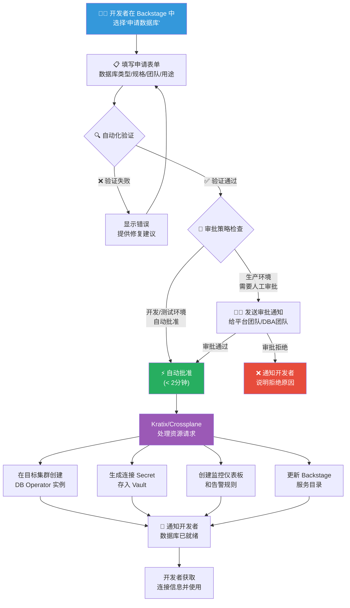

## 7.4 环境克隆能力

平台提供"环境克隆"能力，允许开发者基于生产环境快速创建测试环境：

```yaml
# environment-clone-request.yaml
# 环境克隆请求 - 基于生产快照创建测试环境

apiVersion: platform.company.io/v1alpha1
kind: EnvironmentClone
metadata:
  name: payment-prod-clone-20260303
  namespace: payment-team
spec:
  source:
    environment: production
    service: payment-service
    snapshot_time: "2026-03-03T00:00:00Z"

  target:
    name: payment-test-clone
    environment: test
    ttl: 72h              # 自动清理时间
    resource_scale: 0.2   # 资源规格缩放比例（生产的20%）

  data_handling:
    database:
      strategy: anonymized_copy   # anonymized_copy | empty | seed_data
      anonymization_rules:
        - field: "users.email"
          method: hash
        - field: "users.phone"
          method: replace
          replace_with: "13800138000"
        - field: "orders.amount"
          method: random_range
          range: [1, 100]
    file_storage:
      strategy: empty   # 不复制文件存储

  access_control:
    allowed_teams: [payment-team, qa-team]
    expires_at: "2026-03-06T00:00:00Z"

  notifications:
    on_ready:
      - type: slack
        target: "#payment-team-dev"
    on_expiry:
      - type: slack
        target: "#payment-team-dev"
```

---

<!-- chunk: 8. 最佳实践与反模式 -->## 8. 最佳实践与反模式

## 8.1 Platform as Product 思维

```yaml
# platform-as-product-principles.yaml
platform_as_product:

  core_mindset:
    description: "将平台视为内部产品，开发者是客户"
    practices:
      - name: "用户研究驱动"
        description: "定期与开发者进行用户访谈，理解真实痛点"
        [[entities/cadence.md|cadence]]: "每季度至少 10 次 1:1 开发者访谈"

      - name: "产品路线图公开"
        description: "平台路线图对所有工程师透明可见"
        tool: "Backstage TechDocs 或公司 Wiki"

      - name: "功能请求流程"
        description: "建立结构化的功能请求和反馈渠道"
        channels:
          - slack_channel: "#platform-feedback"
          - github_discussions: "platform-team/feedback"
          - monthly_office_hours: "每月平台团队答疑会"

      - name: "NPS 追踪"
        description: "定期测量平台 NPS，目标 > 30"
        frequency: quarterly

      - name: "SLO 承诺"
        description: "向开发者承诺平台 SLO"
        example_slos:
          - "Backstage 可用性: 99.9%"
          - "新服务创建时间: P95 < 5 分钟"
          - "自助服务请求处理时间: P95 < 10 分钟"
          - "CI 流水线启动时间: P95 < 30 秒"
```

## 8.2 避免过度抽象原则

```yaml
# anti-patterns.yaml
platform_anti_patterns:

  over_abstraction:
    name: "过度抽象黑盒化"
    description: "平台将所有细节隐藏，开发者无法理解底层发生了什么"
    symptoms:
      - "开发者遇到问题完全无法自助排查"
      - "平台团队成为所有问题的唯一解决者"
      - "开发者绕过平台直接操作底层资源"
    solution: |
      提供逃生出口（Escape Hatch），允许高级用户访问底层资源。
      提供透明的平台操作日志和执行记录。
      渐进式抽象：简单场景简单配置，复杂场景可扩展。

  ivory_tower_platform:
    name: "象牙塔平台"
    description: "平台团队闭门造车，不与用户沟通"
    symptoms:
      - "平台功能与开发者实际需求脱节"
      - "平台 NPS 持续走低"
      - "开发者不使用平台，自建工具"
    solution: |
      建立定期用户研究机制。
      邀请高频用户参与平台设计评审。
      设立"平台大使"角色（来自业务团队的平台推广者）。

  premature_standardization:
    name: "过早标准化"
    description: "在最佳实践尚未沉淀前强制标准化"
    symptoms:
      - "黄金路径频繁变更，用户疲于应对"
      - "标准不符合实际需求，被大量申请豁免"
    solution: |
      先观察，再标准化。让实践在一定范围内自然演化。
      当某种做法被 3+ 个团队独立采用时，再考虑提炼为标准。

  platform_as_gatekeeper:
    name: "平台成为守门人"
    description: "平台增加了流程，但没有降低认知负载"
    symptoms:
      - "每个操作都需要填写工单等待审批"
      - "平台成为交付瓶颈，而非加速器"
    solution: |
      自动化常见操作的审批流程。
      只有真正高风险操作才需要人工审批。
      用策略引擎（OPA/Kyverno）替代人工审批低风险请求。
```

## 8.3 平台成熟度评估清单

```yaml
# platform-maturity-checklist.yaml
platform_maturity_checklist:
  level_1_foundation:
    name: "L1 基础就绪"
    items:
      - id: L1-01
        check: "统一的开发者门户（Backstage 或同类）已上线"
        status: required
      - id: L1-02
        check: "所有服务已在 Software Catalog 中注册"
        status: required
      - id: L1-03
        check: "标准 CI/CD 模板已提供"
        status: required
      - id: L1-04
        check: "Kubernetes 集群访问标准化（kubeconfig 管理）"
        status: required
      - id: L1-05
        check: "基础监控告警已为所有服务开箱即用"
        status: required

  level_2_self_service:
    name: "L2 自助服务"
    items:
      - id: L2-01
        check: "新服务创建（Namespace + CI/CD + 监控）全自助，无需人工介入"
        status: required
      - id: L2-02
        check: "开发/测试环境数据库自助申请，< 5 分钟就绪"
        status: required
      - id: L2-03
        check: "环境扩缩容在配额范围内无需审批"
        status: required
      - id: L2-04
        check: "黄金路径覆盖 80% 以上的服务类型"
        status: required

  level_3_developer_experience:
    name: "L3 开发者体验优化"
    items:
      - id: L3-01
        check: "平台 NPS > 30"
        status: target
      - id: L3-02
        check: "新服务首次部署到生产 < 2 天（使用黄金路径）"
        status: target
      - id: L3-03
        check: "DORA 指标中位数达到 High Performer"
        status: target
      - id: L3-04
        check: "开发者每周花在平台相关工作上的时间 < 10%"
        status: target

  level_4_advanced:
    name: "L4 高级平台能力"
    items:
      - id: L4-01
        check: "多集群自助管理（含生产集群访问）"
        status: advanced
      - id: L4-02
        check: "成本可见性（每服务/每团队的 K8s 资源成本）"
        status: advanced
      - id: L4-03
        check: "AI 辅助开发集成（Copilot/代码审查）"
        status: advanced
      - id: L4-04
        check: "平台即代码（Platform as Code，基础设施完全 GitOps）"
        status: advanced
```

---

<!-- chunk: 9. 未来趋势 -->## 9. 未来趋势

## 9.1 AI Copilot 融入 IDP

AI 能力正在深度融合进内部开发者平台，形成下一代 AI-augmented IDP：

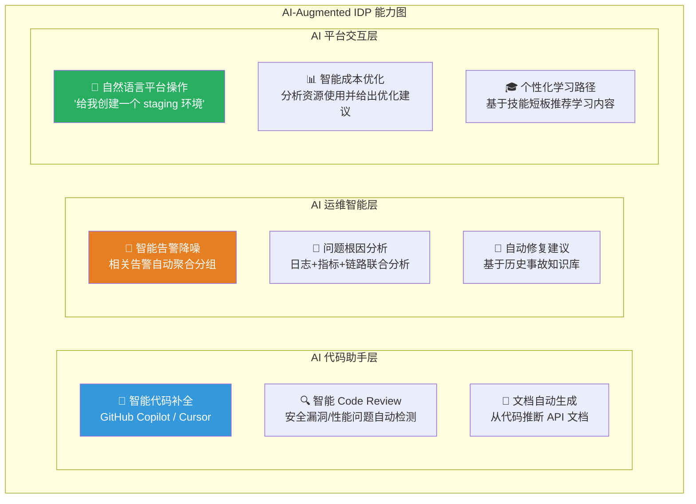

**AI Copilot 在 Backstage 中的集成示例：**

```yaml
# backstage AI plugin 配置示例
# 自然语言驱动的平台操作

ai_copilot_capabilities:
  natural_language_ops:
    examples:
      - input: "帮我把 payment-service 在 staging 环境扩容到 5 个副本"
        action: kubectl_scale
        confirmation_required: true

      - input: "查看 payment-service 最近 1 小时的错误日志"
        action: loki_query
        confirmation_required: false

      - input: "为 user-service 申请一个 PostgreSQL 数据库"
        action: kratix_resource_request
        form_prefill: true
        confirmation_required: true

  intelligent_troubleshooting:
    trigger: "服务健康检查失败时自动触发"
    steps:
      - collect_pod_logs
      - analyze_error_patterns
      - correlate_with_recent_deployments
      - suggest_remediation
      - create_incident_summary
```

## 9.2 平台工程标准化进展

```yaml
# 平台工程标准化趋势（2025-2026）
standardization_trends:

  cncf_platform_working_group:
    status: "CNCF Platforms Working Group 已成立"
    focus:
      - "Platform Engineering 成熟度模型标准化"
      - "IDP 参考架构白皮书"
      - "开发者体验度量标准"

  backstage_ecosystem:
    status: "CNCF Graduated（2024）"
    growth:
      adopters: "2000+ 企业采用"
      plugins: "3000+ 社区插件"
    roadmap:
      - "New Backend System（稳定化）"
      - "Declarative Integration（声明式集成）"
      - "Improved Plugin Marketplace"

  crossplane_maturity:
    status: "CNCF Graduated"
    trends:
      - "Function Pipeline（组合函数流水线）成熟"
      - "Provider 生态持续扩大（100+ Provider）"
      - "与 Kratix 的互补使用模式成熟"

  platform_engineering_skills:
    emerging_roles:
      - "Platform Engineer（独立工程角色）"
      - "Developer Experience Engineer（DevEx 工程师）"
      - "Internal Developer Platform Architect"
    salary_trend: "2025-2026 年平台工程师薪资溢价约 15-25%"
```

## 9.3 技术演进路线图

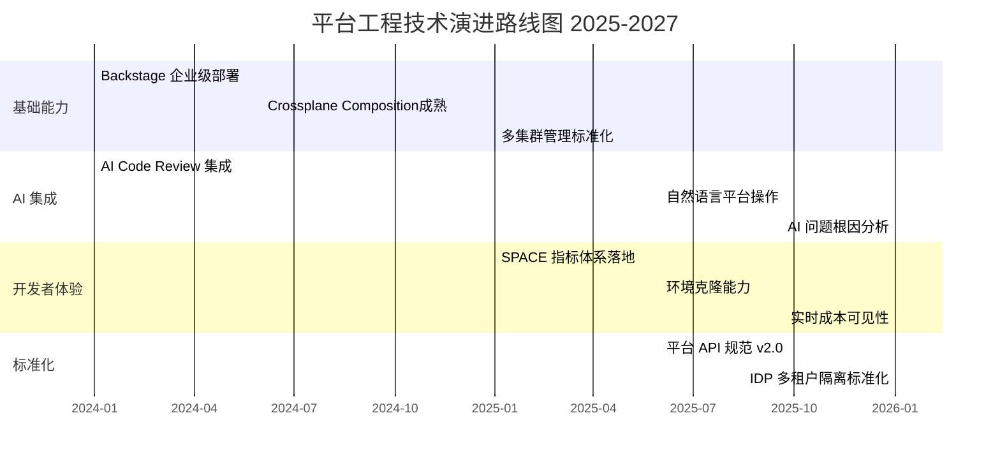

## 9.4 相关文档参考

本文与知识库中以下文档密切关联，建议结合阅读：

| 文档编号 | 文档标题 | 关联说明 |
|---------|---------|---------|
| **Doc 05** | Kubernetes GitOps 实践（ArgoCD/Flux） | IDP 的核心交付机制，黄金路径的自动化部署基础 |
| **Doc 26** | vCluster 虚拟集群技术 | IDP 中环境隔离的关键技术，支撑自助服务环境创建 |
| **Doc 18** | eBPF 与 Cilium 深度实践 | IDP 网络策略自动化的底层实现技术 |
| **Doc 17** | GPU 调度与 LLM 推理 | AI Copilot 在 IDP 中的基础设施支撑 |

> 📖 **延伸阅读推荐：**
> - [Team Topologies](https://teamtopologies.com) - Matthew Skelton & Manuel Pais
> - [Platform Engineering on Kubernetes](https://www.manning.com/books/platform-engineering-on-kubernetes) - Mauricio Salatino
> - [Humanitec Platform Engineering Whitepaper](https://humanitec.com/whitepapers)
> - [CNCF Platforms White Paper](https://tag-app-delivery.cncf.io/whitepapers/platforms/)

---

<!-- chunk: 总结 -->## 总结

平台工程与内部开发者平台是 Kubernetes 规模化应用的关键使能因素。本文核心观点：

1. **认知负载是核心问题**：IDP 的终极目标是让开发者专注于业务价值创造，而非基础设施管理
2. **平台即产品**：以产品思维建设平台，持续度量和改进开发者体验
3. **黄金路径优先**：标准化覆盖 80% 场景，逃生出口覆盖 20% 特殊场景
4. **自助服务是核心能力**：减少审批和等待，让开发者能够独立完成常见操作
5. **数据驱动改进**：DORA + SPACE 指标体系持续指导平台优化方向
6. **AI 融合是趋势**：自然语言操作、智能故障诊断将成为下一代 IDP 的标配

---

> **文档维护说明：** 本文档由平台工程团队维护，随平台能力演进定期更新。如有问题或建议，请通过 Backstage 中的"平台反馈"功能提交，或在 #platform-engineering Slack 频道讨论。
>
> **版本历史：** v1.0 (2026-03-03) - 初始版本，覆盖平台工程全景架构

---

<!-- chunk: Obsidian 相关文档 -->## Obsidian 相关文档

- domain-19-papers MOC
- [[domain-19-landscape-references/README.md|Domain 19: Kubernetes 高级技术论文与最佳实践 (Advanced Technical Papers...]]
- Domain-19 论文与参考 — 开源项目索引
- Kubernetes 生产就绪性评估框架 (Production Readiness Assessment Framew...
- Kubernetes 大规模集群性能优化深度实践 (Large-Scale Cluster Performance Op...
- Kubernetes 安全零信任架构实施指南 (Zero Trust Security Architecture Imp...
- Kubernetes 多云混合部署架构与实践 (Multi-Cloud Hybrid Deployment Archit...
- Kubernetes GitOps 完整实践指南 (GitOps Complete Practice Guide)
- Kubernetes 成本治理与 FinOps 实践 (Kubernetes Cost Governance and F...
- Kubernetes 容器存储接口 (CSI) 深度实践指南 (Container Storage Interface ...
- Kubernetes 网络策略与安全微隔离实践 (Network Policies and Security Micro...
- Kubernetes 服务网格深度实践与Istio集成 (Service Mesh Deep Practice and ...

## See Also

- 19-kubernetes-gateway-api-modern-traffic-management
- 20-kubernetes-supply-chain-security-sbom-slsa-sigstore
- 22-kubernetes-webassembly-wasm-workloads
- 23-kubernetes-opentelemetry-native-observability

## Related

- [[domain-19-landscape-references/topic-index/etcd-index.md|etcd 知识图谱索引]]
