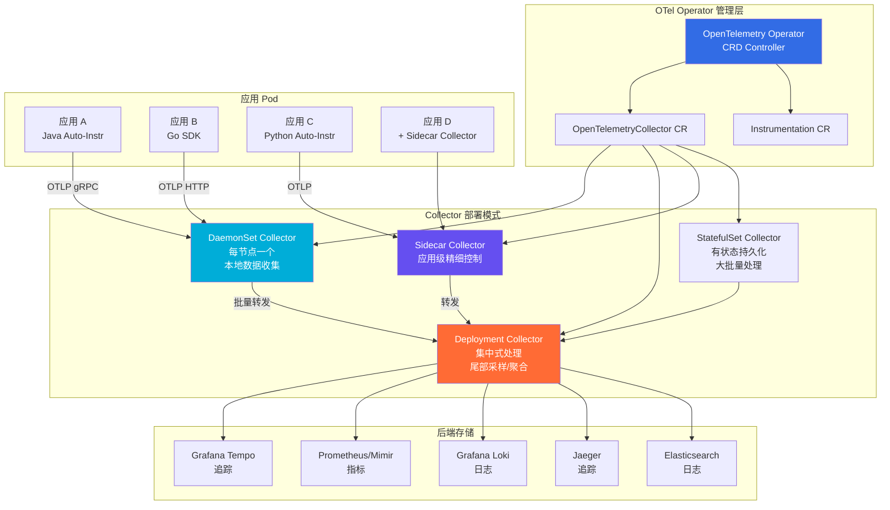
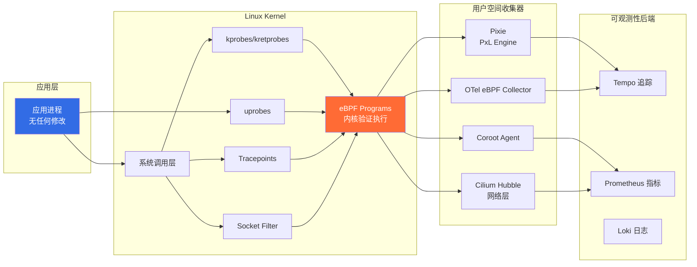
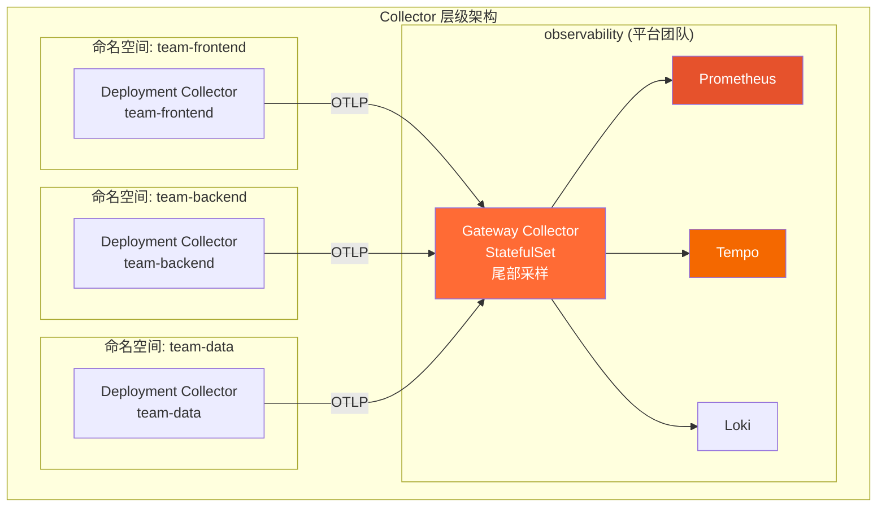

> **生产环境安全提示**
>
> 本文档包含可直接执行的运维命令。执行前请确认：当前目标集群与 Namespace 是否正确；是否具备足够的 RBAC 权限；是否已在非生产环境验证。命令风险等级标注：🔴 高风险（可能造成数据丢失或服务中断）、🟡 中风险（会修改集群状态，但通常可回滚）、🟢 低风险/只读（信息收集，无副作用）。


# [[Kubernetes|Kubernetes]] [[OpenTelemetry|OpenTelemetry]] 原生可观测性 (OpenTelemetry Native Observability)

> 作者: 可观测性架构专家 | 版本: v1.0 | 更新时间: 2026-03-03
> 适用场景: 分布式追踪、指标采集、日志关联、全栈可观测性 | 复杂度: ⭐⭐⭐⭐

---

<!-- chunk: 摘要 -->## 摘要

OpenTelemetry（OTel）在 2026 年已成为云原生可观测性领域无可争议的行业标准。作为 CNCF 毕业项目，OTel 将分布式追踪、指标和日志三大支柱统一在单一规范下，彻底解决了云原生应用中观测数据碎片化的问题。

本文深度探讨 OpenTelemetry 在 Kubernetes 上的完整原生实践：从 OTel Operator 管理的 Collector 拓扑设计，到 Auto-Instrumentation 零代码埋点，从 Exemplar 关联追踪与指标，到 eBPF 增强的无侵入可观测性。通过多命名空间管理、Tail Sampling 尾部采样、LoadBalancing Exporter 等企业级配置，帮助 SRE 和平台工程师构建统一、高效、可扩展的可观测性平台。

---

<!-- chunk: 目录 -->## 目录

1. [OTel 地位与价值](#1-otel-地位与价值)
2. [OTel Collector on Kubernetes](#2-otel-collector-on-kubernetes)
3. [Kubernetes Attributes Processor](#3-kubernetes-attributes-processor)
4. [Auto-Instrumentation 自动埋点](#4-auto-instrumentation-自动埋点)
5. [统一追踪/指标/日志](#5-统一追踪指标日志)
6. [eBPF 增强可观测性](#6-ebpf-增强可观测性)
7. [多命名空间配置管理](#7-多命名空间配置管理)
8. [Trace Gateway 负载均衡](#8-trace-gateway-负载均衡)
9. [未来趋势](#9-未来趋势)

---

<!-- chunk: 1. OTel 地位与价值 -->## 1. OTel 地位与价值

## 1.1 可观测性三大支柱统一

在 OpenTelemetry 出现之前，可观测性领域呈现碎片化态势：[[Prometheus|Prometheus]] 负责指标、[[Jaeger|Jaeger]]/Zipkin 负责追踪、ELK/EFK 负责日志，三套系统各自为政，数据无法关联。

OpenTelemetry 通过统一的数据模型、SDK 和协议（OTLP）彻底改变了这一格局：

```
OpenTelemetry 统一可观测性架构：

  应用代码                    OTel SDK
  ─────────────────────────────────────────────────────
  业务逻辑      ─────────▶   Traces (分布式追踪)
                              │  TraceID/SpanID 关联
  系统操作      ─────────▶   Metrics (指标)
                              │  Exemplar 关联追踪
  事件记录      ─────────▶   Logs (日志)
                              │  TraceID 注入
                              ▼
                         OTLP (OpenTelemetry Protocol)
                              │
                              ▼
                         OTel Collector
                         Pipeline 处理
                              │
              ┌───────────────┼───────────────┐
              ▼               ▼               ▼
          Jaeger/Tempo    Prometheus     Loki/Elasticsearch
          (追踪后端)       (指标后端)      (日志后端)
```

## 1.2 CNCF 毕业项目地位

**OpenTelemetry 关键里程碑：**

| 时间 | 里程碑 |
|-----|--------|
| 2019-05 | OpenTelemetry 项目成立 (OpenCensus + OpenTracing 合并) |
| 2021-08 | Traces 规范 GA，SDK 稳定 |
| 2023-06 | Metrics 规范 GA |
| 2024-02 | CNCF 毕业项目 |
| 2024-11 | Logs 规范 GA |
| 2025-06 | Profiles (持续剖析) 规范 Beta |
| 2026-01 | Profiles GA，OTel 成为完整可观测性平台 |

## 1.3 与传统工具对比

| 对比维度 | Prometheus + Zipkin + ELK | OpenTelemetry 统一方案 |
|---------|--------------------------|----------------------|
| **数据关联** | 需要手动关联，困难 | TraceID/SpanID 自动关联 |
| **SDK 数量** | 3套 SDK + 配置 | 1套 SDK，统一配置 |
| **Vendor Lock-in** | 高（厂商特定格式）| 低（开放标准 OTLP）|
| **Collector 数量** | 3个独立 Collector | 1个 OTel Collector |
| **运维复杂度** | 高（3套运维体系）| 低（统一运维）|
| **上下文传播** | 需要手动注入 | 自动传播 |
| **采样灵活性** | 有限 | 丰富（Head/Tail Sampling）|
| **语言支持** | 各工具自行维护 | 统一 11+ 语言 SDK |
| **Kubernetes 集成** | 各自独立 | OTel Operator 统一管理 |
| **成本** | 高（多套基础设施）| 低（统一 Pipeline）|

## 1.4 OTel 在 K8s 生态的采用情况

```
2026 年 OTel 采用率调查（CNCF Annual Survey）：
──────────────────────────────────────────────
生产使用 OTel Traces:    78% (↑ from 45% in 2023)
生产使用 OTel Metrics:   65% (↑ from 28% in 2023)
生产使用 OTel Logs:      52% (↑ from 15% in 2023)
使用 OTel Operator:      71% (Kubernetes 用户)
使用 Auto-Instrumentation: 48%
使用 eBPF 增强观测:      35%
──────────────────────────────────────────────
```

---

<!-- chunk: 2. OTel Collector on Kubernetes -->## 2. OTel Collector on Kubernetes

## 2.1 Collector 拓扑架构



## 2.2 OpenTelemetryCollector CR 完整配置

```yaml
# otel-collector-daemonset.yaml - 节点级数据收集
apiVersion: opentelemetry.io/v1beta1
kind: OpenTelemetryCollector
metadata:
  name: otel-node-collector
  namespace: observability
spec:
  mode: daemonset
  serviceAccount: otel-collector-sa

  # 资源配置
  resources:
    requests:
      cpu: "100m"
      memory: "256Mi"
    limits:
      cpu: "500m"
      memory: "512Mi"

  # 卷挂载 (用于读取节点日志)
  volumeMounts:
  - name: varlog
    mountPath: /var/log
    readOnly: true
  - name: varlibdockercontainers
    mountPath: /var/lib/docker/containers
    readOnly: true

  volumes:
  - name: varlog
    hostPath:
      path: /var/log
  - name: varlibdockercontainers
    hostPath:
      path: /var/lib/docker/containers

  # Collector Pipeline 配置
  config:
    receivers:
      # OTLP 接收器 (接收应用发来的遥测数据)
      otlp:
        protocols:
          grpc:
            endpoint: 0.0.0.0:4317
          http:
            endpoint: 0.0.0.0:4318
            cors:
              allowed_origins: ["*"]

      # Prometheus 接收器 (抓取应用 /metrics)
      prometheus:
        config:
          scrape_configs:
          - job_name: 'kubernetes-pods'
            kubernetes_sd_configs:
            - role: pod
            relabel_configs:
            - source_labels: [__meta_kubernetes_pod_annotation_prometheus_io_scrape]
              action: keep
              regex: true

      # Kubernetes 日志文件接收器
      filelog:
        include:
        - /var/log/pods/*/*/*.log
        exclude:
        - /var/log/pods/*/otc-container/*.log
        start_at: beginning
        include_file_path: true
        include_file_name: false
        operators:
        - type: router
          id: get-format
          routes:
          - output: parser-docker
            expr: 'body matches "^\\{"'
          - output: parser-containerd
            expr: 'body matches "^[^ Z]+ "'
        - type: json_parser
          id: parser-docker
          output: extract-metadata-from-filepath
        - type: regex_parser
          id: parser-containerd
          regex: '^(?P<time>[^ ^Z]+Z) (?P<stream>stdout|stderr) (?P<logtag>[^ ]*) ?(?P<log>.*)$'
          output: extract-metadata-from-filepath
        - type: regex_parser
          id: extract-metadata-from-filepath
          regex: '^.*\/(?P<namespace>[^_]+)_(?P<pod_name>[^_]+)_(?P<uid>[a-f0-9\-]+)\/(?P<container_name>[^\._]+)\/(?P<restart_count>\d+)\.log$'
          parse_from: attributes["log.file.path"]

      # 主机指标接收器
      hostmetrics:
        collection_interval: 30s
        scrapers:
          cpu:
          memory:
          disk:
          network:
          load:
          filesystem:

      # Kubernetes 集群指标
      k8s_cluster:
        collection_interval: 30s
        node_conditions_to_report: [Ready, MemoryPressure, DiskPressure]
        resource_attributes:
          k8s.namespace.name:
            enabled: true

    processors:
      # 内存限制器 (防止 OOM)
      memory_limiter:
        check_interval: 1s
        limit_percentage: 75
        spike_limit_percentage: 15

      # 批量处理 (提升吞吐量)
      batch:
        send_batch_size: 10000
        timeout: 5s
        send_batch_max_size: 11000

      # Kubernetes 元数据注入 (下节详述)
      k8sattributes:
        auth_type: serviceAccount
        passthrough: false
        extract:
          metadata:
          - k8s.pod.name
          - k8s.pod.uid
          - k8s.deployment.name
          - k8s.namespace.name
          - k8s.node.name
          - k8s.pod.start_time
          - k8s.replicaset.name
          - k8s.replicaset.uid
          - k8s.daemonset.name
          - k8s.statefulset.name
          - k8s.job.name
          - k8s.cronjob.name
          - k8s.container.name
          labels:
          - tag_name: app.label.component
            key: app.kubernetes.io/component
            from: pod
          - tag_name: app.label.name
            key: app.kubernetes.io/name
            from: pod
          - tag_name: app.label.version
            key: app.kubernetes.io/version
            from: pod
        pod_association:
        - sources:
          - from: resource_attribute
            name: k8s.pod.ip
        - sources:
          - from: resource_attribute
            name: k8s.pod.uid
        - sources:
          - from: connection

      # 资源探测器 (添加云厂商/K8s 元数据)
      resourcedetection:
        detectors: [env, k8s_node, gke, eks, aks]
        timeout: 2s
        override: false

      # 过滤器 (减少噪声数据)
      filter/health-checks:
        traces:
          span:
          - 'attributes["http.route"] == "/health"'
          - 'attributes["http.route"] == "/ready"'
          - 'attributes["http.route"] == "/metrics"'

      # 采样 (降低成本)
      probabilistic_sampler:
        sampling_percentage: 10  # 保留 10% 追踪

    exporters:
      # OTLP 导出至 Gateway Collector (尾部采样)
      otlp/gateway:
        endpoint: otel-gateway-collector:4317
        tls:
          insecure: true
        retry_on_failure:
          enabled: true
          initial_interval: 5s
          max_interval: 30s
        sending_queue:
          enabled: true
          num_consumers: 10
          queue_size: 5000

      # Prometheus Remote Write (指标)
      prometheusremotewrite:
        endpoint: "http://prometheus:9090/api/v1/write"
        tls:
          insecure: true

      # Loki 日志导出
      loki:
        endpoint: "http://loki:3100/loki/api/v1/push"
        default_labels_enabled:
          exporter: false
          job: true
          instance: true
          level: true

      # 调试 (开发环境)
      debug:
        verbosity: normal

    service:
      pipelines:
        traces:
          receivers: [otlp]
          processors: [memory_limiter, k8sattributes, resourcedetection, filter/health-checks, batch]
          exporters: [otlp/gateway]

        metrics:
          receivers: [otlp, prometheus, hostmetrics, k8s_cluster]
          processors: [memory_limiter, k8sattributes, resourcedetection, batch]
          exporters: [prometheusremotewrite]

        logs:
          receivers: [otlp, filelog]
          processors: [memory_limiter, k8sattributes, resourcedetection, batch]
          exporters: [loki]

      telemetry:
        logs:
          level: "warn"
        metrics:
          address: 0.0.0.0:8888
```

---

<!-- chunk: 3. Kubernetes Attributes Processor -->## 3. Kubernetes Attributes Processor

## 3.1 k8sattributes 工作原理

k8sattributes Processor 通过 Kubernetes API 自动为遥测数据注入 Pod 元数据，是 Kubernetes 可观测性的核心组件：

```
数据流：
应用发送 Span → Collector 接收
                    │
                    ▼ k8sattributes Processor
              查询 K8s API Server
              根据 Pod IP/UID 查找 Pod 信息
                    │
                    ▼ 注入元数据
  k8s.pod.name = "order-service-7d9f6b5c8-xk2pq"
  k8s.namespace.name = "production"
  k8s.deployment.name = "order-service"
  k8s.node.name = "worker-node-3"
  app.label.version = "v2.1.0"
  app.label.component = "api"
```

## 3.2 Collector RBAC 配置

```yaml
# otel-collector-rbac.yaml
apiVersion: v1
kind: ServiceAccount
metadata:
  name: otel-collector-sa
  namespace: observability
---
apiVersion: rbac.authorization.k8s.io/v1
kind: ClusterRole
metadata:
  name: otel-collector-role
rules:
# k8sattributes 需要的权限
- apiGroups: [""]
  resources: ["pods", "namespaces", "nodes"]
  verbs: ["get", "watch", "list"]
- apiGroups: ["apps"]
  resources: ["replicasets", "deployments", "daemonsets", "statefulsets"]
  verbs: ["get", "watch", "list"]
- apiGroups: ["batch"]
  resources: ["jobs", "cronjobs"]
  verbs: ["get", "watch", "list"]
# k8s_cluster 接收器需要的权限
- apiGroups: [""]
  resources: ["resourcequotas", "persistentvolumeclaims", "events"]
  verbs: ["get", "watch", "list"]
- apiGroups: ["autoscaling"]
  resources: ["horizontalpodautoscalers"]
  verbs: ["get", "watch", "list"]
# Prometheus 服务发现需要的权限
- apiGroups: [""]
  resources: ["services", "endpoints"]
  verbs: ["get", "watch", "list"]
- nonResourceURLs: ["/metrics"]
  verbs: ["get"]
---
apiVersion: rbac.authorization.k8s.io/v1
kind: ClusterRoleBinding
metadata:
  name: otel-collector-binding
roleRef:
  apiGroup: rbac.authorization.k8s.io
  kind: ClusterRole
  name: otel-collector-role
subjects:
- kind: ServiceAccount
  name: otel-collector-sa
  namespace: observability
```

## 3.3 元数据注入效果示例

```json
// 注入前 (应用发送的原始 Span)
{
  "traceId": "abc123",
  "spanId": "def456",
  "name": "HTTP GET /api/orders",
  "attributes": {
    "http.method": "GET",
    "http.url": "/api/orders",
    "http.status_code": 200
  },
  "resource": {
    "service.name": "order-service"
  }
}

// 注入后 (k8sattributes 处理后)
{
  "traceId": "abc123",
  "spanId": "def456",
  "name": "HTTP GET /api/orders",
  "attributes": {
    "http.method": "GET",
    "http.url": "/api/orders",
    "http.status_code": 200
  },
  "resource": {
    "service.name": "order-service",
    "service.version": "v2.1.0",
    "k8s.pod.name": "order-service-7d9f6b5c8-xk2pq",
    "k8s.pod.uid": "550e8400-e29b-41d4-a716-446655440000",
    "k8s.namespace.name": "production",
    "k8s.deployment.name": "order-service",
    "k8s.node.name": "worker-node-3",
    "k8s.replicaset.name": "order-service-7d9f6b5c8",
    "cloud.provider": "aws",
    "cloud.region": "us-west-2",
    "cloud.availability_zone": "us-west-2a",
    "app.label.component": "api",
    "app.label.version": "v2.1.0"
  }
}
```

---

<!-- chunk: 4. Auto-Instrumentation 自动埋点 -->## 4. Auto-Instrumentation 自动埋点

## 4.1 Instrumentation CR 配置

OTel Operator 通过 `Instrumentation` CR 实现零代码侵入的自动埋点，支持 Java、Python、Node.js、.NET、Go 等语言：

```yaml
# instrumentation-cr.yaml - 全面的自动埋点配置
apiVersion: opentelemetry.io/v1alpha1
kind: Instrumentation
metadata:
  name: production-instrumentation
  namespace: production
spec:
  # Exporter 端点 (发送给节点上的 DaemonSet Collector)
  exporter:
    endpoint: http://otel-node-collector:4318

  # 全局 Resource Attributes
  resource:
    resourceAttributes:
      service.version: "$(HELM_CHART_VERSION)"
      deployment.environment: "production"
      team: "$(TEAM_LABEL)"

  # 传播格式 (支持 W3C TraceContext + Baggage + B3)
  propagators:
  - tracecontext
  - baggage
  - b3multi

  # 采样配置
  sampler:
    type: parentbased_traceidratio
    argument: "0.1"  # 10% 采样率

  # Java 自动埋点配置
  java:
    image: ghcr.io/open-telemetry/opentelemetry-operator/autoinstrumentation-java:2.10.0
    env:
    - name: OTEL_INSTRUMENTATION_KAFKA_ENABLED
      value: "true"
    - name: OTEL_INSTRUMENTATION_JDBC_ENABLED
      value: "true"
    - name: OTEL_INSTRUMENTATION_REDIS_ENABLED
      value: "true"
    - name: OTEL_INSTRUMENTATION_SPRING_WEBMVC_ENABLED
      value: "true"
    - name: OTEL_LOGS_EXPORTER
      value: "otlp"
    - name: OTEL_METRICS_EXPORTER
      value: "otlp"
    - name: OTEL_EXPORTER_OTLP_ENDPOINT
      value: "http://otel-node-collector:4318"
    # JVM Metrics
    - name: OTEL_INSTRUMENTATION_RUNTIME_TELEMETRY_ENABLED
      value: "true"
    volumeLimitSize: 200Mi

  # Python 自动埋点配置
  python:
    image: ghcr.io/open-telemetry/opentelemetry-operator/autoinstrumentation-python:0.50b0
    env:
    - name: OTEL_PYTHON_LOGGING_AUTO_INSTRUMENTATION_ENABLED
      value: "true"
    - name: OTEL_LOGS_EXPORTER
      value: "otlp"
    - name: OTEL_METRICS_EXPORTER
      value: "otlp"
    - name: OTEL_PYTHON_DISABLED_INSTRUMENTATIONS
      value: ""  # 空表示启用所有

  # Node.js 自动埋点配置
  nodejs:
    image: ghcr.io/open-telemetry/opentelemetry-operator/autoinstrumentation-nodejs:0.53.0
    env:
    - name: OTEL_NODE_ENABLED_INSTRUMENTATIONS
      value: "http,express,grpc,pg,redis,kafka-js,mongoose"
    - name: OTEL_LOGS_EXPORTER
      value: "otlp"

  # Go 自动埋点配置 (eBPF-based，无需代码修改)
  go:
    image: ghcr.io/open-telemetry/opentelemetry-go-instrumentation/autoinstrumentation-go:v0.19.0-alpha
    env:
    - name: OTEL_GO_AUTO_TARGET_EXE
      value: "/app/server"  # Go 二进制路径
    - name: OTEL_GO_AUTO_SHOW_VERIFIER_LOG
      value: "false"

  # .NET 自动埋点
  dotnet:
    image: ghcr.io/open-telemetry/opentelemetry-operator/autoinstrumentation-dotnet:1.9.0
    env:
    - name: OTEL_DOTNET_AUTO_TRACES_INSTRUMENTATION_ENABLED
      value: "true"
    - name: OTEL_DOTNET_AUTO_METRICS_INSTRUMENTATION_ENABLED
      value: "true"
    - name: OTEL_DOTNET_AUTO_LOGS_INSTRUMENTATION_ENABLED
      value: "true"
```

## 4.2 注解触发自动埋点

```yaml
# 为 Deployment 添加自动埋点注解
apiVersion: apps/v1
kind: Deployment
metadata:
  name: order-service
  namespace: production
spec:
  template:
    metadata:
      annotations:
        # 核心注解 - 触发自动埋点
        instrumentation.opentelemetry.io/inject-java: "production-instrumentation"
        # 或指定命名空间/名称
        # instrumentation.opentelemetry.io/inject-java: "observability/production-instrumentation"

        # 也可使用 true 使用同命名空间默认 Instrumentation
        # instrumentation.opentelemetry.io/inject-java: "true"
    spec:
      containers:
      - name: order-service
        image: myorg/order-service:v2.1.0
        # 无需任何 OTel 代码！Operator 自动注入 init container + env vars
```

```yaml
# Python 服务自动埋点
apiVersion: apps/v1
kind: Deployment
metadata:
  name: analytics-service
  namespace: production
spec:
  template:
    metadata:
      annotations:
        instrumentation.opentelemetry.io/inject-python: "true"
    spec:
      containers:
      - name: analytics
        image: myorg/analytics:v1.3.0
        # OTel Operator 自动添加:
        # - Init Container: 安装 Python OTel SDK
        # - Env: PYTHONPATH, OTEL_* 配置
---
# Node.js 微服务自动埋点
apiVersion: apps/v1
kind: Deployment
metadata:
  name: notification-service
  namespace: production
spec:
  template:
    metadata:
      annotations:
        instrumentation.opentelemetry.io/inject-nodejs: "production-instrumentation"
        # 覆盖特定 Instrumentation 配置
        instrumentation.opentelemetry.io/otel-go-auto-target-exe: "/app/notification-service"
```

## 4.3 Operator 注入原理

OTel Operator 通过 Mutating Webhook 在 Pod 创建时自动注入：

```
注入流程：
1. 用户创建 Deployment (带 inject-java 注解)
         ↓
2. K8s API Server 调用 OTel Operator Webhook
         ↓
3. Operator 查找对应 Instrumentation CR
         ↓
4. 自动添加 Init Container (拷贝 javaagent.jar)
   自动添加 Volume Mount
   自动注入环境变量：
     JAVA_TOOL_OPTIONS=-javaagent:/otel-auto-instrumentation/javaagent.jar
     OTEL_SERVICE_NAME=order-service
     OTEL_EXPORTER_OTLP_ENDPOINT=http://otel-node-collector:4318
     OTEL_TRACES_SAMPLER=parentbased_traceidratio
     OTEL_TRACES_SAMPLER_ARG=0.1
         ↓
5. Pod 启动，Java 应用自动发送 OTel 数据
```

---

<!-- chunk: 5. 统一追踪/指标/日志 -->## 5. 统一追踪/指标/日志

## 5.1 Exemplar：指标到追踪的桥梁

Exemplar 是 Prometheus 指标中嵌入的追踪上下文引用，实现从 P99 延迟指标直接跳转到具体慢请求追踪：

```yaml
# Prometheus 配置启用 Exemplar
# prometheus.yaml
global:
  scrape_interval: 15s
  evaluation_interval: 15s

# 启用 Exemplar 存储 (需要 Prometheus 2.43+)
storage:
  exemplars:
    max_exemplars: 100000

# OTel Collector prometheusremotewrite exporter 自动发送 Exemplar
# 无需额外配置
```

```python
# 应用代码中手动添加 Exemplar (Python 示例)
from opentelemetry import trace
from prometheus_client import Histogram

REQUEST_DURATION = Histogram(
    'http_request_duration_seconds',
    'HTTP request duration',
    ['method', 'path', 'status']
)

def handle_request(method, path):
    with trace.get_tracer(__name__).start_as_current_span("http_request") as span:
        start_time = time.time()
        try:
            result = process(method, path)
            status = 200
        except Exception as e:
            status = 500
            raise
        finally:
            duration = time.time() - start_time
            # 自动将 TraceID/SpanID 注入为 Exemplar
            REQUEST_DURATION.labels(
                method=method,
                path=path,
                status=status
            ).observe(duration)
            # OTel SDK 自动将当前 SpanContext 附加为 Exemplar
```

## 5.2 日志与追踪关联

通过将 TraceID/SpanID 注入日志，实现从日志直接跳转到对应追踪：

```java
// Java Spring Boot - 自动关联 (OTel Auto-Instrumentation 已处理)
// 使用 logback-spring.xml 配置 MDC 注入
import org.slf4j.Logger;
import org.slf4j.LoggerFactory;
import io.opentelemetry.api.trace.Span;
import io.opentelemetry.api.trace.SpanContext;

@RestController
public class OrderController {
    private static final Logger log = LoggerFactory.getLogger(OrderController.class);

    @GetMapping("/orders/{id}")
    public Order getOrder(@PathVariable Long id) {
        // Auto-Instrumentation 自动将 trace_id/span_id 注入 MDC
        // 日志自动包含: {"trace_id": "abc123", "span_id": "def456", ...}
        log.info("Fetching order: {}", id);

        Order order = orderRepository.findById(id)
            .orElseThrow(() -> new NotFoundException("Order not found: " + id));

        log.info("Order found: {}, status: {}", id, order.getStatus());
        return order;
    }
}
```

```xml
<!-- logback-spring.xml - 结构化日志配置 -->
<configuration>
  <appender name="STDOUT" class="ch.qos.logback.core.ConsoleAppender">
    <encoder class="net.logstash.logback.encoder.LoggingEventCompositeJsonEncoder">
      <providers>
        <timestamp/>
        <logLevel/>
        <loggerName/>
        <message/>
        <mdc/>  <!-- 包含 trace_id, span_id, trace_flags -->
        <throwableClassName/>
        <throwableMessage/>
      </providers>
    </encoder>
  </appender>
  <root level="INFO">
    <appender-ref ref="STDOUT"/>
  </root>
</configuration>
```

## 5.3 请求拓扑可视化

```
微服务请求追踪示例：
──────────────────────────────────────────────────────────
TraceID: 4bf92f3577b34da6a3ce929d0e0e4736

Span 1: frontend → order-service         [0ms - 245ms]
  ├─ Span 2: order-service → inventory    [5ms - 120ms]
  │    ├─ Span 3: inventory → postgres    [10ms - 45ms]  ← DB 查询
  │    └─ Span 4: inventory → redis       [50ms - 55ms]  ← 缓存读取
  ├─ Span 5: order-service → payment      [125ms - 220ms]
  │    ├─ Span 6: payment → stripe-api    [130ms - 210ms] ← 外部 API
  │    └─ Span 7: payment → postgres      [215ms - 218ms]
  └─ Span 8: order-service → notification [225ms - 235ms]
       └─ Span 9: notification → kafka    [228ms - 232ms] ← 消息队列

关联指标 (Exemplar):
  http_request_duration_p99 = 245ms
  → 点击 Exemplar → 跳转至此追踪

关联日志:
  [order-service] INFO: Creating order 12345 {trace_id: 4bf92f35...}
  [payment] INFO: Payment processed {trace_id: 4bf92f35...}
  → 从日志跳转 → 查看完整追踪
──────────────────────────────────────────────────────────
```

---

<!-- chunk: 6. eBPF 增强可观测性 -->## 6. eBPF 增强可观测性

## 6.1 无代码插桩原理

eBPF 通过内核层面的探针实现真正的无侵入可观测性，无需修改应用代码或注入 Agent：



## 6.2 Coroot 部署配置

```yaml
# coroot 安装 (eBPF 可观测性平台)
# helm install coroot coroot/coroot \
#   --namespace coroot \
#   --create-namespace \
#   --set "corootCE.bootstrapPrometheusUrl=http://prometheus:9090"

# Coroot Node Agent - eBPF 数据收集 DaemonSet
apiVersion: apps/v1
kind: DaemonSet
metadata:
  name: coroot-node-agent
  namespace: coroot
spec:
  selector:
    matchLabels:
      app: coroot-node-agent
  template:
    metadata:
      labels:
        app: coroot-node-agent
    spec:
      hostPID: true    # 访问宿主机进程
      hostNetwork: true # 访问宿主机网络
      tolerations:
      - operator: Exists  # 调度到所有节点
      containers:
      - name: coroot-node-agent
        image: ghcr.io/coroot/coroot-node-agent:1.8.0
        securityContext:
          privileged: true  # eBPF 需要特权
        env:
        - name: LISTEN
          value: "0.0.0.0:80"
        ports:
        - containerPort: 80
          hostPort: 10301
        volumeMounts:
        - name: host-sys
          mountPath: /host/sys
          readOnly: true
        - name: host-proc
          mountPath: /host/proc
          readOnly: true
        resources:
          requests:
            cpu: "100m"
            memory: "128Mi"
          limits:
            cpu: "500m"
            memory: "512Mi"
      volumes:
      - name: host-sys
        hostPath:
          path: /sys
      - name: host-proc
        hostPath:
          path: /proc
```

## 6.3 eBPF 观测能力对比

| 观测能力 | 传统 Agent 方式 | eBPF 方式 |
|---------|---------------|---------|
| **部署方式** | 代码注入/Sidecar | DaemonSet，无侵入 |
| **语言支持** | 特定语言 SDK | 所有语言（C/Go/Java/Python/Rust…）|
| **网络流量观测** | 应用层 | L3/L4/L7 全栈 |
| **系统调用追踪** | 不支持 | 完整 syscall 追踪 |
| **CPU/内存 Profile** | APM 工具 | 纳秒级精度 |
| **加密流量** | 只有应用层 | SSL/TLS 解密（uprobe）|
| **性能开销** | 5-10% CPU | <2% CPU |
| **数据完整性** | 依赖代码质量 | 内核级完整性保证 |
| **实时动态** | 需要重启 | 热加载探针 |

---

<!-- chunk: 7. 多命名空间配置管理 -->## 7. 多命名空间配置管理

## 7.1 企业级多命名空间 OTel 拓扑



## 7.2 业务域 Collector 配置

```yaml
# team-backend namespace 的独立 Collector
apiVersion: opentelemetry.io/v1beta1
kind: OpenTelemetryCollector
metadata:
  name: backend-collector
  namespace: team-backend
spec:
  mode: deployment
  replicas: 2
  config:
    receivers:
      otlp:
        protocols:
          grpc:
            endpoint: 0.0.0.0:4317
          http:
            endpoint: 0.0.0.0:4318

    processors:
      batch:
        send_batch_size: 5000
        timeout: 3s

      # 添加团队标签
      resource:
        attributes:
        - key: team
          value: "backend"
          action: insert
        - key: cost_center
          value: "CC-1234"
          action: insert
        - key: slo_tier
          value: "tier-1"
          action: insert

      # 团队级过滤 (只转发本团队数据)
      filter/team:
        traces:
          span:
            - 'resource.attributes["k8s.namespace.name"] != "team-backend"'

    exporters:
      # 转发至平台 Gateway Collector
      otlp/gateway:
        endpoint: otel-gateway.observability.svc.cluster.local:4317
        tls:
          insecure: true

    service:
      pipelines:
        traces:
          receivers: [otlp]
          processors: [batch, resource, filter/team]
          exporters: [otlp/gateway]
        metrics:
          receivers: [otlp]
          processors: [batch, resource]
          exporters: [otlp/gateway]
        logs:
          receivers: [otlp]
          processors: [batch, resource]
          exporters: [otlp/gateway]
```

## 7.3 OpAMP 热重载配置

OpAMP（Open Agent Management Protocol）支持 Collector 配置热更新，无需重启：

```yaml
# OpAMP Supervisor 配置
apiVersion: opentelemetry.io/v1alpha1
kind: OpAMPBridge
metadata:
  name: opamp-bridge
  namespace: observability
spec:
  endpoint: ws://opamp-server:4320/v1/opamp
  capabilities:
    ReportsStatus: true
    AcceptsRemoteConfig: true  # 接受远程配置更新
    ReportsRemoteConfig: true
    ReportsOwnMetrics: true
    AcceptsPackages: true

  # 关联的 Collector
  componentsAllowed:
    receivers:
    - otlp
    - prometheus
    processors:
    - batch
    - memory_limiter
    - k8sattributes
    exporters:
    - otlp
    - prometheusremotewrite
```

---

<!-- chunk: 8. Trace Gateway 负载均衡 -->## 8. Trace Gateway 负载均衡

## 8.1 为什么需要 LoadBalancing Exporter

在使用 Tail Sampling（尾部采样）时，同一 Trace 的所有 Span 必须到达同一个 Collector 实例，否则无法正确评估采样条件：

```
问题场景：
  Span 1 (TraceID: abc123) → Collector Pod 1 ❌
  Span 2 (TraceID: abc123) → Collector Pod 2 ❌
  Span 3 (TraceID: abc123) → Collector Pod 3 ❌
  
  → 三个 Pod 各只有部分 Span，无法做尾部采样！

LoadBalancing Exporter 解决方案：
  Span 1 (TraceID: abc123) → 一致性哈希 → Collector Pod 2 ✅
  Span 2 (TraceID: abc123) → 一致性哈希 → Collector Pod 2 ✅  
  Span 3 (TraceID: abc123) → 一致性哈希 → Collector Pod 2 ✅
  
  → 所有 Span 到达同一 Pod，尾部采样正确执行！
```

## 8.2 Gateway Collector 完整配置

```yaml
# otel-gateway-collector.yaml - 尾部采样 + 负载均衡
apiVersion: opentelemetry.io/v1beta1
kind: OpenTelemetryCollector
metadata:
  name: otel-gateway
  namespace: observability
spec:
  mode: statefulset
  replicas: 5  # 高可用，扩容时一致性哈希自动重分配

  # StatefulSet 持久化存储 (Tail Sampling 缓存)
  volumeClaimTemplates:
  - metadata:
      name: tail-sampling-storage
    spec:
      accessModes: ["ReadWriteOnce"]
      resources:
        requests:
          storage: 10Gi

  config:
    receivers:
      otlp:
        protocols:
          grpc:
            endpoint: 0.0.0.0:4317
          http:
            endpoint: 0.0.0.0:4318

    processors:
      memory_limiter:
        check_interval: 1s
        limit_percentage: 80
        spike_limit_percentage: 20

      batch:
        send_batch_size: 10000
        timeout: 10s

      # 尾部采样 - 基于 Trace 完整内容决策
      tail_sampling:
        # 等待所有 Span 到达的时间窗口
        decision_wait: 30s
        # 并发执行的 Trace 数量上限
        num_traces: 50000
        # 期望新 Trace 到达时间
        expected_new_traces_per_sec: 1000

        policies:
        # 策略 1: 保留所有错误追踪
        - name: errors-policy
          type: status_code
          status_code:
            status_codes: [ERROR]

        # 策略 2: 保留慢请求 (P99 > 500ms)
        - name: latency-policy
          type: latency
          latency:
            threshold_ms: 500

        # 策略 3: 保留所有支付相关追踪
        - name: payment-traces-policy
          type: string_attribute
          string_attribute:
            key: service.name
            values: [payment-service, billing-service]
            enabled_regex_matching: false

        # 策略 4: 组合策略 - 高价值用户的追踪 100% 保留
        - name: vip-user-policy
          type: and
          and:
            and_sub_policy:
            - name: vip-check
              type: string_attribute
              string_attribute:
                key: user.tier
                values: [premium, enterprise]
            - name: not-health-check
              type: string_attribute
              string_attribute:
                key: http.route
                values: ["/health", "/metrics"]
                invert_match: true

        # 策略 5: 概率采样兜底 (正常请求 5% 采样)
        - name: probabilistic-policy
          type: probabilistic
          probabilistic:
            sampling_percentage: 5

        # 策略 6: 组合 - 错误 OR 慢请求
        - name: composite-errors-latency
          type: composite
          composite:
            max_total_spans_per_second: 10000
            policy_order: [errors-policy, latency-policy, probabilistic-policy]
            rate_allocation:
            - policy: errors-policy
              percent: 50
            - policy: latency-policy
              percent: 30
            - policy: probabilistic-policy
              percent: 20

    exporters:
      # 追踪导出至 Tempo
      otlp/tempo:
        endpoint: tempo:4317
        tls:
          insecure: true

      # 指标导出至 Prometheus
      prometheusremotewrite:
        endpoint: "http://prometheus:9090/api/v1/write"

      # 日志导出至 Loki
      loki:
        endpoint: "http://loki:3100/loki/api/v1/push"

    service:
      pipelines:
        traces:
          receivers: [otlp]
          processors: [memory_limiter, tail_sampling, batch]
          exporters: [otlp/tempo]
        metrics:
          receivers: [otlp]
          processors: [memory_limiter, batch]
          exporters: [prometheusremotewrite]
        logs:
          receivers: [otlp]
          processors: [memory_limiter, batch]
          exporters: [loki]
---
# 前置 LoadBalancing Layer - 将同 TraceID 路由到同一 Gateway
apiVersion: opentelemetry.io/v1beta1
kind: OpenTelemetryCollector
metadata:
  name: otel-loadbalancer
  namespace: observability
spec:
  mode: deployment
  replicas: 3
  config:
    receivers:
      otlp:
        protocols:
          grpc:
            endpoint: 0.0.0.0:4317
          http:
            endpoint: 0.0.0.0:4318

    exporters:
      # LoadBalancing Exporter - 核心组件
      loadbalancing:
        routing_key: "traceID"  # 按 TraceID 一致性哈希
        protocol:
          otlp:
            timeout: 1s
            tls:
              insecure: true
        resolver:
          # K8s DNS 解析 - 自动发现 StatefulSet Pod
          k8s:
            service: otel-gateway-headless.observability
            ports: [4317]

    service:
      pipelines:
        traces:
          receivers: [otlp]
          exporters: [loadbalancing]
        # 指标/日志不需要负载均衡，直接发 Gateway
        metrics:
          receivers: [otlp]
          exporters:
            otlp:
              endpoint: otel-gateway:4317
        logs:
          receivers: [otlp]
          exporters:
            otlp:
              endpoint: otel-gateway:4317
```

## 8.3 OTel 可观测性生产就绪检查清单

```
📦 Operator 与 CRD 配置
[ ] OTel Operator 已安装并运行
[ ] OpenTelemetryCollector CR 已验证 (DaemonSet + Gateway)
[ ] Instrumentation CR 已配置 (Java/Python/Node.js)
[ ] RBAC 权限已配置 (k8sattributes 需要 Pod/Namespace 读权限)

🔄 数据管道配置
[ ] memory_limiter 已配置 (防止 OOM)
[ ] batch processor 已配置 (提升吞吐)
[ ] k8sattributes 元数据注入已验证
[ ] 健康检查 Span 过滤已配置

🎯 采样策略
[ ] 头部采样率已根据成本配置
[ ] 尾部采样策略已定义 (错误/慢请求/业务关键)
[ ] LoadBalancing Exporter 配置验证 (尾部采样前置)
[ ] 采样决策已验证 (不丢失错误追踪)

🔗 数据关联
[ ] Exemplar 关联已启用 (指标→追踪)
[ ] 日志 TraceID 注入已验证
[ ] 分布式传播格式已统一 (W3C TraceContext)

📊 后端集成
[ ] Tempo/Jaeger 追踪后端已配置
[ ] Prometheus Remote Write 已配置
[ ] Loki 日志后端已配置
[ ] Grafana Dashboard 已导入

🔒 安全与可靠性
[ ] Collector mTLS 已配置 (生产环境)
[ ] OTLP 端点认证已配置
[ ] Collector 高可用已配置 (≥2 副本)
[ ] StatefulSet Gateway 持久化存储已配置
[ ] 资源限制已设置

🌐 多命名空间
[ ] 团队级 Collector 已部署
[ ] 团队资源标签已注入 (cost_center, team)
[ ] 跨命名空间 Service 访问已配置
[ ] OpAMP 热重载 (可选) 已配置
```

---

<!-- chunk: 9. 未来趋势 -->## 9. 未来趋势

## 9.1 OTel Profiles - 持续剖析 (2026 GA)

OTel Profiles 信号将持续剖析（Continuous Profiling）纳入 OTel 统一规范：

```
OTel Profiles 数据模型：
┌─────────────────────────────────────────────────────┐
│                  Profile Signal                      │
│                                                      │
│  sample_type: [cpu, memory, goroutine, mutex]       │
│  period: 10ms (采样间隔)                             │
│  duration: 10s (采集窗口)                            │
│                                                      │
│  Flame Graph Data:                                   │
│  main() → http.ListenAndServe() → handler()         │
│    → db.Query() [40% CPU]                           │
│    → json.Marshal() [15% CPU]                       │
│    → business_logic() [35% CPU]                     │
│                                                      │
│  关联上下文:                                          │
│    trace_id: abc123                                  │
│    span_id: def456                                   │
│    service.name: order-service                       │
│    k8s.pod.name: order-service-7d9f                 │
└─────────────────────────────────────────────────────┘
```

## 9.2 跨领域关联

| 相关技术 | 关联点 | 参考文档 |
|---------|-------|---------|
| SRE 实践 | OTel 是 SRE 可观测性的基础数据源 | 文档 10: SRE 最佳实践 |
| eBPF/Cilium | eBPF 提供内核级遥测数据给 OTel | 文档 18: eBPF/Cilium |
| AI/ML | LLM 推理延迟追踪、GPU 利用率指标 | 文档 17: GPU 调度与 LLM |
| 多租户 | 多租户环境下的 OTel 数据隔离 | 文档 13: 多租户安全 |
| Platform Engineering | OTel 是内部开发者平台的可观测性基础 | 文档 21: 平台工程 |

## 9.3 2026-2028 OTel 技术路线图

```
2026 GA:
  ✅ OTel Profiles 持续剖析 GA
  ✅ OTel Operator 1.0 稳定版
  ✅ OpAMP 热重载 GA
  ✅ Semantic Conventions 稳定版 v1.0

2027:
  🔄 OTel AI/ML Semantic Conventions (LLM observability)
  🔄 OTel Entities (服务拓扑关系)
  🔄 OTel Collector 性能优化 (10x 吞吐)
  🔄 端到端 eBPF + OTel 无缝集成

2028:
  📋 OTel 成为所有主流框架内置标准
  📋 AI-Assisted Observability (异常自动诊断)
  📋 OTel 与 OpenFeature 特性标志联动
```

---

<!-- chunk: 参考资料 -->## 参考资料

- [OpenTelemetry 官方文档](https://opentelemetry.io/docs/)
- [OTel Operator 文档](https://opentelemetry.io/docs/platforms/k8s/operator/)
- [OTel Collector 配置参考](https://opentelemetry.io/docs/collector/configuration/)
- [Tail Sampling Processor](https://github.com/open-telemetry/opentelemetry-collector-contrib/tree/main/processor/tailsamplingprocessor)
- [LoadBalancing Exporter](https://github.com/open-telemetry/opentelemetry-collector-contrib/tree/main/exporter/loadbalancingexporter)
- [Coroot eBPF 可观测性](https://coroot.com/docs/)
- [Grafana OTel 集成](https://grafana.com/docs/grafana/latest/datasources/tempo/)
- [CNCF TAG Observability](https://tag-observability.cncf.io/)

---

*文档版本: v1.0 | 最后更新: 2026-03-03 | 相关文档: 10 SRE | 18 eBPF/Cilium*

---

<!-- chunk: Obsidian 相关文档 -->## Obsidian 相关文档

- domain-19-papers MOC
- [[domain-19-landscape-references/README.md|Domain 19: Kubernetes 高级技术论文与最佳实践 (Advanced Technical Papers...]]
- Domain-19 论文与参考 — 开源项目索引
- Kubernetes 生产就绪性评估框架 (Production Readiness Assessment Framew...
- Kubernetes 大规模集群性能优化深度实践 (Large-Scale Cluster Performance Op...
- Kubernetes 安全零信任架构实施指南 (Zero Trust Security Architecture Imp...
- Kubernetes 多云混合部署架构与实践 (Multi-Cloud Hybrid Deployment Archit...
- Kubernetes GitOps 完整实践指南 (GitOps Complete Practice Guide)
- Kubernetes 成本治理与 FinOps 实践 (Kubernetes Cost Governance and F...
- Kubernetes 容器存储接口 (CSI) 深度实践指南 (Container Storage Interface ...
- Kubernetes 网络策略与安全微隔离实践 (Network Policies and Security Micro...
- Kubernetes 服务网格深度实践与Istio集成 (Service Mesh Deep Practice and ...

## See Also

- 21-kubernetes-platform-engineering-internal-developer-platform
- 22-kubernetes-webassembly-wasm-workloads
- 24-kubernetes-policy-as-code-governance-automation
- 25-gke-autopilot-google-cloud-ai-infrastructure

## Related

- [[papers|#papers Hub]] — tag hub

- research/ — tag hub

- [[domain-19-landscape-references/topic-index/etcd-index.md|etcd 知识图谱索引]]


<!-- risk-assessed -->
