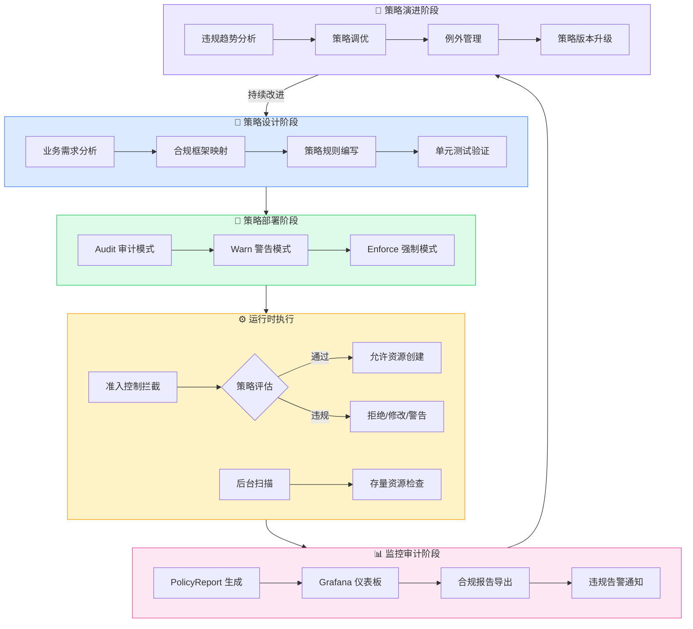
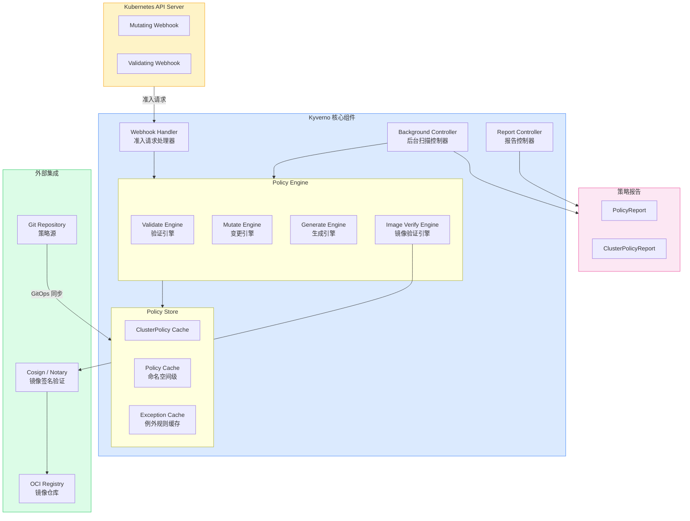
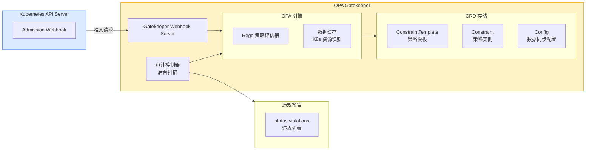
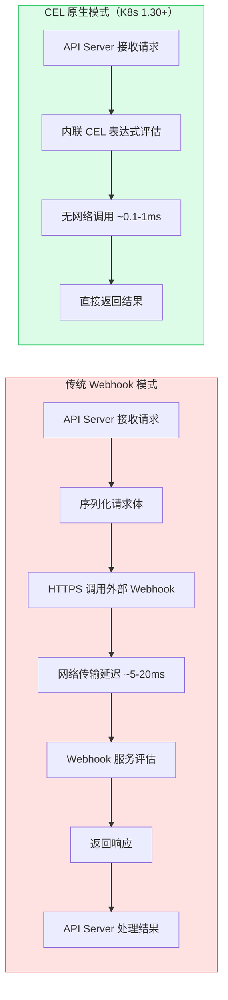
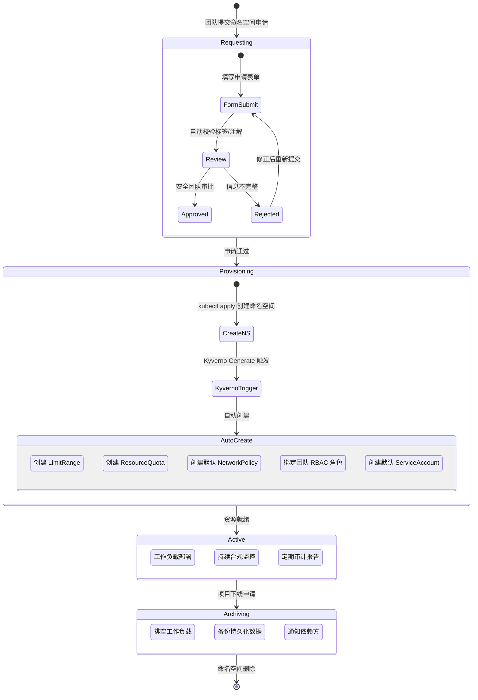
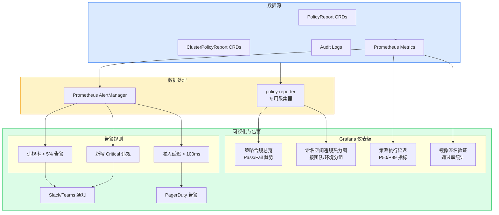
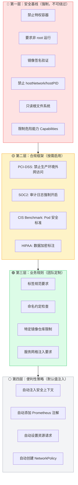

title: [[Kubernetes|Kubernetes]] 策略即代码与治理自动化 (Policy-as-Code and Governance Automation)
description: '**作者:** 云原生治理架构专家 | **版本:** v1.0 | **更新时间:** 2026-03-03 | **适用场景:**
  集群治理、合规审计、策略自动化 | **复杂度:** ⭐⭐⭐⭐⭐'
category: papers
tags:
- k8s
- papers
- research
- scheduler
- controller-manager
- [[Prometheus|prometheus]]
- grafana
- [[Envoy|envoy]]
- [[Cilium|cilium]]
- helm
last_updated: 2026-05
difficulty: expert
reading_level: expert
audience:
- 架构师
- 技术决策者
- 研究员
estimated_read_time: 30min
intent_queries:
- Kubernetes 策略即代码与治理自动化 (Policy-as-Code and Governance Automation) 是什么
- 如何 Kubernetes 策略即代码与治理自动化 (Policy-as-Code and Governance Automation)
- Kubernetes 19 papers 最佳实践
trigger_keywords:
- Kubernetes
- 策略即代码与治理自动化
- Policy-as-Code
- and
- Governance
- Automation
- papers
authors:
- name: KUDIG Team
  role: contributor
k8s_versions:
- '1.28'
- '1.29'
- '1.30'
- '1.31'
- '1.32'
---

# Kubernetes 策略即代码与治理自动化 (Policy-as-Code and Governance Automation)

**作者:** 云原生治理架构专家 | **版本:** v1.0 | **更新时间:** 2026-03-03 | **适用场景:** 集群治理、合规审计、策略自动化 | **复杂度:** ⭐⭐⭐⭐⭐

---

<!-- chunk: 摘要 -->## 摘要

随着 Kubernetes 集群规模的持续扩张，企业面临的治理挑战日益严峻：多租户环境下的策略一致性、跨集群合规审计、动态工作负载的安全基线维护……传统的手工审核模式已无法满足云原生时代的规模化需求。**策略即代码（Policy-as-Code）** 将治理规则以声明式代码的形式固化，借助准入控制、后台扫描和 GitOps 流水线，实现从"人工把关"到"自动化护栏"的范式转变。

本文系统梳理 Kubernetes 生态中最主流的策略引擎——**Kyverno**、**OPA/Gatekeeper** 以及 K8s 1.30+ 正式 GA 的 **ValidatingAdmissionPolicy（CEL 原生）**，涵盖架构设计、规则编写、生命周期管理、命名空间治理、合规报告及企业级体系建设，并展望 AI 辅助策略生成等前沿趋势。文档面向平台工程师、安全架构师及 DevOps 团队，建议结合 [doc-03 零信任安全](./03-kubernetes-zero-trust-security.md)、[doc-08 网络策略](./08-kubernetes-network-policies-security-micro-segmentation.md) 及 [doc-20 供应链安全](./20-kubernetes-supply-chain-security-sbom-slsa-sigstore.md) 协同阅读。

---

<!-- chunk: 目录 -->## 目录

1. [策略治理挑战](#1-策略治理挑战)
2. [Kyverno 深度实践](#2-kyverno-深度实践)
3. [OPA/Gatekeeper 实践](#3-opagatekeeper-实践)
4. [ValidatingAdmissionPolicy（K8s 原生）](#4-validatingadmissionpolicyk8s-原生)
5. [策略生命周期管理](#5-策略生命周期管理)
6. [命名空间治理](#6-命名空间治理)
7. [策略报告与审计](#7-策略报告与审计)
8. [企业级策略体系建设](#8-企业级策略体系建设)
9. [未来趋势](#9-未来趋势)

---

<!-- chunk: 1. 策略治理挑战 -->## 1. 策略治理挑战

## 1.1 多租户/多集群一致性困境

在大型企业 Kubernetes 平台中，通常存在以下复杂场景：

- **多业务线共享集群**：不同团队的工作负载混合部署，资源配额、网络隔离、镜像来源等要求各不相同
- **多集群跨区域部署**：生产、预发、开发集群分散在多个云区域，策略漂移（Policy Drift）风险极高
- **动态工作负载**：微服务频繁迭代，人工审核无法追上 CI/CD 的交付节奏
- **合规审计压力**：PCI-DSS、SOC2、ISO27001 等合规框架要求持续的控制证据

**策略漂移的危险性：** 策略漂移指集群实际运行状态与预期治理规则之间的偏差。一旦漂移，攻击者可能利用未打标签的工作负载绕过安全扫描，特权容器悄然运行于生产环境，资源滥用导致集群稳定性下降。

## 1.2 策略即代码哲学

Policy-as-Code 的核心理念来源于基础设施即代码（IaC）：

```
传统模式：手工审核 → 文档规范 → 人脑记忆 → 易错易漏
PaC 模式：代码化规则 → 版本控制 → 自动执行 → 持续审计
```

**核心原则：**
1. **声明式（Declarative）**：描述期望状态，而非操作步骤
2. **版本化（Versioned）**：策略变更通过 Git PR 审批，留存完整历史
3. **可测试（Testable）**：策略在 CI 流水线中可独立验证
4. **自动执行（Automated Enforcement）**：策略引擎自动拦截/修复违规

## 1.3 治理生命周期全景



## 1.4 主流策略引擎对比概览

| 维度 | Kyverno | OPA/Gatekeeper | ValidatingAdmissionPolicy |
|------|---------|----------------|--------------------------|
| **CNCF 状态** | Graduated (2023) | OPA Graduated | K8s 原生 (1.30 GA) |
| **规则语言** | YAML/JMESPath | Rego | CEL |
| **学习曲线** | 低 | 高 | 中 |
| **变更能力** | ✅ Mutate | ❌ | ❌ |
| **镜像验证** | ✅ verifyImages | 需扩展 | ❌ |
| **后台扫描** | ✅ | ✅ | ❌ |
| **适用规模** | 中小到大型 | 大型企业 | 任意（原生集成）|

---

<!-- chunk: 2. Kyverno 深度实践 -->## 2. Kyverno 深度实践

## 2.1 Kyverno 简介与 CNCF Graduated 地位

Kyverno（来自希腊语"治理"）于 **2023 年正式晋升为 CNCF Graduated 项目**，标志着其在生产环境的成熟度得到广泛认可。核心特点：

- **纯 YAML 策略**：无需学习新语言，与 Kubernetes 原生资源风格一致
- **完整的准入控制覆盖**：Validate、Mutate、Generate、VerifyImages 四类规则
- **后台扫描**：对已存在的资源进行合规性检测，生成 PolicyReport
- **命令行工具**：`kyverno` CLI 支持策略测试、lint 和模拟执行

## 2.2 Kyverno 架构深度解析



## 2.3 ClusterPolicy vs Policy 作用域

```yaml
# ClusterPolicy：集群级别，适用于所有命名空间
apiVersion: kyverno.io/v1
kind: ClusterPolicy
metadata:
  name: require-labels-cluster-wide
  annotations:
    policies.kyverno.io/category: "Best Practices"
    policies.kyverno.io/severity: medium
spec:
  # 集群级策略配置...

---
# Policy：命名空间级别，仅作用于特定命名空间
apiVersion: kyverno.io/v1
kind: Policy
metadata:
  name: require-labels-team-a
  namespace: team-a
spec:
  # 命名空间级策略配置...
```

**选择原则：**
- 安全基线、合规要求 → **ClusterPolicy**
- 团队特定规范、业务规则 → **Policy（命名空间级）**

## 2.4 四类规则深度实践

## 2.4.1 Validate 规则 — 强制要求标签

```yaml
apiVersion: kyverno.io/v1
kind: ClusterPolicy
metadata:
  name: require-deployment-labels
  annotations:
    policies.kyverno.io/title: "要求 Deployment 必须包含标准标签"
    policies.kyverno.io/category: "Label Standards"
    policies.kyverno.io/severity: high
    policies.kyverno.io/description: >-
      所有 Deployment 必须包含 app、team、cost-center 标签，
      以确保资源可追踪性和成本分摊。
spec:
  validationFailureAction: Enforce   # Audit | Warn | Enforce
  background: true                   # 同时扫描已存在资源
  rules:
    - name: check-required-labels
      match:
        any:
          - resources:
              kinds:
                - Deployment
      validate:
        message: >-
          Deployment '{{ request.object.metadata.name }}' 缺少必要标签。
          请确保包含: app, team, cost-center。
          当前标签: {{ request.object.metadata.labels }}
        pattern:
          metadata:
            labels:
              app: "?*"          # 非空字符串
              team: "?*"
              cost-center: "?*"
    
    - name: check-label-format
      match:
        any:
          - resources:
              kinds:
                - Deployment
      validate:
        message: "cost-center 标签必须符合格式 CC-XXXXX（如 CC-12345）"
        pattern:
          metadata:
            labels:
              cost-center: "CC-?????+"   # 正则：CC- 后跟数字
```

## 2.4.2 Mutate 规则 — 自动注入默认值

```yaml
apiVersion: kyverno.io/v1
kind: ClusterPolicy
metadata:
  name: inject-default-security-context
  annotations:
    policies.kyverno.io/title: "自动注入安全上下文默认值"
    policies.kyverno.io/category: "Security"
    policies.kyverno.io/severity: medium
spec:
  rules:
    - name: add-default-security-context
      match:
        any:
          - resources:
              kinds:
                - Pod
      mutate:
        patchStrategicMerge:
          spec:
            # 如果 securityContext 不存在则注入
            securityContext:
              +(runAsNonRoot): true
              +(runAsUser): 1000
              +(fsGroup): 2000
              +(seccompProfile):
                type: RuntimeDefault
            containers:
              - (name): "*"   # 匹配所有容器
                securityContext:
                  +(allowPrivilegeEscalation): false
                  +(readOnlyRootFilesystem): true
                  +(capabilities):
                    drop:
                      - ALL
    
    - name: add-resource-requests
      match:
        any:
          - resources:
              kinds:
                - Pod
      mutate:
        foreach:
          - list: "request.object.spec.containers"
            patchStrategicMerge:
              spec:
                containers:
                  - name: "{{ element.name }}"
                    resources:
                      requests:
                        +(cpu): "100m"
                        +(memory): "128Mi"
                      limits:
                        +(memory): "256Mi"
```

## 2.4.3 Generate 规则 — 自动创建 NetworkPolicy

```yaml
apiVersion: kyverno.io/v1
kind: ClusterPolicy
metadata:
  name: generate-default-networkpolicy
  annotations:
    policies.kyverno.io/title: "新命名空间自动创建默认 NetworkPolicy"
    policies.kyverno.io/category: "Network Security"
    policies.kyverno.io/severity: high
    policies.kyverno.io/description: >-
      当新命名空间创建时，自动生成默认拒绝所有流量的 NetworkPolicy，
      并允许来自同命名空间的流量和 DNS 解析。
spec:
  rules:
    - name: generate-default-deny-networkpolicy
      match:
        any:
          - resources:
              kinds:
                - Namespace
      generate:
        apiVersion: networking.k8s.io/v1
        kind: NetworkPolicy
        name: default-deny-all
        namespace: "{{ request.object.metadata.name }}"
        synchronize: true   # 策略变更时同步更新生成的资源
        data:
          metadata:
            labels:
              generated-by: kyverno
              policy: default-deny-all
          spec:
            podSelector: {}   # 匹配所有 Pod
            policyTypes:
              - Ingress
              - Egress
            egress:
              # 允许 DNS 查询
              - ports:
                  - port: 53
                    protocol: UDP
                  - port: 53
                    protocol: TCP
    
    - name: generate-allow-same-namespace
      match:
        any:
          - resources:
              kinds:
                - Namespace
      generate:
        apiVersion: networking.k8s.io/v1
        kind: NetworkPolicy
        name: allow-same-namespace
        namespace: "{{ request.object.metadata.name }}"
        synchronize: true
        data:
          spec:
            podSelector: {}
            policyTypes:
              - Ingress
            ingress:
              - from:
                  - podSelector: {}   # 仅允许同命名空间 Pod
```

## 2.4.4 VerifyImages 规则 — Cosign 镜像签名验证

```yaml
apiVersion: kyverno.io/v1
kind: ClusterPolicy
metadata:
  name: verify-image-signatures
  annotations:
    policies.kyverno.io/title: "验证镜像 Cosign 签名"
    policies.kyverno.io/category: "Supply Chain Security"
    policies.kyverno.io/severity: critical
spec:
  validationFailureAction: Enforce
  background: false   # 镜像验证仅在准入时执行
  webhookTimeoutSeconds: 30
  rules:
    - name: verify-production-images
      match:
        any:
          - resources:
              kinds:
                - Pod
              namespaceSelector:
                matchLabels:
                  environment: production
      verifyImages:
        - imageReferences:
            - "registry.company.com/prod/*"
          attestors:
            - count: 1
              entries:
                - keys:
                    publicKeys: |-
                      -----BEGIN PUBLIC KEY-----
                      MFkwEwYHKoZIzj0CAQYIKoZIzj0DAQcDQgAE...
                      -----END PUBLIC KEY-----
                    ctlog:
                      url: https://rekor.sigstore.dev
                    rekor:
                      url: https://rekor.sigstore.dev
          attestations:
            - predicateType: https://slsa.dev/provenance/v0.2
              conditions:
                - all:
                    - key: "{{ builder.id }}"
                      operator: Equals
                      value: "https://github.com/actions/runner"
                    - key: "{{ buildType }}"
                      operator: Equals
                      value: "https://github.com/slsa-framework/slsa-github-generator"
          mutateDigest: true    # 将 tag 替换为 digest，防止 tag 变更
          verifyDigest: true
          required: true

## 2.5 后台扫描配置

```yaml
apiVersion: kyverno.io/v1
kind: ClusterPolicy
metadata:
  name: audit-privileged-containers
spec:
  validationFailureAction: Audit   # 审计模式，不阻止但生成报告
  background: true
  rules:
    - name: check-privileged
      match:
        any:
          - resources:
              kinds:
                - Pod
      validate:
        message: "检测到特权容器，这在生产环境中是不允许的"
        pattern:
          spec:
            containers:
              - =(securityContext):
                  =(privileged): "false"
```

---

<!-- chunk: 3. OPA/Gatekeeper 实践 -->## 3. OPA/Gatekeeper 实践

## 3.1 OPA 架构与 Rego 语言

**Open Policy Agent（OPA）** 是一个通用策略引擎，CNCF Graduated 项目。**Gatekeeper** 是 OPA 的 Kubernetes 专用集成层，提供：

- **ConstraintTemplate**：定义策略的"模板"（Rego 逻辑）
- **Constraint**：基于模板的"策略实例"（参数化）
- **审计功能**：后台扫描已存在资源



## 3.2 Rego 语言基础

Rego 是一种声明式查询语言，专为策略决策设计：

```rego
# 示例：禁止特权容器的 Rego 规则
package k8snopriv

# violation 规则：当条件满足时产生违规
violation[{"msg": msg, "details": {"name": name}}] {
    # 遍历所有容器
    container := input.review.object.spec.containers[_]
    name := container.name
    
    # 检查是否为特权容器
    container.securityContext.privileged == true
    
    msg := sprintf("容器 '%v' 不允许以特权模式运行", [name])
}

# 同时检查 initContainers
violation[{"msg": msg, "details": {"name": name}}] {
    container := input.review.object.spec.initContainers[_]
    name := container.name
    container.securityContext.privileged == true
    msg := sprintf("initContainer '%v' 不允许以特权模式运行", [name])
}
```

## 3.3 ConstraintTemplate 完整示例

```yaml
apiVersion: templates.gatekeeper.sh/v1
kind: ConstraintTemplate
metadata:
  name: k8srequiredlabels
  annotations:
    description: "要求 Kubernetes 资源必须包含指定标签"
spec:
  crd:
    spec:
      names:
        kind: K8sRequiredLabels
      validation:
        # 模板参数的 OpenAPI Schema
        openAPIV3Schema:
          type: object
          properties:
            labels:
              type: array
              items:
                type: object
                properties:
                  key:
                    type: string
                  allowedRegex:
                    type: string
  targets:
    - target: admission.k8s.gatekeeper.sh
      rego: |
        package k8srequiredlabels

        # 获取违规信息
        violation[{"msg": msg, "details": {"missing_labels": missing}}] {
          provided := {label | input.review.object.metadata.labels[label]}
          required := {label | label := input.parameters.labels[_].key}
          missing := required - provided
          count(missing) > 0
          msg := sprintf("资源 '%v' 缺少必要标签: %v", [
            input.review.object.metadata.name,
            missing
          ])
        }

        # 验证标签值格式
        violation[{"msg": msg}] {
          label := input.parameters.labels[_]
          has_field(label, "allowedRegex")
          value := input.review.object.metadata.labels[label.key]
          not re_match(label.allowedRegex, value)
          msg := sprintf("标签 '%v' 的值 '%v' 不符合格式要求 '%v'", [
            label.key, value, label.allowedRegex
          ])
        }

        has_field(object, field) {
          _ = object[field]
        }
```

## 3.4 Constraint 实例化示例

```yaml
apiVersion: constraints.gatekeeper.sh/v1beta1
kind: K8sRequiredLabels
metadata:
  name: deployment-must-have-labels
spec:
  enforcementAction: deny    # deny | warn | dryrun
  match:
    kinds:
      - apiGroups: ["apps"]
        kinds: ["Deployment"]
    # 排除系统命名空间
    excludedNamespaces:
      - kube-system
      - kube-public
      - gatekeeper-system
  parameters:
    labels:
      - key: app
        allowedRegex: "^[a-z][a-z0-9-]{1,62}[a-z0-9]$"
      - key: team
        allowedRegex: "^(platform|backend|frontend|data|security)$"
      - key: cost-center
        allowedRegex: "^CC-[0-9]{5}$"
      - key: version
```

## 3.5 Kyverno vs OPA/Gatekeeper 对比

| 对比维度 | Kyverno | OPA/Gatekeeper |
|---------|---------|----------------|
| **策略语言** | YAML + JMESPath/CEL | Rego（专用语言） |
| **学习曲线** | 🟢 低（Kubernetes 原生感） | 🔴 高（需要学习 Rego） |
| **Kubernetes 集成** | 🟢 原生深度集成 | 🟡 通过 Gatekeeper 适配 |
| **变更能力（Mutate）** | ✅ 完整支持 | ❌ 不支持 |
| **生成资源（Generate）** | ✅ 支持 | ❌ 不支持 |
| **镜像验证** | ✅ 内置（Cosign/Notary） | ⚠️ 需要额外配置 |
| **通用策略能力** | ❌ 仅 Kubernetes | ✅ 支持任意系统 |
| **多系统统一** | ❌ | ✅ Terraform/Envoy/etc |
| **生态成熟度** | Graduated 2023 | Graduated 2021 |
| **社区活跃度** | 🟢 非常活跃 | 🟢 成熟稳定 |
| **推荐场景** | Kubernetes 专用治理 | 多系统统一策略平台 |

**选择建议：**
- 仅需 Kubernetes 策略治理 → **Kyverno**
- 需要统一管理 K8s + Terraform + 微服务等 → **OPA/Gatekeeper**
- K8s 1.30+ 简单验证场景 → **ValidatingAdmissionPolicy**

---

<!-- chunk: 4. ValidatingAdmissionPolicy（K8s 原生） -->## 4. ValidatingAdmissionPolicy（K8s 原生）

## 4.1 CEL 表达式基础

**Common Expression Language（CEL）** 是 Google 开发的轻量级表达式语言，已被 Kubernetes 广泛采用：

```
# CEL 基础语法示例

# 访问对象属性
object.metadata.name                      # 资源名称
object.spec.replicas                      # 副本数

# 条件判断
object.spec.replicas > 0                  # 大于比较
object.metadata.labels.exists(l, l == "app")  # 标签存在性

# 字符串操作
object.metadata.name.startsWith("prod-")  # 前缀检查
object.metadata.name.matches("^[a-z]+$")  # 正则匹配

# 列表操作
object.spec.containers.all(c,             # 所有容器满足条件
  c.securityContext.runAsNonRoot == true)
object.spec.containers.exists(c,          # 至少一个容器满足
  c.name == "main")

# 数值计算
object.spec.replicas >= 2 &&
object.spec.replicas <= 100

# 变量引用（params 来自 PolicyBinding）
object.spec.replicas <= params.maxReplicas
```

## 4.2 ValidatingAdmissionPolicy 完整资源定义

```yaml
apiVersion: admissionregistration.k8s.io/v1
kind: ValidatingAdmissionPolicy
metadata:
  name: require-labels-policy
  annotations:
    description: "K8s 原生策略：要求 Deployment 必须包含标准标签"
spec:
  # 失败策略：Fail（拒绝）或 Ignore（忽略策略错误）
  failurePolicy: Fail
  
  matchConstraints:
    resourceRules:
      - apiGroups: ["apps"]
        apiVersions: ["v1"]
        operations: ["CREATE", "UPDATE"]
        resources: ["deployments"]
  
  # 参数资源引用（可选，用于参数化策略）
  paramKind:
    apiVersion: policy.example.com/v1
    kind: LabelPolicy
  
  variables:
    # 定义变量简化复杂表达式
    - name: envLabel
      expression: "object.metadata.labels['environment']"
    - name: allowedEnvs
      expression: "['dev', 'staging', 'production']"
  
  validations:
    # 规则1：必须包含 app 标签
    - expression: >-
        has(object.metadata.labels) &&
        'app' in object.metadata.labels &&
        object.metadata.labels['app'] != ''
      message: "Deployment 必须包含非空的 'app' 标签"
      reason: Invalid
    
    # 规则2：必须包含 team 标签
    - expression: >-
        has(object.metadata.labels) &&
        'team' in object.metadata.labels
      message: "Deployment 必须包含 'team' 标签"
      reason: Invalid
    
    # 规则3：environment 标签值必须合法
    - expression: >-
        !has(object.metadata.labels) ||
        !('environment' in object.metadata.labels) ||
        object.metadata.labels['environment'] in ['dev', 'staging', 'production']
      message: "environment 标签值必须为 dev、staging 或 production"
      reason: Invalid
    
    # 规则4：副本数不得超过参数中的最大值
    - expression: >-
        object.spec.replicas <= params.spec.maxReplicas
      messageExpression: >-
        "副本数 " + string(object.spec.replicas) +
        " 超过了最大允许值 " + string(params.spec.maxReplicas)
      reason: Invalid
  
  # 审计注解（记录到审计日志）
  auditAnnotations:
    - key: "team"
      valueExpression: >-
        has(object.metadata.labels) && 'team' in object.metadata.labels
        ? object.metadata.labels['team']
        : 'unknown'
```

## 4.3 ValidatingAdmissionPolicyBinding

```yaml
# 参数资源定义
apiVersion: policy.example.com/v1
kind: LabelPolicy
metadata:
  name: production-label-policy
  namespace: policy-config
spec:
  maxReplicas: 50
  requiredLabels:
    - app
    - team
    - cost-center

---
# 策略绑定：将策略与参数、目标绑定
apiVersion: admissionregistration.k8s.io/v1
kind: ValidatingAdmissionPolicyBinding
metadata:
  name: require-labels-binding-production
spec:
  policyName: require-labels-policy
  
  validationActions:
    - Deny        # 拒绝违规请求
    # - Warn      # 警告但不拒绝
    # - Audit     # 仅记录到审计日志
  
  paramRef:
    name: production-label-policy
    namespace: policy-config
    parameterNotFoundAction: Deny   # 参数不存在时的处理方式
  
  matchResources:
    namespaceSelector:
      matchLabels:
        environment: production
    # 排除特定命名空间
    excludeResourceRules:
      - apiGroups: ["apps"]
        apiVersions: ["v1"]
        resources: ["deployments"]
        resourceNames: ["system-deployment"]  # 排除特定资源名称
```

## 4.4 性能对比：CEL 原生 vs Webhook



**性能数据对比：**

| 指标 | Webhook（Kyverno/Gatekeeper） | CEL 原生 |
|------|------------------------------|---------|
| **平均延迟** | 5-20ms | 0.1-1ms |
| **P99 延迟** | 50-200ms（网络抖动） | 1-5ms |
| **额外组件** | 需要 Webhook 服务 Pod | 无（内置于 API Server）|
| **可用性风险** | Webhook 服务问题影响准入 | 无额外问题点 |
| **扩展性** | 独立扩缩 | 随 API Server 扩展 |

## 4.5 K8s 1.30+ GA 采用建议

**推荐策略：**

```
简单验证规则（标签检查、字段约束） → ValidatingAdmissionPolicy (CEL)
需要 Mutate/Generate 能力            → Kyverno
企业多系统统一策略                    → OPA/Gatekeeper
镜像签名验证                          → Kyverno verifyImages
```

**迁移路径：** 对于已有 Kyverno/Gatekeeper 的集群，建议：
1. 新的简单验证策略优先使用 CEL
2. 存量策略逐步评估迁移价值
3. 复杂策略（Mutate/Generate/VerifyImages）保留在 Kyverno

---

<!-- chunk: 5. 策略生命周期管理 -->## 5. 策略生命周期管理

## 5.1 GitOps 策略仓库设计

```
policy-repository/
├── base/                          # 基础安全策略（必须遵守）
│   ├── security/
│   │   ├── no-privileged-containers.yaml
│   │   ├── require-security-context.yaml
│   │   ├── verify-image-signatures.yaml
│   │   └── restrict-host-namespaces.yaml
│   ├── network/
│   │   ├── default-deny-networkpolicy.yaml
│   │   └── restrict-external-traffic.yaml
│   └── resource/
│       ├── require-resource-limits.yaml
│       └── require-labels.yaml
│
├── compliance/                    # 合规框架映射策略
│   ├── pci-dss/
│   │   ├── restrict-internet-egress.yaml
│   │   └── require-encryption-labels.yaml
│   ├── soc2/
│   │   └── audit-logging-required.yaml
│   └── cis-benchmark/
│       └── pod-security-standards.yaml
│
├── business/                      # 业务规则（可定制）
│   ├── team-platform/
│   ├── team-backend/
│   └── team-frontend/
│
├── exceptions/                    # 例外申请记录
│   ├── approved/
│   │   └── legacy-app-exception.yaml
│   └── pending/
│
├── tests/                         # 策略单元测试
│   ├── security/
│   │   └── no-privileged-test.yaml
│   └── kyverno-test.yaml
│
└── overlays/                      # 环境差异化配置
    ├── dev/
    │   └── kustomization.yaml     # dev 环境放宽部分策略
    ├── staging/
    └── production/
        └── kustomization.yaml     # 生产环境最严格配置
```

## 5.2 分阶段推进策略落地

```mermaid
gantt
    title 策略推进时间线（以禁止特权容器为例）
    dateFormat  YYYY-MM-DD
    section 阶段一：Audit
    后台扫描发现违规资源     :a1, 2026-01-01, 14d
    生成违规报告并通知团队   :a2, after a1, 7d
    section 阶段二：Warn
    切换为 Warn 模式         :b1, after a2, 21d
    准入时给出警告           :b2, after b1, 7d
    section 阶段三：Enforce
    切换为 Enforce 强制模式  :c1, after b2, 2026-03-01, 90d
    持续监控违规趋势         :c2, after c1, 30d
```

**分阶段配置示例：**

```yaml
# 阶段一：Audit 模式（仅记录，不阻止）
apiVersion: kyverno.io/v1
kind: ClusterPolicy
metadata:
  name: no-privileged-containers
  labels:
    policy-phase: "audit"     # 阶段标记，便于追踪
spec:
  validationFailureAction: Audit
  background: true
  rules:
    - name: check-privileged
      # ...

---
# 阶段三：切换为 Enforce
# kubectl patch clusterpolicy no-privileged-containers \
#   --type merge \
#   -p '{"spec":{"validationFailureAction":"Enforce"}}'
```

## 5.3 策略例外管理（PolicyException CRD）

```yaml
# Kyverno PolicyException：为特定工作负载申请例外
apiVersion: kyverno.io/v2alpha1
kind: PolicyException
metadata:
  name: legacy-app-security-exception
  namespace: legacy-system
  annotations:
    # 例外申请元数据，便于审计
    exception.policy/approved-by: "security-team"
    exception.policy/approved-date: "2026-02-01"
    exception.policy/review-date: "2026-08-01"
    exception.policy/ticket: "SEC-2345"
    exception.policy/reason: >-
      legacy-payment-processor 是遗留应用，需要特权模式运行。
      正在进行容器化改造（预计 2026Q3 完成），届时将移除例外。
spec:
  exceptions:
    - policyName: no-privileged-containers
      ruleNames:
        - check-privileged
        - check-init-containers-privileged
  match:
    any:
      - resources:
          kinds:
            - Pod
          namespaces:
            - legacy-system
          selector:
            matchLabels:
              app: legacy-payment-processor
```

## 5.4 版本控制与 CI 验证

```yaml
# .github/workflows/policy-ci.yml
name: Policy Validation CI

on:
  pull_request:
    paths:
      - 'policies/**'

jobs:
  kyverno-test:
    runs-on: ubuntu-latest
    steps:
      - uses: actions/checkout@v4
      
      - name: Install Kyverno CLI
        run: |
          curl -LO https://github.com/kyverno/kyverno/releases/latest/download/kyverno_linux_amd64.tar.gz
          tar -xzf kyverno_linux_amd64.tar.gz
          sudo mv kyverno /usr/local/bin/
      
      - name: Lint Policies
        run: |
          kyverno lint policies/
      
      - name: Run Policy Tests
        run: |
          kyverno test policies/tests/
      
      - name: Apply Dry-run
        run: |
          kyverno apply policies/ --resource test-resources/ --detailed-results
```

---

<!-- chunk: 6. 命名空间治理 -->## 6. 命名空间治理

## 6.1 标签标准强制执行

```yaml
# 强制命名空间必须包含治理标签
apiVersion: kyverno.io/v1
kind: ClusterPolicy
metadata:
  name: require-namespace-labels
  annotations:
    policies.kyverno.io/title: "命名空间标签规范"
    policies.kyverno.io/severity: high
spec:
  validationFailureAction: Enforce
  background: true
  rules:
    - name: require-cost-center
      match:
        any:
          - resources:
              kinds:
                - Namespace
              # 排除系统命名空间
              selector:
                matchExpressions:
                  - key: "kubernetes.io/metadata.name"
                    operator: NotIn
                    values:
                      - kube-system
                      - kube-public
                      - kube-node-lease
                      - gatekeeper-system
                      - kyverno
      validate:
        message: >-
          命名空间 '{{ request.object.metadata.name }}' 必须包含以下标签:
          cost-center（成本中心），team（团队），environment（环境）
        pattern:
          metadata:
            labels:
              cost-center: "CC-?????+"
              team: "?*"
              environment: "dev | staging | production"
    
    - name: require-owner-annotation
      match:
        any:
          - resources:
              kinds:
                - Namespace
      validate:
        message: "命名空间必须包含 owner 和 slack-channel 注解"
        pattern:
          metadata:
            annotations:
              owner: "?*"
              slack-channel: "#?*"
```

## 6.2 命名空间资源默认注入

```yaml
# 自动为新命名空间注入 LimitRange
apiVersion: kyverno.io/v1
kind: ClusterPolicy
metadata:
  name: generate-namespace-defaults
spec:
  rules:
    - name: generate-limitrange
      match:
        any:
          - resources:
              kinds:
                - Namespace
              selector:
                matchLabels:
                  environment: production
      generate:
        apiVersion: v1
        kind: LimitRange
        name: default-limits
        namespace: "{{ request.object.metadata.name }}"
        synchronize: true
        data:
          metadata:
            labels:
              generated-by: kyverno
          spec:
            limits:
              - type: Container
                default:
                  cpu: "500m"
                  memory: "256Mi"
                defaultRequest:
                  cpu: "100m"
                  memory: "128Mi"
                max:
                  cpu: "4"
                  memory: "4Gi"
                min:
                  cpu: "50m"
                  memory: "64Mi"
              - type: Pod
                max:
                  cpu: "8"
                  memory: "8Gi"
    
    - name: generate-resourcequota
      match:
        any:
          - resources:
              kinds:
                - Namespace
              selector:
                matchLabels:
                  environment: production
      generate:
        apiVersion: v1
        kind: ResourceQuota
        name: default-quota
        namespace: "{{ request.object.metadata.name }}"
        synchronize: true
        data:
          spec:
            hard:
              # 计算资源配额
              requests.cpu: "20"
              requests.memory: "40Gi"
              limits.cpu: "40"
              limits.memory: "80Gi"
              # 对象数量配额
              pods: "100"
              services: "20"
              persistentvolumeclaims: "30"
              configmaps: "50"
              secrets: "50"
              services.loadbalancers: "5"
              services.nodeports: "0"   # 禁止 NodePort
```

## 6.3 命名空间生命周期管理流程



## 6.4 命名空间隔离策略矩阵

| 命名空间类型 | NetworkPolicy | ResourceQuota | LimitRange | PSA 级别 |
|------------|--------------|---------------|------------|---------|
| **production** | 默认拒绝 + 精细放行 | 严格配额 | 强制限制 | Restricted |
| **staging** | 默认拒绝 + 放行测试流量 | 中等配额 | 有限制 | Baseline |
| **dev** | 宽松 | 基础配额 | 软限制 | Baseline |
| **system** | 按需定制 | 不限制 | 不限制 | Privileged |

---

<!-- chunk: 7. 策略报告与审计 -->## 7. 策略报告与审计

## 7.1 PolicyReport/ClusterPolicyReport 资源

Kyverno 和 Gatekeeper 均支持将策略检查结果写入标准化的 PolicyReport CRD：

```yaml
# 自动生成的 PolicyReport 示例（由 Kyverno 创建）
apiVersion: wgpolicyk8s.io/v1alpha2
kind: PolicyReport
metadata:
  name: cpol-require-deployment-labels
  namespace: team-backend
  labels:
    app.kubernetes.io/managed-by: kyverno
    policy.kubernetes.io/policy-name: require-deployment-labels
spec: {}
results:
  - policy: require-deployment-labels
    rule: check-required-labels
    category: "Label Standards"
    severity: high
    timestamp:
      nanos: 0
      seconds: 1740960000
    result: fail   # pass | fail | warn | error | skip
    scored: true
    source: kyverno
    message: >-
      Deployment 'payment-service' 缺少必要标签。
      请确保包含: app, team, cost-center。
    resources:
      - apiVersion: apps/v1
        kind: Deployment
        name: payment-service
        namespace: team-backend
        uid: "a1b2c3d4-..."
  - policy: require-deployment-labels
    rule: check-required-labels
    result: pass
    resources:
      - apiVersion: apps/v1
        kind: Deployment
        name: user-service
        namespace: team-backend
        uid: "e5f6g7h8-..."
summary:
  pass: 15
  fail: 3
  warn: 1
  error: 0
  skip: 2

---
# ClusterPolicyReport：集群级别汇总报告
apiVersion: wgpolicyk8s.io/v1alpha2
kind: ClusterPolicyReport
metadata:
  name: cpol-verify-image-signatures
summary:
  pass: 142
  fail: 7
  warn: 0
  error: 0
  skip: 5
```

## 7.2 Prometheus 指标采集

```yaml
# Kyverno 暴露的关键 Prometheus 指标
# kyverno_policy_rule_info_total：策略规则数量
# kyverno_admission_requests_total：准入请求总数
# kyverno_admission_review_duration_seconds：准入延迟
# kyverno_policy_results_total：策略评估结果统计

# 配置 ServiceMonitor 采集 Kyverno 指标
apiVersion: monitoring.coreos.com/v1
kind: ServiceMonitor
metadata:
  name: kyverno-metrics
  namespace: monitoring
spec:
  selector:
    matchLabels:
      app.kubernetes.io/name: kyverno
  endpoints:
    - port: metrics
      interval: 30s
      path: /metrics
  namespaceSelector:
    matchNames:
      - kyverno
```

## 7.3 Grafana 仪表板集成



## 7.4 合规报告自动生成

```yaml
# policy-reporter 配置：自动生成合规报告
apiVersion: v1
kind: ConfigMap
metadata:
  name: policy-reporter-config
  namespace: policy-reporter
data:
  config.yaml: |
    # 邮件报告配置
    emailReports:
      smtp:
        host: smtp.company.com
        port: 587
        username: policy-reporter@company.com
      clusterReports:
        - to:
            - security-team@company.com
            - compliance@company.com
          filter:
            severities:
              - critical
              - high
          channels:
            - email
          schedule: "0 8 * * 1"   # 每周一上午8点

    # Slack 集成
    slack:
      webhook: "https://hooks.slack.com/services/xxx"
      channels:
        - slack: "#security-alerts"
          filter:
            severities:
              - critical
            status:
              - fail

    # S3 报告存档
    s3:
      endpoint: s3.amazonaws.com
      region: ap-northeast-1
      bucket: compliance-reports
      prefix: kyverno-reports/
      schedule: "0 0 * * *"   # 每日存档
```

## 7.5 关键合规指标

| 指标名称 | 计算方式 | 健康阈值 | 告警阈值 |
|---------|---------|---------|---------|
| **策略合规率** | pass / (pass+fail) × 100% | ≥ 98% | < 95% |
| **Critical 违规数** | 当前 Critical fail 总数 | 0 | > 0 |
| **策略覆盖率** | 受策略保护资源 / 总资源 | ≥ 99% | < 95% |
| **修复平均时间（MTTR）** | 从违规发现到修复的平均时长 | < 24h | > 72h |
| **例外到期率** | 即将到期的例外 / 总例外 | 0 | > 10% |

---

<!-- chunk: 8. 企业级策略体系建设 -->## 8. 企业级策略体系建设

## 8.1 分层策略架构



## 8.2 多集群策略分发（ArgoCD + Kyverno）

```yaml
# ArgoCD ApplicationSet：向多个集群分发策略
apiVersion: argoproj.io/v1alpha1
kind: ApplicationSet
metadata:
  name: kyverno-base-policies
  namespace: argocd
spec:
  generators:
    - clusters:
        selector:
          matchLabels:
            policy-tier: production   # 标签选择目标集群
  template:
    metadata:
      name: "kyverno-policies-{{name}}"
    spec:
      project: platform
      source:
        repoURL: https://github.com/company/policy-repository
        targetRevision: HEAD
        path: "policies/overlays/{{metadata.labels.environment}}"
        kustomize:
          commonLabels:
            managed-by: argocd
            target-cluster: "{{name}}"
      destination:
        server: "{{server}}"
        namespace: kyverno
      syncPolicy:
        automated:
          prune: true    # 自动删除不再需要的策略
          selfHeal: true # 自动修复手动变更
        syncOptions:
          - CreateNamespace=true
          - RespectIgnoreDifferences=true
        retry:
          limit: 3
          backoff:
            duration: 5s
            factor: 2
            maxDuration: 3m
      # 忽略策略状态字段的差异（由 Kyverno 自动填充）
      ignoreDifferences:
        - group: kyverno.io
          kind: ClusterPolicy
          jsonPointers:
            - /status
```

## 8.3 企业级策略体系建设检查清单

```yaml
# 分阶段建设检查清单
enterprise_policy_checklist:
  
  phase_1_foundation:
    name: "第一阶段：安全基线（第1-3个月）"
    items:
      - id: P1-01
        item: "部署 Kyverno 并配置高可用（≥3 副本）"
        priority: Critical
        status: pending
      
      - id: P1-02
        item: "实施 Pod Security Standards（Restricted 级别）"
        priority: Critical
        status: pending
      
      - id: P1-03
        item: "配置镜像仓库白名单策略"
        priority: High
        status: pending
      
      - id: P1-04
        item: "强制要求资源 requests/limits"
        priority: High
        status: pending
      
      - id: P1-05
        item: "建立策略 Git 仓库和 CI/CD 流水线"
        priority: High
        status: pending
  
  phase_2_governance:
    name: "第二阶段：治理规范（第4-6个月）"
    items:
      - id: P2-01
        item: "实施命名空间标签规范"
        priority: High
        status: pending
      
      - id: P2-02
        item: "配置 PolicyReport 和 Grafana 仪表板"
        priority: Medium
        status: pending
      
      - id: P2-03
        item: "建立例外管理流程（PolicyException）"
        priority: Medium
        status: pending
      
      - id: P2-04
        item: "实施镜像签名验证（Cosign）"
        priority: High
        status: pending
  
  phase_3_advanced:
    name: "第三阶段：高级能力（第7-12个月）"
    items:
      - id: P3-01
        item: "多集群策略统一分发（ArgoCD）"
        priority: Medium
        status: pending
      
      - id: P3-02
        item: "合规报告自动化（邮件/Slack）"
        priority: Medium
        status: pending
      
      - id: P3-03
        item: "评估迁移到 CEL 原生策略"
        priority: Low
        status: pending
      
      - id: P3-04
        item: "建立策略贡献和审批流程"
        priority: Medium
        status: pending
```

## 8.4 Kyverno 高可用部署配置

```yaml
# Kyverno 生产级 Helm values
replicaCount: 3   # 高可用部署

admissionController:
  replicas: 3
  podDisruptionBudget:
    enabled: true
    minAvailable: 2
  resources:
    requests:
      cpu: 100m
      memory: 256Mi
    limits:
      cpu: 1000m
      memory: 1Gi
  topologySpreadConstraints:
    - maxSkew: 1
      topologyKey: kubernetes.io/hostname
      whenUnsatisfiable: DoNotSchedule
      labelSelector:
        matchLabels:
          app.kubernetes.io/component: admission-controller

backgroundController:
  replicas: 2
  resources:
    requests:
      cpu: 100m
      memory: 256Mi

cleanupController:
  replicas: 1

reportsController:
  replicas: 1

config:
  webhooks:
    # 超时时间（秒），建议 10-30s
    - name: mutating.kyverno.svc
      timeoutSeconds: 10
    - name: validating.kyverno.svc
      timeoutSeconds: 10
  
  # 排除系统命名空间
  excludeGroups:
    - system:nodes
  excludeUsernames:
    - system:kube-scheduler
    - system:kube-controller-manager

metricsConfig:
  namespaces:
    include: []   # 空表示监控所有命名空间

serviceMonitor:
  enabled: true
  additionalLabels:
    release: prometheus-stack
```

---

<!-- chunk: 9. 未来趋势 -->## 9. 未来趋势

## 9.1 CEL 在 Kubernetes 中的持续扩展

CEL 已从 ValidatingAdmissionPolicy 扩展到 Kubernetes 更多领域：

```
K8s 1.25: CRD 验证规则（x-kubernetes-validations）
K8s 1.26: ValidatingAdmissionPolicy Alpha
K8s 1.28: ValidatingAdmissionPolicy Beta（默认开启）
K8s 1.30: ValidatingAdmissionPolicy GA ✅ + MutatingAdmissionPolicy Alpha（feature gate，默认关闭）
K8s 1.32: MutatingAdmissionPolicy v1alpha1 API
K8s 1.34: MutatingAdmissionPolicy v1beta1 API（默认关闭）
K8s 1.36: MutatingAdmissionPolicy GA ✅
未来:     更多 API 字段支持 CEL 表达式
```

**MutatingAdmissionPolicy（Alpha）示例：**

```yaml
# K8s 原生变更策略（未来 GA 后可替代简单 Mutate 场景）
apiVersion: admissionregistration.k8s.io/v1alpha1
kind: MutatingAdmissionPolicy
metadata:
  name: inject-default-labels
spec:
  matchConstraints:
    resourceRules:
      - apiGroups: ["apps"]
        apiVersions: ["v1"]
        operations: ["CREATE"]
        resources: ["deployments"]
  mutations:
    - patchType: ApplyConfiguration
      applyConfiguration:
        expression: >-
          Object{
            metadata: Object.metadata{
              labels: object.metadata.labels.
                merge({"managed-by": "platform-team"})
            }
          }
```

## 9.2 AI 辅助策略生成

随着 LLM 技术的成熟，AI 辅助策略生成正在成为现实：

```mermaid
graph LR
    subgraph Input["输入方式"]
        NL[自然语言描述<br/>"所有生产环境 Pod 必须非 root 运行"]
        CIS[合规框架要求<br/>CIS Benchmark / PCI-DSS]
        CVE[CVE 漏洞信息<br/>自动生成防护策略]
    end

    subgraph AI["AI 策略引擎"]
        LLM[LLM 模型<br/>GPT-4 / Claude]
        VAL[语法验证器<br/>kyverno lint]
        TEST[自动测试生成<br/>kyverno test]
    end

    subgraph Output["输出结果"]
        YAML[策略 YAML 草稿]
        PR[Git Pull Request<br/>含测试用例]
        REVIEW[人工审核确认]
    end

    Input --> AI
    AI --> Output
    REVIEW -->|批准后部署| Deploy[GitOps 自动部署]

    style AI fill:#ede9fe,stroke:#8b5cf6
```

**当前可用的 AI 辅助工具：**
- **Kyverno Playground**：在线策略测试和生成辅助
- **Gatekeeper Policy Library**：基于模板的策略生成
- **GitHub Copilot + 策略模板**：加速策略编写
- **专业 LLM 提示词**：结构化生成符合规范的策略 YAML

## 9.3 eBPF 与策略执行融合

```
传统准入控制：仅在资源创建/更新时执行
eBPF 运行时策略：持续监控运行时行为

融合趋势：
- Tetragon（Cilium）：基于 eBPF 的运行时安全策略
- Falco：运行时威胁检测（策略引擎 + eBPF 内核探针）
- KubeArmor：基于 LSM/eBPF 的容器安全策略

未来方向：准入策略 + 运行时策略统一管理平台
```

## 9.4 跨文档知识关联

本文内容与以下文档密切相关，建议协同阅读：

```
📄 doc-03: Kubernetes 零信任安全架构
   → 策略即代码是零信任"最小权限"原则的实施手段
   → RBAC 策略 + Kyverno 策略形成多层防护

📄 doc-08: Kubernetes 网络策略与微分段
   → Kyverno Generate 自动创建 NetworkPolicy
   → 命名空间隔离策略与网络微分段协同

📄 doc-20: Kubernetes 供应链安全（SBOM/SLSA/Sigstore）
   → Kyverno verifyImages 验证 Cosign 签名
   → SLSA 来源证明通过 attestations 验证
   → SBOM 合规性可通过策略强制要求
```

## 9.5 策略即代码成熟度模型

```
Level 0：无策略（手工审核）
  ↓
Level 1：基础防护（Pod Security Standards / PSP 迁移）
  ↓
Level 2：系统性策略（Kyverno/Gatekeeper，覆盖主要资源）
  ↓
Level 3：生命周期管理（GitOps + CI/CD + 例外管理）
  ↓
Level 4：可观测性（PolicyReport + Grafana + 自动化报告）
  ↓
Level 5：持续优化（AI 辅助 + 多集群统一 + 运行时策略）
```

---

<!-- chunk: 总结 -->## 总结

策略即代码已从"锦上添花"演变为云原生安全治理的核心基础设施。以下是关键要点：

| 维度 | 核心建议 |
|------|---------|
| **工具选择** | Kubernetes 专用场景首选 Kyverno；多系统统一选 OPA；简单验证可用 CEL 原生 |
| **推进策略** | 务必遵循 Audit → Warn → Enforce 三阶段，避免直接强制拦截 |
| **仓库管理** | 策略代码化，纳入 Git 版本控制，CI 流水线自动验证 |
| **例外管理** | 所有例外必须记录原因、审批信息、到期时间 |
| **可观测性** | PolicyReport + Grafana 仪表板是策略体系的"仪表盘" |
| **分层架构** | 安全基线 → 合规框架 → 业务规则 → 便利性策略，层次清晰 |

策略治理没有终点——随着业务演进、新威胁出现和合规要求变化，策略体系需要持续迭代。建立一个健壮的 Policy-as-Code 文化，让每一个治理决策都有迹可循、可验证、可回滚，是云原生平台工程的重要里程碑。

---

<!-- chunk: 相关资源 -->## 相关资源

## 官方文档
- [Kyverno 官方文档](https://kyverno.io/docs/)
- [Kyverno 策略库](https://kyverno.io/policies/)
- [OPA/Gatekeeper 文档](https://open-policy-agent.github.io/gatekeeper/)
- [ValidatingAdmissionPolicy KEP](https://kubernetes.io/docs/reference/access-authn-authz/validating-admission-policy/)
- [Policy Reporter](https://kyverno.github.io/policy-reporter/)

## 工具
- [Kyverno Playground](https://playground.kyverno.io/)
- [OPA Playground](https://play.openpolicyagent.org/)
- [Conftest](https://www.conftest.dev/) — 策略测试框架
- [Datree](https://www.datree.io/) — Kubernetes 配置验证

## 相关论文与标准
- CIS Kubernetes Benchmark v1.8
- NIST SP 800-190（容器安全指南）
- SLSA Framework v1.0

---

*📝 文档维护说明：本文档由云原生治理架构专家团队维护，版本 v1.0 发布于 2026-03-03。如发现内容错误或需要补充，请通过 Git PR 提交修改建议，所有变更均需经过策略委员会审批。*

---

<!-- chunk: Obsidian 相关文档 -->## Obsidian 相关文档

- domain-19-papers MOC
- [[domain-19-landscape-references/README.md|Domain 19: Kubernetes 高级技术论文与最佳实践 (Advanced Technical Papers...]]
- Domain-19 论文与参考 — 开源项目索引
- Kubernetes 生产就绪性评估框架 (Production Readiness Assessment Framew...
- Kubernetes 大规模集群性能优化深度实践 (Large-Scale Cluster Performance Op...
- Kubernetes 安全零信任架构实施指南 (Zero Trust Security Architecture Imp...
- Kubernetes 多云混合部署架构与实践 (Multi-Cloud Hybrid Deployment Archit...
- Kubernetes GitOps 完整实践指南 (GitOps Complete Practice Guide)
- Kubernetes 成本治理与 FinOps 实践 (Kubernetes Cost Governance and F...
- Kubernetes 容器存储接口 (CSI) 深度实践指南 (Container Storage Interface ...
- Kubernetes 网络策略与安全微隔离实践 (Network Policies and Security Micro...
- Kubernetes 服务网格深度实践与Istio集成 (Service Mesh Deep Practice and ...

## See Also

- 22-kubernetes-webassembly-wasm-workloads
- 23-kubernetes-opentelemetry-native-observability
- 25-gke-autopilot-google-cloud-ai-infrastructure
- 26-kubernetes-vcluster-virtual-cluster-multi-tenancy

## Related

- [[domain-19-landscape-references/topic-index/etcd-index.md|etcd 知识图谱索引]]
