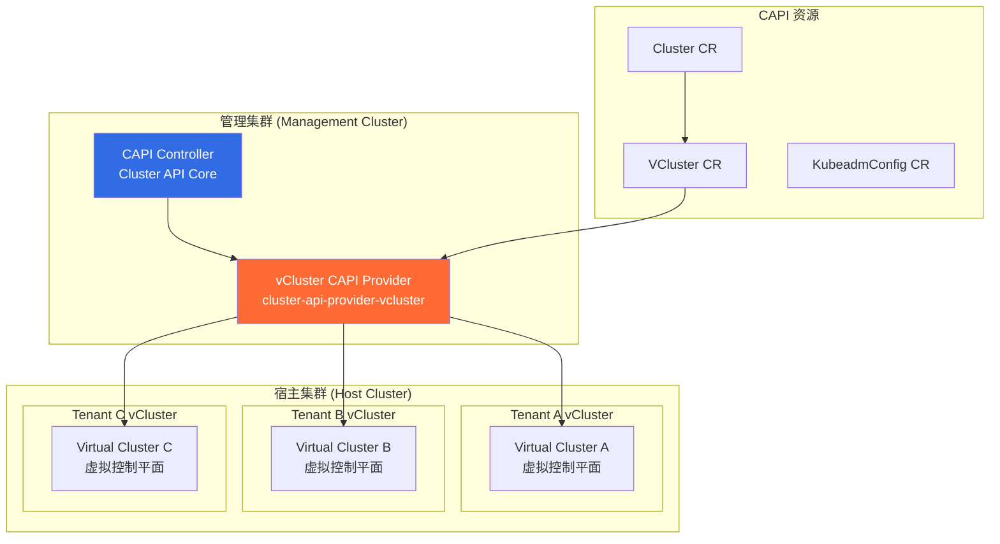
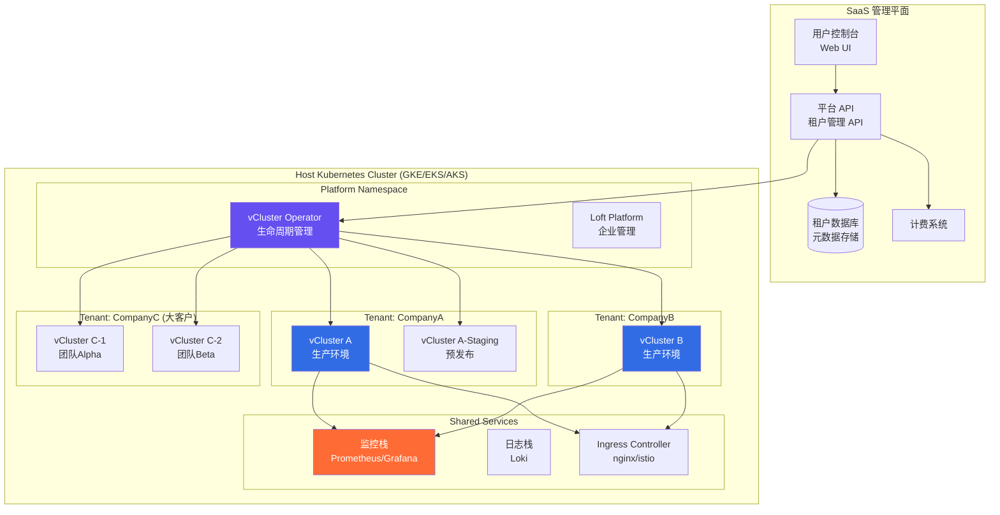

# [[Kubernetes|Kubernetes]] vCluster 与虚拟集群多租户 (vCluster and Virtual Cluster Multi-Tenancy)

> 作者: 多租户架构专家 | 版本: v1.0 | 更新时间: 2026-03-03
> 适用场景: SaaS 平台多租户、开发测试隔离、CI/CD 环境、平台工程 | 复杂度: ⭐⭐⭐⭐

---

<!-- chunk: 摘要 -->## 摘要

虚拟集群（Virtual Cluster）技术在 2026 年已成为 Kubernetes 多租户架构的主流方案之一。vCluster（由 Loft Labs 开源，CNCF Sandbox 项目）通过在物理 Kubernetes 集群中运行轻量级虚拟 Kubernetes 控制平面，为每个租户提供完整、隔离的 [[domain-17-system-foundation/topic-dictionary/fundamentals/the-kubernetes-api.md|Kubernetes API]] 体验，同时共享底层物理资源，兼顾了隔离性、成本和运维效率。

本文深度探讨 vCluster 的核心架构、生产部署实践、与 Cluster API 的集成模式，以及多租户 SaaS 平台的完整架构设计。通过真实的 CI/CD 自动化用例、安全边界分析和成本分配模型，帮助平台工程师选择最适合的多租户策略，构建高效、安全、可扩展的多租户 Kubernetes 平台。

---

<!-- chunk: 目录 -->## 目录

1. [虚拟集群概念](#1-虚拟集群概念)
2. [vCluster 架构深度](#2-vcluster-架构深度)
3. [部署实践](#3-部署实践)
4. [高级企业特性](#4-高级企业特性)
5. [Cluster API 集成](#5-cluster-api-集成)
6. [开发测试环境实践](#6-开发测试环境实践)
7. [安全边界分析](#7-安全边界分析)
8. [生产多租户架构](#8-生产多租户架构)
9. [未来趋势](#9-未来趋势)

---

<!-- chunk: 1. 虚拟集群概念 -->## 1. 虚拟集群概念

## 1.1 多租户技术三层对比

Kubernetes 多租户有三种核心技术方案，各有优劣：

| 对比维度 | Namespace 隔离 | vCluster 虚拟集群 | 物理独立集群 |
|---------|--------------|-----------------|------------|
| **隔离级别** | 软隔离（逻辑） | 中等（API 完全隔离）| 强隔离（物理）|
| **控制平面** | 共享 | 租户独享虚拟控制平面 | 租户独享物理控制平面 |
| **K8s API 完整性** | 受限（无 CRD 自由） | 完整（完全权限）| 完整 |
| **成本** | 极低 | 低（轻量控制平面）| 高（完整节点） |
| **启动时间** | 秒级 | 10-30秒 | 5-10分钟 |
| **管理复杂度** | 低 | 中 | 高 |
| **资源利用率** | 高 | 高 | 低（节点预留） |
| **节点共享** | 是 | 是 | 否 |
| **集群级资源** | 不支持（ClusterRole等）| 支持 | 支持 |
| **自定义 CRD** | 受限（需平台审批）| 完全自由 | 完全自由 |
| **数据平面隔离** | 共享（Pod 同节点）| 共享 Pod/节点 | 独立节点 |
| **合规要求满足** | 仅基础合规 | 中等合规场景 | 严格合规场景 |
| **适用规模** | 团队/项目级 | 产品/业务线级 | 大型企业/SaaS |
| **典型场景** | 同团队多环境 | SaaS 租户 | 金融/医疗严格隔离 |

## 1.2 vCluster CNCF 状态

```
vCluster 项目状态 (2026)：
────────────────────────────────────────────
项目名称:    vCluster
维护者:      Loft Labs
CNCF 状态:   Sandbox (2023年加入)
GitHub Stars: 8,500+ (2026-03)
主要版本:    v0.21 (最新稳定版)
协议:        Apache 2.0 (核心开源版)
────────────────────────────────────────────

生产使用情况 (2026 调查数据):
  使用 vCluster 的组织: 450+
  生产环境 vCluster 数量: 50,000+
  最大单一部署: 1,200 vClusters (某 SaaS 公司)
  平均每 vCluster 资源: 0.5 CPU + 512MB RAM
────────────────────────────────────────────
```

## 1.3 何时选择 vCluster

```
决策树：

需要多租户 K8s 环境？
    │
    ├─ 租户需要完整 K8s 权限（安装 CRD/Operator）？
    │       ├─ 是 → vCluster 或物理集群
    │       └─ 否 → Namespace + RBAC 可能足够
    │
    ├─ 预算有限，需要高密度共用？
    │       ├─ 是 → vCluster (vs 物理集群节省 70-90%)
    │       └─ 否 → 物理集群（最强隔离）
    │
    ├─ 需要快速创建/销毁环境 (<1 分钟)？
    │       ├─ 是 → vCluster (30秒创建)
    │       └─ 否 → 物理集群或 vCluster
    │
    ├─ 严格数据隔离（PCI-DSS Level 1, HIPAA）？
    │       ├─ 是 → 物理独立集群
    │       └─ 否 → vCluster
    │
    └─ CI/CD 临时环境 (PR Preview)？
            └─ 是 → vCluster (强烈推荐)
```

---

<!-- chunk: 2. vCluster 架构深度 -->## 2. vCluster 架构深度

## 2.1 核心架构图

```mermaid
graph TB
    subgraph "Host Kubernetes Cluster (物理集群)"
        HOST_API[Host API Server\n物理集群控制平面]
        HOST_NS[Namespace: tenant-a-vcluster\n宿主命名空间]

        subgraph "vCluster Pod (租户控制平面)"
            VAPI[Virtual API Server\nK3s/K0s/K8s 嵌入]
            SYNC[Syncer\n双向同步控制器]
            STORE[Virtual etcd\n虚拟状态存储]
        end

        subgraph "同步到宿主集群的资源"
            H_POD[Host Pod\n(来自 vCluster Sync)]
            H_SVC[Host Service\n(来自 vCluster Sync)]
            H_PVC[Host PVC\n(来自 vCluster Sync)]
            H_SA[Host ServiceAccount]
        end

        KUBELET[kubelet\n物理节点]
    end

    subgraph "Tenant A 视角 (虚拟集群内)"
        T_POD[Virtual Pod\n(租户以为是独立集群)]
        T_SVC[Virtual Service]
        T_PVC[Virtual PVC]
        T_CRD[Custom CRD\n(租户自由安装)]
        T_CLUSTER_ROLE[ClusterRole\n(虚拟集群级别)]
    end

    HOST_API --> HOST_NS
    HOST_NS --> VAPI
    HOST_NS --> SYNC
    HOST_NS --> STORE
    VAPI --> STORE

    T_POD -->|租户操作| VAPI
    T_SVC -->|租户操作| VAPI
    T_PVC -->|租户操作| VAPI
    T_CRD -->|租户自由安装| VAPI

    SYNC -->|同步 Pod spec| H_POD
    SYNC -->|同步 Service| H_SVC
    SYNC -->|同步 PVC| H_PVC
    SYNC -->|同步 SA| H_SA

    H_POD -->|实际运行| KUBELET

    style VAPI fill:#654FF0,color:#fff
    style SYNC fill:#FF6B35,color:#fff
    style HOST_API fill:#326CE5,color:#fff
```

## 2.2 控制平面嵌入对比

vCluster 支持三种虚拟控制平面实现：

| 特性 | [[k3s|K3s]]（默认） | [[K0s|K0s]] | Vanilla K8s |
|-----|------------|-----|------------|
| **二进制大小** | ~70MB | ~70MB | ~150MB |
| **内存占用** | ~150MB | ~120MB | ~250MB |
| **启动时间** | ~15秒 | ~12秒 | ~30秒 |
| **API 兼容性** | 高 (1.28+) | 高 (1.28+) | 完整 |
| **内置组件** | etcd+apiserver+scheduler | 同 K3s | 分离组件 |
| **适用场景** | 大多数场景默认推荐 | 低资源边缘 | 严格兼容性需求 |
| **Kubernetes 版本滞后** | 通常滞后 1-2 版本 | 紧跟上游 | 无滞后 |

## 2.3 Syncer 双向同步机制

Syncer 是 vCluster 的核心组件，负责在虚拟集群和物理集群之间同步资源：

```
同步方向与资源类型：

虚拟集群 → 宿主集群 (Syncer 向下同步)：
  ✅ Pod (重写：命名空间前缀、ServiceAccount 映射)
  ✅ Service (重写：ClusterIP 映射)
  ✅ PersistentVolumeClaim
  ✅ ConfigMap (按需同步)
  ✅ Secret (按需同步)
  ✅ ServiceAccount (自动映射)
  ✅ Ingress (按需)
  ✅ NetworkPolicy (按需)

宿主集群 → 虚拟集群 (Syncer 向上反馈)：
  ✅ Pod 状态 (IP, 阶段, 容器状态)
  ✅ Node 信息 (虚拟节点，来自宿主节点)
  ✅ PersistentVolume (绑定后反馈)
  ✅ 事件 (Event 同步)

保留在虚拟集群内部 (不同步到宿主)：
  📦 Deployment, StatefulSet, DaemonSet (只有 Pod 同步)
  📦 CRD 和 CR (租户自定义资源)
  📦 RBAC (ClusterRole/ClusterRoleBinding)
  📦 Namespace (虚拟命名空间不映射到宿主)
  📦 ServiceMesh 配置 (VirtualService 等)
```

```
Pod 名称重写示例：

虚拟集群中：
  Namespace: production
  Pod: order-service-7d9f-xk2pq

宿主集群中：
  Namespace: tenant-a-vcluster (宿主命名空间)
  Pod: order-service-7d9f-xk2pq-x-production-x-my-vcluster
       └──────────────────┘ └───────────┘ └──────────────┘
           原始 Pod 名           虚拟 NS    vCluster 名称
```

---

<!-- chunk: 3. 部署实践 -->## 3. 部署实践

## 3.1 CLI 快速创建 vCluster

```bash
# 安装 vCluster CLI
curl -L -o /usr/local/bin/vcluster \
  "https://github.com/loft-sh/vcluster/releases/latest/download/vcluster-linux-amd64"
chmod +x /usr/local/bin/vcluster

# 方式 1: 快速创建 (使用默认配置)
vcluster create my-vcluster --namespace team-a

# 方式 2: 指定 K8s 版本和控制平面
vcluster create prod-vcluster \
  --namespace tenant-prod \
  --chart-version 0.21.0 \
  --values custom-values.yaml

# 连接到 vCluster
vcluster connect my-vcluster --namespace team-a
# 输出: export KUBECONFIG=/tmp/vcluster-my-vcluster-kubeconfig.yaml

# 验证 vCluster
kubectl get nodes  # 看到虚拟节点（来自宿主物理节点）
kubectl get pods -A  # 只看到 vCluster 内部的 Pod

# 断开连接
vcluster disconnect

# 删除 vCluster
vcluster delete my-vcluster --namespace team-a
```

## 3.2 Helm 生产部署

```yaml
# vcluster-values.yaml - 生产级 vCluster 配置
controlPlane:
  # 使用 K3s 作为虚拟控制平面
  distro:
    k3s:
      enabled: true
      image:
        tag: "v1.30.0-k3s1"

  # API Server 配置
  statefulSet:
    # 控制平面高可用 (3 副本)
    highAvailability:
      replicas: 3
    # 资源配置
    resources:
      requests:
        cpu: "200m"
        memory: "512Mi"
      limits:
        cpu: "1000m"
        memory: "2Gi"
    # 持久化存储 (生产必须)
    persistence:
      volumeClaim:
        enabled: true
        size: "5Gi"
        storageClass: "premium-rwo"
    # 安全上下文
    security:
      podSecurityContext:
        runAsNonRoot: true
        runAsUser: 12345
        fsGroup: 12345
      containerSecurityContext:
        allowPrivilegeEscalation: false
        readOnlyRootFilesystem: true
        capabilities:
          drop: ["ALL"]

# Syncer 配置
sync:
  toHost:
    pods:
      enabled: true
      # Pod 同步时注入 labels
      translateImage: {}
    services:
      enabled: true
    persistentvolumeclaims:
      enabled: true
    ingresses:
      enabled: true
    configmaps:
      enabled: true
      all: true
    secrets:
      enabled: true
      all: true
    networkpolicies:
      enabled: true
    # 不同步 StorageClass (使用宿主集群的)
    storageclasses:
      enabled: false

  fromHost:
    # 从宿主集群继承 StorageClass
    storageclasses:
      enabled: true
    # 从宿主集群继承 IngressClass
    ingressclasses:
      enabled: true
    # 节点指标 (用于 metrics-server)
    nodes:
      enabled: true
      syncAllNodes: false
      nodeSelector: "node-pool=standard"

# 网络配置
networking:
  # 使用宿主集群的 DNS
  replicateServices:
    toHost:
    - from: nginx-ingress/nginx-ingress
      to: vcluster-nginx-ingress

# 插件 (扩展 vCluster 功能)
plugins: {}

# 监控
telemetry:
  enabled: false  # 生产环境可禁用
```

> ⚠️ **🟡 中危变更** — 变更集群资源状态，建议先 --dry-run 或 diff 确认
> - `helm upgrade/install`：部署/升级 release

```bash
# Helm 部署 vCluster
helm repo add loft-sh https://charts.loft.sh
helm repo update

helm install tenant-a-vcluster loft-sh/vcluster \
  --namespace tenant-a \
  --create-namespace \
  --version 0.21.0 \
  --values vcluster-values.yaml \
  --wait

# 验证部署
kubectl get pods -n tenant-a
# NAME                                    READY   STATUS    RESTARTS
# tenant-a-vcluster-0                     1/1     Running   0
# tenant-a-vcluster-1                     1/1     Running   0
# tenant-a-vcluster-2                     1/1     Running   0

# 获取 vCluster kubeconfig
vcluster connect tenant-a-vcluster -n tenant-a \
  --server https://vcluster.tenant-a.example.com \
  --print > tenant-a-kubeconfig.yaml
```

## 3.3 存储配置

```yaml
# 在 vCluster 内使用存储（StorageClass 来自宿主集群）
# 以下在 vCluster 内部执行

# 创建 PVC (vCluster 会同步到宿主集群)
apiVersion: v1
kind: PersistentVolumeClaim
metadata:
  name: app-data
  namespace: production
spec:
  accessModes:
  - ReadWriteOnce
  # 使用从宿主集群继承的 StorageClass
  storageClassName: premium-rwo
  resources:
    requests:
      storage: 50Gi
---
# 在宿主集群中实际创建的 PVC (Syncer 重写名称)
# 名称: app-data-x-production-x-tenant-a-vcluster
# 命名空间: tenant-a (宿主命名空间)
```

## 3.4 网络配置

```yaml
# vCluster Service 映射到宿主集群
# vcluster-values.yaml 网络配置部分
networking:
  # 将 vCluster 内的 Service 暴露到宿主集群
  replicateServices:
    toHost:
    # 将租户的 nginx-ingress 暴露到宿主
    - from: ingress-nginx/ingress-nginx-controller
      to: tenant-a-ingress-controller

  # vCluster 内可以访问宿主集群的 Service
  fromHost: {}

# 虚拟 Service → 宿主 Service 映射示例：
# Virtual:  my-db.production.svc.cluster.local
# Host:     my-db-x-production-x-tenant-a-vcluster.tenant-a.svc.cluster.local
```

---

<!-- chunk: 4. 高级企业特性 -->## 4. 高级企业特性

## 4.1 多命名空间模式

默认情况下，vCluster 的所有 Pod 都同步到宿主集群的同一个命名空间（vCluster 命名空间）。多命名空间模式允许虚拟命名空间映射到宿主集群中的独立命名空间，提供更好的隔离：

```yaml
# 启用多命名空间模式
# vcluster-values.yaml
experimental:
  multiNamespaceMode:
    enabled: true

# 效果：
# 虚拟 Namespace: production   → 宿主 Namespace: vcluster-production-tenant-a
# 虚拟 Namespace: staging      → 宿主 Namespace: vcluster-staging-tenant-a
# 虚拟 Namespace: development  → 宿主 Namespace: vcluster-development-tenant-a

# 优势：
# ✅ 宿主集群 Namespace 级别策略可应用到虚拟 Namespace
# ✅ 更好的资源配额隔离
# ✅ NetworkPolicy 在宿主级别精确控制
```

## 4.2 隔离模式配置

```yaml
# 强隔离模式 - 限制 vCluster 访问宿主集群
# vcluster-values.yaml
controlPlane:
  # 严格限制虚拟 APIServer 权限
  serviceAccount:
    enabled: true
    annotations:
      description: "Restricted vCluster service account"

# 宿主集群上的额外 RBAC 限制
---
apiVersion: rbac.authorization.k8s.io/v1
kind: Role
metadata:
  name: vcluster-isolated-role
  namespace: tenant-a
rules:
# 只允许 vCluster 操作自己命名空间的资源
- apiGroups: [""]
  resources: ["pods", "services", "endpoints", "persistentvolumeclaims",
              "events", "configmaps", "secrets", "serviceaccounts"]
  verbs: ["get", "list", "watch", "create", "update", "patch", "delete"]
- apiGroups: ["apps"]
  resources: ["replicasets"]
  verbs: ["get", "list", "watch", "create", "update", "patch", "delete"]
- apiGroups: ["networking.k8s.io"]
  resources: ["ingresses", "networkpolicies"]
  verbs: ["get", "list", "watch", "create", "update", "patch", "delete"]
# 不允许访问其他命名空间的资源
---
apiVersion: rbac.authorization.k8s.io/v1
kind: RoleBinding
metadata:
  name: vcluster-isolated-binding
  namespace: tenant-a
subjects:
- kind: ServiceAccount
  name: vc-tenant-a-vcluster
  namespace: tenant-a
roleRef:
  apiGroup: rbac.authorization.k8s.io
  kind: Role
  name: vcluster-isolated-role
```

## 4.3 虚拟调度器

vCluster 可以启用独立的虚拟调度器，实现租户自定义调度策略：

```yaml
# 启用虚拟调度器
controlPlane:
  distro:
    k3s:
      scheduler:
        enabled: true  # 启用虚拟 scheduler

# 虚拟调度器优势：
# ✅ 租户可以定义自己的 PriorityClass
# ✅ 租户可以使用 Pod Topology Spread Constraints
# ✅ 租户的调度策略不影响其他租户

# 在 vCluster 内设置 PriorityClass (虚拟调度器管理)
---
apiVersion: scheduling.k8s.io/v1
kind: PriorityClass
metadata:
  name: high-priority
value: 1000000
globalDefault: false
description: "High priority for critical production workloads"
```

---

<!-- chunk: 5. Cluster API 集成 -->## 5. Cluster API 集成

## 5.1 vCluster as CAPI Provider

vCluster 可以作为 Cluster API (CAPI) 的基础设施提供商，实现标准化的集群生命周期管理：



## 5.2 CAPI + vCluster 自动化生命周期

```yaml
# cluster-api-vcluster.yaml - 通过 CAPI 声明式创建 vCluster
apiVersion: cluster.x-k8s.io/v1beta1
kind: Cluster
metadata:
  name: tenant-prod-cluster
  namespace: capi-system
  labels:
    tenant: tenant-prod
    environment: production
    billing-team: finance
spec:
  clusterNetwork:
    services:
      cidrBlocks:
      - "10.96.0.0/16"
    pods:
      cidrBlocks:
      - "10.244.0.0/16"
  infrastructureRef:
    apiVersion: infrastructure.cluster.x-k8s.io/v1alpha1
    kind: VCluster
    name: tenant-prod-vcluster
    namespace: capi-system
  controlPlaneRef:
    apiVersion: controlplane.cluster.x-k8s.io/v1alpha1
    kind: VClusterControlPlane
    name: tenant-prod-control-plane
    namespace: capi-system
---
# vCluster 基础设施资源
apiVersion: infrastructure.cluster.x-k8s.io/v1alpha1
kind: VCluster
metadata:
  name: tenant-prod-vcluster
  namespace: capi-system
spec:
  controlPlaneEndpoint:
    host: tenant-prod.vcluster.example.com
    port: 443
  helmRelease:
    chart:
      name: vcluster
      repo: https://charts.loft.sh
      version: "0.21.0"
    values: |
      controlPlane:
        distro:
          k3s:
            enabled: true
        statefulSet:
          highAvailability:
            replicas: 3
          resources:
            requests:
              cpu: "500m"
              memory: "1Gi"
      sync:
        toHost:
          ingresses:
            enabled: true
```

## 5.3 自动化生命周期管理

> ⚠️ **🟡 中危变更** — 变更集群资源状态，建议先 --dry-run 或 diff 确认
> - `kubectl apply/create/replace`：创建/变更集群资源
> - `kubectl delete`：删除资源（可由声明式清单重建）
> - `kubectl edit/patch`：修改运行中的资源

```bash
# 使用 CAPI 自动化 vCluster 生命周期

# 创建 vCluster (声明式)
kubectl apply -f cluster-api-vcluster.yaml

# CAPI Controller 自动：
# 1. 调用 vCluster CAPI Provider
# 2. 在宿主集群创建 Helm Release
# 3. 等待 vCluster Ready
# 4. 更新 Cluster.Status.ControlPlaneReady = true

# 获取 vCluster kubeconfig (通过 CAPI)
clusterctl get kubeconfig tenant-prod-cluster \
  --namespace capi-system > tenant-prod.kubeconfig

# 升级 vCluster K8s 版本 (声明式)
kubectl patch vcluster tenant-prod-vcluster \
  --namespace capi-system \
  --type merge \
  -p '{"spec":{"helmRelease":{"values":"controlPlane:\n  distro:\n    k3s:\n      image:\n        tag: v1.31.0-k3s1"}}}'

# CAPI Controller 自动执行滚动升级

# 删除 vCluster
kubectl delete cluster tenant-prod-cluster -n capi-system
# CAPI 自动清理所有相关资源
```

---

<!-- chunk: 6. 开发测试环境实践 -->## 6. 开发测试环境实践

## 6.1 PR Preview 环境自动创建

GitHub Actions 集成，每个 PR 自动创建独立的 vCluster 测试环境：

```yaml
# .github/workflows/pr-preview.yaml
name: PR Preview Environment

on:
  pull_request:
    types: [opened, synchronize]
  pull_request_target:
    types: [closed]

jobs:
  create-preview:
    if: github.event_name == 'pull_request' || github.event.action != 'closed'
    runs-on: ubuntu-latest
    steps:
    - name: Checkout
      uses: actions/checkout@v4

    - name: Configure kubectl
      uses: azure/k8s-set-context@v3
      with:
        kubeconfig: ${{ secrets.KUBECONFIG_HOST_CLUSTER }}

    - name: Install vCluster CLI
      run: |
        curl -L -o /usr/local/bin/vcluster \
          "https://github.com/loft-sh/vcluster/releases/latest/download/vcluster-linux-amd64"
        chmod +x /usr/local/bin/vcluster

    - name: Create PR vCluster
      env:
        PR_NUMBER: ${{ github.event.number }}
        BRANCH: ${{ github.head_ref }}
      run: |
        VCLUSTER_NAME="pr-$PR_NUMBER"
        NAMESPACE="preview-pr-$PR_NUMBER"

        # 创建命名空间
        kubectl create namespace $NAMESPACE --dry-run=client -o yaml | kubectl apply -f -

        # 添加 TTL 标签 (72小时后自动删除)
        kubectl label namespace $NAMESPACE \
          preview-env=true \
          pr-number=$PR_NUMBER \
          created-by=github-actions \
          ttl-hours=72

        # 创建 vCluster
        vcluster create $VCLUSTER_NAME \
          --namespace $NAMESPACE \
          --chart-version 0.21.0 \
          --values pr-preview-values.yaml \
          --wait \
          --timeout 5m

        # 获取 kubeconfig
        vcluster connect $VCLUSTER_NAME \
          --namespace $NAMESPACE \
          --print > pr-kubeconfig.yaml

        echo "✅ vCluster $VCLUSTER_NAME created"

    - name: Deploy PR Application
      env:
        PR_NUMBER: ${{ github.event.number }}
        IMAGE_TAG: ${{ github.sha }}
      run: |
        export KUBECONFIG=pr-kubeconfig.yaml

        # 在 vCluster 内部署 PR 版本应用
        helm upgrade --install app-pr-$PR_NUMBER ./helm/app \
          --namespace default \
          --set image.tag=$IMAGE_TAG \
          --set ingress.host=pr-$PR_NUMBER.preview.example.com \
          --set resources.requests.cpu=100m \
          --set resources.requests.memory=128Mi \
          --wait

        echo "🚀 PR Preview: https://pr-$PR_NUMBER.preview.example.com"

    - name: Comment on PR
      uses: actions/github-script@v7
      with:
        script: |
          github.rest.issues.createComment({
            issue_number: context.issue.number,
            owner: context.repo.owner,
            repo: context.repo.repo,
            body: `<!-- chunk: 🚀 Preview Environment Ready! -->## 🚀 Preview Environment Ready!

            **URL**: https://pr-${{ github.event.number }}.preview.example.com
            **vCluster**: pr-${{ github.event.number }}
            **TTL**: 72 hours (auto-deleted)

            #<!-- chunk: Resources -->## Resources
            - Namespace: preview-pr-${{ github.event.number }}
            - Image: \`${{ github.sha }}\`

            > This environment will be automatically deleted when the PR is closed.`
          })

  cleanup-preview:
    if: github.event.action == 'closed'
    runs-on: ubuntu-latest
    steps:
    - name: Configure kubectl
      uses: azure/k8s-set-context@v3
      with:
        kubeconfig: ${{ secrets.KUBECONFIG_HOST_CLUSTER }}

    - name: Delete PR vCluster
      env:
        PR_NUMBER: ${{ github.event.number }}
      run: |
        # 删除 vCluster 和整个命名空间
        kubectl delete namespace preview-pr-$PR_NUMBER --ignore-not-found=true
        echo "🗑️ Cleaned up PR $PR_NUMBER preview environment"
```

## 6.2 TTL 自动删除配置

```yaml
# vcluster-ttl-controller.yaml - 自动清理超期 vCluster
# 使用 CronJob 定期检查和清理超时环境
apiVersion: batch/v1
kind: CronJob
metadata:
  name: vcluster-ttl-cleanup
  namespace: platform-system
spec:
  schedule: "*/30 * * * *"  # 每30分钟检查一次
  jobTemplate:
    spec:
      template:
        spec:
          serviceAccountName: vcluster-cleanup-sa
          containers:
          - name: cleanup
            image: bitnami/kubectl:1.30
            command:
            - /bin/sh
            - -c
            - |
              # 查找所有带 preview-env=true 标签的命名空间
              NAMESPACES=$(kubectl get namespaces \
                -l preview-env=true \
                -o jsonpath='{.items[*].metadata.name}')

              for NS in $NAMESPACES; do
                # 获取创建时间
                CREATED=$(kubectl get namespace $NS \
                  -o jsonpath='{.metadata.creationTimestamp}')
                TTL=$(kubectl get namespace $NS \
                  -o jsonpath='{.metadata.labels.ttl-hours}')

                # 计算是否超期
                CREATED_EPOCH=$(date -d "$CREATED" +%s)
                NOW_EPOCH=$(date +%s)
                ELAPSED_HOURS=$(( (NOW_EPOCH - CREATED_EPOCH) / 3600 ))

                if [ $ELAPSED_HOURS -ge ${TTL:-72} ]; then
                  echo "Deleting expired vCluster namespace: $NS (${ELAPSED_HOURS}h > ${TTL:-72}h)"
                  kubectl delete namespace $NS
                fi
              done
          restartPolicy: OnFailure
```

## 6.3 测试套件隔离

```yaml
# 每个测试套件独立的 vCluster
# test-isolation.yaml

# 测试开始时创建 vCluster
apiVersion: batch/v1
kind: Job
metadata:
  name: integration-test-runner
  namespace: testing
spec:
  template:
    spec:
      serviceAccountName: test-runner-sa
      containers:
      - name: test-runner
        image: myorg/test-runner:latest
        command:
        - /bin/sh
        - -c
        - |
          # 创建独立的 vCluster 测试环境
          TEST_ID="test-$(date +%s)"
          NAMESPACE="test-$TEST_ID"

          kubectl create namespace $NAMESPACE
          vcluster create $TEST_ID \
            --namespace $NAMESPACE \
            --values /config/test-vcluster-values.yaml \
            --wait

          # 连接到测试 vCluster
          vcluster connect $TEST_ID \
            --namespace $NAMESPACE \
            --print > /tmp/test-kubeconfig.yaml

          export KUBECONFIG=/tmp/test-kubeconfig.yaml

          # 部署被测应用
          kubectl apply -f /config/test-manifests/

          # 等待应用就绪
          kubectl wait --for=condition=Ready pod -l app=test-subject \
            --timeout=300s

          # 运行集成测试
          go test ./integration/... \
            -v \
            -timeout 30m \
            -count=1 \
            2>&1 | tee /results/test-output.txt

          TEST_EXIT_CODE=$?

          # 清理 (无论测试成功与否)
          kubectl config use-context host-cluster
          kubectl delete namespace $NAMESPACE

          exit $TEST_EXIT_CODE

        volumeMounts:
        - name: test-results
          mountPath: /results
        - name: test-config
          mountPath: /config

      volumes:
      - name: test-results
        persistentVolumeClaim:
          claimName: test-results-pvc
      - name: test-config
        configMap:
          name: test-config
      restartPolicy: Never
```

---

<!-- chunk: 7. 安全边界分析 -->## 7. 安全边界分析

## 7.1 vCluster 隔离能力与限制

```
vCluster 安全隔离能力评估：

✅ 提供的隔离：
─────────────────────────────────────────────────────
API 隔离          租户有完整独立的 K8s API Server
RBAC 隔离         租户 ClusterRole 不影响其他租户
CRD 隔离          租户 CRD 不污染宿主集群 API
Namespace 隔离    虚拟 Namespace 独立于其他租户
Secret 隔离       虚拟集群 Secret 存储在虚拟 etcd
ServiceAccount 隔离 虚拟 SA 映射到宿主受限 SA
Network 隔离      结合宿主 NetworkPolicy 实现

⚠️ 限制与风险：
─────────────────────────────────────────────────────
节点共享          同一宿主节点上多个 vCluster 的 Pod
                  → 内核漏洞可能影响跨 vCluster 隔离
                  → 建议: 配合宿主 NetworkPolicy + PSS

Container Escape  如果应用容器逃逸，可影响同节点 Pod
                  → 建议: 强制执行 Restricted PSS
                  → 建议: 使用 gVisor/Kata 容器

宿主 SA 权限      vCluster syncer 的宿主 SA 有较大权限
                  → 建议: 最小化 syncer RBAC 权限
                  → 建议: 启用隔离模式

etcd 数据         虚拟 etcd 数据最终存储在宿主集群 PVC
                  → 建议: 加密 etcd 存储
                  → 建议: PVC 使用加密存储类

DNS 泄露          默认情况下 Pod 可以解析宿主集群 DNS
                  → 建议: 配置 coreDNS 策略限制
```

## 7.2 租户逃逸风险评估

```
风险矩阵 (vCluster vs 物理集群)：

风险类型            vCluster    物理集群    说明
─────────────────────────────────────────────────
K8s API 横向移动    低          无          虚拟 API 完全隔离
RBAC 提权           低          无          虚拟 RBAC 独立
CRD 污染            无          无          CRD 保留在虚拟集群
节点级别攻击        中          低          同节点容器共享内核
网络流量嗅探        中          低          需要配置 NetworkPolicy
Secret 泄露         低          低          各自隔离
资源争抢 DoS        中          低          需要配置 ResourceQuota
```

## 7.3 PSA/Kyverno 安全增强

```yaml
# 在宿主集群上应用 PSA，限制 vCluster 同步的 Pod
# 对宿主命名空间启用 Restricted PSS
apiVersion: v1
kind: Namespace
metadata:
  name: tenant-a
  labels:
    pod-security.kubernetes.io/enforce: restricted
    pod-security.kubernetes.io/enforce-version: v1.30
    pod-security.kubernetes.io/warn: restricted
    pod-security.kubernetes.io/audit: restricted
---
# Kyverno 策略：限制 vCluster 同步的 Pod 权限
apiVersion: kyverno.io/v1
kind: ClusterPolicy
metadata:
  name: vcluster-pod-security
spec:
  validationFailureAction: Enforce
  background: true
  rules:
  - name: restrict-vcluster-pods
    match:
      any:
      - resources:
          kinds: [Pod]
          namespaceSelector:
            matchLabels:
              vcluster-tenant: "true"
    validate:
      message: "vCluster Pod must comply with restricted security policy"
      pattern:
        spec:
          securityContext:
            runAsNonRoot: true
            seccompProfile:
              type: RuntimeDefault
          containers:
          - securityContext:
              allowPrivilegeEscalation: false
              capabilities:
                drop: ["ALL"]
              readOnlyRootFilesystem: true
---
# NetworkPolicy：限制 vCluster 命名空间网络访问
apiVersion: networking.k8s.io/v1
kind: NetworkPolicy
metadata:
  name: vcluster-tenant-isolation
  namespace: tenant-a
spec:
  podSelector: {}
  policyTypes:
  - Ingress
  - Egress
  ingress:
  - from:
    # 只允许来自同一 vCluster 命名空间的流量
    - namespaceSelector:
        matchLabels:
          kubernetes.io/metadata.name: tenant-a
    # 允许 Ingress 流量
    - namespaceSelector:
        matchLabels:
          kubernetes.io/metadata.name: ingress-nginx
  egress:
  - to:
    # 允许访问 DNS
    - namespaceSelector:
        matchLabels:
          kubernetes.io/metadata.name: kube-system
    ports:
    - port: 53
      protocol: UDP
  - to:
    # 允许访问同命名空间内资源
    - namespaceSelector:
        matchLabels:
          kubernetes.io/metadata.name: tenant-a
  # 禁止访问其他租户命名空间和宿主集群内部服务
```

---

<!-- chunk: 8. 生产多租户架构 -->## 8. 生产多租户架构

## 8.1 SaaS 平台多租户架构



## 8.2 各 vCluster 监控隔离

```yaml
# 为每个 vCluster 配置独立的 Prometheus 抓取 (宿主集群)
# prometheus-vcluster-scrape.yaml
apiVersion: monitoring.coreos.com/v1
kind: PodMonitor
metadata:
  name: tenant-a-vcluster-monitor
  namespace: monitoring
spec:
  namespaceSelector:
    matchNames:
    - tenant-a  # 宿主命名空间
  selector:
    matchLabels:
      vcluster.loft.sh/object-name: tenant-a-vcluster
  podMetricsEndpoints:
  - port: metrics
    relabelings:
    - sourceLabels: [__meta_kubernetes_namespace]
      targetLabel: vcluster_namespace
    - targetLabel: tenant
      replacement: tenant-a
---
# Grafana Dashboard 变量：按租户过滤
# {tenant="tenant-a", __name__=~"container_.*"}
```

## 8.3 成本分配模型

```python
# 成本分配脚本 - 按 vCluster 计算资源消耗
import subprocess
import json
from datetime import datetime, timedelta

def get_vcluster_cost(vcluster_namespace: str, tenant: str) -> dict:
    """计算单个 vCluster 的资源消耗和成本"""

    # 获取 vCluster 命名空间下所有 Pod 的资源请求
    result = subprocess.run([
        "kubectl", "get", "pods",
        "-n", vcluster_namespace,
        "-o", "json"
    ], capture_output=True, text=True)

    pods = json.loads(result.stdout)

    total_cpu_millicores = 0
    total_memory_mi = 0
    pod_count = 0

    for pod in pods['items']:
        if pod['status']['phase'] != 'Running':
            continue

        pod_count += 1
        for container in pod['spec']['containers']:
            requests = container.get('resources', {}).get('requests', {})
            cpu = requests.get('cpu', '0')
            memory = requests.get('memory', '0')

            # 解析 CPU (m -> millicores)
            if cpu.endswith('m'):
                total_cpu_millicores += int(cpu[:-1])
            else:
                total_cpu_millicores += int(float(cpu) * 1000)

            # 解析内存 (Mi/Gi -> MiB)
            if memory.endswith('Mi'):
                total_memory_mi += int(memory[:-2])
            elif memory.endswith('Gi'):
                total_memory_mi += int(memory[:-2]) * 1024

    # 成本计算 (示例价格)
    cpu_cost_per_vcpu_hour = 0.048   # $/vCPU/hour (us-east-1 on-demand)
    mem_cost_per_gb_hour = 0.006     # $/GB/hour

    cpu_vcpu = total_cpu_millicores / 1000
    mem_gb = total_memory_mi / 1024

    hourly_cost = (
        cpu_vcpu * cpu_cost_per_vcpu_hour +
        mem_gb * mem_cost_per_gb_hour
    )

    monthly_cost = hourly_cost * 24 * 30

    return {
        "tenant": tenant,
        "namespace": vcluster_namespace,
        "pod_count": pod_count,
        "cpu_vcpu": round(cpu_vcpu, 2),
        "memory_gb": round(mem_gb, 2),
        "hourly_cost_usd": round(hourly_cost, 4),
        "monthly_cost_usd": round(monthly_cost, 2),
        "calculated_at": datetime.utcnow().isoformat()
    }

# 计算所有租户成本
tenants = [
    ("tenant-a", "company-a"),
    ("tenant-b", "company-b"),
    ("tenant-c-alpha", "company-c"),
    ("tenant-c-beta", "company-c"),
]

print("=== vCluster 成本报告 ===")
total_monthly = 0
for ns, tenant in tenants:
    cost = get_vcluster_cost(ns, tenant)
    print(f"租户 {cost['tenant']}:")
    print(f"  CPU: {cost['cpu_vcpu']} vCPU, 内存: {cost['memory_gb']} GB")
    print(f"  月成本: ${cost['monthly_cost_usd']}")
    total_monthly += cost['monthly_cost_usd']

print(f"\n总计月成本: ${total_monthly:.2f}")
```

## 8.4 生产多租户运维检查清单

```
🏗️ vCluster 基础配置
[ ] K3s/K0s/K8s 控制平面版本已确认
[ ] 高可用模式已启用 (replicas: 3)
[ ] 持久化存储已配置 (PVC for etcd)
[ ] 宿主命名空间资源配额已设置
[ ] vCluster 控制平面资源 limits 已配置

🔒 安全配置
[ ] 宿主命名空间 PSA 已启用 (restricted)
[ ] vCluster syncer RBAC 最小化权限
[ ] NetworkPolicy 租户间隔离已配置
[ ] Kyverno/OPA 策略已应用到宿主命名空间
[ ] etcd 加密存储已启用
[ ] vCluster kubeconfig 定期轮换

📊 可观测性
[ ] vCluster 控制平面指标已接入 Prometheus
[ ] 租户资源使用量按 Label 统计
[ ] vCluster 健康告警已配置
[ ] 成本分配标签已设置

🔄 生命周期管理
[ ] vCluster 创建/删除 API/Webhook 已实现
[ ] TTL 自动清理机制已部署
[ ] 版本升级流程已文档化
[ ] Backup/Restore 流程已验证

🌐 网络配置
[ ] 租户 Ingress 已配置独立子域名
[ ] Service 跨 vCluster 访问策略已确认
[ ] 宿主 DNS 访问限制已配置

💰 成本管理
[ ] 资源配额按租户级别设置
[ ] 成本分配模型已实现
[ ] 月度成本报告已自动化
[ ] Scale-to-Zero 开发环境已配置
```

---

<!-- chunk: 9. 未来趋势 -->## 9. 未来趋势

## 9.1 Virtual Cluster API KEP

Kubernetes 社区正在讨论将虚拟集群能力标准化为 Kubernetes Enhancement Proposal (KEP)：

```
Virtual Cluster API KEP 关键目标 (2026-2028)：

1. 标准化虚拟集群接口
   - 定义 VirtualCluster CRD 标准
   - 统一创建/删除/升级 API
   - 多实现互换 (vCluster/Kamaji/kwok)

2. 原生集成 Cluster API
   - Virtual Cluster as first-class CAPI Provider
   - 统一生命周期管理
   - 与 ClusterClass 深度集成

3. 改进隔离模型
   - 内核命名空间更深层隔离
   - 节点级别 vCluster 专属池
   - 网络平面更强隔离

4. 标准化监控接口
   - 虚拟集群指标标准化
   - 成本归因标准 API
   - 健康状态统一上报
```

## 9.2 Kamaji - 控制平面即服务

```yaml
# Kamaji - 另一个虚拟集群方案 (CNCF Sandbox)
# 特点：将 K8s 控制平面作为 Pod 运行，共享 etcd
apiVersion: kamaji.clastix.io/v1alpha1
kind: TenantControlPlane
metadata:
  name: tenant-prod
  namespace: kamaji-system
spec:
  dataStore: default      # 共享 etcd (多租户)
  controlPlane:
    deployment:
      replicas: 2
      additionalMetadata:
        labels:
          tenant: tenant-prod
      resources:
        requests:
          cpu: "1"
          memory: "1Gi"
    service:
      serviceType: LoadBalancer
  kubernetes:
    version: "v1.30.0"
    kubelet:
      cgroupfs: systemd
  networkProfile:
    port: 6443
    certSANs:
    - "tenant-prod.kamaji.example.com"
    serviceCIDR: "10.96.0.0/16"
    podCIDR: "10.244.0.0/16"
    dnsServiceIPs:
    - "10.96.0.10"
```

## 9.3 跨领域关联

| 相关技术 | 关联点 | 参考文档 |
|---------|-------|---------|
| 多租户安全 | 租户隔离策略、PSA/OPA 策略 | 文档 13: K8s 多租户安全 |
| 平台工程 | vCluster 作为内部平台的租户隔离单元 | 文档 21: 平台工程 IDPs |
| Cluster API | CAPI 标准化 vCluster 生命周期 | CAPI 官方文档 |
| CI/CD | PR Preview 环境、测试隔离 | GitOps/Argo CD 文档 |
| 成本优化 | 高密度 vCluster 对比物理集群 TCO | 文档 25: GKE Autopilot |

## 9.4 2026-2028 vCluster 技术路线图

```
2026 (当前状态):
  ✅ vCluster 0.21 稳定版
  ✅ CAPI Provider GA
  ✅ 多命名空间模式 GA
  ✅ 虚拟调度器 GA
  ✅ 高可用控制平面 (3副本)

2026 Q3-Q4:
  🔄 vCluster 1.0 正式版 (API 稳定)
  🔄 CNCF Sandbox → Incubating
  🔄 原生 OTel 可观测性集成
  🔄 更强的节点级别隔离选项

2027:
  📋 Virtual Cluster API KEP 标准化
  📋 多集群 vCluster 联邦
  📋 vCluster + eBPF 更深层网络隔离
  📋 AI/ML 工作负载 vCluster 优化

2028:
  🌟 Virtual Cluster 成为 K8s 原生特性
  🌟 统一虚拟集群 API 标准
  🌟 硬件辅助虚拟化(AMD SEV/Intel TDX)集成
```

## 9.5 vCluster vs 竞争方案总结

```
2026 年虚拟集群方案对比总结：

方案          成熟度   隔离强度   性能   K8s兼容性   社区
────────────────────────────────────────────────────────
vCluster      ★★★★★   ★★★☆☆    ★★★★★  ★★★★★     最大
Kamaji        ★★★☆☆   ★★★☆☆    ★★★★★  ★★★★☆     增长
kwok (模拟)   ★★★★☆   ★☆☆☆☆    ★★★★★  ★★★★☆     CNCF官方
Crossplane     ★★★★☆   ★★★★☆    ★★★☆☆  ★★★☆☆     大
Cluster API   ★★★★★   ★★★★★    ★★★☆☆  ★★★★★     CNCF官方
────────────────────────────────────────────────────────
推荐：
  开发/测试环境：vCluster (速度快、免费、功能完整)
  SaaS 多租户：vCluster (平衡隔离与成本)
  严格隔离生产：Cluster API + 物理集群
  CI/CD Preview：vCluster (30秒创建)
```

---

<!-- chunk: 参考资料 -->## 参考资料

- [vCluster 官方文档](https://www.vcluster.com/docs/)
- [vCluster GitHub](https://github.com/loft-sh/vcluster)
- [CNCF vCluster Sandbox](https://www.cncf.io/projects/vcluster/)
- [Cluster API vCluster Provider](https://github.com/loft-sh/cluster-api-provider-vcluster)
- [Kamaji 文档](https://kamaji.clastix.io/docs/)
- [Kubernetes Multi-Tenancy WG](https://github.com/kubernetes-sigs/multi-tenancy)
- [Virtual Cluster API KEP 提案](https://github.com/kubernetes/enhancements/issues/4020)
- [Loft Labs Blog - vCluster Best Practices](https://loft.sh/blog/vcluster-best-practices)

---

*文档版本: v1.0 | 最后更新: 2026-03-03 | 相关文档: 13 多租户安全 | 21 平台工程*

---

<!-- chunk: Obsidian 相关文档 -->## Obsidian 相关文档

- domain-19-papers MOC
- [[domain-19-landscape-references/README.md|Domain 19: Kubernetes 高级技术论文与最佳实践 (Advanced Technical Papers...]]
- Domain-19 论文与参考 — 开源项目索引
- Kubernetes 生产就绪性评估框架 (Production Readiness Assessment Framew...
- Kubernetes 大规模集群性能优化深度实践 (Large-Scale Cluster Performance Op...
- Kubernetes 安全零信任架构实施指南 (Zero Trust Security Architecture Imp...
- Kubernetes 多云混合部署架构与实践 (Multi-Cloud Hybrid Deployment Archit...
- Kubernetes GitOps 完整实践指南 (GitOps Complete Practice Guide)
- Kubernetes 成本治理与 FinOps 实践 (Kubernetes Cost Governance and F...
- Kubernetes 容器存储接口 (CSI) 深度实践指南 (Container Storage Interface ...
- Kubernetes 网络策略与安全微隔离实践 (Network Policies and Security Micro...
- Kubernetes 服务网格深度实践与Istio集成 (Service Mesh Deep Practice and ...

## See Also

- 24-kubernetes-policy-as-code-governance-automation
- 25-gke-autopilot-google-cloud-ai-infrastructure
- 01-kubernetes-production-readiness-assessment
- 02-kubernetes-large-scale-performance-optimization

## Related

- [[papers|#papers Hub]] — tag hub

- [[research|#research Hub]] — tag hub

- [[domain-19-landscape-references/topic-index/etcd-index.md|etcd 知识图谱索引]]
