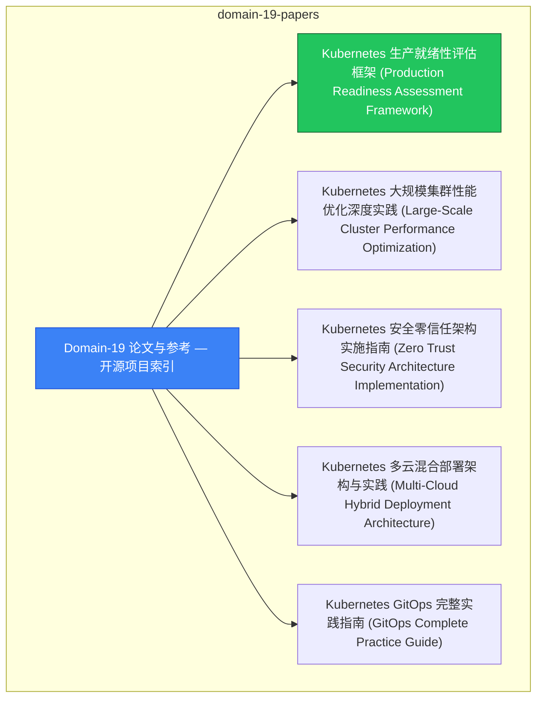

# domain-19-papers MOC

> **MOC 版本**: 1.0
> **知识域**: domain-19-papers
> **文档数量**: 27 篇
> **最后更新**: 2026-05-21
> **用途**: 本知识域的导航入口，汇总所有相关文档、关联领域、和场景入口

---

## 领域概述

论文阅读 — Kubernetes 相关学术论文和技术报告

### 知识域定位

| 维度 | 说明 |
|---|---|
| **知识域** | domain-19-papers |
| **文档数量** | 27 篇 |
| **难度分布** | 入门 0 / 进阶 0 / 高级 0 / 专家 0 |

---

## 文档清单

| # | 文档 | 难度 | 标签 | 估计阅读时间 |
|---|---|---|---|---|
| 1 | Domain-19 论文与参考 — 开源项目索引 |  | paper, research |  |
| 2 | Kubernetes 生产就绪性评估框架 (Production Readiness Assessment Framework) |  | paper, research, production |  |
| 3 | Kubernetes 大规模集群性能优化深度实践 (Large-Scale Cluster Performance Optimization) |  | paper, research, performance |  |
| 4 | Kubernetes 安全零信任架构实施指南 (Zero Trust Security Architecture Implementation) |  | paper, research, security |  |
| 5 | Kubernetes 多云混合部署架构与实践 (Multi-Cloud Hybrid Deployment Architecture) |  | paper, research, deployment |  |
| 6 | Kubernetes GitOps 完整实践指南 (GitOps Complete Practice Guide) |  | paper, research, guide |  |
| 7 | Kubernetes 成本治理与 FinOps 实践 (Kubernetes Cost Governance and FinOps Practice) |  | paper, research, daily-ops |  |
| 8 | Kubernetes 容器存储接口 (CSI) 深度实践指南 (Container Storage Interface Deep Practice Guide) |  | paper, research, storage |  |
| 9 | Kubernetes 网络策略与安全微隔离实践 (Network Policies and Security Micro-Segmentation Practice) |  | paper, research, security |  |
| 10 | Kubernetes 服务网格深度实践与Istio集成 (Service Mesh Deep Practice and Istio Integration) |  | paper, research |  |
| 11 | Kubernetes 自动化运维与SRE实践 (Automation and SRE Practices) |  | paper, research |  |
| 12 | Kubernetes API Server 深度优化与扩展 (API Server Deep Optimization and Extension) |  | paper, research |  |
| 13 | Kubernetes 调度器深度优化与自定义调度 (Scheduler Deep Optimization and Custom Scheduling) |  | paper, research |  |
| 14 | Kubernetes 多租户安全隔离与资源配额管理 (Multi-Tenancy Security Isolation and Resource Quota Management) |  | paper, research, security |  |
| 15 | Kubernetes 事件驱动架构与异步处理 (Event-Driven Architecture and Asynchronous Processing) |  | paper, research, architecture |  |
| 16 | Kubernetes 混沌工程与故障注入测试 (Chaos Engineering and Fault Injection Testing) |  | paper, research, troubleshooting |  |
| 17 | Kubernetes 边缘计算与KubeEdge实践 (Edge Computing and KubeEdge Practice) |  | paper, research |  |
| 18 | Kubernetes AI/ML GPU调度与LLM推理服务 (AI/ML GPU Scheduling and LLM Inference Serving) |  | paper, research |  |
| 19 | Kubernetes eBPF与Cilium深度实践 (eBPF and Cilium Deep Practice) |  | paper, research |  |
| 20 | Kubernetes Gateway API 与现代流量管理实践 |  | paper, research |  |
| 21 | Kubernetes 供应链安全实践 (Supply Chain Security: SBOM, SLSA, and Sigstore) |  | paper, research, security |  |
| 22 | Kubernetes 平台工程与内部开发者平台 (Platform Engineering and Internal Developer Platform) |  | paper, research |  |
| 23 | Kubernetes WebAssembly (Wasm) 工作负载实践 (WebAssembly Workloads on Kubernetes) |  | paper, research |  |
| 24 | Kubernetes OpenTelemetry 原生可观测性 (OpenTelemetry Native Observability) |  | paper, research, observability |  |
| 25 | Kubernetes 策略即代码与治理自动化 (Policy-as-Code and Governance Automation) |  | paper, research |  |
| 26 | GKE Autopilot 与 Google Cloud AI 基础设施 (GKE Autopilot and Google Cloud AI Infrastructure) |  | paper, research |  |
| 27 | Kubernetes vCluster 与虚拟集群多租户 (vCluster and Virtual Cluster Multi-Tenancy) |  | paper, research |  |

---

## 知识图谱

---

## 关联入口

| 入口 | 说明 |
|---|---|
| FTA 故障树 | domain-19-papers 相关故障树分析 |
| Skills 技能 | domain-19-papers 相关操作技能 |
| 深度研究入口 | 语料库索引与向量检索 |

---

## 统计信息

| 指标 | 数值 |
|---|---|
| 文档总数 | 27 |
| 覆盖 K8s 版本 | v1.25 - v1.32 |

---

*本文档由 scripts/generate-mocs.py 自动生成，最后更新 2026-05-21。*
