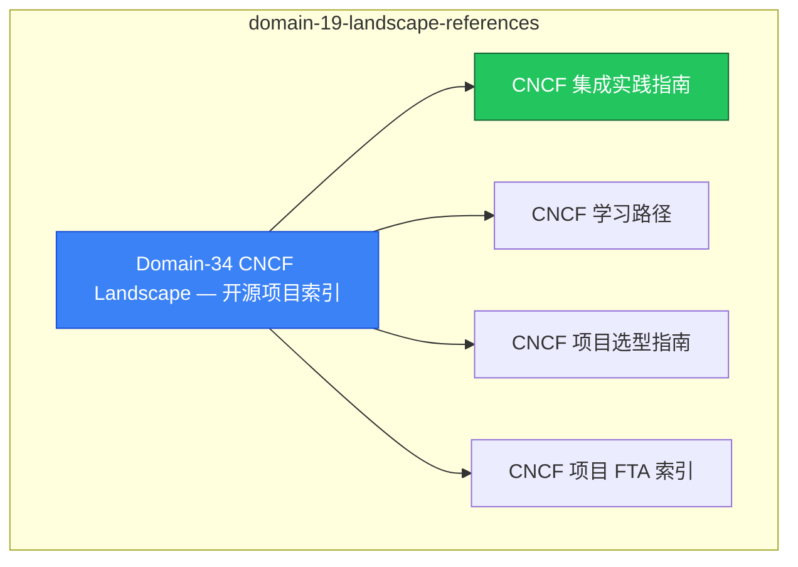

> **生产环境安全提示**
>
> 本文档包含可直接执行的运维命令。执行前请确认：当前目标集群与 Namespace 是否正确；是否具备足够的 RBAC 权限；是否已在非生产环境验证。命令风险等级标注：🔴 高风险（可能造成数据丢失或服务中断）、🟡 中风险（会修改集群状态，但通常可回滚）、🟢 低风险/只读（信息收集，无副作用）。

# domain-19-landscape-references MOC

> **MOC 版本**: 1.0
> **知识域**: domain-19-landscape-references
> **文档数量**: 5 篇
> **最后更新**: 2026-05-21
> **用途**: 本知识域的导航入口，汇总所有相关文档、关联领域、和场景入口

---

## 领域概述

CNCF 全景 — CNCF 项目生态、成熟度模型

### 知识域定位

| 维度 | 说明 |
|---|---|
| **知识域** | domain-19-landscape-references |
| **文档数量** | 5 篇 |
| **难度分布** | 入门 0 / 进阶 0 / 高级 0 / 专家 0 |

---

## 文档清单

| # | 文档 | 难度 | 标签 | 估计阅读时间 |
|---|---|---|---|---|
| 1 | Domain-34 CNCF Landscape — 开源项目索引 |  | cncf, ecosystem |  |
| 2 | CNCF 集成实践指南 |  | cncf, ecosystem, guide |  |
| 3 | CNCF 学习路径 |  | cncf, ecosystem, tutorial |  |
| 4 | CNCF 项目选型指南 |  | cncf, ecosystem, guide |  |
| 5 | CNCF 项目 FTA 索引 |  | cncf, ecosystem |  |

---

## 知识图谱

---

## 关联入口

| 入口 | 说明 |
|---|---|
| FTA 故障树 | domain-19-landscape-references 相关故障树分析 |
| Skills 技能 | domain-19-landscape-references 相关操作技能 |
| 深度研究入口 | 语料库索引与向量检索 |

---

## 统计信息

| 指标 | 数值 |
|---|---|
| 文档总数 | 5 |
| 覆盖 K8s 版本 | v1.25 - v1.32 |

---

*本文档由 scripts/generate-mocs.py 自动生成，最后更新 2026-05-21。*

## Related

- digest-2026-05-21-full

<!-- risk-assessed -->
