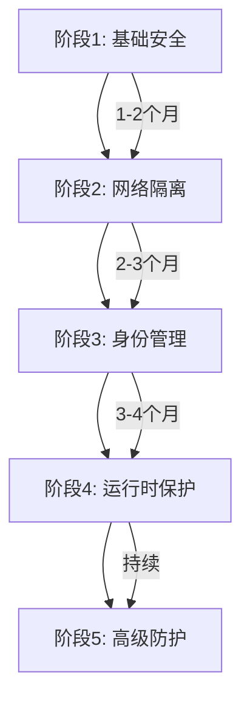

# Kubernetes 安全零信任架构实施指南 (Zero Trust Security Architecture Implementation)

> **作者**: Kubernetes安全架构专家 | **版本**: v1.2 | **更新时间**: 2026-02-07
> **适用场景**: 企业级安全合规要求 | **复杂度**: ⭐⭐⭐⭐⭐

## 🎯 摘要

本文档详细阐述了在Kubernetes环境中实施零信任安全架构的方法论和最佳实践，基于NIST零信任架构标准和企业级安全合规要求，提供从身份认证、网络微隔离到数据保护的全方位安全解决方案。

## 1. 零信任安全架构概述

### 1.1 零信任核心原则

```yaml
零信任基本原则:
  1. 从不信任，始终验证 (Never Trust, Always Verify)
  2. 最小权限访问 (Least Privilege Access)
  3. 假设 breach (Assume Breach)
  4. 持续验证 (Continuous Validation)
  5. 微隔离 (Micro-segmentation)
  6. 自动化响应 (Automated Response)
```

### 1.2 Kubernetes安全挑战

```markdown
## 🚨 主要安全风险

### 控制平面风险
- API Server未授权访问
- etcd数据泄露
- 控制平面组件漏洞

### 工作负载风险
- 容器逃逸攻击
- 恶意镜像部署
- 特权容器滥用

### 网络风险
- 横向移动攻击
- 服务间未授权访问
- 网络嗅探和中间人攻击

### 数据风险
- 敏感配置泄露
- 存储卷数据暴露
- 日志信息泄露
```

## 2. 身份认证与授权体系

### 2.1 多因素身份认证 (MFA)

#### OIDC集成配置
```yaml
# Dex OIDC Provider配置
apiVersion: v1
kind: ConfigMap
metadata:
  name: dex
  namespace: auth-system
data:
  config.yaml: |
    issuer: https://dex.kubernetes.local
    storage:
      type: kubernetes
      config:
        inCluster: true
    web:
      http: 0.0.0.0:5556
    connectors:
    - type: ldap
      name: LDAP
      id: ldap
      config:
        host: ldap.example.com:636
        insecureNoSSL: false
        bindDN: cn=admin,dc=example,dc=com
        bindPW: $LDAP_BIND_PW
        usernamePrompt: Username
        userSearch:
          baseDN: ou=People,dc=example,dc=com
          filter: "(objectClass=person)"
          username: uid
          idAttr: uid
          emailAttr: mail
          nameAttr: cn
    staticClients:
    - id: kubernetes
      redirectURIs:
      - 'http://localhost:8000/callback'
      name: 'Kubernetes'
      secret: $KUBERNETES_CLIENT_SECRET
```

#### Kubernetes API Server配置
```yaml
# API Server OIDC配置
apiVersion: v1
kind: Pod
metadata:
  name: kube-apiserver
spec:
  containers:
  - name: kube-apiserver
    command:
    - kube-apiserver
    - --oidc-issuer-url=https://dex.kubernetes.local
    - --oidc-client-id=kubernetes
    - --oidc-username-claim=email
    - --oidc-groups-claim=groups
    - --oidc-ca-file=/etc/kubernetes/pki/oidc-ca.crt
    - --authorization-mode=RBAC,Node
    - --authentication-token-webhook-config-file=/etc/kubernetes/webhook-config.yaml
```

### 2.2 细粒度RBAC策略

#### 分层权限模型
```yaml
# 企业级RBAC权限体系
apiVersion: rbac.authorization.k8s.io/v1
kind: ClusterRole
metadata:
  name: security-admin
rules:
- apiGroups: ["*"]
  resources: ["*"]
  verbs: ["get", "list", "watch"]
- apiGroups: [""]
  resources: ["secrets", "configmaps"]
  verbs: ["get", "list"]
- apiGroups: ["networking.k8s.io"]
  resources: ["networkpolicies"]
  verbs: ["*"]

---
apiVersion: rbac.authorization.k8s.io/v1
kind: RoleBinding
metadata:
  name: team-developers
  namespace: production
subjects:
- kind: Group
  name: developers
  apiGroup: rbac.authorization.k8s.io
roleRef:
  kind: Role
  name: pod-reader
  apiGroup: rbac.authorization.k8s.io
```

#### 动态权限管理
```bash
# 基于时间的权限控制脚本
#!/bin/bash
# role-rotation.sh - 动态权限轮换

CLUSTER_NAME="production"
NAMESPACE="finance"
USER="temp-developer"
HOURS_VALID=8

# 创建临时角色绑定
cat <<EOF | kubectl apply -f -
apiVersion: rbac.authorization.k8s.io/v1
kind: RoleBinding
metadata:
  name: temp-access-${USER}
  namespace: ${NAMESPACE}
  annotations:
    expiration: "$(date -d "+${HOURS_VALID} hours" -u +%Y-%m-%dT%H:%M:%SZ)"
subjects:
- kind: User
  name: ${USER}
  apiGroup: rbac.authorization.k8s.io
roleRef:
  kind: Role
  name: pod-reader
  apiGroup: rbac.authorization.k8s.io
EOF

# 设置定时清理任务
echo "0 */${HOURS_VALID} * * * kubectl delete rolebinding temp-access-${USER} -n ${NAMESPACE}" | crontab -
```

## 3. 网络微隔离与流量控制

### 3.1 网络策略实施

#### 默认拒绝策略
```yaml
# 默认网络策略 - 默认拒绝所有流量
apiVersion: networking.k8s.io/v1
kind: NetworkPolicy
metadata:
  name: default-deny-all
  namespace: production
spec:
  podSelector: {}
  policyTypes:
  - Ingress
  - Egress
```

#### 应用级网络策略
```yaml
# 微服务间通信策略
apiVersion: networking.k8s.io/v1
kind: NetworkPolicy
metadata:
  name: frontend-policy
  namespace: ecommerce
spec:
  podSelector:
    matchLabels:
      app: frontend
  policyTypes:
  - Ingress
  - Egress
  ingress:
  - from:
    - namespaceSelector:
        matchLabels:
          name: ingress-nginx
    - podSelector:
        matchLabels:
          app: api-gateway
    ports:
    - protocol: TCP
      port: 8080
  egress:
  - to:
    - podSelector:
        matchLabels:
          app: backend
    ports:
    - protocol: TCP
      port: 8080
  - to:
    - namespaceSelector:
        matchLabels:
          name: kube-system
    ports:
    - protocol: UDP
      port: 53  # DNS
```

### 3.2 服务网格安全

#### Istio安全配置
```yaml
# Istio安全策略配置
apiVersion: security.istio.io/v1beta1
kind: AuthorizationPolicy
metadata:
  name: frontend-authz
  namespace: ecommerce
spec:
  selector:
    matchLabels:
      app: frontend
  rules:
  - from:
    - source:
        principals: ["cluster.local/ns/ingress-nginx/sa/ingress-nginx"]
    to:
    - operation:
        methods: ["GET", "POST"]
        paths: ["/api/*"]
  - when:
    - key: request.auth.claims[groups]
      values: ["developers"]
```

#### mTLS配置
```yaml
# 启用服务间mTLS
apiVersion: security.istio.io/v1beta1
kind: PeerAuthentication
metadata:
  name: default
  namespace: istio-system
spec:
  mtls:
    mode: STRICT
---
apiVersion: networking.istio.io/v1alpha3
kind: DestinationRule
metadata:
  name: enable-mtls
  namespace: ecommerce
spec:
  host: "*.ecommerce.svc.cluster.local"
  trafficPolicy:
    tls:
      mode: ISTIO_MUTUAL
```

## 4. 镜像安全与供应链保护

### 4.1 镜像安全扫描

#### Trivy集成配置
```yaml
# Trivy Operator部署
apiVersion: v1
kind: Namespace
metadata:
  name: security-scanning
---
apiVersion: apps/v1
kind: Deployment
metadata:
  name: trivy-operator
  namespace: security-scanning
spec:
  replicas: 1
  selector:
    matchLabels:
      app: trivy-operator
  template:
    metadata:
      labels:
        app: trivy-operator
    spec:
      serviceAccountName: trivy-operator
      containers:
      - name: trivy-operator
        image: aquasec/trivy-operator:0.16.0
        env:
        - name: OPERATOR_NAMESPACE
          valueFrom:
            fieldRef:
              fieldPath: metadata.namespace
        - name: OPERATOR_TARGET_NAMESPACES
          value: "production,development"
        - name: OPERATOR_SCAN_JOB_TIMEOUT
          value: "5m"
        - name: OPERATOR_CONCURRENCY
          value: "3"
        - name: OPERATOR_VULNERABILITY_SCANNER_ENABLED
          value: "true"
        - name: OPERATOR_CONFIG_AUDIT_SCANNER_ENABLED
          value: "true"
```

#### 镜像签名验证
```yaml
# Cosign签名验证策略
apiVersion: policy.sigstore.dev/v1beta1
kind: ClusterImagePolicy
metadata:
  name: image-policy
spec:
  images:
  - glob: "gcr.io/your-project/*"
  - glob: "docker.io/your-company/*"
  authorities:
  - key:
      kms: gcpkms://projects/your-project/locations/global/keyRings/sigstore/cryptoKeys/sigstore-key
    ctlog:
      url: https://rekor.sigstore.dev
```

### 4.2 私有镜像仓库安全

```yaml
# Harbor镜像仓库安全配置
apiVersion: v1
kind: Secret
metadata:
  name: harbor-credentials
  namespace: production
type: kubernetes.io/dockerconfigjson
data:
  .dockerconfigjson: <base64-encoded-config>

---
apiVersion: apps/v1
kind: Deployment
spec:
  template:
    spec:
      imagePullSecrets:
      - name: harbor-credentials
      containers:
      - name: app
        image: harbor.internal/your-app:v1.2.3
        securityContext:
          readOnlyRootFilesystem: true
          runAsNonRoot: true
          runAsUser: 10001
          allowPrivilegeEscalation: false
          capabilities:
            drop:
            - ALL
```

## 5. 运行时安全防护

### 5.1 Pod安全策略

#### Pod安全标准实施
```yaml
# Pod安全准入配置
apiVersion: admissionregistration.k8s.io/v1
kind: ValidatingWebhookConfiguration
metadata:
  name: pod-security-validation
webhooks:
- name: pod-security.k8s.io
  clientConfig:
    service:
      name: pod-security-webhook
      namespace: kube-system
      path: "/validate"
  rules:
  - apiGroups: [""]
    apiVersions: ["v1"]
    operations: ["CREATE", "UPDATE"]
    resources: ["pods"]
  admissionReviewVersions: ["v1"]
  sideEffects: None
  timeoutSeconds: 5
```

#### 安全上下文配置
```yaml
# 安全的Pod配置示例
apiVersion: v1
kind: Pod
metadata:
  name: secure-app
spec:
  securityContext:
    runAsNonRoot: true
    runAsUser: 10001
    fsGroup: 2000
    seccompProfile:
      type: RuntimeDefault
  containers:
  - name: app
    image: your-app:secure-latest
    securityContext:
      readOnlyRootFilesystem: true
      allowPrivilegeEscalation: false
      runAsNonRoot: true
      capabilities:
        drop:
        - ALL
        add:
        - NET_BIND_SERVICE
    ports:
    - containerPort: 8080
      protocol: TCP
    resources:
      requests:
        memory: "64Mi"
        cpu: "250m"
      limits:
        memory: "128Mi"
        cpu: "500m"
```

### 5.2 运行时异常检测

#### Falco规则配置
```yaml
# Falco安全规则
- rule: Detect crypto miners
  desc: Detection of crypto mining activity
  condition: >
    spawned_process and proc.name in (xmrig, ccminer, cgminer) 
    and not proc.pname in (docker, containerd)
  output: >
    Crypto miner detected (user=%user.name command=%proc.cmdline pid=%proc.pid parent=%proc.pname)
  priority: CRITICAL
  tags: [process, mitre_execution]

- rule: Detect privilege escalation
  desc: Detection of privilege escalation attempts
  condition: >
    spawned_process and proc.pname in (sudo, su) 
    and user.uid != 0 
    and proc.cmdline contains "bash"
  output: >
    Privilege escalation attempt detected (user=%user.name command=%proc.cmdline)
  priority: HIGH
  tags: [process, mitre_privilege_escalation]
```

## 6. 数据保护与加密

### 6.1 敏感数据保护

#### Secret加密存储
```yaml
# 加密的Secret配置
apiVersion: v1
kind: Secret
metadata:
  name: database-credentials
  namespace: production
type: Opaque
data:
  username: <base64-encoded-username>
  password: <base64-encoded-password-encrypted-with-kms>
---
apiVersion: apps/v1
kind: Deployment
spec:
  template:
    spec:
      containers:
      - name: app
        env:
        - name: DB_PASSWORD
          valueFrom:
            secretKeyRef:
              name: database-credentials
              key: password
        # 启用内存加密
        securityContext:
          readOnlyRootFilesystem: true
```

#### 配置加密
```bash
# 使用KMS加密敏感配置
#!/bin/bash
# encrypt-config.sh

KMS_KEY_ID="projects/your-project/locations/global/keyRings/cluster-keys/cryptoKeys/config-key"

# 加密敏感配置
echo "sensitive-data" | gcloud kms encrypt \
  --plaintext-file=- \
  --ciphertext-file=- \
  --key $KMS_KEY_ID | base64 > encrypted-config.b64

# 在应用中解密使用
kubectl create secret generic app-config \
  --from-file=encrypted-config.b64
```

### 6.2 存储加密

```yaml
# 加密存储类配置
apiVersion: storage.k8s.io/v1
kind: StorageClass
metadata:
  name: encrypted-fast
provisioner: kubernetes.io/aws-ebs
parameters:
  type: gp3
  encrypted: "true"
  kmsKeyId: "arn:aws:kms:us-west-2:123456789012:key/12345678-1234-1234-1234-123456789012"
reclaimPolicy: Delete
allowVolumeExpansion: true
volumeBindingMode: WaitForFirstConsumer
mountOptions:
  - discard
```

## 7. 安全监控与响应

### 7.1 安全事件监控

#### Prometheus安全指标
```yaml
# 安全相关监控指标配置
apiVersion: monitoring.coreos.com/v1
kind: ServiceMonitor
metadata:
  name: security-monitoring
  namespace: monitoring
spec:
  selector:
    matchLabels:
      app: security-tools
  endpoints:
  - port: metrics
    path: /metrics
    interval: 30s
    relabelings:
    - sourceLabels: [__name__]
      regex: 'security_(.*)'
      targetLabel: __name__
```

#### 关键安全指标
```prometheus
# 重要安全监控指标
# 异常认证尝试
rate(authentication_failures_total[5m]) > 10

# 权限提升事件
increase(privilege_escalation_attempts_total[1h]) > 0

# 网络策略违规
increase(network_policy_violations_total[10m]) > 5

# 容器安全违规
container_security_violations > 0
```

### 7.2 自动化响应机制

#### 安全事件响应脚本
```python
#!/usr/bin/env python3
# security-response.py - 自动化安全响应

import requests
import json
import logging
from kubernetes import client, config

class SecurityResponse:
    def __init__(self):
        config.load_incluster_config()
        self.v1 = client.CoreV1Api()
        self.logging = logging.getLogger(__name__)
    
    def isolate_compromised_pod(self, namespace, pod_name):
        """隔离被攻破的Pod"""
        try:
            # 1. 添加隔离标签
            body = {
                "metadata": {
                    "labels": {
                        "security-status": "compromised",
                        "isolated": "true"
                    }
                }
            }
            self.v1.patch_namespaced_pod(pod_name, namespace, body)
            
            # 2. 应用网络隔离策略
            network_policy = {
                "apiVersion": "networking.k8s.io/v1",
                "kind": "NetworkPolicy",
                "metadata": {
                    "name": f"isolate-{pod_name}"
                },
                "spec": {
                    "podSelector": {
                        "matchLabels": {"app": pod_name}
                    },
                    "policyTypes": ["Ingress", "Egress"]
                }
            }
            
            # 3. 通知安全团队
            self.notify_security_team(namespace, pod_name)
            
        except Exception as e:
            self.logging.error(f"隔离Pod失败: {e}")
    
    def notify_security_team(self, namespace, pod_name):
        """通知安全团队"""
        webhook_url = "https://hooks.slack.com/services/YOUR/SLACK/WEBHOOK"
        message = {
            "text": f"🚨 安全告警: 命名空间 {namespace} 中的Pod {pod_name} 可能已被攻破"
        }
        requests.post(webhook_url, json=message)

if __name__ == "__main__":
    response = SecurityResponse()
    # 示例调用
    response.isolate_compromised_pod("production", "vulnerable-app-12345")
```

## 8. 合规性与审计

### 8.1 CIS基准合规检查

```bash
# 自动化CIS合规检查
#!/bin/bash
# cis-compliance-check.sh

echo "=== Kubernetes CIS Benchmark Compliance Check ==="

# 使用kube-bench进行检查
kube-bench run --targets master,node,controlplane,policies \
  --outputfile cis-report.json \
  --output json

# 分析结果
python3 -c "
import json
with open('cis-report.json') as f:
    data = json.load(f)
    
failed_checks = [check for check in data['Controls'] if check['status'] == 'FAIL']
print(f'失败检查项: {len(failed_checks)}')
for check in failed_checks:
    print(f'- {check[\"id\"]}: {check[\"text\"]}')
"
```

### 8.2 审计日志配置

```yaml
# 高级审计配置
apiVersion: audit.k8s.io/v1
kind: Policy
rules:
- level: RequestResponse
  resources:
  - group: ""
    resources: ["pods", "secrets", "configmaps"]
  verbs: ["create", "update", "delete", "patch"]
  userGroups: ["system:authenticated"]

- level: Metadata
  resources:
  - group: "rbac.authorization.k8s.io"
    resources: ["roles", "rolebindings", "clusterroles", "clusterrolebindings"]
  verbs: ["create", "update", "delete"]

- level: None
  users: ["system:kube-proxy"]
  verbs: ["watch"]

---
apiVersion: v1
kind: Pod
metadata:
  name: kube-apiserver
spec:
  containers:
  - name: kube-apiserver
    command:
    - kube-apiserver
    - --audit-policy-file=/etc/kubernetes/audit/policy.yaml
    - --audit-log-path=/var/log/kubernetes/audit.log
    - --audit-log-maxage=30
    - --audit-log-maxbackup=10
    - --audit-log-maxsize=100
```

## 9. 实施路线图

### 9.1 分阶段实施计划



### 9.2 成熟度评估模型

```yaml
安全成熟度等级:
  Level 1 - 基础防护:
    ✓ 基本RBAC配置
    ✓ 网络策略实施
    ✓ 镜像安全扫描
    安全评分: 60-70分
  
  Level 2 - 标准防护:
    ✓ 零信任架构实施
    ✓ 全面监控告警
    ✓ 自动化响应机制
    ✓ 合规性检查
    安全评分: 80-85分
  
  Level 3 - 高级防护:
    ✓ AI驱动威胁检测
    ✓ 预测性安全防护
    ✓ 自适应安全策略
    ✓ 全面零信任实施
    安全评分: 90-95分
```

## 10. 最佳实践总结

### 10.1 安全实施原则

```markdown
## 🔐 核心安全原则

1. **纵深防御** - 多层次安全防护
2. **最小权限** - 权限最小化原则
3. **持续验证** - 动态安全验证
4. **自动化响应** - 快速威胁响应
5. **可见性优先** - 全面安全监控
6. **合规驱动** - 标准规范遵循
```

### 10.2 安全检查清单

```yaml
零信任安全检查清单:
  身份认证:
    ☐ 多因素认证已实施
    ☐ OIDC集成已完成
    ☐ 服务账户轮换机制
    ☐ 临时访问权限管理
  
  网络安全:
    ☐ 默认拒绝策略实施
    ☐ 微隔离策略配置
    ☐ 服务网格mTLS启用
    ☐ 网络流量监控部署
  
  镜像安全:
    ☐ 私有镜像仓库部署
    ☐ 自动化安全扫描
    ☐ 镜像签名验证
    ☐ 供应链安全控制
  
  运行时安全:
    ☐ Pod安全策略实施
    ☐ 运行时异常检测
    ☐ 容器逃逸防护
    ☐ 文件完整性监控
  
  数据保护:
    ☐ 敏感数据加密
    ☐ 存储加密配置
    ☐ 密钥管理集成
    ☐ 数据泄露防护
  
  监控响应:
    ☐ 安全事件监控
    ☐ 自动化响应机制
    ☐ 威胁情报集成
    ☐ 安全态势感知
```

---
*本文档基于企业级安全实践经验编写，符合NIST、ISO 27001等国际安全标准。建议定期进行安全评估和更新。*