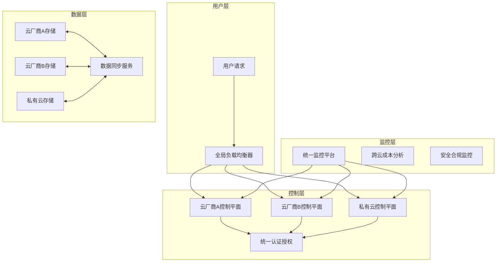

# Kubernetes 多云混合部署架构与实践 (Multi-Cloud Hybrid Deployment Architecture)

> **作者**: 云原生架构专家 | **版本**: v1.3 | **更新时间**: 2026-02-07
> **适用场景**: 企业级多云战略实施 | **复杂度**: ⭐⭐⭐⭐⭐

## 🎯 摘要

本文档深入探讨了Kubernetes多云混合部署的架构设计、技术实现和运维管理策略，基于大型企业多云环境的实际案例，提供从架构规划到落地实施的完整解决方案，帮助企业实现云厂商锁定避免、成本优化和业务连续性保障。

## 1. 多云混合部署概述

### 1.1 多云战略价值

```yaml
多云部署核心价值:
  业务连续性:
    ✓ 避免单云厂商故障影响
    ✓ 跨区域容灾能力
    ✓ 业务不中断保障
  
  成本优化:
    ✓ 云厂商价格竞争
    ✓ 计算资源弹性调配
    ✓ 避免厂商绑定溢价
  
  技术创新:
    ✓ 最佳技术栈组合
    ✓ 新服务快速采用
    ✓ 架构演进灵活性
```

### 1.2 部署模式分类

```markdown
## 🏗️ 多云部署模式

### 1. 主备模式 (Active-Standby)
- 一个云环境处理全部流量
- 另一个云环境保持待机状态
- 适合灾备和迁移场景

### 2. 主主模式 (Active-Active)
- 多个云环境同时处理流量
- 负载均衡分发请求
- 最大化资源利用率

### 3. 混合模式 (Hybrid)
- 部分服务部署在公有云
- 核心数据保留在私有云
- 满足合规和数据主权要求
```

## 2. 架构设计原则

### 2.1 核心设计原则

```yaml
多云架构设计原则:
  1. 抽象化云厂商差异
     - 统一API接口层
     - 标准化资源配置
     - 屏蔽底层实现细节
  
  2. 状态无服务器设计
     - 无状态应用优先
     - 外部化状态管理
     - 会话数据集中存储
  
  3. 标准化部署流程
     - 声明式配置管理
     - GitOps流水线
     - 基础设施即代码
  
  4. 统一监控治理
     - 集中化监控平台
     - 统一告警策略
     - 跨云成本分析
```

### 2.2 技术架构图



## 3. 核心技术实现

### 3.1 统一集群管理

#### Cluster API多云管理
```yaml
# Cluster API配置示例
apiVersion: cluster.x-k8s.io/v1beta1
kind: Cluster
metadata:
  name: multi-cloud-cluster
spec:
  clusterNetwork:
    services:
      cidrBlocks: ["10.128.0.0/12"]
    pods:
      cidrBlocks: ["192.168.0.0/16"]
    serviceDomain: "cluster.local"
  infrastructureRef:
    apiVersion: infrastructure.cluster.x-k8s.io/v1beta1
    kind: AWSCluster
    name: aws-cluster
  controlPlaneRef:
    apiVersion: controlplane.cluster.x-k8s.io/v1beta1
    kind: KubeadmControlPlane
    name: control-plane

---
apiVersion: infrastructure.cluster.x-k8s.io/v1beta1
kind: AWSCluster
metadata:
  name: aws-cluster
spec:
  region: us-west-2
  sshKeyName: multi-cloud-key

---
apiVersion: infrastructure.cluster.x-k8s.io/v1beta1
kind: AzureCluster
metadata:
  name: azure-cluster
spec:
  location: eastus
  subscriptionID: "your-subscription-id"
```

#### Rancher多集群管理
```yaml
# Rancher多集群配置
apiVersion: management.cattle.io/v3
kind: Cluster
metadata:
  name: aws-production
spec:
  displayName: "AWS Production Cluster"
  description: "Production cluster on AWS"
  internal: false
  k3sConfig:
    serverConcurrency: 2
    workerConcurrency: 2
  localClusterAuthEndpoint:
    enabled: true
    fqdn: "rancher.example.com"

---
apiVersion: management.cattle.io/v3
kind: Cluster
metadata:
  name: gcp-staging
spec:
  displayName: "GCP Staging Cluster"
  description: "Staging cluster on GCP"
  googleKubernetesEngineConfig:
    clusterName: staging-cluster
    projectID: your-gcp-project
    zone: us-central1-a
    masterVersion: "1.28.5"
```

### 3.2 跨云网络连接

#### 专线和VPN配置
```yaml
# AWS Direct Connect配置
apiVersion: networking.aws.crossplane.io/v1alpha1
kind: DirectConnectConnection
metadata:
  name: aws-direct-connect
spec:
  forProvider:
    region: us-west-2
    location: "Your AWS Direct Connect location"
    bandwidth: "10Gbps"
    connectionName: "Multi-Cloud-Connection"

---
# Google Cloud Interconnect配置
apiVersion: compute.cnrm.cloud.google.com/v1beta1
kind: ComputeInterconnectAttachment
metadata:
  name: gcp-interconnect
spec:
  location: "https://www.googleapis.com/compute/v1/projects/your-project/locations/us-west2"
  type: "DEDICATED"
  routerRef:
    name: "multi-cloud-router"
```

#### 服务网格跨云部署
```yaml
# Istio跨集群服务发现
apiVersion: install.istio.io/v1alpha1
kind: IstioOperator
metadata:
  name: controlplane-primary
  namespace: istio-system
spec:
  components:
    base:
      enabled: true
    pilot:
      enabled: true
    ingressGateways:
    - name: ingressgateway
      enabled: true
  meshConfig:
    defaultConfig:
      discoveryAddress: "istiod.istio-system.svc:15012"
    multiCluster:
      clusterName: "primary-cluster"
      centralIstiod: true
---
apiVersion: install.istio.io/v1alpha1
kind: IstioOperator
metadata:
  name: remote-config
  namespace: istio-system
spec:
  profile: remote
  values:
    global:
      multiCluster:
        clusterName: "remote-cluster"
      remotePilotAddress: "istiod.istio-system.svc.cluster.local"
```

### 3.3 数据同步策略

#### 跨云数据库同步
```yaml
# Vitess跨云数据库集群
apiVersion: planetscale.com/v2
kind: VitessCluster
metadata:
  name: multi-cloud-vitess
spec:
  cells:
  - name: aws-us-west
    gateway:
      authentication:
        static:
          secret:
            name: vitess-auth
            key: users.json
    mysqlProtocol:
      enabled: true
      authPlugin: mysql_native_password
    zone: us-west-2a
  
  - name: gcp-us-central
    gateway:
      authentication:
        static:
          secret:
            name: vitess-auth
            key: users.json
    mysqlProtocol:
      enabled: true
    zone: us-central1-a
  
  vitessDashboard:
    cells:
    - aws-us-west
    - gcp-us-central
```

#### 对象存储跨云同步
```python
#!/usr/bin/env python3
# cross-cloud-storage-sync.py

import boto3
from google.cloud import storage
import os
import logging

class CrossCloudStorageSync:
    def __init__(self):
        # AWS S3客户端
        self.s3_client = boto3.client('s3')
        # GCP Storage客户端
        self.gcs_client = storage.Client()
        self.logger = logging.getLogger(__name__)
    
    def sync_bucket_to_gcs(self, aws_bucket, gcp_bucket, prefix=""):
        """同步AWS S3到GCP Storage"""
        try:
            # 列出S3对象
            response = self.s3_client.list_objects_v2(
                Bucket=aws_bucket,
                Prefix=prefix
            )
            
            for obj in response.get('Contents', []):
                key = obj['Key']
                # 下载S3对象
                s3_obj = self.s3_client.get_object(Bucket=aws_bucket, Key=key)
                
                # 上传到GCS
                gcs_bucket = self.gcs_client.bucket(gcp_bucket)
                blob = gcs_bucket.blob(key)
                blob.upload_from_file(s3_obj['Body'])
                
                self.logger.info(f"同步完成: {key}")
                
        except Exception as e:
            self.logger.error(f"同步失败: {e}")
    
    def setup_continuous_sync(self):
        """设置持续同步"""
        import schedule
        import time
        
        schedule.every(10).minutes.do(
            self.sync_bucket_to_gcs,
            'source-bucket',
            'destination-bucket'
        )
        
        while True:
            schedule.run_pending()
            time.sleep(1)

if __name__ == "__main__":
    sync = CrossCloudStorageSync()
    sync.setup_continuous_sync()
```

## 4. 部署策略与最佳实践

### 4.1 应用部署策略

#### 蓝绿部署跨云
```yaml
# 蓝绿部署配置
apiVersion: apps/v1
kind: Deployment
metadata:
  name: app-blue
  namespace: production
spec:
  replicas: 10
  selector:
    matchLabels:
      app: myapp
      version: blue
  template:
    metadata:
      labels:
        app: myapp
        version: blue
    spec:
      containers:
      - name: app
        image: myapp:v1.2.0
        ports:
        - containerPort: 8080

---
apiVersion: apps/v1
kind: Deployment
metadata:
  name: app-green
  namespace: production
spec:
  replicas: 0  # 初始为0
  selector:
    matchLabels:
      app: myapp
      version: green
  template:
    metadata:
      labels:
        app: myapp
        version: green
    spec:
      containers:
      - name: app
        image: myapp:v1.3.0
        ports:
        - containerPort: 8080
```

#### 金丝雀发布策略
```yaml
# Istio金丝雀发布
apiVersion: networking.istio.io/v1alpha3
kind: VirtualService
metadata:
  name: app-canary
  namespace: production
spec:
  hosts:
  - app.production.svc.cluster.local
  http:
  - route:
    - destination:
        host: app
        subset: v1
      weight: 90
    - destination:
        host: app
        subset: v2
      weight: 10
---
apiVersion: networking.istio.io/v1alpha3
kind: DestinationRule
metadata:
  name: app-destination
  namespace: production
spec:
  host: app
  subsets:
  - name: v1
    labels:
      version: v1.2.0
  - name: v2
    labels:
      version: v1.3.0
```

### 4.2 成本优化策略

#### 跨云资源调度
```yaml
# 自动化成本优化调度器
apiVersion: apps/v1
kind: Deployment
metadata:
  name: cost-optimizer
  namespace: kube-system
spec:
  replicas: 1
  selector:
    matchLabels:
      app: cost-optimizer
  template:
    metadata:
      labels:
        app: cost-optimizer
    spec:
      serviceAccountName: cost-optimizer
      containers:
      - name: optimizer
        image: your-registry/cost-optimizer:latest
        env:
        - name: AWS_ACCESS_KEY_ID
          valueFrom:
            secretKeyRef:
              name: cloud-credentials
              key: aws-access-key
        - name: AWS_SECRET_ACCESS_KEY
          valueFrom:
            secretKeyRef:
              name: cloud-credentials
              key: aws-secret-key
        - name: GCP_SERVICE_ACCOUNT_KEY
          valueFrom:
            secretKeyRef:
              name: cloud-credentials
              key: gcp-key
```

#### 成本分析脚本
```python
#!/usr/bin/env python3
# multi-cloud-cost-analyzer.py

import boto3
import google.auth
from google.cloud import billing
import pandas as pd
import matplotlib.pyplot as plt

class MultiCloudCostAnalyzer:
    def __init__(self):
        # AWS成本管理
        self.aws_client = boto3.client('ce')
        # GCP计费客户端
        credentials, project = google.auth.default()
        self.gcp_client = billing.CloudBillingClient(credentials=credentials)
    
    def get_aws_costs(self, start_date, end_date):
        """获取AWS成本数据"""
        response = self.aws_client.get_cost_and_usage(
            TimePeriod={
                'Start': start_date,
                'End': end_date
            },
            Granularity='DAILY',
            Metrics=['UNBLENDEDCOST'],
            GroupBy=[
                {
                    'Type': 'DIMENSION',
                    'Key': 'SERVICE'
                }
            ]
        )
        return response['ResultsByTime']
    
    def get_gcp_costs(self, project_id, start_date, end_date):
        """获取GCP成本数据"""
        # 实现GCP成本查询逻辑
        pass
    
    def generate_cost_report(self):
        """生成跨云成本报告"""
        aws_costs = self.get_aws_costs('2024-01-01', '2024-01-31')
        gcp_costs = self.get_gcp_costs('your-project', '2024-01-01', '2024-01-31')
        
        # 数据处理和可视化
        df = pd.DataFrame({
            'Cloud': ['AWS', 'GCP'],
            'Cost': [sum_aws_costs, sum_gcp_costs]
        })
        
        # 生成图表
        plt.figure(figsize=(10, 6))
        plt.bar(df['Cloud'], df['Cost'])
        plt.title('Multi-Cloud Cost Analysis')
        plt.ylabel('Cost ($)')
        plt.savefig('cost-analysis.png')

if __name__ == "__main__":
    analyzer = MultiCloudCostAnalyzer()
    analyzer.generate_cost_report()
```

## 5. 监控与运维管理

### 5.1 统一监控平台

#### Prometheus联邦集群
```yaml
# Prometheus联邦配置
apiVersion: monitoring.coreos.com/v1
kind: Prometheus
metadata:
  name: federated-prometheus
  namespace: monitoring
spec:
  externalLabels:
    cluster: federated
  remoteRead:
  - url: http://prometheus-aws.monitoring.svc:9090/api/v1/read
    readRecent: true
  - url: http://prometheus-gcp.monitoring.svc:9090/api/v1/read
    readRecent: true
  - url: http://prometheus-azure.monitoring.svc:9090/api/v1/read
    readRecent: true
```

#### 跨云日志收集
```yaml
# Fluentd跨云日志收集
apiVersion: v1
kind: ConfigMap
metadata:
  name: fluentd-config
  namespace: logging
data:
  fluent.conf: |
    <source>
      @type forward
      port 24224
      bind 0.0.0.0
    </source>
    
    <match **>
      @type elasticsearch
      host elasticsearch.logging.svc
      port 9200
      logstash_format true
      logstash_prefix "multi-cloud-logs"
      <buffer>
        @type file
        path /var/log/fluentd-buffers
        flush_mode interval
        flush_interval 5s
      </buffer>
    </match>
```

### 5.2 故障切换与容灾

#### 自动故障检测
```python
#!/usr/bin/env python3
# multi-cloud-failover.py

import requests
import time
import logging
from kubernetes import client, config

class MultiCloudFailover:
    def __init__(self):
        config.load_incluster_config()
        self.v1 = client.CoreV1Api()
        self.apps_v1 = client.AppsV1Api()
        self.logger = logging.getLogger(__name__)
    
    def check_cluster_health(self, cluster_endpoint):
        """检查集群健康状态"""
        try:
            response = requests.get(
                f"https://{cluster_endpoint}/healthz",
                timeout=5,
                verify=False
            )
            return response.status_code == 200
        except Exception as e:
            self.logger.error(f"集群健康检查失败: {e}")
            return False
    
    def trigger_failover(self, primary_cluster, backup_cluster):
        """触发故障切换"""
        # 1. 检查主集群状态
        if self.check_cluster_health(primary_cluster):
            self.logger.info("主集群健康，无需切换")
            return
        
        self.logger.warning("主集群故障，开始故障切换")
        
        # 2. 增加备集群副本数
        deployment = self.apps_v1.read_namespaced_deployment(
            name="app-deployment",
            namespace="production"
        )
        deployment.spec.replicas = 20  # 增加到20个副本
        self.apps_v1.patch_namespaced_deployment(
            name="app-deployment",
            namespace="production",
            body=deployment
        )
        
        # 3. 更新DNS记录指向备集群
        self.update_dns_record(backup_cluster)
        
        self.logger.info("故障切换完成")
    
    def update_dns_record(self, new_endpoint):
        """更新DNS记录"""
        # 实现DNS更新逻辑
        pass

if __name__ == "__main__":
    failover = MultiCloudFailover()
    
    # 定期检查集群状态
    while True:
        failover.trigger_failover(
            "primary-cluster.example.com",
            "backup-cluster.example.com"
        )
        time.sleep(60)  # 每分钟检查一次
```

## 6. 安全与合规管理

### 6.1 统一身份认证

#### 跨云身份联邦
```yaml
# AWS与GCP身份联邦配置
apiVersion: v1
kind: ConfigMap
metadata:
  name: identity-federation
  namespace: security
data:
  aws-oidc-config.json: |
    {
      "issuer": "https://sts.amazonaws.com/",
      "jwks_uri": "https://sts.amazonaws.com/idp-cert",
      "authorization_endpoint": "https://signin.aws.amazon.com/oauth2/authorize"
    }
  
  gcp-oidc-config.json: |
    {
      "issuer": "https://accounts.google.com",
      "jwks_uri": "https://www.googleapis.com/oauth2/v3/certs",
      "authorization_endpoint": "https://accounts.google.com/o/oauth2/v2/auth"
    }
```

### 6.2 合规性管理

```yaml
# 多云合规性检查配置
apiVersion: policy/v1
kind: CompliancePolicy
metadata:
  name: multi-cloud-compliance
spec:
  clouds:
  - name: aws
    regions:
    - us-west-2
    - eu-west-1
    compliance:
    - standard: SOC2
      required: true
    - standard: HIPAA
      required: false
  
  - name: gcp
    regions:
    - us-central1
    - europe-west1
    compliance:
    - standard: SOC2
      required: true
    - standard: GDPR
      required: true
```

## 7. 实际案例分析

### 7.1 金融行业多云部署

```yaml
案例背景:
  行业: 金融服务
  规模: 5000+节点
  要求: 
    - 99.99%可用性
    - 严格合规要求
    - 数据主权保护

架构方案:
  部署模式: 主主模式
  云厂商: AWS + GCP + Azure
  核心组件:
    - Rancher统一管理
    - Istio服务网格
    - Vault密钥管理
    - Prometheus监控

实施效果:
  可用性: 99.995%
  成本节约: 25%
  故障恢复时间: < 5分钟
```

### 7.2 电商平台混合云部署

```bash
# 电商平台多云部署脚本
#!/bin/bash
# ecommerce-multi-cloud-deploy.sh

set -e

# 配置变量
AWS_REGION="us-west-2"
GCP_REGION="us-central1"
AZURE_REGION="eastus"

# 部署到AWS
echo "部署到AWS..."
kubectl config use-context aws-production
helm upgrade --install ecommerce ./charts/ecommerce \
  --set cloud.provider=aws \
  --set region=${AWS_REGION} \
  --set replicaCount=20

# 部署到GCP
echo "部署到GCP..."
kubectl config use-context gcp-production
helm upgrade --install ecommerce ./charts/ecommerce \
  --set cloud.provider=gcp \
  --set region=${GCP_REGION} \
  --set replicaCount=15

# 部署到Azure
echo "部署到Azure..."
kubectl config use-context azure-production
helm upgrade --install ecommerce ./charts/ecommerce \
  --set cloud.provider=azure \
  --set region=${AZURE_REGION} \
  --set replicaCount=10

# 配置全局负载均衡
echo "配置全局负载均衡..."
kubectl apply -f global-loadbalancer.yaml
```

## 8. 最佳实践总结

### 8.1 实施建议

```markdown
## 📋 多云部署实施建议

### 阶段一：准备阶段 (1-2个月)
1. 评估现有架构和应用适配性
2. 选择合适的多云管理平台
3. 建立跨云网络连接
4. 制定迁移和部署策略

### 阶段二：试点部署 (2-3个月)
1. 选择非核心业务进行试点
2. 验证跨云部署流程
3. 建立监控和告警体系
4. 完善运维文档和流程

### 阶段三：全面推广 (3-6个月)
1. 逐步迁移核心业务
2. 优化成本和性能
3. 建立自动化运维体系
4. 完善安全和合规措施

### 阶段四：持续优化 (持续)
1. 定期评估和优化架构
2. 跟踪新技术和最佳实践
3. 持续改进运维流程
4. 扩展多云能力边界
```

### 8.2 关键成功因素

```yaml
多云部署成功要素:
  技术因素:
    ✓ 标准化和抽象化设计
    ✓ 自动化部署和运维
    ✓ 完善的监控和告警
    ✓ 健壮的故障恢复机制
  
  组织因素:
    ✓ 跨团队协作机制
    ✓ 专业技能培养
    ✓ 流程和规范建立
    ✓ 持续改进文化
  
  管理因素:
    ✓ 明确的业务目标
    ✓ 合理的投入产出比
    ✓ 风险管控措施
    ✓ 绩效评估体系
```

## 9. 未来发展趋势

### 9.1 技术演进方向

```yaml
多云技术发展趋势:
  1. 统一API和标准
     - Kubernetes成为事实标准
     - 云原生接口统一化
     - 跨云资源抽象层
  
  2. 智能化运维
     - AI驱动的成本优化
     - 自动化故障预测
     - 智能资源调度
  
  3. 边缘计算融合
     - 多云+边缘协同
     - 5G网络集成
     - 实时数据处理
```

---
*本文档基于大型企业多云部署实践经验编写，持续更新最新技术和最佳实践。*